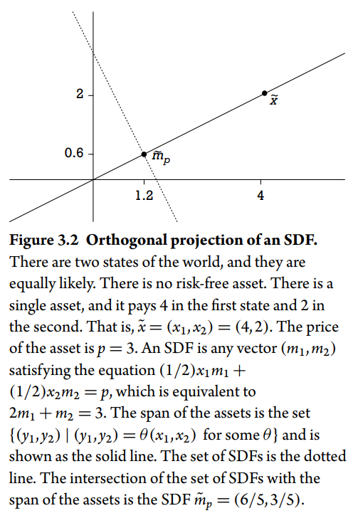

# Stochastic Discount Factors

**Source**: *Asset Pricing and Portfolio choice theory*, Kerry E. Back, 2017, Chapter 3

**Contents**

3.1 Basic Relationships Regarding SDFs 

3.2 Arbitrage, the Law of One Price, and Existence of SDFs 

3.3 Complete Markets and Uniqueness of the SDF 

3.4 Risk-Neutral Probabilities 

3.5 Orthogonal Projections of SDFs onto the Asset Span

3.6 Hansen-Jagannathan Bounds 

3.7 Hedging and Optimal Portfolios with Quadratic Utility

3.8 Hilbert Spaces and Gram-Schmidt Orthogonalization 

3.9 Notes and References

## 3.5 Orthogonal Projections of SDFs onto the Asset Span

对于任何finite-variance SDF $\tilde{m}$，都等同于 $\tilde{m}_p+\tilde{\epsilon}$，其中 $\tilde{m}_p$ 是由资产张成的**唯一的** SDF，而 $\tilde{\epsilon}$ 与这些资产正交。

由资产张成的含义是：$\tilde{m}_p$ 是资产payoff的线性组合，而正交的意思是 $E[\tilde{\epsilon} \tilde{x}_i] = 0$，而 **$\tilde{m}_p$ 被称之为 $\tilde{m}$ 在资产所张成空间上的正交投影**。

因为 $\tilde{m}_p$ 也可以被当作payoff，那么根据定价公式，其价格为：

$$
P = E[mx] = E[\tilde{m}_p^2]
$$

用 payoff 除价格得到收益率：

$$
\tilde{R}_p =  {\tilde{m}_p \over E[\tilde{m}_p^2] }
$$

Projections and Regressions

**通过线性回归的解释来理解SDF**

在有限维情况下，正交投影与线性回归本质上是一回事，正常的线性回归方程如下：

$$
y = X\hat{\beta}+\varepsilon
$$

将 $X\hat{\beta}$ 记为 $y_p， \text{p for predicted or projected}$。$y_p$ 的形式实际上是 $X$ 矩阵中column的线性组合，也即X中的column张成了这一空间。

选取向量 $\hat{\beta}$ 最小化平方误差和 $(y-y_p)'(y-y_p)$，也就是在 columns of X 张成的空间中找距离 $y$ 最近的 $y_p$，那么也就是找 $y_p$ 使得**误差 $\varepsilon = y-y_p$ 与 columns of X 正交**，也即：

$$
X'(y-X\hat{\beta}) = 0
$$

当 $X'X$ 可逆，有

$$
\begin{equation}
\hat{\beta} = (X'X)^{-1}X'y \quad \text{and} \quad y_p = X(X'X)^{-1}X'y
\end{equation}
$$

**$\tilde{m}_p$ 的角色与 $y_p$ 是很类似的。**

当资产 payoff $x_i$ 的方差是有限的，并且满足一价定律时，此时存在 SDF $\tilde{m}$ with finite variance。将其投影到 the span of the assets，而当所有资产价格均为正数时，同样可以将其投影到 the span of returns，因为此时the span of the assets 等价于 the span of the returns。

$\tilde{X}$ 是资产payoff matrix，用 $\tilde{x}_i$ 代表其中的element，如果存在无风险资产，那么其回报也属于 $\tilde{X}$ 中的一列。$\tilde{m}_p$ 是资产payoff的线性组合意味着 $\tilde{m}_p = \tilde{X}'\theta$ 。

沿着完全同样的思路，有：

$$
E[\tilde{X}(\tilde{m}-\tilde{m}_p)] = E[\tilde{X}(\tilde{m}-\tilde{X}'\theta)] = 0
$$

> [!NOTE]
> $\tilde{X}(\tilde{m}-\tilde{X}'\theta)$ denotes multiplication of the **column vector** $\tilde{X}$ by the **scalar** $(\tilde{m}-\tilde{X}'\theta)$

求解过程如下：

$$
\begin{aligned}
E[\tilde{X}\tilde{m}] = E[\tilde{X}\tilde{X}']\theta & \Rightarrow \  \theta = E[\tilde{X}\tilde{X}']^{-1} E[\tilde{X}\tilde{m}] \\
& \Rightarrow \tilde{m}_p = E[\tilde{X}\tilde{m}]' E[\tilde{X}\tilde{X}']^{-1} \tilde{X}
\end{aligned}
$$

这里我们假定矩阵 $E[\tilde{X}\tilde{X}']$ 是可逆的。当其不可逆时，会有许多 $\theta$ 满足 $\tilde{m}_p = \tilde{X}'\theta$，**but the projection $\tilde{m}_p$ is still uniquely defined**。

因为有 $E[\tilde{X}\tilde{m}] = p$，因此上式可简化为：

$$
\tilde{m}_p = p' E[\tilde{X}\tilde{X}']^{-1} \tilde{X}
$$

**$\tilde{m}_p$ 的表达式中没有出现 $\tilde{m}$ 项，这意味着对于任何 $\tilde{m}$，最终投影都是唯一的。**

实际上，上述公式**很少用到**，只需要知道其代表的性质就够了：**存在一个唯一的SDF，并且该SDF代表一个组合的payoff**。

Projections That Include a Constant

本节介绍的 general formula for projections 更为常用，在下节就会应用到SDF上。

定义 $\tilde{Y}$ 为随机变量的 n 维向量，$\tilde{X}$ 是随机变量的 k 维向量，假定所有随机变量的方差均有限，则有：

$$
\operatorname{Cov}(\tilde{Y},\tilde{X})=\operatorname{E}[(\tilde{Y}-\overline{Y})(\tilde{X}-\overline{X}) ']
$$

其中 $\bar{Y} = E[\tilde{Y}],\ \bar{X} = E[\tilde{X}]$，$\operatorname{Cov}(\tilde{Y},\tilde{X})$ 为 $n\times k$ 维矩阵，

同样，将投影定义为回归，可以从如下公式出发：

$$\begin{equation}
\tilde{Y}=A+B\tilde{X}+\tilde{\varepsilon}
\end{equation}$$

其中，$ E[\tilde{\varepsilon}] = 0 $，定义：

$$
\begin{align}
B&=\text{Cov}(\tilde{Y},\tilde{X})\text{Cov}(\tilde{X})^{-1} \\
A&=\overline{Y}-B\overline{X} \\
\tilde{\varepsilon} &=\tilde{Y}-\overline{Y}-B(\tilde{X}-\overline{X}).
\end{align}
$$

其中 $A$ 是n维常数向量， $B$ 是 $n\times k$ 维矩阵。为了说明 $A+B\tilde{X}$ 是 $\tilde{Y}$ 的投影，需要证明 $E[\tilde{\varepsilon} \tilde{X}'] = 0 $，根据 $E[\tilde{\varepsilon}] = 0$，可知 $E[\tilde{\varepsilon}\bar{X}'] = 0$，因此有：

$$
E[\tilde{\varepsilon}\tilde{X}'] = E[\tilde{\varepsilon}(\tilde{X}-\bar{X})']
$$

代入得：

$$
\begin{aligned}
\textsf{E}[\tilde{\varepsilon}(\tilde{X}-\overline{X})']& =\mathsf E[(\tilde{Y}-\overline{Y})(\tilde{X}-\overline{X})']-B\mathsf E[(\tilde{X}-\overline{X})(\tilde{X}-\overline{X})']  \\
&=\mathrm{Cov}(\tilde{Y},\tilde{X})-B\mathrm{Cov}(\tilde{X}) \\
&=\operatorname{Cov}(\tilde{Y},\tilde{X})-\operatorname{Cov}(\tilde{Y},\tilde{X})=0.
\end{aligned}
$$

因此，$\tilde{Y}$ 的投影为：

$$
\begin{align}
A+B\tilde{X} = \overline{Y}+\operatorname{Cov}(\tilde{Y},\tilde{X})\operatorname{Cov}(\tilde{X})^{-1}(\tilde{X}-\overline{X})
\end{align}
$$

$\tilde{Y} \ \text{and } B, \tilde{X}$ 都是列向量，并且有着一一对应的关系，$\tilde{y}_i$ 是 $\tilde{X}$ 的线性组合，并且每一个线性组合都与对应的 $\tilde{y}_i$ 有最大的相关系数，证明如下：

$$
\operatorname{cov}(\tilde{y}_i,b'\tilde{X})=\operatorname{cov}(b_i\tilde{X},b'\tilde{X})+\operatorname{cov}(\tilde{\varepsilon}_i,b'\tilde{X})=\operatorname{cov}(b_i\tilde{X},b'\tilde{X})
$$

$$
\begin{aligned}
\text{corr}(\tilde y_i,b'\tilde X)& =\frac{\text{cov}(\tilde{y}_i,b'\tilde{X})}{\text{stdev}(\tilde{y}_i)\text{stdev}(b'\tilde{X})}  \\
&=\frac{\text{cov}(b'_i\tilde{X},b'\tilde{X})}{\text{stdev}(\tilde{y}_i)\text{stdev}(b'\tilde{X})} \\
&=\frac{\operatorname{corr}(b_i\tilde{X},b'\tilde{X})\operatorname{stdev}(b_i'\tilde{X})}{\operatorname{stdev}(\tilde{y}_i)}.
\end{aligned}
$$

当 $b = b_i$ 时有最大值。

