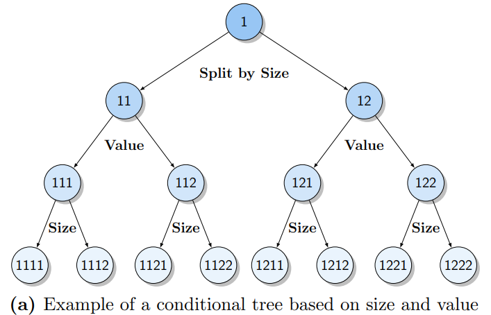
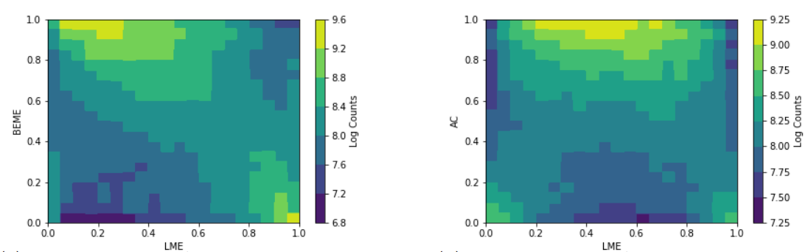
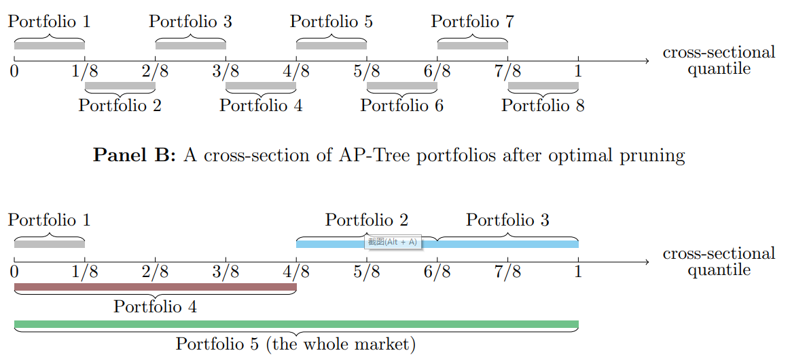

# Forest through the Trees: Building Cross-Sections of Stock Returns
Svetlana Bryzgalova, Markus Pelger, Jason Zhu, Working paper, 2021
1. *London Business School, Department of Finance*
2. *Stanford University, Department of Management Science and Engineering*
3. *Stanford University, Department of Management Science and Engineering*

## 什么解释了预期收益率？

***What explains expected returns?***

这个问题背后有两层含义：

1. 要解释谁的预期收益率？测试资产一般选取截面排序形成的组合收益率
2. 用什么模型来解释？

大多数文献都关注第一个问题，实际上，第二个问题也十分重要。原因如下：

1. 除非选取的测试资产可以张成（span）SDF，否则即使能够解释这些测试资产，也不能说明模型的可靠性
2. 测试资产不仅可以用于检验模型，还可以用来构建交易组合（building blocks for constructing tradebale risk factors）

因此，mis-specified test asset 不仅影响了SDF的构造，也影响了其评价模型的能力。

过往文献最常使用的特征排序组合无法张成SDF，因此基于这些方法做出的model evaluation实际上也是不可靠的。这些截面排序的组合并不能反映出众多特征的联合影响——**受限于维度灾难以及对交互作用的忽略**。

通常的做法是将许多排序形成的组合堆在一起，而这并不能解决上述问题，并且会引起新的麻烦：因为这些组合都是基于同一个投资域选取的，所以存在大量的重复组合以及对于同一种风险的重复构造。

出于对这三种问题的考虑：
1. 交互作用（complex interactions）
2. 维度灾难（curse of dimensionality）【triple sort or above】
3. 组合重复（repackaging and duplication）

文章提出了AP tree model（Asset Pricing Trees）。

### AP trees

AP trees具有很好的可解释性，构造出的组合充分分散化，最重要的是，最终AP trees组合能够张成SDF。

**Two key elements：**
1. 类似于条件排序构造组合
2. **根据SDF的限制条件剪枝（pruning）**

当构造出树结构后，再根据限制条件进行剪枝。但此处的剪枝与机器学习方法中的剪枝有本质区别：机器学习方法中根据local information（如mean impurity decrease），即仅对比父节点和子节点之间的信息，而本文则是在均值方差优化的框架下，考虑所有的节点，因为这些节点都是投资组合，来观察哪些节点组合在一起能够得到最高的夏普比率。

最后，为例避免过拟合，文章还实现了**对方差和均值的收缩**。因此也算是generalization of Kozak, Nagel, and Santosh (2020)。

### Evaluation metrics <!-- {docsify-ignore} -->

由于重复资产的存在，传统评价指标如absolute pricing errors往往会夸大模型的表现。

本文提出使用样本外解释SDF的能力来评价模型，得到更为准确的结果。

### The role of Machine Learning <!-- {docsify-ignore} -->

大多数机器学习算法通过两步来构建投资策略：
1. 通过算法提取预测收益率的信号
2. 通过这些信号来构建投资组合，如long short或均值方差优化

**然而，这两步实际上应该合并为一步，也即，直接找到对经济学问题最相关的信号，而非仅与收益率相关。**

> *However, we strongly believe that these two steps should be merged together; that is, machine learning techniques should extract the signals that are the most relevant for the overall economic problem, not just return prediction.*

> [!NOTE]
> 这一点与Hierarchical Bayesian、Shrinking the cross section、RP-PCA的观点是一致的。

文章后续也做了对比，仅提取与收益率相关信号的模型表现远不如考虑经济学问题的模型。

### Closely Related Literature

Factor zoo实际上是基于统计和经济学模型找一些可以张成SDF的基础资产（basis assets）。

回答Factor zoo的文献可以被分为以下三类：

1. **对特征组合做降维处理，最终得到少数几个因子或SDF**

- Lettau and Pelger (2020) 
- Kelly, Pruitt, and Su (2019) 
- Fan, Liao, and Wang (2016) 
- Kozak, Nagel, and Santosh (2020) 

PCA是这一类文献中最常用的方法，但由于这些方法是在已有的投资组合中提取信息，就会存在上述提及的问题。而本文是在全新的投资组合中提取信息，这些组合有更多的信息量。

1. **仅提取特征和收益率之间的关联，而不假设风险模型或无套利限制**

- Freyberger, Neuhierl, and Weber (2020) 
- Gu, Kelly, and Xiu (2020b)
- Moritz and Zimmerman (2016) 
- Rossi (2018) 

本文不仅着眼于收益率，而是从SDF入手。

1. **在不假设股票和特征之间关系的前提下 (Nonparametric)估计条件SDF**

- Chen, Pelger, and Zhu (2022)
- Gu, Kelly, and Xiu (2020a)

本文在基于特征估计条件SDF的同时，保证了模型的**可解释性**。

特别地，对于Kozak, Nagel, and Santosh (2020)，其仅仅对协方差矩阵进行了收缩，然而本文在此基础上，对收益率均值也施加了收缩。这一收缩有极大的意义，**因为样本均值中包含了大量的估计误差，而尽管其绝对数值很大，但其中有很大一部分是由噪声导致的，而不是数据的本质特征**。

根据Garlappi, Uppal, and Wang (2007)的框架，可以证明这个问题**等价**于：面临期望收益、波动率、以及投资机会夏普比率的联合不确定性的条件下，求解模糊厌恶的投资者的最优投资组合。而Kozak, Nagel, and Santosh (2020)仅仅是这一框架下的一个特例。

## Test Assets, Sorting, and Trees

### Test Assets and SDF

$$
M_t = 1-\sum_{i=1}^N b_{t-1,i}R_{t,i} \quad \text{with} \ b_{t-1,i} = f(C_{t-1,i})
$$

$C_{t-1,i}$ 是 $N \times K$ 维矩阵，股票数量是 $N$，特征数量是 $K$，而 $f(\cdot)$ is a general, potentially nonlinear and non-separable function。

有解析解的（reduced-form）资产定价模型通过许多（甚至是无限）**基础函数**（basis function）来估计这一关系：$f(C_{t-1,i}) \approx \sum_{j=1}^J f_j(C_{t-1,i})w_j$

$$
M_t = 1 - \sum_{j=1}^J w_j R_{t,j}^{\text{managed}} \quad  R_{t,j}^{\text{managed}} = \sum_{i=1}^N f_j (C_{t-1,i})R_{t,i} \tag{1}
$$

通过这种方式，可以将conditional model表达为unconditional model，并且维度从individual stock level降至portfolio level。

因为SDF由这些managed portfolio张成，因此，寻找SDF也就等价于定价这些managed portfolio。因此，问题就此转化为**寻找并定价能够张成SDF的managed portfolio**。【找managed portfolio也就是在找基础函数】

但是，如果找到的managed portfolio并不能张成SDF，那么即使定价了这些managed portfolio，也不能说明找到了真正的SDF。甚至在某些情况下，能够解释某些managed portfolio的模型，并不比不能解释这些managed portfolio距离真实的SDF更近。

根据经济学理论，最小化真实SDF和candidate SDF之间的距离，等价于最大化managed portfolio的夏普比率，这给了我们判断的依据。但需要注意的是，最大化的夏普比率指的是样本外，因为样本内很大程度上会受到过拟合的影响。

并且模型还要考虑到特征之间的非线性和交互影响，因此trees method是一个很好的选择，通过tree，还能很方便的施加各种restriction【后文会讲】。

> [!NOTE|label:economic continuity]
> 理论上来说，可能有multiple rotations of managed portfolio张成同样的SDF。但是最优的基础函数应该能够保证模型的**经济一致性（economic continuity）**。PCA文献往往在最后会解释给出的主成分因子对应着哪些类型的因子，一个主成分因子内可能有很多特征的contribution，决定其属于哪一类是看哪一类特征contribution更多；而AP trees非常清晰地列出了组合是根据哪些特征划分的。因此，相比于PCA方法，AP trees的可解释性大大提高了，作者称之为**economic continuity**。

In summary，最终能够张成SDF的最优managed portfolio应该符合以下几个性质

1. 同时反映众多特征的影响【reflect the impact of multiple characteristics at the same time】
2. 能够在样本外实现最高的夏普比率
3. 考虑非线性和交互影响
4. 数量较少、充分分散、可投资的【small number, well-diversified, feasible for investor】
5. 解释性强【interpretable link to fundamentals】

### Conditional and Unconditional Sorting

传统的排序组合仅限于triple，再多就会引起维度灾难，组合内的股票数量急剧减少，不能实现分散化。因此，唯一的处理方式是使用多个双重排序，这种做法快速的提高了因子数量但并没有提供理论支撑，忽视了特征之间的交互作用，并且众多因子基于同样的投资域构造，存在大量不必要的重复。

AP tree作为传统排序方法的延申，能够很好地处理上述问题。

如果特征之间是独立的，那么排序顺序并不影响结果，但实际上，从左图可以看出特征之间并不独立，面板十分不平衡，这种情况下进行双重排序，结果是失真的。并且这种不独立带来的影响是不可忽视的，单独来看value effect对于smallest stock来说尤其强烈，the impact of accrual对于large stock来说影响是一致的，但是联合来看却呈现出奇妙的倒U形【右图】。

用 $d$ 来代表the depth of tree，排序变量的数量为 $M$，那么最终能够得到 $M^d \times 2^d$ 个投资组合，每个投资组合的股票数量为 ${N\over 2^d}$，因此，这些组合最多可以捕捉 $d$ 种交互影响。【？】

### Recursive Portfolios and Split Choice

下图为单变量排序的例子。目标节点包括**子节点和中间节点**，只要没有信息增益，就会将这个节点去除。

这种不断split的方式能够很好地捕捉特征分布中两侧的尾部结构，选取其中有价值的部分。并且AP-Trees portfolio is **long-only**。

AP-Pruning的问题在于 **bias-variance trade-off**。节点位置越高，股票数量越多，同时也越分散化，对于其均值估计的方差也会变小；而尽管不断对节点进行划分能够捕捉特征间更加复杂的关系，但同样地方差也会不断增加。因此，在评估子节点是否应该保留是，应该**综合考虑其带来的资产定价信息增益与方差不断增加带来的损失**。

由于其recursive structure，AP-Trees最终选择少量组合的稀疏性与一般意义上的特设稀疏性假设（ad hoc sparsity）不同。AP-Trees是在经济学约束下对tree进行pruning形成的，如果子节点不能提供价值，则会被merge成父母结点，这一递归结构导致的特性与人为假设的稀疏性有很大区别。

## Pruning AP-Trees and Portfolio Selection

  