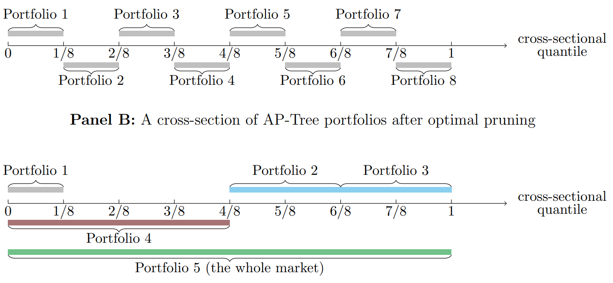

# Forest through the Trees: Building Cross-Sections of Stock Returns
Svetlana Bryzgalova, Markus Pelger, Jason Zhu, Working paper, 2021
1. *London Business School, Department of Finance*
2. *Stanford University, Department of Management Science and Engineering*
3. *Stanford University, Department of Management Science and Engineering*

## 什么解释了预期收益率？

***What explains expected returns?***

这个问题背后有两层含义：

1. 要解释谁的预期收益率？测试资产一般选取截面排序形成的组合收益率
2. 用什么模型来解释？

大多数文献都关注**第二个问题**，实际上，第一个问题也十分重要。原因如下：

1. 除非选取的测试资产可以张成（span）SDF，否则即使能够解释这些测试资产，也不能说明模型的可靠性
2. 测试资产不仅可以用于检验模型，还可以用来构建交易组合（building blocks for constructing tradebale risk factors）

因此，mis-specified test asset 不仅影响了SDF的构造，也影响了其评价模型的能力。

### GAP 

过往文献最常使用的特征排序组合无法张成SDF，因此基于这些方法做出的model evaluation实际上也是不可靠的。这些截面排序的组合并不能反映出众多特征的联合影响——**受限于维度灾难以及对交互作用的忽略**。

通常的做法是将许多排序形成的组合堆在一起，而这并不能解决上述问题，并且会引起新的麻烦：因为这些组合都是基于同一个投资域选取的，所以存在**大量的重复组合**以及对于同一种风险的重复构造。

出于对这三种问题的考虑：
1. 交互作用（complex interactions）
2. 维度灾难（curse of dimensionality）【triple sort or above】
3. 组合重复（repackaging and duplication）

文章提出了AP tree model（Asset Pricing Trees）。

### AP trees

AP trees解决了上述问题，并且具有很好的可解释性，构造出的组合充分分散化，最重要的是，最终AP trees组合能够张成SDF。

**Two key elements of AP trees：**
1. 类似于条件排序构造组合
2. **根据SDF的限制条件剪枝（pruning）**

当构造出树结构后，再根据限制条件进行剪枝。但此处的剪枝与机器学习方法中的剪枝有**本质区别**：机器学习方法中根据local information（如mean impurity decrease），即仅对比父节点和子节点之间的信息，而本文则是在均值方差优化的框架下，考虑所有的节点，因为这些节点都是投资组合，来观察哪些节点组合在一起能够得到最高的夏普比率。

最后，为例避免过拟合，文章还实现了**对方差和均值的收缩**。因此也算是generalization of Kozak, Nagel, and Santosh (2020)。

### Evaluation metrics <!-- {docsify-ignore} -->

由于重复资产的存在，传统评价指标如absolute pricing errors往往会夸大模型的表现。

双重排序后的组合中，许多极为类似，定价这些组合本质上也等价于仅定价了一个组合，而因为这些重复资产的定价误差小，将那些定价误差大的组合平均掉了。

本文提出使用样本外解释SDF的能力来评价模型，得到更为准确的结果。

### The role of Machine Learning <!-- {docsify-ignore} -->

大多数机器学习算法通过两步来构建投资策略：
1. 通过算法提取预测收益率的信号
2. 通过这些信号来构建投资组合，如long short或均值方差优化

**然而，这两步实际上应该合并为一步，也即，直接找到对经济学问题最相关的信号，而非仅与收益率相关。**

> *However, we strongly believe that these two steps should be merged together; that is, machine learning techniques should extract the signals that are the most relevant for the overall economic problem, not just return prediction.*

> [!NOTE]
> 这一点与Hierarchical Bayesian、Shrinking the cross section、RP-PCA的观点是一致的。

文章后续也做了对比，仅提取与收益率相关信号的模型表现远不如考虑经济学问题的模型。

### Closely Related Literature

Factor zoo实际上是基于统计和经济学模型找一些可以张成SDF的基础资产（basis assets）。

回答Factor zoo的文献可以被分为以下三类：

1. **对特征组合做降维处理，最终得到少数几个因子或SDF**

- Lettau and Pelger (2020a) 
- Kelly, Pruitt, and Su (2019) 
- Fan, Liao, and Wang (2016) 
- Kozak, Nagel, and Santosh (2020) 

PCA是这一类文献中最常用的方法，但由于这些方法是在已有的投资组合中提取信息，就会存在上述提及的问题。而本文是在全新的投资组合中提取信息，这些组合有更多的信息量。

2. **仅提取特征和收益率之间的关联，而不假设风险模型或无套利限制**

- Freyberger, Neuhierl, and Weber (2020) 
- Gu, Kelly, and Xiu (2020b)
- Moritz and Zimmerman (2016) 
- Rossi (2018) 

本文不仅着眼于收益率，而是从SDF入手。

3. **在不假设股票和特征之间关系的前提下 (Nonparametric)估计条件SDF**

- Chen, Pelger, and Zhu (2022)
- Gu, Kelly, and Xiu (2020a)

本文在基于特征估计条件SDF的同时，保证了模型的**可解释性**。

特别地，对于Kozak, Nagel, and Santosh (2020)，其仅仅对协方差矩阵进行了收缩，然而本文在此基础上，对收益率均值也施加了收缩。这一收缩有极大的意义，**因为样本均值中包含了大量的估计误差，而尽管其绝对数值很大，但其中有很大一部分是由噪声导致的，而不是数据的本质特征**。

根据Garlappi, Uppal, and Wang (2007)的框架，可以证明这个问题**等价**于：面临期望收益、波动率、以及投资机会夏普比率的联合不确定性的条件下，求解模糊厌恶的投资者的最优投资组合。而Kozak, Nagel, and Santosh (2020)仅仅是这一框架下的一个特例。

## Test Assets, Sorting, and Trees

### Test Assets and SDF

$$
M_t = 1-\sum_{i=1}^N b_{t-1,i}R_{t,i} \quad \text{with} \ b_{t-1,i} = f(C_{t-1,i})
$$

$C_{t-1,i}$ 是 $N \times K$ 维矩阵，股票数量是 $N$，特征数量是 $K$，而 $f(\cdot)$ is a general, potentially nonlinear and non-separable function。

有解析解的（reduced-form）资产定价模型通过许多（甚至是无限）**基础函数**（basis function）来估计这一关系：$f(C_{t-1,i}) \approx \sum_{j=1}^J f_j(C_{t-1,i})w_j$

$$\begin{equation}
M_t = 1 - \sum_{j=1}^J w_j R_{t,j}^{\text{managed}} \quad  R_{t,j}^{\text{managed}} = \sum_{i=1}^N f_j (C_{t-1,i})R_{t,i} 
\end{equation}$$

通过这种方式，可以将conditional model表达为unconditional model，并且维度从individual stock level降至portfolio level。

因为SDF由这些managed portfolio张成，因此，寻找SDF也就等价于定价这些managed portfolio。因此，问题就此转化为**寻找并定价能够张成SDF的managed portfolio**。【找managed portfolio也就是在找基础函数】

但是，如果找到的managed portfolio并不能张成SDF，那么即使定价了这些managed portfolio，也不能说明找到了真正的SDF。甚至在某些情况下，能够解释某些managed portfolio的模型，并不比不能解释这些managed portfolio距离真实的SDF更近。

根据经济学理论，**最小化真实SDF和candidate SDF之间的距离，等价于最大化managed portfolio的夏普比率**，这给了我们判断的依据。但需要注意的是，最大化的夏普比率指的是**样本外**，因为样本内很大程度上会受到过拟合的影响。

并且模型还要考虑到特征之间的非线性和交互影响，因此trees method是一个很好的选择，通过tree，还能很方便的施加各种restriction【后文会讲】。

> [!NOTE|label:Economic continuity]
> 理论上来说，可能有multiple rotations of managed portfolio张成同样的SDF。但是最优的基础函数应该能够保证模型的**经济一致性（economic continuity）**。PCA文献往往在最后会解释给出的主成分因子对应着哪些类型的因子，一个主成分因子内可能有很多特征的contribution，决定其属于哪一类是看哪一类特征contribution更多；而AP trees非常清晰地列出了组合是根据哪些特征划分的【这实际上也是树方法的特性】。因此，相比于PCA方法，AP trees的可解释性大大提高了，作者称之为**economic continuity**。

In summary，最终能够张成SDF的最优managed portfolio应该符合以下几个性质

1. 同时反映众多特征的影响【reflect the impact of multiple characteristics at the same time】
2. 能够在样本外实现最高的夏普比率
3. 考虑非线性和交互影响
4. 数量较少、充分分散、可投资的【small number, well-diversified, feasible for investor】
5. 解释性强【interpretable link to fundamentals】

### Conditional and Unconditional Sorting

***conditional有没有必要？***

传统的排序组合仅限于triple，再多就会引起维度灾难，组合内的股票数量急剧减少，不能实现分散化。因此，唯一的处理方式是使用多个双重排序，这种做法的普遍使用快速的提高了因子数量，但并没有明确的理论支撑，忽视了特征之间的交互作用，并且众多因子基于同样的投资域构造，存在大量不必要的重复。

AP tree作为传统排序方法的延申，能够很好地处理上述问题。

如果特征之间是独立的，那么排序顺序并不影响结果，但实际上，从左图可以看出特征之间并不独立，面板十分不平衡，这种情况下进行双重排序，结果是失真的。并且这种不独立带来的影响是不可忽视的，单独来看value effect对于smallest stock来说尤其强烈，the impact of accrual对于large stock来说影响是一致的，但是联合来看却呈现出奇妙的倒U形【右图】。因此，特征之间的交互影响需要被纳入考量。

用 $d$ 来代表the depth of tree，排序变量的数量为 $M$，那么最终能够得到 $M^d \times 2^d$ 个投资组合，每个投资组合的股票数量为 ${N\over 2^d}$，因此，这些组合最多可以捕捉 $d$ 种交互影响。【？】

### Recursive Portfolios and Split Choice

下图为单变量排序的例子。目标节点包括**子节点和中间节点**，只要没有信息增益，就会将这个节点去除。

这一点也与传统的树方法不同，因为经典的树方法中只包括子节点而无中间节点。

这种不断split的方式能够很好地捕捉特征分布中两侧的尾部结构，选取其中有价值的部分。并且AP-Trees portfolio is **long-only**。

AP-Pruning的问题在于 **bias-variance trade-off**。节点位置越高，股票数量越多，同时也越分散化，对于其均值估计的方差也会变小；而尽管不断对节点进行划分能够捕捉特征间更加复杂的关系，但同样地方差也会不断增加。因此，在评估子节点是否应该保留是，应该**综合考虑其带来的资产定价信息增益与方差不断增加带来的损失**。

由于其recursive structure，AP-Trees最终选择少量组合的稀疏性与一般意义上的特设稀疏性假设（ad hoc sparsity）不同。AP-Trees是在经济学约束下对tree进行pruning形成的，如果子节点不能提供价值，则会被merge成父母结点，这一递归结构导致的特性与人为假设的稀疏性有很大区别。

## Pruning AP-Trees and portfolio selection

在对AP-Trees进行pruning时，也就是在进行portfolio selection，但是现行对tree的 pruning criteria仅作用于局部pruning，不能考虑整体节点。而当我们想要通过Tree来构造投资组合时，必须要关注所有结点的收益和方差协方差关系，因此，对于AP-Trees构建投资组合，需要特别设定一个目标函数。

根据我们的目标函数，能够找到最大夏普比率的切线组合，在金融学理论中，这也等同于张成了SDF。

另外，由于节点太多带来的高维度问题，还需要通过Shrinkage来避免过拟合问题，构造可靠、稳健的投资组合。

设定均值估计量和协方差估计量分别为 $\hat{\mu}$ ,  $\hat{\Sigma}$，当不对SDF组合权重施加任何Shrinkage，最终的解为： $\hat{w}_{naive} = \hat{\Sigma}^{-1}\hat{\mu} $，然而这种解面临严重的过拟合问题。

本文估计流程为：

1. 对于每一个目标收益率 $\mu_0$，都可以找到对应的最小方差权重 $\hat{w}_{robust}$，进而得到有效前沿。此时，$\mu_0$ 与 lasso参数 $\lambda_1$，ridge参数 $\lambda_2$ 一样都被视为**超参数**。

这一阶段给出不同的 $\mu_0$ 是为了求出有效前沿，**此时仅存在一个前沿**。

优化问题如下：

$$\begin{equation}
min \qquad {1\over 2} w^T \hat{\Sigma} w + \lambda_1 ||w||_1+{1\over 2} \lambda_2 ||w||_2^2
\end{equation}
$$

2. 利用验证集数据选择超参数 $\mu_0$，$\lambda_1$，$\lambda_2$

**利用第一步得到的权重数据在前沿上寻找能够最大化验证集夏普比率的点**。

根据不同的 $\mu_0$，由不同的收缩力度，**每个 $\mu_0$ 都对应着一个前沿**。

3. 利用测试集数据测试结果

<mark> **这种两步法的估计流程有三种不同的统计解释。** </mark>

### Proposition 1 Target Return and Shrinkage to the Mean

- 求解 【样本外目标函数】等价于 【样本内解析解】
- 求解 【**样本外有效前沿**】 等价于 【**样本内数据最优化 + 样本均值收缩**】
$$
\hat{w}_{robust} = \hat{\Sigma}^{-1}(\hat{\mu}+\lambda_0 \bm{1})
$$
- 求解 【**样本外有效前沿 + Ridge**】 等价于 【**样本内数据最优化 + 样本均值收缩 + 协方差矩阵收缩**】
$$
\hat{w}_{robust} = \Big( \hat{\Sigma}+\lambda_2 I_N \Big)^{-1}(\hat{\mu}+\lambda_0 \bm{1})
$$

当不对SDF组合权重施加任何Shrinkage，最终的解为： $\hat{w}_{naive} = \hat{\Sigma}^{-1}\hat{\mu} $。

当仅考虑ridge正则项【为方便得到解析解，先不考虑Lasso】时，即 $\lambda_1 = 0$：
$$
\underset{w}{min} \ w^T \hat{\Sigma}w+\lambda_2 ||w||_2^2 \qquad s.t. \ w^T \hat{\mu} = \mu_0 \ \text{and} \ w^T \bf{1} = 1
$$

最终解为
$$
\hat{w}_{robust} = \alpha_{\mu_0} \hat{w}_{tan,\lambda_2} + (1-\alpha_{\mu_0}) \hat{w}_{var,\lambda_2}
$$

其中：
$$\begin{aligned}
\hat{w}_{tan,\lambda_2} &= c_{tan} \Big( \hat{\Sigma}+\lambda_2 I_N \Big)^{-1} \hat{\mu}, \qquad \hat{w}_{var,\lambda_2} = c_{var} \Big( \hat{\Sigma}+\lambda_2 I_N \Big)^{-1} \bm{1} \\
\alpha_{\mu_0} &= {\mu_0-\hat{\mu}^T \hat{w}_{var,\lambda_2} \over \hat{\mu}^T \hat{w}_{tan,\lambda_2}-\hat{\mu}^T \hat{w}_{var,\lambda_2} }, \qquad 
c_{tan} = \left( \bm{1} \Big( \hat{\Sigma}+\lambda_2 I_N \Big)^{-1} \hat{\mu} \right) ^{-1}\\
c_{var} &= \left( \bm{1} \Big( \hat{\Sigma}+\lambda_2 I_N \Big)^{-1} \bm{1} \right) ^{-1}
\end{aligned}$$

此时，如果目标收益率 $\mu_0$ 根据最大化训练集【**样本内**】夏普比率设置，最终解一定为 $\alpha_{\mu_0}=1$，因此要根据验证集【**样本外**】来选取 $\mu_0$。

进一步放松假设 $w^T \bf{1} = 1$ (**which can be always enforced ex post**)，权重解为：

> [!WARNING|label:Important tricks]
> 放松权重和为1的假设不代表在**目标函数**中放弃，而是在后续的**公式变形中**放松该假设，因为不管后续算出的权重为多少，在事后均可以调整使其权重和为1。

$$\begin{aligned}
\hat{w}_{robust} = \Big( \hat{\Sigma}+\lambda_2 I_N \Big)^{-1} \hat{\mu} &+ \underbrace{\hat{\mu}^T\Big(  \hat{\Sigma}+\lambda_2 I_N \Big)^{-1} \hat{\mu} - \mu_0 \bm{1}^T \Big( \hat{\Sigma}+\lambda_2 I_N \Big)^{-1} \bm{1} \over \mu_0 \bm{1}^T \Big( \hat{\Sigma}+\lambda_2 I_N \Big)^{-1} \bm{1}-\hat{\mu}^T  \Big( \hat{\Sigma}+\lambda_2 I_N \Big)^{-1} \bm{1}}_{\lambda_0} \Big( \hat{\Sigma}+\lambda_2 I_N \Big)^{-1} \bm{1} \\
&= \Big( \hat{\Sigma}+\lambda_2 I_N \Big)^{-1}(\hat{\mu}+\lambda_0 \bm{1})
\end{aligned}$$

当不存在惩罚项时，$\lambda_2 = 0$.

需要注意的是，此时 $\lambda_0$ 是 $\mu_0$ 的递减函数，当 $\mu_0$ 大时，$\lambda_0$ 小，而当 $\mu_0$ 小时，相对来说 $\lambda_0$ 会大。这也代表着一种收缩，但不同于传统的Shinkage向0收缩，而是**向截面均值收缩**。

背后的经济学直觉**T**是：因为期望收益率的估计包含许多估计误差，因此很有可能过高或过低的估计值都是由于高估或低估引起的，而非真实值。

> [!TIP|label:T]
> The same reasoning famously underlines the use of adjusted stock betas by Bloomberg that shrink their sample estimates toward 1, which is the average in the overall cross-section.

正是因为包括了对期望收益率均值的收缩，该方法也被称为对Kozak, Nagel, and Santosh (2020) 的拓展。
此时二者有着**一一对应**的关系：
$$
\lambda_0 \in [0,+\infty)  \Rightarrow \mu_0 \in \left( {\hat{\mu}^T\Big(  \hat{\Sigma}+\lambda_2 I_N \Big)^{-1} \bm{1} \over \bm{1}^T \Big( \hat{\Sigma}+\lambda_2 I_N \Big)^{-1} \bm{1}} ,{\hat{\mu}^T\Big(  \hat{\Sigma}+\lambda_2 I_N \Big)^{-1} \hat{\mu} \over \hat{\mu}^T \Big( \hat{\Sigma}+\lambda_2 I_N \Big)^{-1} \bm{1}} \right]
$$

> [!NOTE]
> 在这种表达下，$\lambda_0$ 的取值范围也代表我们并不认为 $\mu_0$ 会超过切点组合收益率。
>
> 因为一旦 $\lambda_0$ 为负，就不再是收缩的作用，而是**会极化权重**。

### Proposition 2 Robust SDF Discovery

**robust = non-overfitting = non-high dimensional = sparse = lasso**

本文的 Robust SDF 泛化了 Kozak, Nagel, and Santosh (2020) 的估计，并且当**不实施均值收缩**【$\lambda_0 = 0$】，二者**等价**。

当**协方差矩阵为对角阵**时，其解为：

$$
\hat{w}_{robust} = \left( \hat{D}+\lambda_2 I_N \right)^{-1}(\hat{\mu} - \lambda_1 \bm{1})_+
$$

在**非对角**情况下：
$$
(\Sigma+\lambda_2 I_N)\hat{w}_{robust,i} = \hat{\mu}_i + \lambda_0  - \lambda_1 sign(\hat{w}_{robust,i}) \quad \text{for } i \text{ in the active set}
$$

在本节构造Robust SDF时，要考虑协方差矩阵是否为对角阵的两种情况。

#### Diagonal covariance matrix <!-- {docsify-ignore} -->

为了引入稀疏性，Kozak et al.(2020) 求解以下优化问题：
$$
\hat{w} = arg \underset{w}{min} \ \ {1\over2} \left( \hat{\mu}-\hat{\Sigma}w \right)^T \hat{\Sigma}^{-1} \left( \hat{\mu}-\hat{\Sigma}w \right)+\lambda_1 ||w||+{1\over2}\lambda_2 ||w||^2_2
$$

当协方差矩阵为对角阵，记为 $\hat{D}$，此时概念上也就类似于 PCA space，有以下解：
$$
\hat{w} = \left( \hat{D}+\lambda_2 I_N \right)^{-1}(\hat{\mu}-\lambda_1 \bm{1})_+, \qquad (x) = max(x,0)
$$
而本文给出的解为：
$$
\hat{w}_{robust} = \left( \hat{D}+\lambda_2 I_N \right)^{-1}(\hat{\mu}+\gamma \bm{1}-\lambda_1 \bm{1})_+
$$
求解过程如下：
$$
L = {1\over2}w^T \hat{D} w + {1\over2}\lambda_2 ||w||_2^2 + \lambda_1 ||w||_1 - \tilde{\gamma}_1 \left( w^T \hat{\mu}-\mu_0 \right)- \tilde{\gamma}_2 \left( w^T \bm{1}-1 \right)
$$

一阶导为，【active set意为 $w$ 非零】：
$$
(D+\lambda_2 I_N)\hat{w}_{robust,i} = \tilde{\gamma}_1 \hat{\mu}_i + \tilde{\gamma}_2  - \lambda_1 sign(\hat{w}_{robust,i}) \quad \text{for } i \text{ in the active set}
$$
因此：
$$
\hat{w}_{robust,i} = \left( \hat{D}+\lambda_2 I_N \right)^{-1}(\tilde{\gamma}_1 \hat{\mu}_i + \tilde{\gamma}_2 \bm{1} - \lambda_1 \bm{1})_+
$$
同样地，放松权重假设，可以得到：

$$
\hat{w}_{robust,i} = \left( \hat{D}+\lambda_2 I_N \right)^{-1}(\hat{\mu}_i + \lambda_0 \bm{1} - \tilde{\lambda}_1 \bm{1})_+
$$

其中，
$$
\lambda_0 = {\tilde{\gamma}_2 \over \tilde{\gamma}_1}, \qquad \tilde{\lambda}_1 = {\lambda_1\over \tilde{\gamma}_1}
$$

因此，当对均值收缩程度 $\lambda_0$ 为0时，二者等价。

#### Non-diagonal covariance matrix <!-- {docsify-ignore} -->

在非对角阵的情况下，并不能分离出ridge和lasso的影响，因此，lasso惩罚项并不能包括均值收缩。【？】

> *In the general case of a non-diagonal sample covariance matrix, however, the impacts of ridge and lasso penalties cannot be separated, and, hence, the lasso penalization cannot subsume the mean shrinkage.*

因此，需要求解以下最优化问题：
$$
L = {1\over2}w^T \hat{\Sigma} w + {1\over2}\lambda_2 ||w||_2^2 + \lambda_1 ||w||_1 - \tilde{\gamma}_1 \left( w^T \hat{\mu}-\mu_0 \right)- \tilde{\gamma}_2 \left( w^T \bm{1}-1 \right)
$$

相应地，导函数变为：
$$
(\Sigma+\lambda_2 I_N)\hat{w}_{robust,i} = \tilde{\gamma}_1 \hat{\mu}_i + \tilde{\gamma}_2  - \lambda_1 sign(\hat{w}_{robust,i}) \quad \text{for } i \text{ in the active set}
$$

放松权重假设为：
$$
(\Sigma+\lambda_2 I_N)\hat{w}_{robust,i} = \hat{\mu}_i + \lambda_0  - \tilde{\lambda}_1 sign(\hat{w}_{robust,i}) \quad \text{for } i \text{ in the active set}
$$

对应在 Kozak et al.(2020) 中的导函数为：
$$
(\Sigma+\lambda_2 I_N)\hat{w}_{i} = \hat{\mu}_i  - \tilde{\lambda}_1 sign(\hat{w}_{robust,i}) \quad \text{for } i \text{ in the active set}
$$

因此，当 Kozak et al.(2020) 使用 $\hat{\mu}+\lambda_0\bm{1}$ 代替 $\hat{\mu}$ 时，二者等价。

或者说，当对均值收缩程度 $\lambda_0$ 为0时，二者等价。

综上，在协方差矩阵的两种情况下，本文都属于对Kozak et al.(2020)的扩展。

### Proposition 3 General Robust Estimation Perspective

本文的估计也**等价于**在不确定最大的情况下【包括均值不确定性，方差不确定性和夏普比率不确定性】求解均值方差优化问题。

每一种收缩都对应着一类不确定性。

> *Each type of shrinkage has a one-to-one correspondence to a specific type of uncertainty in the
estimation.*

> [!NOTE|label:Uncertainty]
> Unceritainty means that ***the true mean and covariance matrix lie in an uncertainty set around their sample estimates***
>
> 因此，在不确定性下，我们给出的是一个区间估计，而非点估计。

首先考虑均值和协方差的不确定性。
$$\begin{aligned}
S_{\Sigma} &= \left\{ \Sigma: \Sigma_{i,j} = \hat{\Sigma}_{i,j} + e_{i,j}^{\sigma}; \ ||e^{\sigma}||^2_2 \leq \mathcal{k}_{\sigma} \  \Sigma \text{ is positive definite and } \ \mathcal{k}_{\sigma} \geq 0 \right\} \\
S_{\mu} &= \left\{ \mu: \mu_i = \hat{\mu}_i + e_i^{\mu}; |e_i^{\mu}| \leq \mathcal{k}_{\mu} \ \text{ and } \mathcal{k}_{\mu} \geq 0  \right\}
\end{aligned}
$$

参数 $\mathcal{k}_{\mu}, \mathcal{k}_{\sigma}$ 分别捕捉了均值和协方差估计量中的不确定性，

稳健的投资组合最优化等价于在不确定性最大的情况下求解：

$$
\underset{w}{min} \ \underset{\Sigma \in S_{\Sigma},\mu \in S_{\mu}}{max} \ {1\over2}w^T \Sigma w - \tilde{\gamma}_1 \left( w^T \mu - \mu_0 \right)-\tilde{\gamma}_2 \left( w^T \bm{1} - 1 \right)
$$

将 $S_{\mu}$ 代入：
$$\begin{aligned}
& \underset{w}{min} \ \underset{\Sigma \in S_{\Sigma}}{max} \ {1\over2}w^T \Sigma w -\tilde{\gamma}_1 \sum_{i=1}^N \left( w_i [ \hat{\mu}_i - \mathcal{k}_{\mu} sign(w_i) ] - \mu_0 \right) - \tilde{\gamma}_2 \left( w^T \bm{1} - 1 \right) \\
= &\underset{w}{min} \ \underset{\Sigma \in S_{\Sigma}}{max} \ {1\over2}w^T \Sigma w -\tilde{\gamma}_1 \left( w^T \mu - \mu_0 \right)+\tilde{\gamma}_1 \sum_{i=1}^N \mathcal{k}_{\mu} |w_i|- \tilde{\gamma}_2 \left( w^T \bm{1} - 1 \right)
\end{aligned} 
$$

再将 $S_{\Sigma}$ 代入：
$$
\underset{w}{min} \ {1\over2} tr \left( w^T \Sigma w \right)+ \mathcal{k}_{\sigma}w^T w -\tilde{\gamma}_1 \left( w^T \mu - \mu_0 \right)+\tilde{\gamma}_1 \sum_{i=1}^N \mathcal{k}_{\mu} |w_i|- \tilde{\gamma}_2 \left( w^T \bm{1} - 1 \right)
$$

最终，令 $ \lambda_1 = \tilde{\gamma}_1 \mathcal{k}_{\mu} \text{ and } \lambda_2 = \mathcal{k}_{\sigma} $，即可得到我们熟悉的式子：
$$
\underset{w}{min} \ {1\over2} tr \left( w^T \Sigma w \right)+ \lambda_2 ||w||^2_2 +\lambda_1 ||w||_1 -\tilde{\gamma}_1 \left( w^T \mu - \mu_0 \right)- \tilde{\gamma}_2 \left( w^T \bm{1} - 1 \right)
$$

因此，**lasso shrinkage $\lambda_1$ 代表了均值的不确定性，而ridge shrinkage $\lambda_2$ 代表了方差的不确定性**。

因此，在考虑了两种不确定性的情况下，能够得到关于整个均值方差前沿的稳健估计，那么第二步就是找到切点组合。

均值收缩能够与切点组合夏普比率的不确定性联系起来，从最一般的情况【即不带任何收缩】考虑：

$$
\underset{w}{max} \  \ w^T \hat{\mu} -  { \gamma \over2}w^T \Sigma w - {\gamma}_1 \left(1- w^T \bm{1} \right)
$$

其解为： $ w^* = \alpha_{\gamma} \hat{w}_{naive}+(1-\alpha_{\gamma} )\hat{w}_{var} \ \text{with} \ \alpha_{\gamma} = {1\over \gamma} \bm{1}^T \hat{\Sigma}^{-1}\hat{\mu} $，因此每一个目标收益率 $\mu_0$ 都对应着一个唯一的风险厌恶系数 $\gamma$。

在此基础上如果再加上对于样本均值向截面平均值的收缩，那么问题变为：

$$
\underset{w}{max} \  \ w^T \left(\delta \hat{\mu} + (1-\delta)\bar{\mu}\bm{1}  \right)-  { \gamma \over2}w^T \Sigma w - {\gamma}_1 \left(1- w^T \bm{1} \right)
$$

此时，其解变为： $ w^* = \alpha_{\delta} \hat{w}_{naive}+(1-\alpha_{\delta} )\hat{w}_{var} \ \text{with} \ \alpha_{\gamma} = { \delta \over \gamma} \bm{1}^T \hat{\Sigma}^{-1}\hat{\mu} $。

$\delta$ 的取值范围为0 ~ 1，当为 1 时，代表不收缩，而为 0 时，代表完全收缩到均值，因此这一写法称之为向截面均值的收缩。也正是因为 $\delta$ 的取值范围，实际上**均值收缩代表着更高程度的风险厌恶**，【见 $\alpha_{\gamma}$】。

接下来从夏普比率的不确定性来看均值收缩这一问题：

$$
S_{SR} = \left\{ \mu : (\mu-\hat{\mu})^T \Sigma^{-1}  (\mu-\hat{\mu}) \leq \mathcal{k}_{SR} ; \ \mathcal{k}_{SR} \geq 0  \right\}
$$

> [!NOTE]
> 尽管是夏普比率的不确定性，但此时 $\Sigma$ 并没有带有不确定性，因此，不确定性的来源还是 $\mu$

同样，最优化不确定性：

$$
\underset{w}{max} \ \underset{\mu \in S_{SR}}{min} \ w^T \mu -{1\over2}w^T \Sigma w-\gamma_2 \left(\mathcal{k}_{SR}- (\mu-\hat{\mu})^T \Sigma^{-1}  (\mu-\hat{\mu}) \right) -\gamma_1 \left(1- w^T \bm{1}  \right)
$$

此时解为：
$$\begin{aligned}
w^* &= \alpha_{\mathcal{k}_{SR}} \hat{w}_{naive}+(1-\alpha_{\mathcal{k}_{SR}} )\hat{w}_{var} \\
\alpha_{\mathcal{k}_{SR}} &= { 1 \over {\mathcal{k}_{SR} \over \sigma_p}+\gamma} \bm{1}^T \hat{\Sigma}^{-1}\hat{\mu}
\end{aligned}
$$

  