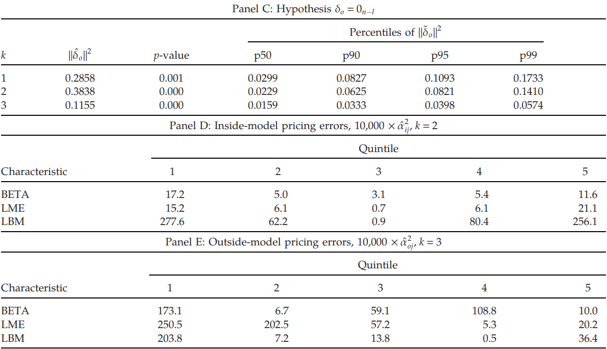

# Testing Pricing Errors of Models with Latent Factors and Firm Characteristics as Covariances

Chu Zhang1. ***Management Science***, 2023

1. *Hong Kong University of Science and Technology, Hong Kong*

研究问题：$\alpha \text{ and } \beta $ 

## Orthogonality

$\alpha \text{ and } \beta $ should be orthogonal

### APT

[【Reference: 石川】](https://zhuanlan.zhihu.com/p/260114845)

**Step one**

$$
R_i=\mu_i+\beta_if+\varepsilon_i,\quad i=1,\cdots,n
$$

where $E[f] = E[\epsilon_i] = 0$, in vector form:

$$
R=\mu+f\boldsymbol{\beta}+\boldsymbol{\varepsilon}
$$

**Step two**

Construct an arbitrage portfolio:

- zero cost: $\boldsymbol{w}'\boldsymbol{e}=0$
- the a-portfolio has no exposure to risk factor: $\boldsymbol{w}'\beta = 0$
- the arbitrage portfolio's return $R_a=\boldsymbol{\omega}'\boldsymbol{R}=\boldsymbol{\omega}'\boldsymbol{\mu}+\boldsymbol{\omega}'\boldsymbol{\beta}f+\boldsymbol{\omega}'\boldsymbol{\varepsilon}$

**Step three**

The portfolio which has zero cost and zero risk deserve zero return:

$$
R_a=\omega^{\prime}\boldsymbol{\mu}=0
$$

Three perpendicular conditons means:

> Vector $w$ is perpendicular to $\mu,\beta,e$, which means $\mu$ must be in the space spanned by $\beta \text{ and } e$

$$
\boldsymbol{\mu}=\gamma_1\boldsymbol{e}+\gamma_2\boldsymbol{\beta}
$$

$\gamma_1$ is the *zero-beta return*, which is risk-free return if it exists. 

And if we assume there is only one factor and take market portfolio to the model, we will get CAPM *elegantly*.

$$\begin{aligned}
\mu_m=R_f+\gamma_2\times1 & \Longrightarrow  \gamma_{2}=\mu_{m}-R_{f} \\
\Longrightarrow \mu_i=R_f&+\beta_i(\mu_m-R_f)
\end{aligned}$$

在此基础上进行扩展，即可得到多因子模型：

$$\begin{equation}
\operatorname{E}[R_i^e]=\mu_i-R_f=\beta_{i1}\lambda_1+\beta_{i2}\lambda_2+\cdots+\beta_{iK}\lambda_K
\end{equation}
$$

#### More about APT <!-- {docsify-ignore} -->

*那么我们所说的 Orthogonality 应该体现在什么地方呢？*

In Finance, the only thing we care about is the **cross-sectional difference**, namely, why different assets earn different returns, which can be tested by cross-sectional regression:

$$
E_T[R_i^e] = \hat{\beta}'_i \boldsymbol{\lambda} + \varepsilon_i, \quad i = 1,2,\cdots,N
$$

**NO intercept**

在进行截面回归时，背后最基础的假设为: risk-based interpretation。

也就是说，当不存在 $\beta$ 时，资产的收益率应该等于无风险收益率或 zero-beta return，而将 $r_f$ 移至左侧，因变量为超额收益率时，此时在 risk-based interpretation 下，**不应存在截距项**，因此，<mark>**模型回归出的残差才应该作为 pricing error**</mark>。

Orthogonality 也恰恰体现于此，$\varepsilon$ 与 $\beta$ 正交，并且残差满足 $\boldsymbol{1}'\boldsymbol{\varepsilon} = 0$。

> 按理说intercept是coefficient中的一部分，二者很难做到正交，所以只有是residual才能实现

> [!NOTE|label:In a nutshell]
> the orthogonality conditon $B'_t \alpha_t = 0_k$, which *is the heart of APT*, and is important in order to obtain an ***unambiguous interpretation*** of the term as a pricing error

> [!WARNING|label:Time series regression]
> 在时序回归中并非如此。
$$
R^e_{it} = \alpha_i + \beta_i^{\prime} \boldsymbol{\lambda}_t + \varepsilon_{it} \quad t = 1,2,\cdots,T
$$
> 其中 $\boldsymbol{\lambda}_t$ 为 $t$ 期因子收益率向量，$R^e_{it}$ 为资产 $i$ 在 $t$ 期的超额收益率。
>
> 得到估计量 $\hat{\alpha}_i$ 和 $\hat{\beta}_i$ 后，在时序上取均值可得：
$$
E_T[R^e_i] = \hat{\alpha}_i + \hat{\beta}_i^{\prime} \hat{\boldsymbol{\lambda}} \quad i=1,2,\cdots,T
$$
> 在此，不同之处就在于，时序回归中没有将 residual 作为 pricing error，而是将 intercept 作为 pricing error。这里一方面是因为 residual 一取均值就没了，另一方面是因为这样更符合资产定价理论：我们用资产收益率的均值和因子收益率的均值来分别表示**资产预期收益率**和**因子预期收益率**。当因子暴露为零，即 $\beta_i$ 为零时，资产预期收益率应该为 zero-beta return，$\alpha_i$ 表示了每个资产实际收益率和定价收益率的差别，当差距过大即说明定价不准。
>
> 然而，此处最大的问题就是：根据APT理论，时序回归出的 $\alpha$ 并不满足 **zero-cost** 以及 **zero-exposure**。
> 
> 此外，另一结构上的差异为：时序回归是以最小化残差为目的而估计的，只跟每个资产本身有关。而在截面回归中，是以最小化 $\hat{\alpha}_i$ 的平方和估计出的。因为截面回归同时利用了所有资产的数据，因此从某种意义上来说，截面回归更加合理。

> [!TIP|label:Which is right]
> 通过截面回归得到的因子预期收益率估计量为：
$$
\hat{\boldsymbol{\lambda}} = (\hat{\beta}^{\prime}\hat{\beta}^{\prime})^{-1} \hat{\beta}^{\prime} E_T[\boldsymbol{R}^e]
$$
> $\hat{\beta}$ 是 $N\times K$ 维因子暴露矩阵，因此 $(\hat{\beta}^{\prime}\hat{\beta}^{\prime})^{-1} \hat{\beta}^{\prime}$ 是一个 $K \times N$ 维矩阵，每一行对应一个因子，每一列对应一个资产。
>
> 将该矩阵与因子暴露矩阵相乘，有：
$$
(\hat{\beta}^{\prime}\hat{\beta}^{\prime})^{-1} \hat{\beta}^{\prime} \hat{\beta} = I
$$
> 令 $\Omega = (\hat{\beta}^{\prime}\hat{\beta}^{\prime})^{-1} \hat{\beta}^{\prime}$ 表示权重矩阵，该权重在对应因子上暴露为1，在其他因子上暴露为0，因此最后得到的因子收益率更加准确。

### IPCA

当定价视角从 unconditional 转为 conditional 时，新的问题出现了，下式为经典条件定价公式 IPCA：

$$\begin{equation}
r_{t+1}=Z_{t}\Gamma_{\alpha}+Z_{t}\Gamma_{\beta}f_{t+1}+\varepsilon_{t+1},\quad t=1,\ldots,T. \label{2}
\end{equation}
$$

既然我们已经知道了 $\alpha$ 需要满足 zero cost 以及 zero exposure 条件，那么在 conditional asset pricing model 中，应该将 residual 作为 pricing error 才更为合理，而非 intercept，为什么上式并非如此呢？

1. 因为上式中含有**时序**的成分，在时序取均值后 residual 为零，无法作为定价误差。

2. 更为重要的，是对定价公式的理解。尽管 **时序回归** 和 **截面回归** 性质上有一定的差异，但其内核都是一样的，都是 risk-based compensation。因此，如果我们**人为添加 zero-cost 和 zero exposure 的限制，抹除掉性质上的差异，那么就能使得时序回归成为** ***正确的定价公式***。

因此，IPCA 也施加了这两种限制。

- 对于zero cost，因为其使用的均为超额收益率，因此估计出的 $\alpha$ 满足zero cost

- 对于zero exposure，IPCA imposes an orthogonality condition $\Gamma_{\beta}'\Gamma_{\alpha}=0$。但这实际上并非真正的 orthogonality 条件，真正的条件应该是：$B_t^{\prime}\alpha_t=\Gamma_\beta^{\prime}Z_t^{\prime}Z_t\Gamma_\alpha=0_k$, which is **impossible** for any constant $\Gamma_\alpha$ and $\Gamma_\beta$ when $Z_t$ is time-varying.

## Dissecting the orthogonality

**New specification**

$$\begin{equation}
r_{t+1}= \underbrace{P_{ot}\delta_o+P_{it}\delta_i}_{\boldsymbol{\alpha}} +\underbrace{(Z_t+1_n\psi')\Gamma}_{\boldsymbol{\beta}} f_{t+1}+\varepsilon_{t+1},\quad t=1,\ldots,T  \label{3}
\end{equation}$$ 

- $r_{t+1}$ is an $n$-vector of asset returns in excess of the risk-free rate from $t$ to $t+1$
- $Z_t$ is $n\times l$ firm characteristics at $t$ with $n \geq l$, $1_n$ is an $n$-vector of ones 
- $\psi$ is an $l$-vector of constants
- $\Gamma$ is an $l \times k$ matrix of full column rank with $k \leq l$

> The condition $\Gamma$ has full column rank is to remove redundancy. 

- $\delta=(\delta_0^{\prime},\delta_i^{\prime})^{\prime}$ is an $(n-k)$-vector of constants in which the dimension of $\delta_0$ and $\delta_i$ are $n-l$ and $l-k$ respectively
- $f_{t+1}$ is a $k$-vector of latent systematic factors realized at $t+1$ with mean $\mu_f$ and variance $\Omega_f$
- the $P_t = (P_{ot},P_{it}) $ is an $n \times (n-k) $ **orthonormal basis** that is orthogonal to $(Z_t+1_n\psi')\Gamma$, $P_{ot}$ is $n\times (n-l)$ if $n>l$, orthogonal to the subspace spanned by $Z_{t}^{*}=Z_{t}+1_{n}\psi^{\prime}$, $P_{it}$ is $n\times (l-k)$ if $l>k$ within the subspace spanned by $Z_{t}^{*}$ but orthogonal to the subspace spanned by $Z_{t}^{*} \Gamma$

> $P_t \delta$ satisfying $B_{t}^{\prime}\alpha_{t}=[(Z_{t}+1_n{\psi^{\prime}})\Gamma]^{\prime}(P_t\delta)=0_k$

- $\epsilon_{t+1}$ is an $n$-vector of idiosyncratic returns with mean zero and variance $\Omega_{\epsilon}$

#### Latent factor <!-- {docsify-ignore} -->

when $f_{t+1}$ is latent and is to be estimated, the model is under-identified because any pair $(Z_t\Gamma^*,f_{t+1}^*)$ is as good as $(Z_{t}\Gamma,f_{t+1})$ where $\Gamma^{*}=\Gamma A \text{ and } f_{t+1}^{*}=A^{-1}f_{t+1}$ with $A$ being a $k \times k$ invertible matrix. 

Therefore, further restrictions on the parameters are needed in estimation.

> 如果任意旋转都可以得到 $\beta^*$ 以及对应的 $f^*_t$，那么则代表因子本身的意义并不清晰

This under-identification is well-known in the literature of principal component analysis–based methods of constructing factor-mimicking portfolios, IPCA also has to apply some constraints. 

It is worth noting that this does not apply to **affine transformations**. If $Z_t \Gamma$ is affine-transformed to $Z_{t}\Gamma^{*}=Z_{t}\Gamma A+C_{t}$, then, in general, there is no $f^*_{t+1}$ such that $Z_t\Gamma f_{t+1}= Z_t\Gamma^*f_{t+1}^*$

> 这里告诉我们，通过线性方法 (**PCA**) 估计出的 $\beta$ 和因子并不唯一【under-identified】，而通过 affine transformation 估计出的系数则不受这一影响。

### Why affine instead of linear transformation

1. affine transformation is basically equal to linear transformation plus translation

linear: $y = Ax$

affine: $y = Ax + b$

> [!NOTE|Tips]
> affine transformation in *low dimension* is equal to linear transformation in *high dimension*
$$
y = Ax+b \Longrightarrow \begin{bmatrix}y\\1\end{bmatrix}=\begin{bmatrix}A&b\\\mathbf{0}&1\end{bmatrix}\begin{bmatrix}x\\1\end{bmatrix}
$$
> [【affines GIF】](https://pica.zhimg.com/50/v2-01d06795480b91a9bc1fa57ce5fd7009_720w.webp?source=1940ef5c)

so when $b$ is zero scalars, affine transformation is equal to linear transformation which is a special case of affine transformation

2. the test of the zero pricing error hypothesis can be conducted *meaningfully*

### Two types of pricing errors

> **The inside-model pricing error** in the case of $l> k$ is within the $l$-dimensional subspace spanned by the affine-transformed firm characteristics but orthogonal to the $k$-dimensional subspace of the factor beta. 
> 
> **The outside-model pricing error** in the case of $n>l$ is orthogonal to the $l$-dimensional subspace spanned by the affine-transformed firm characteristics.

#### Inside pricing error <!-- {docsify-ignore} -->

$$
r_{t+1}= P_{ot}\delta_o+\underbrace{P_{it}\delta_i}_{\boldsymbol{[n \times (l-k)]\times [(l-k)\times 1]}} +\underbrace{(Z_t+1_n\psi')\Gamma}_{\boldsymbol{n \times k}} \underbrace{f_{t+1}}_{\boldsymbol{k \times 1}} +\varepsilon_{t+1},\quad t=1,\ldots,T 
$$ 

**核心含义**：whether the predictive power of a given set of firm characteristics can be rationalized by considering them as the base of the beta with respect to latent factors (usually less than characteristics)

- the $P_{it}$ is within the subspace spanned by $ \underbrace{Z_t+1_n\psi'}_{\boldsymbol{n \times l}} $ but **orthogonal** to $ \underbrace{(Z_t+1_n\psi') \Gamma}_{\boldsymbol{n \times k}}  $  when $l>k$

> 检验 $l$ 个公司特征能否由从中提取出的 $k$ 个因子解释。如果此时存在 $\alpha$，则说明这 $k$ 个因子所张成的空间并不足以解释 $l$ 个公司特征所张成的空间。

- the $P_{it}\delta_i$ can be viewed as **correct version** of IPCA to replace the term $Z_t \Gamma_{\alpha}$
  
- the inside-model pricing error can **always** be driven to zero if the number of factors k can be increased to the number of discovered return-predictive firm characteristics, which means the pricing error is meaningful only when $l$ is relatively greater than $k$

- because $P$ are *orthonormal basis*, thus $(P_{it}\delta_{i})^{\prime}P_{it}\delta_{i}=\delta_{i}^{\prime}\delta_{i}\equiv||\delta_{i}||^{2}.$

- When $k=l$, the $P_{it}\delta_i$ term drops out

> The same is true for IPCA, when $k=l$, $\Gamma_\beta$ is an invertible square matrix. The only solution to $\Gamma^{\prime}_\beta \Gamma_\alpha = 0$ is $\Gamma_\alpha = 0_k$

#### Outside pricing error [Beyond IPCA] <!-- {docsify-ignore} -->

$$
r_{t+1}= \underbrace{P_{ot}\delta_o}_{\boldsymbol{[n \times (n-l)]\times [(n-l)\times 1]}} +P_{it}\delta_i +\underbrace{(Z_t+1_n\psi')}_{\boldsymbol{n \times l}} \underbrace{\Gamma f_{t+1}}_{\boldsymbol{l \times 1}} +\varepsilon_{t+1},\quad t=1,\ldots,T 
$$ 

**核心含义**：whether test assets can be explained by a given set of firm characteristics(usually less than test assets) *[considering inside pricing error = 0]*

- $P_{ot}$ is $n\times (n-l)$ if $n>l$, orthogonal to the subspace spanned by $Z_{t}^{*}=Z_{t}+1_{n}\psi^{\prime}$

- Three sources of outside pricing error

  1.  The first source is the pricing errors against the linear beta pricing theory, rising from nonlinear rational asset pricing models. Certain consumption and investment-based asset pricing models are outside the linear beta-pricing framework
  2.  The second source is *investors’ behavioral biases*. 投资者的行为偏差可以通过公司特征来捕捉，但由于其通常不被认为是 base of betas，因而此类公司特征不以affine function之类的形式出现。即使将其视为base of betas，由于 first source，行为偏差因素可能仍然会产生 outside pricing error.
  3.  The third source of the outside-model pricing error is the *omission* of return-predictive firm characteristics other than the chosen $Z_t$ or the omission of observed macroeconomic or market-wide factors

> [!NOTE]
> 在IPCA中，从36个公司特征 managed portfolio中提取因子，1-6个不等，看这些因子能否解释对应的公司特征组合收益率。这在本文的框架下，相当于 $n=l=36, k = 1~6$。也就是说，这些得到的因子并不能够解释这36个特征之外其他的managed portfolio。
>
> 在本文的框架下，IPCA 的这一框架通过 Inside pricing error实现，除此之外，还可以加入更多的 test asset，例如，通过 BETA, SIZE, BM 得到的因子，能否检验 STD, MOM？ 这一问题是 IPCA 所不能回答的。 
>
> 理想中的情况是 inside 和 outside 都很小，这代表提取出的因子能够解释特征的变化【inside】，同时这些特征的变化也可以解释收益率的变化【outside】。

> [!TIP]
> 第一步 $k$ 到 $l$，是 PCA 类方法在干的事情。
>
> 第二步 $l$ 到 $n$，是 Fama 在干的事情。
>
> 第二步选特征，回答是否选择了 factor zoo 中最核心的几个特征，第一步则回答能否再降维。

## More details

### The difference between new model and IPCA <!-- {docsify-ignore} -->

实际上，IPCA完整公式如下：

$$\begin{aligned}
& r_{t+1} = \alpha_t + \beta_{t}f_{t+1}+\varepsilon_{t+1} \\
\alpha_{t}=&Z_{t}\Gamma_{\alpha}+\nu_{\alpha t}, \quad \beta_{t}=Z_{t}\Gamma_{\beta}+\nu_{\beta t}
\end{aligned}$$

$$\begin{equation}
r_{t+1}=Z_{t}\Gamma_{\alpha}+Z_{t}\Gamma_{\beta}f_{t+1}+\varepsilon_{t+1}^{*} 
\end{equation}
$$

where $\varepsilon_{t+1}^{*}=\varepsilon_{t+1}+\nu_{\alpha t}+\nu_{\beta t}f_{t+1}$ is called composite error.

该式与式 $(\ref{2})$ 唯一的区别在于 error term，但是这并没有什么帮助，因为实证结果并不会告诉我们 error term 中哪些来自于 $\nu_{\alpha t}$，哪些来自于 $\nu_{\beta t}$。

但是尽管没有什么帮助，其实也没什么坏处。IPCA包括这些项的原因只是用于说明：$\alpha_{t}$ 和 $\beta_{t}$ 可能来自于除了 $Z_t$ 之外的变量。但是不同于 IPCA 仅仅考虑而不 test，式($\ref{3}$) 通过 outside pricing error直接 test 了这一类变量的存在，而非将其放在 error term里。

### Estimation problem  <!-- {docsify-ignore} -->

估计中存在的一个问题就是：对于给定的 $B_t = Z^*_t \Gamma$, its orthonormal basis $P_t$ is not unique。某些情况下，$P_{ot}$ 与 $P_{ot}^{*}$ 的不一致不会带来问题，如果 $P_{ot}^{*}=P_{ot}A$，其中 $A$ is orthonormal basis。因为 $\delta_{o}^{*}=A^{\prime}\delta_{o} \quad \mathrm{with} \quad ||\delta_{o}^{*}||^{2}=||\delta_{o}||^{2}$。

但是当其不满足时，就会对估计结果产生影响，文章分为 rejecting the true 以及 accepting the false。

**accepting the false**

**rejecting the true**

这一方面则没有什么影响，因为如果二者相乘为0，那么无论 $P$ 怎么变化 pricing error 都为0。

> If a researcher has a **good sense** of whether the pricing error may lie, a carefully chosen $P_t$ can enhance the power of the test. This obviously depends on specific issues to be examined in the model. However, **if the null is true**, the choice of $P_t$ is less crucial because $P_t \delta$ is a zero vector irrespective of the choice of $P_t$

### balanced panel requirement <!-- {docsify-ignore} -->

在估计式($\ref{3}$)时，要求 **test asset 必须是 balanced**，也即在整个样本期内个数保持不变，否则 $\underbrace{P}_{\boldsymbol{n \times (n-k)}}$ 的维度就会发生变化，使得估计量 $\delta$ 也随之变化。
常见的处理方法则是将test asset转为portfolio，本文同样使用此方法。

虽然式($\ref{3}$)只能用于组合，而IPCA可以适用于个股以及组合，但是实证结果显示：在个股上使用 PCA 得到的结果要远远逊于组合，所以不考虑个股也没什么关系（Zhang chu, 2009a）。

## Estimation and Hypothesis Testing

### Iteration

Rewrite

$$
r_{t+1}= P_{ot}\delta_o+P_{it}\delta_i +(Z_t+1_n\psi')\Gamma f_{t+1}+\varepsilon_{t+1},\quad t=1,\ldots,T 
$$ 

as

$$
r_{t+1}=P_{t}\delta+\mathbf{Z}_{t}\Gamma f_{t+1}+\epsilon_{t+1}
$$

where $\mathbf{Z}_{t}=(Z_{t},1_{n}) \ \mathrm{and} \ \boldsymbol{\Gamma}=(\Gamma^{\prime},\theta)^{\prime}, \theta = \Gamma' \psi$

The system is **bilinear**, which means it is linear for each variable and non-linear for the whole system，所以需要通过**迭代**的方式求解

Initial guess  $\boldsymbol{\hat{\Gamma}}$ (*Rayleigh quotient*): 

$$
\frac{\frac{1}{T}\sum_{t=1}^{T}\mathbf{Z}_{t}^{\prime}r_{t+1}r_{t+1}^{\prime}\mathbf{Z}_{t}}{\frac{1}{T}\sum_{t=1}^{T}\mathbf{Z}_{t}^{\prime}\mathbf{Z}_{t}}
$$

Iteration for $t = 1,2,\cdots,T$

$$
\begin{align}
&\hat{\psi}=\hat{\Gamma}(\hat{\Gamma}'\hat{\Gamma})^{-1}\hat{\theta},\quad\hat{Z}_{t}^{*}=Z_{t}+1_{n}\hat{\psi}^{\prime}, \\
&S_{1t}\left. = \left[I_n-\hat{Z}_t^*(\hat{Z}_t^{*'}\hat{Z}_t^*)^{-1}\hat{Z}_t^{*'}\right]\left(\begin{matrix}I_{n-l}\\O_{l\times(n-l)}\end{matrix}\right.\right) \\
&\hat{P}_{ot}=S_{1t}(S'_{1t}S_{1t})^{-1/2}, \\
&S_{2t}=\left[\hat{Z}_{t}^{*}(\hat{Z}_{t}^{*'}\hat{Z}_{t}^{*})^{-1}\hat{Z}_{t}^{*'}-\hat{Z}_{t}^{*}\hat{\Gamma}(\hat{\Gamma}'\hat{Z}_{t}^{*'}\hat{Z}_{t}^{*}\hat{\Gamma})^{-1}\hat{\Gamma}'\hat{Z}_{t}^{*'}\right] \binom{I_{l-k}}{O_{(n-l+k)\times(l-k)}} \\
&\hat{P}_{it}=S_{2t}(S'_{2t}S_{2t})^{-1/2} \\
& \hat{f}_{t+1}=\begin{bmatrix}(\mathbf{Z}_t\boldsymbol{\hat{\Gamma}})'(\mathbf{Z}_t\boldsymbol{\hat{\Gamma}})\end{bmatrix}^{-1}(\mathbf{Z}_t\boldsymbol{\hat{\Gamma}})'r_{t+1} 
\end{align}
$$

得到时间序列数据后，利用整个时间序列计算统计量 $\delta$ 与更新 $\boldsymbol{\hat{\Gamma}}$

$$
\begin{align}
&\hat{\delta}_o=\left(\sum_{t=1}^T\hat{P}'_{ot}\hat{P}_{ot}\right)^{-1}\sum_{t=1}^T\hat{P}'_{ot}r_{t+1}=\frac{1}{T}\sum_{t=1}^T\hat{P}'_{ot}r_{t+1}\\ 
&\hat{\delta}_{i}=\left(\sum_{t=1}^{T}\hat{P}'_{it}\hat{P}_{it}\right)^{-1}\sum_{t=1}^{T}\hat{P}'_{it}r_{t+1}=\frac{1}{T}\sum_{t=1}^{T}\hat{P}'_{it}r_{t+1} \\
&\begin{aligned}\operatorname{vec}(\boldsymbol{\hat{\Gamma}}')&=\left(\sum_{t=1}^T(\mathbf{Z'}_t\otimes\hat{f}_{t+1})(\mathbf{Z}_t\otimes\hat{f'}_{t+1})\right)^{-1}\\&\sum_{t=1}^T\left(\mathbf{Z'}_t\otimes\hat{f}_{t+1}\right)(r_{t+1}-\hat{P}_{ot}\hat{\delta}_o-\hat{P}_{it}\hat{\delta}_i),\end{aligned}
\end{align}
$$

Starts with some initial estimates and then iterates the set of first order conditions of minimizing $\sum_{t=1}^{T}\varepsilon_{t+1}^{\prime}\varepsilon_{t+1}$ until convergence 

It is easy to verify that the chosen $\hat{P}_{ot}$ is orthogonal to $\hat{Z}_t^*$ and $\hat{P}_{it}$ is in the subspace spanned by $\hat{Z}_t^*$ but is orthogonal to $\hat{Z}_t^*$

### Bootstrap

但是这样得出的统计量 $\delta$ 最终只有一个值，而无法得到分布。而对于 $f_{t+1}$ 来说，即使可以得到分布，其分布也并不 asymptotic，

> Zhang (2009b) provides an example in which, even for models with constant betas, the asymptotic distribution of a test statistic is nonstandard when latent factors are extracted from returns.

Suppose the estimated parameters from the actual data are $\hat{\delta}_{o},\hat{\delta}_{i},\hat{\psi},\hat{\Gamma},\hat{P}_{ot},\hat{P}_{it},\hat{f}_{t+1},\mathrm{and} \ \hat{\varepsilon}_{t+1}.$

For instance, if the null hypothesis is $\delta=0_{n-k}$, then generated return series is $\hat{r}_{t+1} = (Z_{t}+1_{n}\hat{\psi}^{'})\hat{\Gamma}\hat{f}_{t+1}+\tilde{\varepsilon}_{t+1}$, where $ \tilde{\epsilon}$ is resampled from the set $\hat{\epsilon}$ (**only resample variable**).

From bootstrap return $\{\hat{r}_{t+1}\}_{t=1}^{T}$ and $\{Z_{t}\}_{t=1}^{T}$, the model can be **reestimated**, and let $\tilde{\delta}_i$ and $\tilde{\delta}_0$ be the reestimated $\delta_i$ and $\delta_0$. 

Such bootstrap can be replicated a number of times to generate the empirical distribution of $\tilde{\delta}_i$ and $\tilde{\delta}_0$, then calculate p-value of $\|\hat{\delta}\|^2,\|\hat{\delta}_0\|^2\mathrm{~and~}\|\hat{\delta}_i\|^2$

## Empirical results

组合的公司特征：例如对于 size，将其五等分后，做标准化处理，然后将portfolio内的所有组合等权计算任意公司特征，可以是 size，也可以是mom。

标准化方法：
$$
z_{j,m,t}=-0.5+q_{j,m,t}/n_{t}
$$

其中 $q_{j,m,t}$ is rank of firm characteristics.

n = 15, l = 3

Bootstrap Tests of the Zero Pricing Error Hypothesis:  Z = (**BETA**, **LME**, **LBM**) and Returns on **Quintile** Portfolios Sorted by (BETA, LME, LBM)

> [!NOTE]
> 因为 pricing error的维度是 $n \times 1$，因此可以给出**每一项 test asset 对应的 pricing error**。

n = 25, l = 3

Bootstrap Tests of the Zero Pricing Error Hypothesis: Z = (**BETA**, **LME**, **LBM**) and Returns 
on **Quintile** Portfolios Sorted by (BETA, LME, LBM, **INV**, **PROF**)

> [!WARNING|label:Confusion]
> 这里就产生了一个非常容易 confused 的点，上面不是说 $k$ 个因子解释的是 $l$ 个特征吗，为什么inside pricing error出现了 $l$ 个特征 (BETA, LME, LBM) 之外的 (INV,PROF) 呢？
> 
> 这是因为panel D 和 E 中的特征，指的并不是用于提取因子的特征 $l$，而只是用于构造 test asset 的特征，因此，这里的特征，指的是**资产**。例如根据 INV sort构造的 5 个 portfolio，每个portfolio都会有 size，LME，和LBM，这就是模型中的 $n \times l$ 维的特征矩阵 $Z_t$ 
 

Behavior bias

Z = (**BETA**, **LME**, **LBM**, **INV**, **PROF**) and Returns on Quintile Portfolios Sorted by (BETA, LME, LBM, INV, PROF, **NSI**, **CEI**, **MAX**)

结果发现这三个行为偏差特征的pricing error非常大，代表这五个特征并不能张成收益率空间。那么接下来将这三个特征也加入beta构造，看是否有帮助。

Z = (**BETA**, **LME**, **LBM**, **INV**, **PROF**, **NSI**, **CEI**, **MAX**) and Returns on Quintile Portfolios Sorted by (BETA, LME, LBM, INV, PROF, NSI, CEI, MAX)

结果仍然没有好转，那就说明行为偏差并不能由 base of beta 所解释。

Comparison with IPCA

IPCA 的结论是：当latent factor的个数为6时，$\alpha = 0$ 的假设不能被拒绝。

然而前文提过，IPCA 并不能保持 $\alpha$ 与 $\beta$ 的正交关系，因而本文接下来检测加上这条限制后，结论会发生什么样的变化。

$$
\begin{aligned}
&\Lambda_{k} =\frac{1}{T}\sum_{t=1}^{T}\frac{\sum_{m=1}^{k}\lambda_{mt}}{\sum_{m=1}^{l}\lambda_{mt}},  \\
&\Lambda_{k}^{*} =\frac{\sum_{m=1}^k\lambda_m}{\sum_{m=1}^l\lambda_m}, 
\end{aligned}
$$

where $\lambda_{mt}$ is the $m$th largest eigenvalue of $Z_t^{\prime}Z_t$ and $\lambda_{m}$ is the $m$th largest eigenvalue of $\frac{1}{T}\sum_{t=1}^{T}Z_{t}^{\prime}Z_{t}$ for $m=1,2,\ldots,l.$

结果显示，即使 $k$ 取到20，也不能拒绝 $\alpha = 0$ 的假设。

这里看似也十分难以理解，明明 orthogonality constraint 使得估计出的 $\alpha_t$ 更小了，为什么还是拒绝了呢？

这是因为 KPS 和 本文，都使用的bootstrap来得到empirical distribution，进而计算 p 值。而如果没有constraint，bootstrap得到的distribution，其均值和方差都会更大，因而不会被拒绝，这也说明了本文提出的方法更加严格。

