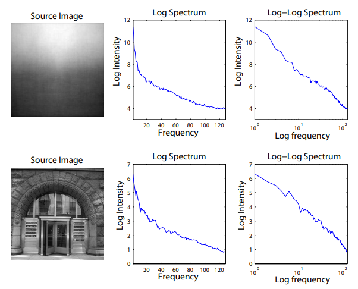
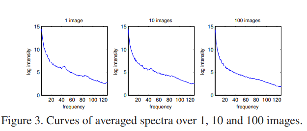
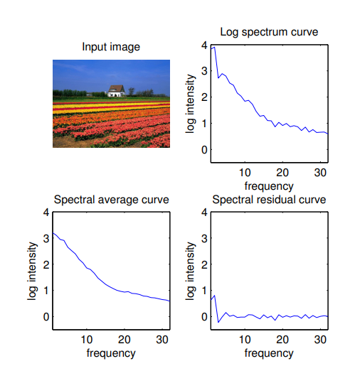
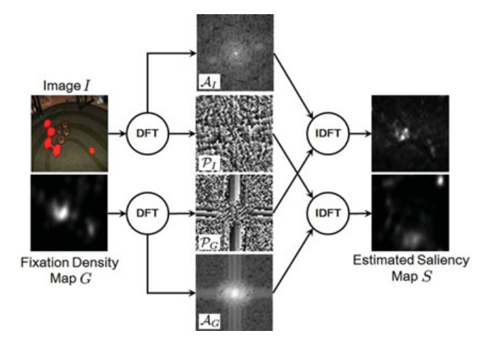
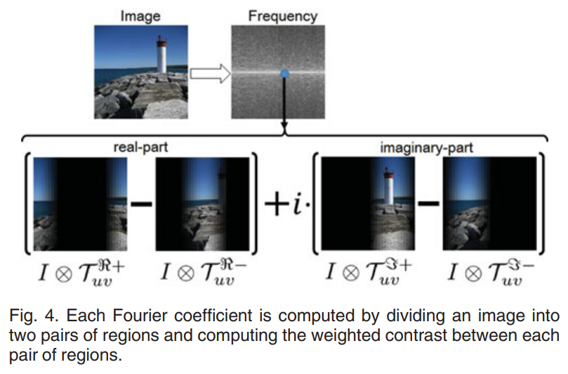

## Saliency Detection: A Spectral Residual Approach

Xiaodi Hou1, Liqing Zhang2, 2007 IEEE Conference on **computer vision and pattern recognition**

1. *Department of Computer Science, Shanghai Jiao Tong University*
2. *Department of Computer Science, Shanghai Jiao Tong University*

Spectral model is independent of features, categories, or other forms of prior knowledge of the objects. 通过分析图像的 log-spectrum，进一步从中提取出 spectral domain 上的 Spectral residual，并根据 spectral residual 构建出对应 spatial domain 上的 saliency map。

> [!NOTE|label:Fourier Domain]
> *Spatial Domain*: In the context of image processing, the spatial domain refers to the manipulation of the image's **pixels** directly. Operations in this domain, such as brightness adjustment or *contrast* enhancement, involve altering these pixel values directly.
> 
> *Frequency Domain*: The frequency domain represents a signal or an image in terms of its constituent frequencies. The Fourier Transform is a key tool here, ***converting a spatial or time-domain signal into a spectrum of frequencies***. This domain is crucial for understanding how different frequency components contribute to the overall signal.
> 
> *Spectral Domain*: The spectral domain is a more generalized term that typically refers to any representation of a signal based on its spectral content. This can include the frequency domain but also extends to other types of spectra, like wavelength in optics or energy levels in quantum mechanics.
>
> These domains offer different perspectives for analyzing and processing signals or images. For example, **noise reduction** might be more straightforward in the **frequency domain**, while **spatial filtering** would be directly applied in the **spatial domain**.
>
> *Spatiotemporal Domain*: The spatiotemporal domain extends the concept of the spatial domain by **adding the element of time**. This domain is crucial in applications like video processing, motion analysis, and any other field where understanding the dynamics of a scene is important.
> 
> *Time Domain*: This is where you see signals represented as they change over time
> 
> *Wavelet Domain*: A domain used for analyzing signals at multiple scales or resolutions, often used in image compression.
>
> 通过定义，资产横截面数据对应的 domain 应该是 *Spatial Domain* 或是 *Spatiotemporal Domain*

### Spectral Residual Model

A basic principle in visual system is to **suppress the response to frequently occurring features, while at the same time keeps sensitive to features that deviate from the norm**. Therefore, only **the unexpected signals** can be delivered to later stages of processing.

从信息论的角度，对于数据的有效编码可以将图像中的信息分为两部分：

$$
H(\text{Image})=H(\text{Innovation})+H(\text{Prior Knowledge}),
$$

$H(\text{Innovation})$ denotes the novelty part，$H(\text{Prior Knowledge})$ is redundant information. In the field of image statistics, such redundancies correspond to **statistical invariant properties** of our environment.  Now it is widely accepted that natural images are not random, they obey highly predictable distributions.

> 这句话给了我们许多 insight。

#### Log Spectrum Representation

**Scale invariance** refers to the property of an image or a signal where its basic statistical features remain consistent or unchanged when the scale of the image is altered.

本文用的 scale invariance property 是 $1/f$ law：

$$
\begin{equation}
    E\{\mathcal{A}(f)\}\propto1/f.
\end{equation}
$$

即频率越高，振幅(amplitude) 越小，

通常来说，学术界一般使用 log-log scale，即对 amplitude spectrum 进行两次 log。尽管被大规模使用，但是这种方法有两个缺点，

(1) the scale-invariance property is not likely to be found in **individual images**

单个图像不一定能够呈现出 scale-invariance，那么通过 log spectrum 能够得到更加 uniform 的结果。

(2) the sampling points are not well-proportioned, the low frequency parts span sparsely on the log-log plane, whereas the high frequency parts draw together, suffering from noise

这是 log 坐标系的问题【那么 log size 会不会有问题】，不利于分析。

因此，本文使用 log spectrum representation $\mathcal{L}(f)=\operatorname{log}\left(\mathcal{A}(f)\right)$

> [!TIP|label: Log-log and Log]
> **Log Spectrum**: In a log spectrum, only one axis (usually the amplitude or power axis) is on a logarithmic scale, while the other axis (usually frequency) remains on a linear scale.
>
> **Log-Log Spectrum**: Both axes are on logarithmic scales. This type of plot is used to identify power-law relationships, which are linear on a log-log plot. It's particularly relevant in analyzing scale-invariant properties of signals or images.

对一张、十张以及一百张照片取平均，发现了相似的规律。

This result suggests a **local linearity** in the averaged log spectrum

#### From spectral residual to saliency map

**Similarities imply redundancies.**

如果所有的照片都能体现出相似性，那么自然这不是我们需要的 Saliency。

> what deserves our attention is the information that jumps out of the smooth curves. We believe that the statistical singularities in the spectrum may be responsible for anomalous regions in the image, **where proto-objects are popped up**

首先通过以下公式拟合 the averaged spectrum，这一部分代表 general 的特性。

$$
\begin{equation}
    \mathcal{A}(f) = h_n (f) * \mathcal{L}(f)
\end{equation}
$$

其中 $h_n(f)$ 是 $n \times n$ 维矩阵：

$$
\left.h_n(f)=\dfrac{1}{n^2}\left(\begin{array}{cccc}1&1&\dots&1\\1&1&\dots&1\\\vdots&\vdots&\ddots&\vdots\\1&1&\dots&1\end{array}\right.\right)
$$

因此可定义 Spectral Residual，即为单个图片特征与平均 general 图片特征的区别：

$$
\begin{equation}
    \mathcal{R}(f)=\mathcal{L}(f)-\mathcal{A}(f).
\end{equation}
$$

得到 Spectral Residual 后，通过 Inverse Fourier Transform 得到 **Saliency map**。The content of spectral residual can also be reinterpreted as the unexpected portion of the image. Thus, the value at each point in a saliency map is then squared to indicate the **estimation error**. 

For better visual effects, we smoothed the saliency map with a gaussian filter $ g(x) (\sigma = 8) $

完整过程如下；

$$
\begin{align}
&\mathcal{A}(f) =\Re\Big(\mathfrak{F}\big[\mathcal{I}(x)\big]\Big),  \\
&\mathcal{P}(f) =\Im\Big(\mathfrak{F}\big[\mathcal{I}(x)\big]\Big),  \\
&\mathcal{L}(f) =\log\left(\mathcal{A}(f)\right), \\
&\mathcal{R}(f) =\mathcal{L}(f)-h_n(f)*\mathcal{L}(f),  \\
&\mathcal{S}(x) =g(x)*\mathfrak{F}^{-1}\Big[\exp\big(\mathcal{R}(f)+\mathcal{P}(f)\big)\Big]^2
\end{align}
$$

其中 $\mathfrak{F}, \mathfrak{F}^{-1}$ 代表 Fourier Transform 和 Inverse Fourier Transform， $\mathcal{P}(f)$ 代表 phase spectrum of the image。

### Detecting proto-objects in a saliency map

得到 Saliency map 后，剩下的就是识别 proto-objects，object map 定义如下：

$$
\begin{equation}
    \left.\mathcal{O}(x)=\left\{\begin{array}{ll}1&\text{if }\mathcal{S}(x)>\text{threshold},\\0&\text{otherwise}.\end{array}\right.\right.
\end{equation}
$$

其中，$\text{threshold} = E(\mathcal{S(x)}) \times 3 $， $E(\mathcal{S(x)})$ 是 Saliency map 的平均强度 (intensity)。

## Finding the Secret of Image Saliency in the Frequency Domain

Jia Li1, Ling-Yu Duan2, Xiaowu Chen3, Tiejun Huang4, Yonghong Tian5

1. *Member, IEEE, School of Computer Science and Engineering, Beihang University*
2. *Member, IEEE, School of Electronics Engineering and Computer Science, Peking University*
3. *Member, IEEE, School of Computer Science and Engineering, Beihang University*
4. *Senior Member, School of Electronics Engineering and Computer Science, Peking University*
5. *Senior Member, School of Electronics Engineering and Computer Science, Peking University*

目前研究 Image Saliency 的文献，均是在频域上进行操作的，但是并不清楚频域中的哪一部分对于识别 Saliency 是最关键的。

本文的第一部分，通过多个 empirical experiment 发现 **the phases of intermediate frequencies** 是最重要的部分。其中，**实数和虚数部分的正负极为重要**。为了解释这一结论，文章从 **the template-based contraset computation** 的角度对 discrete Fourier transform 做了重构。

第二部分：是通过这些实证经验，构造 Saliency detector。自称是第一个用机器学习方法在 frequency domain 解决 visual saliency 的问题。

第三部分就是实证模型对比。此处需要强调的是，文章中反复提及一点:

> *the prior knowledge obtained through similar scenes viewed before plays an important role in separating targets and distractors*

其实就是对 input 做了 ICA，去除了 redundant 成分。

### Literature

Three branches of visual saliency modeling:

1. **Objectness proposal generation**: focuses on locating "objects", including both targets and distractors.

2. **Fixation prediction**: aims to roughly pop-out only targets adn inhibit distractors

3. **Salient object segmentation**: proposes to exactly segment the closed contours of salient targets.

有许多模型是直接在 Spatial or spatiotemporal domain 进行的。如果要在 frequency domain 中进行操作，一般分为如下三个步骤：

(1) applying discrete Fourier transform (DFT) 

(2) **modulating** the frequency spectrum

(3) generating saliency map through inverse DFT/DCT

在频域领域的文章中，poineer work 就是这个 notes 的第一篇，利用 residual 来识别 Saliency。在此基础上，Guo and Zhang 提出了两个**非常重要的改进**：

1. use **only the phase spectrum** of image intensity (and unity magnitude) for saliency detection

随后，Hou, Harel, and Koch (2012, PAMI) 证明了 discrete Cosine transform 的系数在 detect saliency 中起到了非常重要的作用

2. represented an image as a **quaternion** comprising of four feature channels (i.e.,intensity, red/green and blue/ yellow color opponencies, and motion). 【Notes 第二篇文章】

> Thus image (or video) saliency can be simultaneously estimated through the frequency spectrum obtained by applying HFT to multiple features

Among the two improvements, **the latter one has much stronger impact than the former one**, it becomes very popular to represent an image as a quaternion in recent studies

### The secret of Saliency

As discussed above, both *spectral amplitude* and *phase* can contribute to the detection of salient target

#### Qualitative Study

the objective of saliency prediction is to generate a saliency map $S$ for an input image $I$ that perfectly approximates its fixation density map $G$

$$
\begin{equation}
    I\Rightarrow S\rightarrow G,
\end{equation}
$$

在频域上的表达为：

$$
\begin{equation}
    \mathscr{F}[I]\Rightarrow\mathscr{F}[S]\to\mathscr{F}[G],
\end{equation}
$$

也就是说，在频域上，$S$ 的振幅和相位都要靠近 $G$:

$$
\begin{equation}
    \mathcal{A}(F[S])\to\mathcal{A}(F[G]),\mathcal{P}(F[S])\to\mathcal{P}(F[G]),
\end{equation}
$$

集合 $I$ 中的东西是最拉的，$G$ 里的东西是最好使的，那么最拉的振幅配上最猛的相位和最拉的相位配上最猛的振幅，一下就能看出到底是谁在起作用，结果显示：**是相位在起作用**。

#### Quantitative Study

#### A Template-Based Reinterpretation of DFT

对于给定的图像 $I$，其 complex-valued Fourier coefficient at $u, v$ 估计系数如下：

$$
\begin{equation}
    F(u,v)=\sum_{x=0}^{N-1}\sum_{y=0}^{N-1}I(x,y)e^{i\theta},\theta=\frac{-2\pi(ux+vy)}N,
\end{equation}
$$

$F(u,v)$ 实部与虚部可以写为如下形式：

$$
\begin{align}
    \begin{gathered}
    \Re(u,v)=\sum_{\cos\theta\geq0}\operatorname{cos}\theta I(x,y)+\sum_{\operatorname{cos}\theta<0}\operatorname{cos}\theta I(x,y), \\
    \begin{aligned}\Im(u,v)=\sum_{\sin\theta\geq0}\sin\theta I(x,y)+\sum_{\sin\theta<0}\sin\theta I(x,y).\end{aligned} 
    \end{gathered}
\end{align}
$$

这也正是说明了，傅里叶变换的系数可以写为 **template-based contrasts**。

进一步地，实部与虚部能够通过一些 template 表示：

$$
\begin{equation}
    \begin{aligned}\Re(u,v)&=\left\langle I\otimes\mathcal{T}_{uv}^{\Re+}\right\rangle-\left\langle I\otimes\mathcal{T}_{uv}^{\Re-}\right\rangle,\\\Im(u,v)&=\left\langle I\otimes\mathcal{T}_{uv}^{\Im+}\right\rangle-\left\langle I\otimes\mathcal{T}_{uv}^{\Im-}\right\rangle,\end{aligned}
\end{equation}
$$

其中，

$$
\begin{align}
\begin{gathered}
    \mathcal{T}_{uv}^{\Re+}(x,y) =\max(\cos\theta,0), \\
    \mathcal{T}_{uv}^{\Im+}(x,y) =\max(\sin\theta,0), \\
    \mathcal{T}_{uv}^{\Re-}(x,y) =\max(-\cos\theta,0), \\
    \mathcal{T}_{uv}^{\Im-}(x,y) =\max(-\sin\theta,0). 
\end{gathered}
\end{align}
$$

也就是说，这四个 templates 将 input 分为了两个**加权对比组**。

### Saliency Detector

#### Principles for detector

(1) Multiple complementary feature channels are preferred to fully utilize the input visual stimuli.

(2) Both spectral amplitude and phase should be modulated to reach the best performance. 【filter 的使用】

(3) **Phase modulation helps to locate the salient targets, and amplitude modulation helps to clean up probable noise**

(4) **Intermediate frequencies** should be emphasized, and the lowest and highest frequencies should be suppressed

(5) Fourier coefficients can be adjusted with respect to their neighbors for encoding template-based contrasts at similar orientations and scales.

> 这些都是在图像领域的实证之谈，那么在金融领域，是**无法照搬套用**的。

$$
\begin{equation}
    \begin{gathered}
    F_{I_{c}} =\mathcal{N}(\mathscr{F}[I_{c}]\otimes H_{bh}),~\forall c\in\{1,\ldots,C\}, \\
    F_{I_{c}}^{*} =\mathcal{N}\bigg(F_{I_c}*H_p^c\bigg),\forall c\in\{1,\ldots,C\}, \\
    \text{S} =\sum_{c=1}^{C}\bigg|\mathcal{F}^{-1}\bigg[\mathcal{N}\bigg(F_{I_{c}}^{*}\otimes H_{bl}\bigg)\otimes H_{bl}\bigg]\bigg|^{2}, 
    \end{gathered}
\end{equation}
$$

