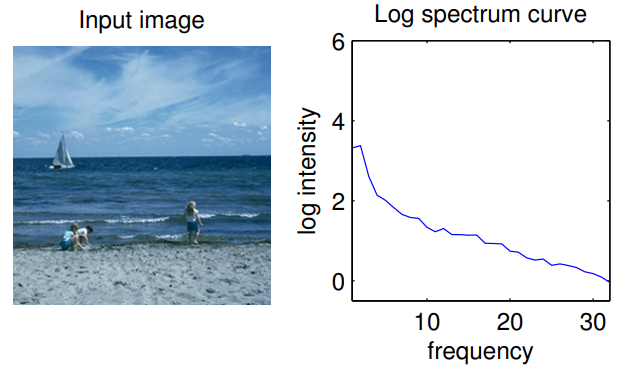
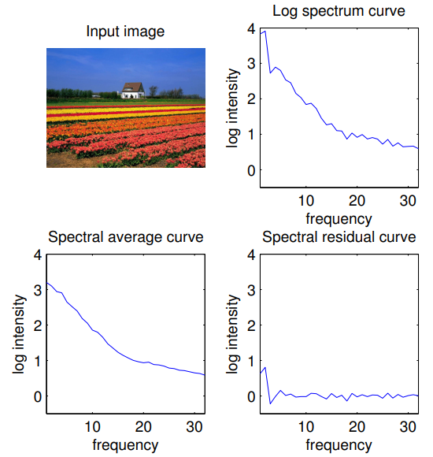
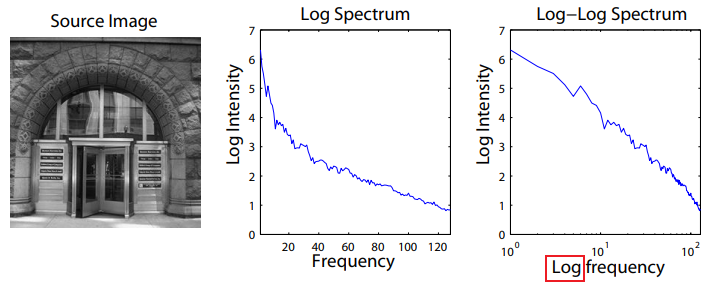
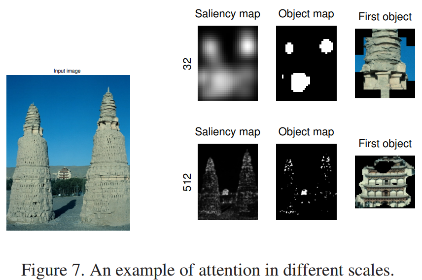
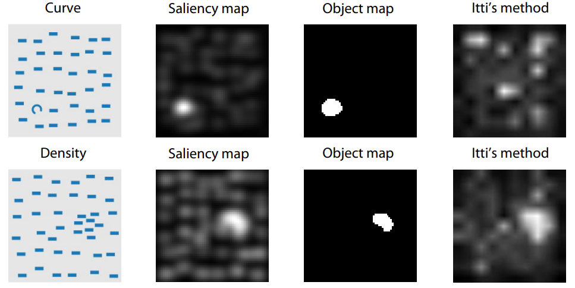

# Saliency Detection: A Spectral Residual Approach

Xiaodi Hou1, Liqing Zhang2, 2007 IEEE Conference on **computer vision and pattern recognition**

1. *Department of Computer Science, Shanghai Jiao Tong University*
2. *Department of Computer Science, Shanghai Jiao Tong University*

## Spectral Residual Model

***How to find target objects (saliency) in an image?***

A basic principle in visual system is to **suppress the response to frequently occurring features, while at the same time keeps sensitive to features that deviate from the norm**. Therefore, only **the unexpected signals** can be delivered to later stages of processing.

从信息论的角度，对于数据的有效编码可以将图像中的信息分为两部分：

$$
H(\text{Image})=H(\text{Innovation})+H(\text{Prior Knowledge}),
$$

- $H(\text{Innovation})$ denotes the novelty part
- $H(\text{Prior Knowledge})$ is redundant information. 

可以理解为：一张图片分为有用的【重点】和没用的【多余】。一般来说，识别图片中的物体可以从 object 的特点出发，然而不同的 object 往往并不具有 general 的特性，然而这些多余的部分却有一定的相通之处。

> 好的各有千秋，坏的千篇一律。

In the field of image statistics, such redundancies correspond to **statistical invariant properties** of our environment, and **scale invariance** is the most famous and most widely studied property.

Scale invariance 这一性质也被称之为 $1/f$ law：

$$
\begin{equation}
    E\{\mathcal{A}(f)\}\propto1/f.
\end{equation}
$$

其中 $f$ 代表频率，这一性质告诉我们：对于傅里叶分解后的频率成分来说，**频率越高，振幅越低**。以下例说明：

那么这跟 Saliency 又有什么关系呢？这一性质是广泛存在于各类图片当中的，我们对 1 张，10 张，100 张图片做分析，得到的都是类似的结果：

特别地，我们观察到，当图片数量越多，曲线则越平滑，此时曲线所描述的就是**多余部分的信息**，或者说，是在不存在 target objects 的情况下，图片背景所应该呈现出的趋势。

> **Similarities imply redundancies.**

***自然而然地，对于任何一张图片而言，如果包含 target object，那么就会对这种趋势出现背离。*** 从而我们可以 finding the saliency。

## Methodology

### Log or Log-Log

通常来说，学术界一般使用 log-log scale，即对得到的 frequency-amplitude 图横纵坐标都进行 log。这种方法最大的问题是频率分布不均匀，低频太过分散而高频又太过集中：

因此，本文使用 log spectrum representation $\mathcal{L}(f)=\operatorname{log}\left(\mathcal{A}(f)\right)$。

### From spectral residual to saliency map

**Spectral Residual** 定义如下，用以表示单个图片特征与平均 general 图片特征的区别：

$$
\begin{equation}
    \mathcal{R}(f)=\mathcal{L}(f)-\mathcal{A}(f).
\end{equation}
$$

$\mathcal{L}(f)$ 是图像振幅谱，$\mathcal{A}(f)$ 是平均振幅谱，通过对 $\mathcal{L}(f)$ 进行均值滤波得到：

$$
\begin{equation}
    \mathcal{A}(f) = h_n (f) * \mathcal{L}(f)
\end{equation}
$$

其中 $h_n(f)$ 是 $n \times n$ 维矩阵：

$$
\left.h_n(f)=\dfrac{1}{n^2}\left(\begin{array}{cccc}1&1&\dots&1\\1&1&\dots&1\\\vdots&\vdots&\ddots&\vdots\\1&1&\dots&1\end{array}\right.\right)
$$

具体过程如下；

$$
\begin{align}
&\mathcal{A}(f) =\Re\Big(\mathfrak{F}\big[\mathcal{I}(x)\big]\Big),  \\
&\mathcal{P}(f) =\Im\Big(\mathfrak{F}\big[\mathcal{I}(x)\big]\Big),  \\
&\mathcal{L}(f) =\log\left(\mathcal{A}(f)\right), \\
&\mathcal{R}(f) =\mathcal{L}(f)-h_n(f)*\mathcal{L}(f),  \\
&\mathcal{S}(x) =g(x)*\mathfrak{F}^{-1}\Big[\exp\big(\mathcal{R}(f)+\mathcal{P}(f)\big)\Big]^2
\end{align}
$$

- $I(x)$ is the input image
- $\mathfrak{F}, \mathfrak{F}^{-1}$ 代表 Fourier Transform 和 Inverse Fourier Transform， 
- $\mathcal{P}(f)$ 代表 phase spectrum of the image。
- $ g(x) (\sigma = 8) $ is a gaussian filter

对于输入图像做傅里叶变换，求出振幅谱 $\mathcal{A}(f)$ 和相位谱 $\mathcal{P}(f)$，对于 Log 振幅谱 $\mathcal{L}(f)$ 进行卷积并相减得到 Spectral Residual 谱 $\mathcal{R}(f)$，

### Detecting proto-objects in a saliency map

得到 Saliency map 后，剩下的就是识别 proto-objects，object map 定义如下：

$$
\begin{equation}
    \left.\mathcal{O}(x)=\left\{\begin{array}{ll}1&\text{if }\mathcal{S}(x)>\text{threshold},\\0&\text{otherwise}.\end{array}\right.\right.
\end{equation}
$$

其中，$\text{threshold} = E(\mathcal{S(x)}) \times 3 $， $E(\mathcal{S(x)})$ 是 Saliency map 的平均强度 (intensity)。

> **trade-off** between false alarm and neglect of objects

#### Selection of visual scales

*A visual system works under certain scales.* 

In a large scale, one may perceive a house as an object, but in a small scale, it is very likely that the front door of the house pops up as an object

*The selection of scale in our experiment is equal to the selection of the the input image size.*

对于包含同样 object 的图片，当图片很小时 ($32\times32$)，细节部分会被模糊掉，因此视觉系统会关注占比更大的部分；当图片很大时，占比更大的 object 就不如虽然小但是变化明显的 (*small but abrupt change*) object 更加显著。

文章最后选取了 $64\times64$ 作为 scale。

## Experiment

效果很好

