# All the Information regarding Fourier Transformation applied in Finance

这几天看了多篇有关对于时序数据应用傅里叶的论文，获得了很多 insights。之所以想要多看一些论文，是因为感觉在时序领域应用傅里叶是一个老生常谈的话题，那么该有很多之前常规的处理方法，能够使我们避开一些没有必要的坑；其次，这些论文也能够给我们一些启示，关于如何使用傅里叶分解后得到的系数，例如，不仅通过可以通过频率filter，还可以通过振幅filter。

通过这些论文，有一些问题需要我们尽快思考：

1. 平稳性与周期性
2. 如何处理 spectral leakage
3. 找到了能够处理filter后逆傅里叶变换产生的畸变问题
4. 如何对傅里叶结果进行 filter
5. 我在文章下写了 insight，其中包含了关于如何将傅里叶与金融原理联系起来的思考
6. 目前的确很少人用相位去做一些东西

## Handling single stock - Tesla

[Handling stock data using the fourier transformation](https://medium.com/intuition/quantamental-approach-to-stock-trading-using-the-fourier-analysis-58f64792290)

为了避开特斯拉 2019-2020 年的暴涨暴跌，选取了 14-18 年的价格数据做傅里叶分解

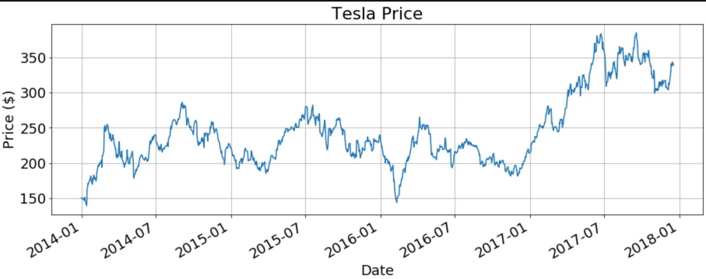

另外，该文仅选取了**振幅高于三倍标准差的频率**，而将其余视为噪音。最终仅选出了三个信号。

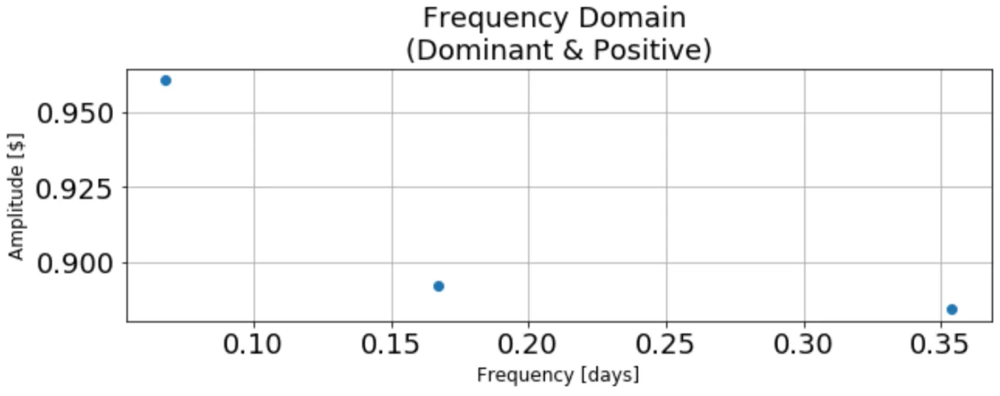

文章最后并没有给出应用，仅做了分解。i

**Insights：**

1. 暴涨暴跌难道不是周期的一部分？
2. 不止可以从频率角度筛选信号，还可以从振幅角度筛选，文章是直接选取了所有振幅三倍标准差之外的振幅，可不可以分频率来看？选择对应频率三倍之外的振幅？

## The impact of stock market price fourier transform analysis on the gated recurrent unit classifier model 

*Expert Systems with Applications, 2020, Radojičić D, Kredatus S*, citation: 21

对股价进行傅里叶分解后与 GRU 的结合。

具体做法如下：

首先有一些 features，such as prices of different Limit Order Book levels and open, close, low, high prices of the preselected time intervals，然后使用 Stochastic universal sampling (SUS) 方法从这些已有 features 中提取有价值的 feature，称之为 old-fashioned features，这是**第一个数据集**。

接着对这些 old-fashioned features 使用傅里叶变换，得到新的 feature，new features combined with old features 是**第二个数据集**。

**进行傅里叶分解后保留了哪些提取后的成分？**：

> we extract the *maximum magnitude, average magnitude, maximum phase, maximum amplitude and the average amplitude*

**GRU 的输出是啥**：the probability that the strategy shall issue a buy command ($\geq 0.5$) or idle otherwise ($\leq 0.5$)

> [!NOTE|Stationary]
> 使用傅里叶分解时，是否需要平稳性？
>
> 文章使用了**收盘价与5日均线的差**作为傅里叶分解目标，并通过 Augmented Dickey-Fuller test 证明了其平稳性。
> 
> 文章中原话为：Since the stationarity is confirmed, we proceed by extracting the Fourier transformation based features.
>
> 但第一篇博客也没有要求。

文章还提出了一个问题：如何判断傅里叶分解提取出的 component 是否有用？可以计算提取出的时间序列与 label 之间的**互信息（mutual information）**，如果互信息为零则代表独立。

**label 是啥**：文章研究加上傅里叶提取出的这些特征，能否提高 GRU 的预测能力，有两个假设：

1. The higher absolute value of the feature autocorrelation means higher likely-hood of the indicator imposing repetitive pattern thus we can infer knowledge easier.

2. Another hypothesis is that the feature having the higher value of mutual information with respect to the close price holds more information relevant for the decision buy/idle.

文章没有说太清楚，应该是指的 GRU output 对于涨跌的预测能力：

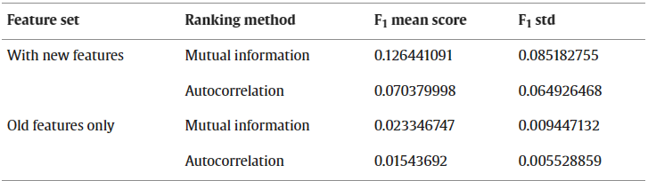

**Insights：**

- 同样地，不仅根据频率筛选，还根据振幅筛选（maximum amplitude）
- 既然我们认为 ret 的变化具有周期性，进一步外推，就也可以假设特征的变化具有周期性。例如，我们认为 size 和 return 之间有显著的关系，作为影响因素之一，那么 size 的周期变化就一定会体现在 return 的周期变化中，也就是说，在对 return 进行傅里叶分解得到的不同频率中，一定隐含着众多的信号，如何筛选出这些信号对应的周期函数？【**周期中的稀疏性**】在每一个频率取最大振幅？
- 按照这种推论，那么不同股票(portfolio)之间，应该有共同的周期函数（common factor），也应该有不同的周期函数（specific factor）

##  Analysis of stock market data by using Dynamic Fourier and Wavelets techniques

*Mariani M C, Bhuiyan M A M, Tweneboah O K, et al. Physica A: Statistical Mechanics and its Applications, 2020*, citation: 11

**Spectral leakage**

这是一个极其重要的概念，会很严重地影响傅里叶的估计。

傅里叶的假设是数据为infinite和periodic，但是我们能用的都是 finite sample，在进行傅里叶变换时，需要先把数据 replicate infinite times to get a infinite sample。此时，如果数据在对应时间内不是一个整数周期，那么在 replicate时，就会出现首尾不相连的问题，从而导致 spectral leakage，如下图。

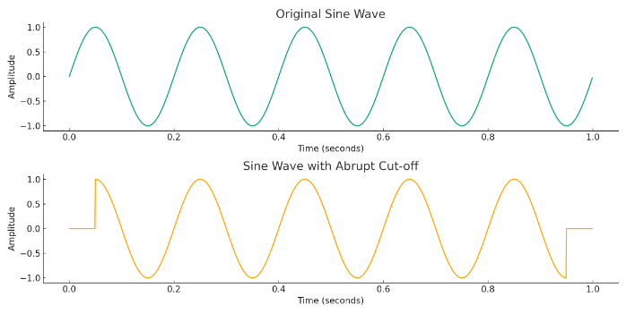

通过 **taper**，可以让 boundary 附近的位置变得smooth，从而一定程度上缓解了这个问题。

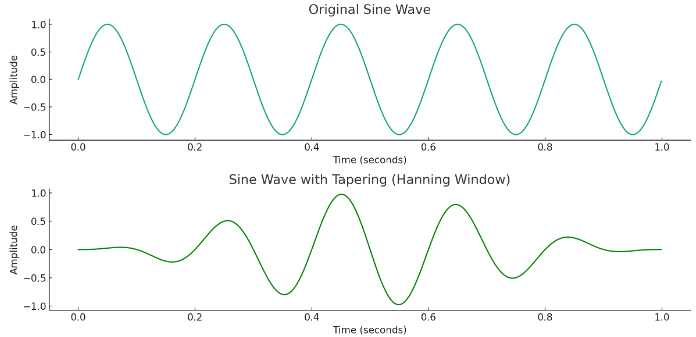

> While tapering reduces spectral leakage, it also modifies the original signal, which can affect the amplitude and width of the frequency components. This effect is a **trade-off** for a clearer frequency representation.

文章分析了 4 家当时最大的公司： Discover Financial Services company (Discover), Microsoft Corporation technology company (Microsoft), Walmart retail company (Walmart), and JPMorgan Chase financial services company (JPM) 的分钟级数据和日频数据

这篇文章对数据进行了比较详细的分析。

其选取的数据只有7天，包括了金融危机：

> **The data used is comprised of the *five trading days* March 10–14, 2008 predating the merging announcement over the weekend as well as the *two trading days* March 17 and following the event.**

**平稳性**：文章做了三个检验来说明数据的平稳性： *the Augmented Dickey Fuller (ADF)*, *the Phillips–Perron (PP)*, and *the Kwiatkowski–Phillips–Schmidt–Shin (KPSS) tests*，结果都显示数据平稳，非单位根。

**Long memory**：The presence of long memory suggests that the past information has a persistent impact on present information at different levels。文章一直做到 lag 100，在分钟级数据和日频数据都发现了 long memory。

接下来利用 DFT 与 wavelet transformation 对数据进行分析：

无论是对于分钟级或日频数据，使用 DFT 与 wavelet 都发现了**很大比例的的高频部分**

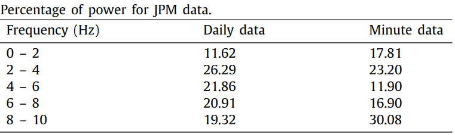
<figcaption> <strong> DFT 变换  </strong> </figcaption>

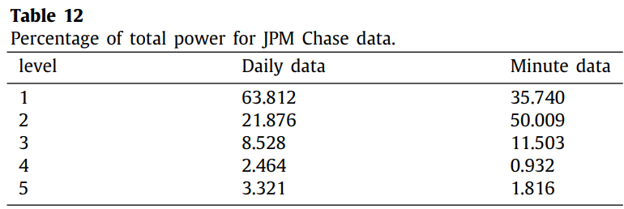
<figcaption> <strong> 小波变换 </strong> </figcaption>

并且对于 wavelet 来说，分钟级数据有更多 spike

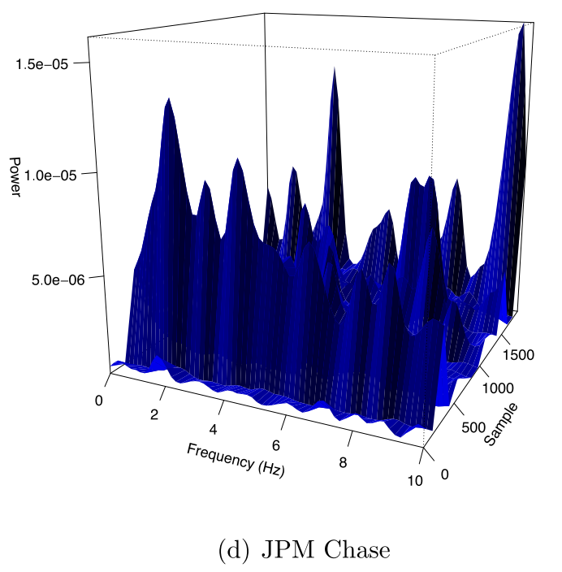
<figcaption>  <strong> 小波变换：分钟级数据  </strong> </figcaption>

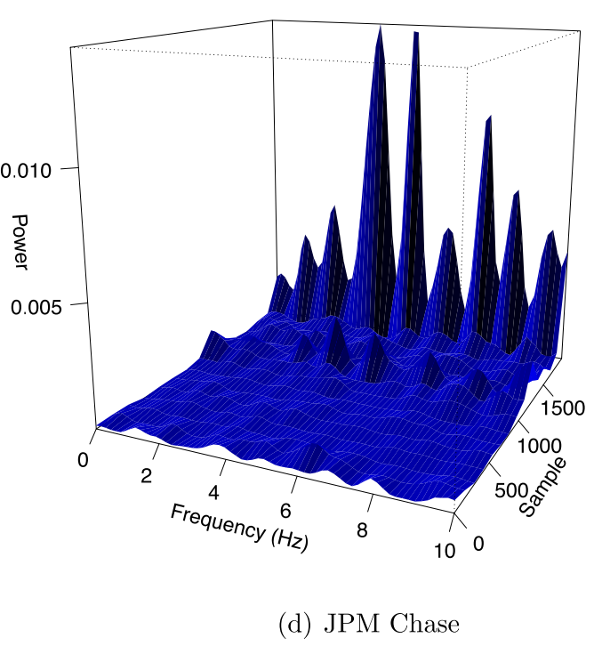
<figcaption> <strong> 小波变换：日频数据  </strong> </figcaption>

这也解释了为什么分钟级数据中高频的部分更多。此外，因为 wavelet 能够捕捉时域上的成分，其对于 crash 等的拟合效果更好。

## Measuring stock market resiliency with Discrete Fourier Transform for high frequency data

*Olbrys J, Mursztyn M. Physica A: Statistical Mechanics and Its Applications, 2019*, citation: 23

Resiliency 是金融市场中有关流动性的的一个重要概念，其中一种的衡量方式是股市从大跌到回复至正常水平的时间。本文提出一种新的、利用 DFT 和日内数据衡量 resiliency 的方法。

文章将 05-16 年的数据分为等长的 pre-crisis，crisis，post-crisis，试图研究 crisis 期间市场的 resiliency 与其他时间内是否不同。

文章在 Kim and Kim (2019) 的基础上进行了加强，从原本的日频模型改进成了频率更高的模型。**Kim 并没有考虑 signal leakage 的问题。**

> ***The most renowned method of decreasing the signal leakage impact is a data adjustment with a window function***

> [!TIP|label:Kim and Kim]
> Kim J, Kim Y. Transitory prices, resiliency, and the cross-section of stock returns[J]. International Review of Financial Analysis, 2019, 63: 243-256.
>

> [!THEOREM|label:Shannon–Nyquist theorem]
> with a data sample of length $N$ given, it is possible to capture the $N/2$ frequency at most
>
> R.J. Marks II, Handbook of Fourier Analysis & Its Applications, Oxford University Press, 2009.

对于 leakage 的问题，通常使用 window function 进行处理, window function might be perceived as a **filter** that smoothes signal over its time or frequency domain.

Harris (1978) puts solid theoretical background for DFT and windowing techniques, and gathers vast majority of window functions. Nuttall (1981) expands his work by introducing
many new windows. They are obtained by solving an optimization problem depending on some desired properties of a window. Heinzel et al. (2002) propose a useful framework for analysing window characteristics and introduce many flat-top windows.

> [!NOTE|label: Window function literature]
>
> 1. F.J. Harris, On the use of windows for harmonic analysis with the discrete Fourier transform, Proc. IEEE 66 (1) (1978) 51–83, http://dx.doi.org/10.1109/PROC.1978.10837.
> 
> 2. G. Heinzel, A. Rudiger, R. Schilling, Spectrum and spectral density estimation by the Discrete Fourier Transform (DFT), including a comprehensive list of window functions and some new flat-top windows, Technical Report, Max-Planck-Institute für ravitationsphysik, Teilinstitut Hannover, 2002.
>
> 3. A. Iacobucci, Spectral analysis for economic time series, in: J. Leskow, L.F. Punzo, M.P. Anyul (Eds.), New Tools of Economic dynamics, in: Lecture Notes in Economics and Mathematical Systems, vol. 551, Springer, Berlin, Heidelberg, 2005, pp. 203–219, http://dx.doi.org/10.1007/3-540-28444-3_12.
>
> 4. A.H. Nuttall, Some windows with very good sidelobe behaviour, IEEE Trans. Acoust. Speech Signal Process. 29 (1) (1981) 84–91.

window function 的**选取**对于问题的解决十分重要，the window might either be chosen from a wide range of existed ones or could be composed according to its desired properties (Harris, 1978)

对于高频数据来说，一方面需要获得频率成分，另一方面需要找到频率之间的联系，根据这两个需求，文章考虑了以下三个 window function：

1. The Hamming window function for a transaction $t,0\leq t<\text{N (WF1)}{:}$

$$
\omega(t)=0.54-0.46\cos\left(\frac{2\pi t}N\right)
$$

2. The Kaiser window function for a transaction $t,0\leq t<\text{N (WF2)}{:}$

$$
\omega(t)=\frac{l_0\left(\pi\alpha\sqrt{1-\left(\frac{2t}{N-1}-1\right)^2}\right)}{l_0(\pi\alpha)},
$$

where $I_0(x)=\sum_{k=0}^\infty\left(\frac{\left(\frac x2\right)^k}{k!}\right)^2$ is a modified Bessel function of the first kind and zeroth order

3.The SR785 Flat-Top window function for a transaction $t,0\leq t<\text{N (WF3)}{:}$

$$
\begin{gathered}
\omega(t) =1-1.93\cos\left(\frac{2\pi t}{N-1}\right)+1.29\cos\left(\frac{4\pi t}{N-1}\right) \\
-0.388\cos\left(\frac{6\pi t}{N-1}\right)+0.028\cos\left(\frac{8\pi t}{N-1}\right). 
\end{gathered}
$$

Flat-top windows are described as the ones with the smallest amplitude error of all of the windows. They are extremely useful when exact amplitude power is to be consumed (Heinzel et al. 2002)

文章选取了华沙最大的20个公司， 200501-201612 共 2994 天个交易日的 open, high, low, closing prices, and volume。

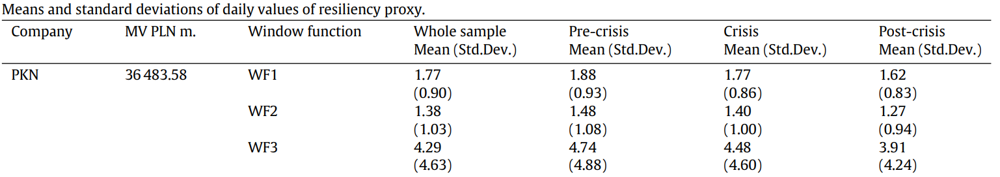

可以看到，**通过不同 window function 之后的数据差别还是很大的**。

最终，衡量 resiliency 的公式如下：

$$
Resiliency=\frac1{\left[\frac N2\right]}\sum_{k=1}^{\left[\frac N2\right]}\frac k{N^2}DFT_k=\frac1{\left[\frac N2\right]}\sum_{k=1}^{\left[\frac N2\right]}\frac k{N^2}\ln(p(t))\omega(t)\exp\left(\frac{2\pi ikt}N\right),
$$

关于这一公式的具体解释见下面这篇文章：

## Transitory prices, resiliency, and the cross-section of stock returns 

*Kim J, Kim Y. International Review of Financial Analysis, 2019*, citation: 17

**Main findings**: a zero-investment portfolio long in low-resiliency stocks and short in high-resiliency stocks earns significant abnormal returns.

股市流动性三个维度细分包括：depth，breadth，resiliency。其中前两者研究颇丰，而后者的定义都还不是十分清楚。作者定义 resiliency 为 quickness of the **transitory price recovery** from a non-fundamental liquidity shock。并且**通过 resiliency 实现了对股票的横截面区分**，背后的逻辑在于：low resiliency 的股票需要给投资者更多的 **liquidity premium**。

从定义中可以看出，Resiliency 与其他 dimension 不同之处在于，resiliency 还包含了时间的概念，而其他的维度只是衡量在某一时间节点的流动性。

> [!NOTE|label:Definition for Liquidity dimensions]
>
> **Depth**:  the size that investors can trade at a given price
>
> **Breadth**: the price at which investors can trade a given size

文章还有一个主要论点就是：price impact 可以被分为 permanent 和 transitory。Permanent 的部分是由于 information-correlated trade shocks 引起的，**会一直持续下去**，因此不是resiliency 的分析对象。而 transitory 的部分则是由于 information-**uncorrelated** shocks 导致的，因此会有 mean-reverting，**是我们需要分析的对象**。

>  A large number of studies including Glosten and Harris (1989), Hasbrouck (1991a, 1991b), Brennan and Subrahmanyam (1996), and Sadka (2006) suggest that market liquidity measures such as the bid-ask spread or market depth estimates reflect two types of price impacts, permanent and transitory.
>
> permanent components explain a significant portion of total impacts, whereas the transitory component can not be fully
captured by investigating informational price impacts

那么如何将价格序列分为 permanent 和 transitory 呢？作者使用 BN decomposition methodology 将价格序列分为了 random walk component 和 stationary component，**前者对应 permanent，后者对应 transitory price movement deviating from the permanent price**。

此处乍一看，十分令人费解。仔细思虑后，也许是这般道理：由切实利好消息导致的上涨是持续的，并且利好消息的出现是不可预测的（随机的），而对于 mean-reverting 来说，随机的价格冲击在股市中是持续发生的，因此具有周期性。

文章是通过傅里叶变换来度量 resiliency 的，那么如何将傅里叶变换与 resiliency 的概念连接起来呢？从下图就可以看出

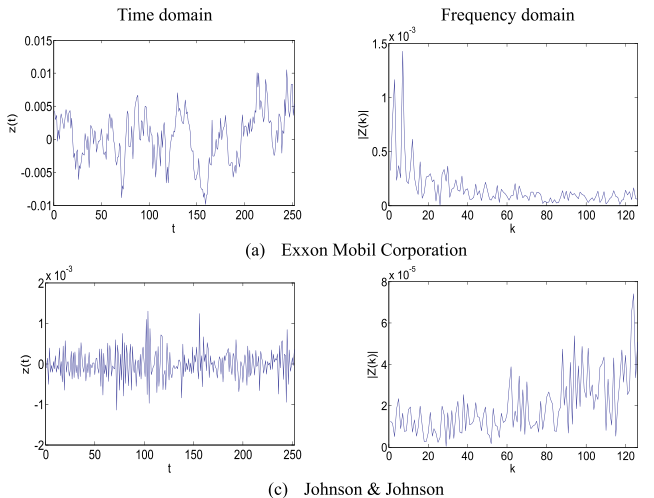

对于这两家公司的 transitory price 而言，在样本期内，Exxon 经历下跌后恢复到正常水平的时间远远高于 JJ，因此经过傅里叶分解后，其**频域主要集中在低频部分**，相反，**JJ 的频域主要集中在高频部分**。

> 其实也可以理解为是***反转（reversal）效应***，resiliency 的股票反转效应更强。

文章中有个十分有意思的概念，叫做 **pure magnitude**，是在傅里叶的基础上除上对应的周期长度，得到标准化后的 magnitude。

$$
Z_k=\sum_{t=1}^Dz_te^{-\frac{i2\pi kt}D},\quad\quad(k=1,2,\cdots,D), \quad \tilde{Z}_k=\frac1DZ_k,
$$

$|\tilde{Z}_k|$ 衡量了the distance to **the peak of the transitory price cycle that deviates from its fundamental value at each frequency level**。

因为股票在样本期内的有效数据长度不一样，因此需要除上交易天数来做标准化。例如，股票 A 数据有一年，B 有两年，那么 B 分解出的函数周期就会更长，使得振幅更大，但是从概念上来讲，我们并不希望 resiliency 与样本时长有关，因此需要进行标准化。

用标准化振幅衡量了单位 distance，想要得到速度，那么只需要计算出单位时间就可以。同样地，时间也需要进行标准化：

$$
T_k = \frac{1}{f_k},\quad f_k=\frac kD.
$$

**Speed of price reversal** move is regarded to be equal to the **magnitude of the kth frequency stripe transformation value** divided by **its corresponding period**

用单位距离除上单位时间，则得到了其恢复到正常水平的时间。

$$
Resiliency_{i,t}=\frac1{\left[\frac{D_{i,t}}2\right]}\sum_{k=1}^{[D_{i,t}/2]}\frac{2\mid\widetilde{Z}_{k,i,t}|}{T_{k,i,t}}=\frac1{\left[\frac{D_{i,t}}2\right]}\sum_{k=1}^{[D_{i,t}/2]}2\mid\widetilde{Z}_{k,i,t}|\cdot f_{k,i,t},
$$

至此，解释了如何用 Fourier transformation 衡量 resiliency。

## Forecasting stock market indices using padding-based fourier transform denoising and time series deep learning models

Song D, Baek A M C, Kim N. IEEE Access, 2021, citation:23

> *these wavelet denoising methods have limitations in terms of retrieving weak signals with magnitudes close to the noise*
>
> *In the financial market, it is commonly accepted that the volatility resulting from short-term traders, who tend to execute relatively high-frequency trades throughout the day with small assets, can affect the daily price of the stock but has minimal effects on its momentum or major trend. In this study, such volatility is considered noise.*

In this study, we proposed a method for removing noise from a frequency domain and restoring it into smoothed data without significant loss of original information by applying the padding technique to FT.

解决了去除高频后恢复到 time domain 出现的畸变。

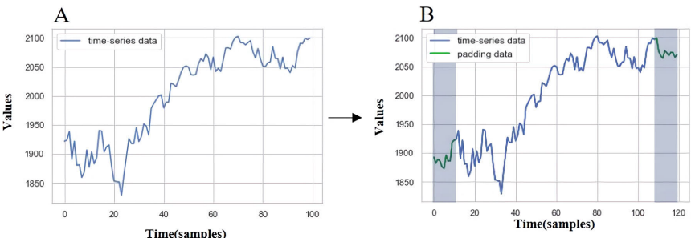

得到畸变时期长度 n 后【跟去除周期的频率有关系】，计算原序列最近 n 期的标准差，然后进行采样 padding n 次【首尾就是 2n 次】，将原序列从 m 扩展到 m+2n，然后进行傅里叶逆变换等操作，这样发生畸变的就是填充出的 2n，而不是原本 m 里的 2n，这一方法就是 P-DFT。

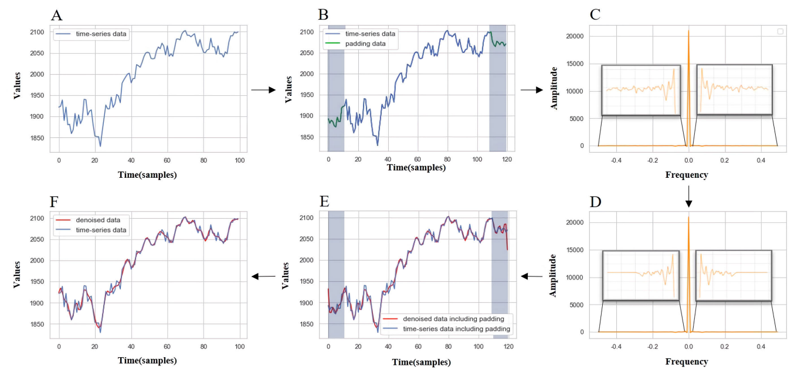

文章具体思路如下：

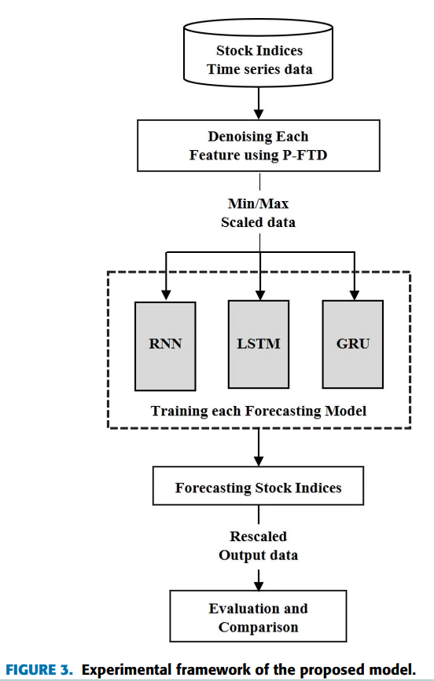

文章应该是将模型分为两类，第一类feature和index series 均不使用P-DFT，第二类均使用。
或者是第二类仅对 features 使用。或者是二者均对 index series 使用，但第一类不对 features 使用，具体是啥，看了好几遍，文章也没说清楚。

结果发现，的确模型在 P-DFT 之后有更好的表现

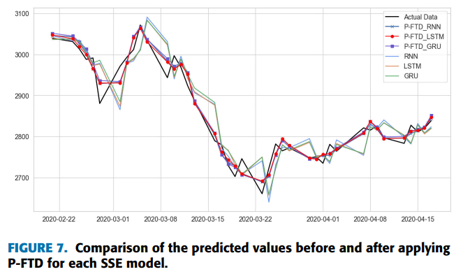

**Insights：**

- padding 的方法的确可以处理畸变的问题
- 本文没有提及平稳性的问题
