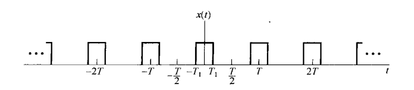
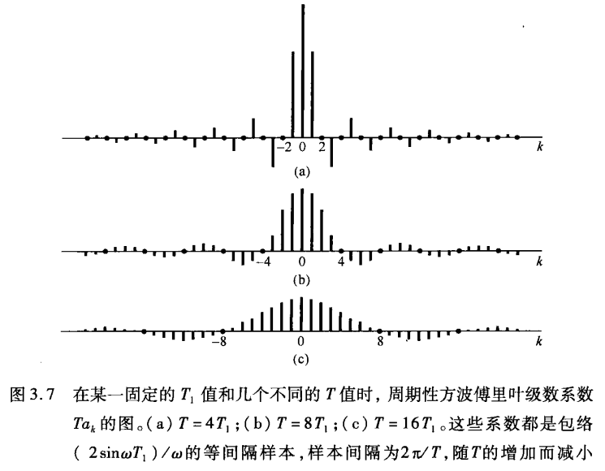
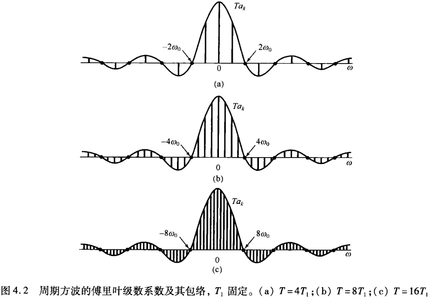
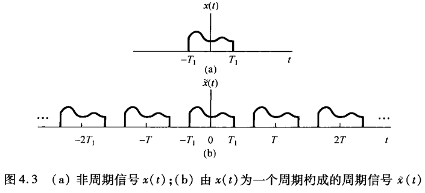

# 傅里叶分析

## 连续信号与离散信号

### 连续信号的周期性质

对于**连续信号**

$$
x(t) = e^{j \omega_0 t}
$$

的一个重要性质是，它是周期信号，可以通过周期函数的性质来证明，如果存在一个 $T$ 使得下式成立：

$$
\mathrm{e}^{j\omega_{0}t}=\mathrm{e}^{j\omega_{0}(t+T)}
$$

则 $x(t)$ 就是周期的。由于：

$$
\mathrm{e}^{j\omega_{0}(t+T)}=\mathrm{e}^{j\omega_{0}t}\mathrm{e}^{j\omega_{0}T}
$$

要使 $x(t)$ 是周期的，就必须有：

$$
\mathrm{e}^{j\omega_{0}T} = 1
$$

若 $\omega_0 = 0$，则 $x(t)=1$，这时对任何 $T$ 值 $x(t)$ 都是周期的；若 $\omega_0 \neq 0$，那么使 $x(t)$ 为周期函数的最小 $T$ 值，即基波周期 $T_0$ 应为

$$
T_0 = \frac{2\pi}{|\omega_0|}
$$

对于离散信号，在周期性质方面的表现与连续信号是十分不同的。连续信号有以下两个性质：

1. ***$\omega_0$ 愈大，信号震荡的速率就越高***
2. ***$e^{j \omega_0 t}$ 对于任何 $\omega_0$ 都是周期的。***

对于第一个性质，是二者一个极为不同之处，对于频率为 $\omega_0 + 2\pi$ 的离散时间复指数信号：

$$
\mathrm{e}^{j(\omega_{0}+2\pi)n}=\mathrm{e}^{j2\pi n}\mathrm{e}^{j\omega_{0}n}=\mathrm{e}^{j\omega_{0}n}
$$

可以看出离散时间复指数信号在频率 $\omega_0 = 2\pi$ 与频率 $\omega_0$ 时是**完全一样**的。这一点和连续时间复指数信号 $e^{j \omega t}$ 完全不同，**后者不同的 $\omega_0$ 就对应着不同的信号**。因此，在考虑这种离散时间复指数信号时，仅仅需要在某一个 $2\pi$ 时间间隔内选择 $\omega_0$ 即可。

由于这种周期性质，自然 $\mathrm{e}^{j\omega_{0}n}$ 不具有随 $\omega_0$ 在数值上的增加而不断增加其振荡频率的特性。

> [!NOTE|label:Difference]
> 对于离散信号，$n$ 为整数，因此总有：
$$
\mathrm{e}^{j2\pi n} = 1
$$ 
> 而对于连续信号而言，
$$
\mathrm{e}^{j(\omega_{0}+2\pi)t}=\mathrm{e}^{j2\pi t} \mathrm{e}^{j\omega_{0}t}
$$
> $t$ 并不总为整数，因此 $\mathrm{e}^{j2\pi t}$ 并不总为 1，所以不同 $\omega$ 实际上对应了不同的频率波。

对于性质二，为了使信号 $e^{j\omega_0 n}$ 是周期的，周期为 $N > 0$，就必须有：

$$
\mathrm{e}^{j\omega_{0}(n+N)}=\mathrm{e}^{j\omega_{0}n}
$$

也就是要求 $\mathrm{e}^{j\omega_{0}N} = 1$，也就是说，$\omega_0 N$ 必须是 $2\pi$ 的整数倍，即

$$
\omega_{0}N=2\pi m
$$

因此其基波频率为 

$$
\frac{2\pi}N=\frac{\omega_0}m
$$

> 二者的这一差别在后续中均有所体现

## 连续时间周期信号的傅里叶级数表示及确定

对于周期复指数信号

$$
\begin{equation}
    x(t) = e^{j \omega_0 t},
\end{equation}
$$

其基波频率为 $\omega_0$，基波周期为 $T = 2\pi / \omega_0$，与其成**谐波关系** (harmonically related) 的复指数信号集为：

> 谐波关系指的是：谐波频率是基波频率的整倍数

$$
\begin{equation}
    \phi_{k}(t)=\mathrm{e}^{jk\omega_{0}t}=\mathrm{e}^{jk(2\pi/T)t},\quad k=0,\pm1,\pm2,\cdots 
\end{equation}
$$

这些信号中的每一个都有一个基波频率，它是 $\omega_0$ 的倍数。因此每一个信号对周期 $T$ 来说都是周期的。 于是，一个由成谐波关系的复指数线性组合形成的信号

$$
\begin{equation}
    x(t)=\sum_{k=-\infty}^{+\infty}a_{k}\mathrm{e}^{jk\omega_{0}t}=\sum_{k=-\infty}^{+\infty}a_{k}\mathrm{e}^{jk(2\pi/T)t}
\end{equation}
$$

对 $T$ 来说也是周期的。该式就称之为是**周期信号**的**傅里叶级数**表示。

对等式两侧同时乘以 $e^{-jn \omega_0t}$，可得：

$$
x(t)\mathrm{e}^{-jn\omega_{0}t}=\sum_{k=-\infty}^{+\infty}a_{k}\mathrm{e}^{jk\omega_{0}t}\mathrm{e}^{-jn\omega_{0}t}
$$

等式两侧同时对 $t$ 从 $0$ 到 $T = 2\pi / \omega_0$ 进行积分，有

$$
\begin{aligned}
    \int_{0}^{T}x(t)\mathrm{e}^{-jn\omega_{0}t}\mathrm{d}t&=\int_{0}^{T}\sum_{k=-\infty}^{+\infty}a_{k}\mathrm{e}^{jk\omega_{0}t}\mathrm{e}^{-jn\omega_{0}t}\mathrm{d}t \\
    \int_0^Tx(t)\mathrm{e}^{-jn\omega_0t}\mathrm{d}t&=\sum_{k=-\infty}^{+\infty}a_k\left[\int_0^T\mathrm{e}^{j(k-n)\omega_0t}\mathrm{d}t\right]    
\end{aligned}
$$

对等式右侧运用欧拉公式得

$$
\int_0^T\mathrm{e}^{j(k-n)\omega_0t}\mathrm{d}t=\int_0^T\cos(k-n)\omega_0t\mathrm{d}t+\mathrm{j}\int_0^T\sin(k-n)\omega_0t\mathrm{d}t
$$

因为 $T$ 是基波周期，因此相当于对 sin 和 cos 在周期上进行积分，当 $k \neq n$ 则积分值为零，当 $k=n$，则积分值为 T，即

$$
\left.\int_0^T\mathrm{e}^{j(k-n)\omega_0t}\mathrm{d}t=\left\{\begin{array}{ll}T,&\quad k=n\\0,&\quad k\neq n\end{array}\right.\right.
$$

因此原式化为

$$
\begin{aligned}
    &\int_{0}^{T}x(t)\mathrm{e}^{-jn\omega_{0}t}\mathrm{d}t = a_n T \\
    \Longrightarrow \ & a_n = \frac{1}{T} \int_0^T x(t)\mathrm{e}^{-jn\omega_{0}t}\mathrm{d}t
\end{aligned}
$$

上述过程可归纳如下：

如果 $x(t)$ 有一个傅里叶级数表示式，即 $x(t)$ 能表示成一组成谐波关系的复指数信号的线性组合，那么其系数就可确定，如下：

$$
\begin{align}
    x(t)&=\sum_{k=-\infty}^{+\infty}a_{k}\mathrm{e}^{\mathrm{j}k\omega_{0}t}=\sum_{k=-\infty}^{+\infty}a_{k}\mathrm{e}^{\mathrm{j}k(2\pi/T)t} \\
    a_k&=\frac1T\int_Tx(t)\mathrm{e}^{-\mathrm{j}k\omega_0t}\mathrm{d}t=\frac1T\int_Tx(t)\mathrm{e}^{-\mathrm{j}k(2\pi/T)t}\mathrm{d}t
\end{align}
$$

其中，系数 $a_k$ 往往称为 $x(t)$ 的**傅里叶级数系数** (Fourier series coefficients) 或**频谱系数** (spectral coefficients)。这些复数系数，是对信号 $x(t)$ 中的每一个谐波分量大小的度量。系数 $a_0$ 就是 $x(t)$ 中的直流或常数分量，将 $k=0$ 带入得：

$$
a_0 = \frac{1}{T} \int_T x(t) dt
$$

自然就是信号周期内的**均值**。

### 连续周期信号的帕斯瓦尔定理

$$
\begin{equation}
    \frac{1}{T}\int_{T}|x(t)|^2\mathrm{d}t=\sum_{k=-\infty}^{+\infty}|a_k|^2
\end{equation}
$$

其中 $T$ 是 $x(t)$ 的傅里叶级数系数，$T$ 是该信号的周期。等式左侧代表周期信号 $x(t)$ 在一个周期内的平均功率（也就是单位时间内的能量）。

右侧则是由于：

$$
\frac{1}{T}\int_{T}\left|a_{k}\mathrm{e}^{\mathrm{j}k\omega_{0}t}\right|^{2}\mathrm{d}t=\frac{1}{T}\int_{T}|a_{k}|^{2}\mathrm{d}t=|a_{k}|^{2}
$$

$|a_k|^2$ 代表 $x(t)$ 中第 $k$ 次谐波的平均功率。

于是，帕斯瓦尔定理也就是说：**一个周期信号的平均总功率等于它的全部谐波分量的平均功率之和**

## 离散时间周期信号的傅里叶级数表示及确定

离散情况与连续情况最大的区别在于： ***一个离散周期信号的傅里叶级数是有限项级数，而在连续周期信号情况下是无穷级数*** 。

对于离散周期为 $N$ 的信号，同样可表示为成谐波关系的复指数线性组合形成的信号

$$
\begin{equation}
    \phi_k[n]=\mathrm{e}^{\mathrm{j}k\omega_0n}=\mathrm{e}^{\mathrm{j}k(2\pi/N)n},\quad k=0,\pm1,\pm2,\cdots 
\end{equation}
$$

由于在频率上相差 $2\pi$ 的整倍数的离散时间复指数信号都是一样的，因此在进行离散情况下的傅里叶级数表示时，只需要对前 $N$ 项进行求和：

$$
\begin{equation}
    x[n]=\sum_{k=\langle N\rangle}a_{k}\phi_{k}[n]=\sum_{k=\langle N\rangle}a_{k}\mathrm{e}^{\mathrm{j}k\omega_{0}n}=\sum_{k=\langle N\rangle}a_{k}\mathrm{e}^{\mathrm{j}k(2\pi/N)n}
\end{equation}
$$

与连续情况同理，对等式两侧同时乘以 $\mathrm{e}^{-jr(2\pi/N)n}$，然后在 $N$ 项上求和，得到

$$
\sum_{n=\langle N\rangle}x[n]\mathrm{e}^{-jr(2\pi/N)n}=\sum_{n=\langle N\rangle}\sum_{k=\langle N\rangle}a_k\mathrm{e}^{j(k-r)(2\pi/N)n}
$$

交换次序有：

$$
\begin{equation}
    \sum_{n=\langle N\rangle}x[n]\mathrm{e}^{-jr(2\pi/N)n}=\sum_{k=\langle N\rangle}a_k\sum_{n=\langle N\rangle}\mathrm{e}^{j(k-r)(2\pi/N)n} \label{9}
\end{equation}
$$

同样地，对于复指数信号 $\mathrm{e}^{j(k-r)(2\pi/N)n}$，其在整个一个周期内求和，除非该复指数是某一常数，否则其和为零。

$$
\left.\sum_{n=\langle N\rangle}\mathrm{e}^{\mathrm{j}k(2\pi/N)n}=\left\{\begin{array}{ll}N,&k=0,\pm N,\pm2N,\cdots\\0,&\text{其他}\end{array}\right.\right.
$$

> 这个结果反映了复指数序列的正交性质。当频率不是 $2\pi$ 的整数倍时，序列中的每个项都相当于在单位圆上旋转一个固定的角度。在一个完整周期内，这些项均匀分布在单位圆上，其向量和为零。只有当序列为常数（即不旋转）时，它们的和才不为零。

因此，除非 $k-r =0$ 或 $N$ 的整倍数，否则式 $\ref{9}$ 右侧均为零，因此等式右侧演变为 $N a_r$，于是有：

$$
a_{r}=\frac{1}{N}\sum_{n=\langle N\rangle}x[n]\mathrm{e}^{-jr(2\pi/N)n}
$$

因此求得离散周期信号的傅里叶级数对：

$$
\begin{align}
    x[n]&=\sum_{k=\langle N\rangle}a_{k}\mathrm{e}^{jk\omega_{0}n}=\sum_{k=\langle N\rangle}a_{k}\mathrm{e}^{jk(2\pi/N)n} \\
    a_{k}&=\frac{1}{N}\sum_{n=\langle N\rangle}x[n]\mathrm{e}^{-jk\omega_{0}n}=\frac{1}{N}\sum_{n=\langle N\rangle}x[n]\mathrm{e}^{-jk(2\pi/N)n}
\end{align}
$$

### 离散周期信号的帕斯瓦尔定理

$$
\frac{1}{N}\sum_{n=\langle N\rangle}|x[n]|^{2}=\sum_{k=\langle N\rangle}|a_{k}|^{2}
$$

与连续时间的帕斯瓦尔定理相同，同样说明了：一个周期信号的平均功率等于它的所有谐波分量的平均功率之和。只是在离散时间中，对于 $a_k$ 的求和仅限于 $N$

## 连续时间非周期傅里叶变换

周期信号可以通过复指数信号的线性组合，这一概念也可以推广到非周期信号上去。只是对于周期信号而言，这些复指数信号全是成**谐波关系**的，也就是傅里叶级数，而对于非周期信号而言，它们则是在频率上**无限小的靠近**的，因此这些线性组合表示所取的形式应该是一个积分，而非求和。

### 从周期到非周期

考虑一个周期性方波，其定义如下；

$$
\left.x(t)=\left\{\begin{array}{ll}1,&\quad|t|<T_1\\0,&\quad T_1<|t|<T/2\end{array}\right.\right.
$$

该信号的基波周期是 $T$，基波频率为 $\omega_0 = 2\pi / T$，其傅里叶级数系数为：

$$
\begin{aligned}
    a_{0}&=\frac{1}{T}\int_{-T_{1}}^{T_{1}}1\mathrm{d}t=\frac{2T_{1}}{T}, \\
    a_{k}&=\frac{1}{T}\int_{-T_{1}}^{T_{1}}\mathrm{e}^{-\mathrm{j}k\omega_{0}t}\mathrm{d}t=-\frac{1}{\mathrm{j}k\omega_{0}T}\mathrm{e}^{-\mathrm{j}k\omega_{0}t}\bigg|_{-T_{1}}^{T_{1}} \\
    &= \frac{2}{k\omega_{0}T}\left[\frac{\mathrm{e}^{\mathrm{j}k\omega_{0}T_{1}}-\mathrm{e}^{-\mathrm{j}k\omega_{0}T_{1}}}{2\mathrm{j}}\right] = \frac{2\sin(k\omega_0T_1)}{k\omega_0T},\quad k\neq0
\end{aligned}
$$

随着 $T$ 不同的取值，系数变化如下：

从另一个角度来理解，该信号的傅里叶级数系数可被看作是一个包络函数的样本：

$$
Ta_{k}=\left.\frac{2\sin\omega T_{1}}{\omega}\right|_{\omega=k\omega_{0}}
$$

该式告诉我们，若将 $\omega$ 看成一个连续变量，则函数 $(2\sin\omega T_{1})/\omega$ 就代表 $T a_k$ 的包络，这些系数就是在此包络上等间隔取得的样本。而且，若 $T_1$ 固定，则 $T a_k$ 的包络就与 $T$ 无关。

此时，随着 $T$ 增加，也就是基波频率 $\omega_0$ 减少，因此不同谐波之间的距离拉近，该包络就被以愈来愈密集的间隔采样。

> 例如，考虑 $\sin \omega_0 T_1, T_1 = \pi$，当 $\omega_0=1$ 时取零。而当 $\omega_0$ 降低为 $\omega_1 = \frac{1}{2}\omega_0$，则当 $\omega_1 = 1,\omega_0 = 2$ 时有 $\sin \omega_1 T_1=0$，是原本采样频率的 2 倍。 

随着 $T$ 变成任意大，原来的周期方波就趋近于一个矩形脉冲，也就是说，**此时时域上仅保留了一个非周期信号，对应于原方波的一个周期**。与此同时，傅里叶级数系数（乘以 $T$ 后）作为包络上的样本也变得愈来愈密集，随着 $T\rightarrow \infty$，**傅里叶级数系数就趋近于这个包络函数**。

这个例子就说明了对非周期信号建立傅里叶表示的基本思想。具体来说，在建立非周期信号的傅里叶变换时，可以**把非周期信号当成一个周期信号在周期任意大时的极限来看待**，并且研究这个周期信号傅里叶级数表示式的极限特性。

### 从傅里叶级数到傅里叶变换

接着考虑在这种情况下，**傅里叶级数表示式的变化**。

信号 $x(t)$ 具有有限持续期，即对于某个 $T_1$，当 $|t|>T_1$ 时，$x(t)=0$。从这个非周期信号出发，可以构成一个周期信号 $\tilde{x}(t)$，使 $x(t)$ 就是 $\tilde{x}(t)$ 的一个周期。

当把 $T$ 选的比较大时，$\tilde{x}(t)$ 就在一个更长的时段上与 $x(t)$ 一致，并随着 $T\rightarrow \infty$，对于任意有限时间 $t$ 而言，$\tilde{x}(t)$ 就等于 $x(t)$。

此时 $\tilde{x}(t)$ 的傅里叶级数表示式如下：

$$
\begin{aligned}
    \tilde{x}(t)&=\sum_{k=-\infty}^{+\infty}a_{k}\mathrm{e}^{\mathrm{j}k\omega_{0}t} \\
    a_{k}&=\frac{1}{T}\int_{-T/2}^{T/2}\tilde{x}(t)\mathrm{e}^{-jk\omega_{0}t}\mathrm{d}t
\end{aligned}
$$

其中 $\omega_0 = 2\pi / T$，由于在 $|t|<T/2$ 时 $\tilde{x}(t) = x(t)$，而在其它情况下 $x(t) = 0$，所以：

$$
a_{k}=\frac{1}{T}\int_{-T/2}^{T/2}x(t)\mathrm{e}^{-jk\omega_{0}t}\mathrm{d}t=\frac{1}{T}\int_{-\infty}^{+\infty}x(t)\mathrm{e}^{-jk\omega_{0}t}\mathrm{d}t
$$

因此，定义 $T a_k$ 的包络 $X(\text{j}\omega)$ 为 
$$
X(\text{j}\omega)=\int_{-\infty}^{+\infty}x(t)\mathrm{e}^{-\text{j}\omega t}\mathrm{d}t
$$

这时，系数 $a_k$ 可以写为

$$
a_{k}=\frac{1}{T}X(\text{j}k\omega_{0})
$$

那么将 $a_k$ 代入，$\tilde{x}(t)$ 可以表示为：

$$
\tilde{x}(t)=\sum_{k=-\infty}^{+\infty}\frac{1}{T}X(jk\omega_{0})\mathrm{e}^{jk\omega_{0}t}
$$

又因为 $2 \pi/T = \omega_0$，$\tilde{x}(t)$ 又可表示为

$$
\tilde{x}(t)=\frac{1}{2\pi}\sum_{k=-\infty}^{+\infty}X(jk\omega_{0})\mathrm{e}^{jk\omega_{0}t}\omega_{0}
$$

那么随着 $T \rightarrow \infty$，$\tilde{x}(t)$ 趋近于 $x(t)$，$\omega_0 \rightarrow 0$，等式右侧过渡为一个积分：

$$
x(t)=\frac{1}{2\pi}\int_{-\infty}^{+\infty}X(\mathrm{j}\omega)\mathrm{e}^{\mathrm{j}\omega t}\mathrm{d}\omega 
$$

**这也就是非周期信号的傅里叶变换**。

