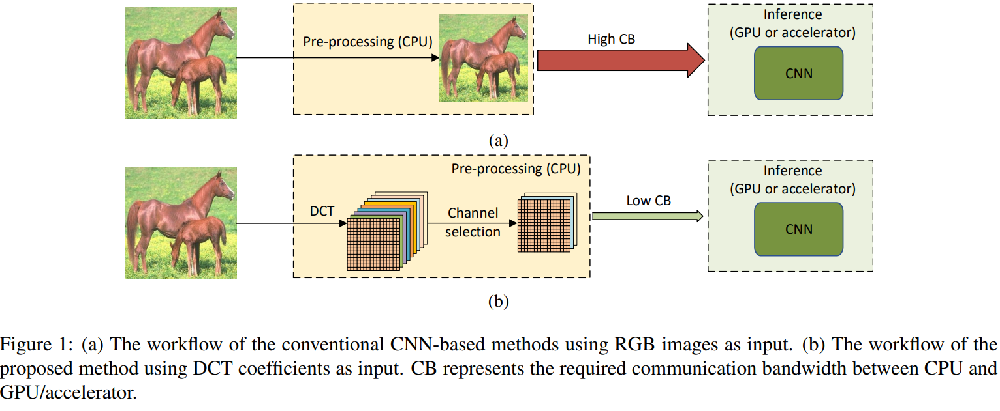
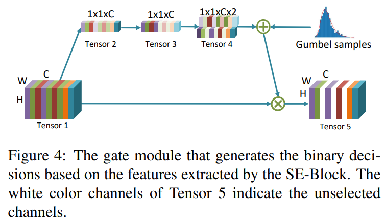
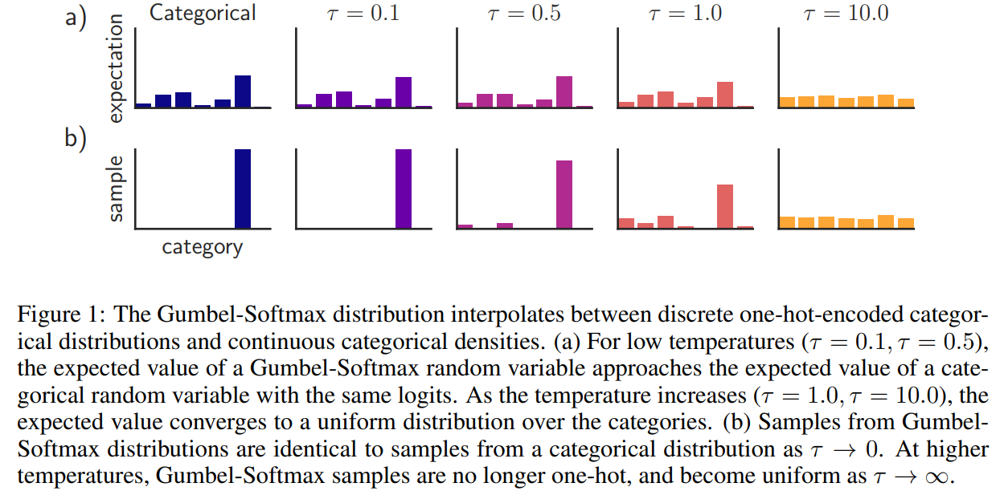
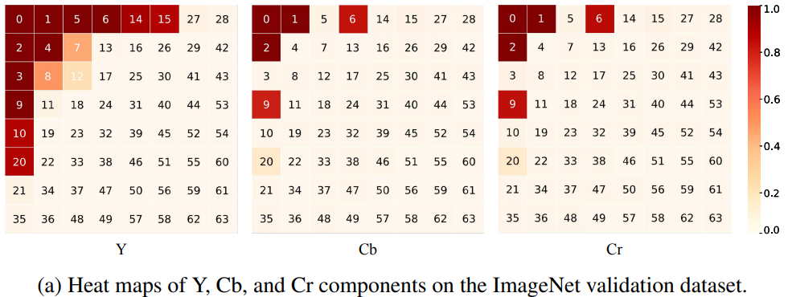

# Learning in the frequency domain

Kai Xu1,2, Minghai Qin1, Fei Sun1, Yuhao Wang1, Yen-Kuang Chen1, Fengbo Ren2, ***CVPR 2020***

1. *DAMO Academy, Alibaba Group*
2. *Arizona State University*

CNN 在处理图像数据时十分有用，但其中一个限制就是大多数 CNN 方法只能接受低分辨率图像的 RGB 作为输入，而大多数图像远远大于这一分辨率，通常做法是将这些图像缩小至 $224 \times 224$ 来作为输入。然而这种做法不可避免地会带来许多损失，因此，本文通过这些高分辨率图像**离散余弦变换（Discrete Cosine Transform，DFT）**得到的频率 channel 作为输入，规避了这一问题。

> DCT + Channel Selection

> [!NOTE|label:Discrete Cosine Transform]
> Discrete Cosine Transform (DCT) 与 Discrete Fourier Transform (DFT) 最主要的区别在于，在变换过程中，*DCT 仅考虑了 cosine*，也就是实部的信息：
$$
\begin{aligned}
    \text{DFT: }&  X[k]=\sum_{n=0}^{N-1}x[n]\cdot e^{-j\frac{2\pi}{N}kn} \\ 
    \text{DCT: }&  X[k]=\sum_{n=0}^{N-1}x[n]\cdot\cos\left(\frac\pi N\left(n+\frac12\right)k\right)
\end{aligned}
$$
> 因为 DCT 只考虑了实部信息，所以其并不包含相位信息，也就是说，**当相位信息不重要时，更加适用于 DCT**。例如在图像处理中，人眼对亮度和对比度之类的*振幅信息*更加敏感，而非边界的位置【*相位信息*】，因此，通过 DCT，就可以实现对重要信息的捕捉，从而对原数据进行压缩，这也就是 JPEG。
>

## Methodology

核心的 Methodology 部分主要分为两块：construct the channel and prune the channel

### Construct

对于一张 RGB 维度为 $H\times W \times C$ 的图片，要经历以下操作：

> [RGB to YCbCr](https://zhuanlan.zhihu.com/p/88933905)

1. 将图片转换为 **YCbCr** 格式表示 
2. 对每一个维度，例如 $Y$，将其分为不重合的 $8\times8$ 的 block
3. 对每一个 block 进行 DCT
4. 将同样频率的 component 做成一个 channel，因此共有 $8\times8 = 64$ 个 Channel
5. 因为总共有 3 个维度，所以共有 $64 \times 3 = 192$ 个 channel

因此，经过操作后，维度变化为 $H \times W \times C \Longrightarrow H/8 \times W/8 \times 64 C$。

> 那么我们同样也可以将整个样本时间段 $T$ 分割为等长的 $T_1,T_2,T_3 \cdots$，选出不同时间段的 Frequency，接着将不同时间段内的相同频率部分 concat 到一起，然后再次进行不同频率内的重要性筛选。

这种维度变化类似于 CNN 中 input layer 的卷积池化操作，因此对于 conventional CNN，就可略去 input layer 这一步，这也是本方法对于 existing CNN methods 的**唯一改动**。

### Pruning

Pruning 流程如下：

- Tensor 1：是上一步 construct 出的 frequency channel tensor
- Tensor 2：对 Tensor 1 进行 Average pooling
- Tensor 3：output of after Tensor 2 go through $1\times1$ Convolutional layer

到目前为止，第一步至第三步与 two-layer squeeze-and-excitation block (SE-Block) 极为类似。

> [SE-Block](/finance_saliency/se_net.md)

- Tensor 4：将 Tensor 3 中的每一个 channel 的值乘上两个 trainable parameters，分别代表该 channel 被 turn off 与 turn on 的概率
- Tensor 5：最终的状态，与原 channel 相乘，代表是否选择该 Channel

Input channel $\begin{aligned}\boldsymbol{x}=(x_1,x_2,\ldots,x_C)\end{aligned}$ and gate model $\begin{aligned}\mathbf{F}(x_i)\in\{0,1\}\end{aligned}$ for each frequency channel $x_i$. Then $x_i$ is selected if 

$$
\mathbf{F}(x_i)\neq0,\mathrm{~i.e.,}\mathbf{F}(x_i)\odot x_i\neq\mathbf{0},
$$

where $\odot$ is element-wise product.

The final loss function with regularization:

$$
\mathcal{L}=\mathcal{L}_{Acc}+\lambda\cdot\sum_{i=1}^C\mathbf{F}(x_i)
$$

## Discussion

### Static or Dynamic channel selection

在选择 channel 时，分为动态和静态两种方式。

- Dynamic: 每一个频率分量的选择开关由当前输入图像决定，从而适应每一次图像推理的不同输入
- Static：通过训练得到最重要的一些频率分量，这些分量应用到所有图像中

相比之下，静态的网络更加简单，可以减少图像编码的计算量、延时、以及带宽。通过实验，在静态方式下，feature 量减少 87.5%，CNN 模型仍然能够保持相同精度。

### Gumbel softmax

Gumbel softmax 的存在是为了解决 argmax 在 **Train** 时的两个问题：

1. argmax 不可导，因此无法进行反向传播
2. argmax 结果不具有随机性，$[0.7,0.1,0.2]$ 的输出结果永远是 $[1,0,0]$

Gumbel-Softmax 是 argmax 的连续可微近似。

Categorical varibale $z$ with class probabilities $\pi_1,\pi_2,...\pi_k$. **The Gumbel-Max trick** (Gumbel, 1954; Maddison et al., 2014) provides a simple and efficient way
to draw samples $z$ from a categorical distribution with class probabilities $\pi$:

$$
\begin{aligned}
    z=\text{one\_hot}\left(\arg\max_i\left[g_i+\log\pi_i\right]\right) 
\end{aligned}
$$

where $g_1 \cdots g_k$ are i.i.d samples drawn from $\text{Gumbel}(0,1)$.

$\text{Gumbel}(0,1)$ can be sampled using inverse transform sampling by drawing $ u \sim \text{Uniform}(0,1)$ and computing $g=-\log(-\log(u)).$

> [!TIP|label:Proof]
> The probability of outputing class 1.
$$
\begin{aligned}
    \log \pi_1-\log(-\log u_1) &>\log \pi_2 -\log(-\log u_2) \\
    \log \pi_1-\log(-\log u_1)&>\log \pi_3 -\log(-\log u_3) \\
    &\vdots \\
    \log \pi_1-\log(-\log u_1)&>\log \pi_k -\log(-\log u_k)
\end{aligned}
$$
> 这些不等式之间都是相互独立的，因此不失一般性地，对于不等式 1 有：
$$
u_{2}<u_{1}^{\pi_{2}/\pi_{1}}\leq1
$$ 
> 因为 $u_{2} \sim U[0,1]$，因此 $u_{2}<u_{1}^{\pi_{2}/\pi_{1}}$ 的概率就是 $u_{1}^{\pi_{2}/\pi_{1}}$，因此，这就是给定 $u_1$ 的情况下，第一个不等式成立的概率。那么所有不等式同时成立的概率是：
$$
u_{1}^{\pi_2/\pi_1}u_{1}^{\pi_3/\pi_1}\ldots u_{1}^{\pi_k/\pi_1}u_{1}^{(\pi_2+\pi_3+\cdots+\pi_k)/\pi_1}=u_{1}^{(1/\pi_1)-1}
$$
> 对于所有 $u_1$ 求平均，即
$$
\int_{0}^{1}u_{1}^{(1/\pi_{1})-1}d u_{1}=\pi_{1}
$$
> 

Gumbel softmax：

$$
y_i=\frac{\exp((\log(\pi_i)+g_i)/\tau)}{\sum_{j=1}^k\exp((\log(\pi_j)+g_j)/\tau)}\quad\mathrm{~for~}i=1,...,k.
$$

当 temperature $\tau$ 趋于零时，从 Gumbel softmax distribution 抽样得到的样本越来越趋近于 one-hot，并且 Gumbel softmax distribution 也开始与 $p(z)$ 趋于一致。

## Empirical

下图为不同 channel 被选择的概率，数字越小则频率越低。

### Spectral bias

A key aspect of **spectral bias** is described by the Frequency Principle (F-Principle), which suggests that during training, DNNs tend to fit functions *from low to high frequ​​encies*. This principle reveals a sort of "natural progression" in how neural networks learn, starting with simpler, smoother patterns and gradually moving to more complex ones.

> Rahaman N, Baratin A, Arpit D, et al. On the spectral bias of neural networks[C], *ICML*. PMLR, 2019: 5301-5310.

作者通过不同 frequency feature map，证明了 CNN 网络对于低频的偏好性。但是有个问题就在于，作者使用了 DCT，DCT 的一个性质就是**energy compaction**：The essence of this property is that DCT can effectively **concentrate** most of the signal's energy into a few coefficients, especially in the **low-frequency** components.

## Takeaway <!-- {docsify-ignore} -->

制作 frequency channel，通过类 SE-net 进行 selection。

