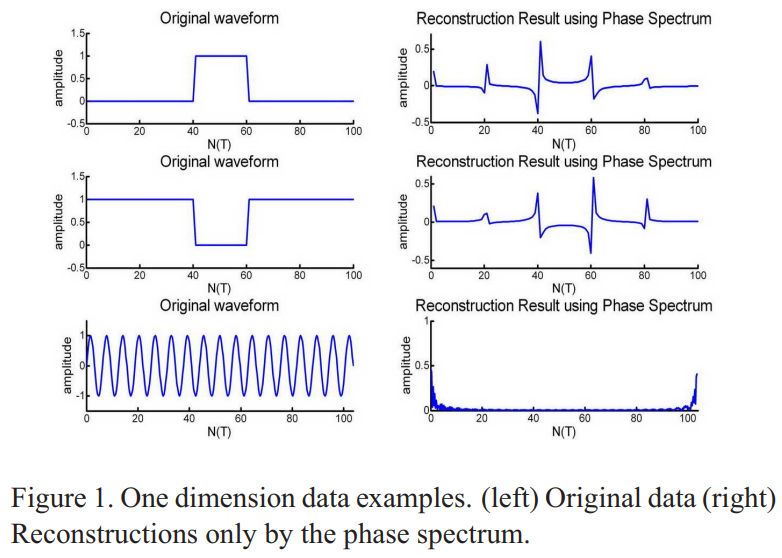
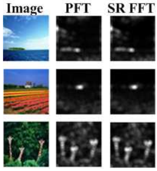

# Spatio-temporal Saliency Detection Using Phase Spectrum of Quaternion Fourier Transform

Chenlei Guo1, Qi Ma1 and Liming Zhang1, ***CVPR***, 2008

1. *Department of Electronic Engineering, Fudan University*

这篇文章紧接着 Xiaodi Hou, Liqing Zhang (2007, CVPR) 完成，认为其使用 **spectral residual of amplitude** 做成的结果【以下称为 SR 方法】并不可靠，而应该使用 **phase spectrum**，phase 才是定位 salient area 的关键。

## From Phase spectrum of Fourier Transform to the Saliency Map

### What does the phase spectrum represent?

可以通过一个例子来直观说明相位的作用：

如果仅通过 phase 来重构 one-dimensional waveforms 信号，可以发现，当原信号中存在明显的 spike 时，相位重构能较好地复现出这些 spike，但是如果原信号含有固定的频率，则相位重构得不到明显的 spike，也就是说：

> *Less periodicity or less homogeneity of a location, in comparison with its entire waveform, creates more ”pop out”*

同样的规律可以应用到二维信号上，如图像。amplitude spectrum specifies **how much** of each sinusoidal component is present, and phase information specifies **where** each of the sinusoidal components resides within the image.

> [!WARNING]
> we do not take the **borders** of the signals or images into consideration because of their **discontinuity**.

### The steps of PFT approach

Phase reconstruction of Fourier Transform 分为三步：

$$
\begin{align}
f(x,y)&=F(I(x,y)) \\
p(x,y)&=P(f(x,y)) \\
sM(x,y)&=g(x,y)*\|F^{-1}[e^{i\cdot p(x,y)}]\|^2
\end{align}
$$

- $F, F^{-1}$ 分别代表傅里叶变换和傅里叶逆变换。
- $P(f)$ 代表 phase spectrum of the image
- $g(x,y)$ is a 2D gaussian filter ($\sigma = 8$)

与 SR 的最大区别就是在于进行傅里叶逆变换时，**根本不考虑振幅项，但却得到了相近的结果**。

### Comparison between PFT and SR

相比于 SR 方法，PFT 省略了计算振幅的过程，因此大约省去了 $1/3$ 的计算成本，

根据原文，二者之间的区别 are **negligible**。说明 SR 其实没什么用。

## Takeaway <!-- {docsify-ignore} -->

SR 不好使，phase 才是最重要的。
