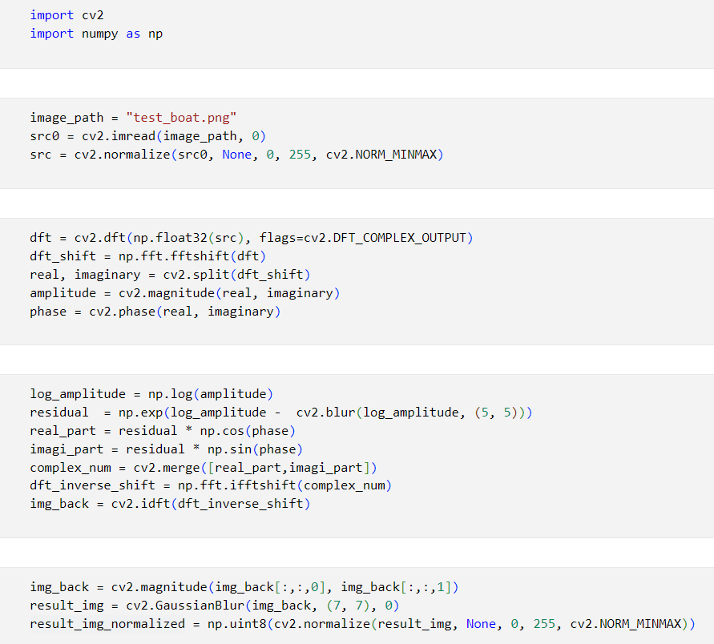
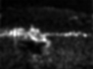

# 论文复现 Saliency Detection: A Spectral Residual Approach

尝试复现了这篇非常出名的计算 saliency 的论文，的确计算简便，效果拔群。第一部分是具体的实现，第二部分因为没有现成的代码，因此在写代码时必须深入理解理论才能自己动手调整，所以补了一部分之前缺乏的知识，的确涉及到实践，细节会多很多。

## PART 1 code

结果的确能够做出来，不过作者的代码并不全，我找了个用 C++ 的写代码给转成 python 了。

试验了一个小船，效果还可以：

> [!WARNING]
> 不过这个图片的 size ($64\times 64$) 都很小，对应的 blur kernel size ($3 \times 3, 7\times 7$) 也很小，我还试了试自己的脸能不能识别，但是手机拍出来的size太大了，效果就不好。我尝试调高了 kernel 的size，效果好了一些，不过还是一般。还有待研究。

## PART 2 theory

傅里叶变换有：
$$
X[k]=\sum_{n=0}^{N-1}x[n]\cdot e^{-i\cdot\frac{2\pi}N\cdot k\cdot n}
$$

由欧拉公式 $e^{-i\cdot\frac{2\pi}N\cdot k\cdot n}=\cos\left(\frac{2\pi}N\cdot k\cdot n\right)-i\sin\left(\frac{2\pi}N\cdot k\cdot n\right)$：

$$
X[k] = \sum_{n=0}^{N-1}x[n] \cos\left(\frac{2\pi}N\cdot k\cdot n\right) -i \sum_{n=0}^{N-1}x[n]\sin\left(\frac{2\pi}N\cdot k\cdot n\right)
$$

令 $a = \sum_{n=0}^{N-1}x[n] \cos\left(\frac{2\pi}N\cdot k\cdot n\right), b = - \sum_{n=0}^{N-1}x[n]\sin\left(\frac{2\pi}N\cdot k\cdot n\right)$，则 $a$ 中的每一项代表信号 $x[n]$ 在 **basis function** $\cos (\frac{2\pi}Nk)$ 上的投影，求和后表示对频率 $k$ 全部的实部贡献，$b$ 同理。因此得到如下表达：
$$
X[k]=a+bi
$$

对于虚数表达，可以得到频率 $k$ 的相位信息 $\phi = \arctan (\frac{b}{a})$ 与振幅信息 $A = \sqrt{a^2+b^2}$，根据三角函数关系 $\sin(\phi) = \sin(\arctan(\frac{b}{a}))=\frac b{\sqrt{a^2+b^2}},\cos(\phi) = \cos(\arctan(\frac{b}{a}))=\frac a{\sqrt{a^2+b^2}}$，因此有：

$$
X[k]= A (\cos\phi + i \sin\phi) = A e^{i \phi} = e^{\log (A)+i \phi}
$$

接着，做逆变换时有：
$$\begin{aligned}
x[n]&=\frac1N\sum_{k=0}^{N-1}X[k]\cdot e^{iwn}=\frac1N\sum_{k=0}^{N-1}A(\cos(\phi)+i\sin(\phi)) \cdot (cos(wn)+isin(wn)) \\ 
&=\frac1N\sum_{k=0}^{N-1}A\{[cos(\phi)*cos(wn)-sin(\phi)*sin(wn)]+i[cos(\phi)*sin(wn)+sin(\phi)*cos(wn)]\}
\end{aligned}$$

根据辅助角公式 

$$
\begin{aligned}
    a\sin x+b\cos x &= \sqrt{a^2+b^2} \cos (x - \arctan \frac{a}{b}), b>0 \\
    a\sin x+b\cos x &= \sqrt{a^2+b^2} \sin (x + \arctan \frac{b}{a}), a>0
\end{aligned}
$$

有

$$
\begin{aligned}
    x[n] &= \frac1N\sum_{k=0}^{N-1}A\{cos(wn+\phi)+i*sin(wn+\phi)\} \\
    &= \frac1N\sum_{k=0}^{N-1}A\cdot e^{i(wn+\phi)}
\end{aligned}
$$

