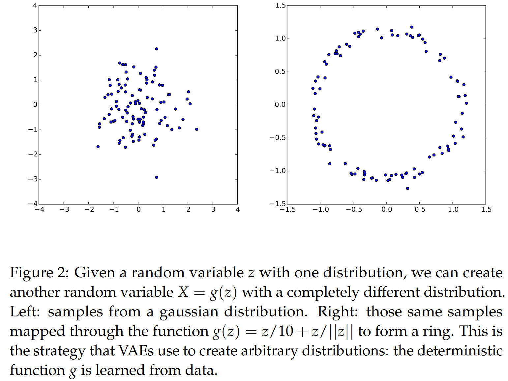

# VAE

## Latent variable models

以生成数字为例，如果模型在给不同的像素点分配取值之前，能够决定自己要生成什么数字，那么对于生成结果会很有帮助。这个决定的步骤，就是由于隐变量来决定的，也就是说，**隐空间中的点代表了一定的含义**。

这也就是说，对于**训练集**中的任意一个 $X$，我们希望借助隐变量，最大化对应 $X$ 的生成概率，

$$
\begin{equation}
P(X)=\int P(X|z;\theta)P(z)dz.
\end{equation}
$$

> $\theta$ 指的是通过 $z$ 生成 $X$ 的模型参数，下文会略去。

这一公式有着隐变量生成模型均会面临的两个问题

- **非线性生成（$P(X|z)$）的情况下，不存在解析解**

在没有解析解的情况下，可以使用采样的方式来逼近 $P(X)$，但在高维隐变量 $z$ 的情形下，为了在整个空间上获得准确积分，需要采样巨量的 $z$，在实践中不可行，这也就是

- **当维度高时，积分复杂度急剧上升**

## Variational autoencoder

为了解决式（1）的优化问题，VAE需要解决两个问题

- **如何定义隐变量 $z$**
- **如果解决对于 $z$ 的积分**

***如何选择能够捕捉隐空间信息的 $z$?***

隐变量空间中往往是具有一定含义的，并且有时候不同维度之间会有所关联。VAE 并没有手动假定隐变量之间的关系，而是认为**隐变量可以从正态分布中采样**。

背后的逻辑在于， **$d$ 个正态分布的变量，经过足够复杂的函数，可以拟合任意 $d$ 维的分布**。这里并不是说直接拟合 $X$ 的分布，而是通过一些转换，$d$ 个正态分布能够拟合 **$d$ 维隐变量的分布**。

在隐空间中有效隐变量的占比是甚少的，对于大部分 $z$ 来说，$P(X|z)$ 基本为零，因此对于 $P(X)$ 的估计没有用处。因此我们需要 **缩小 $z$ 的搜索范围，更加关注有可能生成 $X$ 的 $z$** 。

理论上来说，直接通过贝叶斯定理计算后验分布能够得到最准确的 $z$ 的信息

$$
P(z|X) = \frac{P(X|z) P(z)}{P(X)} 
$$

但是由于分母部分无法求得，真实后验无法获得，所以我们通过 $Q(z|X)$ 来**变分拟合**。

> 这里引入了 encoder，通过上述我们知道，这个 encoder $Q(z|X)$ 是用来拟合 $z$ 的后验分布。
>
> 理想情况下应该使用真实后验 $P(z|X)$ 来对潜变量 $z$ 进行建模，因为**真实后验给出了在观察 $X$ 后获得的所有信息**，但是在大多数实际问题中，**真实后验 $P(z|X)$ 往往是不可计算或不可采样的**。

***如何求解积分？***

拟合效果用 KL 散度衡量，$Q(z|X)$ 与 $P(z|X)$ 之间的 KL 散度为

$$
\begin{equation}
\mathcal{D}\left[Q(z|X)\|P(z|X)\right]=E_{z\thicksim Q}\left[\log Q(z|X)-\log P(z|X)\right].
\end{equation}
$$

根据贝叶斯定理有

$$
\begin{equation}
\mathcal{D}\left[Q(z|X)\|P(z|X)\right]=E_{z\sim Q}\left[\log Q(z|X)-\log P(X|z)-\log P(z)\right]+\log P(X).
\end{equation}
$$

通过取负、移项就得到了**核心公式**：

$$
\begin{equation}
\log P(X)-\mathcal{D}\left[Q(z|X)\|P(z|X)\right]=E_{z\sim\mathbb{Q}}\left[\log P(X|z)\right]-\mathcal{D}\left[Q(z|X)\|P(z)\right].
\end{equation}
$$

> 我们通过确定隐变量 $z$ 的思路得到了优化目标。

$\log P(X)$ 是我们想要优化的目标，同时 $\mathcal{D}$ 是非负的，这说明等式右侧是优化目标的 lower bound，**随后会通过最大化等式右侧来进行优化**。最大化 ELBO 就意味着，我们在同时最大化 $\log P(X)$ 和最小化 KL 散度，**试图使得变分后验与真实后验的距离最小**。

在等式右侧中，我们同样需要对 $z$ 取期望，理论上来说计算上仍然是有难度的。但是相比于从 $\mathcal{N}(0,I)$ 中采样，**从 $Q$ 中采样的收敛速度能够快很多**。

第一项是重构效果的衡量，但是如果只有第一项，那么网络会重点学习单对单的拟合，**退化为普通的autoencoder**，但是结合第二让所有的分布向正态分布 $P(z)$ 看齐，这样就可以防止噪声为零，同时保证了模型具有生成能力。同时，让所有 $z$ 的变分分布向着先验正态分布 $P(z)$ 靠拢，就还可以**避免过拟合**。

至于等式右侧的理解，我们可以从下文信息论的角度出发：

**Information theory**

在信息论中， **$-\log P(X)$ 表示用理想编码构造样本 $X$ 所需的总位数** 。在信息论中，$-\log P(X)$ 被称为自信息（self-information），含义表明

- 如果一个事件 $X$ 出现的概率越高，$-\log P(X)$ 越小，说明编码或描述这个事件所需的信息量越少
- 反之，如果 $P(X)$ 越低，$-\log P(X)$ 就越大，意味着这个事件非常罕见，需要更多的信息位来描述 

从信息论的角度理解式（4），

$$
\begin{equation}
-\log P(X)+\mathcal{D}\left[Q(z|X)\|P(z|X)\right]=\mathcal{D}\left[Q(z|X)\|P(z)\right] - E_{z\sim\mathbb{Q}}\left[\log P(X|z)\right].
\end{equation}
$$

我们希望最小化 $-\log P(X)$，其中

- 第一项 KL 散度表明，将一个 **uninformative** 的先验转换成条件分布 $Q(z|X)$ 所需要的信息
- 第二项代表重构效果 $E_{z\sim\mathbb{Q}}\left[\log P(X|z)\right]$，数值越大代表重构越好

所以从信息论的角度出发，是想尽可能用少的字节来实现好的重构效果。至于 $\mathcal{D}\left[Q(z|X)\|P(z|X)\right]$ 则是作为惩罚项存在。

## Train

$$
\log P(X)-\mathcal{D}\left[Q(z|X)\|P(z|X)\right]=E_{z\sim\mathbb{Q}}\left[\log P(X|z)\right]-\mathcal{D}\left[Q(z|X)\|P(z)\right].
$$

在这一步的公式中，只是对于 single $X$ 来说的（or one batch），整体的优化函数应该再对 $X$ 取期望，此外需要讨论的问题在于，关于 $z$ 的积分能否简化？

实际上是可以的，因为 $z$ 的分布方差非常小，多次采样的结果会非常相近，因此可以直接采样一次，那么最终的 loss 就会变为

$$
\begin{equation}
\mathcal{L} = E_x \left[ \log P(X|z) - \mathcal{D}[Q(z|X)||P(z)] \right]
\end{equation}
$$

## Insights

通过上文对于 VAE 的理解，我有两点对于模型的想法

1. 隐空间 $z$ 作为一个正态分布来说并没有太多的信息量，根据理论需要通过足够复杂的网络才可以拟合到有效的隐空间表达，但是我们目前的 decoder 网络过于简单，也许需要增加足够的复杂度。
2. 我们最终还是通过在 $z$ 中采样来训练模型，正如上文所说，如果输入的 $X$ 能够帮助我们缩小隐空间的采样范围，那么训练起来会更加高效。另一方面，alpha158 之所以比 managed portfolio176 更加有用，是因为 176 的 managed portfolio 在金融学理论中更加注重于截面预测，并不具有时序上的预测性，但是 158 作为量价信息是有很强的可预测性的。More formally，158 更能帮助我们有效地缩小隐空间采样范围。

## Beta-VAE

相比于 VAE 的 loss， beta-VAE 加上了一个惩罚项类似的参数。

更加强调解耦能力，也就是隐变量之间互相独立。

$$
\mathcal{L}(\theta,\phi;\mathbf{x},\mathbf{z},\beta)=\mathbb{E}_{q_\phi(\mathbf{z}|\mathbf{x})}[\log p_\theta(\mathbf{x}|\mathbf{z})]-\beta D_{KL}\left(q_\phi(\mathbf{z}|\mathbf{x})\parallel p(\mathbf{z})\right)
$$

Beta-VAE 的目标函数与 bottleneck principle 紧密相关

$$
\max[I(Z;Y)-\beta I(X;Z)]
$$

其中 $I$ 代表互信息。Information bottleneck 最大化 bottleneck $z$ 和 task $Y$ 之间的互信息，同时最小化 $z$ 和 $X$ 之间的互信息。意义是强制 $Z$ 包含足够的信息以预测 $Y$，同时迫使 $Z$ 丢弃 $X$ 中与 $Y$ 无关的细节。

对于 beta-VAE 来说，也可以将后验分布 $q(q|x)$ 看作 information bottleneck

在隐空间中，后验分布和先验分布都已经因子化了（factorized），因为协方差矩阵是对角的

$$
\mathcal{L}(\theta,\phi;\mathbf{x}(\mathbf{f}),\mathbf{z},C)=\mathbb{E}_{q_\phi(\mathbf{z}|\mathbf{f})}[\log p_\theta(\mathbf{x}|\mathbf{z})]-\gamma\left|D_{KL}\left(q_\phi(\mathbf{z}|\mathbf{f})\parallel p(\mathbf{z})\right)-C\right|
$$

