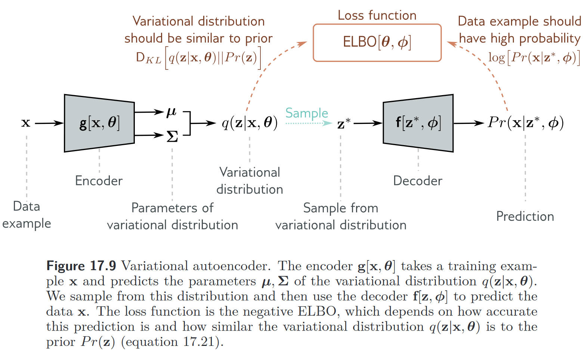

# AI

## GRU

$$
\begin{aligned}&{R}_{t}=\sigma(X_tW_{xr}+H_{t-1}W_{hr}+b_r),\\
&{Z}_{t}=\sigma(X_tW_{xz}+H_{t-1}W_{hz}+b_z)\\
&\tilde{{H}}_t=\tanh(X_tW_{xh}+\begin{pmatrix}R_t\odot H_{t-1}\end{pmatrix}W_{hh}+{b}_h)\\
&H_{t}=Z_t\odot H_{t-1}+(1-Z_t)\odot\tilde{H}_t\end{aligned}
$$

当 $Z_t$ 近乎等于 $1$ 时，基本抛弃当前进来的 $X_t$，完全**记忆** $H_{t-1}$，当 $Z_t$ 近乎等于 $0$ 时，基本完全使用 $X_t$，相当于是完全**遗忘** $H_{t-1}$，第二种情况也相当于是传统的 RNN，忽略过去的状态，只在当前状态下进行记录。

## VAE

想要拟合数据的生成概率 $P(x)$，可以通过对隐变量联合分布积分的形式

$$
P(\mathbf{x})=\int P(\mathbf{x},\mathbf{z})d\mathbf{z} = \int P(\mathbf{x}|\mathbf{z})P(\mathbf{z})d\mathbf{z}.
$$

**Nonlinear latent variable model**

在非线性隐变量模型中，数据 $x$ 和隐变量 $z$ 都是连续且多元。如果先验 $P(z)$ 是一个标准多元正态分布

$$
P(\mathbf{z})=\mathrm{Norm}_{\mathbf{z}}[\mathbf{0},\mathbf{I}].
$$

Likelihood $P(x|z,\phi)$ 也是正态分布，并且均值是隐变量的非线性函数 $f[z,\phi]$，协方差为 $\sigma^2 \mathbf{I}$,

$$
P(\mathbf{x}|\mathbf{z},\phi)=\mathrm{Norm}_\mathbf{x}\left[\mathbf{f}[\mathbf{z},\phi],\sigma^2\mathbf{I}\right].
$$

其中 $\phi$ 是我们想要学习的参数。

最终的数据概率 $P(x|\phi)$ 同样是对于 latent variable $z$ 积分得到，

$$
\begin{aligned}P(\mathbf{x}|\boldsymbol{\phi})&=\int P(\mathbf{x},\mathbf{z}|\phi)d\mathbf{z}\\&=\int P(\mathbf{x}|\mathbf{z},\phi)\cdot P(\mathbf{z})d\mathbf{z}\\&=\int\mathrm{Norm}_\mathbf{x}\left[\mathrm{f}[\mathbf{z},\phi],\sigma^2\mathbf{I}\right]\cdot\mathrm{Norm}_\mathbf{z}\left[\mathbf{0},\mathbf{I}\right]d\mathbf{z}.\end{aligned}
$$

这种形式本质上是无穷个带有不同均值的高斯分布加权和，权重为 $P(z)$，隐变量模型都可以写成这种形式。

这种形式的问题在于，

### Evidence lower bound (ELBO)

对 $P(x)$ 做展开有

$$
\begin{aligned}
\ln P(x) &= \ln \frac{P(x,z)}{P(z|x)} = \ln P(x,z) - \ln P(z|x) \\
&= \ln \frac{P(x,z)}{q(z)} - \ln \frac{P(z|x)}{q(z)}
\end{aligned}
$$

两侧同时对 $z$ 取期望有

$$
\begin{aligned}
\ln P(x) &= \int q(z) \ln \frac{P(x,z)}{q(z)} - q(z)\ln \frac{P(z|x)}{q(z)} dz \\
&= \text{ELBO}(q) + KL[q||P]
\end{aligned}$$

因为 KL 散度非负，所以右侧等式第一项为原本求解概率密度的下界，这也称之为 **ELBO** (Evidence lower bound)。

2. Reconstruction loss minus KL distance to prior

除了上面的两种理解方式，ELBO 还可以做如下理解

$$
\begin{aligned}\mathrm{ELBO}[\theta,\phi]&\begin{aligned}=&&\int q(\mathbf{z}|\boldsymbol{\theta})\log\left[\frac{P(\mathbf{x},\mathbf{z}|\boldsymbol{\phi})}{q(\mathbf{z}|\boldsymbol{\theta})}\right]d\mathbf{z}\end{aligned}\\
&=\quad\int q(\mathbf{z}|\boldsymbol{\theta})\log\left[\frac{P(\mathbf{x}|\mathbf{z},\boldsymbol{\phi})P(\mathbf{z})}{q(\mathbf{z}|\boldsymbol{\theta})}\right]d\mathbf{z}\\
&\begin{array}{rcl}=&\int q(\mathbf{z}|\boldsymbol{\theta})\log\left[P(\mathbf{x}|\mathbf{z},\boldsymbol{\phi})\right]d\mathbf{z}+\int q(\mathbf{z}|\boldsymbol{\theta})\log\left[\frac{P(\mathbf{z})}{q(\mathbf{z}|\boldsymbol{\theta})}\right]d\mathbf{z}\end{array}\\&=\quad\int q(\mathbf{z}|\boldsymbol{\theta})\log\left[P(\mathbf{x}|\mathbf{z},\boldsymbol{\phi})\right]d\mathbf{z}-\mathrm{D}_{KL}\left[q(\mathbf{z}|\boldsymbol{\theta})||P(\mathbf{z})\right],\end{aligned}
$$

其中第一项表示 Reconstruction loss，第二项是 $z$ 后验分布和先验分布之间的 KL 散度。

这一公式表明的是，如果我们希望达到较好的重构效果，那么 $z$ 就区分的越开越好，但是这样会使得新样本会落入概率小的区域中，所以通过第二项，可以使得所有 $x$ 对应的 $z$ 都尽可能地靠近先验，例如 $N(0,1)$。最优情况下，所有小圆（$z$）都在大圆（$N(0,1)$）里，并彼此互不重叠。

### Variational approximation

当 $q(z|\theta)$ 等于后验 $P(z|x,\phi)$ 时即可满足 Tightness。我们可以通过贝叶斯来计算后验

$$
P(\mathbf{z}|\mathbf{x},\phi)=\frac{P(\mathbf{x}|\mathbf{z},\phi)P(\mathbf{z})}{P(\mathbf{x}|\phi)},
$$

但是就像上文提到的，分母部分仍然需要对 $z$ 做积分，因而在实际操作层面是很难实现的。这所说的是，即使通过 ELBO 转化了求解形式，依然会有这个问题，所以需要使用变分推断。

> 变分推断指的是，**将难以计算的后验分布，用一个可计算（且带参数）的分布进行近似，然后通过最小化二者的差异（常用 KL 散度）来得到该分布的最优参数**。通过变分推断，可以将原本无法直接求解的贝叶斯推断问题，转化为一个可优化的问题。
>
> 在 VAE 中，模型需要对隐变量 $z$ 的真实后验 $p(z|x,\phi)$ 进行推断，但是太过复杂无法计算，所以引入了一个参数化的近似后验 $q(z|x)$ 来拟合真实后验。近似推断网络指的就是编码器。

具体来说，选择一个较为简单的参数形式 $q(z|\theta)$，改变 $\theta$ 来拟合后验。从 Tightness 部分的分析我们知道，$z$ 的分布形式与 $x$ 有关，所以变分推断网络也应该试图从 $x$ 中提取信息

$$
q(\mathbf{z}|\mathbf{x},\boldsymbol{\theta})=\mathrm{Norm}_{\mathbf{z}}\left[\mathrm{g}_{\boldsymbol{\mu}}[\mathrm{x},\boldsymbol{\theta}],\mathrm{g}_{\boldsymbol{\Sigma}}[\mathrm{x},\boldsymbol{\theta}]\right]
$$

到这一步基本原理都介绍的差不多了，可以展示 VAE 的结构了。

### Variational autoencoder

**所以本质上 VAE 的 Encoder 部分是在拟合 $z$ 的后验分布，decoder 是在拟合 $x$ 的后验分布。**

## Diffusions

**Diffusions can be viewed as a form of hierarchical variational autoencoder in which the encoder distribution is fixed, and defined by the noise process, and only the generative distribution is learned.**

$$
\mathbf{z}_1=\sqrt{1-\beta_1}\mathbf{x}+\sqrt{\beta_1}\boldsymbol{\epsilon}_1
$$

where $\varepsilon_1 \sim \mathcal{N}(\varepsilon_1|0,I)$ and $\beta_1 < 1$ is the variance of teh noise distribution.

We can write the transformation in the form of

$$
q(\mathbf{z}_1|\mathbf{x})=\mathcal{N}(\mathbf{z}_1|\sqrt{1-\beta_1}\mathbf{x},\beta_1\mathbf{I}).
$$

