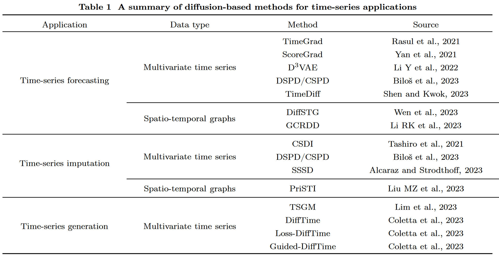
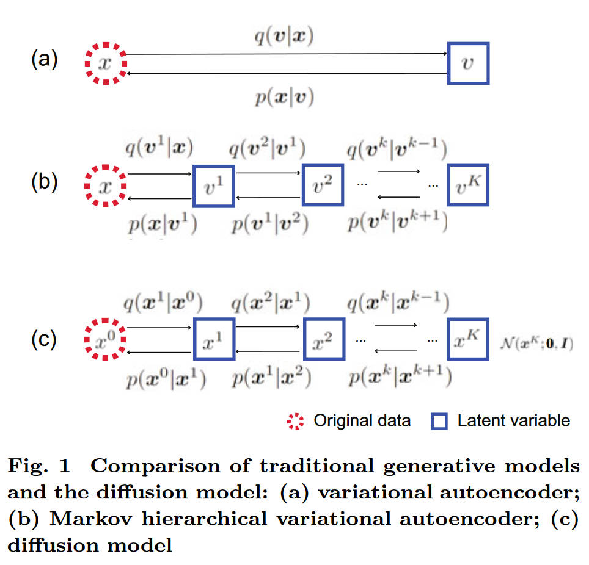

# Diffusion models for time-series applications: a survey

Lequan LIN, Zhengkun LI2, RuikunLI1, Xuliang LI1, Junbin GAO, Frontiers of Information Technology & Electronic Engineering 2024

1. *Discipline of Business Analytics, The University of Sydney Business School*
2. *Postdoctoral Programme of Zhongtai Securities Co., Ltd*

目前主流的 Diffusion 应用一览，

## Background

生成模型的目的在于生成与 $x$ 同样分布的样本，这里有个比较常见的假设就是假定观测值背后是由某些因变量生成的。这一假设下有相当知名的模型 VAE，不过 VAE 是基于单一隐变量，所以后续还提出了 hierarchical variational autoencoder (HVAE)，泛化了 VAE，提升了灵活性。

> Kingma D P, Salimans T, Jozefowicz R, et al. Improved variational inference with inverse autoregressive flow[J]. Advances in neural information processing systems, 2016, 29.

Diffusion 可以看作是 HVAE 的延申，不过有以下的限制条件：

1. **马尔可夫假设**：潜变量遵循马尔可夫假设，形成基于马尔可夫链的生成过程
   - 当前状态只依赖于前一个状态：$p(x_t|x_{t+1}, ..., x_T) = p(x_t|x_{t+1})$
   - 简化了依赖关系，使训练和推理更加高效

2. **维度一致性**：观测数据和潜变量共享相同维度
   - $\text{dim}(x_0) = \text{dim}(x_1) = ... = \text{dim}(x_T)$
   - 与 VAE 的低维潜空间不同，保持了数据的完整空间结构

3. **高斯转移核**：马尔可夫链通过高斯转移核连接，最后的潜变量来自标准高斯分布
   - 前向过程：$q(x_t|x_{t-1}) = \mathcal{N}(x_t; \sqrt{1-\beta_t}x_{t-1}, \beta_t\mathbf{I})$
   - 终点分布：$x_T \sim \mathcal{N}(0,\mathbf{I})$
   - 利用高斯分布的良好数学性质

这些约束使得扩散模型在保持 HVAE 灵活性的同时，获得了更好的理论基础和实际性能。 

## Time-series forecasting

> 这一部分的应用是最多的。

Forecasting 主要集中于多元时间序列，例如一只股票的多个特征的时间序列，不同于面板数据和单元时间序列。

### Problem formulation

考虑多元时间序列 $\boldsymbol{X}^0\quad=\{\boldsymbol{x}_1^0,\boldsymbol{x}_2^0,...,\boldsymbol{x}_T^0|\boldsymbol{x}_i^0\in\mathbb{R}^D\}$，0 代表没有添加噪声。

### TimeGrad: 基于DDPM的自回归预测模型

TimeGrad (Rasul et al., 2021) 是将扩散模型应用于时间序列预测的开创性工作，基于DDPM框架构建自回归生成模型。

#### 核心思想 <!-- {docsify-ignore} -->

**自回归扩散**：逐步预测未来时间步
- 在每个**数据时间步** $t$，给定历史观测 $\boldsymbol{x}_{1:t-1}$ 和隐状态 $\boldsymbol{h}_{t-1}$
- 使用扩散过程建模当前时间步的条件分布：$p(\boldsymbol{x}_t^0|\boldsymbol{h}_{t-1})$

**时间步的区分**：
- $t$：**数据时间步**（真实时间序列的时间索引）
- $k$：**扩散时间步**（噪声添加/去除的步骤，$k=0,1,...,K$）

#### 模型架构 <!-- {docsify-ignore} -->

**前向扩散过程**（对数据时间步 $t$ 的目标值）：
对当前目标 $\boldsymbol{x}_t^0$ 添加噪声

$$
q(\boldsymbol{x}_t^{1:K}|\boldsymbol{x}_t^0) = \prod_{k=1}^K q(\boldsymbol{x}_t^k|\boldsymbol{x}_t^{k-1})
$$

其中：$q(\boldsymbol{x}_t^k|\boldsymbol{x}_t^{k-1}) = \mathcal{N}(\boldsymbol{x}_t^k; \sqrt{1-\beta_k}\boldsymbol{x}_t^{k-1}, \beta_k\mathbf{I})$

**反向去噪过程**（生成数据时间步 $t$ 的值）：
- RNN编码器将历史序列编码为隐状态 $\boldsymbol{h}_t=\mathrm{RNN}_{\boldsymbol{\theta}}(\boldsymbol{x}_t^0,\boldsymbol{c}_t,\boldsymbol{h}_{t\boldsymbol{-}1})$
- $\boldsymbol{h}_{t-1}$ 作为**条件信息**输入到扩散过程中，指导去噪方向

$$
p_\theta(\boldsymbol{x}_t^{k-1}|\boldsymbol{x}_t^k, \boldsymbol{h}_{t-1}) = \mathcal{N}(\boldsymbol{x}_t^{k-1}; \boldsymbol{\mu}_\theta(\boldsymbol{x}_t^k, \boldsymbol{h}_{t-1}, k), \sigma_k^2\mathbf{I})
$$

#### 训练与推理过程 <!-- {docsify-ignore} -->

**训练过程**：
1. 对于真实的目标值 $\boldsymbol{x}_t^0$，通过前向过程添加噪声得到 $\boldsymbol{x}_t^k$
2. 利用历史信息 $\boldsymbol{h}_{t-1}$ 作为条件，训练去噪网络从 $\boldsymbol{x}_t^k$ 恢复 $\boldsymbol{x}_t^0$
3. 优化去噪损失：$\|\boldsymbol{\epsilon} - \boldsymbol{\epsilon}_\theta(\boldsymbol{x}_t^k, \boldsymbol{h}_{t-1}, k)\|^2$
4. 将上一步生成的 $\boldsymbol{x}_t^0$ 视作历史信息进行滚动预测 

#### 损失函数 <!-- {docsify-ignore} -->

损失函数为负对数似然，

$$
\sum_{t=t_0}^T-\log p_{\boldsymbol{\theta}}(\boldsymbol{x}_t^0|\boldsymbol{h}_{t-1}),
$$

根据 DDPM，负对数似然的上界为

$$
\mathbb{E}_{k,\boldsymbol{x}_t^0,\boldsymbol{\epsilon}}\left[\delta(k)\left\|\boldsymbol{\epsilon}-\boldsymbol{\epsilon}_{\boldsymbol{\theta}}\left(\sqrt{\tilde{\alpha}_k}\boldsymbol{x}_t^0+\sqrt{1-\tilde{\alpha}_k}\boldsymbol{\epsilon},\boldsymbol{h}_{t-1},k\right)\right\|^2\right].
$$

> Rasul, K., Seward, C., Schuster, I., & Vollgraf, R. (2021). Autoregressive denoising diffusion models for multivariate probabilistic time series forecasting. *ICML*, 8857-8868.

### ScoreGrad: 基于SDE的连续时间预测模型

ScoreGrad (Yan et al., 2021) 将基于分数的生成模型扩展到时间序列预测任务，采用连续时间随机微分方程(SDE)框架。

#### 核心思想 <!-- {docsify-ignore} -->

**连续时间扩散**：不同于TimeGrad的离散马尔可夫链
- 使用连续时间SDE描述扩散过程：$d\boldsymbol{x} = \boldsymbol{f}(\boldsymbol{x}, t)dt + g(t)d\boldsymbol{w}$
- 通过学习分数函数 $\nabla_{\boldsymbol{x}} \log p_t(\boldsymbol{x}|\boldsymbol{h}_{t-1})$ 进行去噪
- 支持任意时间步的灵活采样

**分数匹配目标**：
- 直接学习条件分布的分数函数而非噪声预测
- 利用去噪分数匹配(DSM)进行训练

#### 模型架构 <!-- {docsify-ignore} -->

**SDE选择与设计**：

ScoreGrad支持多种SDE类型，每种适用于不同场景：

1. **Variance Exploding (VE) SDE**：
   $$
   d\boldsymbol{x} = \sqrt{\frac{d[\sigma^2(t)]}{dt}}d\boldsymbol{w}
   $$
   - 方差随时间单调递增
   - 适用于高维数据，保持原始数据分布结构

2. **Variance Preserving (VP) SDE**：
   $$
   d\boldsymbol{x} = -\frac{1}{2}\beta(t)\boldsymbol{x}dt + \sqrt{\beta(t)}d\boldsymbol{w}
   $$
   - 方差保持相对稳定，有回归项防止发散
   - 对应DDPM的连续时间版本

3. **sub-Variance Preserving (sub-VP) SDE**：
   $$
   d\boldsymbol{x} = -\frac{1}{2}\beta(t)\boldsymbol{x}dt + \sqrt{\beta(t)(1-e^{-2\int_0^t\beta(s)ds})}d\boldsymbol{w}
   $$
   - 介于VE和VP之间，提供更灵活的噪声调度

**ScoreGrad的选择**：作者主要采用**VP SDE**，因为：
- 时间序列数据通常具有有界特性
- VP SDE的回归项有助于保持预测的稳定性
- 与经典扩散模型理论兼容性好

**前向SDE过程**：
采用VP SDE对目标序列 $\boldsymbol{x}_t^0$ 施加连续扩散

$$
d\boldsymbol{x} = -\frac{1}{2}\beta(t)\boldsymbol{x}dt + \sqrt{\beta(t)}d\boldsymbol{w}
$$

其中 $\beta(t)$ 是时间相关的噪声调度函数。

对应的边缘分布为：

$$
p_{\sigma(t)}(\boldsymbol{x}_t^s|\boldsymbol{x}_t^0) = \mathcal{N}(\boldsymbol{x}_t^s; \alpha(t)\boldsymbol{x}_t^0, \sigma^2(t)\mathbf{I})
$$

其中：
- $\alpha(t) = e^{-\frac{1}{2}\int_0^t \beta(s)ds}$
- $\sigma^2(t) = 1 - \alpha^2(t)$

**反向SDE过程**：
根据Anderson定理，反向SDE为：

$$
d\boldsymbol{x} = \left[-\frac{1}{2}\beta(t)\boldsymbol{x} - \beta(t)\nabla_{\boldsymbol{x}} \log p_t(\boldsymbol{x}|\boldsymbol{h}_{t-1})\right]dt + \sqrt{\beta(t)}d\bar{\boldsymbol{w}}
$$

#### 训练与推理过程 <!-- {docsify-ignore} -->

**训练过程**：
1. 对真实目标 $\boldsymbol{x}_t^0$ 在时间 $s \sim \text{Uniform}(0, T)$ 添加噪声
2. 训练分数网络 $\boldsymbol{s}_\theta(\boldsymbol{x}_t^s, s, \boldsymbol{h}_{t-1})$ 预测分数函数
3. 优化去噪分数匹配损失

**推理过程（Predictor-Corrector采样）**：

ScoreGrad采用Predictor-Corrector (PC) 采样器来提高采样质量。重要的是，**PC采样器仅在推理阶段使用，训练时只训练分数网络**。

**Predictor步骤**：使用数值积分器（如Euler-Maruyama方法）求解反向SDE：

$$
\boldsymbol{x}_{i-1} = \boldsymbol{x}_i + \left[-\frac{1}{2}\beta(t_i)\boldsymbol{x}_i - \beta(t_i)\boldsymbol{s}_\theta(\boldsymbol{x}_i, t_i, \boldsymbol{h}_{t-1})\right]\Delta t + \sqrt{\beta(t_i)\Delta t}\boldsymbol{\epsilon}_i
$$

**Corrector步骤**：使用annealed Langevin dynamics对每个Predictor步骤的结果进行精化：

$$
\boldsymbol{x}_{i-1}^{(j+1)} = \boldsymbol{x}_{i-1}^{(j)} + \epsilon \boldsymbol{s}_\theta(\boldsymbol{x}_{i-1}^{(j)}, t_{i-1}, \boldsymbol{h}_{t-1}) + \sqrt{2\epsilon}\boldsymbol{z}_j
$$

其中 $\epsilon$ 是Langevin步长，$\boldsymbol{z}_j \sim \mathcal{N}(0,\mathbf{I})$，$j$ 表示Corrector迭代次数。

**PC采样器的特点**：
- **训练阶段**：只训练分数网络 $\boldsymbol{s}_\theta$，不涉及PC采样器
- **推理阶段**：使用训练好的分数网络进行PC采样
- **Predictor**：保证采样轨迹沿着正确的SDE路径
- **Corrector**：通过MCMC步骤提高每个时间点的采样精度

#### 损失函数 <!-- {docsify-ignore} -->

**去噪分数匹配损失**：

$$
\mathcal{L}_{\text{DSM}} = \mathbb{E}_{s,\boldsymbol{x}_t^0,\boldsymbol{\epsilon}}\left[\lambda(s)\left\|\boldsymbol{s}_\theta(\boldsymbol{x}_t^s, s, \boldsymbol{h}_{t-1}) - \nabla_{\boldsymbol{x}_t^s} \log p_{\sigma(s)}(\boldsymbol{x}_t^s|\boldsymbol{x}_t^0)\right\|^2\right]
$$

由于 $\boldsymbol{x}_t^s = \alpha(s)\boldsymbol{x}_t^0 + \sigma(s)\boldsymbol{\epsilon}$，分数函数的解析形式为：

$$
\nabla_{\boldsymbol{x}_t^s} \log p_{\sigma(s)}(\boldsymbol{x}_t^s|\boldsymbol{x}_t^0) = -\frac{\boldsymbol{x}_t^s - \alpha(s)\boldsymbol{x}_t^0}{\sigma^2(s)} = -\frac{\boldsymbol{\epsilon}}{\sigma(s)}
$$

因此损失函数等价于：

$$
\mathcal{L}_{\text{DSM}} = \mathbb{E}_{s,\boldsymbol{x}_t^0,\boldsymbol{\epsilon}}\left[\lambda(s)\left\|\boldsymbol{s}_\theta(\boldsymbol{x}_t^s, s, \boldsymbol{h}_{t-1}) + \frac{\boldsymbol{\epsilon}}{\sigma(s)}\right\|^2\right]
$$

其中 $\lambda(s)$ 是时间相关的权重函数。

#### 与TimeGrad的比较 <!-- {docsify-ignore} -->

| 方面 | TimeGrad | ScoreGrad |
|------|----------|-----------|
| 理论框架 | 离散DDPM | 连续SDE (VP/VE/sub-VP) |
| 学习目标 | 噪声预测 | 分数函数 |
| 采样方法 | Ancestral sampling | Predictor-Corrector |
| 采样灵活性 | 固定步数 | 任意步数 |
| 计算复杂度 | 相对较低 | 需要SDE求解器+MCMC |
| 理论基础 | 变分推断 | 分数匹配 |
| 噪声调度 | 离散 $\beta_k$ | 连续 $\beta(t)$ |

**SDE选择的考虑因素**：
- **数据特性**：时间序列的有界性支持VP SDE
- **计算效率**：VP SDE相比VE SDE计算更稳定
- **理论对应**：VP SDE与DDPM理论一致，便于比较

> Yan, T., Zhang, H., Zhou, T., Zhan, Y., & Xia, Y. (2021). ScoreGrad: Multivariate probabilistic time series forecasting with continuous energy-based generative models. *arXiv preprint arXiv:2106.10121*.

### D3VAE: 扩散去噪变分自编码器

D3VAE (Li et al., 2022) 结合了变分自编码器(VAE)和扩散模型的优势，提出了一种新的时间序列预测框架，通过扩散过程增强VAE的生成能力。

#### 核心思想 <!-- {docsify-ignore} -->

**扩散增强的VAE**：传统VAE在复杂分布建模上的局限性
- VAE假设潜空间为简单的高斯分布，限制了表达能力
- D3VAE在VAE的潜空间中引入扩散过程，增强建模灵活性
- 结合确定性编码和随机扩散解码的优势

**层次化生成过程**：
- **第一层**：VAE编码器将时间序列编码到潜空间
- **第二层**：在潜空间中应用扩散过程进行去噪生成
- **第三层**：VAE解码器将潜变量映射回数据空间

#### 模型架构 <!-- {docsify-ignore} -->

**编码阶段**：
给定历史序列 $\boldsymbol{x}_{1:t-1}$，VAE编码器学习潜变量的后验分布：

$$
q_\phi(\boldsymbol{z}|\boldsymbol{x}_{1:t-1}) = \mathcal{N}(\boldsymbol{z}; \boldsymbol{\mu}_\phi(\boldsymbol{x}_{1:t-1}), \boldsymbol{\sigma}_\phi^2(\boldsymbol{x}_{1:t-1})\mathbf{I})
$$

**潜空间扩散过程**：
在潜空间中定义前向扩散过程，对潜变量 $\boldsymbol{z}^0$ 添加噪声：

$$
q(\boldsymbol{z}^{1:T}|\boldsymbol{z}^0) = \prod_{k=1}^T q(\boldsymbol{z}^k|\boldsymbol{z}^{k-1})
$$

其中：$q(\boldsymbol{z}^k|\boldsymbol{z}^{k-1}) = \mathcal{N}(\boldsymbol{z}^k; \sqrt{1-\beta_k}\boldsymbol{z}^{k-1}, \beta_k\mathbf{I})$

**反向生成过程**：
学习在潜空间中的反向扩散过程：

$$
p_\theta(\boldsymbol{z}^{k-1}|\boldsymbol{z}^k, \boldsymbol{x}_{1:t-1}) = \mathcal{N}(\boldsymbol{z}^{k-1}; \boldsymbol{\mu}_\theta(\boldsymbol{z}^k, \boldsymbol{x}_{1:t-1}, k), \boldsymbol{\sigma}_k^2\mathbf{I})
$$

**解码阶段**：
VAE解码器将去噪后的潜变量映射到数据空间：

$$
p_\psi(\boldsymbol{x}_t|\boldsymbol{z}^0) = \mathcal{N}(\boldsymbol{x}_t; \boldsymbol{\mu}_\psi(\boldsymbol{z}^0), \boldsymbol{\sigma}_\psi^2(\boldsymbol{z}^0)\mathbf{I})
$$

#### 训练与推理过程 <!-- {docsify-ignore} -->

**训练过程**：
D3VAE采用联合训练策略，同时优化VAE重构损失和扩散去噪损失：

1. **VAE损失**：传统的变分下界
2. **扩散损失**：在潜空间中的去噪损失
3. **联合优化**：平衡两个损失项的权重

**推理过程**：
1. 使用编码器获得历史信息的潜表示 $\boldsymbol{\mu}_\phi(\boldsymbol{x}_{1:t-1})$
2. 从标准高斯噪声开始，在潜空间进行扩散采样
3. 将采样得到的潜变量通过解码器生成预测结果

#### 损失函数 <!-- {docsify-ignore} -->

**总损失函数**由三部分组成：

$$
\mathcal{L}_{\text{total}} = \mathcal{L}_{\text{recon}} + \lambda_1 \mathcal{L}_{\text{KL}} + \lambda_2 \mathcal{L}_{\text{diff}}
$$

**重构损失**：

$$
\mathcal{L}_{\text{recon}} = \mathbb{E}_{q(\boldsymbol{z}|\boldsymbol{x}_{1:t-1})}[-\log p_\psi(\boldsymbol{x}_t|\boldsymbol{z})]
$$

**KL散度损失**：

$$
\mathcal{L}_{\text{KL}} = D_{KL}(q_\phi(\boldsymbol{z}|\boldsymbol{x}_{1:t-1}) \| p(\boldsymbol{z}))
$$

**扩散损失**：

$$
\mathcal{L}_{\text{diff}} = \mathbb{E}_{k,\boldsymbol{z}^0,\boldsymbol{\epsilon}}\left[\|\boldsymbol{\epsilon} - \boldsymbol{\epsilon}_\theta(\boldsymbol{z}^k, \boldsymbol{x}_{1:t-1}, k)\|^2\right]
$$

其中 $\lambda_1, \lambda_2$ 是平衡不同损失项的超参数。

#### 与其他方法的比较 <!-- {docsify-ignore} -->

| 方面 | TimeGrad | ScoreGrad | D3VAE |
|------|----------|-----------|--------|
| 生成空间 | 数据空间 | 数据空间 | 潜空间+数据空间 |
| 编码器 | RNN | RNN | VAE编码器 |
| 扩散位置 | 原始数据 | 原始数据 | 潜变量 |
| 计算效率 | 中等 | 较低 | 较高 |
| 表达能力 | 较强 | 强 | 很强 |
| 训练复杂度 | 中等 | 较高 | 高 |

**D3VAE的优势**：
- **降维优势**：在低维潜空间进行扩散，计算效率更高
- **表达能力**：结合VAE的表示学习和扩散的生成能力
- **灵活性**：可以处理不同长度和维度的时间序列
- **可解释性**：潜空间提供了数据的紧凑表示

> Li, Y., Lu, X., Wang, Y., et al. (2022). Generative time series forecasting with diffusion, denoise, and disentanglement. *Proc 36th Conf on Neural Information Processing Systems*, 23009-23022.

## Time-series imputation

## Time-series generation

