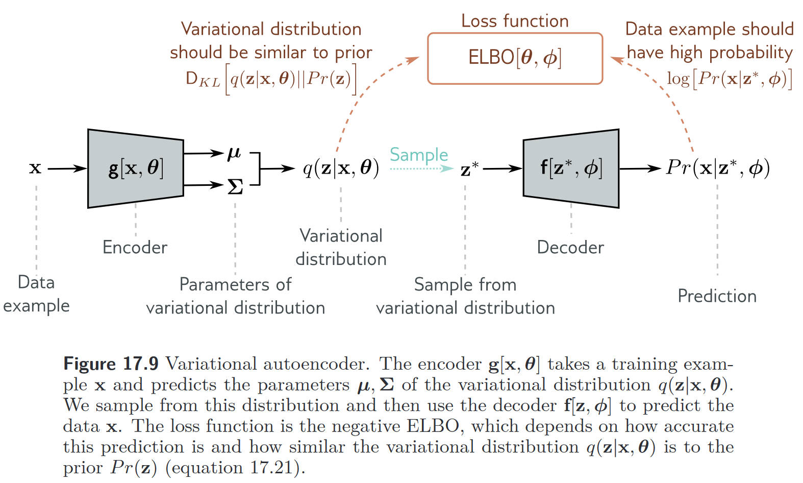

# 两日计划

我们的模型框架中涉及了 diffusion model 和 VAE 部分，但是应用场景均不同于标准模式，所以根据这些不同与标准模式的部分，有一些思考的空间。

1. **加噪部分**

正常的 diffusion 是加到高斯分布为止，**重点在于学习 backward 的降噪过程，而不在于最终的加噪结果**。从这个角度来说，当我们想要从加噪后的数据中提取特征时，**高噪部分对我们的意义并不大**。

我们加噪的目的在于数据增广，防止过拟合。同时，为了解决上一问题，可以对于所有的 $x_t$ 均加上 $x_0$ ，这样也相当于**对于低噪数据的权重增加了**。

$y_0$ 同理。

2. **预测模型**

以下是对于 VAE 的学习过程，算是了解得比较清楚，在这个基础上思考预测模型的改进。

## VAE

想要拟合数据的生成概率 $Pr(x)$，可以通过对与隐变量的联合分布积分的形式

$$
Pr(\mathbf{x})=\int Pr(\mathbf{x},\mathbf{z})d\mathbf{z}.
$$

进一步，可以通过条件概率来对这个联合分布进行拆分，

$$
Pr(\mathbf{x})=\int Pr(\mathbf{x}|\mathbf{z})Pr(\mathbf{z})d\mathbf{z}.
$$

尽管这种方式对于描述 $Pr(x)$ 来说并不直观，但是可以使用更加简单形式的 $Pr(x|z)$ 和 $Pr(z)$ 来定义复杂的 $Pr(x)$。在不同 $z$ 的情况下，$Pr(x,z)$ 的分布并不一样，所以需要加和处理。 

**Nonlinear latent variable model**

在非线性隐变量模型中，数据 $x$ 和隐变量 $z$ 都是连续且多元。如果先验 $Pr(z)$ 是一个标准多元正态分布

$$
Pr(\mathbf{z})=\mathrm{Norm}_{\mathbf{z}}[\mathbf{0},\mathbf{I}].
$$

Likelihood $Pr(x|z,\phi)$ 也是正态分布，并且均值是隐变量的非线性函数 $f[z,\phi]$，协方差为 $\sigma^2 \mathbf{I}$,

$$
Pr(\mathbf{x}|\mathbf{z},\phi)=\mathrm{Norm}_\mathbf{x}\left[\mathbf{f}[\mathbf{z},\phi],\sigma^2\mathbf{I}\right].
$$

其中 $\phi$ 是我们想要学习的参数。

最终的数据概率 $Pr(x|\phi)$ 同样是对于 latent variable $z$ 积分得到，

$$
\begin{aligned}Pr(\mathbf{x}|\boldsymbol{\phi})&=\int Pr(\mathbf{x},\mathbf{z}|\phi)d\mathbf{z}\\&=\int Pr(\mathbf{x}|\mathbf{z},\phi)\cdot Pr(\mathbf{z})d\mathbf{z}\\&=\int\mathrm{Norm}_\mathbf{x}\left[\mathrm{f}[\mathbf{z},\phi],\sigma^2\mathbf{I}\right]\cdot\mathrm{Norm}_\mathbf{z}\left[\mathbf{0},\mathbf{I}\right]d\mathbf{z}.\end{aligned}
$$

这种形式本质上是无穷个带有不同均值的高斯分布加权和，权重为 $Pr(z)$，隐变量模型都可以写成这种形式。

这种形式的问题在于，

- **非线性的情况下，不存在解析解**
- **当维度高时，积分复杂度急剧上升**

### Evidence lower bound (ELBO)

因此，我们通过 Jensen's inequality 定义 log-likelihood 的 lower-bound，并通过最大化 lower bound 来进行优化，这也称之为 **ELBO** (Evidence lower bound)。

首先定义任意一个 $z$ 的分布 $q(z)$，有

$$
\begin{aligned}\log[Pr(\mathbf{x}|\phi)]&=\log\left[\int Pr(\mathbf{x},\mathbf{z}|\phi)d\mathbf{z}\right]\\&=\log\left[\int q(\mathbf{z})\frac{Pr(\mathbf{x},\mathbf{z}|\phi)}{q(\mathbf{z})}d\mathbf{z}\right]\end{aligned}
$$

接着根据 Jensen's inequality

$$
\log\left[\int q(\mathbf{z})\frac{Pr(\mathbf{x},\mathbf{z}|\phi)}{q(\mathbf{z})}d\mathbf{z}\right]\quad\geq\quad\int q(\mathbf{z})\log\left[\frac{Pr(\mathbf{x},\mathbf{z}|\phi)}{q(\mathbf{z})}\right]d\mathbf{z},
$$

> 这里之所以称之为是 Evidence lower bound 是因为在 Bayes 中，$\log[Pr(\mathbf{x}|\phi)]$ 被称之为 evidence。

在实际情况中，$q(z)$ 往往会有参数 $\theta$ (可学习的网络参数)，所以 ELBO 也可以写为

$$
\mathrm{ELBO}[\boldsymbol{\theta},\boldsymbol{\phi}]=\int q(\mathbf{z}|\boldsymbol{\theta})\log\left[\frac{Pr(\mathbf{x},\mathbf{z}|\boldsymbol{\phi})}{q(\mathbf{z}|\boldsymbol{\theta})}\right]d\mathbf{z}.
$$

VAE 在干的事情就是最大化这个 Lower bound。

#### The property of this lower bound

1. Tightness

$$
\begin{aligned}\mathrm{ELBO}[\theta,\phi]&=\int q(\mathbf{z}|\boldsymbol{\theta})\log\left[\frac{Pr(\mathbf{x},\mathbf{z}|\boldsymbol{\phi})}{q(\mathbf{z}|\boldsymbol{\theta})}\right]d\mathbf{z}\\
&=\int q(\mathbf{z}|\boldsymbol{\theta})\log\left[\frac{Pr(\mathbf{z}|\mathbf{x},\boldsymbol{\phi})Pr(\mathbf{x}|\boldsymbol{\phi})}{q(\mathbf{z}|\boldsymbol{\theta})}\right]d\mathbf{z} \\
&= \int q(\mathbf{z}|\boldsymbol{\theta})\log\left[Pr(\mathbf{x}|\boldsymbol{\phi})\right]d\mathbf{z}+\int q(\mathbf{z}|\boldsymbol{\theta})\log\left[\frac{Pr(\mathbf{z}|\mathbf{x},\boldsymbol{\phi})}{q(\mathbf{z}|\boldsymbol{\theta})}\right]d\mathbf{z} \\
&= \log\left[Pr(\mathbf{x}|\boldsymbol{\phi})\right]+\int q(\mathbf{z}|\boldsymbol{\theta})\log\left[\frac{Pr(\mathbf{z}|\mathbf{x},\boldsymbol{\phi})}{q(\mathbf{z}|\boldsymbol{\theta})}\right]d\mathbf{z} \\
&= \log\left[Pr(\mathbf{x}|\boldsymbol{\phi})\right]-\mathrm{D}_{KL}\left[q(\mathbf{z}|\boldsymbol{\theta})||Pr(\mathbf{z}|\mathbf{x},\boldsymbol{\phi})\right]
\end{aligned} 
$$

第一项 $z$ 没了是因为 $q(z|\theta)$ 积分为 1，第二项恰好是 KL Divergence 的形式。

这个等式告诉我们的是，ELBO 的形式就是原本的对数似然减去 KL 散度。当 $q(\mathbf{z}|\boldsymbol{\theta})=Pr(\mathbf{z}|\mathbf{x},\boldsymbol{\phi})$ 的时候 KL 散度为零。这告诉我们 latent variable $z$ 的取值应该与数据 $x$ 有关。

2. Reconstruction loss minus KL distance to prior

除了上面的两种理解方式，ELBO 还可以做如下理解

$$
\begin{aligned}\mathrm{ELBO}[\theta,\phi]&\begin{aligned}=&&\int q(\mathbf{z}|\boldsymbol{\theta})\log\left[\frac{Pr(\mathbf{x},\mathbf{z}|\boldsymbol{\phi})}{q(\mathbf{z}|\boldsymbol{\theta})}\right]d\mathbf{z}\end{aligned}\\
&=\quad\int q(\mathbf{z}|\boldsymbol{\theta})\log\left[\frac{Pr(\mathbf{x}|\mathbf{z},\boldsymbol{\phi})Pr(\mathbf{z})}{q(\mathbf{z}|\boldsymbol{\theta})}\right]d\mathbf{z}\\
&\begin{array}{rcl}=&\int q(\mathbf{z}|\boldsymbol{\theta})\log\left[Pr(\mathbf{x}|\mathbf{z},\boldsymbol{\phi})\right]d\mathbf{z}+\int q(\mathbf{z}|\boldsymbol{\theta})\log\left[\frac{Pr(\mathbf{z})}{q(\mathbf{z}|\boldsymbol{\theta})}\right]d\mathbf{z}\end{array}\\&=\quad\int q(\mathbf{z}|\boldsymbol{\theta})\log\left[Pr(\mathbf{x}|\mathbf{z},\boldsymbol{\phi})\right]d\mathbf{z}-\mathrm{D}_{KL}\left[q(\mathbf{z}|\boldsymbol{\theta})||Pr(\mathbf{z})\right],\end{aligned}
$$

其中第一项表示 Reconstruction loss，第二项是 $z$ 后验分布和先验分布之间的 KL 散度。

这一公式表明的是，如果我们希望达到较好的重构效果，那么 $z$ 就区分的越开越好，但是这样会使得新样本会落入概率小的区域中，所以通过第二项，可以使得所有 $x$ 对应的 $z$ 都尽可能地靠近先验，例如 $N(0,1)$。最优情况下，所有小圆（$z$）都在大圆（$N(0,1)$）里，并彼此互不重叠。

### Variational approximation

从 Tightness 的角度看，当 $q(z|\theta)$ 等于后验 $Pr(z|x,\phi)$ 时即可满足。逻辑上来说，可以通过贝叶斯来计算后验

$$
Pr(\mathbf{z}|\mathbf{x},\phi)=\frac{Pr(\mathbf{x}|\mathbf{z},\phi)Pr(\mathbf{z})}{Pr(\mathbf{x}|\phi)},
$$

但是就像上文提到的，分母部分仍然需要对 $z$ 做积分，因而在实际操作层面是很难实现的。这所说的是，即使通过 ELBO 转化了求解形式，依然会有这个问题，所以需要使用变分推断。

> 变分推断指的是，**将难以计算的后验分布，用一个可计算（且带参数）的分布进行近似，然后通过最小化二者的差异（常用 KL 散度）来得到该分布的最优参数**。通过变分推断，可以将原本无法直接求解的贝叶斯推断问题，转化为一个可优化的问题。
>
> 在 VAE 中，模型需要对隐变量 $z$ 的真实后验 $p(z|x,\phi)$ 进行推断，但是太过复杂无法计算，所以引入了一个参数化的近似后验 $q(z|x)$ 来拟合真实后验。近似推断网络指的就是编码器。

具体来说，选择一个较为简单的参数形式 $q(z|\theta)$，改变 $\theta$ 来拟合后验。从 Tightness 部分的分析我们知道，$z$ 的分布形式与 $x$ 有关，所以变分推断网络也应该试图从 $x$ 中提取信息

$$
q(\mathbf{z}|\mathbf{x},\boldsymbol{\theta})=\mathrm{Norm}_{\mathbf{z}}\left[\mathrm{g}_{\boldsymbol{\mu}}[\mathrm{x},\boldsymbol{\theta}],\mathrm{g}_{\boldsymbol{\Sigma}}[\mathrm{x},\boldsymbol{\theta}]\right]
$$

到这一步基本原理都介绍的差不多了，可以展示 VAE 的结构了。

### Variational autoencoder

**所以本质上 VAE 的 Encoder 部分是在拟合 $z$ 的后验分布，decoder 是在拟合 $x$ 的后验分布。**

