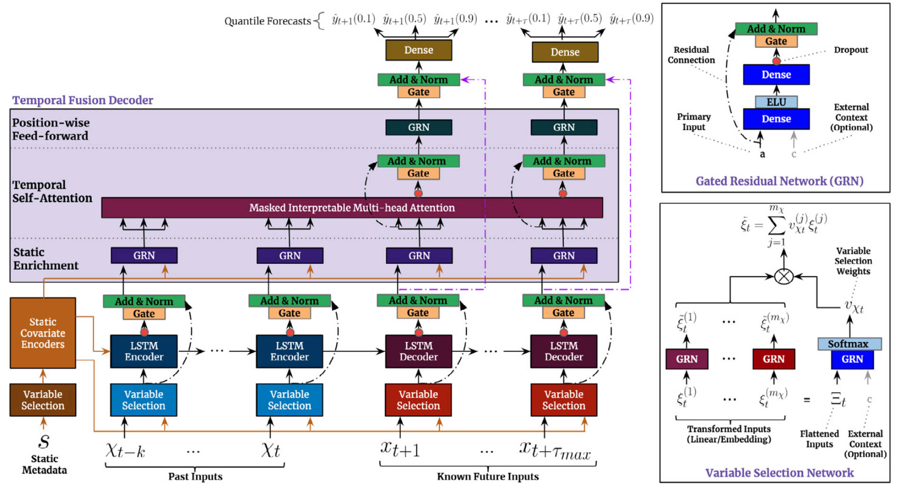

# Temporal Fusion Transformers for interpretable multi-horizon time series forecasting

Bryan Lim 1, Sercan Ö. Arık 2, Nicolas Loeff 2, Tomas Pfister2

1. **University of Oxford**
2. **Google Cloud AI**

three types of variable selection

- Past Inputs
- Static Metadata
- Known Future Inputs

## Gating mechanisms

> Give the model the flexibility to apply non-linear processing only where needed.

$$
\begin{aligned}\mathrm{GRN}_\omega(a,c)&=\mathrm{LayerNorm}\left(\boldsymbol{a}+\mathrm{GLU}_\omega(\boldsymbol{\eta}_1)\right),\\\boldsymbol{\eta}_1&=W_{1,\omega}\eta_2+b_{1,\omega},\\\boldsymbol{\eta}_2&=\mathrm{ELU}\left(W_{2,\omega}\boldsymbol{a}+W_{3,\omega}\boldsymbol{c}+\boldsymbol{b}_{2,\omega}\right),\end{aligned}
$$

> [!TIP|label:ELU]
> Exponential Linear Unit activation function
$$
\mathrm{ELU}(x)=\begin{cases}x&\mathrm{if~}x>0\\\alpha(\exp(x)-1)&\mathrm{if~}x\leq0&&\end{cases}
$$
> 

$$
\mathrm{GLU}_{\omega}(\boldsymbol{\gamma})=\sigma(\boldsymbol{W}_{4,\omega}\boldsymbol{\gamma}+\boldsymbol{b}_{4,\omega})\odot(\boldsymbol{W}_{5,\omega}\boldsymbol{\gamma}+\boldsymbol{b}_{5,\omega}),
$$

where $\sigma(.)$ is the sigmoid activation function. GLU outputs could be all close to $0$ in order ot suppress the nonlinear contribution.

## Variable selection networks

**Variable selection weights** are generated by feeding both $\Xi$ and an external context vector $\boldsymbol{c}_s$ through a GRN followed by a Softmax layer:

$$
\boldsymbol{v}_{\chi_t}=\mathrm{Softmax}\left(\mathrm{GRN}_{v_\chi}(\boldsymbol{\Xi}_t,\boldsymbol{c}_s)\right)
$$

where $\boldsymbol{\Xi}_t=\left[\boldsymbol{\xi}_t^{(1)^T},\ldots,\boldsymbol{\xi}_t^{(m_\chi)^T}\right]^T$ is the flattened vector of all past inputs at time $t$, and $\boldsymbol{c}_s$ is obtained from a static covariate encoder.

At each time step, an additional layer of non-linear processing is employed by feeding each $\xi_t^{(j)}$ through **its own GRN**,

$$
\tilde{\xi}_t^{(j)}=\mathrm{GRN}_{\tilde{\xi}(j)}\left(\xi_t^{(j)}\right)
$$

We note that each variables own GRN's **weights are shared across all time steps** $t$. Processed features are then weighted by their variable selection weights and combined:

$$
\tilde{\xi}_t=\sum_{j=1}^{m_\chi}\upsilon_{\chi_t}^{(j)}\tilde{\xi}_t^{(j)}
$$

## Static covariate encoders

In **contrast** with other time series forecasting architectures, the TFT is carefully designed to integrate information from **static metadata**, using separate GRN encoders to produce four different context vectors, $\boldsymbol{c}_s, \boldsymbol{c}_e, \boldsymbol{c}_c$ and $\boldsymbol{c}_h$. These contect vectors are wired into various locations in the temporal fusion decoder where static variables play an important role in processing.

> static (time-invariant) metadata (e.g. location of the store)

Specifically, this includes contexts for

1. temporal variable selection $\boldsymbol{c}_s$
2. local processing fo temporal features $(\boldsymbol{c}_c,\boldsymbol{c}_h)$
3. enriching of temporal features with static information $\boldsymbol{c}_e$

## Interpretable multi-head attention

The TFT employs a self-attention mechanism to learn **long-term relatoinships** across different time steps, which we modify from multi-head attention in transformer-based architectures to enhance **explainability**. 

In traditional multi-head, different values are used in each head, thus attention weights alone would not be indicative of a particular feature's importance. As such, we modify multi-head attention to share values in each head, and employ additive aggregation of all heads: 

$$
\text{InterpretableMultiHead}(Q,K,V)=\tilde{H}W_H,
$$

then

$$
\begin{aligned}\tilde{H}&=\tilde{A}(\mathbf{Q},\mathbf{K})\boldsymbol{V}\boldsymbol{W}_V,\\
&=\left\{\frac{1}{m_H}\sum_{h=1}^{m_H}A\left(\mathbf{Q}\boldsymbol{W}_Q^{(h)},\boldsymbol{K}\boldsymbol{W}_K^{(h)}\right)\right\}\boldsymbol{V}\boldsymbol{W}_V,\\
&=\frac{1}{m_H}\sum_{h=1}^{m_H}\mathrm{Attention}(\mathbf{Q}\boldsymbol{W}_Q^{(h)},\boldsymbol{K} \boldsymbol{W}_K^{(h)},\boldsymbol{V}\boldsymbol{W}_V),\end{aligned}
$$

where $\mathbf{W}_V \in \mathbb{R}^{d_{model} \times d_V} $ are value weights shared across all heads, and $\mathbf{W}_V \in \mathbb{R}^{d_{model} \times d_V}$ is used for final linear mapping.

The key is that **each head can learn different temporal patterns** $A(\mathbf{Q}\boldsymbol{W}_Q^{(h)},\boldsymbol{K} \boldsymbol{W}_K^{(h)})$ while attending to a common set of input features $\boldsymbol{V}$.

## Temporal fusion decoder

### Locality enhancement with sequence-to-sequence layer

LSTM

Moreover, to allow static metadata to influence local processing, we use the $\boldsymbol{C}_c, \boldsymbol{C}_h$ context vectors from the static covariate encoders to initialize the cell state and hidden state respectively for the first LSTM in the layer. We also employ a gated skip connection over this layer:

$$
\tilde{\boldsymbol{\phi}}(t,n)=\mathrm{LayerNorm}\left(\tilde{\boldsymbol{\xi}}_{t+n}+\mathrm{GLU}_{\tilde{\phi}}(\boldsymbol{\phi}(t,n))\right)
$$

where $n \in [-k,\tau_{max}]$.

### Static enrichment layer

As static covariates often have a significant influence on the temporal dynamics (e.g. genetic information on disease risk), we introduce a static enrichment layer that enhacnes temporal features with static metadata. For a given position index $n$, static enrichment takes the form:

$$
\boldsymbol{\theta}(t,n)=\mathrm{GRN}_\theta\left(\tilde{\boldsymbol{\phi}}(t,n),\mathbf{c}_e\right)
$$

### Quantile outputs

TFT generates **prediction intervals** on top of forcasts. Quantile forecasts are generated using a linear transformation of the output from the temporal fusion decoder:

$$
\hat{y}(q,t,\tau)=\boldsymbol{W}_{q}\tilde{\boldsymbol{\psi}}(t,\tau)+b_{q},
$$

where $\boldsymbol{W}_q \in \mathbb{R}^{1 \times d}, b_q \in \mathbb{R} $ are linear coefficients for the specified quantile $q$. We note that forecasts are only generated for horizons in the future (i.e. $\mathrm{i.e.~}\tau\in\{1,\ldots,\tau_{\max}\}$).

## Loss functions

TFT is trained by jointly minimizing the quantile loss, summed across all quantile outputs:

$$
\begin{aligned}&\mathcal{L}(\Omega,\boldsymbol{W})=\sum_{y_t\in\Omega}\sum_{q\in Q}\sum_{\tau=1}^{\tau_{max}}\frac{\mathbb{Q}L\left(y_t,\hat{y}(q,t-\tau,\tau),q\right)}{M\tau_{max}}\\&QL(y,\hat{y},q)=q(y-\hat{y})_++(1-q)(\hat{y}-y)_+,\end{aligned}
$$

