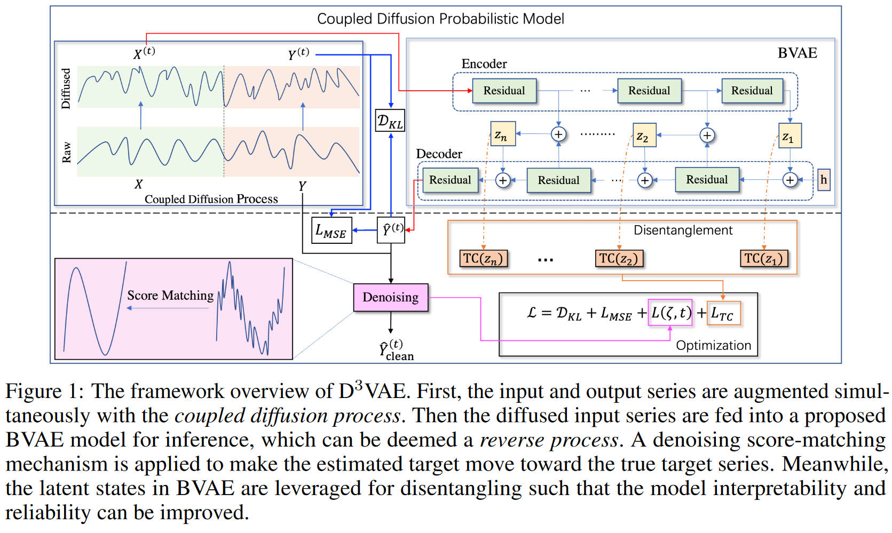
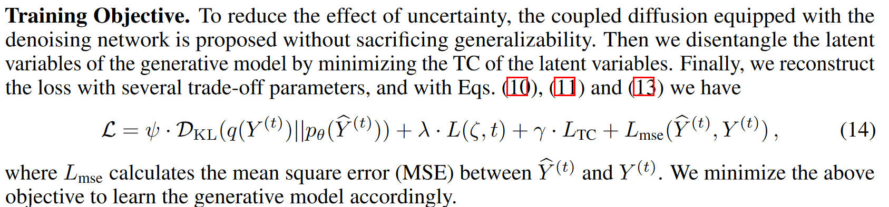

# Generative time series forecasting with diffusion, denoise, and disentanglement

Li Y1, Lu X1, Wang Y1, Dou Dejing1. Advances in ***NeurIPS***, 2022.

1. *Business Intelligence Lab, Baidu Research*
2. *Zhejiang University*

文章的核心在于使用 Bidirectional VAE 代替 diffusion 的 reverse process，这是第一个 D。第二个 D 来自于 denoise，也就是将加噪的数据放入模型，模型最终会学出一个有偏的分布，因此去噪后回归真实分布。第三个 D 来自于 disentanglement，在 BVAE 的过程中，每一步都会得到一个中间状态隐变量 $Z$，在每一步的 $Z$ 中，都会使得 $Z$ 不同维度之间尽可能独立，增加可解释性，同时控制过拟合。

因为使用 BVAE 是想用来代替 reverse process，所以 VAE 是一个 H (Hierarchical) VAE 的结构，有很多层级，之所以叫做 Bidirectional，就在于用于得到 disentanglement $Z$ 的过程是通过 encoder 和 decoder 的互相融合得到的，使用了双向之间的关系。

为什么要使用 Diffusion？ 因为作者还是想要从生成模型的角度来理解 $Y$，认为 $Y$ 是一个与 $X$ 有关的隐变量而生成的。

这里的四个 Loss 分别是

- 加噪后的 $Y$ 和预测值 $\hat{Y}$ 分布之间的 KL 散度
- 去噪后的 $\hat{Y}_{\text{clean}}$ 和真实 $Y$ 之间的损失
- Total correlation，disentanglement 项
- 加噪后的 $Y$ 和预测值 $\hat{Y}$ 之间的损失

> 从生成模型的角度理解 $X$ 和 $Y$ 之间的关系没问题，但是套在 diffusion 框架下不是很适用在于，diffusion 过程中的 $x$ 维度是不可变的，因此为了适配 $X$ 和 $Y$ 不同的维度，就势必要做一些变换。Diffusion 作为 HVAE 下的一个特例，也许 HVAE 的灵活性会更高些。

### Score matching

文章中使用的 score matching 方法称之为 denoising score matching (DSM)，是与其提出的 diffusion process 共同使用的。

> We integrate the multiscale denoising score matching into the **coupled** diffusion process to improve the accuracy of generated results.

之所以使用 DSM 是因为在时间序列生成模型中引入 diffusion probabilistic model 后，生成分布 $p_{\theta}(\hat{Y}^{(t)})$  **倾向于生成加噪后的数据，从而偏离真实数据**，所以通过 DSM 来降低这种不确定性 (de-uncertainty)。

传统 Score Matching 直接估计数据分布的 score $\nabla_{Y}\log p_{\mathrm{data}}(Y)$，当数据为高维时，这一估计需要的**计算复杂度极高**，所以 DSM 通过噪声核 $q_{\sigma_0}(\widehat{Y}|Y)$，

$$
q_{\sigma_0}(\widehat{Y}|Y)=\mathcal{N}(Y,\sigma_0^2I)\propto\exp\left(-\frac{\|\widehat{Y}-Y\|^2}{2\sigma_0^2}\right).
$$

将目标转化为匹配**条件分布**的 score $\nabla_{\widehat{Y}}\log q_{\sigma_0}(\widehat{Y}|Y)$ 从而避免直接估计 $p_{\mathrm{data}}(Y)$，进而**通过梯度学习这一加噪过程的逆向过程，从而恢复出原始分布 $Y$。**

目标函数如下，$\hat{Y}$ 表示模型生成序列，

$$
L_{\text{DSM}}(\zeta) = \mathbb{E}_{p_{\sigma_{0}}(\widehat{Y}, Y)} \left\| \nabla_{\widehat{Y}} \log(q_{\sigma_{0}}(\widehat{Y} \mid Y)) + \nabla_{\widehat{Y}} E(\widehat{Y}; \zeta) \right\|^{2}
$$

公式第一项表示加噪过程梯度，第二项表示能量函数梯度，令二者梯度相等，就可以使得模型学会逆向构建原分布的情况。将这一项经过一通化简就得到了我们所使用的形式

$$
\widehat{Y}_{\mathrm{clean}}=\widehat{Y}-\sigma_{0}^{2}\nabla_{\widehat{Y}}E(\widehat{Y};\zeta).
$$

> [!TIP|label:Energy Function]
> 能量函数 $E(\widehat{Y};\zeta)$ 是一个可学习的函数（如神经网络），用于定义生成模型的为归一化概率分布：
$$
p_\theta(\widehat{Y})\propto e^{-E(\widehat{Y};\zeta)}.
$$
> 能量函数的值越低，表示数据 $\hat{Y}$ 越符合生成模型的分布。
>
> 能量模型通过指数形式将能量函数映射到概率分布
$$
p_\theta(\widehat{Y})=\frac{e^{-E(\widehat{Y};\zeta)}}{Z(\zeta)},
$$
> 其中 $Z(\zeta)=\int e^{-E(\widehat{Y};\zeta)}d\widehat{Y}$ 是归一化常数（配分函数）。
>
> 对概率密度取对数梯度，得到 score 函数
$$
\nabla_{\widehat{Y}}\log p_\theta(\widehat{Y})=-\nabla_{\widehat{Y}}E(\widehat{Y};\zeta).
$$
> 因而可以直接学习能量函数的梯度，避免直接计算 $Z(\zeta)$。这也就是**模型输出的梯度**。

