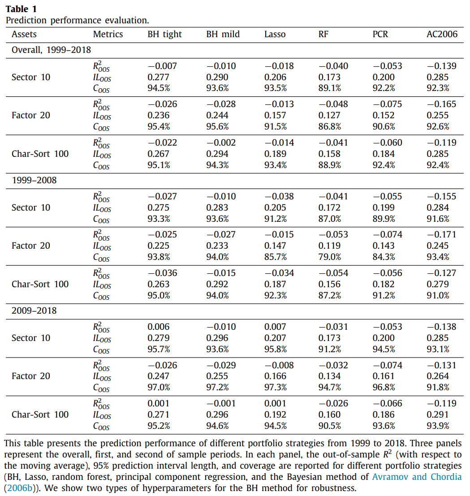
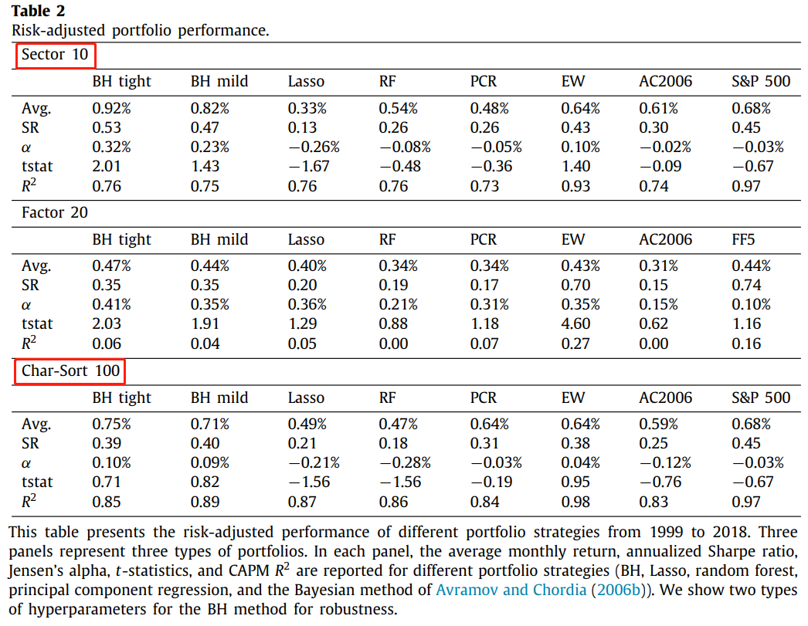
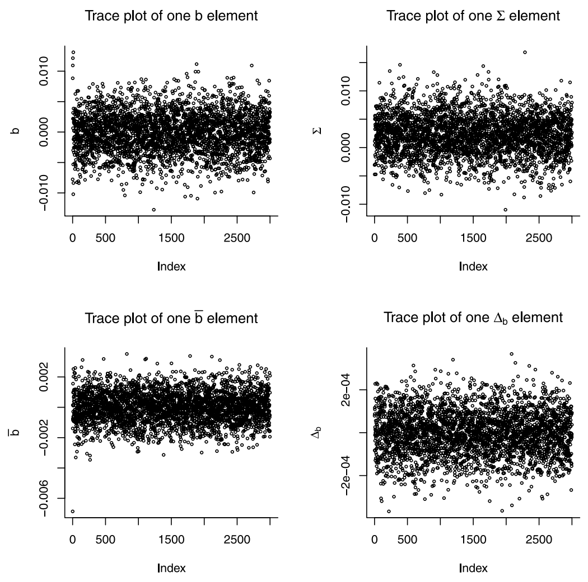

# Factor investing: A Bayesian hierarchical approach

Guanhao Feng1, Jingyu He 1, ***Journal of Econometrics***, 2022

1. *City University of Hong Kong*

## Abstract 

This paper investigates the **asset allocation** problem when **returns are predictable**1. We introduce a market-timing **Bayesian hierarchical (BH)** approach that adopts **heterogeneous** time-varying coefficients driven by lagged fundamental characteristics. Our approach estimates the conditional expected returns and residual covariance matrix2 **jointly** enables evaluating the **estimation risk**3 in the portfolio analysis. The hierarchical prior allows the modeling of different assets separately while **sharing information** across assets. 

We demonstrate the performance of the U.S. equity market, and our BH approach <u>outperforms most alternative methods in terms of point prediction and interval coverage</u>. In addition, the BH efficient portfolio achieves monthly returns of 0.92% and a significant Jensen’s alpha of 0.32% in sector investment over the past twenty years. We detect that technology, energy, and manufacturing are the most critical sectors in the past decade, and size, investment, and short-term reversal factors are heavily weighted in our portfolio. Furthermore, the stochastic discount factor constructed by our BH approach can explain many risk anomalies.

> [!TIP]
> 1. means **conditional**. If returns are unpredictable, the mean–variance efficient portfolio is time-invariant. Therefore, the econometric interest lies in the estimation property of unconditional expected returns and the covariance matrix
> 2. not **return** covariance matrix
> 3. investor uncertainty about the **parameters** of the return

***Main contributions***

- Estimates the conditional expected returns and residual covariance matrix **jointly**
- The hierarchical prior allows the modeling of different assets **separately** while **sharing information** across assets
- The stochastic discount factor constructed by our BH approach can explain many risk anomalies

## Conceptual Details

### Uncertainty of Parameters

> [!NOTE|label:Advantages of Bayes]

贝叶斯方法允许我们将经济学先验加入到统计模型中，以及评估参数估计中的**不确定性**（uncertainty）。

然而，在传统频率学派的方法以及现代机器学习方法中，并没有考虑参数的不确定性，特别是在高维的情况下，需要面临更加广阔的参数空间，参数的不确定性更需要被纳入考量。

### Motivation
#### 多资产建模 

***为什么需要多资产建模？***

Frankly speaking，我们需要不同资产来构建投资组合。实际上，本文指的多资产建模并不是在股票、债券、房地产之间做选择，而是在不同因子之间。

- The existing empirical literature focuses on testing the existence of return predictability for a single market index using market-timing macro predictors
- Current literature struggles to find consistent predictability evidence across multiple assets
 
当我们想要对多资产建模时，由于为了减少噪声，所以一般采用月度数据，这也导致了资产收益率的时间序列很短，但时间序列的个数却很多（资产很多），此时通用的解决方法分为两种：

1. **时间序列建模**（time series modeling）

**Sacrifice the potential benefit from massive data and model each asset independently.**

Huang D, Li J, Wang L, et al. Time series momentum: Is it there?[J]. ***Journal of Financial Economics***, 2020, 135(3): 774-794.

2. **池化建模**（pool modeling）

**Ignore the heterogeneity of assets, stack all time-series together, and train a single model.**

Gu S, Kelly B, Xiu D. Empirical asset pricing via machine learning[J]. ***The Review of Financial Studies***, 2020, 33(5): 2223-2273.

可以看到，两种方法都没有充分使用大数据。对于前一种，由于使用的数据量受限，往往不能得到很好的效果，而后一种，也失去了不同资产自身的独特信息（heterogeneous）。

***SO, which method can?***

#### <mark> Bayesian perspective </mark> <!-- {docsify-ignore} -->

本文从贝叶斯的视角来看待这一问题，正是文章标题所说的 Bayesian Hierarchical Approach。该方法既考虑到了众多资产的异质性，又实现了不同资产之间的信息共享【用以达到更好的估计效果】。

具体来说，该BH方法是通过**The Markov chain Monte Carlo (MCMC)** 实现的。该流程可以用两步循环来表示【quite **intuitive**】：

1. 基于层次先验，分别更新每个资产的估计系数【Information sharing step】
2. 评估所有资产的估计系数，并更新先验【Information grouping step】

正是因为所有的资产使用了同一先验，所以叫做Information Sharing Step。同样地，正是因为收集了所有资产的估计信息来更新先验，所以叫做Information Grouping Step。

> *Intuitively, the hierarchical prior **builds an overline bridge linking multiple asset returns**. **The within asset part** describes the predictor-return dynamics, and **the cross-asset part** incorporates the heterogeneity of predictor existence and strength.*

> [!NOTE|label:Textbook for hierarchical modeling approach]
> Rossi, P.E., Allenby, G.M., McCulloch, R., 2012. ***Bayesian Statistics and Marketing***. John Wiley & Sons.

#### Factor Zoo

在实际投资中，由于股票所包含的特异性风险（idiosyncratic risk）占比过高，并且股票个数太多，也就是维度太高会带来一些统计问题。业界和学界通常会对如此繁多的股票做降维处理。最为常见的方法就是通过sorting来构建组合：当我们通过特征对股票排序，并构建多空组合时，一般认为该组合是真实风险的proxy。这种投资组合的做法也称之为factor investing。

一般来说，通过特征对股票排序常常能体现出收益率的可预测性。然而，随着特征数目的不断增加，因子投资也遇到了高维度的问题，在2011年Cochrane的presidential address提出的 factor zoo正是描述这一情况。随后大量文献，使用了各种方法，试图解决这一问题。

> ***This paper joins this literature by the BH method.***

### <mark> Overiew of methodology </mark>
**The primary goal** of our approach is to <u>**create a common predictor-return dynamic and study the optimal portfolio choice for $N$ risky assets**</u>
$$
r_{i,t+1} = \alpha_{i,t}+x_t^T\beta_{i,t} + \epsilon_{i,t+1}, \qquad \forall i=1,\cdots,N
$$

$r_{i,t+1}$ 是超额收益，$x_t$是宏观变量（macro predictors），$\alpha_{i,t}$ 和$\beta_{i,t}$由公司特征决定，并且有**层次先验**。

## Empirical study

选取了十个宏观变量和10个行业组合，或20个多空组合，或100个特征排序组合来构建模型。三类组合反映了收益率的不同组成部分，同时组合数目不断增多能够测试模型在高维条件下的适用能力。

### Forcasting evaluation 

**Out of Sample R-square**

$$
R_{OOS}^2 = 1 - {\sum_{1,t}(\hat{R_{i,t}} - R_{i,t})^2 \over \sum_{1,t}(\bar{R_{i,t}} - R_{i,t})^2}
$$

**Coverage**

这是一个很有趣的指标，用以说明**文章的BH方法考虑了参数的不确定性，因此有着更宽的置信区间**，但是我还没有发现它有什么用。

$$
C_{OOS} = {1 \over (N \times T) } \sum_{i,t} \pmb{I} (\hat{R}_{i,t} - 1.96\times \hat{\sigma}_{i,t} < R_{i,t} < \hat{R}_{i,t} + 1.96\times \hat{\sigma}_{i,t})
$$

> [!TIP]
> 大多数机器学习模型来说并不计算资产的方差或协方差，因此用残差方差或协方差代替。

**Length of the predictive interval**

$$
IL_{OOS} = 2 \times 1.96 \times \sigma_{i,t}
$$

### Portfolio performance

#### Table 1 <!-- {docsify-ignore} -->

R-square很低，但是其他的也很低。特别是在Char-Sort 100中，仍然很低，甚至不如均值准，这就已经说明模型比较弱了，说不定还不如FF5。

作者强调的优势是：虽然R-square低，但是 $C_{OOS}$ 高，高的原因自然是因为 $IL_{OOS}$ 高。

但是问题在于，如果模型出来的sharp很高，或者R-square很高，那么就可以用于指导投资。当给出很高的 $C_{OOS}$ 但R-square很低时，我们并不敢用，说明这个指标只能是一个辅助类型的指标。

#### Table 2 <!-- {docsify-ignore} -->

在Sector 10和Char-Sort 100表现比较好，但是在后者，并没有获得稳定的Jansen alpha。

#### Table 3 <!-- {docsify-ignore} -->

**等权组合**表现最好。

会想起前面关于时间序列建模和池化建模的讨论，实在是不太理解说人家不行的底气在哪里，最起码动量因子在这三个benchmark的检验中还能由显著alpha。

> [!TIP|label:Related works]
> Bryzgalova S, Huang J, Julliard C. Bayesian solutions for the factor zoo: We just ran two quadrillion models[J]. ***The Journal of Finance***, 2023, 78(1): 487-557.

## Technical Details

**本章技术流程为：通过采样获得 $B$ 的估计，进一步计算出预期收益率和协方差，最后通过最优化获得最优权重，构造投资组合。**

尽管对每个资产的收益率分别建模（model return separately），但是通过**层次先验超参数分布**（hyper-parameter of a hierarchical prior distribution）可以实现资产间的信息共享（information sharing）

资产间的信息共享并不代表同质化，而是可以在保留异质性的基础上提升对于每个资产的拟合效果。

### BayesIan predictive model

历史收益率 $ R_t = (r_{1,t}.....,r_{N,t}) $, $ P $ 个资产特征数据 $ z_t $, and $Q$ 个宏观择时变量 $x_t$, 共同表示为 $D_t = (R_t,x_t,z_t) $。 投资者会不断更新组合, 在 $t$ 期, 预测收益率 $f(R_{t+1}|D_t)$, 并且计算**资产权重** $W_t = (w_t^1.....w_t^N)$ 。 

下一期组合收益率为：
$$
R_{t+1}^P = W_t^T R_{t+1} \tag{1}
$$

- If returns are **unpredictable**, the mean–variance efficient portfolio is time-invariant. Therefore, the econometric interest lies in the estimation property of unconditional expected returns and the covariance matrix.
- If returns are **predictable**, one needs to learn the source and mechanism of return predictability
 
$$
r_{i,t+1} = \alpha_{i,t} + x_t^T \beta_{i,t} + \epsilon_{i,t+1} \tag{2}
$$

回归系数 $\alpha_{i,t}$ 和 $\beta_{i,t}$ 是**时变**的, 由其公司特征决定:

$$\begin{aligned}
\alpha_{i,t} &= \eta_i^a + z_{i,t}^T \theta_i^a \\
\beta_{i,t} &= \eta_i^b + \theta_i^b z_{i,t} \tag{3}
\end{aligned}
$$

$\theta_i^b$ 是 $Q \times P$ 维系数矩阵。

将Eq.(3) 代入 Eq.(2), 
$$
r_{i,t+1} = \eta_i^a +z_{i,t}^T \theta_i^a + x_t^T \eta_i^b + (x_t \otimes z_{i,t})^T \theta_i^b +\epsilon_{i,t+1} \tag{4}
$$
$\otimes$ 代表克罗内克积（kronecker product）.

### Seemingly unrelated regressions

为了简化notation，将Eq.(4)表示为：
$$
r_{i,t+1} = f_{i,t}^T b_i + \epsilon_{i,t+1} \tag{5}
$$
where $f_{i,t} = [1,z_{i,t},x_t,(x_t \otimes z_{i,t})]$ 表示回归变量，$b_i = [\eta_i^a,\theta_i^a,\eta_i^b,\theta_i^b] $ 是对应的回归系数。

对于每一个资产 $i$, we stack the equations of different time periods $t$ as 
$$
r_i = f_i^T b_i + \epsilon_i \tag{6}
$$
where $r_i =(r_{i,2}.....,r_{i,T+1})^T,\ \epsilon_i = (\epsilon_{i,2}.....\epsilon_{i,T+1})$, and $f_i$ is matrix with $T$ rows.

**Stacking all equations** yields 
$$
R = FB + E \tag{7}
$$

where
$
R = \left[ \begin{matrix}
r_1 \\ r_2 \\ \vdots \\ r_N
\end{matrix}  \right],
$
$
\qquad F= \left[ \begin{matrix}
f_1 &0 &0 &0 \\
0 & f_2 &0 &0 \\
0 &\cdots &\cdots &0 \\
0 &0 &0 & f_N
\end{matrix}  \right],
$
$
\qquad B = \left[ \begin{matrix}
b_1 \\ b_2 \\ \vdots \\ b_N
\end{matrix}  \right],
$
$
\qquad E = \left[ \begin{matrix}
\epsilon_1 \\ \epsilon_2 \\ \vdots \\ \epsilon_N
\end{matrix}  \right]
$

$R$ 是 $NT \times 1$ 维公司收益率向量, $F$ 是 $NT × NK$ 块对角矩阵 (block diagonal matrix), $B$ 是 $NK × 1$ 维向量, and $E$ 是 $NT × 1$ 维残差向量。

协方差矩阵 $\Sigma$ 通常来说很难估计。

在之前的文献中，协方差的估计与收益率的预测通常是分开的。**以马科维茨为例**，利用历史收益率代替预期收益率，然后计算协方差，最后获得MVE。**以Shrinking the cross section为例**，假定协方差矩阵已知，然后估计收益率来构造MVE。

即使在协方差的估计中，要么是假定低维因子结构如FF3，HXZ q-factor等，或者是对协方差矩阵做收缩（shrinkage）。

然而，在本文中， ***二者的估计同时进行***。

假设**covariance matrix of the stacked residual** $E$ 如下 $Cov(E) := \Omega = \Sigma \otimes I_T$ , where $\Sigma$ is a **dense** matrix of cross-sectional covariance, and $I_T$ 是 T × T 维单位矩阵. 这个结构代表着**资产在截面上是相关的，在时序上是无关的**, which is a **standard assumption** in the empirical asset pricing literature.

This specification differs from the standard SUR model in Zellner (1962) as well as Polson and Tew (2000), which do not assume any constraint of $\Omega$ and estimate the $NT × NT$ matrix directly. Therefore, we ***reduce the dimension of its parameter space*** dramatically from $NT (NT + 1)/2$ to $N(N + 1)/2$.

Estimating the dense covariance matrix, $\Sigma$ **enables us to create the mean–variance portfolio**. Many popular machine learning algorithms, such as Lasso and neural network, cannot model this common shock jointly with returns but **assume a constant variance over time or across assets**.

### Hierarchical prior specification

为了研究资产间的联合预测能力（joint predictability）, 本文没有采取对每个 $b_i$ 单独设置先验, 而是对所有 $b_i$ 假设了一个共同的先验。

Suppose $b_i$ has **an independent and identical normal prior**
$$
b_i \sim N(\bar{b},\Delta_{b}), \forall i=1,....N, \tag{8}
$$
where, $\bar{b}$ is the prior mean of $b_i$, and $\Delta_b$ is a dense prior covariance matrix. 此时所有的 $b_i$ 具有相同的先验。

Futhermore, **the prior mean and covariance are assumed to have a hierarchical prior**:
$$
\bar{b} \sim N(\bar{\bar{b}},\Delta_{\bar{b}}) \tag{9}
$$
$$
\Delta_b \sim IW(v_b,V_b) \tag{10}
$$
This setup is **the standard normal-inverse-Wishart conjugate prior** for $\bar{b}$ and $\Delta_b$。所有预测变量的平均预测能力（average predictability）是 $\bar{\bar{b}}$, and $\Delta_b$ 代表这种预测能力的可信度【方差】。在实际应用中，我们设定 $\bar{\bar{b}} = 0$, 代表着我们认为 ***所有预测变量均没有预测能力***. 这种先验设定涉及4个超参数: $\{ \bar{\bar{b}},\ \Delta_{\bar{b}},\ v_b, \ V_b  \}$

> [!TIP|label:Wishart distribution]
> 在算multivariate normal distribution 的posterior distribution的时候，inverse Wishart是协方差矩阵的conjugate prior

这种正态先验 $b_i$ **等价于 $L_2$ 对于系数的收缩**，类似于岭回归。先验协方差 $\Delta_{\bar{b}}$ 会从数据里不断更新，因此**模型可以根据数据不断调整收缩力度**。使得BH方法相比其他模型有更多灵活性，特别是当众多弱估计变量（weak predictor）存在时，层次先验可以更好地收缩系数。

然而，从频率学派的视角来看，仅通过测试原假设H0 : $\bar{b}_j = 0$ 足够揭示第 $j$ 个变量的预测能力。就像在FF3的检验里。

除了 $b_i$ 的分布假设，关于协方差的假设 $\Omega = \Sigma \otimes I_T$ 中，$\Sigma$ 服从 a standard inverse-Wishart prior：
有两个超参数 $v_{\Sigma}$ 和 $V_{\Sigma}$ :
$$
\Sigma \sim IW(v_{\Sigma},V_{\Sigma}) \tag{11}
$$

**The MCMC sampler updates $\Sigma$**, and $\Omega$ can be recovered by simple calculation.

模型的多元正态似然函数：
$$
l(E|B,\Omega) \propto |\Omega|^{-1\over2} exp \{ -{1\over2}(R-FB)^T \Omega^{-1} (R-FB) \} \tag{12}
$$
因此，联合后验分布为：
$$
p(B,\Omega,\bar{b},\Delta_b|R,F) \propto l(E|B,\Omega) p(\Omega) p(B|\bar{b},\Delta_b)p(\bar{b})p(\Delta_b) \tag{13}
$$

然而，当随机变量是多元的，密度函数是非标准形式的、随机变量各分量不独立时，很难通过后验概率表达式获得解析解，因此需要引入抽样。

### Markov chain Monte Carlo scheme

> [!NOTE|label:MCMC]
> 理论上来说MCMC能够得到真实值，就像理论上来说Mixture of Gaussian能够拟合一切分布。但是MCMC extremely computational expensive
>
> Variational Inference算起来就比较快，但是它假设了隐变量之间独立性，which 并不适用于现实情况

Gibbs采样是MCMC算法中比较有代表性的一种，特点就是能够**交替采样**。

因为假设 $\Omega = \Sigma \otimes I_T $，所以只需要更新参数更少的 $\Sigma$ 而非 $\Omega$.

Gibbs 采样流程为：

(1) Sampling B from a multivariate normal distribution (**information sharing step**):

**在这一步对每个 $b_i$ 实现了交替采样**

$$
B|\bar{b},\Delta_b,\Omega,R,F \sim N \Big(b*,(F^T\Omega^{-1}F+I_N\otimes \Delta_b^{-1})^{-1} \Big) \tag{14}
$$

$$
b* = (F^T\Omega^{-1}F+I_N\otimes \Delta_b^{-1})^{-1} F^T\Omega^{-1}F+\Big((I_N\otimes \Delta_b^{-1})(\pmb{1}_N \otimes \bar{b}) \Big) \tag{15}
$$

$I_N$ is an $N \times N$ dimensional identity matrix, and $\pmb{1}_N$ denotes an $Nx1$ vector of ones.

(2) Sampling $\bar{b}$ from a multivariate normal distribution (**information grouping step**):

**第二步和第三步聚合每个资产信息，用于更新先验。**

$$
\bar{b}|B,\Delta_b \sim N \bigg( \Big( \Delta_{\bar{b}}^{-1}+N \Delta_{b}^{-1} \Big)^{-1} \Big( \Delta_{\bar{b}}^{-1} \bar{\bar{b}}+\Delta_{b}^{-1} (\pmb{1}_N \otimes I_K)^TB\Big),\ \Big( \Delta_{\bar{b}}^{-1}+N \Delta_{b}^{-1} \Big)^{-1}  \bigg) \tag{16}
$$
where $\bar{\bar{b}}$ is set to 0 for the purpose of shrinkage.

(3) Sampling ∆b from an inverse-Wishart distribution:

$$
\Delta_b | B,\bar{b} \sim IW \Big(v_b+N, ((D-\bar{b}\otimes\pmb{1}_N^T)(D-\bar{b}\otimes\pmb{1}_N^T)^T + V_b)^{-1} \Big) \tag{17}
$$

(4) Sampling $\Sigma$ from an inverse-Wishart distribution:

$$
\Sigma | B,R,F \sim IW(v_{\Sigma}+T,V_{\Sigma}+\tilde{E}^T\tilde{E}) \tag{18}
$$
where $\tilde{E} = [\hat{\epsilon_1},\cdots,\hat{\epsilon_N}]$ is a $TxN$ matrix of residuals, $\hat{\epsilon_i} = r_i-f_i^T b_i$. Calculate $\Omega = \Sigma \otimes I_T$ accordingly.

**计算出 $\Omega$ 后，就可以再转过头更新 $B$ 了。**

> [!ATTENTION|label:Convergence]
> MCMC方法的难点是如何判断我们已经到达稳态了，**目前还没有明确的理论指导表明其是否到达稳态，何时能到达稳态**，所以需要一些直观判断方法如人为的检验样本或观察连续采样间的关联。

作者观测了四个系数3000次的后验采样，发现收敛起来还是挺快的：

### Predicting returns and creating efficient portfolio

通过采样得到系数后，通过下列公式进行预测：
$$
\hat{r}_{i,t+1}^{(k)} = f_{i,t}^T+b_i^{(k)}
$$

预期收益率和协方差分别为：
$$\begin{aligned}
\pmb{E}(R_{t+1}|D_t) &= {1\over K} \sum_{k=1}^K \hat{r}_{i,t+1}^{(k)} \\
&= f_{i,t}^T {1\over K} \sum_{k=1}^K b_i^{(k)}
\end{aligned}$$

$$\begin{aligned}
Cov(R_{t+1}|D_t) &= Cov(\hat{r}_{i,t+1},\hat{r}_{j,t+1}) = Cov(f_{i,t}^T b_{i,t+1},f_{j,t}^T b_{j,t+1}) \\
&= f_{i,t}^T \Big( {1\over K}\sum_{k=1}^K b_i^{(k)}b_j^{(k)T} {1\over K}\sum_{k=1}^K b_i^{(k)} {1\over K}\sum_{k=1}^K b_j^{(k)T} \Big) f_{j,t}
\end{aligned}$$

大多数机器学习算法并不能估计协方差矩阵，并且只能给出收益率预测的点估计（point estimate）。而本文的贝叶斯方法由于考虑了参数的不确定性，因此可以给出置信区间。

**Optimization**

采用经典的最优化流程即可：

$$
U(W_t) = exp\{ \pmb{E}(R_{p,t+1}) - {\gamma \over 2} Var(R_{p,t+1}) \}
$$

$R_{p,t+1} = W_t^T R_{t+1} $

$$
\pmb{E}(R_{p,t+1}) =  W_t \pmb{E}(R_{t+1}|D_t), \quad Var(R_{p,t+1}) = W_t^T Cov(R_{t+1}|D_t)  W_t
$$

最优权重为：
$$
W_t^* = \argmax_{W_t} U(W_t)
$$

最终解有如下性质：
$$
W_t \propto Cov(R_{t+1}|D_t)^{-1} \pmb{E}(R_{t+1}|D_t)
$$

当然，可以通过如下条件限制卖空以及杠杆：
$$
\sum_{i=1}^N W_t^i = 1, \qquad W_t \geq 0
$$

> [!NOTE|label:提升]
> Nemeth C, Fearnhead P. Stochastic gradient markov chain monte carlo[J]. ***Journal of the American Statistical Association***, 2021, 116(533): 433-450.
