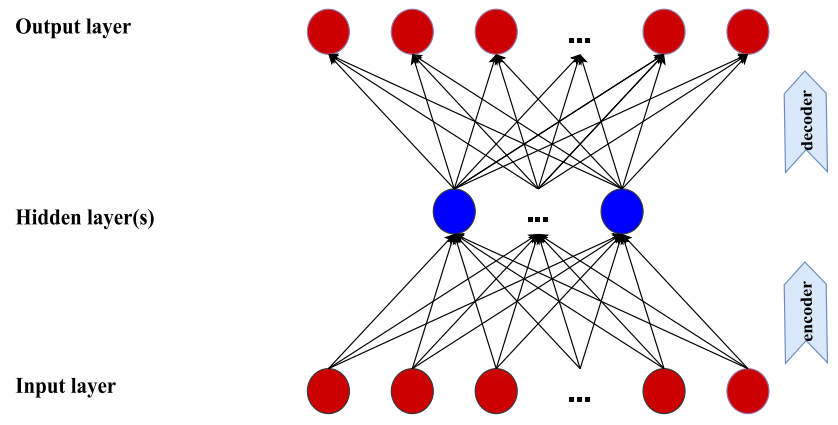
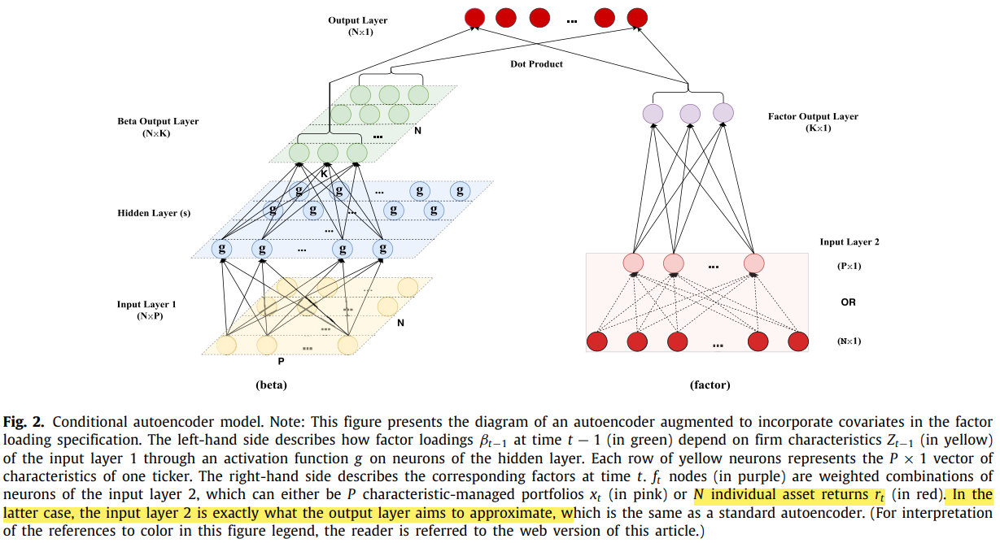
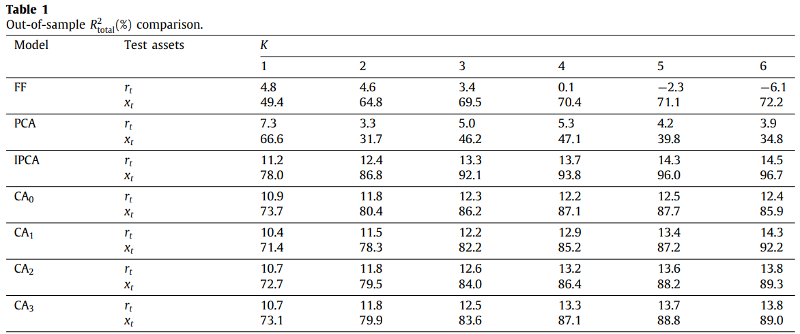
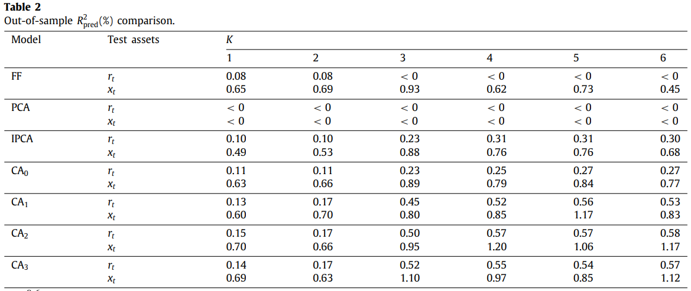
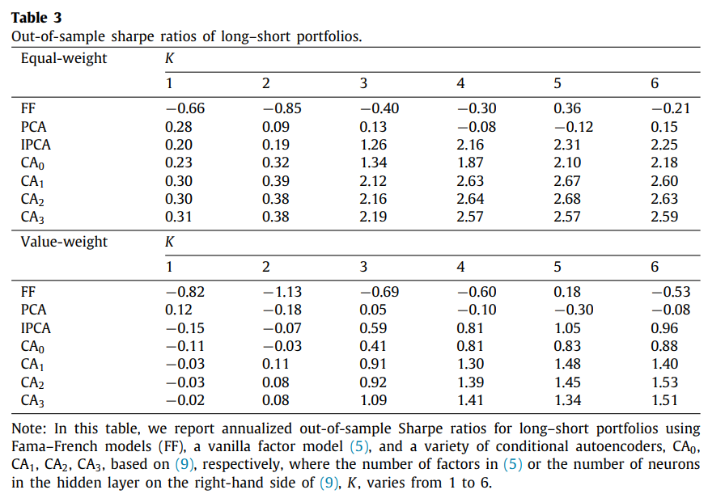
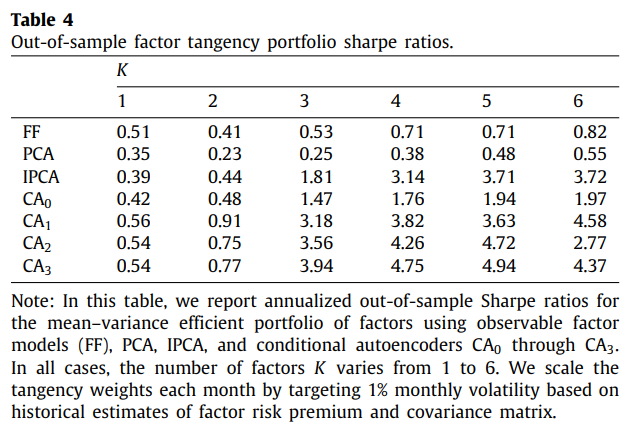
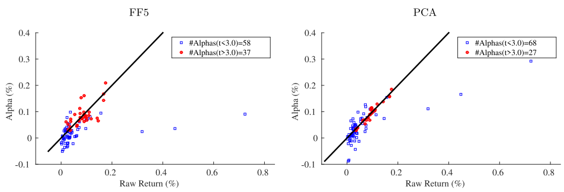
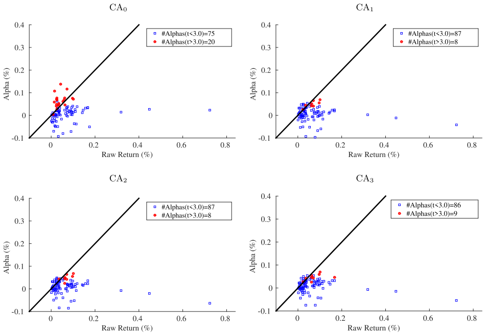
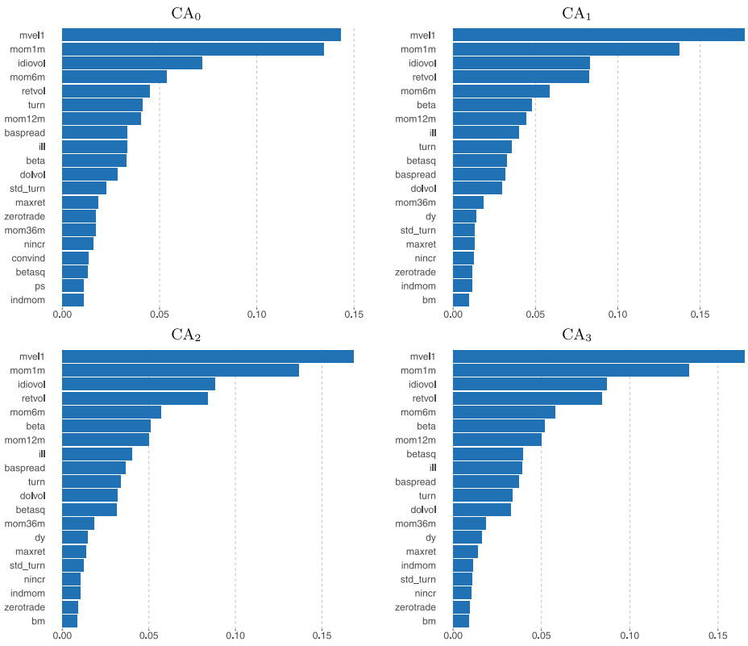

# Autoencoder asset pricing models
Shihao Gu1, Bryan Kelly 2,Dacheng Xiu1, ***Journal of Econometrics***, 2021

1. *Booth School of Business, University of Chicago*
2. *Yale University, AQR Capital Management, and NBER*

部分资产文献认为，characteristic-based asset return prediction属于一种异象（anomaly），然而，Kelly, Pruitt, and Su (KPS, 2019) 提出了IPCA，证明了这些特征实际上**proxy for unobservable and time-varying exposures to risk factors**，一旦这种factor exposure被纳入考量，这些特征也就不再产生 $\alpha$。

> KPS 的 implication 实际上在说没有 $\alpha$，全是 risk-based $\beta$。
>
> 但是也有相当一部分文献结论是 $\alpha$ significant，如
>
> Kim S, Korajczyk R A, Neuhierl A. Arbitrage portfolios[J]. ***The Review of Financial Studies***, 2021, 34(6): 2813-2856.
>
> 二者的区别在于：在IPCA的框架下，特征和收益率之间的结构不发生变化，仅仅是特征本身取值在不断变化。 而在KKN框架下，在每一个时间区间内【论文中为1年】，特征和收益率之间的结构和特征取值都不会发生变化，而在不同时间区间之间，取值和结构都会变化。
>
> 不同的框架会引致不一样的结论。

KPS的定价框架如下：

$$
\begin{equation}
r_{i,t} = \beta(z_{i,t-1})' f_t + u_{i,t} \label{1}
\end{equation}
$$

其中，$f_t$ 是latent factor，$K\times1$ 维的条件因子暴露 $\beta(z_{i,t-1})$ 是 $P\times1$ 维资产特征，P一定大于K，并且很有可能维度很高。但是在KPS中，由特征到 $\beta$ 的映射十分简单，属于线性映射：

$$\begin{equation}
\beta(z_{i,t-1})' = z_{i,t-1}'\Gamma \label{2}
\end{equation}$$

因此本文在此基础上将其提升为非线性。

总得来说，本文提出了**一个运用非参数方法估计SDF的模型，并且施加了经济学意义上无套利的限制**。

## Methodology

### Standard autoencoder

标准的autoencoder是用输出去估计输入，希望中间层能够尽可能的捕捉到输入数据中最重要的信息。

#### Static linear factor models as a special case <!-- {docsify-ignore} -->

autoencoder是一种降维工具，意在从高维度的数据中提取出低维度的关键信息。概念上类似于PCA，但更加灵活，因为其允许捕捉非线性的成分。

在金融中最为常见的是如下的static linear factor，之所以称之为static是因为系数 $\beta$ 是时不变的。

$$
\begin{equation}
r_t = \beta f_t + u_t \label{3}
\end{equation}
$$

其中 $r_t$ 是 $N\times1$ 维资产超额收益率向量，$f_t$ 是 $K \times 1$ 维因子收益率向量，$u_t$ 是 $N\times1$ 维 与 $f_t$ 不相关的 idiosyncratic errors，而 $\beta$ 是 $N\times K$ 维的因子载荷（factor loading）矩阵。

Stacking the time series vector，可以得到矩阵表达：

$$
R = \beta F + U
$$

记 $\bar{R}$ 是 $R$ 的 **demean** 表达，对 $\bar{R}$ 做SVD分解，则可以直接得到对于因子和因子载荷的估计，

$$
\begin{equation}
\widehat{R} = \widehat{P} \Lambda \widehat{Q} + \widehat{U} \label{4}
\end{equation}
$$

其中 $\widehat{P}$ 和 $\widehat{Q}$ 分别为 $N\times K$ 和 $K\times T$ 维矩阵， $\widehat{U}$ 是 $N\times T$ 维残差矩阵。

实际上一直以来，机器学习的文献都认为PCA与antoencoder之间有着十分紧密的联系，具体到上述例子来说，当**autoencoder仅有一层hidded layer和线性的激活函数时，就等价于PCA**。

深入到细节部分来看，单层线性的autoencoder可以写作：

$$
\begin{equation}
    r_t=b^{(1)}+W^{(1)}(b^{(0)}+W^{(0)}r_t)+u_t
\end{equation}
$$

其中 $W^{(0)}, W^{(1)}, b^{(1)},b^{(0)}$ 分别为 $K \times N,N \times K,N \times 1,K \times 1$ 维的矩阵参数。

该autoencoder的目标函数为：

$$
\begin{align}
&\min\limits_{b,W}\sum_{t=1}^T\left\|r_t-\left(b^{(1)}+W^{(1)}(b^{(0)}+W^{(0)}r_t)\right)\right\|^2 \notag  \\
=&\min\limits_{b,W}\|R-\big(b^{(1)}\iota'+W^{(1)}(b^{(0)}\iota'+W^{(0)}R)\big)\|_F^2, 
\end{align}
$$

其中 F 代表 *Frobenius norm*，$\iota$ 是 $T \times 1$ 维的 1 向量。

上式目标函数的最优解为：

$$
\begin{equation}
\widehat{W}^{(1)}=\widehat{P}A,\quad\widehat{W}^{(0)}=(\widehat{W}^{(1)'} \widehat{W}^{(1)})^{-1}\widehat{W}^{(1)'},\quad\widehat{b}^{(1)}=\bar{r}-\widehat{W}^{(1)}\widehat{b}^{(0)}-\widehat{W}^{(1)}\widehat{W}^{(0)}\bar{r},\quad\widehat{b}^{(0)}=a 
\end{equation}
$$

其中 A 是 $K \times K$ 维的非奇异矩阵，a 是constant scalar，$\bar{r}$ 是 $r_t$ 的样本均值，$\widehat{P}$ 与式 $\eqref{4}$ 中的一样。

线性的autoencoder等价于PCA是因为 **他们有相同的因子载荷矩阵 $\widehat{P}$** ，A只是起到rotation的作用。当满足相同的因子载荷矩阵时，二者的 **目标函数形式就等价了** 。

> [!TIP|label:Details]
> 在附录中提供了完整的推导。

### Extending the autoencoder model to include covariates

就像KPS对PCA做了提升使其包括了时变的信息，autoencoder同样可以被提升。

在KPS的模型中，一部分用来估计latent factor【如式 $\eqref{1}$ 】，另一部分用来估计条件 $\beta$ 【如式 $\eqref{2}$ 】，因此本文同样参照类似的结构提升了autoencoder，如下图。

左侧网络以**nonlinear function of covariates【如公司特征】**估计了**因子载荷**，而右侧则是以**股票组合**估计了**因子**。在最高层，数学表达与式 $\eqref{1}$ 相同

$$\begin{equation}
r_{i,t} = \beta_{i,t-1}'f_t + u_{i,t}
\end{equation}$$

对于 $\beta$ 的估计流程如下：

$$
\begin{align}
&z_{i,t-1}^{(0)}=z_{i,t-1}, \\
& z_{i,t-1}^{(l)}=g\left(b^{(l-1)}+W^{(l-1)}z_{i,t-1}^{(l-1)}\right),\quad l=1,\ldots,L_{\beta},  \\
&\beta_{i,t-1}=b^{(L_{\beta})}+W^{(L_{\beta})}z_{i,t-1}^{(L_{\beta})}.
\end{align}
$$

右侧的估计也十分类似：

$$
\begin{align}
&r_{t}^{(0)}=r_{t},  \label{13} \\
&r_{t}^{(l)}=\widetilde{g}\left(\widetilde{b}^{(l-1)}+\widetilde{W}^{(l-1)}r_{t}^{(l-1)}\right),\quad l=1,\ldots,L_{f}, \\
&f_t=\widetilde{b}^{(L_f)} + \widetilde{W}^{(L_f)} r_t^{(L_f)}.
\end{align}
$$

在实证部分应用的过程中，作者在右侧网络始终假设了单层结构，也就是说 $L_f = 1$，这是因为单层假设具有一定的经济解释：**因子是输入变量的线性组合**（linear combination of underlying asset returns）。

在最后阶段，从左侧 $\beta$ 网络中估计出的 $N\times K$ 维的矩阵与右侧factor网络估计出的 $K\times 1$ 维输出相乘，得到了我们想要的 $N\times 1$ 维的收益率序列。

在实际操作中，如果在右侧的factor网络中使用个股的**完整**截面数据会遇到两个棘手的问题：

1. 完整截面的股票的数量约为30000个，意味着网络中的权重参数个数将会非常大，而时序上的观察点个数约为720个。

2. 截面上的数据非常不平衡（extremely unbalanced）：对于任意选定的一个月来说，平均的非缺失值股票数量是6000个，因此这就要求用少量的数据点估计大量的数据。

因此，作者做了一处**关键调整**：式 $\eqref{13}$ 的输入数据不再使用个股收益率数据，而是换成了组合收益率。 

$$
\begin{equation}
x_t=(Z_{t-1}'Z_{t-1})^{-1}Z_{t-1}r_t 
\end{equation}
$$

> [!NOTE|label:Difference]
> 此处的managed portfolio与IPCA和shrinking中的有所不同，有的标准化到（-0.5，0.5），有的是（-1，1）。

$r_t^{(0)} = x_t$ 这一改动可谓是**一石三鸟**：

1. 这一改动相当于对数据提前降维，大大降低了需要估计的参数数量。
2. 面板数据不平衡也解决了，因为组合中总有非缺失值的股票，因此组合数据是不会miss的。
3. 这一改动也使得autoencoder模型与许多使用managed portfolio的文献联系起来。

#### Conditional linear factor models as a special case  <!-- {docsify-ignore} -->

就如同autoencoder包括了PCA，加入了时变条件信息的autoencoder也包括了IPCA

IPCA的目标函数如下：

$$
\begin{equation}
\min\limits_{\Gamma,F}\sum_{t=1}^T\sum_{i=1}^N\left\|r_{i,t}-z'_{i,t-1}\Gamma'f_t\right\|^2=\min\limits_{\Gamma,F}\sum_{t=1}^T\left\|r_t-Z_{t-1}\Gamma'f_t\right\|^2 \label{16}
\end{equation}
$$

其中 $F=(f_{1},f_{2},\ldots,f_T)\mathop \ {\mathrm{and}}\ Z_{t}=(z_{1,t}^{\prime},z_{2,t}^{\prime},\ldots,z_{N,t}^{\prime})^{\prime}$

> [!TIP|label:Restriction]
> IPCA在求解过程中加入了一些约束：
$$
\Gamma \Gamma' = \bm{I}_K,\quad FF' \text{ is a diagonal matrix with descending diagonal entries}, \quad F_{\iota} \geq 0
$$
> 这一约束并不具有经济学意义，只是为了能够得到一阶条件的唯一解。

考虑一种非常简单的conditional autoencoder，$\beta_{i,t}' =Z_{t-1}W_0' \ \text{and} \ f_t = W_1 x_t $，因此其目标函数为：

$$
\begin{equation}
\min\limits_{W_0,W_1}\sum\limits_{t=1}^T\|r_t-Z_{t-1}W_0'W_1x_t\|^2 \label{17}
\end{equation}
$$

当 $Z_t'Z_t = \Sigma \ \text{for a constant matrix }\Sigma $ 时，式 $\eqref{17}$ 与式 $\eqref{16}$ 等价。而当 $\Sigma$ 不为 constant时，二式估计量similar but no longer equivalent，二者的实证表现也非常相似。

同样地，具体细节在附录中。

### Regularized autoencoder learning

autoencoder就像其他的神经网络一样，尽管效果很好，但同时伴随着过拟合的问题。为了缓解过拟合问题，作者应用了三种方法：

1. 将样本划分为训练、验证和测试
2. Lasso and early stopping
3. SGD & Adam learning rate and batch normalization

## Empirical results

Comparison set包括：

- PCA and IPCA
- 具有不同 $\beta$ 网络层数的conditional autoencoder from CA<inf>0</inf> to CA<inf>3</inf> 
- Fama french类因子模型，from FF1 to FF6

文章用两个样本外的评价指标衡量模型表现，两个指标的最大区别就在于下标，不同的下标赋予了二者完全不同的含义。

**Total $R^2$**

一个好的资产定价模型应该能够衡量**收益率的共同变化**（common variation in realized return）。当模型能够衡量各个资产时序上的变化，此时就相当于描述了**系统性风险**， $\widehat{f}_t$ 就称之为common risk factor。

> The total $R^2$ quantifies the **explanatory power of contemporaneous factor realizations**, and thus assesses the model’s description of riskiness

$$\begin{equation}
R_{\text{total}}^2=1-\frac{\sum_{(i,t)\in\text{OOS}}(r_{i,t}-\widehat{\beta}'_{i,t-1}\widehat{f}_t)^2}{\sum_{(i,t)\in\text{OOS}}r_{i,t}^2}
\end{equation}$$

Total $R^2$ 意在衡量由同期因子值（contemporaneous factor realization） $\widehat{\beta}'_{i,t-1}$ 和时变因子载荷 $\widehat{f}_t$ 所解释的 $r_{i,t}$ 的变化程度，也即方差（the fraction of variance）。

**Predictive $R^2$**

Total $R^2$ 中，资产的共同变化我们称之为风险【波动】，除此之外，一个好的资产定价模型还应该能够从风险补偿（risk compensation）的角度解释收益率。

这一视角其实就是证券市场线（security market line，SML）的角度，风险溢价是所有资产的斜率，当在这一因子上的暴露越多，那么收益率就应该越高。当因子选择的越好【也即模型越好】，$R^2$ 就应该越高。

站在投资人的视角，在 t-1 时刻，已知信息是因子的风险溢价和对应的因子暴露【二者的乘积也就是条件预期收益率】，那么就会认为 t 时刻因子暴露高的资产收益率会更高。

> The predictive $R^2$ assesses the accuracy of model-based predictions of future excess returns. This quantifies a model’s ability to explain **panel variation in risk compensation**.

$$
\begin{equation}
R _{\mathrm{pred}}^{2}=1-\frac{\sum_{(i,t)\in OOS}(r_{i,t}-\widehat{\beta}'_{i,t-1}\widehat{\lambda}_{t-1})^{2}}{\sum_{(i,t)\in OOS}r_{i,t}^{2}} 
\end{equation}
$$

其中 $\widehat{\lambda}_{t-1}$ is the prevailing sample average of $\widehat{f}$ up to month $t-1$。当 $\widehat{f}_t$ 是tradable factor，average后就是**risk premium or risk price**。

> [!NOTE|label: R square]
> 按照这种理解，Total $R^2$ 解释的是收益率的二阶矩，而 Predictive $R^2$ 解释的是一阶矩，一个好的资产定价模型应该在两个维度都有不错的表现，这一点与其他几篇文献有相通之处。

R square

从 Total $R^2$ 的角度来看，

FF对个股的解释力度很差，这是因为个股的特征变化很快，而IPCA和CA<inf>1</inf> 在解释个股层面取得了非常好的效果。

在组合维度，仍然是IPCA取得了最好的结果，CA紧随其后。

从 Predictive $R^2$ 的角度来看，则是CA的效果要好一些。

Economic performance evaluation

仅从拟合的角度来评价模型是不够的，还需要从economic terms也就是夏普比率的角度来看一下各模型的表现。

对于每一个模型，基于模型的样本外收益率预测进行排序，构建net investment portfolio：买入预期收益率最高的一组同时卖出最低的一组，每月再平衡，同时构建等权和市值加权组合。

在这一回合CA模型占了上风。

上述过程是完全根据收益率进行排序后构建组合，接下来还可以通过均值方差优化来看一下样本外的**ex ante unconditional tangency portfolio Sharpe ratio**。

需要说明的是，这一步的目的并不是为了实现交易策略，也就是说，其结果并没有考虑交易成本等现实因素。但是这并不妨碍这一指标作为能够量化模型之间差异的指标。

Risk premia vs. mispricing

在Gu et al. (2019)的文章中，能够最优预测个股收益率的模型的 $R^2$ 是0.40%。但是该文章中的模型均为pure prediction models，其中并不包含任何factor structure or risk-return tradeoff，因此也就无法区分该预测能力究竟是来自于对风险暴露的补偿还是错误定价 $\alpha$ 的补偿。

作为对比，在Table 2中，CA2模型实现了0.58%的预测结果。这一结果背后有很重要的implication，因为CA模型的结构决定了其没有 $\alpha$ 项，这实际上相当于**施加了无套利的约束**，但是尽管如此仍然取得了很好的效果。这证明模型基于特征做出的预测并不是因为capture anomalous compensation without risk，而是因为这些特征proxy for compensated factor risk exposures。

> 这是什么意思，$\alpha$ 会影响 $R^2$？
>
> 模型capture anomalous compensation又是啥意思。

接下来就可以直接检验这种zero-intercept no-arbitrage restriction在数据中是否被满足，如果满足，那么模型的定价误差应该则应该在统计上不显著偏离零。

$$
\alpha_{i}:=\operatorname{E}(u_{i,t})=\operatorname{E}(r_{i,t})-\operatorname{E}(\beta_{i,t-1}^{\prime}f_{t})
$$

> 按照这种定义来说，还是像是在对比定价能力，定价能力高就等同于compensation for factor exposure，因为 $\alpha$ 不只是常数项，还包括了残差项。

为了回避inferential difficulties，文章主要研究了 $x_t$ 的定价误差。因为stock-level层面的idiosyncratic risk很大，所以会有很多噪音。

对于FF5和PCA来说，都包括了大量的未定价资产，而对于CA来说，当层数达到CA1之后，定价误差的数量就大幅减少了。而即使是余下仍然显著的 $\alpha$，从数值上来看【economically】仍然很小，小于 7 bps per month。

Characteristics importance

特征重要性就是，将一个特征的值全部设为零，然后看 total $R^2$ 的减少程度来决定。

按照特征重要性排序后，列示出前20个特征值。前20个特征值的contribution在CA0中达到80%，在CA1到CA3中达到了90%。

可以看到其中三类特征是最显著的：

- **Price trend category**
  - short-term reversal (mom1m), stock momentum (mom12m), momentum change (chmom), industry momentum (indmom), recent maximum return (maxret), and long-term reversal (mom36m)
- **Liquidity variables**
  - turnover and turnover volatility (turn, std_turn), log market equity (mvel1), dollar volume (dolvol), Amihud illiquidity (ill), number of zero trading days (zerotrade), and bid–ask spread (baspread)
- **Risk measure**
  - total and idiosyncratic return volatility (retvol, idiovol), market beta (beta), and betasquared (betasq).

文章还做了一个相当有趣的特征重要性检验，将 $\beta$ 网络中的特征值设为零，而不改变factor 网络中对应的特征值，因此来看这一特征在不同网络中的重要性，结果显示与上述重要性排序一致。

## Monte Carlo

作者在最后做了蒙特卡洛模拟，考虑了两种数据生成过程，当模拟序列为线性时，IPCA表现最好，CA稍逊，而当模拟序列包含**非线性**时，CA的表现远远超过其他模型。

> Todo list

1. managed portfolio构造方式与其他文献略有不同
2. 在训练网络时，使用的都是 $x_t$，而在解释时，既可以使用 $x_t$ 也可以使用 $r_t$
3. $R^2$ 的理解
4. Risk premium和mispricing的理解，predict for mispricing？

