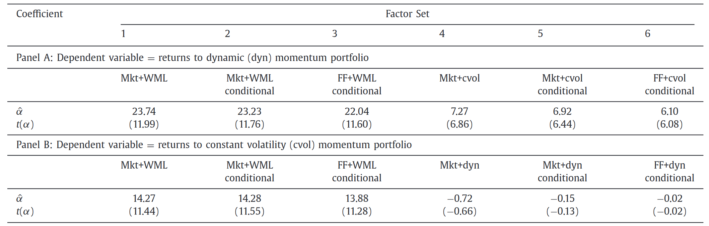

# Momentum

1. Daniel K, Moskowitz T J. Momentum crashes. *Journal of Financial economics*, 2016. 
2. Ehsani S, Linnainmaa J T. Factor momentum and the momentum factor. *The Journal of Finance*, 2022, 77(3): 1877-1919.

## Momentum crashes

Kent Daniel1,3, Tobias J. Moskowitz2,3, ***Journal of Financial economics***, 2016.

1. *Columbia Business School*
2. *Yale SOM, Yale University*
3. *National Bureau of Economic Research*

> 在 2009-03，loser portfolio 的股票包括 Citigroup，Bank of America，Ford，GM，International paper，winne portfolio 包括 defensive or counter cyclical firms such as 2.

**Five points from above**

1. While past winners have **generally outperformed** past losers, there are relatively long periods over which momentum experiences severe losses or crashes.

2. Fourteen of the 15 worst momentum returns occur when **the lagged two-year market return is negative**. All occur in months in which **the market rose contemporaneously**, often in a dramatic fashion.

3. The clustering evident makes it clear that the crashes have relatively **long duration**. They do not occur over the span of minutes or days; a crash is not a Poisson jump. They take place slowly, over the span of multiple months.

4. Similarly, the extreme losses are **clustered**. The two worst months for momentum are back-to-back.

5. Closer examination reveals that the crash performance is **mostly attributable to the short side** or the performance of losers.

|            | Past winner ret | Past loser ret |
| :--------: | :-------------: | :------------: |
| 1932.07-08 |       32%       |    **232%**    |
| 2009.03-05 |       8%        |    **163%**    |

### Time-varying beta and option like payoffs

文章是通过 $\beta$ 的变化来解释这一现象的。但是这个估计方式有所不同，作者使用 126 天的日频收益率数据，基于如下的 rolling regression model，并且对所有回归系数进行加和 $\hat{\beta}_0+\hat{\beta}_1+\cdots+\hat{\beta}_{10}.$。

$$
\begin{equation}
    \tilde{r}_{i,t}^e=\beta_0\tilde{r}_{m,t}^e+\beta_1\tilde{r}_{m,t-1}^e+\cdots+\beta_{10}\tilde{r}_{m,t-10}^e+\tilde{\epsilon}_{i,t}
\end{equation}
$$

从下图可以看出，$\beta$ 变化的十分剧烈，特别是在 after crisis。

接下来我们通过四个回归来说明这一现象。在所有回归中，因变量都是 $\tilde{R}^e_{WML,t}$，自变量包括

1. 市场超额收益率 $\tilde{R}^e_{m,t}$
2. Bear market indicator $I_{B,t-1}$。当过去两年市场超额收益率为负时为 1，其他时候为 0
3. Up-market indicator $\tilde{I}_{U,t}$，当市场超额收益率大于无风险收益率时为 1

**Regression 1**

$$
\begin{equation}
    \tilde{R}_{\mathsf{WML},t}=\alpha_0+\beta_0\tilde{R}_{m,t}+\tilde{\epsilon}_t.
\end{equation}
$$

$\hat{\beta}$ 为 -0.576，$\hat{\alpha} $ 为 1.852% per month，t 值为 7.3。

**Regression 2**

$$
\begin{equation}
    \tilde{R}_{\mathsf{WML},t}=(\alpha_0+\alpha_B I_{B,t-1})+(\beta_0+\beta_B I_{B,t-1})\tilde{R}_{m,t}+\tilde{\epsilon}_t.
\end{equation}
$$

相比于回归式 1，式 2 可以捕捉**熊市中的区别**。结果显示，在熊市中 $\beta$ 非常明显，为 −1.131，t 值高达 -13.4，并且熊市中的 $\alpha$ 也显著为负。并且，当考虑两个 $\alpha$ 相加后，$\alpha = \hat{\alpha}_0 + \hat{\alpha}_B$ is just below zero，并且不再显著，也就是说在熊市中，conditional CAPM 可以很好的解释 Momentum。

**Regression 3**

$$
\begin{equation}
    \begin{aligned}\tilde{R}_{\mathsf{WML},t}&=(\alpha_0+\alpha_B\cdot I_{B,t-1})\\&+(\beta_0+I_{B,t-1}(\beta_B+\tilde{I}_{U,t}\beta_{B,U}))\tilde{R}_{m,t}+\tilde{\epsilon}_t.\end{aligned}
\end{equation}
$$

再进一步，式 3 用来捕捉熊市后**反弹期间**动量策略的表现。$\hat{\beta}_{B,U}$ 为 -0.815，t 值为 -4.5，证明 WML 在反弹期间表现得很差。

当市场收益率为负时，WML $\beta = \hat{\beta}_0+\hat{\beta}_B$ 为 -0.742，而当市场收益率为正时，$\beta = \hat{\beta}_0+\hat{\beta}_B + \hat{\beta}_{B,U}$ 为 -1.796，这也就是说，WML acts like **shorting a call option**，而这种 optionality 主要是由于 loser portfolio 导致的。

既然说是 optionality，那么 option 的一个特性就是，当市场方差增加时，option 的价值上升。既然 WML 是 short call option，那么其收益率应该随着市场方差的增加而减少。

$$
\begin{aligned}\tilde{R}_{\mathrm{WML,t}}=& \ \gamma_0+\gamma_{\mathrm{B,t-1}}\cdot\mathrm{I}_{\mathrm{B,t-1}}+\gamma_{\sigma_m^2}\cdot\hat{\sigma}_{m,t-1}^2\\&+\gamma_{int}\cdot\mathrm{I}_{\mathrm{B}}\cdot\hat{\sigma}_{m,t-1}^2+\tilde{\epsilon}_t,\end{aligned}
$$

### Dynamic weighting of the momentum portfolio

既然已经知道了 WML 会受市场波动率影响，那么就可以对 WML 进行改进。权重 weight 设计如下

$$
\begin{equation}
    w_{t-1}^*=\left(\frac1{2\lambda}\right)\frac{\mu_{t-1}}{\sigma_{t-1}^2}
\end{equation}
$$

其中，$\mu_{t-1}\equiv\mathbb{E}_{t-1}[R_{\mathsf{WML},t}]$ 是对 $t$ 期多空 WML 组合在 $t-1$ 期的条件期望收益率，$\sigma_{t-1}^2\equiv\mathbb{E}_{t-1}[(R_{\mathrm{WML,t}}^2-\mu_{t-1})^2]$ 同理。其中 $\lambda$ 是用来控制组合无条件风险和收益率的时不变标量。

那么权重就取决于如何估计 $\mu_{t-1}$ 和 $\sigma_{t-1}^2$。对于 $\mu_{t-1}$，我们采用之前的回归式之一：

$$
\begin{equation}
    \tilde{R}_{\mathsf{WML},t}=\gamma_0+\gamma_{int}\cdot I_{\mathsf{B},t-1}\cdot\hat{\sigma}_{m,t-1}^2+\tilde{\epsilon}_t, \label{6}
\end{equation}
$$

对于 $\mu_{t-1}$ 的估计说明在熊市期间，会降低权重。

接着我们使用 GARCH model 来估计 $\sigma_{t-1}^2$，收益率序列为

$$
\begin{equation}
    R_{\mathsf{WML},t}=\mu+\epsilon_t,
\end{equation}
$$

其中，$\epsilon_t\sim\mathcal{N}\left(0,\sigma_t^2\right)$。$\sigma_{t-1}^2$ 的生成序列如下

$$
\begin{equation}
    \sigma_t^2=\omega+\beta\sigma_{t-1}^2+(\alpha+\gamma I(\epsilon_{t-1}<0))\epsilon_{t-1}^2
\end{equation}
$$

文章使用极大似然法估计 $(\mu,\omega,\alpha,\gamma,\beta)$。式（8）估计出的 $\gamma$ 是负值（-0.016，但并不十分显著），代表了当 $t-1$ 期 WML 组合收益率低于均值时，则降低下一期组合的波动会降低。

还有一项对比策略来自于 Barroso and Santa-Clara (2015)，其仅根据 **trailing volatility** 来调整权重。通过式（5）可以看出，当 WML 的夏普比率保持不变时，本文的策略表现与 Barroso and Santa-Clara 近似。

> Barroso, P., Santa-Clara, P., 2015. *Momentum has its moments*. Journal of Financial Economics 116 , 111–120.

但是这实际上是有问题的，从上文的结论可以看出，当 WML 策略收益率很低时，未来常常出现市场波动，造成 WML 收益率波动，也就意味着 WML 的收益率与预测收益率的波动性呈现出负相关，**夏普比率并非一成不变**。

我们现在有三个对比组

- classic WML strategy
- constant-volatility strategy (cvol)
- dynamic strategy (dyn)

接下来我们来看一看各项策略的表现。在对比各策略时，文章调整了权重使得各策略的波动率相同。

可以看到 dyn 相对于另外两个策略，实现了最高的夏普比率。具体来看，dyn 在各种市场情况下的表现都是很优秀的。

我们接着看一下各策略的权重变化情况。WML 始终为 1，而 cvol 在 1952-11 最高达到 2.18，在 2009-06 最低为 0.53。因为 cvol 用波动率作为权重，所以不能为负数，但是对于 dyn 来说，在 1952-11 达到最高 **5.37**，在 1938-03 实现最低 **-0.604**。也就是说 dyn 加了更多的杠杆，也会引致更多的交易成本。

#### Out-of-sample test <!-- {docsify-ignore} -->

上述的测试中涉及到了未来数据，因为对于式 ($\ref{6}$) 系数的估计使用了全样本数据。下文调整了这一估计，将系数转变为 rolling 估计，测试了样本外表现情况

$$
\begin{equation}
    \mu_{t-1}\equiv\mathbb{E}_{t-1}[\tilde{R}_{\mathsf{WML},t}]=\hat{\gamma}_{0,t-1}+\hat{\gamma}_{int,t-1}\cdot \text{I}_{\mathsf{B},\mathsf{t}-1}\cdot\hat{\sigma}_{m,t-1}^2,
\end{equation}
$$

样本外的表现与样本内非常接近。

#### Spanning test <!-- {docsify-ignore} -->

#### Data Mining?  <!-- {docsify-ignore} -->

###  Take away <!-- {docsify-ignore} -->

分析了 Mom 的走势，找出 mom crash in panic states 的原因，基于 “当过去两年市场收益率为负时 Mom 表现下滑” 改进策略，通过调整权重实现了更优的因子表现。

## Factor Momentum and the Momentum Factor

SINA EHSANI1,3, JUHANI T. LINNAINMAA2,4. *The Journal of Finance*, 2022.

1. *Northern Illinois University*
2. *Dartmouth College, NBER, and Kepos Capital*
3. *Consultant to Research Affiliates*
4. *Shareholder at Research Affiliates*

> 2022 DFA Distinguished Paper in AFA 2023

> [!NOTE|label:Momentum]
> Models without momentum cannot explain it and those with momentum cannot explain anything more than just momentum. 
> Fama E F, French K R. Dissecting anomalies with a five-factor model[J]. *The Review of Financial Studies*, 2016, 29(1): 69-103.

### Factor correlation

$$
\begin{equation}
    R_t = \alpha + \beta I(R_{t-1,t-12})
\end{equation}
$$

截距项代表当前一年（除去最近一月）收益率为负时，下一个月的平均收益率，斜率项代表 up years 和 down years 之间的平均收益率差距。

对于斜率项，除了 Momentum 自身是负的，其他所有因子都是正的，并且六个因子在 5% 水平下显著，四个因子在 10% 水平下显著。并且在 pooled regression 中，系数仍然十分显著。这体现出了因子极强的自相关性，也即因子动量。

根据这一观察，可以构建 Time-series momentum strategy：做多过去有正收益率的因子，做空过去有负收益率的因子，年化收益率达到 3.9%，t 值为 7.01。如果再构建一个 cross-sectional momentum strategy：做多过去中位数收益率以上的因子，做空过去中位数收益率以下的因子，那么收益率只有 2.4%，t 值为 5.04。

TS 收益率高于 CS 收益率是因为 TS 仅 bet on 因子收益率的自相关性，CS 还 bet on 如果一个因子收益率高，那么还意味着其他因子收益率低。

> [!NOTE|label:Time series momentum]
> Rather than focus on the relative returns of securities in the cross-section, time series momentum focuses purely on a security's own past return.
>
> Moskowitz T J, Ooi Y H, Pedersen L H. Time series momentum[J]. *Journal of financial economics*, 2012, 104(2): 228-250.

### Factor Momentum and the Covariance Structure of Returns

***Why are factors autocorrelated?***

#### Factor Momentum in Economies with Sentiment Investors <!-- {docsify-ignore} -->

本文从 KNS 的角度加以解释。

> Kozak, Serhiy, Stefan Nagel, and Shrihari Santosh, 2018, Interpreting factor models, *Journal of Finance* 73, 1183–1223.

资本市场中有两类风险厌恶的投资者，完全理性的套利者和情绪交易者（sentiment investors），套利者会捕捉套利机会而情绪交易者会偏离资产回报率的真实分布去交易。资产现金流服从 IID 分布并且现金流的协方差矩阵 has a few dominant factors。情绪交易者不能使用高额的杠杆或进行大规模的做空，而套利者会 trade against 情绪交易者。KNS 研究在什么条件下，情绪交易者会扭曲资产价格。

KNS 指出，套利者会完全捕捉情绪驱动的交易中不与因子协方差矩阵相关的部分。这是因为不与因子协方差矩阵相关则意味着没有风险暴露，而对于与因子暴露相关的情绪交易，套利者则会由于不情愿承担风险而无能为力。

KNS 的结论是，**当不存在套利机会，并且资产收益率有显著的共性成分时（commonality），SDF 才可以被表示为少数几个 dominant factors 的函数**。**这一结论并不涉及资产定价是理性定价或是由于行为偏差导致的结果**。

$$
\begin{equation}
    R_{t+1}=D_{t+1}+a_1(\xi_{t+1}-\xi_t)-R_f(a_0+a_1\xi_t),
\end{equation}
$$

$\xi_t$ 代表情绪投资者的交易需求（demand），这一需求符合 AR(1) process，$\begin{aligned}\xi_{t+1}=\mu+\phi\xi_t+\nu_{t+1}\end{aligned},\ \text{var}(\nu_{t+1})=\omega^2$，那么资产收益率的协方差为

$$
\begin{equation}
    \begin{aligned}
\operatorname{cov}(R_t,R_{t+1})& =a_1a_1^{\prime}\text{cov}(\xi_t-R_f\xi_{t-1},\xi_{t+1}-R_f\xi_t)  \\
&=a_1a_1^{\prime}\sigma^2\biggl[(1+R_f^2)\boldsymbol{\phi}-R_f-R_f\boldsymbol{\phi}^2\biggr],
\end{aligned}
\end{equation}
$$

资产现金流的协方差矩阵进行特征值分解有 $\Gamma=Q\Lambda Q^T $，用 $q_k$ 表示 $k^{th}$ 个 PC factor，那么**因子的自相关性**为

$$
\begin{equation}
\begin{aligned}
\mathbf{cov}(PC_t^k,PC_{t+1}^k)& =\text{cov}(q_k^{\prime}R_t,q_k^{\prime}R_{t+1})=q_k^{\prime}\text{cov}(R_t,R_{t+1})q_k  \\
&=q_k^{\prime}a_1a_1^{\prime}q_k\sigma^2{\left[(1+R_f^2)\phi-R_f-R_f\phi^2\right]} \\
&=q_k^{\prime}\Gamma\delta\delta^{\prime}\Gamma q_kc_0\sigma^2\biggl[(1+R_f^2)\phi-R_f-R_f\phi^2\biggr].
\end{aligned} 
\end{equation}
$$

在 KNS 的假设中，**情绪投资者交易需求会朝着方向 $\delta $ 扭曲资产价格 $\xi_t$** ，并且 $\delta$ 可以表示为 PC factors 的线性组合 $\delta = Q\beta$，因此上式变换为

$$
\begin{equation}
    \mathrm{cov}(PC_t^k,PC_{t+1}^k)=\lambda_k^2\beta_k^2c_0\sigma^2\biggl[(1+R_f^2)\phi-R_f-R_f\phi^2\biggr].
\end{equation}
$$

这一公式就足够回答我们的问题，why and when are the factors autocorrelated。这一方程有两个根，$\phi = \frac{1}{R_f} \text{ and } \phi = R_f $。因此，当 Sentiment 非常持续时，$\phi \in (\frac{1}{R_f},1]$，就意味着 PC factor 呈现出自相关。

根据这一结论，还可以说明：**与 $\delta$ 相关并且特征值越高的因子，动量也就越显著**。这一结论与 KNS 中的论断相符：the sentiment-driven demand component $\delta$ has a large impact on SDF variance only when $\delta$ lines up “primarily with the high-eigenvalue (volatile) PCs of asset returns”。

#### High-Variance PCs and Factor Momentum <!-- {docsify-ignore} -->

上述是理论推导，我们看一下与实证情况是否相符。Empirical strategy 如下：

1. Compute eigenvectors using **daily returns** on the 47 factors from July 1973 through the end of month $t$ from the correlation matrix of factor returns.
2. Compute **monthly returns** for the PC factors up to month $t+1$ using these eigenvectors. PC factor $f$'s return is $\begin{aligned}r_{f,t}^{pc}=\sum_{j=1}^{47}v_j^fr_{j,t}\end{aligned}$, where $v_j^f$ is the $j^{th}$ element of the $f^{th}$ eigenvector and $r_{j,t}$ is the return on individual factor $j$.
3. Compute individual factors’ variances using data up to month $t$. **Demean** and **lever** the PC factors so that their variances up to month $t$ are equal to the variance of the average individual factor and their average returns up to month $t$ are zero.
4. Construct a factor momentum strategy that is long factors with positive average returns from month **$t-11$** to $t$ and short factors with negative average returns.
5. Compute the return on the resulting factor momentum strategy in month $t+1$.

Panel B 的 first half $\alpha$ 和 Panel C 的极为接近的 $t$ 值都说明了 all sets of PC factors display momentum in a synchronized way: they all tend to be profitable or unprofitable at the same time。尽管 first 10 PC 有最显著的表现，但是其他因子同样包含了其无法解释的部分。这与 KNS 中的结论相悖：a small number of low-order PC factors does well in explaining the expected returns on anomaly portfolios.

对于 the decay of alpha，一种可能的解释是套利行为导致的。前文提到过，只有当不存在套利机会时，SDF 才能表达为少部分因子的函数。The first half period 是从 1973-07 至 1996-09，the second half 是从 1996-10 至 2019-12。随着人们越来越熟悉动量，关于动量的套利机会也越来越少，最终其他几个动量 PC 与 factors covariance 无关的套利部分就都消失了。在与 factor covariance 相关的部分中，PC 1-10 足以解释其他所有的动量成分。

最终，实证结果与理论结果相符。

### Factor Momentum and Individual Stock Momentum

#### Transmission of Factor Momentum into the Cross Section of Stock Returns <!-- {docsify-ignore} -->

如果股票收益背后存在因子结构，那么因子动量最终会在截面上体现为股票动量。假设股票的超额收益率符合以下因子结构

$$
\begin{equation}
    R_{i,t}=\sum_{f=1}^F\beta_i^fr_t^f+\varepsilon_{i,t},
\end{equation}
$$

那么截面动量策略的回报为

$$
\begin{equation}
    \mathrm{E}[\pi_{i,t}^{\mathrm{mom}}]=\mathrm{E}\Bigl[(R_{i,-t}-\bar{R}_{-t})(R_{i,t}-\bar{R}_t)\Bigr],
\end{equation}
$$

带入最终解得

$$
\begin{equation}
\begin{aligned}
\mathrm{E}[\pi_t^\text{mom}]& =\underbrace{\sum_{f=1}^F\left[\operatorname{cov}(r_{-t}^f,r_t^f)\sigma_{\beta^f}^2\right]}_{\text{factor autocovariances}}+\underbrace{\sum_{f=1}^F\sum_{g\neq f}^F\left[\operatorname{cov}(r_{-t}^f,r_t^g)\operatorname{cov}(\beta^f,\beta^g)\right]}_{\text{factor cross-serial covariances}}  \\
&+\underbrace{\frac1N\sum_{i=1}^{N}\left[\mathrm{cov}(\varepsilon_{i,-t},\varepsilon_{i,t})\right]}_{\text{autocovariances in residuals}}+ \underbrace{\sigma^2_\eta}_{\substack{\text{variation in} \\ \text{mean returns}}}
\end{aligned}
\end{equation}
$$

这一公式告诉我们动量因子的盈利主要来源于四个部分

1. 因子的自相关性，且因子系数 $\beta$ 和因子数量会影响这一项。
2. Lead-lag return relationships between factors，且因子数量和系数之间的相关性会影响这一项。
3. Firm-specific returns 的自相关性
4. 截面上股票收益率均值的方差。

#### Pricing Momentum-Sorted Portfolios with Equity Momentum and Factor Momentum  <!-- {docsify-ignore} -->

可以看到因子动量的确很大程度上解释了动量因子。

#### Alternative Momentum Factors: Spanning Tests  <!-- {docsify-ignore} -->

因子动量比动量因子包含了更多的信息。

#### Do Firm-Specific Returns Display Momentum? <!-- {docsify-ignore} -->

如果模型中已经包含了所有的因子，那么残差项就应该作为一个随机扰动项，不呈现出任何的持续性。而实际上，基于各种定价模型的残差而产生的残差动量十分显著，本文说明了这是由于遗漏变量造成的。

本文进行了一个 simulation，资产收益率是由十个因子 generate 出来的，分为两种情况，

1. 所有因子自相关性相似，同时对于资产的解释也相似
2. 第一个因子解释资产的能力是其他因子的五倍，但是在时序上是不相关的（**市场因子**），其他九个因子符合情况1

> *This strategy continues to be hurt by including the market factor.*

Actual data

### Momentum vis-à-vis Other Factors

Momentum 一直以来被认为是与其他因子相关性很低的因子，使用 1963-07 至 2019-12 月频数据将 UMD 回归到 FF5 上，adjusted $R^2$ 只有 9%。这使得 UMD 看起来像是一个与众不同的风险因子。但实际上，**unconditional correlation** 大大低估了 UMD 和其他因子之间的相关性。

以 size factor 为例，如果 size factor 表现得好，那就意味着小盘股的表现优于大盘股，因此 UMD 也会做多小盘股而做空大盘股，这样在下一期 SMB 和 UMD 就会呈现出正相关。反之，如果 SMB 表现得不好，那么下一期 SMB 就会和 UMD 呈现出负相关。这一机制适用于所有因子。

除了 reversal 因子，在前一年因子收益率为正时，所有因子都与 UMD 正相关，当前一年因子收益率为负时，结果同样十分显著。因此，尽管 unconditional correlation 接近零使得 UMD 看起来与其他因子并不相关，但实际上 **momentum relate to all factors**。

> Reversal 因子换手率接近 100%，因此上一期的持仓与下一期的持仓并没有什么关系。

#### Momentum in Momentum-Neutral Factors <!-- {docsify-ignore} -->

此处还有一个疑问，是不是由于动量因子（个股动量）的存在，才导致了因子动量呢？还是以 Size 为例，如果小盘股的表现优于大盘股，并且由于个股动量的存在，使得小盘股在下一期的表现仍然优于大盘股，这就会显示出因子动量的效果。

尽管我们在之前已经说明了因子动量可以完全解释个股动量，而反过来则不成立，这里仍然可以通过另一个角度来说明问题：**当控制了个股动量之后，还有多少因子动量存在**？

为此，我们构建 Momentum-neutral factors，使得因子收益率与过去的股票收益率完全没有关系。

$$
\begin{equation}
    \min_{x_i}\sum_i(w_i-x_i)^2\quad\mathrm{s.t.~}\sum_{i=1}^Nx_i=0\quad\mathrm{and~}\quad\sum_{i=1}^Nx_ir_{i,t-12,t-2}=0.
\end{equation}
$$

目标函数代表尽可能少得修改原权重，第一个 constraint 代表新的权重仍然是多空组合，第二个 constraint 代表与过去的收益率无关。

结果显示，neutral 过后结果反而提升了，更加论证了个股动量不是产生因子动量的原因。

### Take away <!-- {docsify-ignore} -->
 
动量因子的真正来源是因子动量，并且动量并非独特的因子。

