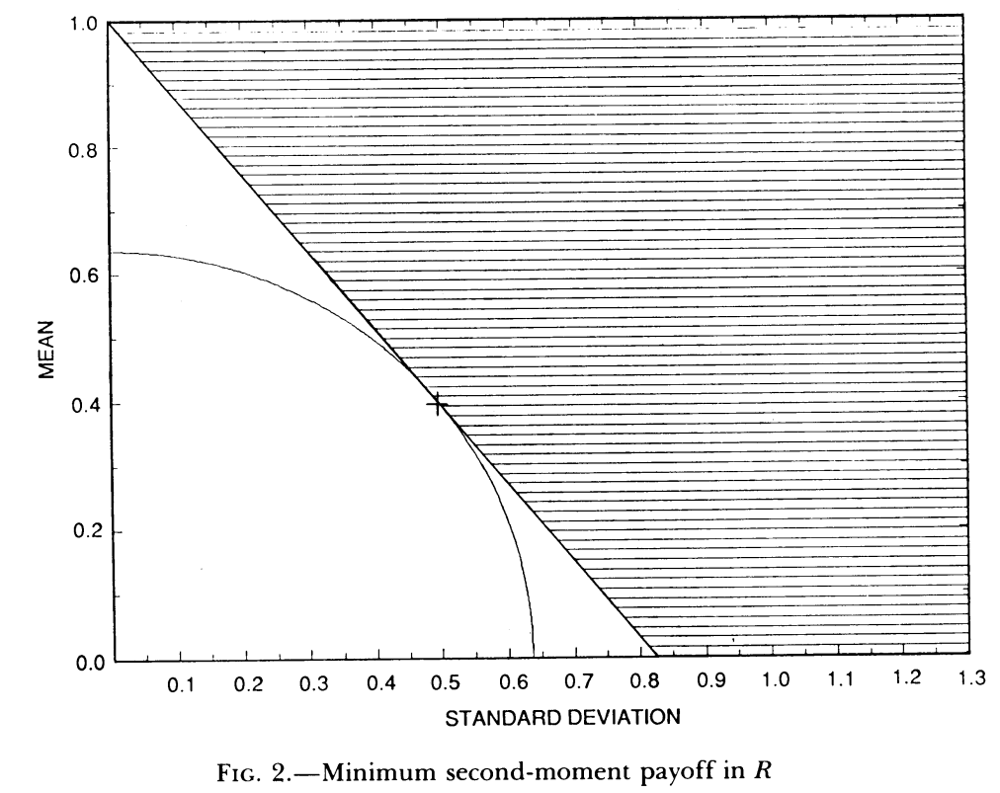
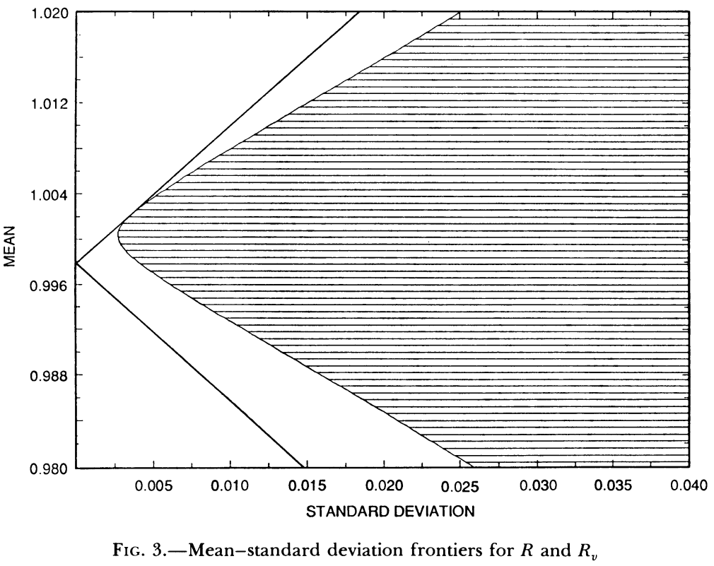
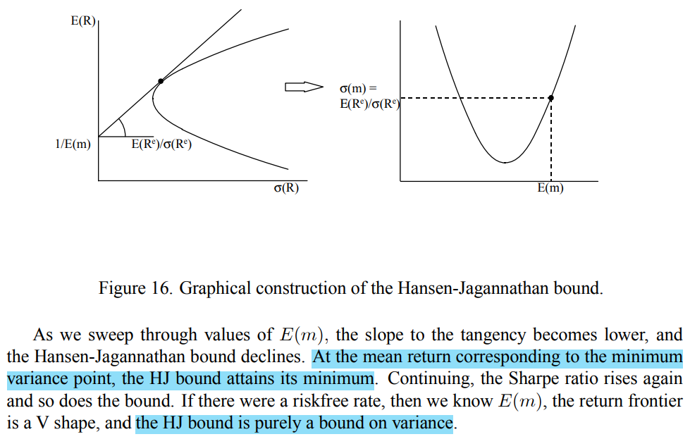

# Implications of security market data for models of dynamic economies
Hansen, Lars Peter1, and Ravi Jagannathan2, ***Journal of Political Economy***, 1991.

1. *University of Chicago, National Bureau of Economic Research*
2. *University of Minnesota and Federal Reserve Bank of Minneapolis*

In a rich class of models of dynamic economies，这些模型可能因为消费者偏好的异质性、由 tradable security 张成的 payoff 空间、或是 the role of money in the acquisition of consumption goods 不同而不同，但是**这些模型有一个共同的 implication**，any traded security can be represented as the expectation (conditioned on current information) of the product of the payoff and a SDF of any consumer。因此，**价格信息实际上隐含了关于 SDF 的性质**。

如果是从完备市场中得到的资产价格数据，那么通过 Arrow-Debreu 证券就可以得到 SDF。然而，首先，目前的金融市场很可能是不完备的，其次，经济学家也往往倾向于使用一部分的数据而非全部市场的数据进行分析。由于这些限制，*asset market data alone are typically not sufficient to identify IMRSs*.

在之前最常见的识别 SDF 方法是基于经济学家的观察，通过特定的方程表达出有关 SDF 的关系【habit model，recursive utility】。这些方法对各类资产定价模型施加了很强的假设【例如消费模型，效用函数】，通过选取特定的参数【如风险厌恶系数】来测试模型是否符合数据。

而本文对于各类资产定价模型施加尽可能少的限制，只保留了一价定律【law of one price: portfolios with the same payoffs have the same price】以及无套利原理【the absence of arbitrage opportunities: non-negative payoffs that are positive with positive probability have positive price】。

尽管我们不能完全观测到 SDF，但是仍然可以从数据中得到有关 SDF 的信息。

当 SDF 为常数，对于任意两个资产，如果他们的价格相同，那么其 payoff 的均值也一定相同。

$$
\text{If m is constant} \quad p = E[mx] = m E[x]
$$

而当两个资产价格相同，而 payoff 均值不同，则说明 SDF 一定不为常数。通过这一点，就可以得到 SDF volatility的lower bound。

本文提出的lower bound，可以作为资产定价模型【*无论是否为parametric*】的 diagnostic，并且这种方法可以让我们看出 which asset market data 对 SDF 提出了最严格的限制以及对资产定价模型提出最有意义的implications。

> [!NOTE|label:Volatility bound]
> SDF 的 Volatility bound 最早由 Shiller (1982) 提出，其目标是想为一类对数据不敏感的资产定价模型提出一个 diagnostic【即通过calibration不能验证模型的正确性】。但是在 Shiller (1982) 的例子中只包括两类资产，而本文并没有这一限制，并且即使在两类资产的情况下， Shiller (1982) 所得到的 volatility implication 也弱于本文。
>
> Grossman S J, Shiller R J. Consumption correlatedness and risk measurement in economies with non-traded assets and heterogeneous information[J]. ***Journal of Financial Economics***, 1982, 10(2): 195-210.

尽管同为得到 Volatility bound，但本文的出发点与 Shiller (1982) 不同.

1. 目前文献中关于SDF的研究，常用的是（如上文所说）给定某一函数形式的参数化方法，而本文提出的**非参数化方法**给这一领域提供了有益补充。例如，为什么某些模型会被统计检验拒绝？是因为参数化方法限制了 SDF 的variability吗？

2. 本文的所提出的diagnostic适用范围非常广泛，无论是通过观察数据得出 SDF 性质的参数化方法还是通过随机分析方法得出的结论。

3. 通过本文的方法，还可以得到是哪一类资产数据对 SDF 提出了最 stringent 的限制，进而对 dynamic economic model 提出了最 startling 的结论。此方法使得我们在进行此类对比时不必拘泥于特定的模型。

整体看来，本文的方法最大的特点就是通用（**common**）。

通过下图，可以更加清晰地阐述这些点：

该图通过 1891-1985 股票和债券的年数据得到了一个 restricted region for the mean and standard deviations of SDF。 阴影部分区域给出了关于 SDF 均值和标准差的admissible pairs。【admissible: **allowed to be used**】

作为对比，这里还列出了 representative consumer model with commonly used period utility functions 所得到的 SDF 形式，其数值在图中用方块表示：

$$
U(c) = {c^{\gamma+1}-1 \over \gamma + 1} \quad \gamma \text{ is negative}
$$

小方块标准差不断升高的过程也代表了 $\gamma$ 在不断提高，并且标准差和均值之间的关系并不是一成不变的，可以看到随着标准差不断提高，其 SDF 的均值先下降后提高。

在 Section III 中，不考虑 SDF 需要为正数，因此，最小方差随机变量是资产payoff的线性组合。并且，SDF 的均值标准差前沿与资产 payoff 的均值方差前沿之间具有**对偶性**。这也实际上在说，通过 payoff 的前沿就足以构造出 SDF 前沿。因此，通过因子模型构造出 payoff 前沿也就意味着可以通过因子模型构造出 SDF 前沿。

在 Section IV 中，设定 SDF 为正数。此时最小方差组合不再需要是资产 payoff 的线性组合，而是这些payoff的欧式看跌看涨期权【**非线性**】。与 Section III 不同的是，此时对于某些预先给定的 SDF 均值，可能并不存在 nonnegative random variables with finite second moments that **behave like SDF**。尽管这一限制会使得 volatility bound more restrictive (thus more informative)，these sharper bounds are harder to compute。

对于任意预先给定的 SDF 均值，都能找到一个最小方差，因此构造了 SDF 的均值方差前沿。并且作者还发现了该均值方差前沿与我们熟悉的资产回报的均值方差前沿之间的**对偶性**。

## A General Model of Asset Pricing

$ \pi_I(p) $ 是在未来第 $\tau$ 期payoff为 p 的资产在第 0 期的价格， $mu_0^j,mu_{\tau}^j $ 分别是在零期和 $\tau$ 期的边际消费效用，$I^j$ 为第0期的information set，因此均衡为：

$$
\begin{equation}
mu_0^j \pi_I(p) =  E[mu_{\tau}^j p |I^j] \quad \text{for all p in P}
\end{equation}
$$

按照经济学理论，尽管边际效用不断递减，但应该始终为正【consumer is not satiated】，两侧同时除 $mu_0^j$，令 $m_j = mu_{\tau}^j / mu_0^j $，可以得到：
    
$$
\begin{equation}
mu_0^j \pi_I(p) =  E[m^j p |I^j] \quad \text{for all p in P}
\end{equation}
$$

当世界上信息完全公开，并且为完备市场时，所有消费者的 SDF 均相等。在这样的条件下，当 P 足够多，则可以确定**唯一的 SDF**。

接下来从这一公式入手，分析 m 的关系。

$$\begin{equation}
\bm{q} = E(\bm{x}m/I)
\end{equation}
$$

如果想要从实证角度研究这一公式中 m 的关系，必须要想办法得到关于 payoff，price，以及 information set 的数据。如同 Hansen and Richard (1987) 中的做法，本文 imagine an environment，在这个环境中始终满足该公式。通常来说我们认为经济学家能够获得关于 $\bm{x}_t, \bm{q}_t $ 的数据，并且 $\{ m_t,\ \bm{x}_t,\ \bm{q}_t\} $ 满足大数定律，即当样本规模极大时，样本矩趋于总体矩。

尽管资产价格在资产 payoff 实现的 $\tau$ 期之前就已经确定了，但是我们还是将价格序列 $\bm{q}_t$ 建模为 stochastic process，用以捕捉资产价格中可能出现的扰动。

此外，我们使用**无条件期望**来代表样本矩时间序列均值的 limit point。

> [!NOTE|label: Unconditonal expectations]
> When the time series converges appropriately to a stochastic steady state and is ergodic, unconditional expectations are computed using the stationary distribution.
>
> For processes that are asymptotically stationary but not ergodic, the limit points can be represented as conditional expectations in which the conditioning occurs on the invariant sets for the approxiamting stationary stochastic process.

对于该模拟环境中的序列 $\{ m_t,\ \bm{x}_t,\ \bm{q}_t\} $，我们做出以下假设：

#### Assumption 1 <!-- {docsify-ignore} -->

$ E|m|^2 < \infty,\ E|\bm{x}|^2 < \infty,\ E\bm{x}\bm{x}' \text{ is nonsingular, and } E|\bm{q}|<\infty$

Nonsingular的假设用以防止 $\bm{x}$ 是线性相关的情况，并且这也保证了**一价定律**成立。而对于 $\bm{x},\ \bm{q}$ 来说，即使原本的资产向量不满足这两个 moment restriction，但是也可以通过放缩使得其成立【因为价格和payoff在等式左右两侧】。 

而在该假设基础上应用 the law of iterated expectiations，消除条件信息，就得到了以下restriction：

**Restriction 1.** $E\bm{q} = E\bm{x}m $

Restriction 1将原本的定价模型从 conditional 转变为了 unconditional，因为通常来说 unconditional 比 conditional 更好估计。但是 in general，unconditional 的限制条件弱于 conditional。

**Restriction 2.** $ m > 0 $

Restriction 2 是无套利的充分条件。

### Implications of Restriction 1

Riskless Payoff

存在无风险资产和不存在无风险资产是两种情况，前者比较容易分析，先从此处入手。

> 存在无风险资产就意味着**所有 SDF 均值相等**。

无风险资产在未来的 payoff 为1，且概率为1。首先构建一个未来 payoff 空间中的随机变量 $m^* = \bm{x}\bm{\alpha}_0$，因此 Restriction 1可以写作：

$$\begin{equation}
E \bm{x}\bm{x}'\bm{\alpha}_0 = E\bm{q}
\end{equation}$$

解得 $\bm{\alpha}_0 = (E \bm{x}\bm{x}')^{-1}E\bm{q}$。此时 $\bm{\alpha}_0$ 只依赖于 payoff 的二阶矩和 pirce 的一阶矩，也就意味着可以通过 asset market data 计算得出。

对于任意另一个满足 Restriction 1的随机变量 m，因为此时存在无风险资产，因此未来 payoff x 为1，此时所有 m 均值相同：
$$
Em = Em*
$$

因此有：
$$
E[\bm{x}(m-m^*)] = 0
$$

这也意味着 $m$ 与 $m^*$ 二者之差与随机向量 $\bm{x}$ **正交**，因为 $m^*$ 在 payoff 空间 P 中，因此可以理解为：$m^*$ 是 $m$ 向 P 的**最小二乘投影**，并且有：

$$
\sigma^2(m) = \sigma^2(m^*) + \sigma^2(m-m^*)
$$

因此推得：

$$
\sigma(m) \geq \sigma(m^*), \quad Em^* = Em
$$

此时 m 也满足 Restriction 1，因此也具备定价能力，这一公式给出的是：**在满足定价能力的前提下的最小 SDF 方差**。 

No Riskless Payoff

在不存在无风险资产的情况下，可以通过构造无风险资产的方式**沿用上述分析**。

如果 payoff 空间中不存在无风险资产，代表现有 payoff 不足以张成无风险资产。此时增广（augment）原有 payoff 空间，即自行添加无风险资产，原本 payoff $x$ 变为 $x^a$。

构造无风险资产后，还需设定其 price。设其价格为 v，有：

$$\begin{equation}
E\bm{x}m_v = E\bm{q},\quad Em_v = v
\end{equation}$$

同样地，有：

$$
\begin{equation}
    \sigma(m) \geq \sigma(m_v)
\end{equation}
$$

此时由于不确定 v 的具体数值，所以需要对于每一个 v 进行**遍历**，构造出同样数量的 $\sigma(m_v)$，因此，**不同于存在无风险资产下的状态只有一个点**【均值为无风险资产当前价格】，**此时存在一个 SDF 均值标准差前沿**。

存在无风险资产时，解出了 $\alpha_0$ 也就得到了 $m^*$ 的表达式，在不存在无风险资产时，仍需要给出 $\sigma(m_v)$ 的表达式：

x 与 $m_v$ 的协方差可以写为：
$$
\begin{equation}
E[(\mathbf{x}-E\mathbf{x})(m_v-v)]=E\mathbf{q}-vE\mathbf{x}.
\end{equation}
$$

因为 $Em_v = v$ 且 $m_v$ 是 payoff 空间的线性组合，因此**设定**（postulate） $m_v$ 结构如下：

$$
\begin{equation}
    m_v = (\bm{x}-E\bm{x})'\beta_v+v
\end{equation}
$$

由于 $m_v$ 满足 Restriction 1，因此代入解得：

$$
\beta_v = \Sigma^{-1}(E\bm{q}-vE\bm{x})
$$

其中 $\Sigma$ 是 x 的协方差矩阵，进一步解得：

$$
\begin{equation}
\boldsymbol{\sigma}(m_v)=[(E\mathbf{q}-vE\mathbf{x})'\boldsymbol{\Sigma}^{-1}(E\mathbf{q}-vE\mathbf{x})]^{1/2}. \label{7}
\end{equation}
$$

该公式说明了：**只要给定 v，能根据 $\bm{q} \text{ and } \bm{x}$ 的均值和 $\bm{x}$ 的协方差矩阵计算出对应的最小方差。**

> [!TIP|推导]
$$
\begin{aligned}
\boldsymbol{\sigma}^2(m_v)=& (m_v - Em_v)'(m_v - Em_v) \\
=& \beta_v'(\bm{x} - E\bm{x}) (\bm{x} - E\bm{x})'\beta_v  \\
=& \beta_v' \Sigma \beta_v \\
=& (E\mathbf{q}-vE\mathbf{x})' \Sigma^{-1} \Sigma \Sigma^{-1} (E\mathbf{q}-vE\mathbf{x}) \\
=& [(E\mathbf{q}-vE\mathbf{x})'\boldsymbol{\Sigma}^{-1}(E\mathbf{q}-vE\mathbf{x})]
\end{aligned}
$$
> 

***Interpretation***

这一部分解释了**真实价格偏离风险中性价格的意义**。

在风险中性的框架中，SDF $m_v$ 始终为常数 v，因此 restriction 1 变为：

$$
E\bm{q}_f = vE\bm{x}
$$

因此，在式（7）中，当给定协方差时，$(E\mathbf{q}-vE\mathbf{x}) = (E\mathbf{q}-E\mathbf{q}_f)$ ，即真实价格与风险中性价格的偏离越大，也意味着 SDF 的波动性下界越大。

Relation to Empirical Models of Asset Prices

在本节同样需要分为是否存在无风险资产的情况：

### Unit payoff <!-- {docsify-ignore} -->

此时需要定义一个空间和两个 payoff。

定义一个当前价格为1的payoff空间，$\pi$ 代表未来 payoff 在当前的价格：

$$
\begin{equation}
R\equiv\{p\ln P\colon\pi(p)=1\}.
\end{equation}
$$

定义两个特殊的 payoff：

1. **Unit payoff**

未来 payoff 为1且当前时刻价格不为0，则其收益率为 $1/\pi(1)$

2. **SDF payoff**

因为 SDF $m^*$ 本身也是一个 payoff，故可得其收益率为 $r^* = m^*/\pi(m^*)$，又跟据定价公式有 $\pi(m^*) = E[(m^*)^2] $，因此：

$$
\begin{equation}
E(r^*)^2 = {1 \over E(m^*)^2} 
\end{equation}
$$

二者都在定义的 R 空间内【单位 payoff 需要通过**放缩**】。并且，Hansen and Richard (1987) 指出，$r^*$ 在 R 空间内拥有**最小的二阶矩**。

根据：

$$\begin{equation}
E(r^2) = \sigma^2(r)+(Er)^2
\end{equation}$$

因此，$r^*$ 可以理解为是以下最优化问题的解，当 $\mu = Er^*$ 时：
$$
\underset{r\in R}{\text{minimize}} \ \sigma(r)\quad\text{subject to }Er=\mu
$$

通过这一步，SDF 和收益率之间就建立了**初步的联系**。

根据式（9），有：
$$
\begin{aligned}
\sigma(m^*) &= \sigma(r^*)E(m^*)^2 \\
Er^* &= {Em^*\over E(m^*)^2}
\end{aligned}
$$

因此有：

$$
\begin{equation}
\frac{\sigma(m)}{Em}\geq\frac{\sigma(m^*)}{Em^*}=\frac{\sigma(r^*)E(m^*)^2}{Em^*}=\frac{\sigma(r^*)}{Er^*}
\end{equation}
$$

> [!TIP|label:推导]
$$\begin{aligned}
r^* &= {m^* \over E(m^*)^2} \\
r^*r^* &= {m^*r^* \over E(m^*)^2} \\
E(r^*)^2 &= {1 \over E(m^*)^2} 
\end{aligned}
$$
> 因此，原式有：
$$
r^* = {m^* \over E(m^*)^2} \ \Rightarrow \ m^* = {r^* \over E(r^*)^2}
$$
> 

因为此时存在 unit payoff，因此 mean-variance frontier 是直线而非双曲线。而如果 $r^*$ 想要满足**在 R 空间中**二阶矩最小，其必须与 mean-variance frontier 相切，如下图：

从纵轴无风险资产点 $[0,{1/ \pi(1)}]$ 到 $[\sigma(r^*),Er^*]$ 的斜率为 $\{Er^*-[1/\pi(1)]\}/\sigma(r^*)$，而过原点的圆在 $[\sigma(r^*),Er^*]$ 的切线斜率为 $-\sigma(r^*)/Er^*$，联立可得：

$$
\begin{equation}
\frac{\sigma(r^*)}{Er^*}=\frac{[1/\pi(1)]-Er^*}{\sigma(r^*)}
\end{equation}
$$

根据式（11），可得：
$$
\frac{\sigma(m)}{Em} \geq \frac{[1/\pi(1)]-Er^*}{\sigma(r^*)}
$$

即：**存在无风险资产的情况下，$\sigma(m)/Em$ 的下界即是 mean-variance frontier 的夏普比率。**

### Without Unit payoff <!-- {docsify-ignore} -->

在不存在 Unit payoff 时，沿用同样的方法，通过构造 Unit payoff 来增广原本的payoff空间，并记其价格为 v，此时类似于存在 Unit payoff 时，同样可以定义两个特殊的 payoff：

1. **Unit payoff** 其收益率为 $1/v$

2. **SDF payoff** $r^*_v$ 在增广后的 payoff 空间内拥有最小的二阶矩。

沿用完全一样的分析思路，可以画出增广后的前沿以及对应的最小二阶矩 $r^*_v$。

$$
\begin{equation}
\frac{\sigma(m)}{Em}\geq\frac{\sigma(m^*_v)}{Em_v^*}=\frac{\sigma(r^*_v)}{Er_v^*}=\frac{[1/v]-Er_v^*}{\sigma(r^*_v)}
\end{equation}
$$

可以看到，$v$ 越低，夏普比率越高，进而 lower bound 也就越高。

#### Duality  <!-- {docsify-ignore} -->

当存在无风险资产时，对于 SDF frontier 来说不存在前沿【因为此时 $Em$ 只有一个点】。而当不存在无风险资产时，就需要遍历所有的 $Em$，因此就存在 SDF frontier，因而有了**对偶性**。

对于无风险资产对应的每一个前沿，都可以**在 R 空间内**【即均值方差前沿上】找到 $r^*_v$，同时，根据两基金分离定理可知：$r^*_v$ 可由无风险资产收益率和任一前沿收益率的线性组合表示。而只要 $1/v$ 不等于最小方差组合收益率【渐近线，无切点】，就总能找到一个 $r_v$ 表示出 $r^*_v$。这就是二者的对偶性。

找到了 $r^*_v$，也就相当于找到了 $m^*_v$，因此，总得来说就是，对于每一个 $v$，$m^*_v$ 都可由无风险资产收益率和任一前沿收益率的线性组合表示。

从 Cochrane 的表述中能够更加直观的看到二者的对偶性：

#### Factor analysis  <!-- {docsify-ignore} -->

尽管 $m^*_v$ 可由无风险资产收益率和任一前沿收益率的线性组合表示，但是大多数资产定价模型并没有告诉我们，什么样的组合才是 mean-variance efficient，say the returns on the wealth portfolios of consumers。

> *Thus, without additional restrictions, there is no guidence on how to reduce, a priori, a potentially large collection of portfolios payoffs into a small collection used in a time-series analysis.*

factor analysis 是常用的降维方法。

假设未来的 payoff 可由 a vector of common factors 张成：
$$
\begin{equation}
p_j = \bm{\gamma}_j \bm{f}+e_j
\end{equation}
$$

因此，根据一价定律，有：

$$\begin{equation}
\pi(p_j) = \bm{\gamma}_j \bm{\pi(f)}
\end{equation}
$$

Factor analysis 通常的做法是，通过 $\{p_j\}$ 计算出这些因子的一二阶矩，以及当前的价格 $\bm{\pi_f}$，进而通过式 $\eqref{7}$ 得到 SDF 的 volatility region。

从原本的 payoff 空间中缩小到因子张成的较小的空间 F 这个过程中通常会带来信息的损失，只有当选择的因子足够“正确”，才能认为上述公式是成立的。

## Implications of Restriction 2

> 本节并不直接测试 Restriction 2，而是先弱化这一限制，令 SDF 非负，再进一步测试令 SDF 严格大于0能否加强（sharpen）由非负得到的 bound。

结果显示 SDF 可被表示为 payoff 空间中的看跌或看涨期权。之所以说是期权的组合，因为期权完全是 non-negative 的。

本节同样分为三个部分，（1）存在无风险资产，（2）不存在无风险，（3）与现有文献的联系

### Unit payoff <!-- {docsify-ignore} -->

对于每一个 payoff p，定义 $p^+ = \text{max}\{p,0\}$。当所有 payoff 均为正时，问题转化为：

$$
\begin{equation}
E[\bm{x}(\bm{x}'\bm{\alpha}_0)^+] = E\bm{q} \label{16}
\end{equation}
$$

其中，$\tilde{m} = (\bm{x}'\bm{\alpha}_0)^+$。

接下来要证明的是：当 $\tilde{m}$ 存在时，在所有非负的 $m$ 中，其拥有最小的方差。

对于非负的 $\tilde{m}$ 和 $m$ 来说，二者均满足 Restriction 1，因此 $E\bm{x}m=E\bm{x}\tilde{m}$，且根据 $m$ 的非负性有：

$$
\begin{equation}
E\tilde{m}m \geq \bm{\alpha}_0'E\bm{x}m=\bm{\alpha}_0'E\bm{x}\tilde{m}=E[(\tilde{m})^2]
\end{equation}
$$

其中最后一个等式是由于：当 $\bm{x}'\bm{\alpha}_0 < 0$ 时，$\tilde{m}=0$。其次，根据 *Cauchy-Schwarz inequality*：

$$\begin{aligned}
\sqrt{E(m)^2E(\tilde{m})^2} & \geq E\tilde{m} m \geq E(\tilde{m})^2 \\
\Rightarrow \ E(m)^2 & \geq E(\tilde{m})^2
\end{aligned}
$$

又因为此时存在 Unit payoff，因此 $Em=E\tilde{m}$，此时有了一阶矩和二阶矩的信息，进一步可以得出**非负 SDF 的方差关系**：

$$
\begin{equation}
\sigma(m) \geq \sigma(\tilde{m}) \label{18}
\end{equation}
$$

在所有非负的 SDF 中，我们证明了 $\tilde{m}$ 是其下界，接下来证明在所有严格为正的 $m$ 中，$\tilde{m}$ 同样是其下界。

对于同样满足 Restriction 1 的**非负** $\tilde{m}$ 和**严格为正** $m$，通过式（17）同样可以得到如下不等式关系：

$$
0<E[m-\tilde{m}]^2=E(m)^2-2E\tilde{m}m+E(\tilde{m})^2 \le E(m)^2-E(\tilde{m})^2
$$

因此，式 $\eqref{18}$ 中的 weak inequality 转变为 strong inequality，除此之外，已经没办法更加sharp。因此，**无论是对于非负 SDF 或是严格为正 SDF，非负 $\tilde{m}$ 都是其下界**。

构造一个严格为正的 $m_j$，当 $j=1$，$m_j = m$ 严格为正，当 $j=\infty$，$m_j = \tilde{m}$ 趋近于非负。

$$\begin{equation}
m_j=\bigg(1-\frac{1}{j}\bigg)\tilde{m}+\bigg(\frac{1}{j}\bigg)m
\end{equation}
$$

对式（19）两侧同时求方差，易知当 $j=\infty$ 时，$\sigma(m_j) \text{ converge to } \sigma(\tilde{m})$。该式用以说明的是：$m_j$ **从非负到严格为正的过程中，并没有改变下界，不过只要有一丝严格为正的成分，就取不到下界 $\sigma(\tilde{m})$。**

接着我们讨论关于式 $\eqref{16}$ 解的存在性。

式（16）本身是非线性的，$\bm{\alpha}_0$ 的解不能通过矩阵形式表达出来。因此将问题转化为更加容易计算的最优化问题，*在 payoff 空间 R 中找到收益率非负部分（truncation）最小的二阶矩*：

$$
\begin{equation}
\underset{\text{r in R}}{\text{min}} \ E(r^+)^2 \label{20}
\end{equation}
$$

在 Appendix A 中证明了式 $\eqref{20}$ 存在解，尽管可能不是唯一解。此外，对于 $\tilde{r}$ 是式（24）解的充分必要条件是：

$$
\begin{equation}
E(\tilde{r}^+z)=0 \text{  for all } z \text{ in } P \text{ such that } \bm{\pi}(z) = 0 \label{21}
\end{equation}
$$

式 $\eqref{20}$ 的解可以通过放缩 $\tilde{r}^+$ 来实现：

$$
\begin{equation}
\tilde{m}=\frac{\tilde{r}^+}{E(\tilde{r}^+)^2} \label{22}
\end{equation}
$$

之所以说该放缩是可行的，是因为只要存在至少一个满足 Restriction 1和2 的 SDF，$E(\tilde{r}^+)^2$ 一定为正。

> [!NOTE|label:证明]
> 如果 $E(\tilde{r}^+)^2$ 等于零，说明 $\tilde{r}$ 非正，则意味着存在 payoff 大于零而 price 小于零，则意味着存在套利机会，与 Restriction 2不符。

由式 $\eqref{22}$ 给出的 SDF 是严格为正，因此可通过某些 $\bm{\alpha}_0$ 由 $(\bm{\alpha}_0'\bm{x})^+$ 表示。此外，需要证明该 SDF 是式 $\eqref{16}$ 的解还需要另其满足 Restriction 1，即定价能力。

对于任意 payoff p，构建新的 payoff $z = p-\pi(p)\tilde{r}$，该 payoff z 满足 $\pi(z)=0$ 因为 $\pi(\tilde{r})=1$，代入式 $\eqref{21}$ 得：

$$
\begin{aligned}
0=E\tilde{\boldsymbol{m}}z& =E \tilde{m} p - \pi(p)E \tilde{m}\tilde{r}  \\
&=E\tilde{m}p-\pi(p)\frac{E[\tilde{r}^+\tilde{r}]}{E(\tilde{r}^+)^2} \\
&=E\tilde{m}p-\pi(p).
\end{aligned}
$$

即证。

#### 小结 <!-- {docsify-ignore} -->

如果不考虑 Restriction 2，那么直接构造 $m*$ 的方法就是计算最小二阶矩的 payoff $r^*$，然后除以其二阶矩 $E(r^*)^2$。而在 Restriction 1的基础上考虑非负 SDF，则需要计算最小二阶矩的非负 payoff $\tilde{r}^+$，并且除以对应的二阶矩 $E(\tilde{r})^+$。

因为 $E(m^*)^2$ 可以通过 $1/E(r^*)^2$ 得到，$E(\tilde{m})^2$ 可以通过 $1/E(\tilde{r}^+)^2$ 得到，而 truncation 会减少一个变量的 norm，因此有 $E(m^*)^2<E(\tilde{m})^2$，**二者二阶矩之间的差别就反映了 Restriction 2所带来的信息增量**。

此外，通过解最优化问题式 $\eqref{20}$ 而非直接求解式 $\eqref{16}$ 还有一个好处是：式 $\eqref{20}$ 的目标函数和 constraint set R 均为 convex，易于求解。尽管 $\tilde{r}$ 并非必要（necessarily）唯一，但 $\tilde{r}^+$ 唯一。$\tilde{r}$ 在实际操作中通常满足（which is often satisfied in practice）的一个充分条件是：在 R 空间内，*no two payoffs in R have the same truncation*.

### Without Unit payoff <!-- {docsify-ignore} -->

对于不存在 unit payoff 的情况，直接增广为 $P^a$。然而在这种情况下，式 $\eqref{16}$ 并不能保证有解，此时需要对于 v 的区域添加一些额外的限制，

为了研究这些限制，式 $\eqref{20}$ 在无 Unit payoff 的对应版本为：

$$
\begin{equation}
\delta_v\equiv\inf\limits_{r \text{ in } R_v}E(r^+)^2 
\end{equation}
$$

如果 $\delta_v$ 为正，那么所有满足 Restriction 1和2，并且均值为 v 的非负 SDF $E(m)^2$ 的上界就是 $1/\delta_v$。然而问题就出在，**v 的选取可能会导致 $\delta_v$ 为零**，进而 $1/\delta_v$ 趋于无穷。

例如，在 payoff 空间中存在 p，p 以一的概率小于或等于1，并且 v 严格小于 $\pi(p)$，此时可构造一 payoff：

$$
p_1 = {(1-p)\over [v-\pi(p)]}
$$

该 payoff $p_1$ 仍然在 $R_v$ 空间内，因为 $\pi(p_1) = 1$，然而该 payoff 一定小于零，因此 $E(p_1^+)^2=0 $。

