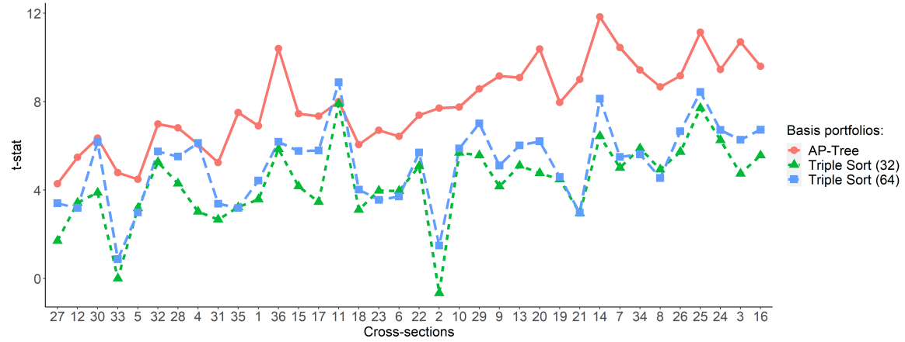
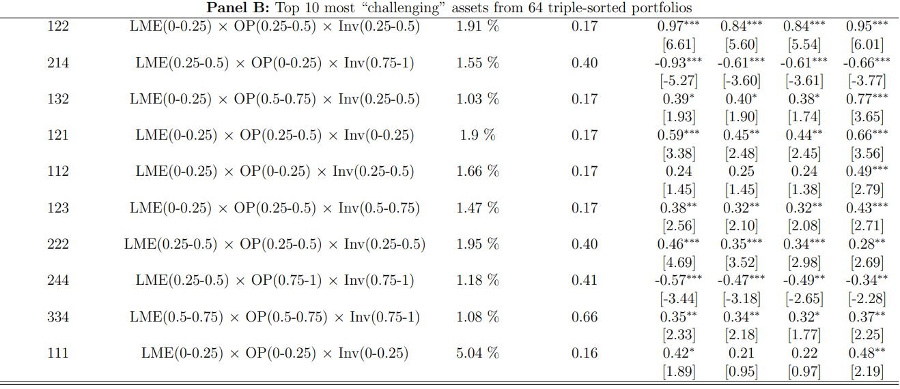
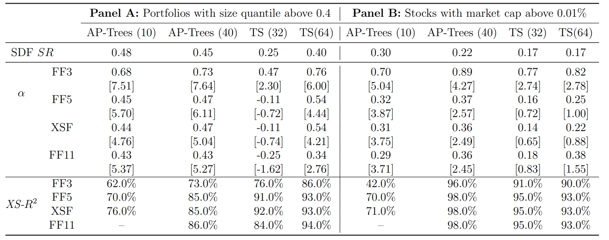

# Forest through the Trees: Building Cross-Sections of Stock Returns
Svetlana Bryzgalova1, Markus Pelger2, Jason Zhu3, Working paper, 2021
1. *London Business School, Department of Finance*
2. *Stanford University, Department of Management Science and Engineering*
3. *Stanford University, Department of Management Science and Engineering*

## 什么解释了预期收益率？

***What explains expected returns?***

这个问题背后有两层含义：

1. 要解释谁的预期收益率？测试资产一般选取截面排序形成的组合收益率
2. 用什么模型来解释？

大多数文献都关注**第二个问题**，实际上，第一个问题也十分重要。原因如下：

1. 除非选取的测试资产可以张成（span）SDF，否则即使能够解释这些测试资产，也不能说明模型的可靠性
2. 测试资产不仅可以用于检验模型，还可以用来构建交易组合（building blocks for constructing tradebale risk factors）

因此，**mis-specified test asset** 不仅影响了SDF的构造，也影响了其评价模型的能力。

> Few studies, in fact, go beyond checking whether a model correctly prices 10-25 stock portfolios and a few bond portfolios. **Implicitly**, one feels that the chosen payoffs do a pretty good job of spanning the set of available risk-loadings (mean returns) and hence that adding additional assets will not affect the results.
>
> ......
>
> the use of a few portfolios means that a tremendous number of potential asset payoffs are left out in an ad-hoc manner.
>
> *Cochrane J. Asset pricing: Revised edition[M]. Princeton university press, 2009.*

### GAP 

过往文献中构造test assets最常使用的方法是特征排序组合【double or triple sort】，这种方法受限于：

1. **维度灾难**，triple sort的因子组合数量已经非常多了【$5 \times 5 \times 5$】，组合内部股票数量已经非常稀疏了
2. 忽略了特征之间的**交互影响**，最多捕捉三个特征之间的交互关系

因而该类test assets**无法张成SDF**，因此基于这些方法做出的model evaluation实际上也是不可靠的。

出于以上两种考量，通常的做法是将许多排序形成的组合堆（stack）在一起，而这本质上并不能解决上述问题，并且会引起新的麻烦：因为这些组合都是基于同一个投资域选取的，所以存在**大量的重复组合**【同一支股票频繁的出现在不同组合中】以及对于同一种风险的**重复构造**【$5 \times 5 $ 组合里有许多组合极为相似】。

出于对这三种问题的考虑：
- 交互作用（complex interactions）
- 维度灾难（curse of dimensionality）【triple sort or above】
- 组合重复（repackaging and duplication）

文章提出了AP tree model（Asset Pricing Trees）。

### AP trees

AP trees解决了上述问题，构造出了 <u>可解释性强、组合充分分散，能够张成SDF</u> 的Test assets。

**Two key elements of AP trees：**
1. 类似于条件排序构造组合
2. **根据SDF的限制条件剪枝（pruning）**

当构造出树结构后，再根据限制条件进行剪枝。但此处的剪枝与机器学习方法中的剪枝有**本质区别**：机器学习方法中根据local information（如mean impurity decrease），即仅对比父节点和子节点之间的信息，而本文则是在均值方差优化的框架下，考虑整个树的结构，在本文的框架下，所有的节点都是投资组合，本文会选取能够得到最高夏普比率的节点组合。

最后，为例避免过拟合，在常规penalty之上，文章还实现了**对均值的收缩**。因此也算是generalization of Kozak, Nagel, and Santosh (2020)。

### Evaluation metrics <!-- {docsify-ignore} -->

双重排序后的组合中，许多极为类似并且不含有太多的定价信息，定价这些组合本质上也等价于仅定价了一个组合，而因为这些重复资产的定价误差小，将那些定价误差大的组合【真正含有定价信息的组合】平均掉了。正是由于重复资产的存在，传统评价指标如absolute pricing errors往往会夸大模型的表现。

本文提出最好使的评价指标是：**样本外解释SDF的能力**【样本外SDF具有最高的夏普比率】，基于这个指标能够得到更为准确的结果。

### The role of Machine Learning <!-- {docsify-ignore} -->

大多数机器学习算法通过两步来构建投资策略：
1. 通过算法提取预测收益率的信号
2. 通过这些信号来构建投资组合，如long short或均值方差优化

**然而，这两步实际上应该合并为一步，也即，直接找到对经济学问题最相关的信号，而非仅与收益率相关。**

> *However, we strongly believe that these two steps should be merged together; that is, machine learning techniques should extract the signals that are the most relevant for the overall economic problem, not just return prediction.*

> [!NOTE]
> 这一点与Hierarchical Bayesian、Shrinking the cross section、RP-PCA的观点是一致的。

文章后续也做了对比，仅提取与收益率相关信号的模型表现远不如考虑经济学问题的模型。

### Closely Related Literature

Factor zoo实际上是基于统计和经济学模型找一些可以张成SDF的基础资产（basis assets）。

回答Factor zoo的文献可以被分为以下三类：

1. **对特征组合做降维处理，最终得到少数几个因子或SDF**

- Lettau and Pelger (2020a) 
- Kelly, Pruitt, and Su (2019) 
- Fan, Liao, and Wang (2016) 
- Kozak, Nagel, and Santosh (2020) 

PCA是这一类文献中最常用的方法，但由于这些方法是在已有的特征排序投资组合中提取信息，就会存在上述提及的问题。而本文提出了**新的构建投资组合的方法，扩充了投资组合的范围**。这些全新的投资组合仍然可以作为传统方法【如PCA】的输入，在这些的投资组合中提取定价信息，自然能够得到更多的信息量。

2. **仅提取特征和收益率之间的关联，而不假设风险模型或无套利限制**

- Freyberger, Neuhierl, and Weber (2020) 
- Gu, Kelly, and Xiu (2020b)
- Moritz and Zimmerman (2016) 
- Rossi (2018) 

像之前提到的，本文不仅着眼于收益率，而是从能够张成有效前沿的角度入手。

3. **在不假设股票和特征之间关系的前提下 (Nonparametric)估计条件SDF**【emerging】

- Chen, Pelger, and Zhu (2022)
- Gu, Kelly, and Xiu (2020a)

通常来说非参方法可解释性会差一些，而本文在基于特征估计条件SDF的同时，保证了模型的**可解释性**。

特别地，对于Kozak, Nagel, and Santosh (2020)，其仅仅对协方差矩阵进行了收缩，然而本文在此基础上，对收益率均值也施加了收缩。这一收缩有极大的意义，**因为样本均值中包含了大量的估计误差，而尽管其绝对数值很大，但其中有很大一部分是由噪声导致的，而不是数据的本质特征**。

根据Garlappi, Uppal, and Wang (2007)的框架，可以证明这个问题**等价**于：面临期望收益、波动率、以及投资机会夏普比率的联合不确定性的条件下，求解模糊厌恶的投资者的最优投资组合。而Kozak, Nagel, and Santosh (2020)仅仅是这一框架下的一个特例。

> *This problem is equivalent to finding an optimal portfolio allocation of an ambiguity-averse investor who is facing a joint uncertainty in expected returns, volatilities, and Sharpe ratios of investment opportunities. As a result, the special case of Kozak, Nagel, and Santosh (2020) can be improved upon.*

## Test Assets, Sorting, and Trees

### Test Assets and SDF

> ***我们需要什么样的 test asset？***

**Conditional** on a set of characteristics $C_t$, a valid SDF $M_t$ is constructed by its **projection** on the space of individual stock return $R_t$ as follows:

$$
M_t = 1-\sum_{i=1}^N b_{t-1,i}R_{t,i} \quad \text{with} \ b_{t-1,i} = f(C_{t-1,i})
$$

$C_{t-1,i}$ 是 $N \times K$ 维矩阵，股票数量是 $N$，特征数量是 $K$，而 $f(\cdot)$ is a general, potentially nonlinear and non-separable function。

有解析解的（reduced-form）资产定价模型通过许多（甚至是无限）**基础函数**（basis function）来估计这一关系：$f(C_{t-1,i}) \approx \sum_{j=1}^J f_j(C_{t-1,i})w_j$

$$\begin{equation}
M_t = 1 - \sum_{j=1}^J w_j R_{t,j}^{\text{managed}} \quad  R_{t,j}^{\text{managed}} = \sum_{i=1}^N f_j (C_{t-1,i})R_{t,i} 
\end{equation}$$

通过这种方式，可以将conditional model表达为unconditional model【时变的部分转移到了 $R_{t,j}^{\text{managed}}$ 】，并且维度从individual stock level降至portfolio level。

因为SDF由这些managed portfolio张成，因此，寻找SDF也就等价于定价这些managed portfolio。因此，问题就此转化为**寻找并定价能够张成SDF的managed portfolio**。【找managed portfolio也就是在找基础函数】

> [!NOTE|label:Basis function]
> **IPCA** consider **linear basis functions** resulting in $R_{t}^{\text{managed}}$ being standard long-short factors, and conventional risk factors rely on quantile-based indicators, while **Shrinking** employ **polynomial functions**.

> 如果这么说的话，那么如何更好的构造managed portfolio是不是也算一个问题呢？

但是，如果找到的managed portfolio并不能张成SDF，那么即使定价了这些managed portfolio，也不能说明找到了真正的SDF。甚至在某些情况下，能够解释某些managed portfolio的模型，并不比不能解释这些managed portfolio距离真实的SDF更近。

根据经济学理论，**最小化真实SDF和candidate SDF之间的距离，等价于最大化managed portfolio的夏普比率**，这给了我们判断的依据。但需要注意的是，最大化的夏普比率指的是**样本外**，因为样本内很大程度上会受到过拟合的影响。

并且模型还要考虑到特征之间的非线性和交互影响，因此trees method是一个很好的选择，通过tree，还能很方便的施加各种restriction【后文会讲】。

> [!NOTE|label:Economic continuity]
> 理论上来说，可能有multiple rotations of managed portfolio张成同样的SDF。但是最优的基础函数应该能够保证模型的**经济一致性（economic continuity）**。PCA文献往往在最后会解释给出的主成分因子对应着哪些类型的因子，一个主成分因子内可能有很多特征的contribution，决定其属于哪一类是看哪一类特征contribution更多；而AP trees非常清晰地列出了组合是根据哪些特征划分的【这实际上也是树方法的特性】。因此，相比于PCA方法，AP trees的可解释性大大提高了，作者称之为**economic continuity**。

In summary，最终能够张成SDF的最优managed portfolio应该符合以下几个性质

1. 同时反映众多特征的影响【reflect the impact of multiple characteristics at the same time】
2. 能够张成 SDF，即在样本外实现最高的夏普比率
3. 考虑非线性和交互影响
4. a relatively small number of well-diversified managed portfolios feasible for investors【传统sort 方法的缺点】
5. 解释性强【interpretable link to fundamentals】

### Conditional and Unconditional Sorting

> ***Conditional有没有必要？***

传统排序方法中用的最多的是single or double sort，而不能同时考虑多个特征之间的交互关系。例如 unconditional $5\times5$ Fama-French portfolio 形成25个投资组合，而当这两个排序变量之间存在相关性时，会导致对角线上股票数量较多而非对角线股票数量很少，在triple sort下，$5\times5\times5$ 的125个投资组合中股票的分散程度更差，甚至会出现 empty portfolio。而三个变量进行排序已经是这种方法的极限了。

这一问题的通用解决办法就是 *stack a set of double-sorted cross-sections against each other*。

而这一做法猛烈地提高了test asset的数量，但却没有提供任何理论依据，并且会引起 unnecessary duplication and repackaging of the same underlying securities。更为重要的是，即使不考虑这种方法形成的测试资产规模，这些测试资产能否张成 SDF 仍然是未知数。

> [!NOTE|label:Cross-sections]
> 当选取排序变量A, B对投资域进行排序分组【conditional or unconditional】形成测试资产时，就可以理解为对这一截面形成了排序组合，这两个排序变量的分组结果就称之为一个cross-section。如果选取A, C则是另一个cross-section。
>
> 对于AP tree来说，排序变量A, B可以形成很多排序分组，因此统称为一个 cross-section，也就是说，**一个排序变量组合就是一个cross-section**。

如果特征之间是独立的，那么Conditonal or Unconditional并不影响结果，但实际上，从左图可以看出特征之间并不独立，面板十分不平衡，在这种情况下，**排序变量顺序**的选择【condition】都会影响结果。

并且这种不独立带来的影响还呈现出复杂的**非线性关系**。单独来看value effect对于smallest stock来说尤其强烈，the impact of accrual对于large stock来说影响是一致的，但是联合来看却呈现出奇妙的倒U形【右图】。因此，特征之间的交互影响需要被纳入考量。

基于以上种种考量，构造了AP tree。

用 $d$ 来代表the depth of tree，排序变量的数量为 $M$，那么最终能够得到 $M^d \times 2^d$ 个投资组合，每个投资组合的股票数量为 ${N\over 2^d}$。

这一做法规避了duplication and repackaging，并且很好地限制了test asset的数量，同时考虑了排序变量的顺序，最重要的是能够张成SDF。

### Recursive Portfolios and Split Choice

与传统的树方法仅包括子节点不同，AP tree**既包括中间节点也包括子节点**。

AP tree的一大特点就是 **recursive overlapping structure**，recursive指的是子节点不能提供价值，则会被merge成父母结点，overlapping指的是最终选取的不同组合中会有重复的股票。

如果不同的股票组合代表了不同的underlying risk，那么理应存在重复的部分。例如parent nodes包括了**全部的股票**，属于市场组合，经过不断的细分，intermediate nodes和final nodes会形成不同的投资组合，表征不同的risk，在最终pruning后，将不能提供信息增益的节点删除即可。

由于其recursive structure，AP-Trees最终选择少量组合的稀疏性与一般意义上的特设稀疏性假设（ad hoc sparsity）不同。AP-Trees是在经济学约束下对tree进行pruning形成的，这一递归结构导致的稀疏性与人为假设的稀疏性有很大区别。

在AP tree中，节点位置越高，股票数量越多，交互信息和非线性越少，因此结构更加简单；而节点位置越低，股票数量越少，背后的特征结构更加复杂。

因此，AP tree的portfolio selection problem 也对应了 bias-variance trade-off，选择higher-level nodes代表着reduces the variance，反之选择lower-level nodes代表着reduces the bias。

因此，在评估子节点是否应该保留时，应该**综合考虑其带来的资产定价信息增益与方差不断增加带来的损失**。

> [!TIP|label:Bias-variance trade-off]
> **Bias** in machine learning refers to the difference between a model’s predictions and the actual distribution of the value it tries to predict, which is evaluated by the performance of a model on a **training** dataset such as MSE. Models with high bias **oversimplify** the data distribution rule/function
>
> **Variance** stands in contrast to bias; it measures how much a distribution on several sets of data values differs from each other. A model with a high level of variance depends heavily on the training data and, consequently, has a limited ability to generalize to new, unseen figures.

## Pruning AP-Trees and portfolio selection

AP pruning 等同于 portfolio selection problem。基于金融学理论，找到 SDF 也就相当于找具有最高夏普比率的 tangency portfolio。不同于仅仅寻找与收益率最相关的predictor，本文在优化中同时考虑了**收益率和协方差**的关系，类似于 mean-variance optimization problem。另外，由于节点太多【两个变量能形成好几棵树】带来的高维度问题，还需要通过**Shrinkage**来避免过拟合问题，构造可靠、稳健的投资组合。

设定均值估计量和协方差估计量分别为 $\hat{\mu}$ ,  $\hat{\Sigma}$，当不对SDF组合权重施加任何Shrinkage，最终的解为： $\hat{w}_{naive} = \hat{\Sigma}^{-1}\hat{\mu} $，然而这种解面临严重的过拟合问题。

本文估计流程为：

1. For a given **set** of values of tuning parameters 样本外预期收益率 $\mu_0$，lasso参数 $\lambda_1$，ridge参数 $\lambda_2$，当fix $\lambda_1, \lambda_2$，多个 $\mu_0$ 才**能得到前沿**；而当 $\lambda_1, \lambda_2$ 变化时，则会形成**不同的前沿**。当fix $\mu_0$，则只能够得到**一个权重数据点**。

在此过程中，$\mu_0$ 与 $\lambda_1, \lambda_2$  一样都被视为**超参数**。

优化问题如下：

$$\begin{equation}
min \qquad {1\over 2} w^T \hat{\Sigma} w + \lambda_1 ||w||_1+{1\over 2} \lambda_2 ||w||_2^2
\end{equation}
$$

2. 利用验证集数据选择超参数 $\mu_0$，$\lambda_1$，$\lambda_2$

**利用第一步得到的权重数据代入验证集，寻找能够最大化验证集夏普比率的权重数据，并选择该权重对应的超参数**。

> When there is no risk-free assets, the tangency portfolio refers to the intersection of the tangent line starting from (0, 0) to the minimal-variance frontier.

3. 利用测试集数据测试结果

> [!NOTE|label:创新点]
> 在训练流程上，与常见的训练方法**并无区别**。
>
> 但是相对于之前的最优化步骤，本流程最大的创新点是**将 $\mu_0$ 作为超参数**，从而规避了样本内最优化带来的**过拟合**问题。

<mark> **这种两步法的估计流程有三种不同的统计解释。** </mark> 而在三种解释下，都存在**one-to-one mapping**。

### Proposition 1 Target Return and Shrinkage to the Mean

- 求解 【样本外目标函数】等价于 【样本内解析解】
- 求解 【**样本外有效前沿**】 等价于 【**样本内数据最优化 + 样本均值收缩**】
$$
\hat{w}_{robust} = \hat{\Sigma}^{-1}(\hat{\mu}+\lambda_0 \bm{1})
$$
- 求解 【**样本外有效前沿 + Ridge**】 等价于 【**样本内数据最优化 + 样本均值收缩 + 协方差矩阵收缩**】
$$
\hat{w}_{robust} = \Big( \hat{\Sigma}+\lambda_2 I_N \Big)^{-1}(\hat{\mu}+\lambda_0 \bm{1})
$$

[【基础知识：均值方差优化】](/factor_zoo/toolkit/mean_var_opt.md)

当不对SDF组合权重施加任何Shrinkage，最终的解为： $\hat{w}_{naive} = \hat{\Sigma}^{-1}\hat{\mu} $。

当仅考虑ridge正则项时【为方便得到解析解，先不考虑Lasso】，即 $\lambda_1 = 0$：
$$
\underset{w}{min} \ w^T \hat{\Sigma}w+\lambda_2 ||w||_2^2 \qquad s.t. \ w^T \hat{\mu} = \mu_0 \ \text{and} \ w^T \bf{1} = 1
$$

最终解为
$$
\hat{w}_{robust} = \alpha_{\mu_0} \hat{w}_{tan,\lambda_2} + (1-\alpha_{\mu_0}) \hat{w}_{var,\lambda_2}
$$

其中：
$$\begin{aligned}
\hat{w}_{tan,\lambda_2} &= c_{tan} \Big( \hat{\Sigma}+\lambda_2 I_N \Big)^{-1} \hat{\mu}, \qquad \hat{w}_{var,\lambda_2} = c_{var} \Big( \hat{\Sigma}+\lambda_2 I_N \Big)^{-1} \bm{1} \\
\alpha_{\mu_0} &= {\mu_0-\hat{\mu}^T \hat{w}_{var,\lambda_2} \over \hat{\mu}^T \hat{w}_{tan,\lambda_2}-\hat{\mu}^T \hat{w}_{var,\lambda_2} }, \qquad 
c_{tan} = \left( \bm{1} \Big( \hat{\Sigma}+\lambda_2 I_N \Big)^{-1} \hat{\mu} \right) ^{-1}\\
c_{var} &= \left( \bm{1} \Big( \hat{\Sigma}+\lambda_2 I_N \Big)^{-1} \bm{1} \right) ^{-1}
\end{aligned}$$

此时，如果目标收益率 $\mu_0$ 根据最大化训练集【**样本内**】夏普比率设置，最终解一定为 $\alpha_{\mu_0}=1$，因此要根据验证集【**样本外**】来选取 $\mu_0$。

进一步放松假设 $w^T \bf{1} = 1$ (**which can be always enforced ex post**)，权重解为：

> [!WARNING|label:Important tricks]
> 放松权重和为1的假设不代表在**目标函数**中放弃，而是在后续的**公式变形中**放松该假设，因为不管后续算出的权重为多少，在事后均可以调整使其权重和为1。

$$\begin{aligned}
\hat{w}_{robust} = \Big( \hat{\Sigma}+\lambda_2 I_N \Big)^{-1} \hat{\mu} &+ \underbrace{\hat{\mu}^T\Big(  \hat{\Sigma}+\lambda_2 I_N \Big)^{-1} \hat{\mu} - \mu_0 \bm{1}^T \Big( \hat{\Sigma}+\lambda_2 I_N \Big)^{-1} \bm{1} \over \mu_0 \bm{1}^T \Big( \hat{\Sigma}+\lambda_2 I_N \Big)^{-1} \bm{1}-\hat{\mu}^T  \Big( \hat{\Sigma}+\lambda_2 I_N \Big)^{-1} \bm{1}}_{\lambda_0} \Big( \hat{\Sigma}+\lambda_2 I_N \Big)^{-1} \bm{1} \\
&= \Big( \hat{\Sigma}+\lambda_2 I_N \Big)^{-1}(\hat{\mu}+\lambda_0 \bm{1})
\end{aligned}$$

当不存在惩罚项时，$\lambda_2 = 0$.

需要注意的是，此时 $\lambda_0$ 是 $\mu_0$ 的递减函数，当 $\mu_0$ 大时，$\lambda_0$ 小，而当 $\mu_0$ 小时，相对来说 $\lambda_0$ 会大。这也代表着一种收缩，但不同于传统的Shinkage向0收缩，而是**向截面均值收缩**。

背后的经济学直觉**T**是：因为期望收益率的估计包含许多估计误差，因此很有可能过高或过低的估计值都是由于高估或低估引起的，而非真实值。

> [!TIP|label:T]
> The same reasoning famously underlines the use of adjusted stock betas by Bloomberg that shrink their sample estimates toward 1, which is the average in the overall cross-section.

正是因为包括了对期望收益率均值的收缩，该方法也被称为对Kozak, Nagel, and Santosh (2020) 的拓展。
此时二者有着**一一对应**的关系：
$$
\lambda_0 \in [0,+\infty)  \Rightarrow \mu_0 \in \left( {\hat{\mu}^T\Big(  \hat{\Sigma}+\lambda_2 I_N \Big)^{-1} \bm{1} \over \bm{1}^T \Big( \hat{\Sigma}+\lambda_2 I_N \Big)^{-1} \bm{1}} ,{\hat{\mu}^T\Big(  \hat{\Sigma}+\lambda_2 I_N \Big)^{-1} \hat{\mu} \over \hat{\mu}^T \Big( \hat{\Sigma}+\lambda_2 I_N \Big)^{-1} \bm{1}} \right]
$$

> [!NOTE]
> 二者一一对应的关系有两种理解。
> 
> （1）之所以是由 $\lambda_0$ 的取值范围推出 $\mu_0$ 的取值范围，是因为当 $\lambda_0$ 的取值小于 0 时，就不会起到收缩的效果，而是**会极化权重**【使得小权重趋于零】，因此，也就可以理解为，当 $\mu_0$ 的取值范围如上时，才有收缩的作用。
> 
> （2）在变形2这种表达下，$\lambda_0$ 的取值范围也代表我们并不认为 $\mu_0$ 会超过切点组合收益率。因为从夏普比率的角度来看，切点组合就是最优夏普比率，已经代表了最严重的过拟合，样本外的夏普比率不会高于这一点。

### Proposition 2 Robust SDF Discovery

**robust = non-overfitting = non-high dimensional = sparse = lasso**

本文的 Robust SDF 泛化了 Kozak, Nagel, and Santosh (2020) 的估计，并且当**不实施均值收缩**【$\lambda_0 = 0$】，二者**等价**。

当**协方差矩阵为对角阵**时，其解为：

$$
\hat{w}_{robust} = \left( \hat{D}+\lambda_2 I_N \right)^{-1}(\hat{\mu} - \lambda_1 \bm{1})_+
$$

在**非对角**情况下：
$$
[(\Sigma+\lambda_2 I_N)\hat{w}_{robust}]_{i} = \hat{\mu}_i + \lambda_0  - \lambda_1 sign(\hat{w}_{robust,i}) \quad \text{for } i \text{ in the active set}
$$

[【基础知识：Lasso 推导】](/factor_zoo/toolkit/lasso_derivation.md)

在本节构造Robust SDF时，要考虑协方差矩阵是否为对角阵的两种情况。

#### Diagonal covariance matrix <!-- {docsify-ignore} -->

为了引入稀疏性，Kozak et al.(2020) 求解以下优化问题：
$$
\hat{w} = arg \underset{w}{min} \ \ {1\over2} \left( \hat{\mu}-\hat{\Sigma}w \right)^T \hat{\Sigma}^{-1} \left( \hat{\mu}-\hat{\Sigma}w \right)+\lambda_1 ||w||+{1\over2}\lambda_2 ||w||^2_2
$$

> [!TIP|label:Closed-form solution]
> 将目标函数展开，并固定资产 $i$ 得到：
$$
-w_i^T\mu + {1\over2}w_i^TD_iw_i+\lambda_1||w_i||_1+\lambda_2 ||w_i||_2^2
$$
>
> 按照**Lasso 推导**中同样的分析逻辑：当 $\mu_i>0$，应有 $w_i>0$，而当 $\mu_i<0$，则有 $w_i<0$。进一步对其求导得；
$$
\begin{aligned}
\text{if} \ w_i>0 &,\quad (D_i+\lambda_2I_N)w_i = \mu_i -\lambda_1\bm{1} \Longrightarrow \mu_i > \lambda_1\bm{1} \\
\Longrightarrow \ &w_i = (D_i+\lambda_2I_N)^{-1} sign(w) (|\mu_i| -\lambda_1\bm{1})_+ \\
\text{if} \ w_i<0 &,\quad (D_i+\lambda_2I_N)w_i = \mu_i+\lambda_1\bm{1}   \Longrightarrow \mu_i <- \lambda_1\bm{1} \\
\Longrightarrow \ &w_i = (D_i+\lambda_2I_N)^{-1}sign(w)(|\mu_i| +\lambda_1\bm{1})_+ \\
\end{aligned}
$$
>
> 由于本文要求*long-only*，$w>0,\ \mu_i > \lambda_1\bm{1}$，则进一步简化为：
$$
w_i = (D_i+\lambda_2I_N)^{-1}(\mu_i -\lambda_1\bm{1})_+
$$
> 

当协方差矩阵为对角阵【这就代表**资产收益率之间并不相关**】，记为 $\hat{D}$，此时概念上也就类似于 PCA space，有以下解析解：
$$
\hat{w} = \left( \hat{D}+\lambda_2 I_N \right)^{-1}(\hat{\mu}-\lambda_1 \bm{1})_+, \qquad (x)_+ = max(x,0)
$$
而本文给出的解为：
$$
\hat{w}_{robust} = \left( \hat{D}+\lambda_2 I_N \right)^{-1}(\hat{\mu}+\gamma \bm{1}-\lambda_1 \bm{1})_+
$$

求解过程如下：
$$
L = {1\over2}w^T \hat{D} w + {1\over2}\lambda_2 ||w||_2^2 + \lambda_1 ||w||_1 - \tilde{\gamma}_1 \left( w^T \hat{\mu}-\mu_0 \right)- \tilde{\gamma}_2 \left( w^T \bm{1}-1 \right)
$$

求导有：
$$
\hat{w}_{robust,i} = \left( \hat{D}_i+\lambda_2 I_N \right)^{-1}(\tilde{\gamma}_1 \hat{\mu}_i + \tilde{\gamma}_2 \bm{1} - \lambda_1 \bm{1})_+
$$
由于两个超参数都和 $\mu_0$ 有关，同样地，放松权重假设，可以得到：

$$
\hat{w}_{robust,i} = \left( \hat{D}_i+\lambda_2 I_N \right)^{-1}(\hat{\mu}_i + \lambda_0 \bm{1} - \tilde{\lambda}_1 \bm{1})_+
$$

其中，
$$
\lambda_0 = {\tilde{\gamma}_2 \over \tilde{\gamma}_1}, \qquad \tilde{\lambda}_1 = {\lambda_1\over \tilde{\gamma}_1}
$$

可以看出，当对均值收缩程度 $\lambda_0$ 为0时，二者等价，因此，说本文是generalization。

当 $\lambda_0 = 0$，说明 $ \tilde{\gamma}_2 = 0 $，也就代表**放弃**权重限制，而非**放松**权重限制。

#### Non-diagonal covariance matrix <!-- {docsify-ignore} -->

在非对角阵的情况下，需要求解以下最优化问题：
$$
L = {1\over2}w^T \hat{\Sigma} w + {1\over2}\lambda_2 ||w||_2^2 + \lambda_1 ||w||_1 - \tilde{\gamma}_1 \left( w^T \hat{\mu}-\mu_0 \right)- \tilde{\gamma}_2 \left( w^T \bm{1}-1 \right)
$$

相应地，导函数变为：
$$
\left[(\Sigma+\lambda_2 I_N)\hat{w}_{robust}\right]_i = \tilde{\gamma}_1 \hat{\mu}_i + \tilde{\gamma}_2  - \lambda_1 sign(\hat{w}_{robust,i}) \quad \text{for } i \text{ in the active set}
$$

放松权重假设为：
$$
\left[(\Sigma+\lambda_2 I_N)\hat{w}_{robust}\right]_i = \hat{\mu}_i + \lambda_0  - \tilde{\lambda}_1 sign(\hat{w}_{robust,i}) \quad \text{for } i \text{ in the active set}
$$

对应在 Kozak et al.(2020) 中的导函数为：
$$
\left[(\Sigma+\lambda_2 I_N)\hat{w}\right]_{i} = \hat{\mu}_i  - \tilde{\lambda}_1 sign(\hat{w}_{robust,i}) \quad \text{for } i \text{ in the active set}
$$

因此，当 Kozak et al.(2020) 使用 $\hat{\mu}+\lambda_0\bm{1}$ 代替 $\hat{\mu}$ 时，二者等价。

或者说，当对均值收缩程度 $\lambda_0$ 为0时，二者等价。

综上，在协方差矩阵的两种情况下，本文都属于对Kozak et al.(2020)的扩展。

然而，此时协方差矩阵不为对角阵，会带来其他变量的影响。因此，对于任意单个资产来说，并不能分离出ridge和lasso的影响，所以也无法将均值收缩纳入lasso惩罚项内。

> *In the general case of a non-diagonal sample covariance matrix, however, the impacts of ridge and lasso penalties cannot be separated, and, hence, the lasso penalization cannot subsume the mean shrinkage.*

### Proposition 3 General Robust Estimation Perspective

本文的估计也**等价于**在不确定最大【因此称之为稳健估计】的情况下【包括均值不确定性，方差不确定性和夏普比率不确定性】求解均值方差优化问题。

$$
\underset{w}{min} \ \underset{\mu,\Sigma \in S_{SR}\cap S_{\Sigma} \cap S_{\mu}}{max} \ w^T\Sigma w \qquad s.t.\ w^T\bm{1} = 1, \ w^T\hat{\mu} = \mu_0
$$

每一种收缩都对应着一类不确定性。

> *Each type of shrinkage has a one-to-one correspondence to a specific type of uncertainty in the
estimation.*

> [!NOTE|label:Uncertainty]
> Unceritainty means that ***the true mean and covariance matrix lie in an uncertainty set around their sample estimates***
>
> 因此，在不确定性下，我们给出的是一个区间估计，而非点估计。

[【推荐阅读：RFS2007, Portfolio Selection with Parameter and Model Uncertainty】](/factor_zoo/portfolio_selection_with_parameter_model_uncertainty.md)

首先考虑均值和协方差的不确定性。
$$\begin{aligned}
S_{\Sigma} &= \left\{ \Sigma: \Sigma_{i,j} = \hat{\Sigma}_{i,j} + e_{i,j}^{\sigma}; \ ||e^{\sigma}||^2_2 \leq \mathcal{k}_{\sigma} \  \Sigma \text{ is positive definite and } \ \mathcal{k}_{\sigma} \geq 0 \right\} \\
S_{\mu} &= \left\{ \mu: \mu_i = \hat{\mu}_i + e_i^{\mu}; |e_i^{\mu}| \leq \mathcal{k}_{\mu} \ \text{ and } \mathcal{k}_{\mu} \geq 0  \right\}
\end{aligned}
$$

参数 $\mathcal{k}_{\mu}, \mathcal{k}_{\sigma}$ 分别捕捉了均值和协方差估计量中的不确定性。

稳健的投资组合最优化等价于在不确定性最大的情况下求解：

$$
\underset{w}{min} \ \underset{\Sigma \in S_{\Sigma},\mu \in S_{\mu}}{max} \ {1\over2}w^T \Sigma w - \tilde{\gamma}_1 \left( w^T \mu - \mu_0 \right)-\tilde{\gamma}_2 \left( w^T \bm{1} - 1 \right)
$$

将 $S_{\mu}$ 代入：
$$\begin{aligned}
& \underset{w}{min} \ \underset{\Sigma \in S_{\Sigma}}{max} \ {1\over2}w^T \Sigma w -\tilde{\gamma}_1 \sum_{i=1}^N \left( w_i [ \hat{\mu}_i - \mathcal{k}_{\mu} sign(w_i) ] - \mu_0 \right) - \tilde{\gamma}_2 \left( w^T \bm{1} - 1 \right) \\
= &\underset{w}{min} \ \underset{\Sigma \in S_{\Sigma}}{max} \ {1\over2}w^T \Sigma w -\tilde{\gamma}_1 \left( w^T \hat{\mu} - \mu_0 \right)+\tilde{\gamma}_1 \sum_{i=1}^N \mathcal{k}_{\mu} |w_i|- \tilde{\gamma}_2 \left( w^T \bm{1} - 1 \right)
\end{aligned} 
$$

> [!TIP|label:The worst case]
> The worst case指的就是内层最优化。
> 
> 在max最优化中，我们需要在 $\mu, \Sigma$ 的不确定性下最大化目标函数。对于 $\mu$ 来说，因为目标函数中是减号，所以需要 $\mu$ 越小越好，因此应带入 $e_i^{\mu}=-\mathcal{k}_{\mu}, \mu_i = \hat{\mu}_i -\mathcal{k}_{\mu}$。但由于 $w_i$ 正负不定，所以加入符号函数 $sign$，当 $w_i$ 为正数时为 $\mu_i = \hat{\mu}_i -\mathcal{k}_{\mu}$，当 $w_i$ 为负数时为 $\mu_i = \hat{\mu}_i + \mathcal{k}_{\mu}$。
>
> 下文 $\Sigma$ 不确定性处理思路相同。

再将 $S_{\Sigma}$ 代入：
$$
\underset{w}{min} \ {1\over2} tr \left( w^T \hat{\Sigma} w \right)+ \mathcal{k}_{\sigma}w^T w -\tilde{\gamma}_1 \left( w^T \hat{\mu} - \mu_0 \right)+\tilde{\gamma}_1 \sum_{i=1}^N \mathcal{k}_{\mu} |w_i|- \tilde{\gamma}_2 \left( w^T \bm{1} - 1 \right)
$$

最终，令 $ \lambda_1 = \tilde{\gamma}_1 \mathcal{k}_{\mu} \text{ and } \lambda_2 = \mathcal{k}_{\sigma} $，即可得到我们熟悉的式子：

> why trace?
>
> ambiguity aversion and ambiguity?

$$
\underset{w}{min} \ {1\over2} tr \left( w^T \hat{\Sigma} w \right)+ \lambda_2 ||w||^2_2 +\lambda_1 ||w||_1 -\tilde{\gamma}_1 \left( w^T \hat{\mu} - \mu_0 \right)- \tilde{\gamma}_2 \left( w^T \bm{1} - 1 \right)
$$

因此，**lasso shrinkage $\lambda_1$ 代表了均值的不确定性，而ridge shrinkage $\lambda_2$ 代表了方差的不确定性**。

因此，在考虑了两种不确定性的情况下，能够得到关于整个均值方差前沿的稳健估计，那么第二步就是找到样本外切点组合。

***均值收缩能够与切点组合夏普比率的不确定性联系起来***。

为了展示这一性质，考虑拥有风险厌恶系数为 $\gamma$ 的投资者的均值方差优化问题，先从最一般的情况【即不带任何收缩】入手：

$$
\underset{w}{max} \  \ w^T \hat{\mu} -  { \gamma \over2}w^T \Sigma w - {\gamma}_1 \left(1- w^T \bm{1} \right)
$$

其解为： $ w^* = \alpha_{\gamma} \hat{w}_{naive}+(1-\alpha_{\gamma} )\hat{w}_{var} \ \text{with} \ \alpha_{\gamma} = {1\over \gamma} \bm{1}^T \hat{\Sigma}^{-1}\hat{\mu} $，因此每一个目标收益率 $\mu_0$ 都对应着一个唯一的风险厌恶系数 $\gamma$。

在此基础上如果再加上对于样本均值向截面平均值的收缩，那么问题变为：

$$
\underset{w}{max} \  \ w^T \left(\delta \hat{\mu} + (1-\delta)\bar{\mu}\bm{1}  \right)-  { \gamma \over2}w^T \Sigma w - {\gamma}_1 \left(1- w^T \bm{1} \right)
$$

此时，其解变为： $ w^* = \alpha_{\delta} \hat{w}_{naive}+(1-\alpha_{\delta} )\hat{w}_{var} \ \text{with} \ \textcolor{#d22778}{\bm{\alpha_{\delta}}} = { \delta \over \gamma} \bm{1}^T \hat{\Sigma}^{-1}\hat{\mu} $。

$\delta$ 的取值范围为0 ~ 1，当为 1 时，代表不收缩，而为 0 时，代表完全收缩到均值，因此这一写法称之为向截面均值的收缩。也正是因为 $\delta$ 的取值范围，实际上**均值收缩代表着更高程度的风险厌恶**，【见 $\alpha_{\gamma}$】。

接下来从夏普比率的不确定性来看均值收缩这一问题，不确定性集合为：

$$
S_{SR} = \left\{ \mu : (\mu-\hat{\mu})^T \Sigma^{-1}  (\mu-\hat{\mu}) \leq \mathcal{k}_{SR} ; \ \mathcal{k}_{SR} \geq 0  \right\}
$$

> [!NOTE]
> 尽管是夏普比率的不确定性，但此时 $\Sigma$ 并没有带有不确定性，因此，不确定性的来源还是 $\mu$

与上述稍有不同的是，夏普比率不确定性直接作为一个拉格朗日条件出现：

$$
\underset{w}{max} \ \underset{\mu \in S_{SR}}{min} \ w^T \mu -{1\over2}w^T \Sigma w-\gamma_2 \left(\mathcal{k}_{SR}- (\mu-\hat{\mu})^T \Sigma^{-1}  (\mu-\hat{\mu}) \right) -\gamma_1 \left(1- w^T \bm{1}  \right)
$$

此时解为：
$$\begin{aligned}
w^* &= \alpha_{\mathcal{k}_{SR}} \hat{w}_{naive}+(1-\alpha_{\mathcal{k}_{SR}} )\hat{w}_{var} \\
\textcolor{#d22778}{\bm{\alpha_{\mathcal{k}_{SR}}}} &= { 1 \over {\mathcal{k}_{SR} \over \sigma_p}+\gamma} \bm{1}^T \hat{\Sigma}^{-1}\hat{\mu}
\end{aligned}
$$

与均值收缩一样，**夏普比率的不确定性也代表了更高程度的风险厌恶**【系数更小】。

对比均值收缩和夏普比率不确定性的 $\alpha$，可以发现二者都存在一对一的mapping，因此，**二者可以通过不同的超参数取值来表征同样程度的风险厌恶**。

$$
\bm{\alpha_{\delta}} = {\delta \over \gamma} \bm{1}^T \hat{\Sigma}^{-1}\hat{\mu}, \quad {\bm{\alpha_{\mathcal{k}_{SR}}}} = { 1 \over {\mathcal{k}_{SR} \over \sigma_p}+\gamma} \bm{1}^T \hat{\Sigma}^{-1}\hat{\mu}
$$

至此，已经解释了为什么说每一类收缩都对应着一种不确定性。

### AP-Pruning

考虑到上文所说的 bia-variance trade-off：【AP tree的portfolio selection problem 也对应了 bias-variance trade-off，选择higher-level nodes代表着reduces the variance，反之选择lower-level nodes代表着reduces the bias】，因此直接进行均值方差优化是不恰当的，需要进行reweight。

考虑到**high variance**带来的影响，同时每个节点分散程度由节点内的股票数量的倒数 $1\over N_i$ 决定，那么用 $ \sqrt{N_i} $ 作为权重也未尝不可。但是每个月股票数量都在变化，如果选用 $\sqrt{N_i}$ 来做权重，那么每个月都要调整，比较不便。

同时参考 GLS 中的reweighting方法，最终reweight的算法是将每个节点的**收益率**乘上 ${1\over \sqrt{2^{d_i}}}$，$d_i$ 为节点深度。

[【基础知识：weighting scheme of GLS】](/factor_zoo/toolkit/GLS.md)

这种re-weighting与 Kozak, Nagel, and Santosh (2020) 中的PCA因子处理方法相似，只不过在shrinking中，每一个因子乘的是 *协方差矩阵的特征向量*。在PCA中，第一个PC通常为等权市场组合，乘上 $\sqrt{N}$，因为其在构造过程中影响了 N 个资产。对于只在一半的股票上有loading的PCs来说，需要乘上 $\sqrt{N\over2}$。这实际上说明了，higher-order nodes 与higher-order PCs 一样：尽管能够实现更高的收益，但同时也带来了更大的估计误差和噪音。但与PC不同的是，AP tree portfolios 属于 **long-only**，因此具有更好的解释性。

## Experiment design

### Data

|||
|:--:|:--:|
|公司特征数据库|CRSP/Compustat|
|数据时长|1964.01-2016.12|
|数据频率|53年的月度观察值|
|无风险利率|one-month Treasury bill rate|
|排序变量个数|10|
|排序变量数据库|Kenneth French Data Library|

排序变量包括会计数据和市场数据，基于市场数据的变量月频更新，而会计数据每年六月底更新 (following the convention)。

不同于绝大多数机器学习方法，**AP-tree并不要求股票数据是面板平衡的** (balanced panel of stocks), which is a very demanding yet typical prerequisite。

### Estimation and Hyperparameter Tuning

为了更好地与现有文献对比，以下实证选用三个公司特征：size and two other variables。在固定第一个排序变量为size，另外两个排序变量任意组合的情况下，共有 $C^2_9 = 36 $ 个组合。

Literature baseline 为 32 ($2\times4\times4$, single split on size) and 64 ($4\times4\times4$, two splits on size) triple sorts.

对于每一个组合来说，AP-tree考虑树的深度为4，当固定第一次split factor为size，后面三次split，有两个变量的情况下，共有 $2^3 = 8$ 种划分方法【conditional因此顺序不同则构造不同，并且可以重复选择】，因此共有 $28\times 8 = 228$ 种组合。

但是，*为了避免选取收益率尾部的极端部分*，因此排除了余下三次split都按照同一变量split形成的第四层组合。同时，为了跟 Literature baseline 具有 *可比性*，最终文章对于每一个cross-section选择了40个 AP-tree portfolio。

所有的组合都为市值加权。

训练设置如下：

### Baseline Evaluation Metrics

实证中涉及的模型包括：
- FF3
- FF5
- XSF: cross-section-specific model with market and three **long-short** portfolios, corresponding to the three characteristics used in the cross-section.
- FF11: An 11-factor model, consisting of the market factor and all 10 **long-short** portfolios, based on the full set of 10 characteristics.

对于任意的特征组合，都有以下指标：

1. 样本外夏普比率
2. 定价误差 $\alpha$
3. 单个资产定价误差 $\alpha_i$
4. $\text{XS-R}^2$ ：Relative magnitude of pricing errors in a given cross-section, that is: 
    $$
    \text{XS-R}^2=1-\dfrac{N}{N-K}\dfrac{\sum_{i=1}^N\alpha_i^2}{\sum_{i=1}^N E[R_i^{ex}]^2}.
    $$
    
    Note that we use *the uncentered version* of $R^2$ to ensure that it captures pricing errors that are not only *relative* to the other assets but also *specific* to the overall cross-section of securities, reflecting both common and asset-specific levels of mispricing.

## Empirical results

文章有着丰富的实证检验，都很有趣，建议认真阅读。

### 36 Cross-Sections of Expected Returns

AP-trees 显著高于其余模型的样本外夏普比率，并且相差明显。这代表了AP-trees 包含更多的定价信息。

此外，XSF (Cross-section-specific factors) 的夏普比率只有 triple sort的一半，这是因为 **XSF 完全忽略了特征之间的交互信息**，尽管 triple sort 也无法很好的刻画交互影响，但至少刻画了部分。

不过 one or two splits in the size dimension (32 or 64 triple-sorted portfolios) 看起来影响不大。

并且这种夏普比率的差别并不能简单地由风险因子上的暴露多少所解释，下图可以看出FF5基本无法解释AP-tree的组合，并且这种趋势与上图相同。

距离来说，ID为2的因子组合为：size，value，and profitability，以FF5来解释，triple sort 32和64中并不存在 $\alpha$，但对于AP-trees，$\alpha$ t值为8，非常显著。这也说明了AP-trees 包含了更多的定价信息。

从下图可以看出，传统定价模型很难解释AP-tree portfolios的截面差异。通常来说，$\text{XS-R}^2$ 超过80%，就可以认为组合被定价因子解释的差不多了。triple sorts确实被解释的差不多了，但是对于AP-trees，解释力度则很难超过 50%。

以上检验与benchmark 模型选取无关，更多测试详见附录。

此外，借鉴 Barillas and Shanken (2016)的检验方法（spanning test）, 作者还做了张成检验：沿用 Lettau and Pelger (2020) RP-PCA的思路，作者从AP-tree和triple-sort的组合中**提取了5个主成分**并用以互相检验。

> [!TIP|label:Spanning test]
> Barillas F, Shanken J. Which alpha?[J]. ***The Review of Financial Studies***, 2017, 30(4): 1316-1338.
>
> *Our central insight in this context is a simple one — that models should be compared in terms of their ability to price all returns, both test assets and traded factors.*
>
> [【石川 Toward a better factor model】](https://zhuanlan.zhihu.com/p/360857923)

简单来说就是定价因子之间应该相互解释。

结果发现，利用AP-tree张成的SDF作为被解释变量（图b），三种5 latent factor作为定价因子，结果显示：

- triple sort RP-PCA factors 完全无法解释 AP-tree portfolio
- AP-tree RP-PCA factors 解释了绝大多数的 AP-tree portfolio，只有少数几个组合无法被解释，代表需要更多的latent factor来捕捉更为复杂的定价关系

然而，利用triple sort 张成的SDF作为被解释变量，结果则大不相同。

两种结果共同表明，AP-tree能够张成triple sort，但反之则不行。

### How Many Portfolios?

本节意在测试构建SDF过程当中的稀疏性。上述选择的 40 个 AP-tree portfolio可能还是太多了。

结果发现，在绝大多数情况下，原来四分之一的因子数量就能实现原本夏普比率的90%。

此外，由于在pruning中还考虑了每个节点的所在层数（reweight），因此**方法倾向于选择中间节点而非深层次的子节点**，结果确实显示，中间节点（包括parent node） substantially contribute to the overall projection of the pricing kernel.

### Nonlinearities and Characteristic Interactions

AP-tree有个好处就是能够能轻松的施加任何限制，因为它可以在pruning之前随意移除节点。

特征的非线性也逐渐成为研究的重点，如下面这篇论文是其中一篇代表作。

> [!NOTE|label:Nonlinearity]
> Freyberger J, Neuhierl A, Weber M. Dissecting characteristics nonparametrically[J]. ***The Review of Financial Studies***, 2020, 33(5): 2326-2377.

从前面的测试中已经知道**非线性**是 important driver of performance，但并不确定非线性的来源。

非线性来自于两个维度：

- **单一特征的非线性影响**
- **不同特征之间交互影响**

#### 交互影响 <!-- {docsify-ignore} -->

为了测试到底来源于哪一种渠道，作者移除了所有的交互排序节点，即，所有的Tree都是单变量重复split形成的。

因此，此时不存在交互影响，但仍然存在单一特征的非线性。

结果如下，夏普比率基本腰斩。

  
#### 单一特征的非线性 <!-- {docsify-ignore} -->

在 [How Many Portfolios](#How-Many-Portfolios?) 图中的XSF已经能够反应没有交互项时的影响，与移除全部交互节点的AP-tree差别就在于：**XSF对于long和short的权重是一样的**。此时结果显示XSF的夏普比率仍然低于AP-tree就说明，AP-tree中，给long和short的权重是不一样的，也就说明了单一特征的非线性在起作用。

综上，总的来说，两种非线性都很重要，交互项的作用似乎更大一些。

### Importance of Economic Objective Function

AP-tree表现这么好的另一个原因是它的**economic objective function**。

仅仅依靠特征和投资组合之间清晰的可解释性是不足以提供良好的样本外表现的，而以下两点才是使得AP-tree区别于其他的降维方法的特点：

#### Jonitly estimate return and covariance <!-- {docsify-ignore} -->

AP-tree implicitly takes into account **the conditional impact of firm characteristics on both expected returns and variances** of portfolios.

大多数其他方法要么仅仅关注收益率预测【cross-sectional regressions of returns on characteristics, random forest, or conventional deep-learning prediction approaches】或是聚焦于纯粹的资产收益共同运动【principal components】。

#### Prediction and Classification

Economic theory suggests that finding an optimal set of portfolios combines the elements of both **prediction and classification**, making traditional ML techniques focused on pure return prediction **invalid**.

> what is the Economic theory?

首先考虑一种AP-tree的特殊情况，就是令均值收缩参数 $\lambda_0 = \infty$，则所有组合经过收缩后的均值均为无穷，这就等同于**仅依靠协方差进行构建组合而忽略均值信息**【类似于PCA】，因此，称这种AP-tree为 V-trees。需要注意的是，这些资产的收缩前均值仍然会用于构建SDF。

其次，考虑仅预测期望收益率的机器学习方法。这类方法仅仅用于预测收益率而非span the SDF，并且这些常常将不同的预测变量混在一起使用，因此缺乏解释性且很难剥离出单个指标的贡献。我们选用Gu, Kelly, and Xiu (2020b) 中表现最好的深度神经网络，并且基于该网络的预测将股票进行排序，选取前 10%进行市值加权。此外，还考虑了众多其他方法如随机森林、深度学习模型等。

结果不言自明：

> 这一点很重要，说明了economic theory based ML 才是正道。

> [!NOTE|label:ML paper]
> Gu S, Kelly B, Xiu D. Empirical asset pricing via machine learning[J]. ***The Review of Financial Studies***, 2020, 33(5): 2223-2273.
  
### Zooming into the Cross-Sections

本文选择了一个特殊的例子来进一步研究AP-tree张成的SDF性质：**size**，**investment**，**profitability**。这个例子相当具有代表性，并且所有基于这一组合的结果都是适用于其他组合。

从表中可以清楚的看到，AP-tree portfolio具有更高的 $\alpha$ 和显著性。

因为10个组合与40个组合表现相差不大，那么更进一步来看，经过pruning剩下的10个组合都是什么呢？

从上图我们发现，在十个组合中，只有五个对应了最终子节点，子节点仅占总股票数量的 **6%** ，其他包括市场组合以及中间节点。

这些组合不仅在统计上有显著性，在经济学上也具有显著性【$\alpha$ 大】，例如组合8。值得注意的是，尽管组合8分类上属于小市值，但是经过市值加权后，市场规模占比仍然接近 **50%** ，因此*其收益率绝不是由于小市值驱动的*。

> [!TIP|label:Portfolio ID]
> Portfolio ID包括两部分，用以分类的变量序号以及分类方向（low/high）。举例来说，组合6的ID是 (1221.1111)，就代表，先经过两次特征2（investment）split，并且属于low的一侧（低投资），再经过特征1（size） split，还是属于low的一侧。
>
> 注意：小数点前，如果没有split，则标记为1；小数点后第一位默认为1。

对比来看，传统方法选出的最猛的资产组合则**非常偏向于小市值**。

尽管这些组合 $\alpha$ 非常之高，但是细看能够发现许多问题。

- **特征极为相似**：小市值，中等偏下的盈利以及高投资
- 包含**数量极少**

而AP-tree不仅考虑划分特征，还考虑了节点的深度，因此类似于这些的节点都没有被选择。

但是对于Triple sorts形成的组合来说，这种过度细分带来的影响则并没有被纳入考虑。在其中会存在一类组合，这些组合由一类风险因子所张成，并且并不具有风险溢价，因此**这些组合并不代表投资机会和定价信息**，但却可以被准确定价。然而，这些组合的存在大幅提高截面上的定价质量，进而使得一些评价指标例如 $R^2$ 严重失真。 **这就是为什么GLS的 $R^2$ 往往低于OLS的 $R^2$** 。

尽管存在过度细分的影响，但是AP-tree的深度仍然需要保证。

从图中的最上面一层可以看出，在AP-tree中，高投资的股票聚合在一起，并且具有相同的SDF exposure，但是在triple sort中划分则非常的凌乱。整体来看，AP-tree刻画的结构更加复杂和细致。

AP-tree的特性允许我们进一步检验小市值股票对AP-tree的影响。

左侧的Panel A移除了所有加权平均市值低于40%的节点，因此隐含的剔除了小市值股票。但是可以发现AP-tree portfolio仍然很难定价。

Following Kozak, Nagel, and Santosh (2020)，直接筛选出市值大于总市场规模 0.01% 的股票，在美国此时指的是600只市值最大的股票，这就相当于同时剔除了小市值股票和中市值股票。虽然夏普比率和 $\alpha$ 都显著降低，但是与 triple sort的差距仍然很显著。

###  Time Variation

目前所有的结果都假定SDF的权重是不变的，本节探究其时变的影响：并不改变根据训练集和验证集选出的**组合**，而仅仅改变他们在SDF中的**权重**。

其中很有意思的一点是：在之前时不变SDF中难以解释的包含**短期反转因子**的 cross-section 30，4，11，在时变结构下都不是问题。

在本节，还测试了对于各种shrinkage的敏感度。

结果显示尽管收缩对于所有cross-section的影响不尽相同，但是整体来看对于两类组合表现的提升都起到了比较明显的作用。

并且，图中还非常明显的显示了，当均值收缩和方差收缩共同使用时，能够达到**最优的**效果。

## AP-trees in Large Dimension

在以往的文献中，构建测试资产的方法往往是将许多cross section堆叠（stack）起来，例如将许多double sort放在一起作为测试资产。随着异象数量越来越多，测试资产的数量也在不断增加。

但是，这种处理方式背后有很大问题。例如，不断对于同样的投资域double sort，最终的结果是一只股票会**重复**的出现在每一次的double sort portfolio中，并且也没有考虑某些股票是否反映了double sort变量所代表的**特定风险**。而AP-tree则很好地解决了这些问题。

下文通过以下几种方法，基于10个特征构建了测试资产：

- Sets of 10 *quintile* portfolios, *uniformly* sorted by characteristics (50 assets altogether)
- sets of 10 *decile*-sorted portfolios (100 assets)
- a combination of *six double-sorted* portfolios, with each based on *size and some other characteristic* (54 assets)
- a combination of 25 *double-sorted* portfolios, with each based on *size and some other characteristic* (225 assets)
- Tree-based portfolios are constructed based on combining selected assets (10/40 portfolios) from each of the 36 cross-section (starting from 360 and 1,440 assets, correspondingly)

对这些资产施加shrinkage，最后选取组合的表现如下：

从quantile到decile可以大幅度提高夏普比率，在传统的测试资产框架中，$25 \times 9$ 的double sort 取得了最好的效果，样本外月频夏普比率达到了0.4-45。

值得注意的是，大多数的表现在组合数为20-30就已经实现了，这也暗示着在**大量的测试资产组合中存在着极大程度的冗余**。

### Evaluating Asset Pricing Models

正如文章开篇提到的，在测试资产定价模型时，**测试资产的选择**也很重要。

本节通过资产定价文献中常见的horse race试图说明两点：

- popular empirical metrics for model evaluation and comparison depend on the *choice of tests assets*
  - 最优的模型不仅要有良好的模型表现，还要张成SDF，但是对于传统模型来说，尽管无法张成SDF，但是在特定的模型评价指标中还是能有很好的表现【例如 $\alpha$】
- popular measures of model performance used in larger cross-sections suffer from *redundancy caused by asset repackaging*
  - 受到大量重复组合的影响，许多传统指标如 $\alpha$，$\text{XS-R}^2$ 都严重失真了。因此关注SDF alpha 可能是更好的选择

horse race结果如上。horse race的目标并不是找到最优的组合，而是想**说明这些指标的局限性**。

特别是 $\alpha$ 很具有误导性，因为其忽略了组合的重复问题，100 deciles and 225 double-sorted portfolios当中，有许多组合基本都差不多，因为这些组合能够被解释的很好，因此最终的平均 $\alpha$ 就会很小，进而不具有显著性。

GLS可以回避这个问题，因为GLS考虑了组合之间的相关性。

从下图可以看出组合之间明显的相似性：

  

市场指数与市场组合

bias variance trade off

PCA reweight

