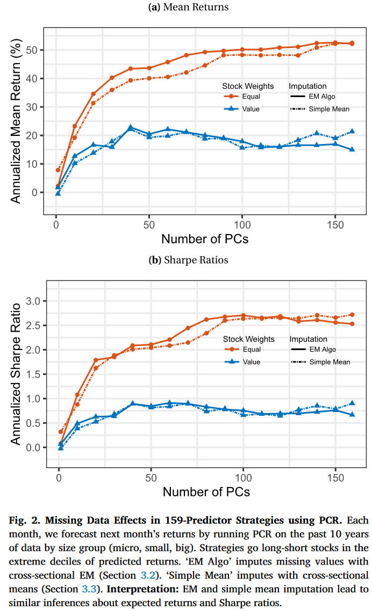
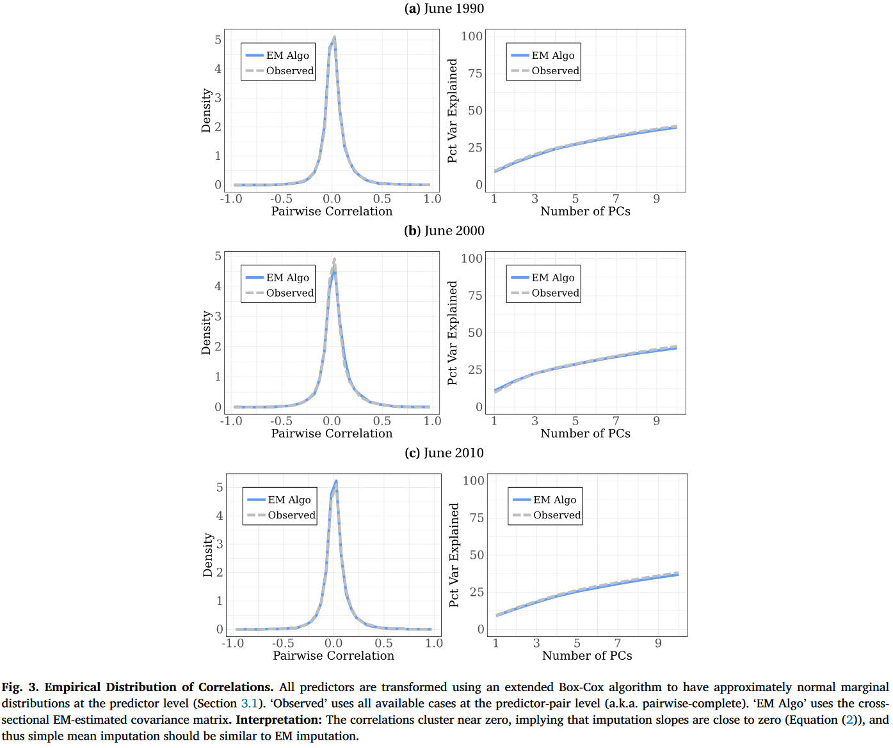
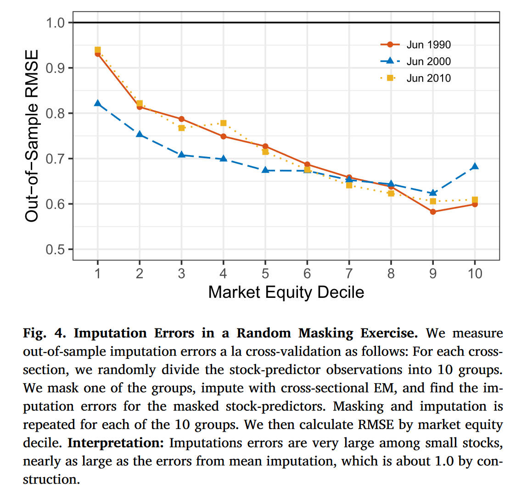
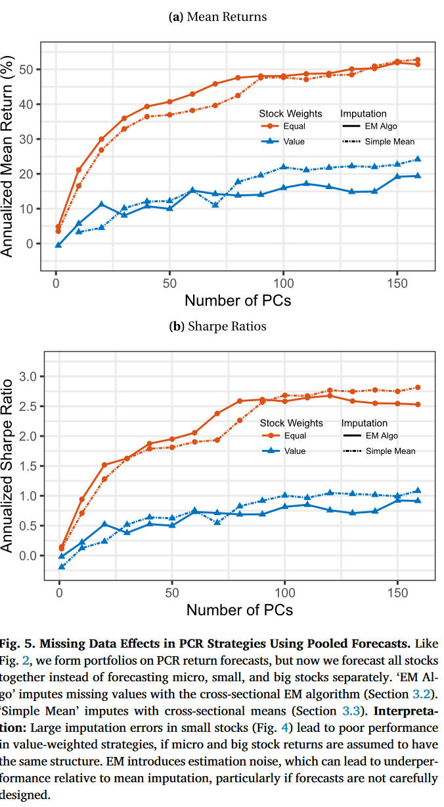

# Missing values handling for machine learning portfolios

Andrew Y. Chen 1, Jack McCoy 2, ***Journal of Financial Economics***, 2024

1. *Federal Reserve Board*
2. *Columbia Business School*

### Preprocessing

Before applying any imputation, we use following preprocessing:

1. **Winsorize** across stocks symmetrically at the 1% level for each predictor-month.
2. Hawkins and Weisberg (2017)'s extension of Box and Cox (1964) to make each predictor approximately **normal**.
3. **Standardize** predictors to have zero mean and unit variance.

> [!Cite]
> Hawkins, D., Weisberg, S., 2017. Combining the Box-Cox power and generalised log transformations to accommodate nonpositive responses in linear and mixed-effects linear models. S. Afr. Stat. J. 51, 317–328.
> 
> Box, G.E., Cox, D.R., 1964. An analysis of transformations. J. R. Stat. Soc., Ser. B, Methodol. 26, 211–243.

## Baseline imputation methods

### Cross-sectional EM imputation

> [!CITE]
> Little, R.J., Rubin, D.B., 2019. Statistical Analysis with Missing Data, vol. 793. Wiley.

> The final goal of EM algorithm is not to impute data, but to calculate the parameters of interest.

$N$ stocks, and stock $i$ in month $t$ has a vector of predictor values $X_{i,t}$, Missing values are represented by $X_{\text{miss}|i,t}$ and $X_{\text{obs}|i,t}$, which are the missing and observed subvectors of $X_{i,t}$, $\hat{\Sigma}_t$ is a reasonable estimate for $\Sigma_t$, the cross-stock covariace matrix of $X_{i,t}$. 

> [!TIP|label:Example]
> If $X_{i,t} = [1,2,3,4] $, if the firse and third elements are missing, then $X_{\text{miss}|i,t} = [1,3]$ and $X_{\text{obs}|i,t}=[2,4]$

Given the observed values $X_{\text{obs}|i,t}$, compute the conditional expectation of the missing values $X_{\text{miss}|i,t}$.

$$
\begin{equation}
    \mathbb{E}[X_{\text{miss}|i,t}|X_{\text{obs}|i,t}]
\end{equation}
$$

$X_{\text{miss}|i,t}$ and $X_{\text{obs}|i,t}$ comes from a joint multivariate normal distribution:

$$
\begin{equation}
    \begin{bmatrix}X_{\mathrm{obs}|i,t}\\X_{\mathrm{miss}|i,t}\end{bmatrix}\sim\mathcal{N}\left(\begin{bmatrix}\mu_{\mathrm{obs}}\\\mu_{\mathrm{miss}}\end{bmatrix},\begin{bmatrix}\Sigma_{\mathrm{obs,obs}}&\Sigma_{\mathrm{obs,miss}}\\\Sigma_{\mathrm{miss,obs}}&\Sigma_{\mathrm{miss,miss}}\end{bmatrix}\right)
\end{equation}
$$

Through MLE, **the joint probability density function** for the multivariate normal distribution:

$$
\begin{equation}
    f(X)=\frac1{(2\pi)^{p/2}|\Sigma_t|^{1/2}}\exp\left(-\frac12(X-\mu_t)^\top\Sigma_t^{-1}(X-\mu_t)\right)
\end{equation}
$$

where

- $X=\begin{bmatrix}X_{\text{obs}|i,t}\\X_{\text{miss}|i,t}\end{bmatrix}$
- $\mu_{t}=\begin{bmatrix}\mu_{\mathrm{obs}}\\\mu_{\mathrm{miss}}\end{bmatrix}$
- $\Sigma_t^{-1}$ is the inverse of the covariance matrix

> [!TIP|label:Property]
> The multivariate normal distribution is unique in that any subset of vairables conditioned onanother subset **remains normally distributed**. The **linear structure** of the conditonal expectation arises naturally from this.
>
> The formula for the conditoinal mean reflects the **best linear prediction** of the missing values basedon the observed ones, given the covariance relationships.

Thus the conditional mean is 

$$
\begin{equation}
    \mathbb{E}[X_{\mathrm{miss}}|X_{\mathrm{obs}}]=\mu_{\mathrm{miss}}+\Sigma_{\mathrm{miss,obs}}\Sigma_{\mathrm{obs,obs}}^{-1}(X_{\mathrm{obs}}-\mu_{\mathrm{obs}})
\end{equation}
$$

Because of standardization, $\mu_{\text{miss}} = \mu_{\text{obs}} = 0$, and the $\Sigma_{\mathrm{miss,obs}}\Sigma_{\mathrm{obs,obs}}^{-1}$ can be interpreted as $\beta$, then we get

$$
\begin{equation}
    \hat{X}_{\text{miss}|i,t}=\hat{\beta}_{i,t}^{\prime}X_{\text{obs}|i,t}
\end{equation}
$$

> [!NOTE|label:Issues]
> The problem with this approach is that it is not self-consistent. That is, the imputed data would generally imply
$$
\begin{equation}
    \hat{\Sigma}_t\neq N^{-1}\sum_{i=1}^N\hat{X}_{i,t}\hat{X}_{i,t}^{\prime},
\end{equation}
$$
> The EM algorithm solves the self-consistency problem.
>
> A secondary issue, we need a higher order missing termsto get a rigorous estimate of $\Sigma_t$. An intuitive way to estimate this higher order term is to use 
$$
\begin{equation}
    \left[\widehat{X_{i,t}X_{i,t}^{\prime}}\right]_{{\mathrm{miss,miss}|i,t}}=\Sigma_{{\mathrm{miss,miss}|i,t}}-\hat{\beta}_{i,t}^{\prime}\Sigma_{{\mathrm{obs,miss}|i,t}}+\hat{X}_{{\mathrm{miss}|i,t}}\hat{X}_{{\mathrm{miss}|i,t}}^{\prime},
\end{equation}
$$
> which can be derived from Gaussian updating formulas.

Thus, the whole process will be 

> 1. Start with an initial guess for covariance matrix $\hat{\Sigma}_t$.
> 
> 2. E-step (Expectation): impute missing data with the observed data and the current guess $\hat{\Sigma}_t$.
>
> 3. M-step (Maximization): estimate a new guess $\hat{\Sigma}_t$ by plugging the imputed data. Add to $\hat{\Sigma}_t^{\text{new}}$ the higher order correction for submatrices correspding to $\hat{X}_{\text{miss}|i,t}\hat{X}_{\text{miss}|i,t}^{\prime}$.
>
> 4. Iterating until convergence, $\left\|\hat{\Sigma}_t^\mathrm{new}-\hat{\Sigma}_t\right\|_\infty\leq\delta, \ \delta  = 10^{-4}$
>
> During the whole process, the mean of $X_{\text{miss}},X_{\text{obs}}$ are always zero, however, **the conditional mean** of $X_{\text{miss}}$ is constantly changing.

 Derivation 

**Block inverse formula**

When $\Sigma$ is partitioned as 

$$
\Sigma=\begin{bmatrix}A&B\\B^\top&C\end{bmatrix}
$$

The inverse of $\Sigma$ is given by 

$$
\Sigma^{-1}=\begin{bmatrix}A^{-1}+A^{-1}BS^{-1}B^{\top}A^{-1}&-A^{-1}BS^{-1}\\-S^{-1}B^{\top}A^{-1}&S^{-1}\end{bmatrix}
$$

where $S=C-B^\top A^{-1}B$ is the **Schur complement** of $A$ in $\Sigma$.

The exponent of the PDF is 

$$
-\frac12(X-\mu)^\top\Sigma^{-1}(X-\mu)
$$

which can be expanded as 

$$
-\frac{1}{2}\begin{bmatrix}(X_{\mathrm{obs}}-\mu_{\mathrm{obs}})\\(X_{\mathrm{miss}}-\mu_{\mathrm{miss}})\end{bmatrix}^{\top}\begin{bmatrix}A&B\\B^{\top}&C\end{bmatrix}\begin{bmatrix}(X_{\mathrm{obs}}-\mu_{\mathrm{obs}})\\(X_{\mathrm{miss}}-\mu_{\mathrm{miss}})\end{bmatrix}
$$

Expanding this quadratic form gives:

$$
-\frac{1}{2}[(X_{{\mathrm{obs}}}-\mu_{{\mathrm{obs}}})^{\top}A(X_{{\mathrm{obs}}}-\mu_{{\mathrm{obs}}})+2(X_{{\mathrm{obs}}}-\mu_{{\mathrm{obs}}})^{\top}B(X_{{\mathrm{miss}}}-\mu_{{\mathrm{miss}}})+ \\ 
(X_{{\mathrm{miss}}}-\mu_{{\mathrm{miss}}})^{\top}C(X_{{\mathrm{miss}}}-\mu_{{\mathrm{miss}}})]
$$

Since we are intrested in the **conditional distribution** of $X_{\text{miss}}$ given $X_{\text{obs}}$. To obtain this, we can **isolate** the terms involving $X_{\text{miss}}$, which is 

$$
-\frac{1}{2}\left[(X_{{\mathrm{miss}}}-\mu_{{\mathrm{miss}}})^{\top}C(X_{{\mathrm{miss}}}-\mu_{{\mathrm{miss}}})+2(X_{{\mathrm{obs}}}-\mu_{{\mathrm{obs}}})^{\top}B(X_{{\mathrm{miss}}}-\mu_{{\mathrm{miss}}})\right]
$$

The key step is to **complete the square** to express the quadratic form in terms of a new variable involving $X_{\text{miss}}$, which is 

$$
(X_{\mathrm{miss}}-\mu_{\mathrm{miss}})^{\top}C(X_{\mathrm{miss}}-\mu_{\mathrm{miss}})+2(X_{\mathrm{obs}}-\mu_{\mathrm{obs}})^{\top}B(X_{\mathrm{miss}}-\mu_{\mathrm{miss}})
$$

Completing the square should be the form:

$$
(X_\mathrm{miss}-\text{linear function of }X_\mathrm{obs})^\top C(X_\mathrm{miss}-\text{linear function of }X_\mathrm{obs})
$$

After completing the square, we get:

$$
(X_{\mathrm{miss}}-\mu_{\mathrm{miss}}-B^{\top}A^{-1}(X_{\mathrm{obs}}-\mu_{\mathrm{obs}}))^{\top}C(X_{\mathrm{miss}}-\mu_{\mathrm{miss}}-B^{\top}A^{-1}(X_{\mathrm{obs}}-\mu_{\mathrm{obs}}))
$$

This shows that the conditional distribution of $X_{\text{miss}}$ is multivariate normal with the **mean**

$$
\mathbb{E}[X_{\mathrm{miss}}|X_{\mathrm{obs}}]=\mu_{\mathrm{miss}}+B^\top A^{-1}(X_{\mathrm{obs}}-\mu_{\mathrm{obs}})
$$

in block inverse formula,

$$
A = \Sigma_{\text{obs,obs}}, \ B = \Sigma_{\text{obs,miss}}, \ C = \Sigma_{\text{miss,miss}}
$$

Thus the **conditional mean** becomes:

$$
\mathbb{E}[X_{\mathrm{miss}}|X_{\mathrm{obs}}]=\mu_{\mathrm{miss}}+\Sigma_{\mathrm{miss,obs}}\Sigma_{\mathrm{obs,obs}}^{-1}(X_{\mathrm{obs}}-\mu_{\mathrm{obs}})
$$

The **conditional covariance** becomes 

$$
\mathrm{Cov}(X_{{\mathrm{miss}}}|X_{{\mathrm{obs}}})=\Sigma_{{\mathrm{miss,miss}}}-\Sigma_{{\mathrm{miss,obs}}}\Sigma_{{\mathrm{obs,obs}}}^{-1}\Sigma_{{\mathrm{obs,miss}}}
$$

### Simple mean imputation

Simple mean imputation replaces missing values with the mean observed value conditional on the predictor-month. Given our preprocessing, that would be **zero**.

According to Bryzgalova et al.(2023), mean imputation could lead to significantly biased inferences. But according to the equations above, this may not be the case.

Mean imputation is the special case of EM, in which the off-diagonal terms of $\hat{\Sigma}_t$ are zero. In this case, $\hat{\Sigma}_{\text{miss,obs|i,t}}$ is a matrix of zeros, the imputation slopes $\hat{\beta}_{i,t}$ is a vector of zeros, and $\hat{X}_{\text{miss|i,t}}$ is also a vector of zeros.

> [!Cite]
> Bryzgalova, S., Lerner, S., Lettau, M., Pelger, M., 2023. Missing financial data. Available at SSRN 4106794.

## EM vs simple mean imputation

> *Mean return and Sharpe ratios*

PCR

***Why do EM and simple mean imputation lead to similar inferences about expected returns?***

The answer is that **the observed predictors contain little information about the missing predictors**. This fact is illustrated as followed:

which is consistent with the literature: studies of large sets of cross-sectional predictors find that the off-diagonal terms of $\Sigma_t$ are mostly close to zero (Green et al.(2017); Chen and Zimmermann (2022)).
 
> [!Cite]
> Green, J., Hand, J.R., Zhang, X.F., 2017. The characteristics that provide independent information about average us monthly stock returns. Rev. Financ. Stud. hhx019.
>
> Chen, A.Y., Zimmermann, T., 2020. Publication bias and the cross-section of stock returns. Rev. Asset Pricing Stud. 10, 249–289.

Intuitively, low correlations imply that the observed value of one predictor tells you relatively little about a missing predictor. From another perspective, this can also be validated by results of PCA. Principal components are relatively uninformative, *10 PCs capture only 40% of total variance*.

What's more, the figure actually overstates the potential information gains. Since missingness tends to **occur in blocks** organized around data source. *If a stock is missing an accounting-based predictor, it is likely to be missing all accounting-based predictors.* So while earnings-to-price and book-to-market may be correlated, this correlation typically cannot be used to impute book-to-market. Instead, one would need to impute with a more distant predictor like coskewness or trading volume.

Simmilarly, while this figure focuses on cross-sectional information, one might argue that there is time-series information from persistence in book-to-market. However, *missingness also tends to occur in blocks organized around time*, so this time-series correlation is also not informaive.

### Imputation noise and pitfalls

EM imputation not only adds little information, it also introduces noise. This noise can lead to poor forecasting performance if the data is not carefully handled. 

We randomly mask 10% of observed stock-predictor values, impute with EM, and calcualte the RMSE between tht masked value and imputed value.

Imputation noise can also lead to poor forecasting performance. We repeat the long-short portfolio exercise, but instead of estimating predicted returns by size group, *it runs pooled estimation, estimating a single model for all size groups simultaneously*.

In value-weighted portfolios, EM leads to much worse performance than simple mean imputation if more than 75 PCs are used. The reason is that, in this setting, **the large imputation errors in small stocks affect the forecasts of large stocks, and these large-stock forcasts are the focus of the performance evaluation**.

These results illustrate a **pitfall** of sophisticated imputation imputations. The noise introduced by sophisticated imputation may outweigh the information gained. The risk is higher if forecasts are not aligned with performance evaluation.

This pitfall leads us to recommend simple mean imputation for cross-sectional asset pricing research. While sophisticated imputations more fully incorporate information, they also introduce noise and can lead to underperformance. Given the complexity of most imputation and ML forecasting methods, **our judgment is that the benefits of simple mean imputation outweigh the costs**.

