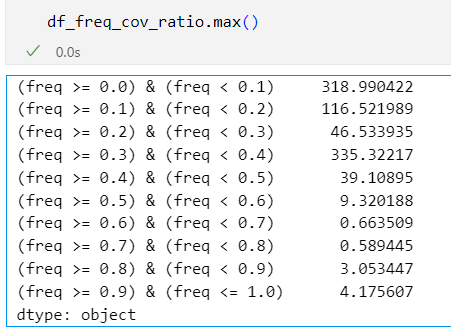
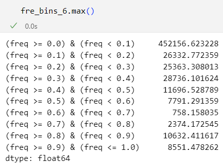
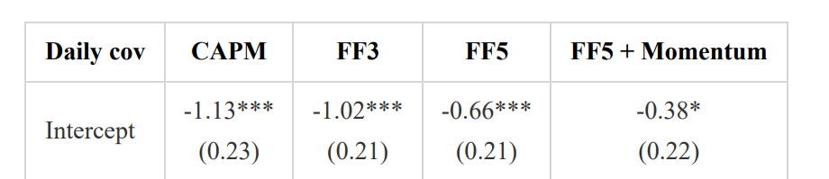

# Risk price test based on GLS, Ridge and Shrinkage

本报告检验了三种改进风险价格 $b$ 估计的方法，分别是 two-pass GLS 回归，Ridge 回归以及 GLS + Ridge 回归，并报告了后续的实证结果。

## Methodology

### Two-pass GLS CSR

此处表达与 [GLS CSR](/Log_Book/20240201.md) 中不同，区别在于将因变量变为了**超额收益率**，简化了表达，同时统一了三种方法的表示形式。

损失函数为：

$$
\begin{equation}
    \begin{aligned}
        \hat{b}&=\underset{b}{\argmin}(\mu_R-C_{Rf}b)^{\prime} V_R^{-1} (\mu_R-C_{Rf}b) \\
        &=(C_{Rf}^TV_R^{-1}C_{Rf})^{-1}C_{Rf}^TV_R^{-1}\mu_R.
    \end{aligned}
\end{equation}
$$

where $C_{Rf}$ is the covariance bewteen test assets and factors with dimension $N \times K$, $K$ is number of factors, $V_R$ is the covariance matrix the stocks with dimension $N \times N$.

### Naive Ridge penalty-regression

如果只加 ridge，那么损失函数为

$$
\begin{equation}
    \begin{aligned}
        \hat{b}&=\underset{b}{\argmin} \left\{(\mu_R-C_{Rf}b)^{\prime} (\mu_R-C_{Rf}b) + \gamma b'b \right\} \\
        &= (\gamma I + C_{Rf}^T C_{Rf})^{-1} C_{Rf}^T \mu_R
    \end{aligned}
\end{equation}
$$

### Shrinkage

在 GLS 的基础上加 ridge 后的损失函数为

$$
\begin{equation}
    \begin{aligned}
    \hat{b}&=\underset{b}{\argmin}\left\{(\mu_R-C_{Rf}b)^{\prime} V_R^{-1} (\mu_R-C_{Rf}b) + \gamma b'b \right\} \\
    &= (\gamma I + C_{Rf}^T V_R^{-1} C_{Rf})^{-1} C_{Rf}^T V_R^{-1} \mu_R
\end{aligned}
\end{equation}
$$

在 GLS 的基础上加 ridge，十分类似于 shrinking 的损失函数【以下简称shrinkage】，但是由于权重函数和模型设定不同，因此惩罚项并不具有最大夏普率平方的解释。

## Results

当股票数据为日频时，各方法估计量如下：

| Method | Mkt-RF | SMB	 |HML | ST-Rev | LT-Rev | Mom |
|:----:|:------:|:-------:|:------:|:-------:|:------:|:-------:|
| OLS  | -5.69 | -20.4  | -31.12 | -8.29 | -13.92 | 6.24 |
| GLS  |  24.94 | -65.74 | 34.52 | -39.43 | 115.97 | -4.56 |
| **Ridge** | -2.93  | -3.05 | -0.04 | -0.48 |-1.99 | 0.45 |
| GLS+Ridge |  26.57 | -187.07 | -17.17 |130.95 | -70.41 |-326.99 |

关于这个结果，有几点需要强调：

1. OLS 估计的结果全部显著，但是在随后的频率计算中引致了极大的不稳定性

2. GLS 的估计结果极为不稳定，这是因为我们将股票**日频**收益率的协方差矩阵的逆作为权重矩阵，而这一协方差矩阵本身就包含了极大的噪音

3. 进一步研究发现，通过股票日频收益率计算得出的协方差矩阵不是正定矩阵，这令我十分费解，在网上查了一下，发现这一现象十分普遍，有不少人都发现协方差矩阵非正定。主要原因是协方差矩阵奇异，which means that *at least one of your variables can be expressed as a linear combination of the others.*

4. Ridge 起到了收缩的作用，效果还不错，下面就用 ridge 的结果进行频率计算

### Ridge for frequency

在计算 Ridge 回归的时候，为了先得到初步结果，ridge 惩罚项的超参数直接选了 **0.0001**，选取了一天，计算效果还可以，最大值似乎都还可以接受：

于是跑满全部日期，还是有极大值的出现

所以只能说是在一定程度上缓解了这种情况。

不过，些许的缓解已经能够带来**效果的提升**，下面三个表分别是 Ridge 参数在不同取值下的情况：

Ridge_gamma = 0.001

|           | CAPM             | FF3               | FF5                | FF5 + Momentum     |
|:----------|:-----------------|:------------------|:-------------------|:-------------------|
| Intercept | 0.31*** (0.1) | 0.25** (0.1)   | 0.3** (0.12)    | 0.37*** (0.13)  |
| mktrf     | -0.05* (0.03) | -0.1*** (0.03) | -0.12*** (0.03) | -0.13*** (0.03) |
| smb       |                | 0.3*** (0.06)  | 0.27*** (0.06)  | 0.27*** (0.06)  |
| hml       |                | 0.04 (0.08)    | 0.05 (0.09)     | -0.0 (0.09)     |
| rmw       |                |                 | -0.16* (0.08)   | -0.14* (0.07)   |
| cma       |                |                 | -0.0 (0.13)     | 0.03 (0.12)     |
| umd       |                |                 |                  | -0.1* (0.05)    |
| Adj. R2   | 0.01             | 0.12              | 0.13               | 0.15               |

Ridge_gamma = 0.0001

|           | CAPM             | FF3                | FF5                | FF5 + Momentum     |
|:----------|:-----------------|:-------------------|:-------------------|:-------------------|
| Intercept | 0.31*** (0.1) | 0.24** (0.09)   | 0.28*** (0.1)   | 0.32*** (0.11)  |
| mktrf     | -0.04 (0.03)  | -0.08*** (0.03) | -0.08*** (0.03) | -0.09*** (0.03) |
| smb       |                | 0.24*** (0.06)  | 0.21*** (0.06)  | 0.21*** (0.06)  |
| hml       |                | 0.09 (0.07)     | 0.08 (0.09)     | 0.05 (0.08)     |
| rmw       |                |                  | -0.13* (0.08)   | -0.12* (0.07)   |
| cma       |                |                  | 0.04 (0.11)     | 0.05 (0.1)      |
| umd       |                |                  |                  | -0.06 (0.04)    |
| Adj. R2   | 0.0              | 0.09               | 0.1                | 0.11               |

Ridge_gamma = 0.00001

|           | CAPM             | FF3               | FF5              | FF5 + Momentum   |
|:----------|:-----------------|:------------------|:-----------------|:-----------------|
| Intercept | 0.17** (0.07) | 0.13* (0.08)   | 0.15** (0.08) | 0.17** (0.08) |
| mktrf     | 0.01 (0.02)   | -0.01 (0.02)   | -0.02 (0.03)  | -0.02 (0.03)  |
| smb       |                | 0.17*** (0.06) | 0.16** (0.06) | 0.16** (0.06) |
| hml       |                | 0.04 (0.06)    | 0.07 (0.08)   | 0.06 (0.08)   |
| rmw       |                |                 | -0.04 (0.06)  | -0.03 (0.06)  |
| cma       |                |                 | -0.07 (0.1)   | -0.06 (0.09)  |
| umd       |                |                 |                | -0.02 (0.03)  |
| Adj. R2   | -0.0             | 0.06              | 0.06             | 0.06             |

JFE replication

## 总结

经过 ridge 调整后，低频部分从没有 alpha 升级成了 alpha 显著，尽管数值上还与 JFE 那篇有差距，但是有一个明显不同的趋势是，随着因子数目的不断增加，**alpha 反而越来越显著了**【JFE是显著越来越低】。

目前还有待尝试的方向就是 GLS，如果能够使用月频数据或 portfolio 去做，降低噪音，那么也许结果也还可以，因为本报告的参考 JF 就是使用的月频 portfolio。

