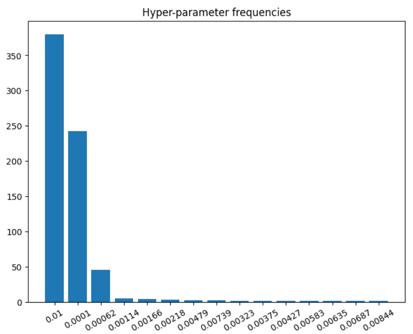
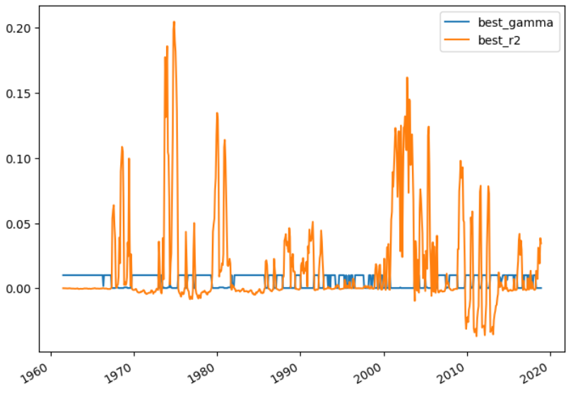

# K-fold ridge gamma

## 估计流程

原先以为超参数的选取标准应该是哪一个风险价格有更好的夏普比率表现，经老师提醒后应该为 ridge gamma 应该只与回归效果有关，如果 ridge 回归效果好不能使得结果好，那么是就应该再进一步提升回归方法，而不应该以夏普比率为导向。

1. 在 $t$ 时间点选取过去五年的股票数据，进行 5-fold，四年为 train，一年为 valid
2. 在 train data 中，选择缺失值不多于两年的股票，计算其均值和与因子的协方差，基于所有的 ridge 超参数回归得到风险价格 $b$
3. 将所有超参数对应的风险价格 $b$，在 valid data 中使用，计算 $R$ 方，并选择最优结果对应的超参数
4. 选择该超参数进行频率计算

## Results

经过调整后，代码结果如下，非常接近于原来的结果，略有下降：

|           | CAPM             | FF3                | FF5                | FF5 + Momentum     |
|:----------|:-----------------|:-------------------|:-------------------|:-------------------|
| Intercept | 0.3*** (0.1)  | 0.22** (0.1)    | 0.26** (0.11)   | 0.33*** (0.11)  |
| mktrf     | -0.05* (0.03) | -0.09*** (0.03) | -0.09*** (0.03) | -0.11*** (0.03) |
| smb       |                | 0.26*** (0.06)  | 0.23*** (0.07)  | 0.24*** (0.07)  |
| hml       |                | 0.11 (0.07)     | 0.1 (0.1)       | 0.05 (0.09)     |
| rmw       |                |                  | -0.14 (0.09)    | -0.12 (0.08)    |
| cma       |                |                  | 0.03 (0.12)     | 0.06 (0.11)     |
| umd       |                |                  |                  | -0.09** (0.04)  |
| Adj. R2   | 0.01             | 0.11               | 0.13               | 0.15               |

甚至略有下降，以下为原有结果，当固定 ridge 超参数为 0.0001 时。

|           | CAPM             | FF3               | FF5                | FF5 + Momentum     |
|:----------|:-----------------|:------------------|:-------------------|:-------------------|
| Intercept | 0.31*** (0.1) | 0.25** (0.1)   | 0.3** (0.12)    | 0.37*** (0.13)  |
| mktrf     | -0.05* (0.03) | -0.1*** (0.03) | -0.12*** (0.03) | -0.13*** (0.03) |
| smb       |                | 0.3*** (0.06)  | 0.27*** (0.06)  | 0.27*** (0.06)  |
| hml       |                | 0.04 (0.08)    | 0.05 (0.09)     | -0.0 (0.09)     |
| rmw       |                |                 | -0.16* (0.08)   | -0.14* (0.07)   |
| cma       |                |                 | -0.0 (0.13)     | 0.03 (0.12)     |
| umd       |                |                 |                  | -0.1* (0.05)    |
| Adj. R2   | 0.01             | 0.12              | 0.13               | 0.15               |

接下来具体看一下超参数的选取情况和验证集 $R$ 方估计量：

### 超参数

超参数的范围设置是从 0.01-0.0001 等距离 20 个数，选取频率如下，可以看到要么比较大，要么比较小，范围比较极化

### 验证集 $R$ 方

## Plan

目前还有的改进方向就是将 ridge 回归的显著性考虑进去，例如将不显著的因子去除，但是这个并不如我想象中简单。

有如下说法，通过惩罚回归得到的系数是显著有偏的，因此在这种情况下计算标准误没什么意义

> Standard errors are not very meaningful for strongly biased estimates such as arise from penalized estimation methods.
>
> Penalized estimation is a procedure that reduces the variance of estimators by introducing **substantial bias**.

在大多数情况下，根本无法得到这种 bias 的估计。在实际操作中，介绍了一种 bootstrap 方法，文章如下：

> Capur M. Bootstrap estimation of standard error of ridge estimates[J]. 2006.

但是话说回来，ridge 方法本身已经对回归系数进行了惩罚，不显著的系数可能值已经变得很小了，这样做不确定是否还有意义。

根据现有的报告，超参数对于主要实验结果影响不大，均是 $\alpha$ 弱于单频率分解因子，但是呈现出的效果是当解释因子越多，$\alpha$ 反而越显著，这一点十分 robust。

个人认为，目前值得研究的问题是，频率因子的本质是什么，也许只有知道了这一点，才能将现有的实验结果融会贯通。

