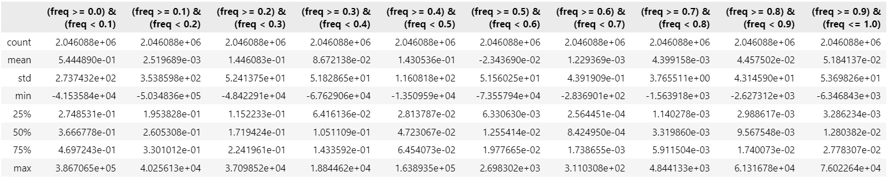
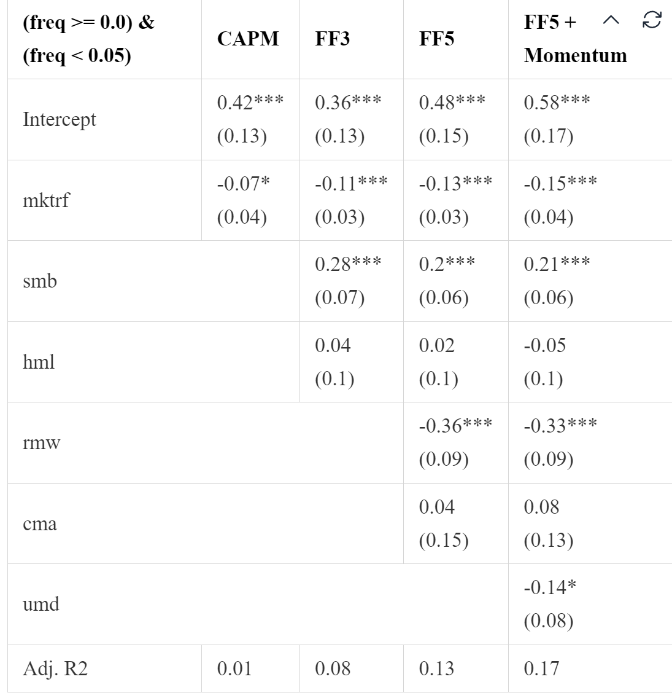

# Improvement on estimation of risk price

沿着年前的工作，接下来又尝试了 lasso + ridge 的估计组合，效果并不是很好。具体来说，原本仅使用 ridge 的时候，超参数的选择在 $10^{-2}$ 至 $10^{-4}$ 之间，并且由于 ridge 不具备稀疏性，所以无论超参数取值为何，最终总是能得到最起码看上去过得去的估计结果。然而，由于 ridge 有平方，lasso 没有平方，因此 lasso 的惩罚力度天然比 ridge 要大，经过实验，lasso 的超参数需要取到最大为 $10^{-6}$ 才能够使得估计参数不全为零。

在设置了控制惩罚力度的变量 $\alpha$ 的范围为 $10^{-4}$ 至 $10^{-8}$，并且 l1 ratio 在 elastic net 中所占比重为 $[0,0.25,0.5,0.75,1]$ 后，得到的估计中，反而当估计参数**全为零**时效果最好。这是因为 $R$ 方公式为

$$
R^2 = 1 - \frac{(y-\hat{y})^2}{y^2},
$$

因此，当估计参数全为零时， $R^2$ 为零，而当估计参数不为零时，$R^2$ 反而是负数，因此模型最终会输出所有的估计参数均为零。

这显然不是我们想要的结果，究其原因，该是数据中噪音实在是太大了，使得估计结果出现极为严重的误差，接下来根据老师的建议和自己的想法，试验两种改进方向【均为 **Ridge**】，（1） 仅使用两因子进行估计，（2）改用个股月频收益率。

## Market + Momentum

在两因子下，仍然有极大值的存在，对于最低频来说，最大值在 $10^{5}$ 量级，最小为 $-10^{4}$ 量级。

然而，这一操作却得到了有效的提升，各项 $\alpha$ 相对于原来均有增强，特别是因子最多的组合，提升极为明显，逼近论文结果：

|           | CAPM              | FF3               | FF5                | FF5 + Momentum     |
|:----------|:------------------|:------------------|:-------------------|:-------------------|
| Intercept | 0.34*** (0.12) | 0.29** (0.11)  | 0.38*** (0.14)  | **0.47** *** (0.15)  |
| mktrf     | -0.06* (0.03)  | -0.1*** (0.03) | -0.12*** (0.03) | -0.14*** (0.04) |
| smb       |                 | 0.24*** (0.06) | 0.19*** (0.07)  | 0.2*** (0.06)   |
| hml       |                 | 0.05 (0.1)     | 0.08 (0.1)      | 0.02 (0.1)      |
| rmw       |                 |                 | -0.21* (0.12)   | -0.18* (0.1)    |
| cma       |                 |                 | -0.08 (0.16)    | -0.03 (0.14)    |
| umd       |                 |                 |                  | -0.13** (0.07)  |
| Adj. R2   | 0.01              | 0.07              | 0.09               | 0.12               |

**原多因子结果**如下：

|           | CAPM              | FF3                | FF5               | FF5 + Momentum     |
|:----------|:------------------|:-------------------|:------------------|:-------------------|
| Intercept | 0.33*** (0.12) | 0.27** (0.11)   | 0.32*** (0.12) | 0.38*** (0.13)  |
| mktrf     | -0.05 (0.03)   | -0.09*** (0.03) | -0.1*** (0.03) | -0.12*** (0.03) |
| smb       |                 | 0.31*** (0.06)  | 0.28*** (0.07) | 0.28*** (0.07)  |
| hml       |                 | 0.07 (0.08)     | 0.08 (0.1)     | 0.04 (0.1)      |
| rmw       |                 |                  | -0.13 (0.09)   | -0.11 (0.08)    |
| cma       |                 |                  | -0.02 (0.12)   | 0.01 (0.11)     |
| umd       |                 |                  |                 | -0.09** (0.04)  |
| Adj. R2   | 0.01              | 0.13               | 0.13              | 0.15               |

**论文结果**如下：

首先，这一结果说明了老师的思路十分直觉且透彻，其次，关于这一结果，我有以下思考：

1. **结果的提升说明了什么？**

当我们把所有六因子纳入回归中，效果不如当前只用两个因子，而两个因子，效果又不如原论文中的市场因子，那么是否说明：**除了market 其他因子加进去都是负作用？**

这当然是一种思考，只不过比较消极，而且有些不合常理之处。我认为这是由于因子的显著性导致的：之前全因子回归时，很多因子可能都不显著，加进去大大干扰结果，去掉这些不显著的因子之后，效果自然有了明显的提升。

那为什么 momentum 加进去反而不如market，因为**第一**，此时存在回归，也就是在 market 前面有个参数，这就与原论文中的 market 不同；**第二**，因为有参数，那就可能有时候在 momentum 或 market 不显著的时候也给加进来了，所以造成了影响。因此，我认为，**只要有回归，就要考虑参数的显著性**，就会对现有结果产生提升。

> 这一点在年前的报告中我提过，我当时的想法是，ridge 已经对结果做了压缩，还有必要在考虑显著性吗，现在看来应该是有的

2. **为什么 $\alpha$ 随着因子数量增加反而越来越大了？**

这一现象在当时读论文时就已经引起我的注意，在现有的结果下，更加显著。当时的想法是，频率因子是超脱于这些因子之外的维度，所以尽管因子数量不断增加，对于原结果也于事无补。

这一点在当时我深以为然，但是现在情况又有所不同了，在多因子的 $\alpha$ 显著高于单因子的 $\alpha$，令我十分费解。

## 个股月频收益率

在理论上，公式

$$
\mu = C b
$$

中的风险价格 $b$ 代表着 SDF 中各因子的权重，但对于各因子来说，并没有规定使用的应该是日频收益率还是月频收益率。在理想情况下，金融市场中当然应该只存在一个 SDF，也就是说，**当数据中并不包含噪声时，日频收益率或月频收益率对应的应该是同一个风险价格 $b$** 。

所以，既然日频数据估计出的风险价格 $b$ 并不准确，我们就可以使用月频数据估计 $b$，反正理论上对应的是一个 $b$。

两因子

|           | CAPM             | FF3              | FF5               | FF5 + Momentum    |
|:----------|:-----------------|:-----------------|:------------------|:------------------|
| Intercept | 0.26** (0.11) | 0.2* (0.11)   | 0.28** (0.14)  | 0.39*** (0.14) |
| mktrf     | -0.03 (0.03)  | -0.06* (0.03) | -0.08** (0.04) | -0.1*** (0.04) |
| smb       |                | 0.2** (0.08)  | 0.17** (0.08)  | 0.18** (0.07)  |
| hml       |                | 0.09 (0.1)    | 0.18 (0.11)    | 0.09 (0.1)     |
| rmw       |                |                | -0.13 (0.14)   | -0.09 (0.11)   |
| cma       |                |                | -0.18 (0.16)   | -0.12 (0.13)   |
| umd       |                |                |                 | -0.16** (0.07) |
| Adj. R2   | 0.0              | 0.05             | 0.06              | 0.11              |

多因子

|           | CAPM            | FF3               | FF5               | FF5 + Momentum    |
|:----------|:----------------|:------------------|:------------------|:------------------|
| Intercept | 0.21** (0.1) | 0.2** (0.09)   | 0.23** (0.1)   | 0.27** (0.11)  |
| mktrf     | -0.01 (0.02) | -0.05* (0.02)  | -0.05** (0.02) | -0.06** (0.02) |
| smb       |               | 0.15*** (0.03) | 0.13*** (0.03) | 0.13*** (0.03) |
| hml       |               | -0.01 (0.05)   | 0.0 (0.05)     | -0.03 (0.05)   |
| rmw       |               |                 | -0.09 (0.06)   | -0.08 (0.05)   |
| cma       |               |                 | -0.03 (0.07)   | -0.01 (0.06)   |
| umd       |               |                 |                 | -0.05 (0.04)   |
| Adj. R2   | -0.0            | 0.04              | 0.05              | 0.06              |

无论是多因子还是单因子，月频估计的效果都要低于日频，这可能是由于月频数据量少于日频，在计算协方差时有一定误差导致的。

但是即使在月频中，两因子的效果也强于多因子，这又回到了第一点中我的想法。

## Plan

那么接下来，我的想法是考虑 **回归系数的显著性** ，即，找出回归中真正有用的因子，在这种情况下，就可以考虑多加入一些因子，例如反转，长期反转或短期反转。

但是需要注意的是，在 ridge 的情况下，显著性的考虑和 OLS 的情况下不同，

> Standard errors are not very meaningful for strongly biased estimates such as arise from penalized estimation methods.
>
> Penalized estimation is a procedure that reduces the variance of estimators by introducing **substantial bias**.

具体还有待下一步研究。

