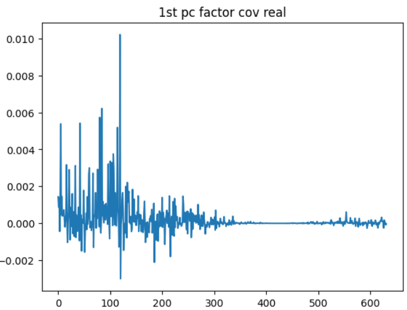
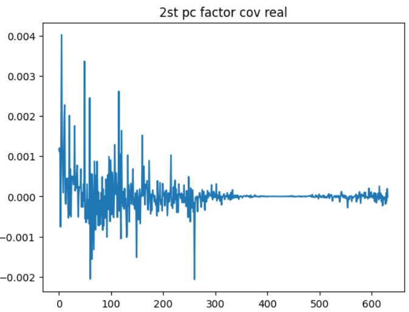

# Explorations for frequency decomposition

## SVD

### 理论

如果 $A$ 是 $n \times n$ 维对称方阵，那么 $A$ 就有实特征值 $\lambda_1,\cdots,v_n$ 以及正交基 $v_1,\cdots,v_n$，其中每一个向量 $v_i$ 都是 $A$ 的一个特征向量，对应特征值为 $\lambda_1$。于是有

$$
A = PDP^{-1}
$$

其中矩阵 $P$ 的列为 $v_1,\cdots,v_n$，并且 $D$ 是对角矩阵，对角元素为 $\lambda_1,\cdots,\lambda_n$，既然特征向量为正交向量，那么矩阵 $P$ 也是正交矩阵 $P^T P = I$，所以上式也可以写成

$$
A = PDP^T
$$

SVD 可以理解为特征值分解的泛化情况，当 $A$ 不为对称阵或方阵时，仍然可以如此分解。

#### Singular Values <!-- {docsify-ignore} -->

对于 $m \times n$ 维矩阵 $A$ 来说，矩阵 $A^TA$ 为 $n \times n$ 维对称矩阵，所以其特征值为实数，记为 $\lambda$，则 $\lambda \geq 0$。

将矩阵 $A^TA$ 的特征值表示为 $\lambda_1,\cdots,\lambda_n$，排序为 $\lambda_1 \geq \lambda_2 \geq \cdots \geq \lambda_n \geq 0$。令 $\sigma_i = \sqrt{\lambda_i}$，所以 $\sigma_1 \geq \sigma_2 \geq \sigma_n \geq 0$，这些 $\sigma_i$ 就称之为**奇异值**，并且，**奇异值的数目就等于矩阵 $A$ 的秩**。

#### Singular value decomposition  <!-- {docsify-ignore} -->

$m \times n$ 维矩阵 $A$ 的秩为 $r$，$A$ 的 SVD 为：

$$
A = U DV^T
$$

其中，

1. $U$ 是 $m \times m$ 维正交矩阵
2. $V$ 是 $n \times n$ 维正交矩阵
3. $\Sigma$ 是 $m \times n$ 维矩阵，其中第 $i$ 个对角元素等于第 $i$ 个奇异值，$\Sigma$ 的其他所有元素都为零。

#### The relationship  <!-- {docsify-ignore} -->

对于 $m \times n$ 维矩阵 $A$，可以得到 $n \times n$ 维的方阵 $A^TA$，既然是方阵，就可以进行特征值分解，得到特征值和特征向量：

$$
(A^TA)v_i = \lambda_i v_i
$$

将 $A^TA$ 的所有特征向量组合成一个 $n \times n$ 维的矩阵 $V$，这也就是 SVD 中的 $V$ 矩阵了，一般将 $V$ 中的每个特征向量叫做 $A$ 的右奇异向量。

同理，对于 $m \times m$ 维方阵 $AA^T$，可以得到：

$$
(AA^T)u_i = \lambda_i u_i
$$

将 $AA^T$ 的所有特征向量组合成一个 $m \times m$ 维的矩阵 $V$，这也就是 SVD 中的 $U$ 矩阵，其中的每一个特征向量称之为左奇异向量。

**证明** (以 $AA^T$ 为例)

$$
\begin{aligned}
    A &= UDV^T,A^T = VD^TU^T \\
    \Longrightarrow A^TA &= VD^TU^T UDV^T = V D^2V^T
\end{aligned}
$$

从这里也可以看出奇异值与特征值之间的关系，特征值是奇异值的平方

$$
\sigma_i = \sqrt{\lambda_i}
$$

#### SVD and PCA <!-- {docsify-ignore} -->

假设我们有一个去中心化的数据矩阵 $X \in \mathbb{R}^{n\times p}$，其中 $n$ 是样本数，$p$ 是特征数。

PCA 旨在找到一个正交变换，将数据投影到一个新的坐标系中，使得在新坐标系中的方差最大化。这可以通过对协方差矩阵 $C = \frac{1}{n-1}X^TX$ 进行特征分解来实现。意为，协方差矩阵的特征向量对应于主成分的方向，而特征值对应于这些方向上的方差。

因为 $X$ 可以进行奇异值分解 $X = U\Sigma V^T$，所以协方差矩阵可以写成

$$
C = \frac{1}{n-1}X^TX = \frac{1}{n-1} V \Sigma^2 V^T
$$

因为 $X^TXV = V\Sigma^2$，这意味着 $V$ 的列向量是协方差矩阵 $C$ 的特征向量，也即， **$V$ 的列向量就是 PCA 的主成分方向** 。

### 实证

从数据方面来看，取 market + size 的第二个因子基本上没什么作用

|           | CAPM           | FF3               | FF5               | FF5 + Momentum    |
|:----------|:---------------|:------------------|:------------------|:------------------|
| Intercept | 0.07 (0.05) | 0.06 (0.05)    | 0.08 (0.05)    | 0.1* (0.06)    |
| mktrf     | -0.0 (0.01) | -0.03** (0.01) | -0.04** (0.02) | -0.04** (0.02) |
| smb       |              | 0.13*** (0.02) | 0.11*** (0.02) | 0.11*** (0.02) |
| hml       |              | -0.02 (0.03)   | -0.01 (0.03)   | -0.02 (0.03)   |
| rmw       |              |                 | -0.06 (0.04)   | -0.06 (0.04)   |
| cma       |              |                 | -0.01 (0.05)   | -0.0 (0.05)    |
| umd       |              |                 |                 | -0.02 (0.02)   |
| Adj. R2   | -0.0           | 0.08              | 0.08              | 0.08              |

具体来看，两个因子与股票分解后的频率实部如下，可以看到第一个因子的确相比于第二个因子来说实部取值高出许多：

实部的累加等于该因子和股票的协方差，以下表格对比 SVD 前和 SVD 后的协方差表现，可以看到 SVD 的确把其他因子的一部分能量转移到了主要的因子中。

||1st factor| 2nd factor|
|:----------:|:----------:|:----------:|
|Before SVD|313.23|86.61|
|After SVD|-324.72|12.86|

