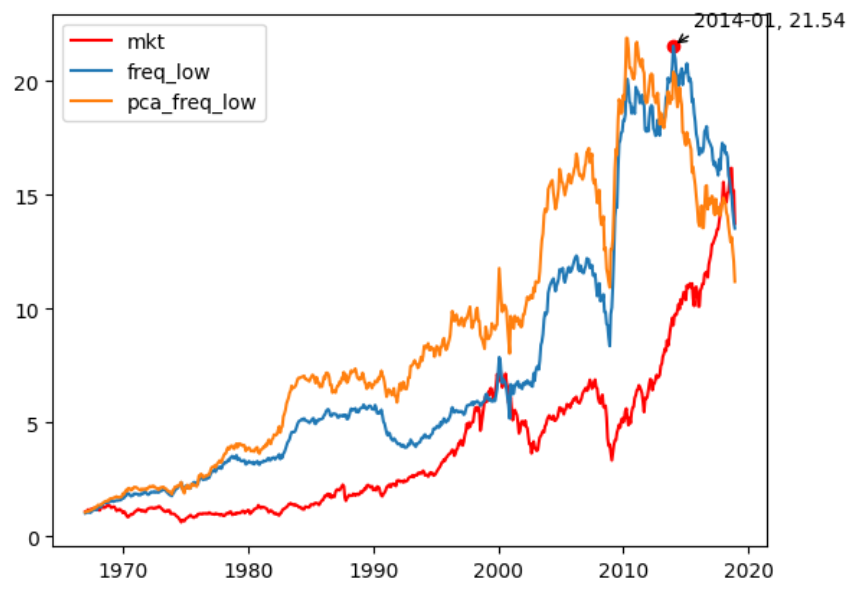
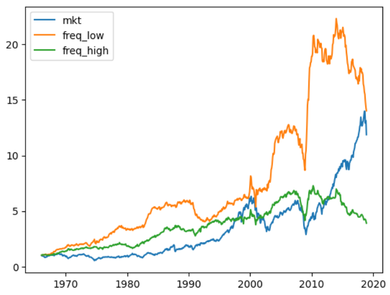
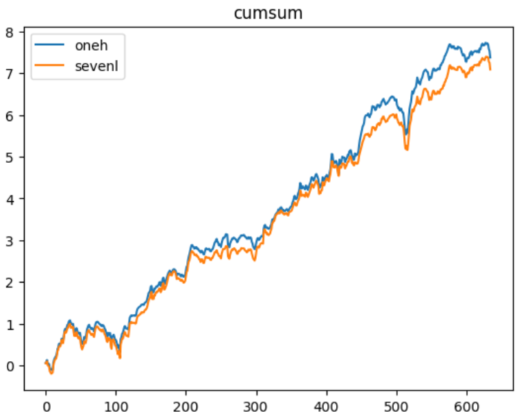

# Details about code

经过对代码的仔细检查，发现了两个问题，首先，导致结果大幅下滑的原因是**没有对市场收益率数据做三天 rolling 处理**，这一操作的影响超乎想象的大。

其次，还有一点就是，是否考虑最高频率，当样本个数为偶数时，分解后的正频率会比负频率多一个最高频率，因为我们想要关注的是低频部分，但是高频部分的存在就会使得对每只个股来说低频的占比降低。这一操作影响还是很大的，基本上在 10% 左右，也就是说，在原论文的基础上，仅仅不考虑最高频率，就已经可以带来 10% 的提升了。

考虑最高频率

|           | CAPM             | FF3                | FF5                | FF5 + Momentum     |
|:----------|:-----------------|:-------------------|:-------------------|:-------------------|
| Intercept | 0.4*** (0.13) | 0.36*** (0.13)  | 0.47*** (0.15)  | 0.56*** (0.17)  |
| mktrf     | -0.07* (0.04) | -0.11*** (0.03) | -0.13*** (0.03) | -0.15*** (0.04) |
| smb       |                | 0.25*** (0.07)  | 0.17*** (0.06)  | 0.17*** (0.06)  |
| hml       |                | 0.03 (0.1)      | 0.02 (0.09)     | -0.06 (0.1)     |
| rmw       |                |                  | -0.35*** (0.09) | -0.32*** (0.08) |
| cma       |                |                  | 0.05 (0.15)     | 0.09 (0.13)     |
| umd       |                |                  |                  | -0.13* (0.07)   |
| Adj. R2   | 0.01             | 0.07               | 0.12               | 0.15               |

不考虑最高频率

|           | CAPM              | FF3               | FF5                | FF5 + Momentum     |
|:----------|:------------------|:------------------|:-------------------|:-------------------|
| Intercept | 0.48*** (0.14) | 0.45*** (0.14) | 0.58*** (0.16)  | 0.69*** (0.19)  |
| mktrf     | -0.03 (0.04)   | -0.09** (0.04) | -0.11*** (0.04) | -0.14*** (0.04) |
| smb       |                 | 0.3*** (0.06)  | 0.21*** (0.06)  | 0.22*** (0.06)  |
| hml       |                 | -0.02 (0.1)    | -0.02 (0.1)     | -0.1 (0.1)      |
| rmw       |                 |                 | -0.37*** (0.09) | -0.34*** (0.08) |
| cma       |                 |                 | 0.01 (0.15)     | 0.07 (0.12)     |
| umd       |                 |                 |                  | -0.16** (0.08)  |
| Adj. R2   | 0.0               | 0.08              | 0.14               | 0.18               |

沿着这个思路，我们来看一下完全不要高频（把频率最高的两个组去掉再归一化），只计算低频占中低频的比例，效果差不多，比原来的好，但是不如不考虑最高频。

|           | CAPM              | FF3               | FF5                | FF5 + Momentum     |
|:----------|:------------------|:------------------|:-------------------|:-------------------|
| Intercept | 0.44*** (0.14) | 0.42*** (0.14) | 0.55*** (0.15)  | 0.66*** (0.18)  |
| mktrf     | -0.02 (0.04)   | -0.09** (0.04) | -0.11*** (0.04) | -0.13*** (0.04) |
| smb       |                 | 0.33*** (0.06) | 0.24*** (0.06)  | 0.25*** (0.06)  |
| hml       |                 | -0.04 (0.1)    | -0.05 (0.1)     | -0.13 (0.1)     |
| rmw       |                 |                 | -0.37*** (0.08) | -0.34*** (0.07) |
| cma       |                 |                 | 0.02 (0.14)     | 0.08 (0.11)     |
| umd       |                 |                 |                  | -0.17** (0.07)  |
| Adj. R2   | -0.0              | 0.1               | 0.16               | 0.21               |

## 详细对比低频内各组表现

### PC factors

|           | 1.0               | 2.0                | 3.0                | 4.0                | 5.0                |
|:----------|:------------------|:-------------------|:-------------------|:-------------------|:-------------------|
| Intercept | 0.02 (0.08)    | 0.15*** (0.06)  | 0.21*** (0.06)  | 0.22*** (0.07)  | 0.24*** (0.08)  |
| mktrf     | 0.87*** (0.03) | 1.01*** (0.02)  | 1.05*** (0.02)  | 1.07*** (0.02)  | 1.04*** (0.03)  |
| smb       | 0.48*** (0.04) | 0.66*** (0.04)  | 0.78*** (0.04)  | 0.84*** (0.04)  | 0.89*** (0.04)  |
| hml       | 0.09 (0.06)    | -0.03 (0.04)    | -0.06 (0.04)    | -0.04 (0.06)    | 0.01 (0.06)     |
| rmw       | 0.19*** (0.05) | -0.02 (0.05)    | -0.06 (0.05)    | -0.16*** (0.06) | -0.18*** (0.05) |
| cma       | 0.14** (0.07)  | 0.06 (0.04)     | 0.12** (0.05)   | 0.09 (0.06)     | 0.06 (0.07)     |
| umd       | -0.01 (0.03)   | -0.13*** (0.02) | -0.18*** (0.03) | -0.18*** (0.03) | -0.21*** (0.04) |
| Adj. R2   | 0.86              | 0.95               | 0.95               | 0.95               | 0.95               |

|           | 6.0                | 7.0                | 8.0                | 9.0                | 10.0              | long_short         |
|:----------|:-------------------|:-------------------|:-------------------|:-------------------|:------------------|:-------------------|
| Intercept | 0.32*** (0.09)  | 0.4*** (0.13)   | 0.46*** (0.13)  | 0.51*** (0.16)  | 0.6*** (0.16)  | 0.58*** (0.16)  |
| mktrf     | 1.04*** (0.02)  | 1.0*** (0.03)   | 0.97*** (0.03)  | 0.87*** (0.03)  | 0.72*** (0.04) | -0.14*** (0.04) |
| smb       | 0.98*** (0.04)  | 1.03*** (0.04)  | 1.04*** (0.04)  | 1.02*** (0.04)  | 0.89*** (0.06) | 0.42*** (0.06)  |
| hml       | 0.03 (0.05)     | 0.01 (0.06)     | 0.07 (0.07)     | 0.06 (0.08)     | 0.07 (0.1)     | -0.02 (0.11)    |
| rmw       | -0.18*** (0.06) | -0.22*** (0.06) | -0.19*** (0.07) | -0.22*** (0.06) | -0.12 (0.08)   | -0.31*** (0.08) |
| cma       | 0.08 (0.07)     | 0.09 (0.09)     | 0.13 (0.09)     | 0.09 (0.1)      | 0.2 (0.13)     | 0.06 (0.14)     |
| umd       | -0.21*** (0.04) | -0.25*** (0.06) | -0.26*** (0.06) | -0.19*** (0.07) | -0.13** (0.06) | -0.13** (0.06)  |
| Adj. R2   | 0.95               | 0.91               | 0.9                | 0.84               | 0.72              | 0.25               |

可以看到，对于 PC factors 的低频组合来说，有着非常明显的趋势：低频占比越高，$\alpha$ 则越显著，并且市场因子始终是最显著的因子。

### Market

|           | 1.0               | 2.0                | 3.0                | 4.0                | 5.0                |
|:----------|:------------------|:-------------------|:-------------------|:-------------------|:-------------------|
| Intercept | 0.04 (0.09)    | 0.04 (0.05)     | 0.1 (0.06)      | 0.19*** (0.06)  | 0.25*** (0.07)  |
| mktrf     | 0.86*** (0.03) | 1.01*** (0.02)  | 1.04*** (0.02)  | 1.05*** (0.02)  | 1.04*** (0.02)  |
| smb       | 0.7*** (0.05)  | 0.71*** (0.03)  | 0.81*** (0.04)  | 0.81*** (0.04)  | 0.89*** (0.04)  |
| hml       | 0.07 (0.06)    | 0.0 (0.04)      | 0.0 (0.04)      | -0.02 (0.05)    | -0.03 (0.06)    |
| rmw       | 0.1* (0.06)    | 0.03 (0.03)     | -0.08** (0.04)  | -0.09* (0.06)   | -0.12** (0.05)  |
| cma       | 0.14 (0.09)    | 0.1** (0.05)    | 0.01 (0.05)     | 0.04 (0.05)     | 0.11* (0.06)    |
| umd       | -0.02 (0.03)   | -0.08*** (0.02) | -0.15*** (0.02) | -0.18*** (0.02) | -0.21*** (0.03) |
| Adj. R2   | 0.83              | 0.95               | 0.95               | 0.95               | 0.95               |

|           | 6.0                | 7.0                | 8.0                | 9.0                | 10.0               | long_short         |
|:----------|:-------------------|:-------------------|:-------------------|:-------------------|:-------------------|:-------------------|
| Intercept | 0.36*** (0.1)   | 0.41*** (0.11)  | 0.55*** (0.14)  | 0.53*** (0.18)  | 0.74*** (0.19)  | 0.69*** (0.19)  |
| mktrf     | 1.01*** (0.02)  | 1.01*** (0.03)  | 0.96*** (0.04)  | 0.88*** (0.04)  | 0.73*** (0.04)  | -0.14*** (0.04) |
| smb       | 0.94*** (0.04)  | 0.97*** (0.04)  | 1.0*** (0.04)   | 1.0*** (0.04)   | 0.92*** (0.06)  | 0.22*** (0.06)  |
| hml       | 0.03 (0.05)     | 0.03 (0.06)     | 0.01 (0.07)     | 0.01 (0.08)     | -0.04 (0.1)     | -0.1 (0.1)      |
| rmw       | -0.18*** (0.06) | -0.2*** (0.06)  | -0.27*** (0.06) | -0.27*** (0.07) | -0.24*** (0.07) | -0.34*** (0.08) |
| cma       | -0.0 (0.06)     | 0.02 (0.07)     | 0.06 (0.09)     | 0.11 (0.11)     | 0.21 (0.13)     | 0.07 (0.12)     |
| umd       | -0.23*** (0.05) | -0.26*** (0.06) | -0.26*** (0.07) | -0.24*** (0.08) | -0.19** (0.07)  | -0.16** (0.08)  |
| Adj. R2   | 0.94               | 0.93               | 0.89               | 0.85               | 0.73               | 0.18               |

可以看到趋势基本上是一样的，只是市场组合的表现好于 pca 因子。

如果看收益率数据，可以发现近期回撤极大，高点出现在 2014-01，并且 pca 和市场频率分解策略呈现出极强的相似性，上升和回撤的时间节点基本相同，只是幅度不同。

于是我就想，会不会存在我之前说的假设，在不同市场情况下，频率因子的表现是不同的，例如在正常情况下，低频比较显著，但是在 crash 期间，也许高频也会有所帮助。所以也看一下高频组合的表现

|           | 1.0                | 2.0                | 3.0                | 4.0                | 5.0                |
|:----------|:-------------------|:-------------------|:-------------------|:-------------------|:-------------------|
| Intercept | 0.64*** (0.16)  | 0.47*** (0.13)  | 0.43*** (0.13)  | 0.34*** (0.1)   | 0.24*** (0.09)  |
| mktrf     | 0.73*** (0.04)  | 0.91*** (0.03)  | 0.97*** (0.03)  | 1.01*** (0.02)  | 1.03*** (0.02)  |
| smb       | 0.93*** (0.06)  | 0.94*** (0.04)  | 0.91*** (0.03)  | 0.84*** (0.04)  | 0.8*** (0.03)   |
| hml       | 0.07 (0.09)     | 0.01 (0.07)     | 0.0 (0.05)      | -0.02 (0.05)    | -0.05 (0.05)    |
| rmw       | -0.28*** (0.08) | -0.27*** (0.06) | -0.25*** (0.06) | -0.25*** (0.05) | -0.19*** (0.05) |
| cma       | 0.08 (0.12)     | 0.1 (0.09)      | 0.02 (0.08)     | 0.05 (0.06)     | 0.08 (0.06)     |
| umd       | -0.16** (0.06)  | -0.22*** (0.06) | -0.23*** (0.06) | -0.24*** (0.05) | -0.22*** (0.04) |
| Adj. R2   | 0.75               | 0.88               | 0.92               | 0.94               | 0.95               |

|           | 6.0                | 7.0                | 8.0                | 9.0                | 10.0              | long_short         |
|:----------|:-------------------|:-------------------|:-------------------|:-------------------|:------------------|:-------------------|
| Intercept | 0.29*** (0.07)  | 0.23*** (0.07)  | 0.15** (0.08)   | 0.14* (0.08)    | 0.29** (0.12)  | -0.35*** (0.13) |
| mktrf     | 1.05*** (0.02)  | 1.04*** (0.02)  | 1.03*** (0.02)  | 0.98*** (0.02)  | 0.82*** (0.04) | 0.09*** (0.03)  |
| smb       | 0.77*** (0.04)  | 0.78*** (0.04)  | 0.82*** (0.04)  | 0.93*** (0.04)  | 1.04*** (0.06) | 0.1*** (0.04)   |
| hml       | -0.01 (0.05)    | -0.02 (0.05)    | 0.01 (0.05)     | 0.03 (0.06)     | 0.05 (0.08)    | -0.01 (0.05)    |
| rmw       | -0.12** (0.06)  | -0.07 (0.05)    | 0.04 (0.06)     | 0.1* (0.06)     | -0.02 (0.07)   | 0.26*** (0.07)  |
| cma       | 0.04 (0.06)     | 0.07 (0.06)     | 0.09* (0.05)    | 0.1 (0.06)      | 0.19* (0.1)    | 0.11 (0.08)     |
| umd       | -0.21*** (0.03) | -0.18*** (0.03) | -0.17*** (0.03) | -0.12*** (0.03) | -0.07* (0.04)  | 0.09 (0.06)     |
| Adj. R2   | 0.95               | 0.95               | 0.94               | 0.92               | 0.8               | 0.08               |

可以看到高频组合的空头部分其实也相当显著，单论空头来说并没有逊色于低频的多头很多，只是单调性不及多头，但是高频占比少在一定程度上代表了低频占比多，存在一定的相关性。

对比二者的收益率走势，低频因子就相当于是一个指数增强，趋势上比较类似于市场因子，只是在最近发生了显著的背离。

我进一步研究了所有的频率组合，发现**基本上所有频率中的多头和空头都非常显著**，**唯一的区别是低频的单调性最好**。对于其他频率来说，多空头基本一致，这就是其他频率没有 $\alpha$ 的原因。但是令我觉得奇怪的是，所有的频率占比最多和最少的组合都有如此显著的 $\alpha$，究竟是为什么。

|        | 1.0               | 2.0               | 3.0               | 8.0               | 9.0               | 10.0              |
|:-------|:------------------|:------------------|:------------------|:------------------|:------------------|:------------------|
| freq_0 | 0.04 (0.09)    | 0.04 (0.05)    | 0.1 (0.06)     | 0.55*** (0.14) | 0.53*** (0.18) | 0.74*** (0.19) |
| freq_1 | 0.47*** (0.13) | 0.32*** (0.08) | 0.32*** (0.08) | 0.26*** (0.1)  | 0.2 (0.13)     | 0.49*** (0.15) |
| freq_2 | 0.54*** (0.13) | 0.38*** (0.12) | 0.36*** (0.13) | 0.21** (0.08)  | 0.25*** (0.09) | 0.46*** (0.14) |
| freq_3 | 0.59*** (0.15) | 0.34*** (0.12) | 0.29*** (0.1)  | 0.28*** (0.08) | 0.28*** (0.08) | 0.51*** (0.13) |
| freq_4 | 0.55*** (0.15) | 0.37*** (0.12) | 0.18** (0.08)  | 0.23*** (0.08) | 0.41*** (0.1)  | 0.53*** (0.14) |
| freq_5 | 0.64*** (0.17) | 0.39*** (0.12) | 0.37*** (0.1)  | 0.18** (0.07)  | 0.26*** (0.09) | 0.46*** (0.12) |
| freq_6 | 0.6*** (0.17)  | 0.34*** (0.11) | 0.25*** (0.08) | 0.34*** (0.1)  | 0.32*** (0.09) | 0.44*** (0.14) |
| freq_7 | 0.58*** (0.16) | 0.42*** (0.12) | 0.28*** (0.1)  | 0.23*** (0.07) | 0.3*** (0.08)  | 0.55*** (0.13) |
| freq_8 | 0.64*** (0.16) | 0.47*** (0.13) | 0.43*** (0.13) | 0.15** (0.08)  | 0.14* (0.08)   | 0.29** (0.12)  |

接下来我尝试用低频多头，解释其他所有的多头和空头

|           | onel agianst oneh   | twol agianst oneh   | twoh agianst oneh   | threel agianst oneh   | threeh agianst oneh   | fourl agianst oneh   | fourh agianst oneh   | fivel agianst oneh   |
|:----------|:--------------------|:--------------------|:--------------------|:----------------------|:----------------------|:---------------------|:---------------------|:---------------------|
| intercept | 0.47*** (0.14)   | 0.19** (0.09)    | 0.18** (0.08)    | 0.12* (0.07)       | 0.24*** (0.07)     | 0.15** (0.06)     | 0.19** (0.07)     | 0.13** (0.06)     |
| varibale  | 0.99*** (0.03)   | 0.96*** (0.02)   | 0.96*** (0.02)   | 0.98*** (0.02)     | 0.95*** (0.02)     | 0.94*** (0.02)    | 0.96*** (0.02)    | 0.97*** (0.02)    |
| Adi.R2    | 0.73                | 0.9                 | 0.92                | 0.93                  | 0.91                  | 0.93                 | 0.91                 | 0.94                 |

|           | fiveh agianst oneh   | sixl agianst oneh   | sixh agianst oneh   | **sevenl** agianst oneh   | sevenh agianst oneh   | eightl agianst oneh   | eighth agianst oneh   |
|:----------|:---------------------|:--------------------|:--------------------|:----------------------|:----------------------|:----------------------|:----------------------|
| intercept | 0.19** (0.08)     | 0.14** (0.06)    | 0.18** (0.09)    | 0.09 (0.06)        | 0.27*** (0.08)     | 0.15** (0.06)      | 0.14* (0.08)       |
| varibale  | 0.93*** (0.02)    | 0.95*** (0.02)   | 0.95*** (0.02)   | 0.96*** (0.02)     | 0.95*** (0.02)     | 0.95*** (0.02)     | 0.95*** (0.02)     |
| Adi.R2    | 0.91                 | 0.94                | 0.9                 | 0.93                  | 0.91                  | 0.94                  | 0.9                   |

只有一个偏高频占比最少的组合（sevenl）解释成功了，但是这其中包含了很多的相关性，因为低频占比高在一定程度上意味着高频占比低，二者的走势基本上也一样。于是我又反过来做了一下，oneh 也可以解释 sevenl。至于其他的因子，都无法解释 oneh。

综上，得到的结论是，**低频因子有最好的单调性和最好的表现，无疑是市场因子中的主要信息**（其他频率为什么有效果并不清楚，不过也许将市场分为10个组合，总有一些组合是有效的），但是这一策略在 2014 年之后直到 18 年底都没有再突破新高，证明这一策略也有失效的时候，而此时市场的涨幅巨大，也就是说，会有其他频率，在此时表现突出，而这一频率信息并不在市场因子中。我觉得这一假设存在的，只是不存在于单独的一个因子中。

于是接下来探索其他因子。

## 探索 Momentum

李煌师兄的数据用不了了，明天等挂上再研究其他因子。

