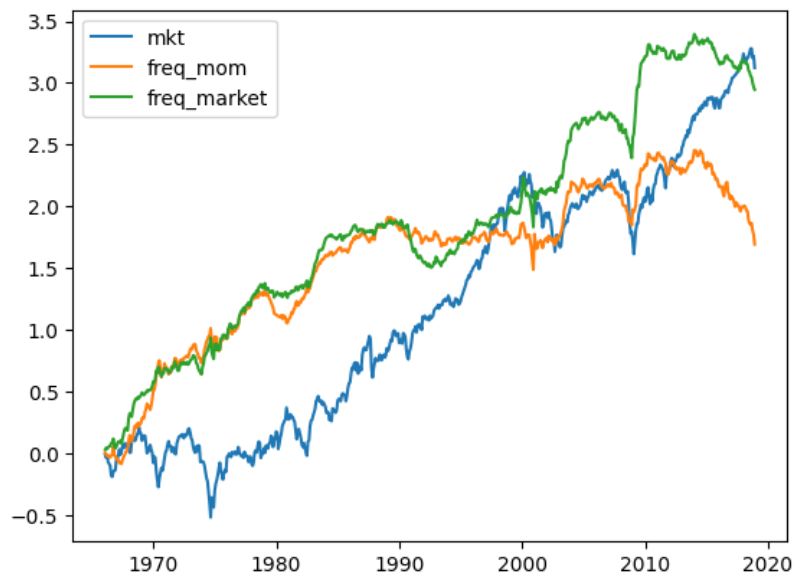

# Exploration for momentum

书接上文，接下来继续研究动量因子的走势。

## Momentum

|        | 1.0               | 2.0               | 3.0               | 8.0               | 9.0               | 10.0              | long_short        |
|:-------|:------------------|:------------------|:------------------|:------------------|:------------------|:------------------|:------------------|
| freq_0 | 0.2* (0.11)    | 0.09 (0.06)    | 0.19*** (0.06) | 0.45*** (0.14) | 0.45*** (0.16) | 0.68*** (0.19) | 0.48*** (0.18) |
| freq_1 | 0.68*** (0.18) | 0.4*** (0.14)  | 0.32*** (0.11) | 0.22*** (0.06) | 0.22** (0.09)  | 0.52*** (0.15) | -0.16 (0.12)   |
| freq_2 | 0.61*** (0.17) | 0.39*** (0.13) | 0.43*** (0.1)  | 0.17*** (0.06) | 0.19** (0.08)  | 0.56*** (0.14) | -0.05 (0.09)   |
| freq_3 | 0.6*** (0.16)  | 0.29** (0.12)  | 0.29*** (0.08) | 0.21** (0.08)  | 0.26*** (0.09) | 0.58*** (0.14) | -0.02 (0.08)   |
| freq_4 | 0.64*** (0.16) | 0.39*** (0.12) | 0.3*** (0.08)  | 0.13** (0.06)  | 0.15 (0.09)    | 0.52*** (0.14) | -0.12 (0.11)   |
| freq_5 | 0.62*** (0.15) | 0.45*** (0.14) | 0.39*** (0.1)  | 0.16** (0.07)  | 0.17** (0.08)  | 0.48*** (0.13) | -0.13 (0.1)    |
| freq_6 | 0.58*** (0.15) | 0.49*** (0.12) | 0.33*** (0.09) | 0.13* (0.07)   | 0.26** (0.1)   | 0.64*** (0.15) | 0.05 (0.08)    |
| freq_7 | 0.59*** (0.16) | 0.47*** (0.12) | 0.24** (0.09)  | 0.15** (0.07)  | 0.38*** (0.09) | 0.54*** (0.15) | -0.05 (0.09)   |
| freq_8 | 0.62*** (0.15) | 0.37*** (0.1)  | 0.34*** (0.08) | 0.14* (0.08)   | 0.27** (0.12)  | 0.56*** (0.17) | -0.06 (0.08)   |

Mom 也是只有低频显著，那么结果基本上就一样了，看了看走势，果然如此

两侧能否互相解释

以占比低解释占比高，发现完全解释

|           | onel against oneh   | twol against twoh   | threel against threeh   | fourl against fourh   | fivel against fiveh   | sixl against sixh   | sevenl against sevenh   | eightl against eighth   |
|:----------|:--------------------|:--------------------|:------------------------|:----------------------|:----------------------|:--------------------|:------------------------|:------------------------|
| intercept | -0.02 (0.14)     | 0.09 (0.07)      | 0.04 (0.08)          | 0.03 (0.08)        | 0.11 (0.1)         | 0.08 (0.08)      | 0.04 (0.06)          | 0.09 (0.08)          |
| varibale  | 0.78*** (0.05)   | 0.97*** (0.03)   | 0.97*** (0.02)       | 0.95*** (0.02)     | 0.92*** (0.03)     | 0.97*** (0.02)   | 0.94*** (0.02)       | 0.95*** (0.02)       |
| Adi.R2    | 0.74                | 0.89                | 0.91                    | 0.91                  | 0.88                  | 0.89                | 0.92                    | 0.91                    |

反过来也一样，也就是说，对于任意频率而言，基本上占比最高和占比最低是一个意思。

|           | oneh against onel   | twoh against twol   | threeh against threel   | fourh against fourl   | fiveh against fivel   | sixh against sixl   | sevenh against sevenl   | eighth against eightl   |
|:----------|:--------------------|:--------------------|:------------------------|:----------------------|:----------------------|:--------------------|:------------------------|:------------------------|
| intercept | 0.3** (0.15)     | 0.03 (0.08)      | 0.05 (0.08)          | 0.07 (0.08)        | 0.01 (0.1)         | 0.04 (0.08)      | 0.04 (0.07)          | 0.0 (0.08)           |
| varibale  | 0.95*** (0.04)   | 0.92*** (0.04)   | 0.95*** (0.02)       | 0.96*** (0.02)     | 0.96*** (0.03)     | 0.92*** (0.03)   | 0.98*** (0.02)       | 0.96*** (0.02)       |
| Adi.R2    | 0.74                | 0.89                | 0.91                    | 0.91                  | 0.88                  | 0.89                | 0.92                    | 0.91                    |

对 ratio demean，按理说可以去除不可预测的波动成分，但是效果似乎不大。

|        | 1.0               | 2.0               | 3.0               | 8.0               | 9.0               | 10.0              | long_short        |
|:-------|:------------------|:------------------|:------------------|:------------------|:------------------|:------------------|:------------------|
| freq_0 | 0.05 (0.09)    | 0.02 (0.06)    | 0.13** (0.06)  | 0.52*** (0.14) | 0.55*** (0.18) | 0.73*** (0.19) | 0.68*** (0.19) |
| freq_1 | 0.47*** (0.13) | 0.33*** (0.08) | 0.34*** (0.07) | 0.27*** (0.09) | 0.17 (0.12)    | 0.5*** (0.15)  | 0.04 (0.09)    |
| freq_2 | 0.55*** (0.14) | 0.39*** (0.13) | 0.36*** (0.12) | 0.23*** (0.08) | 0.22** (0.09)  | 0.44*** (0.14) | -0.1 (0.08)    |
| freq_3 | 0.59*** (0.15) | 0.34*** (0.12) | 0.32*** (0.1)  | 0.27*** (0.07) | 0.27*** (0.08) | 0.5*** (0.14)  | -0.09 (0.08)   |
| freq_4 | 0.56*** (0.15) | 0.37*** (0.12) | 0.18** (0.08)  | 0.26*** (0.08) | 0.37*** (0.1)  | 0.53*** (0.14) | -0.03 (0.09)   |
| freq_5 | 0.64*** (0.16) | 0.43*** (0.13) | 0.34*** (0.11) | 0.17** (0.07)  | 0.26*** (0.09) | 0.45*** (0.12) | -0.19* (0.1)   |
| freq_6 | 0.61*** (0.17) | 0.34*** (0.11) | 0.26*** (0.09) | 0.3*** (0.09)  | 0.33*** (0.09) | 0.43*** (0.13) | -0.18* (0.1)   |
| freq_7 | 0.64*** (0.17) | 0.36*** (0.12) | 0.33*** (0.1)  | 0.26*** (0.08) | 0.21*** (0.08) | 0.41*** (0.11) | -0.23** (0.11) |

## NExt

动量因子并不能提供额外的动量信息，复习了一下文章中的计算方法，也得不到更好的效果了，目前到这一步，还是卡住了，接下来研究 wold decomposition，看看能否有所启发。

