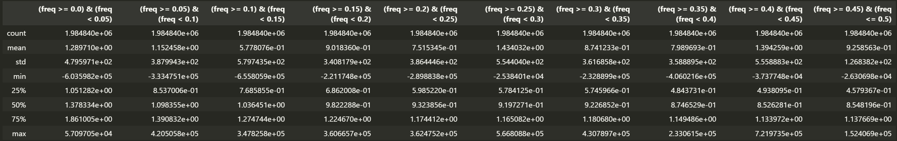
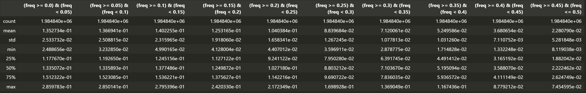
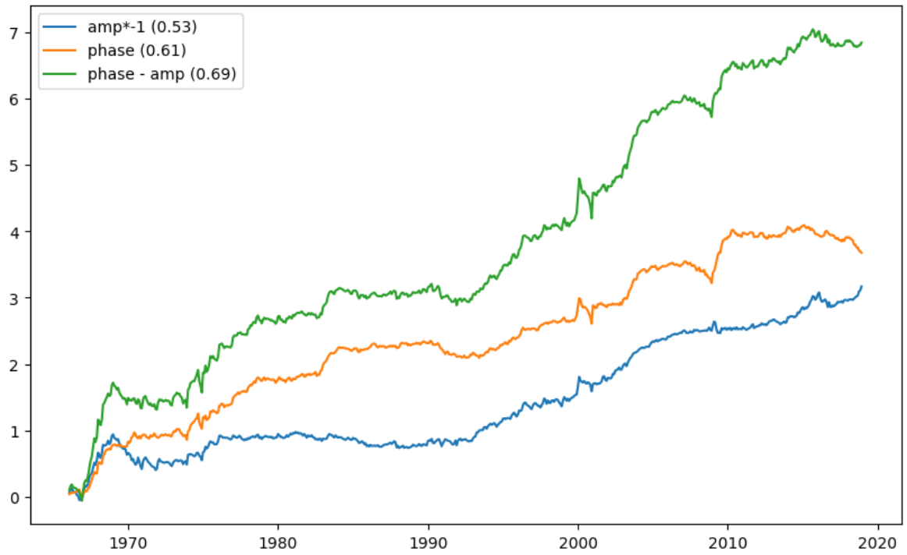
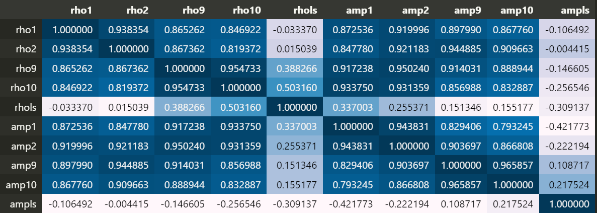

# Breakthrough on the covariance

**Abstract**：**在低频内，振幅占比越小越好，相关系数占比越高越好**。

经过和老师、师兄的讨论，有了新的进展，对于协方差，可以转化为如下形式：

$$
\begin{aligned}
    X_1[k] = A_1 (\cos \theta_1+  i \sin \theta_1) , \quad X_2[k] = A_2 (\cos \theta_2+i \sin \theta_2) \\
    \Longrightarrow X_1[k] \cdot X_2^*[k] = A_1A_2 \left( \cos\theta_1 \cos\theta_2+ \sin \theta_1 \sin \theta_2+(\cdots)i \right) \\
    \Longrightarrow \mathbb{R}(X_1[k] \cdot X_2^*[k])= A_1A_2 \cos (\theta_1 - \theta_2)
\end{aligned}
$$

因此协方差占比可转化为以下形式

$$
\begin{equation}
\begin{aligned}
    \frac{\mathbb{C}^{\text{LF}}}{\mathbb{C}} &= \frac{\sum_j^{\text{LF}}A_i^j A_m^j \cos \theta}{\rho \sqrt{\sum_j(A_i^j)^2}\sqrt{\sum_j(A_m^j)^2} } \\
    &= \frac{\rho^{\text{LF}} \sqrt{\sum_j^{\text{LF}}(A_i^j)^2}\sqrt{\sum_j^{\text{LF}} (A_m^j)^2}}{\rho \sqrt{\sum_j(A_i^j)^2}\sqrt{\sum_j(A_m^j)^2} } \\
    &= \frac{\rho^{\text{LF}}}{\rho} \cdot  \frac{\sqrt{\sum_j^{\text{LF}}(A_i^j)^2 \sum_j^{\text{LF}} (A_m^j)^2}}{\sqrt{\sum_j(A_i^j)^2 \sum_j (A_m^j)^2}}
\end{aligned}
\end{equation}
$$

其中

$$
\begin{equation}
    \rho^{\text{LF}} = \frac{\sum_j^{\text{LF}} A_j^j A_m^j \cos \theta }{\sqrt{\sum_j^{\text{LF}}(A_i^j)^2} \sqrt{\sum_j^{\text{LF}}(A_m^j)^2} }
\end{equation}
$$

其中 $\frac{\rho^{\text{LF}}}{\rho}$ 是频率内相关系数比上总相关系数，衡量了资产和因子（如 mkt）相位方面的关系，$\frac{\sqrt{\sum_j^{\text{LF}}(A_i^j)^2 \sum_j^{\text{LF}} (A_m^j)^2}}{\sqrt{\sum_j(A_i^j)^2 \sum_j (A_m^j)^2}}$ 则是衡量了资产和因子振幅方面的关系。也就是说，在原有的基础上，经过拆分能够使得资产和因子之间的关系更加 clean。

## Single sort 

从二者的描述性统计量可以看出，相位的变化与波动水平要远远高于振幅，因此不妨推测主要信息就在相位之中。

Statistics on Amplitude

Statistics on Phase

接下来看一下二者的 alpha test

对于**振幅**来说，单调性最好的组出现在次低频，也就是对于此低频来说，振幅越小则收益率越高。

|           | 1.0                | 2.0                | 3.0                | 4.0                | 5.0                | 6.0                | 7.0                | 8.0                | 9.0                | 10.0               | long_short         |
|:----------|:-------------------|:-------------------|:-------------------|:-------------------|:-------------------|:-------------------|:-------------------|:-------------------|:-------------------|:-------------------|:-------------------|
| Intercept | 0.62*** (0.14)  | 0.45*** (0.11)  | 0.43*** (0.11)  | 0.38*** (0.09)  | 0.33*** (0.1)   | 0.32*** (0.09)  | 0.25*** (0.08)  | 0.2** (0.08)    | 0.18** (0.08)   | 0.06 (0.1)      | -0.56*** (0.13) |
| mktrf     | 0.85*** (0.04)  | 0.94*** (0.03)  | 0.94*** (0.03)  | 0.96*** (0.02)  | 0.96*** (0.02)  | 0.96*** (0.02)  | 0.97*** (0.02)  | 0.99*** (0.02)  | 1.02*** (0.02)  | 1.0*** (0.02)   | 0.15*** (0.04)  |
| smb       | 1.07*** (0.07)  | 1.01*** (0.06)  | 0.97*** (0.04)  | 0.92*** (0.04)  | 0.89*** (0.04)  | 0.86*** (0.04)  | 0.79*** (0.04)  | 0.76*** (0.03)  | 0.76*** (0.04)  | 0.73*** (0.05)  | -0.33*** (0.08) |
| hml       | 0.09 (0.09)     | -0.01 (0.07)    | -0.05 (0.06)    | -0.03 (0.05)    | -0.07 (0.06)    | -0.01 (0.05)    | -0.0 (0.05)     | 0.0 (0.05)      | 0.03 (0.04)     | 0.13** (0.05)   | 0.04 (0.08)     |
| rmw       | -0.13* (0.08)   | -0.22*** (0.06) | -0.22*** (0.05) | -0.23*** (0.05) | -0.14*** (0.04) | -0.17*** (0.04) | -0.12** (0.06)  | -0.08* (0.04)   | -0.04 (0.05)    | 0.05 (0.06)     | 0.19*** (0.07)  |
| cma       | 0.09 (0.1)      | 0.05 (0.1)      | 0.02 (0.08)     | 0.04 (0.06)     | 0.07 (0.07)     | 0.02 (0.06)     | 0.07 (0.05)     | 0.1** (0.05)    | 0.2*** (0.05)   | 0.15** (0.06)   | 0.06 (0.11)     |
| umd       | -0.16*** (0.05) | -0.17*** (0.05) | -0.19*** (0.05) | -0.16*** (0.04) | -0.2*** (0.04)  | -0.21*** (0.04) | -0.17*** (0.03) | -0.18*** (0.04) | -0.18*** (0.04) | -0.19*** (0.04) | -0.03 (0.05)    |
| Adj. R2   | 0.8                | 0.88               | 0.91               | 0.92               | 0.93               | 0.93               | 0.94               | 0.94               | 0.94               | 0.91               | 0.13               |

对于**相位**，单调性最好的组就出现在最低频，比原来的要强不少

|           | 1.0               | 2.0               | 3.0                | 4.0                | 5.0                | 6.0                | 7.0                | 8.0                | 9.0                | 10.0               | long_short         |
|:----------|:------------------|:------------------|:-------------------|:-------------------|:-------------------|:-------------------|:-------------------|:-------------------|:-------------------|:-------------------|:-------------------|
| Intercept | 0.01 (0.09)    | 0.03 (0.05)    | 0.14** (0.06)   | 0.2*** (0.06)   | 0.26*** (0.08)  | 0.3*** (0.09)   | 0.43*** (0.12)  | 0.53*** (0.15)  | 0.57*** (0.17)  | 0.76*** (0.18)  | **0.75** *** (0.18)  |
| mktrf     | 0.88*** (0.03) | 1.03*** (0.02) | 1.06*** (0.02)  | 1.06*** (0.02)  | 1.03*** (0.02)  | 1.03*** (0.02)  | 1.0*** (0.03)   | 0.93*** (0.04)  | 0.86*** (0.04)  | 0.71*** (0.04)  | -0.17*** (0.04) |
| smb       | 0.67*** (0.06) | 0.69*** (0.03) | 0.73*** (0.03)  | 0.79*** (0.04)  | 0.89*** (0.04)  | 0.93*** (0.04)  | 0.98*** (0.04)  | 1.07*** (0.05)  | 1.01*** (0.06)  | 1.0*** (0.06)   | 0.33*** (0.07)  |
| hml       | 0.05 (0.07)    | -0.02 (0.04)   | -0.02 (0.04)    | -0.02 (0.04)    | 0.01 (0.05)     | 0.02 (0.05)     | 0.01 (0.06)     | 0.0 (0.08)      | 0.05 (0.09)     | -0.0 (0.11)     | -0.06 (0.12)    |
| rmw       | 0.09 (0.06)    | 0.05 (0.04)    | -0.08** (0.04)  | -0.14*** (0.05) | -0.14** (0.06)  | -0.17*** (0.04) | -0.21*** (0.07) | -0.22*** (0.07) | -0.26*** (0.09) | -0.22*** (0.08) | -0.31*** (0.08) |
| cma       | 0.15 (0.09)    | 0.07 (0.06)    | 0.01 (0.04)     | 0.07 (0.06)     | 0.04 (0.06)     | 0.06 (0.06)     | 0.06 (0.08)     | 0.08 (0.1)      | 0.06 (0.11)     | 0.23* (0.14)    | 0.08 (0.13)     |
| umd       | -0.03 (0.03)   | -0.1*** (0.02) | -0.16*** (0.02) | -0.19*** (0.02) | -0.23*** (0.04) | -0.25*** (0.05) | -0.25*** (0.06) | -0.25*** (0.07) | -0.21*** (0.07) | -0.15** (0.07)  | -0.12 (0.08)    |
| Adj. R2   | 0.82              | 0.95              | 0.96               | 0.96               | 0.95               | 0.94               | 0.92               | 0.88               | 0.82               | 0.72               | 0.19               |

接下来再看一下二者的收益率走势，因为振幅 long short 为负，所以我做了翻转，乘了 -1，括号内为夏普比率。

## Double sort (Lowest frequency)

### Conditional on Amplitude

|   amp \ phase | 0                | 1                 | 2                 | 3                 | 4                 |
|------:|:-----------------|:------------------|:------------------|:------------------|:------------------|
|     0 | 0.27** (0.11) | 0.2** (0.1)    | 0.41*** (0.12) | 0.55*** (0.16) | 0.95*** (0.2)  |
|     1 | -0.03 (0.08)  | 0.08 (0.08)    | 0.14 (0.09)    | 0.39*** (0.14) | 0.65*** (0.18) |
|     2 | 0.02 (0.08)   | 0.15** (0.08)  | 0.29*** (0.09) | 0.45*** (0.14) | 0.71*** (0.18) |
|     3 | -0.09 (0.07)  | 0.11 (0.08)    | 0.42*** (0.09) | 0.43*** (0.14) | 0.66*** (0.21) |
|     4 | -0.02 (0.1)   | 0.26*** (0.08) | 0.41*** (0.12) | 0.55*** (0.16) | 0.5** (0.2)    |

### Conditional on Phase

|   phase \ amp | 0                 | 1                 | 2                 | 3                 | 4                 |
|------:|:------------------|:------------------|:------------------|:------------------|:------------------|
|     0 | 0.22** (0.1)   | 0.06 (0.09)    | -0.0 (0.07)    | -0.13 (0.08)   | -0.07 (0.1)    |
|     1 | 0.18** (0.09)  | 0.12 (0.07)    | 0.2** (0.08)   | 0.15* (0.08)   | 0.22*** (0.08) |
|     2 | 0.16 (0.1)     | 0.32*** (0.1)  | 0.28*** (0.1)  | 0.36*** (0.1)  | 0.32** (0.12)  |
|     3 | 0.54*** (0.12) | 0.41*** (0.14) | 0.55*** (0.16) | 0.42*** (0.16) | 0.57*** (0.16) |
|     4 | 0.89*** (0.19) | 0.76*** (0.2)  | 0.68*** (0.17) | 0.64*** (0.18) | 0.61*** (0.22) |

整体上来看，当控制了振幅后，对相位 sort，基本上都呈现出了很好的单调性，反过来则不行。因为相位本身最低频排序时，就已经有了最高 0.75 的 $\alpha$，看起来振幅作为控制变量还能对相位做进一层的区分。

## Alternative test

接下来试一下不同频率间的组合，在这个过程中，我把十份频率两两取均值变成了五份频率。先看一下变成五份后的 single sort。

相位最低频的单调性还是很好,经过平均之后振幅的单调性也出现了增强。**变为相邻频率取均值后不改变原有信息，并且有所增强**，那就可以接下来进行第二部分的实验。

|           | 1.0               | 2.0                | 3.0                | 4.0                | 5.0                | 6.0                | 7.0                | 8.0                | 9.0                | 10.0               | long_short         |
|:----------|:------------------|:-------------------|:-------------------|:-------------------|:-------------------|:-------------------|:-------------------|:-------------------|:-------------------|:-------------------|:-------------------|
| **Amp_low** | 0.61*** (0.14) | 0.42*** (0.11)  | 0.37*** (0.11)  | 0.31*** (0.1)   | 0.3*** (0.09)   | 0.3*** (0.09)   | 0.29*** (0.09)  | 0.23*** (0.08)  | 0.21** (0.09)   | 0.16 (0.12)     | -0.44*** (0.17) |
| **Phase_low** | 0.06 (0.09)    | 0.1* (0.05)     | 0.18*** (0.06)  | 0.24*** (0.07)  | 0.2** (0.08)   | 0.28*** (0.07)  | 0.36*** (0.12)  | 0.45*** (0.14)  | 0.63*** (0.18)  | 0.72*** (0.18)  | 0.66*** (0.17)  |

相关性上来看，低频部分的多头组合都很高，但是因子 long short 后就没什么相关性了。

### Double sort on amplitude and then phase

- **低频组**呈现出了最完美的单调性
- **振幅也体现出了单调性**，在低频内，随着相位增加 $\alpha$ 增加，随着振幅增加 $\alpha$ 降低
- 无论振幅还是相位，在其他频率内的表现都有所下滑，例如表现为单调性的丧失
- 高频组的表现基本倒转了低频组的表现

|   amp_1 \ rho_1 | 0               | 1                 | 2                 | 3                 | 4                 |
|----------------:|:----------------|:------------------|:------------------|:------------------|:------------------|
|               0 | 0.23* (0.12) | 0.29*** (0.11) | 0.43*** (0.14) | 0.76*** (0.18) | 0.9*** (0.19)  |
|               1 | 0.14 (0.09)  | 0.23*** (0.08) | 0.25** (0.1)   | 0.38** (0.16)  | 0.79*** (0.18) |
|               2 | 0.01 (0.07)  | 0.16** (0.08)  | 0.21*** (0.08) | 0.56*** (0.16) | 0.66*** (0.18) |
|               3 | 0.0 (0.09)   | 0.21*** (0.08) | 0.34*** (0.1)  | 0.22** (0.1)   | 0.62*** (0.2)  |
|               4 | 0.03 (0.1)   | 0.21** (0.08)  | 0.22** (0.1)   | 0.28** (0.14)  | 0.34* (0.18)   |

|   amp_1 \ rho_2 | 0                 | 1                 | 2                 | 3                 | 4                 |
|----------------:|:------------------|:------------------|:------------------|:------------------|:------------------|
|               0 | 0.73*** (0.18) | 0.44*** (0.13) | 0.4*** (0.11)  | 0.34*** (0.13) | 0.69*** (0.17) |
|               1 | 0.55*** (0.16) | 0.25** (0.11)  | 0.22** (0.08)  | 0.35*** (0.09) | 0.42*** (0.13) |
|               2 | 0.53*** (0.14) | 0.34** (0.14)  | 0.25*** (0.09) | 0.18** (0.08)  | 0.3** (0.12)   |
|               3 | 0.31** (0.15)  | 0.25*** (0.09) | 0.24*** (0.08) | 0.35*** (0.09) | 0.23** (0.11)  |
|               4 | 0.27* (0.14)   | 0.17 (0.11)    | 0.25** (0.1)   | 0.22** (0.1)   | 0.17 (0.16)    |

|   amp_1 \ rho_3 | 0                 | 1                 | 2                 | 3                 | 4                 |
|----------------:|:------------------|:------------------|:------------------|:------------------|:------------------|
|               0 | 0.8*** (0.18)  | 0.41*** (0.13) | 0.34*** (0.12) | 0.39*** (0.12) | 0.66*** (0.16) |
|               1 | 0.56*** (0.13) | 0.32*** (0.12) | 0.24** (0.09)  | 0.31*** (0.1)  | 0.35*** (0.13) |
|               2 | 0.46*** (0.14) | 0.36*** (0.09) | 0.25*** (0.09) | 0.17** (0.08)  | 0.38*** (0.12) |
|               3 | 0.42*** (0.13) | 0.29*** (0.1)  | 0.23*** (0.09) | 0.15* (0.09)   | 0.3*** (0.09)  |
|               4 | 0.39** (0.15)  | 0.22* (0.12)   | 0.19* (0.1)    | 0.16* (0.09)   | 0.12 (0.12)    |

|   amp_1 \ rho_4 | 0                 | 1                 | 2                 | 3                 | 4                 |
|----------------:|:------------------|:------------------|:------------------|:------------------|:------------------|
|               0 | 0.78*** (0.18) | 0.51*** (0.13) | 0.38*** (0.11) | 0.35*** (0.11) | 0.58*** (0.16) |
|               1 | 0.56*** (0.16) | 0.37*** (0.13) | 0.27** (0.11)  | 0.27*** (0.09) | 0.31*** (0.11) |
|               2 | 0.44*** (0.14) | 0.3*** (0.11)  | 0.24*** (0.09) | 0.22*** (0.08) | 0.41*** (0.12) |
|               3 | 0.43*** (0.14) | 0.26*** (0.09) | 0.3*** (0.1)   | 0.12 (0.08)    | 0.28*** (0.09) |
|               4 | 0.22 (0.16)    | 0.17 (0.1)     | 0.25** (0.1)   | 0.21** (0.1)   | 0.23** (0.1)   |

|   amp_1 \ rho_5 | 0                 | 1                 | 2                 | 3                 | 4                 |
|----------------:|:------------------|:------------------|:------------------|:------------------|:------------------|
|               0 | 0.74*** (0.19) | 0.61*** (0.15) | 0.45*** (0.13) | 0.38*** (0.11) | 0.42*** (0.15) |
|               1 | 0.6*** (0.17)  | 0.36*** (0.12) | 0.4*** (0.1)   | 0.24*** (0.08) | 0.18 (0.12)    |
|               2 | 0.62*** (0.16) | 0.38*** (0.13) | 0.18** (0.09)  | 0.29*** (0.09) | 0.13 (0.09)    |
|               3 | 0.51*** (0.14) | 0.39*** (0.12) | 0.32*** (0.09) | 0.06 (0.09)    | 0.11 (0.09)    |
|               4 | 0.39*** (0.15) | 0.29** (0.13)  | 0.18* (0.1)    | 0.15* (0.09)   | 0.06 (0.12)    |

|   amp_2 \ rho_1 | 0                | 1                 | 2                 | 3                 | 4                 |
|----------------:|:-----------------|:------------------|:------------------|:------------------|:------------------|
|               0 | 0.22** (0.11) | 0.25*** (0.1)  | 0.32** (0.13)  | 0.64*** (0.18) | 0.86*** (0.21) |
|               1 | 0.01 (0.09)   | 0.19** (0.09)  | 0.38*** (0.1)  | 0.44*** (0.14) | 0.84*** (0.19) |
|               2 | 0.06 (0.08)   | 0.31*** (0.09) | 0.32*** (0.1)  | 0.41*** (0.13) | 0.5*** (0.19)  |
|               3 | 0.09 (0.08)   | 0.19*** (0.07) | 0.22*** (0.08) | 0.36*** (0.11) | 0.74*** (0.19) |
|               4 | 0.07 (0.09)   | 0.2*** (0.07)  | 0.16** (0.08)  | 0.24** (0.1)   | 0.44*** (0.14) |

|   amp_2 \ rho_2 | 0                 | 1                 | 2                 | 3                 | 4                 |
|----------------:|:------------------|:------------------|:------------------|:------------------|:------------------|
|               0 | 0.77*** (0.18) | 0.38** (0.15)  | 0.35*** (0.1)  | 0.23** (0.11)  | 0.55*** (0.18) |
|               1 | 0.5*** (0.15)  | 0.34*** (0.12) | 0.27*** (0.1)  | 0.24*** (0.09) | 0.52*** (0.15) |
|               2 | 0.32** (0.14)  | 0.33*** (0.11) | 0.33*** (0.09) | 0.27*** (0.1)  | 0.37*** (0.11) |
|               3 | 0.53*** (0.14) | 0.24*** (0.08) | 0.27*** (0.08) | 0.28*** (0.08) | 0.28*** (0.1)  |
|               4 | 0.26** (0.11)  | 0.18** (0.08)  | 0.15* (0.08)   | 0.25*** (0.08) | 0.26** (0.12)  |

|   amp_2 \ rho_3 | 0                 | 1                 | 2                 | 3                 | 4                 |
|----------------:|:------------------|:------------------|:------------------|:------------------|:------------------|
|               0 | 0.68*** (0.18) | 0.32** (0.12)  | 0.31** (0.12)  | 0.32*** (0.11) | 0.65*** (0.16) |
|               1 | 0.65*** (0.15) | 0.36*** (0.1)  | 0.2** (0.1)    | 0.31*** (0.1)  | 0.34** (0.14)  |
|               2 | 0.51*** (0.14) | 0.4*** (0.11)  | 0.24*** (0.09) | 0.25*** (0.09) | 0.21** (0.1)   |
|               3 | 0.54*** (0.14) | 0.32*** (0.09) | 0.2** (0.08)   | 0.21*** (0.07) | 0.33*** (0.09) |
|               4 | 0.38*** (0.12) | 0.18** (0.08)  | 0.24*** (0.07) | 0.13 (0.08)    | 0.18 (0.11)    |

|   amp_2 \ rho_4 | 0                 | 1                 | 2                 | 3                 | 4                 |
|----------------:|:------------------|:------------------|:------------------|:------------------|:------------------|
|               0 | 0.82*** (0.19) | 0.35*** (0.13) | 0.34*** (0.12) | 0.2** (0.1)    | 0.56*** (0.15) |
|               1 | 0.65*** (0.16) | 0.31*** (0.11) | 0.27*** (0.1)  | 0.29*** (0.11) | 0.35*** (0.1)  |
|               2 | 0.36*** (0.14) | 0.24*** (0.08) | 0.4*** (0.12)  | 0.27*** (0.1)  | 0.34*** (0.12) |
|               3 | 0.5*** (0.13)  | 0.22** (0.09)  | 0.22** (0.09)  | 0.26*** (0.08) | 0.39*** (0.1)  |
|               4 | 0.33** (0.14)  | 0.15* (0.09)   | 0.29*** (0.08) | 0.14* (0.08)   | 0.2** (0.08)   |

|   amp_2 \ rho_5 | 0                 | 1                 | 2                 | 3                 | 4                 |
|----------------:|:------------------|:------------------|:------------------|:------------------|:------------------|
|               0 | 0.72*** (0.19) | 0.57*** (0.14) | 0.35*** (0.13) | 0.3*** (0.11)  | 0.34** (0.14)  |
|               1 | 0.64*** (0.17) | 0.39*** (0.13) | 0.33*** (0.09) | 0.15* (0.09)   | 0.35*** (0.12) |
|               2 | 0.61*** (0.17) | 0.38*** (0.13) | 0.32*** (0.11) | 0.19** (0.08)  | 0.12 (0.08)    |
|               3 | 0.59*** (0.13) | 0.35*** (0.11) | 0.28*** (0.08) | 0.23*** (0.07) | 0.14 (0.09)    |
|               4 | 0.31*** (0.12) | 0.28*** (0.1)  | 0.23*** (0.08) | 0.23*** (0.08) | 0.05 (0.1)     |

|   amp_3 \ rho_1 | 0                 | 1                 | 2                 | 3                 | 4                 |
|----------------:|:------------------|:------------------|:------------------|:------------------|:------------------|
|               0 | 0.25*** (0.08) | 0.2*** (0.07)  | 0.25*** (0.08) | 0.4*** (0.14)  | 0.55*** (0.14) |
|               1 | 0.07 (0.08)    | 0.29*** (0.08) | 0.21** (0.09)  | 0.42*** (0.14) | 0.78*** (0.18) |
|               2 | 0.13* (0.08)   | 0.26*** (0.08) | 0.32*** (0.1)  | 0.5*** (0.14)  | 0.71*** (0.19) |
|               3 | 0.03 (0.08)    | 0.21*** (0.08) | 0.24*** (0.08) | 0.4*** (0.15)  | 0.96*** (0.22) |
|               4 | -0.09 (0.09)   | 0.15 (0.09)    | 0.26*** (0.1)  | 0.28* (0.15)   | 0.68*** (0.19) |

|   amp_3 \ rho_2 | 0                 | 1                 | 2                 | 3                 | 4                 |
|----------------:|:------------------|:------------------|:------------------|:------------------|:------------------|
|               0 | 0.47*** (0.12) | 0.3*** (0.09)  | 0.2*** (0.08)  | 0.31*** (0.09) | 0.38*** (0.14) |
|               1 | 0.47*** (0.14) | 0.27*** (0.09) | 0.29*** (0.08) | 0.23** (0.1)   | 0.52*** (0.14) |
|               2 | 0.57*** (0.15) | 0.21* (0.11)   | 0.37*** (0.09) | 0.33*** (0.08) | 0.45*** (0.12) |
|               3 | 0.6*** (0.16)  | 0.31** (0.12)  | 0.32*** (0.08) | 0.3*** (0.1)   | 0.3** (0.13)   |
|               4 | 0.41** (0.16)  | 0.25** (0.13)  | 0.18* (0.09)   | 0.06 (0.09)    | 0.38*** (0.12) |

|   amp_3 \ rho_3 | 0                 | 1                 | 2                 | 3                 | 4                 |
|----------------:|:------------------|:------------------|:------------------|:------------------|:------------------|
|               0 | 0.47*** (0.15) | 0.38*** (0.1)  | 0.22*** (0.08) | 0.27*** (0.08) | 0.31*** (0.11) |
|               1 | 0.52*** (0.16) | 0.34*** (0.1)  | 0.23*** (0.08) | 0.19** (0.07)  | 0.49*** (0.12) |
|               2 | 0.59*** (0.14) | 0.38*** (0.11) | 0.24*** (0.09) | 0.35*** (0.09) | 0.36*** (0.12) |
|               3 | 0.59*** (0.15) | 0.36*** (0.1)  | 0.34*** (0.12) | 0.23*** (0.07) | 0.32*** (0.12) |
|               4 | 0.46*** (0.15) | 0.12 (0.1)     | 0.11 (0.09)    | 0.27** (0.11)  | 0.31** (0.13)  |

|   amp_3 \ rho_4 | 0                 | 1                 | 2                | 3                 | 4                 |
|----------------:|:------------------|:------------------|:-----------------|:------------------|:------------------|
|               0 | 0.42*** (0.13) | 0.32*** (0.1)  | 0.3*** (0.08) | 0.19** (0.09)  | 0.42*** (0.11) |
|               1 | 0.58*** (0.16) | 0.25*** (0.09) | 0.24** (0.1)  | 0.33*** (0.08) | 0.36*** (0.1)  |
|               2 | 0.52*** (0.14) | 0.36*** (0.1)  | 0.35*** (0.1) | 0.25** (0.1)   | 0.45*** (0.12) |
|               3 | 0.67*** (0.17) | 0.21** (0.09)  | 0.29*** (0.1) | 0.28*** (0.1)  | 0.38*** (0.11) |
|               4 | 0.5*** (0.16)  | 0.27** (0.13)  | 0.18* (0.1)   | 0.07 (0.09)    | 0.25** (0.11)  |

|   amp_3 \ rho_5 | 0                 | 1                 | 2                 | 3                 | 4                |
|----------------:|:------------------|:------------------|:------------------|:------------------|:-----------------|
|               0 | 0.51*** (0.12) | 0.38*** (0.11) | 0.29*** (0.09) | 0.17** (0.08)  | 0.3*** (0.11) |
|               1 | 0.77*** (0.16) | 0.43*** (0.14) | 0.2** (0.08)   | 0.18** (0.08)  | 0.19* (0.1)   |
|               2 | 0.56*** (0.18) | 0.42*** (0.12) | 0.38*** (0.1)  | 0.26*** (0.08) | 0.3*** (0.1)  |
|               3 | 0.63*** (0.19) | 0.34*** (0.12) | 0.43*** (0.09) | 0.25*** (0.08) | 0.19* (0.1)   |
|               4 | 0.62*** (0.16) | 0.3** (0.12)   | 0.2* (0.1)     | 0.12 (0.1)     | 0.03 (0.11)   |

|   amp_4 \ rho_1 | 0                | 1                 | 2                 | 3                 | 4                 |
|----------------:|:-----------------|:------------------|:------------------|:------------------|:------------------|
|               0 | 0.08 (0.09)   | 0.07 (0.08)    | 0.18** (0.09)  | 0.28* (0.15)   | 0.53*** (0.17) |
|               1 | -0.07 (0.08)  | 0.28*** (0.07) | 0.2** (0.09)   | 0.4*** (0.13)  | 0.57*** (0.18) |
|               2 | -0.01 (0.07)  | 0.24*** (0.09) | 0.28*** (0.08) | 0.25** (0.13)  | 0.83*** (0.19) |
|               3 | 0.19** (0.08) | 0.28*** (0.1)  | 0.34*** (0.1)  | 0.51*** (0.15) | 0.66*** (0.2)  |
|               4 | 0.21** (0.1)  | 0.29*** (0.09) | 0.36*** (0.13) | 0.68*** (0.16) | 0.83*** (0.2)  |

|   amp_4 \ rho_2 | 0                 | 1                 | 2                 | 3                 | 4                 |
|----------------:|:------------------|:------------------|:------------------|:------------------|:------------------|
|               0 | 0.35** (0.14)  | 0.18* (0.1)    | 0.14 (0.09)    | 0.19* (0.11)   | 0.28** (0.12)  |
|               1 | 0.44*** (0.14) | 0.21** (0.1)   | 0.27*** (0.08) | 0.26*** (0.08) | 0.22* (0.12)   |
|               2 | 0.47*** (0.15) | 0.34** (0.14)  | 0.25*** (0.07) | 0.25*** (0.08) | 0.29*** (0.11) |
|               3 | 0.44*** (0.14) | 0.38*** (0.12) | 0.36*** (0.11) | 0.28*** (0.1)  | 0.51*** (0.13) |
|               4 | 0.72*** (0.16) | 0.33*** (0.12) | 0.38*** (0.09) | 0.28** (0.11)  | 0.67*** (0.16) |

|   amp_4 \ rho_3 | 0                 | 1                 | 2                 | 3                 | 4                 |
|----------------:|:------------------|:------------------|:------------------|:------------------|:------------------|
|               0 | 0.46*** (0.14) | 0.26** (0.11)  | 0.15* (0.09)   | 0.04 (0.09)    | 0.23** (0.12)  |
|               1 | 0.37** (0.14)  | 0.28*** (0.1)  | 0.25*** (0.08) | 0.23*** (0.08) | 0.25** (0.1)   |
|               2 | 0.53*** (0.14) | 0.34*** (0.09) | 0.24** (0.1)   | 0.22** (0.09)  | 0.26*** (0.1)  |
|               3 | 0.57*** (0.15) | 0.25** (0.1)   | 0.33*** (0.11) | 0.39*** (0.11) | 0.43*** (0.12) |
|               4 | 0.74*** (0.18) | 0.35*** (0.1)  | 0.3*** (0.1)   | 0.44*** (0.12) | 0.54*** (0.16) |

|   amp_4 \ rho_4 | 0                 | 1                 | 2                 | 3                 | 4                 |
|----------------:|:------------------|:------------------|:------------------|:------------------|:------------------|
|               0 | 0.36*** (0.14) | 0.12 (0.1)     | 0.19** (0.09)  | 0.12 (0.11)    | 0.34*** (0.1)  |
|               1 | 0.49*** (0.16) | 0.28*** (0.09) | 0.19** (0.08)  | 0.21** (0.08)  | 0.22** (0.1)   |
|               2 | 0.43*** (0.14) | 0.32*** (0.1)  | 0.28*** (0.08) | 0.22*** (0.08) | 0.35*** (0.11) |
|               3 | 0.57*** (0.15) | 0.42*** (0.13) | 0.23** (0.12)  | 0.31*** (0.1)  | 0.43*** (0.12) |
|               4 | 0.77*** (0.18) | 0.39*** (0.11) | 0.35*** (0.11) | 0.31*** (0.09) | 0.54*** (0.14) |

|   amp_4 \ rho_5 | 0                 | 1                 | 2                 | 3                 | 4                 |
|----------------:|:------------------|:------------------|:------------------|:------------------|:------------------|
|               0 | 0.44*** (0.14) | 0.3*** (0.11)  | 0.22* (0.12)   | 0.08 (0.08)    | 0.1 (0.12)     |
|               1 | 0.58*** (0.14) | 0.33** (0.13)  | 0.2*** (0.08)  | 0.17** (0.08)  | 0.11 (0.11)    |
|               2 | 0.49*** (0.13) | 0.39*** (0.12) | 0.29*** (0.09) | 0.24*** (0.09) | 0.18* (0.1)    |
|               3 | 0.69*** (0.18) | 0.39*** (0.14) | 0.42*** (0.11) | 0.22*** (0.08) | 0.25** (0.1)   |
|               4 | 0.66*** (0.19) | 0.61*** (0.14) | 0.37*** (0.11) | 0.34*** (0.1)  | 0.39*** (0.12) |

|   amp_5 \ rho_1 | 0              | 1                 | 2                 | 3                 | 4                 |
|----------------:|:---------------|:------------------|:------------------|:------------------|:------------------|
|               0 | 0.03 (0.08) | 0.23*** (0.08) | 0.19** (0.1)   | 0.34*** (0.12) | 0.43** (0.2)   |
|               1 | 0.09 (0.07) | 0.2*** (0.07)  | 0.17** (0.07)  | 0.28*** (0.11) | 0.59*** (0.17) |
|               2 | 0.05 (0.08) | 0.23*** (0.08) | 0.35*** (0.09) | 0.35*** (0.1)  | 0.71*** (0.19) |
|               3 | 0.09 (0.09) | 0.24*** (0.08) | 0.32*** (0.1)  | 0.51*** (0.16) | 0.79*** (0.19) |
|               4 | 0.16 (0.12) | 0.27** (0.12)  | 0.46*** (0.14) | 0.53*** (0.18) | 0.85*** (0.19) |

|   amp_5 \ rho_2 | 0                 | 1                 | 2                 | 3                 | 4                 |
|----------------:|:------------------|:------------------|:------------------|:------------------|:------------------|
|               0 | 0.36** (0.15)  | 0.22* (0.12)   | 0.29*** (0.09) | 0.22** (0.1)   | 0.13 (0.12)    |
|               1 | 0.47*** (0.16) | 0.19** (0.08)  | 0.17** (0.07)  | 0.22*** (0.07) | 0.28*** (0.1)  |
|               2 | 0.44*** (0.15) | 0.31*** (0.12) | 0.21*** (0.07) | 0.31*** (0.08) | 0.4*** (0.11)  |
|               3 | 0.53*** (0.17) | 0.33*** (0.1)  | 0.36*** (0.09) | 0.28*** (0.09) | 0.45*** (0.14) |
|               4 | 0.64*** (0.18) | 0.36*** (0.12) | 0.3*** (0.11)  | 0.32** (0.14)  | 0.65*** (0.17) |

|   amp_5 \ rho_3 | 0                 | 1                 | 2                 | 3                 | 4                 |
|----------------:|:------------------|:------------------|:------------------|:------------------|:------------------|
|               0 | 0.4*** (0.15)  | 0.27*** (0.1)  | 0.16* (0.1)    | 0.22** (0.09)  | 0.17 (0.12)    |
|               1 | 0.45*** (0.12) | 0.28*** (0.08) | 0.18** (0.08)  | 0.14 (0.09)    | 0.28*** (0.1)  |
|               2 | 0.5*** (0.14)  | 0.34*** (0.09) | 0.29*** (0.08) | 0.29*** (0.09) | 0.25** (0.1)   |
|               3 | 0.56*** (0.15) | 0.35*** (0.12) | 0.35*** (0.12) | 0.34*** (0.08) | 0.36*** (0.12) |
|               4 | 0.73*** (0.17) | 0.31** (0.13)  | 0.39*** (0.11) | 0.31** (0.13)  | 0.54*** (0.16) |

|   amp_5 \ rho_4 | 0                 | 1                 | 2                 | 3                 | 4                 |
|----------------:|:------------------|:------------------|:------------------|:------------------|:------------------|
|               0 | 0.22 (0.15)    | 0.22** (0.11)  | 0.29** (0.12)  | 0.21** (0.09)  | 0.28*** (0.09) |
|               1 | 0.36*** (0.12) | 0.15** (0.08)  | 0.26*** (0.08) | 0.26*** (0.09) | 0.31*** (0.09) |
|               2 | 0.54*** (0.15) | 0.34*** (0.08) | 0.2** (0.1)    | 0.2** (0.08)   | 0.39*** (0.1)  |
|               3 | 0.66*** (0.16) | 0.29** (0.12)  | 0.34*** (0.09) | 0.25*** (0.09) | 0.42*** (0.13) |
|               4 | 0.73*** (0.18) | 0.43*** (0.14) | 0.44*** (0.12) | 0.22** (0.1)   | 0.46*** (0.15) |

|   amp_5 \ rho_5 | 0                 | 1                 | 2                 | 3                | 4                |
|----------------:|:------------------|:------------------|:------------------|:-----------------|:-----------------|
|               0 | 0.4*** (0.15)  | 0.21** (0.1)   | 0.32*** (0.11) | 0.16* (0.08)  | 0.13 (0.12)   |
|               1 | 0.48*** (0.14) | 0.32*** (0.11) | 0.26*** (0.09) | 0.14** (0.06) | 0.14 (0.09)   |
|               2 | 0.57*** (0.13) | 0.43*** (0.14) | 0.29*** (0.09) | 0.21** (0.09) | 0.17* (0.1)   |
|               3 | 0.63*** (0.16) | 0.5*** (0.14)  | 0.33*** (0.08) | 0.28** (0.11) | 0.23** (0.11) |
|               4 | 0.7*** (0.19)  | 0.66*** (0.16) | 0.36*** (0.12) | 0.26** (0.1)  | 0.29** (0.14) |

### Double sort on phase and then amplitude

- 结论跟上文基本一致，但是反过来做**结果不如先振幅再相位效果好**，可能还是相位更重要一点。

|   rho_1 \ amp_1 | 0                 | 1                 | 2                 | 3                 | 4                |
|----------------:|:------------------|:------------------|:------------------|:------------------|:-----------------|
|               0 | 0.25** (0.11)  | 0.12 (0.09)    | 0.01 (0.08)    | -0.02 (0.08)   | 0.04 (0.1)    |
|               1 | 0.32*** (0.1)  | 0.25*** (0.08) | 0.2** (0.08)   | 0.16** (0.07)  | 0.15** (0.07) |
|               2 | 0.28*** (0.1)  | 0.21** (0.09)  | 0.29*** (0.09) | 0.24*** (0.08) | 0.2** (0.09)  |
|               3 | 0.49*** (0.14) | 0.49*** (0.14) | 0.49*** (0.17) | 0.3** (0.14)   | 0.33** (0.15) |
|               4 | 0.88*** (0.19) | 0.79*** (0.2)  | 0.81*** (0.19) | 0.76*** (0.19) | 0.42** (0.21) |

|   rho_1 \ amp_2 | 0                 | 1                 | 2                 | 3                 | 4                 |
|----------------:|:------------------|:------------------|:------------------|:------------------|:------------------|
|               0 | 0.2* (0.11)    | 0.06 (0.09)    | 0.01 (0.08)    | 0.02 (0.07)    | 0.1 (0.08)     |
|               1 | 0.22** (0.09)  | 0.26*** (0.08) | 0.21*** (0.07) | 0.18** (0.08)  | 0.22*** (0.08) |
|               2 | 0.31*** (0.09) | 0.3*** (0.1)   | 0.29*** (0.1)  | 0.26*** (0.08) | 0.07 (0.07)    |
|               3 | 0.36*** (0.14) | 0.44*** (0.14) | 0.48*** (0.16) | 0.45*** (0.14) | 0.38*** (0.13) |
|               4 | 0.8*** (0.19)  | 0.72*** (0.2)  | 0.82*** (0.18) | 0.71*** (0.2)  | 0.61*** (0.17) |

|   rho_1 \ amp_3 | 0                 | 1                 | 2                 | 3                 | 4                 |
|----------------:|:------------------|:------------------|:------------------|:------------------|:------------------|
|               0 | 0.25*** (0.09) | 0.12 (0.08)    | 0.06 (0.08)    | 0.09 (0.08)    | -0.12 (0.09)   |
|               1 | 0.22*** (0.07) | 0.27*** (0.07) | 0.18** (0.08)  | 0.21*** (0.07) | 0.2** (0.1)    |
|               2 | 0.22*** (0.08) | 0.21** (0.08)  | 0.33*** (0.1)  | 0.29*** (0.08) | 0.18* (0.09)   |
|               3 | 0.34*** (0.11) | 0.48*** (0.14) | 0.42*** (0.14) | 0.42*** (0.14) | 0.43*** (0.16) |
|               4 | 0.55*** (0.16) | 0.66*** (0.17) | 0.82*** (0.2)  | 0.82*** (0.21) | 0.83*** (0.21) |

|   rho_1 \ amp_4 | 0                | 1                 | 2                 | 3                 | 4                 |
|----------------:|:-----------------|:------------------|:------------------|:------------------|:------------------|
|               0 | 0.05 (0.09)   | -0.05 (0.08)   | -0.02 (0.07)   | 0.17** (0.08)  | 0.26** (0.1)   |
|               1 | 0.1 (0.07)    | 0.21*** (0.07) | 0.21*** (0.08) | 0.3*** (0.1)   | 0.25*** (0.08) |
|               2 | 0.12 (0.09)   | 0.17** (0.07)  | 0.29*** (0.09) | 0.35*** (0.1)  | 0.28*** (0.1)  |
|               3 | 0.31** (0.15) | 0.47*** (0.16) | 0.27** (0.12)  | 0.56*** (0.15) | 0.49*** (0.14) |
|               4 | 0.6*** (0.18) | 0.64*** (0.19) | 0.83*** (0.2)  | 0.7*** (0.18)  | 0.9*** (0.2)   |

|   rho_1 \ amp_5 | 0                 | 1                 | 2                 | 3                 | 4                 |
|----------------:|:------------------|:------------------|:------------------|:------------------|:------------------|
|               0 | 0.07 (0.08)    | 0.1 (0.08)     | 0.03 (0.08)    | 0.03 (0.08)    | 0.18 (0.12)    |
|               1 | 0.22*** (0.08) | 0.2*** (0.07)  | 0.22*** (0.08) | 0.17** (0.08)  | 0.27** (0.1)   |
|               2 | 0.16 (0.1)     | 0.21*** (0.07) | 0.23** (0.1)   | 0.35*** (0.07) | 0.27** (0.1)   |
|               3 | 0.31* (0.16)   | 0.45*** (0.13) | 0.41*** (0.14) | 0.49*** (0.15) | 0.43*** (0.14) |
|               4 | 0.5** (0.2)    | 0.82*** (0.2)  | 0.77*** (0.19) | 0.72*** (0.18) | 0.85*** (0.18) |

|   rho_2 \ amp_1 | 0                 | 1                 | 2                 | 3                 | 4                |
|----------------:|:------------------|:------------------|:------------------|:------------------|:-----------------|
|               0 | 0.75*** (0.18) | 0.62*** (0.16) | 0.57*** (0.15) | 0.4** (0.16)   | 0.28** (0.14) |
|               1 | 0.3** (0.11)   | 0.27** (0.13)  | 0.35*** (0.12) | 0.25*** (0.09) | 0.12 (0.11)   |
|               2 | 0.39*** (0.11) | 0.26*** (0.08) | 0.2*** (0.07)  | 0.2** (0.09)   | 0.23** (0.1)  |
|               3 | 0.25** (0.12)  | 0.28*** (0.07) | 0.23*** (0.08) | 0.29*** (0.09) | 0.22** (0.1)  |
|               4 | 0.65*** (0.16) | 0.45*** (0.13) | 0.44*** (0.15) | 0.3** (0.12)   | 0.15 (0.15)   |

|   rho_2 \ amp_2 | 0                 | 1                 | 2                 | 3                 | 4                 |
|----------------:|:------------------|:------------------|:------------------|:------------------|:------------------|
|               0 | 0.62*** (0.16) | 0.6*** (0.17)  | 0.46*** (0.15) | 0.46*** (0.15) | 0.47*** (0.12) |
|               1 | 0.32** (0.12)  | 0.35*** (0.12) | 0.32** (0.12)  | 0.16* (0.08)   | 0.15* (0.09)   |
|               2 | 0.33*** (0.09) | 0.21*** (0.08) | 0.35*** (0.09) | 0.26*** (0.08) | 0.13* (0.07)   |
|               3 | 0.27** (0.12)  | 0.3*** (0.09)  | 0.26*** (0.09) | 0.2*** (0.08)  | 0.24*** (0.08) |
|               4 | 0.59*** (0.17) | 0.44*** (0.14) | 0.38*** (0.13) | 0.36*** (0.11) | 0.22* (0.12)   |

|   rho_2 \ amp_3 | 0                 | 1                 | 2                 | 3                 | 4                 |
|----------------:|:------------------|:------------------|:------------------|:------------------|:------------------|
|               0 | 0.46*** (0.12) | 0.51*** (0.14) | 0.59*** (0.16) | 0.62*** (0.16) | 0.44*** (0.16) |
|               1 | 0.26*** (0.09) | 0.21** (0.1)   | 0.23** (0.12)  | 0.33*** (0.13) | 0.26** (0.12)  |
|               2 | 0.21*** (0.07) | 0.28*** (0.08) | 0.29*** (0.09) | 0.37*** (0.08) | 0.12 (0.08)    |
|               3 | 0.34*** (0.09) | 0.26*** (0.09) | 0.3*** (0.08)  | 0.31*** (0.09) | 0.06 (0.09)    |
|               4 | 0.38*** (0.13) | 0.41*** (0.13) | 0.52*** (0.13) | 0.28** (0.11)  | 0.41*** (0.15) |

|   rho_2 \ amp_4 | 0                 | 1                 | 2                 | 3                 | 4                 |
|----------------:|:------------------|:------------------|:------------------|:------------------|:------------------|
|               0 | 0.43*** (0.15) | 0.41*** (0.15) | 0.57*** (0.15) | 0.48*** (0.15) | 0.73*** (0.16) |
|               1 | 0.13 (0.1)     | 0.23** (0.1)   | 0.3** (0.13)   | 0.33*** (0.1)  | 0.3*** (0.12)  |
|               2 | 0.11 (0.07)    | 0.24*** (0.08) | 0.22*** (0.07) | 0.35*** (0.1)  | 0.36*** (0.1)  |
|               3 | 0.26** (0.11)  | 0.19** (0.09)  | 0.26*** (0.07) | 0.28*** (0.1)  | 0.29*** (0.11) |
|               4 | 0.26** (0.12)  | 0.19 (0.13)    | 0.37*** (0.11) | 0.53*** (0.14) | 0.65*** (0.16) |

|   rho_2 \ amp_5 | 0                 | 1                 | 2                 | 3                 | 4                 |
|----------------:|:------------------|:------------------|:------------------|:------------------|:------------------|
|               0 | 0.38*** (0.14) | 0.51*** (0.16) | 0.51*** (0.16) | 0.61*** (0.15) | 0.61*** (0.17) |
|               1 | 0.17 (0.12)    | 0.21** (0.09)  | 0.31** (0.12)  | 0.3*** (0.1)   | 0.3*** (0.11)  |
|               2 | 0.24*** (0.09) | 0.21*** (0.07) | 0.19*** (0.07) | 0.32*** (0.08) | 0.33*** (0.11) |
|               3 | 0.28** (0.11)  | 0.16** (0.07)  | 0.29*** (0.07) | 0.25*** (0.08) | 0.29** (0.12)  |
|               4 | 0.12 (0.12)    | 0.39*** (0.12) | 0.49*** (0.14) | 0.36*** (0.14) | 0.63*** (0.16) |

|   rho_3 \ amp_1 | 0                 | 1                 | 2                 | 3                 | 4                 |
|----------------:|:------------------|:------------------|:------------------|:------------------|:------------------|
|               0 | 0.72*** (0.17) | 0.56*** (0.14) | 0.63*** (0.16) | 0.41*** (0.15) | 0.42*** (0.15) |
|               1 | 0.45*** (0.14) | 0.35*** (0.1)  | 0.35*** (0.09) | 0.29*** (0.1)  | 0.16 (0.11)    |
|               2 | 0.31*** (0.1)  | 0.24** (0.09)  | 0.27** (0.12)  | 0.14 (0.08)    | 0.17* (0.09)   |
|               3 | 0.46*** (0.11) | 0.3*** (0.1)   | 0.14** (0.07)  | 0.13 (0.08)    | 0.12 (0.09)    |
|               4 | 0.54*** (0.16) | 0.52*** (0.14) | 0.3** (0.13)   | 0.36*** (0.1)  | 0.1 (0.11)     |

|   rho_3 \ amp_2 | 0                 | 1                 | 2                 | 3                 | 4                 |
|----------------:|:------------------|:------------------|:------------------|:------------------|:------------------|
|               0 | 0.66*** (0.17) | 0.6*** (0.17)  | 0.51*** (0.13) | 0.59*** (0.14) | 0.39*** (0.13) |
|               1 | 0.34*** (0.12) | 0.35*** (0.1)  | 0.38*** (0.12) | 0.33*** (0.1)  | 0.21*** (0.08) |
|               2 | 0.3** (0.13)   | 0.23** (0.09)  | 0.2** (0.09)   | 0.18** (0.07)  | 0.22*** (0.07) |
|               3 | 0.33*** (0.09) | 0.22** (0.09)  | 0.27*** (0.1)  | 0.18** (0.07)  | 0.15* (0.08)   |
|               4 | 0.53*** (0.16) | 0.48*** (0.14) | 0.31** (0.12)  | 0.34*** (0.1)  | 0.17 (0.11)    |

|   rho_3 \ amp_3 | 0                 | 1                 | 2                 | 3                 | 4                 |
|----------------:|:------------------|:------------------|:------------------|:------------------|:------------------|
|               0 | 0.45*** (0.15) | 0.57*** (0.15) | 0.56*** (0.15) | 0.64*** (0.14) | 0.54*** (0.17) |
|               1 | 0.21*** (0.08) | 0.31*** (0.1)  | 0.39*** (0.1)  | 0.37*** (0.1)  | 0.33*** (0.12) |
|               2 | 0.3*** (0.08)  | 0.18** (0.08)  | 0.29*** (0.09) | 0.3** (0.13)   | 0.06 (0.08)    |
|               3 | 0.26*** (0.08) | 0.17** (0.08)  | 0.29*** (0.09) | 0.25*** (0.08) | 0.17* (0.09)   |
|               4 | 0.35*** (0.11) | 0.48*** (0.13) | 0.38*** (0.12) | 0.32** (0.13)  | 0.29** (0.12)  |

|   rho_3 \ amp_4 | 0                 | 1                 | 2                 | 3                 | 4                 |
|----------------:|:------------------|:------------------|:------------------|:------------------|:------------------|
|               0 | 0.47*** (0.14) | 0.45*** (0.15) | 0.57*** (0.14) | 0.55*** (0.15) | 0.72*** (0.17) |
|               1 | 0.22** (0.11)  | 0.37*** (0.12) | 0.32*** (0.09) | 0.29*** (0.1)  | 0.4*** (0.11)  |
|               2 | 0.04 (0.08)    | 0.19** (0.08)  | 0.24*** (0.09) | 0.35** (0.14)  | 0.3*** (0.1)   |
|               3 | 0.04 (0.09)    | 0.19** (0.08)  | 0.17** (0.08)  | 0.37*** (0.1)  | 0.38*** (0.09) |
|               4 | 0.24** (0.12)  | 0.28*** (0.11) | 0.32*** (0.1)  | 0.45*** (0.13) | 0.53*** (0.16) |

|   rho_3 \ amp_5 | 0                 | 1                 | 2                 | 3                 | 4                 |
|----------------:|:------------------|:------------------|:------------------|:------------------|:------------------|
|               0 | 0.44*** (0.14) | 0.53*** (0.15) | 0.53*** (0.14) | 0.53*** (0.15) | 0.72*** (0.16) |
|               1 | 0.28** (0.13)  | 0.33*** (0.09) | 0.28*** (0.08) | 0.38*** (0.12) | 0.35*** (0.11) |
|               2 | 0.14 (0.09)    | 0.12 (0.07)    | 0.24*** (0.08) | 0.32*** (0.11) | 0.31*** (0.11) |
|               3 | 0.2** (0.09)   | 0.18** (0.08)  | 0.21** (0.09)  | 0.27*** (0.08) | 0.29*** (0.1)  |
|               4 | 0.14 (0.12)    | 0.33*** (0.1)  | 0.4*** (0.12)  | 0.39*** (0.14) | 0.54*** (0.16) |

|   rho_4 \ amp_1 | 0                 | 1                 | 2                 | 3                 | 4                |
|----------------:|:------------------|:------------------|:------------------|:------------------|:-----------------|
|               0 | 0.76*** (0.17) | 0.66*** (0.16) | 0.52*** (0.16) | 0.56*** (0.16) | 0.21 (0.16)   |
|               1 | 0.45*** (0.13) | 0.36** (0.14)  | 0.28*** (0.11) | 0.14 (0.08)    | 0.16 (0.1)    |
|               2 | 0.37*** (0.1)  | 0.27*** (0.08) | 0.26** (0.1)   | 0.27*** (0.1)  | 0.2* (0.1)    |
|               3 | 0.27** (0.11)  | 0.23** (0.09)  | 0.22*** (0.07) | 0.16* (0.09)   | 0.18* (0.09)  |
|               4 | 0.58*** (0.16) | 0.36*** (0.11) | 0.44*** (0.11) | 0.3*** (0.1)   | 0.24** (0.11) |

|   rho_4 \ amp_2 | 0                 | 1                 | 2                 | 3                 | 4                 |
|----------------:|:------------------|:------------------|:------------------|:------------------|:------------------|
|               0 | 0.73*** (0.19) | 0.65*** (0.16) | 0.58*** (0.15) | 0.5*** (0.14)  | 0.26* (0.13)   |
|               1 | 0.36*** (0.13) | 0.31** (0.12)  | 0.2** (0.09)   | 0.31*** (0.09) | 0.19** (0.09)  |
|               2 | 0.33*** (0.1)  | 0.3*** (0.09)  | 0.29*** (0.1)  | 0.22*** (0.08) | 0.24*** (0.08) |
|               3 | 0.2* (0.1)     | 0.23** (0.09)  | 0.26** (0.1)   | 0.24*** (0.08) | 0.14* (0.08)   |
|               4 | 0.56*** (0.14) | 0.34*** (0.11) | 0.37*** (0.11) | 0.41*** (0.12) | 0.25*** (0.09) |

|   rho_4 \ amp_3 | 0                 | 1                 | 2                 | 3                 | 4                 |
|----------------:|:------------------|:------------------|:------------------|:------------------|:------------------|
|               0 | 0.41*** (0.14) | 0.57*** (0.16) | 0.56*** (0.14) | 0.59*** (0.16) | 0.59*** (0.16) |
|               1 | 0.32*** (0.09) | 0.25** (0.1)   | 0.33*** (0.09) | 0.25*** (0.1)  | 0.23* (0.13)   |
|               2 | 0.28*** (0.08) | 0.24** (0.1)   | 0.3*** (0.1)   | 0.36*** (0.11) | 0.19** (0.09)  |
|               3 | 0.19** (0.08)  | 0.31*** (0.07) | 0.18* (0.09)   | 0.3*** (0.11)  | 0.08 (0.09)    |
|               4 | 0.43*** (0.11) | 0.37*** (0.1)  | 0.45*** (0.11) | 0.43*** (0.11) | 0.25** (0.12)  |

|   rho_4 \ amp_4 | 0                 | 1                 | 2                 | 3                 | 4                 |
|----------------:|:------------------|:------------------|:------------------|:------------------|:------------------|
|               0 | 0.32** (0.13)  | 0.49*** (0.17) | 0.56*** (0.16) | 0.59*** (0.16) | 0.77*** (0.17) |
|               1 | 0.11 (0.08)    | 0.21** (0.09)  | 0.3*** (0.1)   | 0.32*** (0.12) | 0.45*** (0.13) |
|               2 | 0.21** (0.1)   | 0.19** (0.08)  | 0.22*** (0.08) | 0.36*** (0.12) | 0.4*** (0.11)  |
|               3 | 0.12 (0.09)    | 0.22** (0.09)  | 0.17** (0.07)  | 0.28*** (0.1)  | 0.26*** (0.09) |
|               4 | 0.33*** (0.11) | 0.3*** (0.11)  | 0.46*** (0.1)  | 0.34*** (0.11) | 0.51*** (0.13) |

|   rho_4 \ amp_5 | 0                | 1                 | 2                 | 3                 | 4                 |
|----------------:|:-----------------|:------------------|:------------------|:------------------|:------------------|
|               0 | 0.27* (0.15)  | 0.42*** (0.14) | 0.73*** (0.17) | 0.45*** (0.15) | 0.85*** (0.17) |
|               1 | 0.2* (0.12)   | 0.18** (0.08)  | 0.32*** (0.1)  | 0.33*** (0.11) | 0.35*** (0.12) |
|               2 | 0.28** (0.12) | 0.24*** (0.08) | 0.26*** (0.09) | 0.23*** (0.08) | 0.36*** (0.11) |
|               3 | 0.23** (0.09) | 0.16** (0.08)  | 0.2** (0.09)   | 0.26*** (0.09) | 0.2** (0.1)    |
|               4 | 0.27*** (0.1) | 0.38*** (0.11) | 0.35*** (0.09) | 0.52*** (0.14) | 0.41*** (0.14) |

|   rho_5 \ amp_1 | 0                 | 1                 | 2                 | 3                 | 4                |
|----------------:|:------------------|:------------------|:------------------|:------------------|:-----------------|
|               0 | 0.76*** (0.19) | 0.64*** (0.15) | 0.68*** (0.16) | 0.62*** (0.17) | 0.36** (0.15) |
|               1 | 0.47*** (0.14) | 0.41*** (0.11) | 0.45*** (0.14) | 0.39*** (0.13) | 0.24** (0.12) |
|               2 | 0.45*** (0.13) | 0.28*** (0.07) | 0.21** (0.1)   | 0.29*** (0.1)  | 0.17 (0.1)    |
|               3 | 0.3*** (0.09)  | 0.29*** (0.1)  | 0.21** (0.1)   | 0.11 (0.08)    | 0.09 (0.09)   |
|               4 | 0.45*** (0.15) | 0.22* (0.12)   | 0.12 (0.08)    | 0.15 (0.1)     | 0.08 (0.11)   |

|   rho_5 \ amp_2 | 0                 | 1                 | 2                 | 3                 | 4                 |
|----------------:|:------------------|:------------------|:------------------|:------------------|:------------------|
|               0 | 0.73*** (0.17) | 0.65*** (0.17) | 0.65*** (0.17) | 0.68*** (0.16) | 0.34*** (0.12) |
|               1 | 0.54*** (0.14) | 0.34** (0.14)  | 0.42*** (0.14) | 0.34*** (0.09) | 0.33*** (0.11) |
|               2 | 0.29*** (0.1)  | 0.29*** (0.1)  | 0.3*** (0.1)   | 0.3*** (0.1)   | 0.23*** (0.07) |
|               3 | 0.24** (0.12)  | 0.17** (0.08)  | 0.21** (0.08)  | 0.16** (0.07)  | 0.22*** (0.07) |
|               4 | 0.33** (0.14)  | 0.38*** (0.12) | 0.14* (0.08)   | 0.16* (0.09)   | 0.03 (0.1)     |

|   rho_5 \ amp_3 | 0                 | 1                 | 2                 | 3                 | 4                 |
|----------------:|:------------------|:------------------|:------------------|:------------------|:------------------|
|               0 | 0.55*** (0.12) | 0.65*** (0.16) | 0.68*** (0.17) | 0.55*** (0.18) | 0.62*** (0.16) |
|               1 | 0.35*** (0.1)  | 0.42*** (0.13) | 0.4*** (0.12)  | 0.43*** (0.14) | 0.37*** (0.13) |
|               2 | 0.23*** (0.09) | 0.2** (0.08)   | 0.33*** (0.09) | 0.42*** (0.1)  | 0.23** (0.1)   |
|               3 | 0.19** (0.08)  | 0.21*** (0.08) | 0.23*** (0.08) | 0.26*** (0.08) | 0.1 (0.1)      |
|               4 | 0.31*** (0.11) | 0.17* (0.1)    | 0.3*** (0.1)   | 0.19* (0.1)    | 0.05 (0.11)    |

|   rho_5 \ amp_4 | 0                 | 1                 | 2                 | 3                 | 4                 |
|----------------:|:------------------|:------------------|:------------------|:------------------|:------------------|
|               0 | 0.45*** (0.14) | 0.55*** (0.14) | 0.58*** (0.14) | 0.68*** (0.19) | 0.79*** (0.18) |
|               1 | 0.31*** (0.1)  | 0.37*** (0.13) | 0.43*** (0.13) | 0.44*** (0.13) | 0.43*** (0.11) |
|               2 | 0.18 (0.11)    | 0.19** (0.08)  | 0.28*** (0.09) | 0.43*** (0.1)  | 0.33*** (0.11) |
|               3 | 0.13 (0.08)    | 0.1 (0.08)     | 0.23** (0.09)  | 0.28*** (0.09) | 0.25*** (0.09) |
|               4 | 0.06 (0.11)    | 0.09 (0.1)     | 0.22** (0.1)   | 0.25** (0.11)  | 0.41*** (0.12) |

|   rho_5 \ amp_5 | 0                 | 1                 | 2                 | 3                 | 4                 |
|----------------:|:------------------|:------------------|:------------------|:------------------|:------------------|
|               0 | 0.38*** (0.14) | 0.58*** (0.15) | 0.62*** (0.16) | 0.63*** (0.17) | 0.84*** (0.19) |
|               1 | 0.22** (0.1)   | 0.35*** (0.1)  | 0.36*** (0.13) | 0.51*** (0.13) | 0.54*** (0.16) |
|               2 | 0.26** (0.1)   | 0.23** (0.09)  | 0.28*** (0.09) | 0.31*** (0.1)  | 0.33*** (0.1)  |
|               3 | 0.23*** (0.08) | 0.12* (0.07)   | 0.18** (0.08)  | 0.19** (0.09)  | 0.28*** (0.1)  |
|               4 | 0.14 (0.11)    | 0.2** (0.1)    | 0.21** (0.1)   | 0.12 (0.11)    | 0.35** (0.14)  |

## Conclusions

那么总体结论就是，**在低频内，振幅占比越小越好，相关系数占比越高越好**，至于其他频率则没有对应的结果。但是具体的理论解释还没想清楚。

