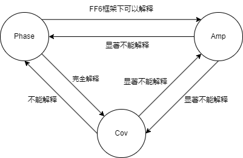

# Amplitude and Phase

现在有三个占比

$$
\begin{equation}
\begin{aligned}
    \frac{\mathbb{C}^{\text{LF}}}{\mathbb{C}} &= \frac{\sum_j^{\text{LF}}A_i^j A_m^j \cos \theta}{\rho \sqrt{\sum_j(A_i^j)^2}\sqrt{\sum_j(A_m^j)^2} } \\
    &= \frac{\rho^{\text{LF}} \sqrt{\sum_j^{\text{LF}}(A_i^j)^2}\sqrt{\sum_j^{\text{LF}} (A_m^j)^2}}{\rho \sqrt{\sum_j(A_i^j)^2}\sqrt{\sum_j(A_m^j)^2} } \\
    &= \frac{\rho^{\text{LF}}}{\rho} \cdot  \frac{\sqrt{\sum_j^{\text{LF}}(A_i^j)^2 \sum_j^{\text{LF}} (A_m^j)^2}}{\sqrt{\sum_j(A_i^j)^2 \sum_j (A_m^j)^2}}
\end{aligned}
\end{equation}
$$

其中

$$
\begin{equation}
    \rho^{\text{LF}} = \frac{\sum_j^{\text{LF}} A_j^j A_m^j \cos \theta }{\sqrt{\sum_j^{\text{LF}}(A_i^j)^2} \sqrt{\sum_j^{\text{LF}}(A_m^j)^2} }
\end{equation}
$$

所以相关系数占比为

$$
\begin{equation}
    \frac{\rho^{\text{LF}}}{\rho} = \frac{\frac{\sum_j^{\text{LF}} A_j^j A_m^j \cos \theta }{\sqrt{\sum_j^{\text{LF}}(A_i^j)^2} \sqrt{\sum_j^{\text{LF}}(A_m^j)^2} }}{\frac{\sum_j A_j^j A_m^j \cos \theta }{\sqrt{\sum_j(A_i^j)^2} \sqrt{\sum_j(A_m^j)^2} }}
\end{equation}
$$

振幅占比为

$$
\begin{equation}
    \frac{A^{\text{LF}}}{A} =  \frac{\sqrt{\sum_j^{\text{LF}}(A_i^j)^2 \sum_j^{\text{LF}} (A_m^j)^2}}{\sqrt{\sum_j(A_i^j)^2 \sum_j (A_m^j)^2}}
\end{equation}
$$

协方差占比是要越大越好，指得是两个序列低频部分协方差大小占总协方差的部分。

上一次的报告里已经测试了振幅 long short 和相位 long short 的相关性仅为 -0.3，接下来试一下 $\alpha$ 的互相解释。

可以看到相位无法被振幅所解释

|     Rho      | CAPM + Amp         | FF3 + Amp          | FF5 + Amp          | FF5 + Momentum + Amp   |
|:----------|:-------------------|:-------------------|:-------------------|:-----------------------|
| Intercept | 0.4*** (0.15)   | 0.36** (0.14)   | 0.47*** (0.16)  | 0.57*** (0.17)      |
| mktrf     | -0.05 (0.04)    | -0.1*** (0.04)  | -0.12*** (0.03) | -0.13*** (0.04)     |
| Amp       | -0.24*** (0.07) | -0.18*** (0.05) | -0.18*** (0.06) | -0.21*** (0.05)     |
| smb       |                  | 0.3*** (0.06)   | 0.23*** (0.06)  | 0.22*** (0.06)      |
| hml       |                  | 0.09 (0.1)      | 0.08 (0.11)     | -0.01 (0.11)        |
| rmw       |                  |                  | -0.33*** (0.1)  | -0.29*** (0.08)     |
| cma       |                  |                  | 0.03 (0.16)     | 0.09 (0.13)         |
| umd       |                  |                  |                  | -0.16** (0.08)      |
| Adj. R2   | 0.1                | 0.17               | 0.21               | 0.25                   |

但是相位在 FF6 框架下可以完全解释振幅，在其他框架下则不可以

|     Amp      | CAPM + Rho        | FF3 + Rho          | FF5 + Rho         | FF5 + Momentum + Rho   |
|:----------|:------------------|:-------------------|:------------------|:-----------------------|
| Intercept | -0.38** (0.16) | -0.43*** (0.15) | -0.39** (0.16) | -0.21 (0.18)        |
| mktrf     | 0.1 (0.07)     | 0.18*** (0.07)  | 0.17** (0.07)  | 0.13** (0.06)       |
| Rho       | -0.37*** (0.1) | -0.29*** (0.08) | -0.3*** (0.08) | -0.35*** (0.08)     |
| smb       |                 | -0.29*** (0.08) | -0.3*** (0.08) | -0.27*** (0.09)     |
| hml       |                 | 0.1 (0.08)      | 0.11 (0.12)    | -0.0 (0.08)         |
| rmw       |                 |                  | -0.08 (0.11)   | -0.04 (0.09)        |
| cma       |                 |                  | -0.01 (0.15)   | 0.06 (0.13)         |
| umd       |                 |                  |                 | -0.22** (0.09)      |
| Adj. R2   | 0.11              | 0.15               | 0.15              | 0.19                   |

如果用拆出来的两个因子解释协方差占比，结果更加惊人。此处有一个问题，就是为什么 Amp 对 Rho 都有解释作用，但是对 Cov 没有

|     Cov      | CAPM + Amp       | FF3 + Amp          | FF5 + Amp          | FF5 + Momentum + Amp   |
|:----------|:-----------------|:-------------------|:-------------------|:-----------------------|
| Intercept | 0.4*** (0.14) | 0.39*** (0.14)  | 0.5*** (0.15)   | 0.58*** (0.17)      |
| mktrf     | -0.07* (0.04) | -0.13*** (0.03) | -0.15*** (0.03) | -0.16*** (0.04)     |
| Amp       | 0.01 (0.07)   | 0.07 (0.05)     | 0.07 (0.05)     | 0.04 (0.05)         |
| smb       |                | 0.29*** (0.06)  | 0.21*** (0.06)  | 0.21*** (0.05)      |
| hml       |                | 0.04 (0.1)      | 0.02 (0.1)      | -0.04 (0.1)         |
| rmw       |                |                  | -0.35*** (0.09) | -0.32*** (0.08)     |
| cma       |                |                  | 0.05 (0.15)     | 0.09 (0.13)         |
| umd       |                |                  |                  | -0.13 (0.08)        |
| Adj. R2   | 0.01             | 0.08               | 0.14               | 0.16                   |

|     Cov      | CAPM + Rho        | FF3 + Rho         | FF5 + Rho         | FF5 + Momentum + Rho   |
|:----------|:------------------|:------------------|:------------------|:-----------------------|
| Intercept | -0.06 (0.05)   | -0.05 (0.05)   | -0.03 (0.05)   | -0.0 (0.06)         |
| mktrf     | -0.0 (0.02)    | 0.01 (0.02)    | 0.0 (0.02)     | -0.0 (0.02)         |
| Rho       | 0.85*** (0.04) | 0.86*** (0.03) | 0.85*** (0.04) | 0.85*** (0.03)      |
| smb       |                 | -0.06* (0.03)  | -0.07** (0.03) | -0.06** (0.03)      |
| hml       |                 | -0.02 (0.02)   | -0.03 (0.03)   | -0.04 (0.03)        |
| rmw       |                 |                 | -0.07** (0.03) | -0.07** (0.03)      |
| cma       |                 |                 | 0.02 (0.05)    | 0.03 (0.04)         |
| umd       |                 |                 |                 | -0.03 (0.02)        |
| Adj. R2   | 0.82              | 0.82              | 0.82              | 0.82                   |

不过反过来看，如果我们理解为相位是经过提纯后的协方差，那么协方差应该解释不了相位，事实也的确如此

| Rho       | CAPM + Cov        | FF3 + Cov         | FF5 + Cov         | FF5 + Momentum + Cov   |
|:----------|:------------------|:------------------|:------------------|:-----------------------|
| Intercept | 0.16*** (0.05) | 0.14*** (0.05) | 0.14*** (0.05) | 0.14** (0.06)       |
| mktrf     | -0.01 (0.02)   | -0.03* (0.02)  | -0.03* (0.02)  | -0.03* (0.02)       |
| Cov       | 0.96*** (0.03) | 0.93*** (0.03) | 0.93*** (0.03) | 0.93*** (0.03)      |
| smb       |                 | 0.12*** (0.04) | 0.12*** (0.04) | 0.12*** (0.04)      |
| hml       |                 | 0.03 (0.03)    | 0.04 (0.04)    | 0.03 (0.04)         |
| rmw       |                 |                 | -0.0 (0.03)    | -0.0 (0.03)         |
| cma       |                 |                 | -0.01 (0.05)   | -0.01 (0.05)        |
| umd       |                 |                 |                 | -0.0 (0.02)         |
| Adj. R2   | 0.82              | 0.83              | 0.83              | 0.83                   |

不过更有意思的来了，用协方差解释振幅，发现更加难以解释

| Amp       | CAPM + Cov         | FF3 + Cov         | FF5 + Cov          | FF5 + Momentum + Cov   |
|:----------|:-------------------|:------------------|:-------------------|:-----------------------|
| Intercept | -0.58*** (0.16) | -0.6*** (0.14) | -0.62*** (0.15) | -0.49*** (0.16)     |
| mktrf     | 0.13** (0.06)   | 0.23*** (0.06) | 0.23*** (0.06)  | 0.21*** (0.06)      |
| Cov       | 0.01 (0.12)     | 0.11 (0.09)    | 0.13 (0.1)      | 0.08 (0.1)          |
| smb       |                  | -0.42*** (0.1) | -0.41*** (0.1)  | -0.39*** (0.1)      |
| hml       |                  | 0.08 (0.1)     | 0.09 (0.13)     | 0.0 (0.11)          |
| rmw       |                  |                 | 0.07 (0.12)     | 0.09 (0.1)          |
| cma       |                  |                 | -0.03 (0.17)    | 0.03 (0.15)         |
| umd       |                  |                 |                  | -0.16* (0.09)       |
| Adj. R2   | 0.02               | 0.11              | 0.11               | 0.13                   |

所以现在的关系是，相位在某些情况下（FF6）能解释振幅，振幅无法解释相位。

这样看来，就像是通过对协方差占比的改造，在原有基础上做了增强（Phase），同时得到了一个独立的信息（Amp），并且这个独立的信息与相位十分相关。

并且结果上来看，不说 $\alpha$，Phase 和 Cov，Phase 和 Amp 在回归中系数都是显著的，但是 Cov 和 Amp 完全就是两个东西，各自在回归中的系数完全不显著，这么看来 Phase 是最重要的因素，Cov 和 Amp 都是它的一部分。

那么接下来我用 Cov 和 Amp 一起来解释 Phase，结果是完全解释了

| Rho       | CAPM + Cov + Amp   | FF3 + Cov + Amp    | FF5 + Cov + Amp    | FF5 + Momentum + Cov + Amp   |
|:----------|:-------------------|:-------------------|:-------------------|:-----------------------------|
| Intercept | 0.01 (0.04)     | -0.01 (0.04)    | -0.01 (0.04)    | 0.02 (0.04)               |
| mktrf     | 0.02* (0.01)    | 0.02* (0.01)    | 0.02* (0.01)    | 0.02 (0.01)               |
| Cov       | 0.97*** (0.02)  | 0.96*** (0.02)  | 0.96*** (0.02)  | 0.95*** (0.02)            |
| Amp       | -0.25*** (0.02) | -0.24*** (0.02) | -0.24*** (0.02) | -0.25*** (0.02)           |
| smb       |                  | 0.02 (0.02)     | 0.02 (0.02)     | 0.03 (0.02)               |
| hml       |                  | 0.05** (0.02)   | 0.06** (0.03)   | 0.04 (0.02)               |
| rmw       |                  |                  | 0.01 (0.04)     | 0.02 (0.03)               |
| cma       |                  |                  | -0.02 (0.04)    | 0.0 (0.03)                |
| umd       |                  |                  |                  | -0.04*** (0.01)           |
| Adj. R2   | 0.91               | 0.91               | 0.91               | 0.91                         |

