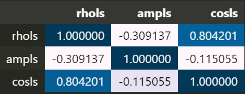
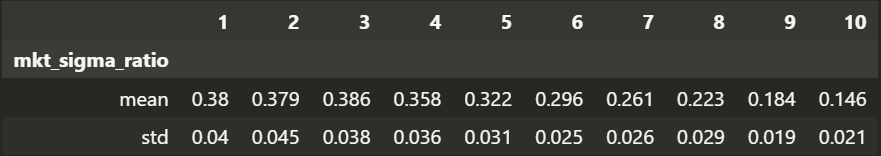
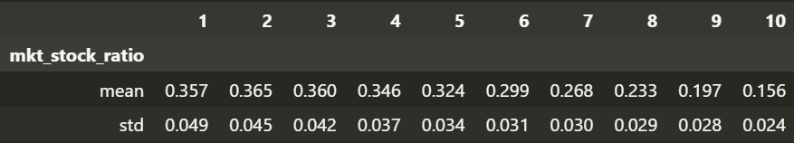
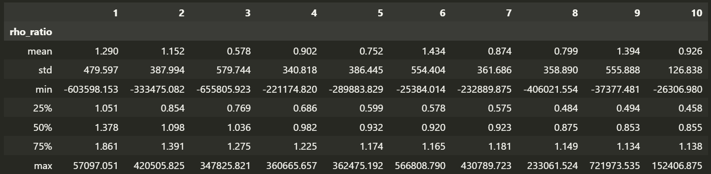

# More

我们来直接看相位差的影响，发现相位差也是一个需要标准化的东西，高频相位差大的股票低频相位差也很大。

|           | 1.0               | 2.0                | 3.0                | 4.0                | 5.0               | 6.0                | 7.0                | 8.0                | 9.0                | 10.0               | long_short         |
|:----------|:------------------|:-------------------|:-------------------|:-------------------|:------------------|:-------------------|:-------------------|:-------------------|:-------------------|:-------------------|:-------------------|
| Intercept | 0.18* (0.1)    | 0.04 (0.06)     | 0.15*** (0.06)  | 0.25*** (0.08)  | 0.27*** (0.07) | 0.29*** (0.08)  | 0.36*** (0.11)  | 0.41*** (0.14)  | 0.5*** (0.17)   | 0.76*** (0.17)  | 0.58*** (0.15)  |
| mktrf     | 0.85*** (0.04) | 1.04*** (0.02)  | 1.06*** (0.02)  | 1.05*** (0.02)  | 1.04*** (0.02) | 1.04*** (0.02)  | 0.99*** (0.03)  | 0.95*** (0.03)  | 0.84*** (0.04)  | 0.72*** (0.04)  | -0.12*** (0.04) |
| smb       | 0.81*** (0.05) | 0.7*** (0.03)   | 0.73*** (0.03)  | 0.8*** (0.03)   | 0.85*** (0.04) | 0.91*** (0.04)  | 0.95*** (0.04)  | 0.99*** (0.04)  | 1.03*** (0.06)  | 0.97*** (0.07)  | 0.15** (0.07)   |
| hml       | 0.01 (0.06)    | -0.04 (0.04)    | -0.05 (0.04)    | -0.02 (0.04)    | 0.02 (0.05)    | 0.03 (0.06)     | 0.05 (0.05)     | 0.04 (0.07)     | 0.0 (0.09)      | 0.03 (0.11)     | 0.02 (0.12)     |
| rmw       | -0.01 (0.06)   | 0.03 (0.04)     | -0.1*** (0.04)  | -0.11*** (0.04) | -0.12** (0.05) | -0.15*** (0.05) | -0.15** (0.06)  | -0.21*** (0.07) | -0.25*** (0.08) | -0.23*** (0.09) | -0.22*** (0.08) |
| cma       | 0.14 (0.1)     | 0.1* (0.06)     | 0.09* (0.05)    | 0.05 (0.05)     | 0.03 (0.06)    | 0.09 (0.06)     | 0.08 (0.08)     | 0.06 (0.1)      | 0.09 (0.11)     | 0.1 (0.13)      | -0.04 (0.13)    |
| umd       | -0.03 (0.03)   | -0.09*** (0.02) | -0.14*** (0.02) | -0.21*** (0.03) | -0.2*** (0.03) | -0.23*** (0.04) | -0.25*** (0.05) | -0.26*** (0.06) | -0.25*** (0.08) | -0.18*** (0.07) | -0.15** (0.06)  |
| Adj. R2   | 0.83              | 0.95               | 0.96               | 0.95               | 0.95              | 0.94               | 0.93               | 0.89               | 0.82               | 0.73               | 0.12               |

这个 $\alpha$ 的大小与维度，令我非常的熟悉，于是我直接做了个测试，用 Cos 去解释 Cov，完全解释

| Cov       | CAPM + Cos        | FF3 + Cos         | FF5 + Cos          | FF5 + Momentum + Cos   |
|:----------|:------------------|:------------------|:-------------------|:-----------------------|
| Intercept | 0.07 (0.08)    | 0.07 (0.08)    | 0.1 (0.09)      | 0.12 (0.1)          |
| mktrf     | -0.03* (0.02)  | -0.05** (0.02) | -0.05** (0.02)  | -0.06*** (0.02)     |
| Cos       | 0.81*** (0.04) | 0.79*** (0.05) | 0.77*** (0.05)  | 0.76*** (0.04)      |
| smb       |                 | 0.1* (0.05)    | 0.07** (0.04)   | 0.07** (0.04)       |
| hml       |                 | -0.0 (0.05)    | -0.05 (0.05)    | -0.06 (0.04)        |
| rmw       |                 |                 | -0.15*** (0.06) | -0.15** (0.06)      |
| cma       |                 |                 | 0.12* (0.07)    | 0.12** (0.06)       |
| umd       |                 |                 |                  | -0.02 (0.04)        |
| Adj. R2   | 0.62              | 0.62              | 0.64               | 0.64                   |

答案到这里已经不言自明了，协方差占比的信息就是相位的信息，而之所以相位解释不了相关系数，是因为相关系数中还包含了振幅的信息，一旦加上振幅，相关系数的信息就也可以被解释了。

通过相关系数，也可以看出相位差因子和振幅因子的相关性进一步降低了，也符合之前的逻辑。

效果也是十分接近，但是感觉这样解释上更干净一些。

|   amp \ cos | 0                | 1                 | 2                 | 3                 | 4                 |
|------------:|:-----------------|:------------------|:------------------|:------------------|:------------------|
|           0 | 0.32** (0.13) | 0.3*** (0.11)  | 0.47*** (0.13) | 0.6*** (0.17)  | 0.91*** (0.18) |
|           1 | 0.1 (0.1)     | 0.22** (0.09)  | 0.32*** (0.1)  | 0.48*** (0.14) | 0.67*** (0.19) |
|           2 | 0.03 (0.09)   | 0.12* (0.07)   | 0.28*** (0.08) | 0.53*** (0.14) | 0.65*** (0.2)  |
|           3 | 0.03 (0.09)   | 0.26*** (0.08) | 0.24* (0.12)   | 0.31*** (0.1)  | 0.55*** (0.18) |
|           4 | 0.04 (0.1)    | 0.27*** (0.08) | 0.28*** (0.1)  | 0.2 (0.15)     | 0.29 (0.18)    |

## 描述性统计量

$$
\begin{equation}
    \text{Cov ratio}^{\text{LF}} = \frac{\rho^{\text{LF}}}{\rho} \cdot \frac{\sigma^{\text{LF}}_i}{\sigma_i} \cdot \frac{\sigma^{\text{LF}}_m}{\sigma_m}
\end{equation}
$$

我们分别看一下各频率三个指标的描述性统计量，1-10 代表低频至高频。

对于市场频率波动率，**随着频率上升，取值和波动都会下降**。

对于个股来说，趋势同样如此。

因为 rho 的标准差太大，均值受到很大影响，所以意义不大。不过看三个分位数的话，可以看到也是随着频率的提升，在逐渐减小。

## Theory

理清一些定义

$$
\begin{equation}
\begin{aligned}
\text{Cross Covariance}:& \quad C_{yx}(h)=\mathrm{Cov}(y_t,x_{t-h}) \\
\text{Cross Spectrum}:& \quad f_{yx}(\lambda)=\frac1{2\pi}\sum_{h=-\infty}^\infty C_{yx}(h)e^{-\mathrm{i}\lambda h}, 
\end{aligned}
\end{equation}
$$

功率谱密度 (**Power Spectral Density**, PSD)，直观来说就是每个频率上振幅的平方乘上一个系数（样本长度的倒数），衡量了每个频率上的能量，但是为了与 FDR 的形式统一，PSD 还可以通过自相关函数的傅里叶变换来表达 (**Wiener–Khinchin theorem**)。

$$
\begin{equation}
    S_{xx}(\lambda)=\frac1{2\pi}\sum_{h=-\infty}^\infty C_{xx}(h)e^{-i\lambda h}=\hat{C}_{xx}(\lambda)
\end{equation}
$$

> \hat 表示傅里叶变换

PSD 可以通过信号自己的频谱和其共轭的乘积来计算

$$
\begin{equation}
    S_{xx}(\lambda) = \frac{1}{N} \hat{x}(t)\hat{x}^*(t)
\end{equation}
$$

交叉功率谱密度(Cross power spectral density, CPSD)。假设序列 $x(t)$ 和 $y(t)$ 都有对应的 PSD $S_{xx}(\lambda)$ 和 $S_{yy}(\lambda)$，因而得以定义 CPSD，正如功率谱密度（PSD）可以通过Wiener-Khinchin 定理用自相关函数来表达，交叉功率谱密度（CPSD）也可以通过两个信号的互相关函数来表达。

$$
\begin{equation}
    S_{xy}(\lambda) = \frac1{2\pi}\sum_{h=-\infty}^\infty C_{xy}(h)e^{-i\lambda h}=\hat{C}_{xy}(\lambda) = \frac{1}{N} \hat{x}(t)\hat{y}^*(t)
\end{equation}
$$

CPSD 正是 FDR 在计算过程中所使用到的公式，按理说 CPSD 反映了两个信号在对应频率上的相关性，一般来说我们认为股票的特异性波动属于高频部分，从这方面理解，也许是低频具有显著 $\alpha$ 的原因。

并且，FDR 只取了 CPSD 的实数部分，并没有使用完整的相位信息，进行共轭计算后，实数部分和虚数部分分别如下

$$
\begin{equation}
\begin{aligned}
\text{Real}:& \ A^j_xA^j_y \cos(\theta^j_x - \theta^j_y) \\
\text{Imag}:& \ A^j_xA^j_y \sin(\theta^j_x - \theta^j_y)
\end{aligned}
\end{equation}
$$

实数部分反映了两个信号的相位差的余弦值，**这个值说明两个信号在该频率上的相位一致性程度**。如果相位差接近0°或180°（即两个信号或者是同相或反相），余弦值将接近1或-1，表明它们在这个频率上非常一致或完全反相。

而虚数部分反映了相位差的正弦值，**提供了两个信号之间的相位领先或落后关系的信息**。如果正弦值显著（远离0），这意味着相位差在90°或270°附近，表示一个信号相对于另一个信号有明显的领先或落后。

所以，FDR 想要衡量的是**两个信号的一致程度**，而并没有捕捉其领先或落后的关系。因此我们在谈到相位的时候，我们说的实际上是两个原始信号的相位差，而不是 CPSD 的相位。

Squared coherency spectrum 也可以用来衡量两个信号在特定频率上的线性相关程度

$$
\begin{equation}
    \gamma^2_{xy}(\lambda)=\frac{|S_{xy}|^2(\lambda)}{S_{xx}(\lambda)S_{yy}(\lambda)},
\end{equation}
$$

按照互协方差的表达，也可以写为：

$$
\begin{equation}
\gamma^2_{xy}(\lambda) = \frac{|\hat{C}_{xy}(\lambda)|^2}{\hat{C}_{xx}(\lambda)\hat{C}_{yy}(\lambda)}
\end{equation}
$$

讨论两个信号之间的关系，有一个专门的领域叫做 Cross-Spectral Analysis，研究一下，看看能否获得更多的解释。

