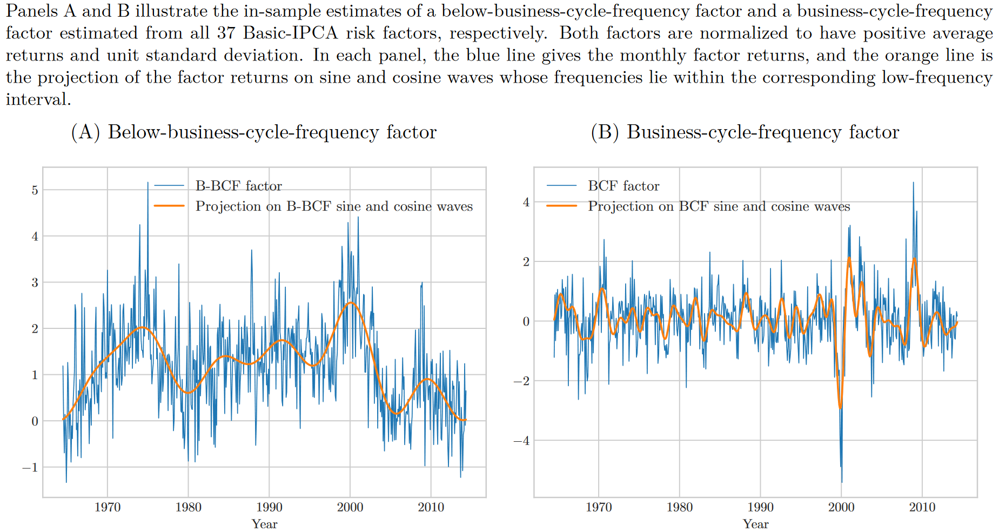
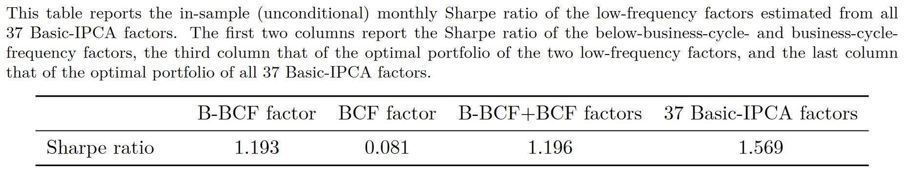
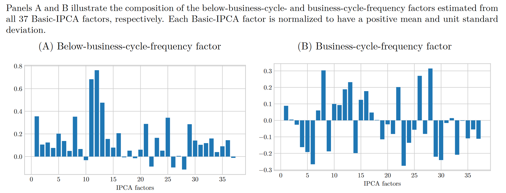
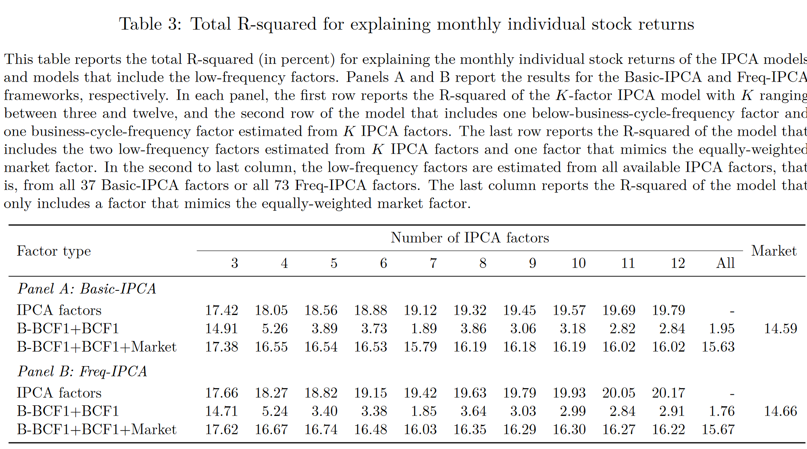
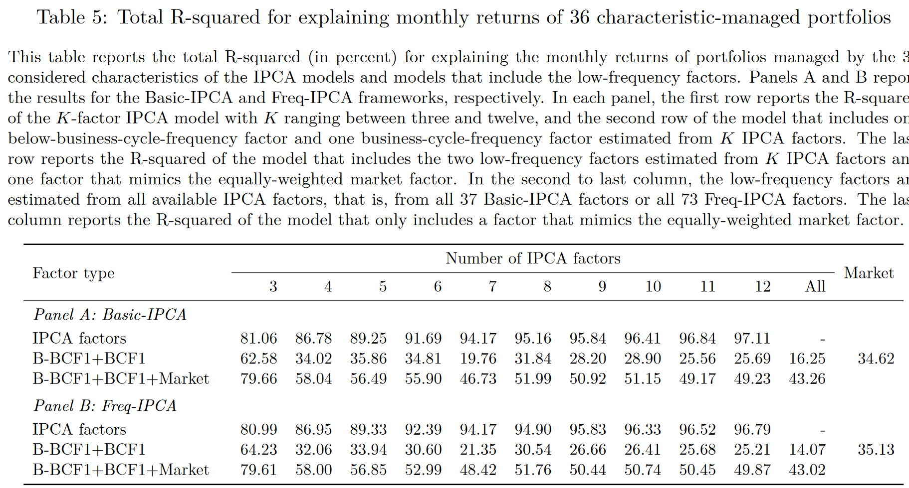
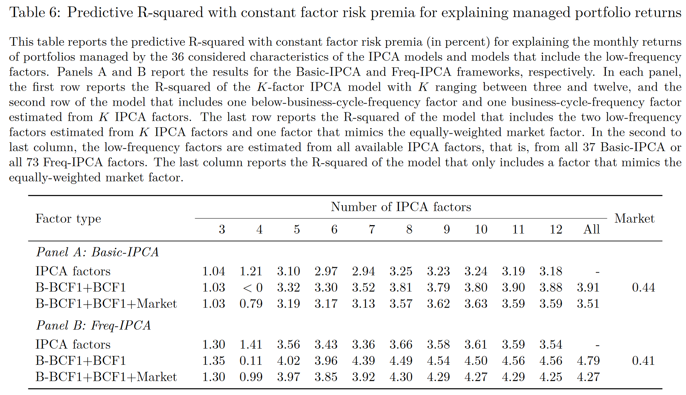
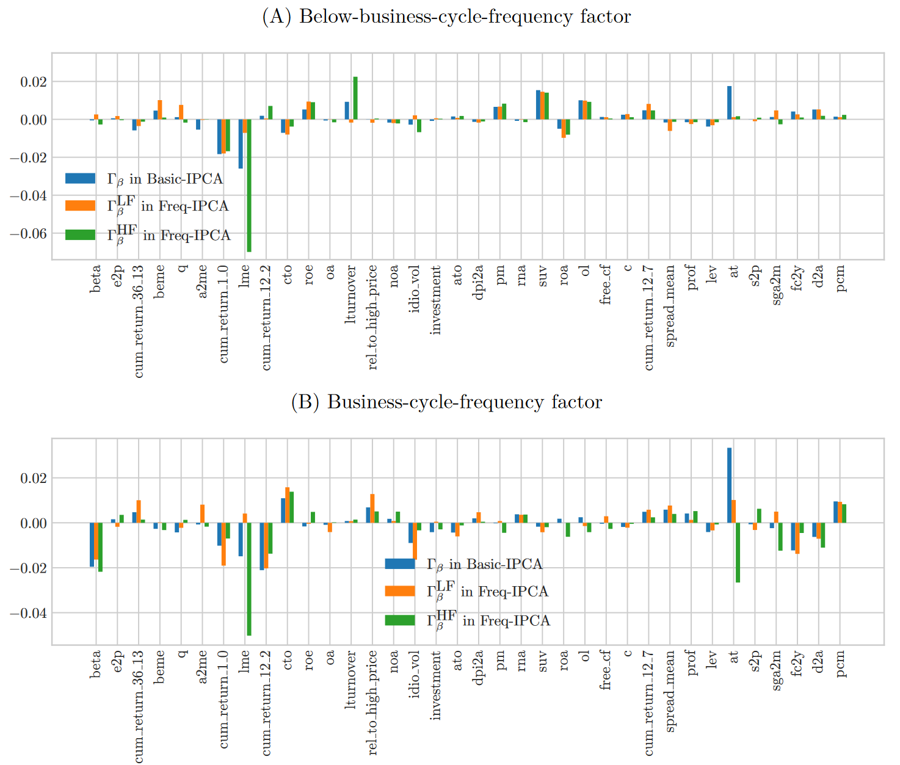
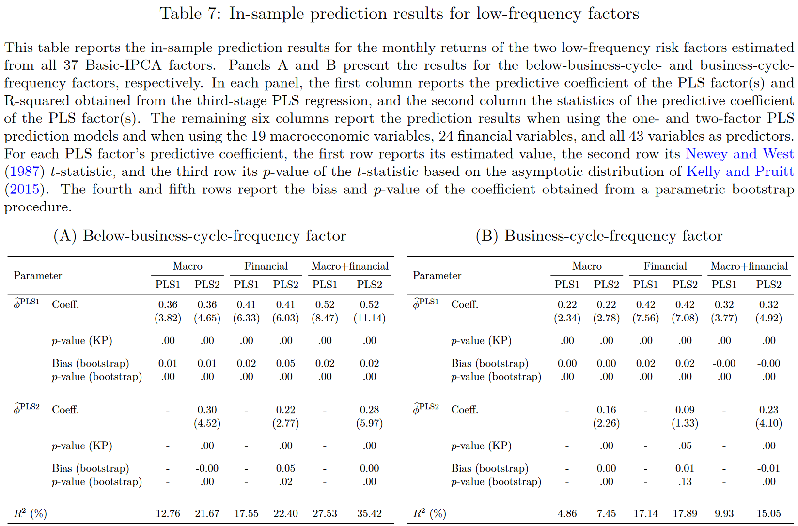

# Low-Frequency Risk Factors and Their Fundamental Drivers

Sicong Li, London Business School, Working paper.

Motivation: *Many variables that drive the variation of risk premia in theoretical asset-pricing models and those conventionally used for empirical return prediction are persistent*

## Method

股票收益率符合以下 DGP，$f$ 代表因子。

$$
\begin{equation}
\underbrace{r_{t+1}}_{N\times1}=\underbrace{\beta_t}_{N\times K}\underbrace{f_{t+1}}_{K\times1}+\underbrace{\varepsilon_{t+1}}_{N\times1},
\end{equation}
$$

而这些因子是由 $J$ 个无法观测到的 state variable 生成的，并且 $\mathbb{E}[x_t]=0$

$$
\begin{equation}
    \underbrace{f_{t+1}}_{K\times1}=\underbrace{\mu_f}_{K\times1}+\underbrace{\phi}_{K\times J}\underbrace{x_t}_{J\times1}+\underbrace{\xi_{t+1}}_{K\times1},
\end{equation}
$$

关于 state variable 的假设说明 risk premium 是时变的。

因此股票的条件预期收益率的变化是由**风险**和**风险溢价**的变化导致的

$$
\mathbb{E}_t\left[r_{t+1}\right]=\beta_t\left(\mu_f+\phi x_t\right),
$$

## Risk factors with time-varying risk premia

State variable 本身是不可观测的，但是可以通过方法估计出 state variable 的 loading。

假设只有一个 state variable 有时变的 risk premium。将因子的协方差标准化为单位矩阵并且，且 loading 长度为一，即 $\Sigma_f=\mathbf{I}_K$ 且 $\phi^\top\phi=1$，并且 $\Lambda$ 是一个 $K \times (K-1)$ 维正交矩阵，且与 $\phi$ 正交，那么 $\Lambda^\top\Lambda=\mathbf{I}_{K-1}$ 且 $\Lambda^\top\phi=\mathbf{0}$，则有

$$
\begin{align}
\phi^\top f_{t+1}=\phi^\top\mu_f+x_t+\phi^\top\xi_{t+1},\\ 
\Lambda^\top f_{t+1}=\Lambda^\top\mu_f+\mathbf{0}+\Lambda^\top\xi_{t+1}.
\end{align}
$$

$\phi^\top f_{t+1}$ 则是唯一一个由 state variable 驱动，有着时变风险溢价的风险因子，$\Lambda^\top f_{t+1}$ 则是其余 $K-1$ 个有着 constant 风险溢价的因子。

通过 $\phi$ 对这些因子进行综合，可以提高信噪比，因为自变量解释方差的程度提升了

$$
\begin{equation}
    \frac{\text{trace}\left(\phi\phi^\top\sigma_x^2\right)}{\text{trace}\left(\Sigma_f\right)}=\frac{\sigma_x^2}{K}<\frac{\sigma_x^2}{\mathbb{V}ar\left(\phi^\top f_{t+1}\right)}=\sigma_x^2,
\end{equation}
$$

在通过 $\phi$ 进行综合风险因子前后的夏普比率可以表达如下

$$
\begin{align}
\mathrm{SR}_f&=\left(\mu_f^\top\Sigma_\xi^{-1}\mu_f\right)^{1/2} \\
\mathrm{SR}_{\phi^\top f}&=\left[\left(\phi^\top\mu_f\right)^\top\left(\phi^\top\Sigma_\xi\phi\right)^{-1}\left(\phi^\top\mu_f\right)\right]^{1/2}
\end{align}
$$

并且有 $\mathrm{SR}_\phi\top_f\leq\mathrm{SR}_f$，二者的比值可以反映出**时变的风险因子对整体的夏普比率贡献了多少**。举例来说，如果 $\mu_f$ is proportional to $\phi$，那么所有的夏普比率都来自于时变的 state variable，即 $\Lambda^\top\mu_f=\mathbf{0}$。

 **Proposition 1**：假设 $\sum_f=\mathbf{I}_K, \phi^\top\phi=\mathbf{I}_J$ 则有

$$
\begin{equation}
\frac{SR_{\phi^\top f}}{SR_f}\geq\frac{\|\phi^\top\mu_f\|_2}{\|\mu_f\|_2}.
\end{equation}
$$

特别地，当 $\mu_f\in span(\phi)$ 时，不等式取等号。不等式右侧就是这一贡献比率的 lower bound。

## Frequency-specific risk factors

因为 $\xi_{t+1}$ 是 cross-sectionally correlated，所以标准的方法无法使用 (the methods in Section 6.4 of Campbell, Lo, and MacKinlay,1997)， 并且 state variable 的数量是不可观测的，但是通过非参数的方法可以估计出风险因子在 state variable 上面的 loading。式（2）等价于

$$
\begin{equation}
    f_{t+1}=\mu_f+\phi GG^\top x_t+\xi_{t+1},
\end{equation}
$$

其中 $G$ 是 $J \times J$ 维的旋转矩阵，满足 $GG^\top=G^\top G=\mathbf{I}_J$，那么 $(\phi G)^\top(\phi G)=\mathbf{I}_J$，此时，**通过 $G$ 就可以施加频率方面的限制**。同理

$$
\begin{equation}
    G^\top\phi^\top f_{t+1}=G^\top\phi^\top\mu_f+G^\top x_t+G^\top\phi^\top\xi_{t+1}.
\end{equation}
$$

之所以能这么做，是因为 factor innovation $\xi_{t+1}$ 和 state variable 在频域上有不同的性质。$\xi_{t+1}$ 在时序上没有相关性，所以与频率无关，但是 state variable 却非常的 persistent。因此 $\xi_{t+1}$ 在高频和低频上的表现就会一致，但是 state variable 就会更加集中于低频。在接下来估计的过程中，就会涉及到频域的概念。

对于自协方差相关性矩阵进行傅里叶分解有

$$
\begin{equation}
    \mathbf{g}_f\left(\omega\right)=\sum_{k=-\infty}^\infty\Sigma_f\left(k\right)e^{-i\omega k},
\end{equation}
$$

同样，逆傅里叶变换有

$$
\begin{equation}
    \Sigma_f\left(k\right)=\frac{1}{2\pi}\int_{-\pi}^{\pi}\mathbf{g}_f\left(\omega\right)e^{i\omega k}d\omega.
\end{equation}
$$

那么协方差就可以写为

$$
\begin{equation}
    \Sigma_f=\Sigma_f\left(0\right)=\frac{1}{2\pi}\int_{-\pi}^{\pi}\mathbf{g}_f\left(\omega\right)d\omega.
\end{equation}
$$

根据 Spectral Representation Theorem，任何协方差平稳且均值为零的时间序列 $X_t$ 都可以被表示为

$$
\begin{equation}
    X_t=\int_{-\pi}^{\pi}e^{i\omega t}dZ\left(\omega\right)=\int_{-\pi}^{\pi}\left[\cos\left(\omega t\right)+i\sin\left(\omega t\right)\right]dZ\left(\omega\right),
\end{equation}
$$

> Brockwell, Peter J., and Richard A. Davis, 2009, Time Series: Theory and Methods (Springer Science & Business Media).

并且 $Z(\omega)$ 满足

$$
\begin{equation}
    \mathbb{Var}\left[Z\left(\omega_2\right)-Z\left(\omega_1\right)\right]=\frac{1}{2\pi}\int_{\omega_1}^{\omega_2}g_X\left(\omega\right)d\omega,
\end{equation}
$$

其中 $Z(\omega)$ 是复数域上的均值为零随机过程，$g_X(\omega)$ 是 $X_t$ 的 spectral density function。

基于式（13），自然可以把协方差分配到不同频率上

$$
\begin{equation}
    \begin{aligned}\Sigma_f&=\underbrace{\frac{1}{2\pi}\int_{[-\omega,\omega]}\mathbf{g}_f\left(\lambda\right)d\lambda}_{\Sigma_f^{\mathrm{LF}}}+\underbrace{\frac{1}{2\pi}\int_{[-\pi,-\omega)\cup(\omega,\pi]}\mathbf{g}_f\left(\lambda\right)d\lambda}_{\Sigma_f^{\mathrm{HF}}},\end{aligned}
\end{equation}
$$

对于 factor innovation $\xi_{t+1}$ 来说，因为其 conditionally uncorrelated，所以其自协方差矩阵满足 $\begin{aligned}\Sigma_\xi(k)=\mathbf{0}\text{ for }k\neq0\end{aligned}$，因此其谱密度矩阵为

$$
\begin{equation}
    \mathbf{g}_\xi\left(\omega\right)=\sum_{k=-\infty}^\infty\Sigma_\xi\left(k\right)e^{-i\omega k}=\Sigma_\xi,
\end{equation}
$$

与频率无关。

又因为 $\Sigma_f=\phi\Sigma_x\phi^\top+\Sigma_\xi$，所以可以写为

$$
\begin{equation}
\Sigma_f=\frac1{2\pi}\int_{-\pi}^\pi\phi\mathbf{g}_x\left(\omega\right)\phi^\top d\omega+\Sigma_\xi=\frac1{2\pi}\int_{-\pi}^\pi\left[\phi\mathbf{g}_x\left(\omega\right)\phi^\top+\Sigma_\xi\right]d\omega.
\end{equation}
$$

谱密度之间的关系为

$$
\begin{equation}
    \mathbf{g}_f\left(\omega\right)=\phi\mathbf{g}_x\left(\omega\right)\phi^\top+\Sigma_\xi.
\end{equation}
$$

因此低频与高频协方差矩阵可以写为

$$
\begin{align}
\Sigma_f^{\mathrm{LF}}&=\phi\underbrace{\left(\frac{1}{2\pi}\int_{[-\omega,\omega]}\mathbf{g}_x\left(\lambda\right)d\lambda\right)}_{\Sigma_x^{\mathrm{LF}}}\phi^\top+\frac{\omega}{\pi}\Sigma_\xi, \\
\Sigma_f^{\text{HF}}&=\phi\underbrace{\left(\frac{1}{2\pi}\int_{[-\pi,-\omega)\cup(\omega,\pi]}\mathbf{g}_x\left(\lambda\right)d\lambda\right)}_{\Sigma_x^{\text{HF}}}\phi^\top+\frac{\pi-\omega}{\pi}\Sigma_\xi
\end{align}
$$

如果 state variable 与频率也无关，那么对于任何 risk factor 的线性组合 $\theta$，低频方差比上高频方差都会是一个常数

$$
\begin{equation}
    \frac{\theta^\top\Sigma_f^{\mathrm{LF}}\theta}{\theta^\top\Sigma_f^{\mathrm{HF}}\theta}=\frac{\theta^\top\phi\left(\frac1{2\pi}\int_{[-\omega,\omega]}\mathbf{g}_x\left(\lambda\right)d\lambda\right)\phi^\top\theta+\frac\omega\pi\theta^\top\Sigma_\xi\theta}{\theta^\top\phi\left(\frac1{2\pi}\int_{[-\pi,-\omega)\cup(\omega,\pi]}\mathbf{g}_x\left(\lambda\right)d\lambda\right)\phi^\top\theta+\frac{\pi-\omega}\pi\theta^\top\Sigma_\xi\theta}=\frac\omega{\pi-\omega},
\end{equation}
$$

但是根据现有文献的结果，state variable 在不同频率上的表现是不一致的。例如 Campbell and Cochrane (1999) 指出 state variable is highly persistent，这说明其在低频的谱密度要更高。因此 state variable 不同频率方差的比值应该大于这一数值

$$
\begin{equation}
    \frac{\left(\sigma_{x}^{2}\right)^{{\mathrm{LF}}}}{\left(\sigma_{x}^{2}\right)^{{\mathrm{HF}}}}>\frac\omega{\pi-\omega}.
\end{equation}
$$

> Campbell, John Y., and John H. Cochrane, 1999, By force of habit: A consumption-based explanation of aggregate stock market behavior, ***Journal of Political Economy*** 107, 205–251.

可以证明，最大化 $(\theta^\top\Sigma_f^\text{LF}\theta)/(\theta^\top\Sigma_f^\text{HF}\theta)$ 的 $\theta^*$ 满足 $\theta^*\propto\phi$，因此只要最大化该式，就可以确定因子 loading，该优化问题可以写为：

$$
\begin{align}
\begin{aligned}&\max_{c,\theta}\quad c,\\&\mathrm{s.t.}\quad\theta^\top\left(\Sigma_f^{\mathrm{LF}}-c\Sigma_f^{\mathrm{HF}}\right)\theta\geq0.\end{aligned}
\end{align}
$$

最优的 $c^*$ 会使得矩阵 $\Sigma_f^{\mathrm{LF}}-c\Sigma_f^{\mathrm{HF}}$ 的最大特征值趋于零，并且最优的 $\theta^*$ 是对应的特征向量。

接下来会有一些关于求解细节的推导。

**Lemma 1** 

矩阵

$$
\begin{equation}
    W=\left(\mathbf{I}_J-\Sigma_x+\frac{\pi}{\pi-\omega}\Sigma_x^{HF}\right)^{-1/2}\left(\mathbf{I}_J-\Sigma_x+\frac{\pi}{\omega}\Sigma_x^{LF}\right)\left(\mathbf{I}_J-\Sigma_x+\frac{\pi}{\pi-\omega}\Sigma_x^{HF}\right)^{-1/2}
\end{equation}
$$

的最大特征值大于一 **当且仅当** 存在 $\eta\in\mathbb{R}^J$ 满足

$$
\begin{equation}
    \frac{\eta^\top\Sigma_x^{LF}\eta}{\eta^\top\Sigma_x^{HF}\eta}>\frac\omega{\pi-\omega}.
\end{equation}
$$

如果通过 Proposition 1 保证 low-frequency state variable 的存在，那么通过 Proposition 2 就可以求解出 risk factors 在该 state variable 上的 loading。

**Proposition 2**

当式（26）成立时，优化问题最优解为

$$
\begin{align}
    c^*=&\frac\omega{\pi-\omega}\lambda_1^W, \\
    \theta^*\propto&\phi\left(\mathbf{I}_J-\Sigma_x+\frac\pi{\pi-\omega}\Sigma_x^{HF}\right)^{-1/2}H_1\equiv\phi G_1,
\end{align}
$$

其中 $\lambda_1^{W} > 1$ 是最大的特征值，并且 $H_1$ 是对应最大的特征向量。如果式（26）不成立，则最优解为

$$
\begin{align}
    c^*&=\frac\omega{\pi-\omega}, \\
    \theta^* &\propto \Lambda y
\end{align}
$$

这也就是说，如果存在低频因子，那么其 loading 一定为

$$
\begin{equation}
    (\theta^*)^\top f_{t+1}=x_t^1+\frac{G_1^\top\phi^\top\xi_{t+1}}{\|G_1\|_2}, \quad x_t^1=\frac1{\|G_1\|_2}G_1^\top x_t.
\end{equation}
$$

$x_1$ 就是 low-frequency state variable。

### Freq-IPCA

对 IPCA 的改进：Baba Yara, Boons, and Tamoni (2020) show that portfolios sorted based on the past values of firm characteristics capture risk premia unexplained by those based on the present values of characteristics, implying that the persistent and transitory components of characteristics are associated with different components of risk compensation.

> Baba Yara, Fahiz, Martijn Boons, and Andrea Tamoni, 2020, Persistent and transitory components of characteristics: Implications for asset pricing, Available at SSRN 3529140.

IPCA 中仅包括当期的公司特征，不包括过去的特征，所以作者加上过去的特征，整了一个 Freq-IPCA，

$$
\begin{equation}
    \beta_t=Z_t^{\mathrm{LF}}\Gamma_\beta^{\mathrm{LF}}+Z_t^{\mathrm{HF}}\Gamma_\beta^{\mathrm{HF}},
\end{equation}
$$

其中，$Z_t^{\mathrm{LF}}$ 和 $Z_t^{\mathrm{HF}} $ 满足 $Z_t^{\mathrm{LF}}+Z_t^{\mathrm{HF}}=Z_t$。

$Z_t^{\mathrm{LF}}$ 就是过去 36 个月公司特征的平均值，$Z_t^{\mathrm{HF}}$ 是当前值与 $Z_t^{\mathrm{LF}}$ 的差。

## Emprics

文章划分了三个频率段

1. Below-business-cycle-frequency (B-BCF) : Longer than eight years
2. Business-cycle-frequency (BCF) : between 1.5 and eight years
3. High-frequency : shorter than 6 years

文章重点关注前两个周期，B-BCF 和 BCF 都被称为低频周期因子。

文章使用了和 IPCA 同样的数据，36 个公司特征加上一个常数项，因此共有 37 个因子。

### Economic relationship

因为 state variable 是不可观测的，所以假设他是可观测经济变量的 factor，来看和经济因素之间的联系，

$$
\begin{equation}
    z_t=b_0+bx_t^1+e_t,
\end{equation}
$$

其中 $z_t$ 就是 $M$ 个可观测的经济变量，而 $x_t$ 实际上可以预测 $(\theta^*)^\top f_{t+1}$ 的信息。文章使用了 Kelly and Pruitt (2015) 提出的 three-pass regression, which is a generalization of the partial least square (PLS) 进行实证

> Kelly, Bryan, and Seth Pruitt, 2015, The three-pass regression filter: A new approach to forecasting using many predictors, ***Journal of Econometrics*** 186, 294–316.

第一步将这些经济变量回归到估计出的 low-frequency factor 上，

$$
\begin{equation}
    z_t=\widehat{\kappa}_0+\widehat{\kappa}\left[(\theta^*)^\top f_{t+1}\right]+u_t,
\end{equation}
$$

第二步进行截面回归，将 $z_t$ 回归到第一步估计出来的系数上

$$
\begin{equation}
    z_t=\widehat{c}_t+\widehat{\kappa}\widehat{g}_t+w_t,
\end{equation}
$$

此时回归系数 $\hat{g}_t$ 就是估计出的 PLS factor。

第三步将低频因子回归到第二步估计出的 $\hat{g}_t$ 上，此时的 $R^2$ 就代表了可观测经济变量对于低频因子的预测能力。

文章通过 three-pass regression, which is a generalization of the partial least square (PLS)，发现有 19 个宏观变量和 24 个金融变量能够预测 B-BCF 和 BCF 的收益率。

### Return and composition of low-frequency factors

文章从 37 个因子中估计出的 B-LF 和 LF 如下，二者都进行了标准化使得平均收益率为正，标准差为 1。

通过橙线可以看出因子预期收益率的变化。

通过 proposition 1 可知，至少 76.2% 的风险溢价是由 B-LF 的 time-series variation 带来的，这也就是说，可以通过择时来提高预期收益率。

相比之下 LF 就对于风险溢价的解释没那么重要，但是这并不代表 LF 是没有意义的，因为 LF 携带了关于 conditional 的信息。

之前说过，我们求解得到的是这些因子在 state variable 上的 loading，结果如下

这里同样，所有的 IPCA factor 都被标准化为正的收益率和单位标准差。

B-LF 的所有系数都基本为正，这说明 B-LF 像是一个 **level** factor，沿着同一个方向驱动所有因子的风险溢价，也就是说，当 B-LF 的风险溢价达到高点，所有因子的风险溢价也会很高。

而 LF 则像是一个 **long-short** factor，可以看出尽管 low-order PC 相比于 high-order PC 在 B-LF 上的 loading 更低，但是在 LF 上面的 loading 却相仿，说明 unconditional zero mean 不代表 conditional non-zero。

### Explaining returns of individual stocks and characteristic-managed portfolios

参考了 IPCA 的 predictive $R^2$ 和 total $R^2$。

Freq-IPCA 比 IPCA 的估计好一些，但是毕竟是多了一倍的参数量。至于两个 low-frequency factor 则没什么解释力度，因为这两个因子与 market 相关性极低，而 market 又是最重要的定价因子，加上 market 之后，效果就好一些，比 FF5 啥的要高了。

对于 portfolio 来说结果也差不多。

但是 predictive $R^2$ 的结果则很不错。

### Mapping

### Economic relationship

通过 PLS 发现 19 个宏观经济变量和 24 个金融变量可以很好的预测两个低频因子 $t+1$ 期的收益率。

