# Frequency Dependent Risks in the Factor Zoo

Jiantao Huang, working paper, 2023

SDF 需要能够解释资产横截面预期收益率的差异。自从 CCAPM 所提出的 SDF 失败了之后 [see Rubinstein (1976), Lucas (1978), Breeden (1979)]，学术界提出了各种各样的 SDF 模型。

一些模型是向 SDF 中引入 slow-moving component。

- the surplus consumption ratio (Campbell and Cochrane, 1999)
- the stochastic mean and variance of consumption growth (Bansal and Yaron, 2004)

还有一些模型中，SDF 中仅包括了 fast-moving component。

- output jumps (Barro, 2006)
- the intermediary’s consumption growth (He and Krishnamurthy, 2013)
- sentiment-driven demand shocks (Kozak, Nagel, and Santosh, 2018)

但是这些模型要么是 fast-moving SDF，要么是 slow-moving SDF，没有同时考虑。因此，本文的贡献就是考虑了不同频率的 SDF。

## Literature

### Asset Pricing at different horizons

- Handa, Kothari, and Wasley (1989): the size effect becomes statistically insignificant when the market beta is estimated using **annual returns**
- Gilbert, Hrdlicka, Kalodimos, and Siegel (2014): estimating CAPM beta using high-frequency returns **poorly** measures the systematic market risk
- Parker and Julliard (2005), Bansal, Dittmar, and Lundblad (2005), Jagannathan and Wang (2007), Hansen, Heaton, and Li (2008), and Bansal, Dittmar, and Kiku (2009): **long-horizon consumption risk** is able to explain the cross-section of expected returns
- Brennan and Zhang (2020): the CAPM with a stochastic investor horizon, and their estimates show that the probability distribution of investor horizons puts a massive weight on the interval between eight and 20 months.
- Chernov, Lochstoer, and Lundeby (2022): test asset pricing models using multi-horizon returns and report that single-period estimates of those models, in general, poorly explain long-term returns.

### Research using frequency domain analysis

Dew-Becker and Giglio (2016)

Dew-Becker and Giglio (2016) study frequency-dependent risk prices in structural consumption-based models and show that **only the long-run consumption shocks can explain asset returns**.

相比之下本文采取了非参数的方法。

Bandi, Chaudhuri, Lo, and Tamoni (2021)

Bandi, Chaudhuri, Lo, and Tamoni (2021) use a Wold representation of the CAPM beta. They find that **only the business-cycle components** within the frequency interval between 32 and 64 months can price the cross-sections. One key feature of their approach is assuming a vector autoregressive (VAR) process for state variables.

相比之下本文采取了非参数的方法，并且有更多的经济学解释。

Neuhierl and Varneskov (2021)

Neuhierl and Varneskov (2021) decompose the covariance between asset returns and pricing factors via the Fourier transform and study the frequency-dependent risks. My paper improves their framework in a few aspects.

但是 NV 仅对于单因子进行了分解，没有考虑 factor zoo，并且也没有回答是否这些频率因子可以解释资产的横截面收益率。

### Latent factor

- Chamberlain and Rothschild (1983) and Connor and Korajczyk (1986, 1988). Kozak, Nagel, and Santosh (2018, 2020) use PCA to estimate latent factors of a large cross-section of characteristic-managed portfolios and then estimate their risk prices via an elastic-net algorithm.
- Kelly, Pruitt, and Su (2019) find that four IPCA factors explain the crosssection of individual stock returns.
- Kim, Korajczyk, and Neuhierl (2021), Fan, Liao, and Wang (2016) model time-varying factor loadings
- Lettau and Pelger (2020a,b) generalize PCA by including a penalty term on the pricing errors in expected returns.(RP-PCA)
- Giglio and Xiu (2021) and Giglio, Xiu, and Zhang (2021) show that we can estimate a nontradable factor’s risk premium by projecting it into the space of large PCs in a huge cross-section of asset returns.

## Methodology

### Asset Pricing Models

根据 APT 的假设，资产收益率受一些 factors 驱动，

$$
\begin{equation}
    \underbrace{\boldsymbol{R_{t+1}}}_{N\times1}=\underbrace{\boldsymbol{\alpha}}_{N\times1}+\underbrace{\boldsymbol{\beta}}_{N\times K}\underbrace{\boldsymbol{F_{t+1}}}_{K\times1}+\underbrace{\boldsymbol{e_{t+1}}}_{N\times1},
\end{equation}
$$

SDF 是这些 factors 的线性组合

$$
\begin{equation}
    \mathcal{M}_{t+1}=1-\boldsymbol{b}^{\top}(\boldsymbol{F}_{t+1}-\boldsymbol{\mu}_{{\boldsymbol{F}}}),
\end{equation}
$$

代入可得出资产收益率和 SDF 之间的关系：

$$
\begin{aligned}
\mathbb{E}[\mathcal{M}_{t+1}R_{\boldsymbol{t+1}}]&=\mathbb{E}\left\{\boldsymbol{R}_{\boldsymbol{t+1}}[1-\boldsymbol{b}^\top(\boldsymbol{F}_{t+1}-\boldsymbol{\mu}_F)]\right\}=\boldsymbol{0}_N\\
\implies&\mathbb{E}[\boldsymbol{R}_{\boldsymbol{t+1}}]=\mathrm{Cov}(\boldsymbol{R}_{\boldsymbol{t+1}},\boldsymbol{F}_{t+1})\boldsymbol{b},
\end{aligned}
$$

因子收益率是 IID 的吗？Chernov, Lochstoer, and Lundeby (2022) 指出因子收益率 are far from IID。Haddad, Kozak, and Santosh (2020) 也指出资产收益率的主成分可由 their own portfolio-level log book-to-market ratio 预测。因此，本文也假设因子收益率可由 state variable **预测**，并且 state variable 均值为零

$$
\begin{equation}
    \underbrace{{\boldsymbol{F_{t+1}}}}_{K\times1}=\underbrace{{\boldsymbol{\mu_{F}}}}_{K\times1}+\underbrace{{\boldsymbol{\Phi_{X}}}}_{K\times p}\underbrace{{\boldsymbol{X_{t}}}}_{p\times1}+\underbrace{{\boldsymbol{f_{t+1}}}}_{K\times1},
\end{equation}
$$

将式（3）代入前式有

$$
\begin{align}
\boldsymbol{R_{t+1}}&=\boldsymbol{\mu_R}+\boldsymbol{\beta f_{t+1}}+\boldsymbol{\beta_XX_t}+\boldsymbol{e_{t+1}},\\
\mathcal{M}_{t+1}&=1-\boldsymbol{b}^\top\boldsymbol{f}_{t+1}-\boldsymbol{b}_X^\top\boldsymbol{X}_t,
\end{align}
$$

其中 $\boldsymbol{b_X}^\top=\boldsymbol{b}^\top \boldsymbol{\Phi_X} $。因此有

$$
\begin{aligned}
    \mathbb{E}[\boldsymbol{R_{t+1}}]&=-\mathrm{Cov}(\boldsymbol{R_{t+1}},\mathcal{M_{t+1}})\\
    &=\boldsymbol{\beta_{f}\Sigma_{f}b}+\boldsymbol{\beta_{X}\Sigma_{X}b_{X}},
\end{aligned}
$$

### Frequency Domain Analysis

Technically speaking, the Fourier transform decomposes a time series into orthogonal components at different frequencies. In the language of regression, it regresses the original time series into a sequence of sines and cosines functions.

> Hannan, E. J. (2009): Multiple Time Series, vol. 38. John Wiley & Sons.

对自协方差矩阵 $\boldsymbol{\Sigma_X}(h)=\mathbb{E}\big[\boldsymbol{X_{t+h}}\boldsymbol{X_t}\big]\boldsymbol{-}\mathbb{E}[\boldsymbol{X_{t+h}}]\mathbb{E}[\boldsymbol{X_t}]^\top $ 进行分解有

$$
\begin{equation}
    \boldsymbol{f_R}(\omega)=\sum_{h=-\infty}^\infty\Sigma_{\boldsymbol{R}}(h)e^{-2\pi ih\omega}.
\end{equation}
$$

那么同样逆傅里叶变换有

$$
\begin{equation}
    \boldsymbol{\Sigma}_{\boldsymbol{R}}(h)=\int_{-\frac12}^\frac12e^{2\pi ih\omega}\boldsymbol{f}_{\boldsymbol{R}}(\omega)d\omega.
\end{equation}
$$

一般我们关心的是协方差，所以 lag $h=0$，有

$$
\begin{equation}
    \mathrm{Cov}(\boldsymbol{R_t}):=\boldsymbol{\Sigma_R}=\int_{-\frac12}^{\frac12}\mathcal{R}(\boldsymbol{f_R}(\omega))d\omega.
\end{equation}
$$

> [!NOTE|label:Frequency-dependent risk]
> 不同频率的协方差有什么意义？ Brennan and Zhang (2020) 指出，用年频收益率计算的 CAPM beta 可以解释 Fama-French double sort 25 个 portfolio 的横截面收益率差异。但是月频则不行。 

通过这种方式，就可以得到每个频率对于协方差的贡献，频率划分如下：

- 0-3 years (High Frequency, HF)
- 3-10 years (Low Frequency, business cycle frequency, LF)
- 10- years (Super Low Frequency, S-LF)

$$
\begin{aligned}
\sum_{\boldsymbol{R}}& =\int_{\omega\in\Omega_{HF}}\mathcal{R}(\boldsymbol{f}_{\boldsymbol{R}}(\omega))d\omega+\int_{\omega\in\Omega_{LF}}\mathcal{R}(\boldsymbol{f}_{\boldsymbol{R}}(\omega))d\omega+\int_{\omega\in\Omega_{S-LF}}\mathcal{R}(\boldsymbol{f}_{\boldsymbol{R}}(\omega))d\omega   \\
&=|\Omega_{HF}|\Sigma_{\boldsymbol{R}}^{HF}+|\Omega_{LF}|\Sigma_{\boldsymbol{R}}^{LF}+|\Omega_{S-LF}|\Sigma_{\boldsymbol{R}}^{S-LF},
\end{aligned}
$$

**Proposition 1** $\text{Decomposition of asset returns’ spectral density matrix}$

根据上文，资产的 spectral density 可以由 state variable 的 spectral density 表示，

$$
\begin{equation}
    \boldsymbol{f_R}(\omega)=\boldsymbol{\beta f_F}(\omega)\boldsymbol{\beta}^\top+\boldsymbol{\Sigma_e}=\boldsymbol{\beta\Sigma_f}\boldsymbol{\beta}^\top+\boldsymbol{\Sigma_e}+\boldsymbol{\beta_X}\boldsymbol{f_X}(\omega)\boldsymbol{\beta_X^\top},
\end{equation}
$$

这说明了资产的高频低频之间的差异完全由 state variable 决定。

**Proposition 2** $\text{Spectral density function of the SDF}$

对 latent state variable 进行标准化使其互相之间不相关，则 SDF 的方差为

$$
\begin{equation}
    \mathrm{Var}(\mathcal{M}_{t+1})=\boldsymbol{b}^\top\boldsymbol{\Sigma}_{\boldsymbol{f}}\boldsymbol{b}+\int_{-\frac12}^{\frac12}\sum_{i=1}^pb_{X,i}^2f_{X_i}(\omega)d\omega,
\end{equation}
$$

SDF 的 spectral density 为

$$
\begin{equation}
    f_\mathcal{M}(\omega)=\boldsymbol{b}^\top\boldsymbol{\Sigma}_f\boldsymbol{b}+\sum_{i=1}^pb_{X,i}^2f_{X_i}(\omega),
\end{equation}
$$

因为 SDF 的方差就代表了最大的夏普比率，因此从这个角度出发，不同频率就携带了关于 cross section 的定价信息。

### Estimation of Risk Factors

现在还有个问题，就是这些 factors 是不可观测的，所以需要估计，本文采用 PCA 作为估计方法，对资产协方差矩阵进行特征值分解

$$
\begin{equation}
    \boldsymbol{\Sigma}_R=\boldsymbol{Q}\Lambda\boldsymbol{Q}^\top,\text{ with }\boldsymbol{\Lambda}=\mathrm{diag}\{\lambda_1,\ldots,\lambda_N\},
\end{equation}
$$

$\boldsymbol{Q}$ 就是特征向量矩阵，满足 $Q^TQ = I_N$，$\Lambda$ 是特征值对角矩阵，降序排列。因此主成分为 $\hat{F}_t = Q_K^T R_t$

但是这种做法有一定的问题，就是传统的 PCA 只能识别出 strong factor，会忽略一些 weak factor。根据 Lettau and Pelger (2020b)，有些 weak factor 夏普比率很高，忽略这些 factor 会导致模型表现下降。

对于 strong factor 来说，在所有频率上都很显著，但是 weak factor，或叫做 marginal factor，可能只在低频或高频显著，举例来说，对于 $F_t=\rho_FF_{t-1}+\sqrt{1-\rho_F^2}e_{F,t},e_{F,t}\stackrel{\mathrm{iid}}{\sim}\mathcal{N}(0,\sigma_F^2)$，在高频或低频内的 density 是全频率范围内的 4 倍。

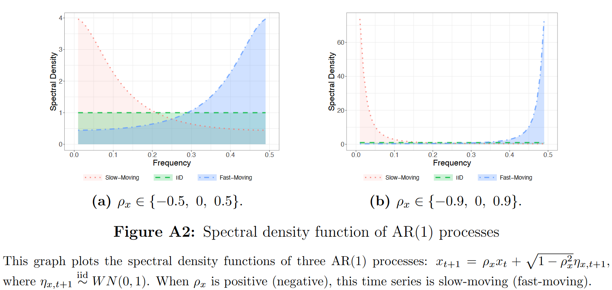

> [!NOTE|label:When does PCA ignore the weak factors]
> 资产收益率的协方差可以被分为两部分，并且其中一个的特征值有界 ($\boldsymbol{\Sigma_e}$)。当 $\boldsymbol{\beta}\boldsymbol{\Sigma_F}\boldsymbol{\beta}^\top $ 的前 $k$ 个特征值 (经过标准化后等于 $\sigma_{F,k}^2$) 大于某一阈值时， $\boldsymbol{\Sigma_R}$ 的前 $k$ 代表系统性因子的特征值会被识别出来，
$$
\lambda_{k}\left(\boldsymbol{\beta}\boldsymbol{\Sigma}_{{\boldsymbol{F}}}\boldsymbol{\beta}^{\top}\right)=\sigma_{F,k}^{2}>\lambda_{crit},
$$
> $\lambda_k(\boldsymbol{A})$ 就代表矩阵 $A$ 前 $k$ 个最大的特征值，而 $\lambda_{crit}$ 与 $N/T$ 的极限和 $\boldsymbol{\Sigma_e}$ 的特征值有关。
>
> 具体来说，假设只有一个系统性因子，并且 idiosyncratic vector $e_t$ 的协方差矩阵为 $\sigma^2 \boldsymbol{I}_N \ (\sigma^2 < \infty) $，对因子载荷进行标准化为 $\beta^T \beta = 1$，并且因子的方差为 $\sigma_F^2 \ (\sigma_F^2 < \infty) $。
>
> 当 $\frac{N}{T} \rightarrow c <1 $，$\text{Var}(e_t)$ 的分布趋近于 Marchenko–Pastur 分布，上界和下界分别为 $\sigma^2(1-\sqrt{c})^2$ 和 $\sigma^2(1+\sqrt{c})^2$，当 $\sigma_F^2 \leq \sqrt{c} \sigma^2 $ 时，最大的特征值会逼近于 $\sigma^2 (1+\sqrt{c})^2$，此时，PCA 就无法识别出 $F_t$ 了。
>
> Lettau, M., and M. Pelger (2020a): “Estimating latent asset-pricing factors,” Journal of Econometrics, 218(1), 1–31.
>
> Benaych-Georges, F., and R. R. Nadakuditi (2011): “The eigenvalues and eigenvectors of finite, low rank perturbations of large random matrices,” Advances in Mathematics, 227(1), 494–521.

**Definition 1**

为了避免这种情况，作者提出了 Frequency-dependent PCA，按照上文将协方差分为不同频率后，分别做 PCA，

$$
\begin{equation}
\boldsymbol{\Sigma}_{{\boldsymbol{R}}}^{{\boldsymbol{Z}}}=\boldsymbol{Q}^{Z}\boldsymbol{\Lambda}^{Z}(\boldsymbol{Q}^{Z})^{\top},\mathrm{~with~}\boldsymbol{\Lambda}^{Z}=diag\{\lambda_{1}^{Z},\ldots,\lambda_{N}^{Z}\},
\end{equation}
$$

其中 $\boldsymbol{\Sigma}_{\boldsymbol{R}}^{\boldsymbol{Z}},Z\in\{HF,LF,S-LF\}$

### Estimation of Risk Prices

现在得到了因子的估计，下面求解因子的风险价格，来看看哪个因子更重要。一般来说，通过之前得到的 SDF 的关系式 $b = \Sigma_F^{-1} \mu_F$ 可以直接求解出因子风险价格。但是在实际操作中一般都不行，Tu and Zhou (2011) 指出最优组合甚至不如对所有股票等权表现好，Kozak, Nagel, and Santosh (2020) 也说对于因子均值 $\boldsymbol{\mu_F}$ 的估计存在很大误差。

本文采取了与 Kozak, Nagel, and Santosh (2020) 类似的方法，认为因子收益率的协方差估计是准确的，均值估计是不准确的。同时，在有限样本中，$\mu = \Sigma_F b$ 估计不一定严格成立，因此加入 pricing error，得到估计式

$$
\begin{equation}
    \mu_F=\Sigma_Fb+\alpha,\quad\alpha\sim\mathcal{N}(0_N,\sigma^2\Sigma_F).
\end{equation}
$$

其中 $b$ 和 $\alpha$ 未知。参数 $\sigma^2$ 用以控制误差的程度，当 $\sigma^2$ 接近于零时，说明式（14）基本正确，当 $\sigma^2$ 很大时，说明这个模型基本没啥用。

接着给风险价格设置了一个先验： $\boldsymbol{b}\sim\mathcal{N}(\boldsymbol{0}_{\boldsymbol{K}},\frac{\psi\sigma^{2}}{\tau}\boldsymbol{I}_{\boldsymbol{K}}),\tau=\mathrm{Tr}\begin{bmatrix}\boldsymbol{\Sigma}_{\boldsymbol{F}}\end{bmatrix}$，并且 $b$ 和 $\alpha$ 不相关。

因此，**先验夏普比率**，也就是 **SDF 的方差**为

$$
\begin{equation}
    \mathbb{E}_{prior}[SR_{F}^{2}]=\mathbb{E}_{prior}[\boldsymbol{b}^{\top}\boldsymbol{\Sigma}_{\boldsymbol{F}}\boldsymbol{b}]=\sum_{k=1}^K\sigma_{F,k}^2\mathbb{E}_{prior}[b_k^2]=\frac{\psi\sigma^2}\tau\operatorname{Tr}\left[\boldsymbol{\Sigma}_{\boldsymbol{F}}\right]=\psi\sigma^2.
\end{equation}
$$

而这些因子的先验夏普为

$$
\begin{equation}
\begin{aligned}
\mathbb{E}_{prior}[\boldsymbol{\mu}_{\boldsymbol{F}}^\top\boldsymbol{\Sigma}_{\boldsymbol{F}}^{-1}\boldsymbol{\mu}_{\boldsymbol{F}}]&=\mathbb{E}_{prior}[(\boldsymbol{\Sigma}_{\boldsymbol{F}}\boldsymbol{b}+\boldsymbol{\alpha})^\top\boldsymbol{\Sigma}_{\boldsymbol{F}}^{-1}(\boldsymbol{\Sigma}_{\boldsymbol{F}}\boldsymbol{b}+\boldsymbol{\alpha})] \\
& =\mathbb{E}_{prior}[\boldsymbol{b}^\top\Sigma_{\boldsymbol{F}}\boldsymbol{b}]+\mathbb{E}_{prior}[\boldsymbol{\alpha}^\top\Sigma_{\boldsymbol{F}}^{-1}\boldsymbol{\alpha}]=\psi\sigma^2+N\sigma^2=(\psi+N)\sigma^2;
\end{aligned}
\end{equation}
$$

也就是说，因子的夏普比率来源于 SDF 和误差项。两个夏普比率之间的关系为

$$
\begin{equation}
    \mathbb{E}_{prior}[SR_F^2]=\frac\psi{\psi+N}\mathbb{E}_{prior}[\boldsymbol{\mu}_F^\top\boldsymbol{\Sigma}_F^{-1}\boldsymbol{\mu}_F],
\end{equation}
$$

所以 $\psi$ 越大，代表 SDF 的夏普比率越高，

因此，$b$ 的后验为

$$
\begin{equation}
\begin{aligned}
    p(\boldsymbol{b}\mid\boldsymbol{\mu}_{{\boldsymbol{F}}},\boldsymbol{\Sigma}_{{\boldsymbol{F}}})&\propto\exp\left\{-\frac{1}{2\sigma^{2}}(\boldsymbol{\mu}_{{\boldsymbol{F}}}-\boldsymbol{\Sigma}_{{\boldsymbol{F}}}\boldsymbol{b})^{\top}\boldsymbol{\Sigma}_{{\boldsymbol{F}}}^{-1}(\boldsymbol{\mu}_{{\boldsymbol{F}}}-\boldsymbol{\Sigma}_{{\boldsymbol{F}}}\boldsymbol{b})\right\}\exp\left\{-\frac{\tau}{2\psi\sigma^{2}}\boldsymbol{b}^{\top}\boldsymbol{b}\right\} \\
    &\propto\exp\left\{-\frac1{2\sigma^2}\left[(\boldsymbol{\mu}_F-\boldsymbol{\Sigma}_F\boldsymbol{b})^\top\boldsymbol{\Sigma}_F^{-1}(\boldsymbol{\mu}_F-\boldsymbol{\Sigma}_F\boldsymbol{b})+\frac\tau\psi\boldsymbol{b}^\top\boldsymbol{b}\right]\right\}.
\end{aligned}
\end{equation}
$$

> [!NOTE|label:Hansen-Jagannathan distance]
> SDF 的表示为
$$
M = 1 -b'(f-E[f]) = 1- \mu' \Sigma^{-1} (f - E[f])
$$
> 但是，当 $b \neq \Sigma^{-1} \mu$ 时，
$$
\tilde{M} = 1 - b'(f-E[f])
$$
> 二者之间的距离为
$$
\begin{aligned}
E[(\tilde{M}-M)^2] &= E[(b - \Sigma^{-1} \mu)' (f-E[f])(f-E[f])'(b - \Sigma^{-1} \mu)] \\
&= (b - \Sigma^{-1} \mu)'\Sigma (b - \Sigma^{-1} \mu) \\
&= (\mu - \Sigma b)' \Sigma^{-1} (\mu - \Sigma b)
\end{aligned}
$$
> 

接着令 $v_2=\frac\tau\psi=\frac{\tau\sigma^2}{\mathbb{E}_{prior}[SR_F^2]}.$，为了与 Kozak, Nagel, and Santosh (2020) 对比，同样假设 $\sigma^2=\frac1T$，所以 $v_2=\frac{\tau}{\psi}=\frac{\tau}{T\times\mathbb{E}_{prior}[SR_F^2]}$。这代表如果我给定的先验夏普比率越高，代表我越相信数据的拟合结果，因此对于结果惩罚的就会更小。

所以最后的目标函数为

$$
\begin{equation}
    \operatorname*{min}_{{\boldsymbol{b}}}\left\{(\boldsymbol{\mu}_{{\boldsymbol{F}}}-\boldsymbol{\Sigma}_{{\boldsymbol{F}}}\boldsymbol{b})^{\top}\boldsymbol{\Sigma}_{{\boldsymbol{F}}}^{-1}(\boldsymbol{\mu}_{{\boldsymbol{F}}}-\boldsymbol{\Sigma}_{{\boldsymbol{F}}}\boldsymbol{b})+v_{2}\boldsymbol{b}^{\top}\boldsymbol{b}\right\},
\end{equation}
$$

Kozak, Nagel, and Santosh (2020) 的目标函数加入了 L1-penalty，要求稀疏性

$$
\begin{equation}
    \operatorname*{min}_{{\boldsymbol{b}}}\left\{(\boldsymbol{\mu}_{{\boldsymbol{F}}}-\boldsymbol{\Sigma}_{{\boldsymbol{F}}}\boldsymbol{b})^{\top}\boldsymbol{\Sigma}_{{\boldsymbol{F}}}^{-1}(\boldsymbol{\mu}_{{\boldsymbol{F}}}-\boldsymbol{\Sigma}_{{\boldsymbol{F}}}\boldsymbol{b})+2v_1|\boldsymbol{b}|_1+v_{2}\boldsymbol{b}^{\top}\boldsymbol{b}\right\},
\end{equation}
$$

本文会同时看这两种情况的实证结果。

## Empirics

**Data:**

- 196308 -201912，分为两部分，第一部分用来估计，第二部分来看样本外表现
- 39 个 firm characteristics managed portfolio
- 剔除市值小于美股总市值 0.01% 的股票

### Starting example: 25 Fama-French Portfolios

这是 PCA 从 25 个 portfolio 提取出的成分，第二个主成分是 Size，第三个是 Value。

但是频率 PCA 的结果就不一样了。HF-PC2 是 Size，HF-PC3 是 Value，说明在高频中 Size 更加重要。 

而 LF-PC2 是 Value，LF-PC3 是 Size。这与经济理论也契合：Value 一般用于捕捉低频的 business cycle frequency。例如 Lettau and Ludvigson (2001b) 指出，在经济形势不好的时候，相比于成长股，价值股与 consumption growth 更加相关，因此获得更高的平均回报率。

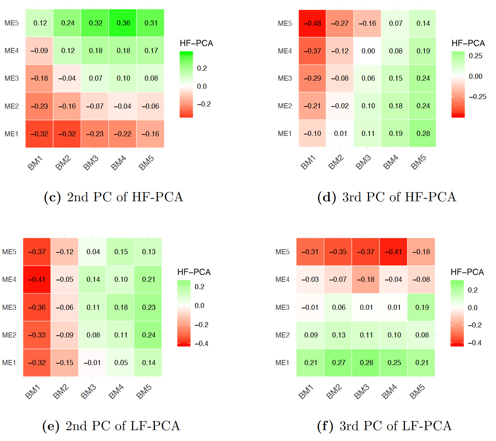

还有个问题在于，可以发现 HF-PCA 的结果和 PCA 非常一致，说明捕捉到的很多都是高频信息。

### HF vs LF Time-Series Variation

高频低频的定义区分如下

$$
\boldsymbol{\hat{\Sigma}}_R^{HF}=\frac{1}{170}\sum_{h=11}^{180}\mathcal{R}\big(\boldsymbol{\hat{f}}_R(\frac{h}{360})\big),\quad\boldsymbol{\hat{\Sigma}}_R^{LF}=\frac{1}{8}\sum_{h=3}^{10}\mathcal{R}\big(\boldsymbol{\hat{f}}_R(\frac{h}{360})\big).
$$

$$
TSV^{HF}=\frac{tr\left[\sum_{h=11}^{180}\boldsymbol{\hat{f}}_{\boldsymbol{R}}(\frac h{360})\right]}{tr\left[\sum_{h=1}^{180}\boldsymbol{\hat{f}}_{\boldsymbol{R}}(\frac h{360})\right]} \quad
TSV^{LF}=\frac{tr\big[\sum_{h=3}^{10}\boldsymbol{\hat{f}}_{\boldsymbol{R}}(\frac{h}{360})\big]}{tr\big[\sum_{h=1}^{180}\boldsymbol{\hat{f}}_{\boldsymbol{R}}(\frac{h}{360})\big]}.
$$

如果与频率无关，那么这 HF, LF, S-LF 的占比应该为 $\frac{170}{180}=94.5\% , \frac{8}{180}=4.4\%,\frac{2}{180}=1.1\%$。从结果来看，低频的占比要比预想的高。

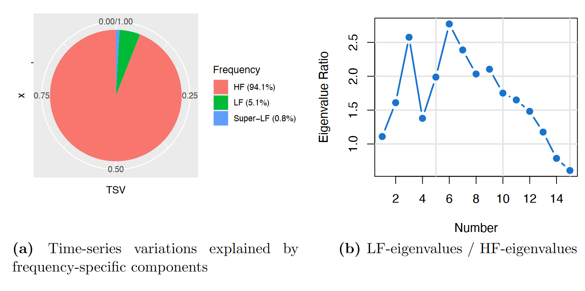

Figure b 是低频协方差矩阵特征值比上高频协方差矩阵特征值，可以看到低频的特征值还是很重要的。

### OOS Sharpe Ratio

基于样本内估计出的结果构建样本外因子 $F_t^{OOS}=(Q^{IN})^\top R_t^{OOS}$，策略同理 $\mathbf{MVE}_t^{OOS}=(\boldsymbol{\hat{b}}^{IN})^\top\boldsymbol{F}_t^{\boldsymbol{OOS}}$

低频的夏普比率在 0.35-0.38 这个区间，而高频的夏普比率在 0.28-0.29，并且低频需要几个因子就可以实现很高的夏普，而高频需要的因子数量很多。

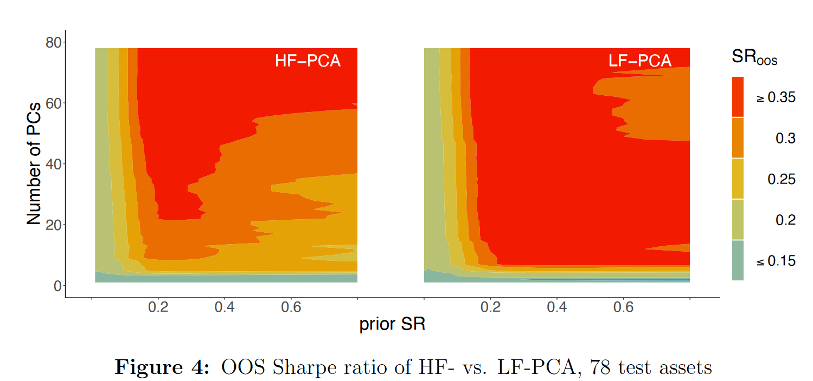

具体来说，低频在 7 个主成分的时候已经实现了最高的夏普比率，而高频则不是。也就是说，低频因子中存在**稀疏性**。

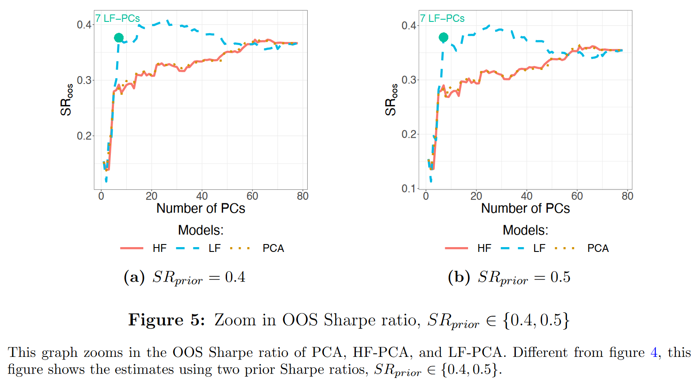

### Out-of-Sample Cross-Sectional Fit

横截面对预期收益率的解释 $\boldsymbol{\alpha_R}^{OOS}=\boldsymbol{\bar{R}}_t^{OOS}-\mathrm{Cov}(\boldsymbol{R}_t^{OOS},\boldsymbol{F}_t^{OOS})\boldsymbol{\hat{b}}^{IN}$。

这里有两个指标 OLS $R^2$ 和 GLS $R^2$，

$$
\begin{aligned}
R^2_{gls} &= 1- \frac{(\boldsymbol{\alpha}_{{\boldsymbol{R}}}^{{\boldsymbol{OOS}}})^{\top}(\boldsymbol{\hat{\Sigma}}_{{\boldsymbol{R}}}^{{\boldsymbol{OOS}}})^{-1}\boldsymbol{\alpha}_{{\boldsymbol{R}}}^{{\boldsymbol{OOS}}}}{(\boldsymbol{\bar{R}}^{{\boldsymbol{OOS}}})^{\top}(\boldsymbol{\hat{\Sigma}}_{{\boldsymbol{R}}}^{{\boldsymbol{OOS}}})^{-1}\boldsymbol{\bar{R}}^{{\boldsymbol{OOS}}}} \\
R^2_{ols} &= 1 - \frac{(\alpha_R^{OOS}-\frac1N1_N^\top\alpha_R^{OOS})^\top(\alpha_R^{OOS}-\frac1N1_N^\top\alpha_R^{OOS})}{(\bar{R}^{OOS}-\frac1N1_N^\top\bar{R}^{OOS})^\top(\bar{R}^{OOS}-\frac1N1_N^\top\bar{R}^{OOS})}
\end{aligned}
$$

本文主要参考 $R^2_{gls}$，这是因为

- $R^2_{gls}$ 有很好的经济学解释：衡量了测试资产中夏普比率平方被模型解释的比例。
- 并且式（16）也是在最大化 GLS $R^2_{gls}$，因此看 GLS 也比较合理
- $R^2_{gls}$ 对于原本资产空间的任何转换都不敏感，例如，对资产空间进行旋转，$Y_t^{OOS}=P^\top R_t^{OOS}$，GLS 解释 $Y_t$ 和 $R_t$ 的 $R^2_{gls}$ 都是完全一样的。因此解释资产收益率和解释 PC 也就没有区别。

$R^2_{gls}$ 的结果与夏普比率的结果有很多相似之处。

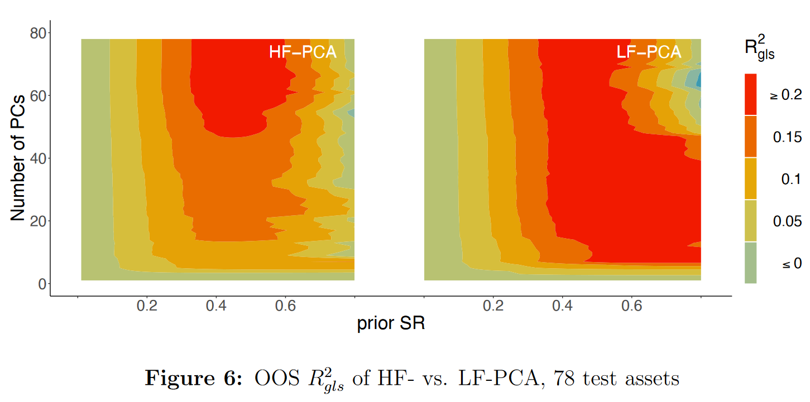

对于 OLS 的结果，低频因子解释得更好。

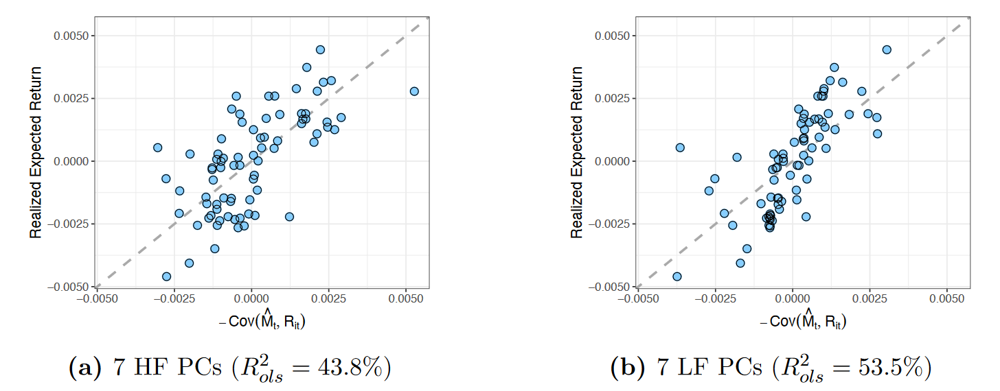

### Zoom in High-Frequency Intervals

之前确定的高频范围是 2-36 个月，进一步细分为 

- [2,3)
- [3,6)
- [6,12)
- [12,36)

基本大差不差，在高频内不存在稀疏性。

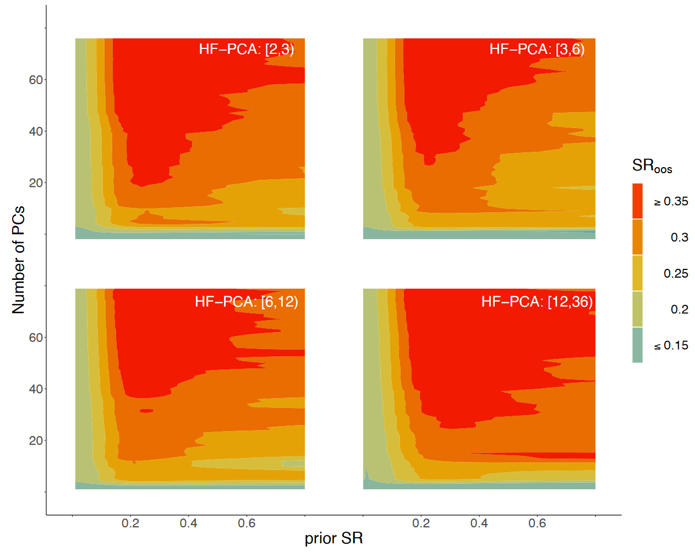

### Sparsity

使用 KNS(2020) 的方法，加入了 L1 penalty 实现稀疏性，结果上来看，低频仍然稀疏，高频略有好转，不过还是要 20 个 PC 才能实现最优夏普比率。

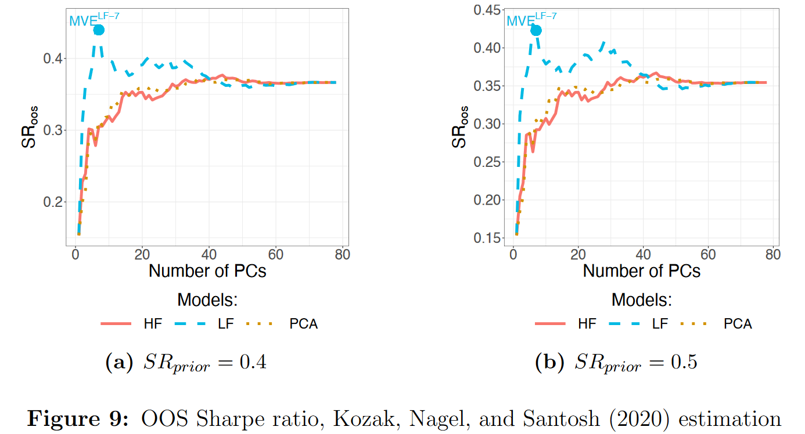

### Spanning test

动量对于 $R^2$ 的提升非常大。

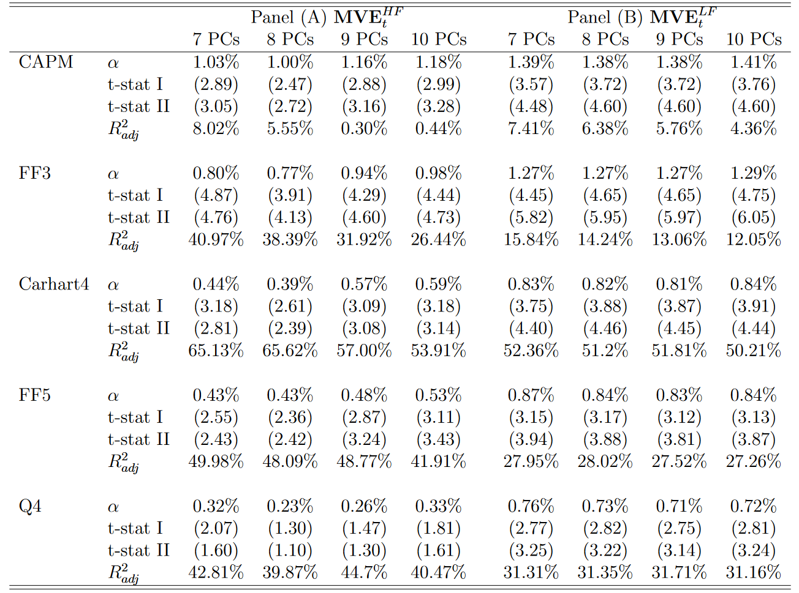

俩人互相解释一下，低频完全解释高频，高频无法解释低频。

### Cumulative Excess Returns

互联网泡沫没亏钱，但是 08 年金融危机亏钱了。

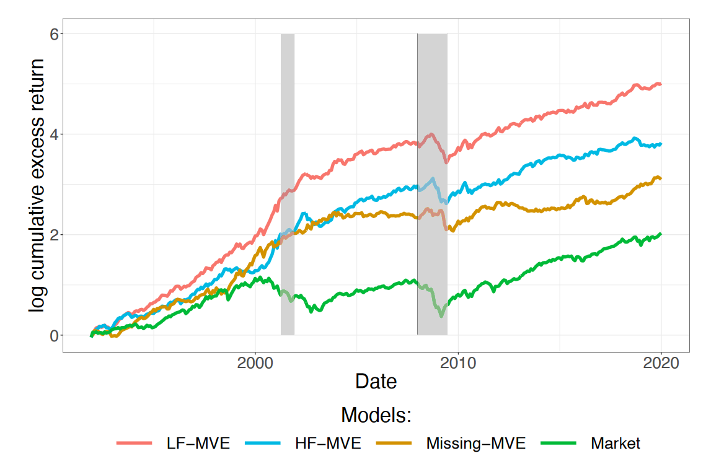

## Connections to Economic Fundamentals

就是通过回归来看和 Economic Fundamental 的关系，感觉没太大意思

高频 SDF 以下几个经济变量相关

- discount rate news (Campbell and Vuolteenaho, 2004)
- Intermediary factors (He, Kelly, and Manela, 2017)
- Market Jump risk (VXO index)
- Sentiment-driven demand shocks (Baker and Wurgler, 2006) 

低频 SDF 主要和 Consumption and GDP growth 有关。

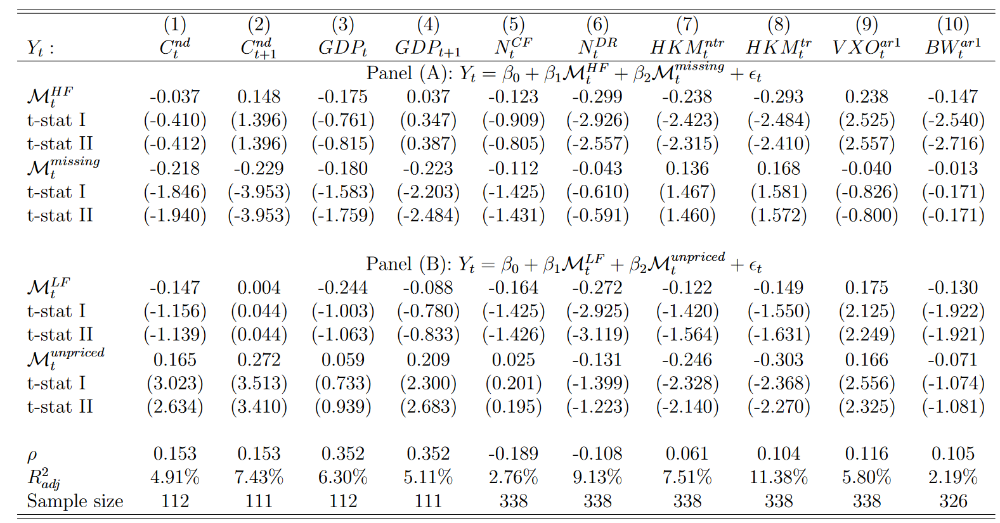

