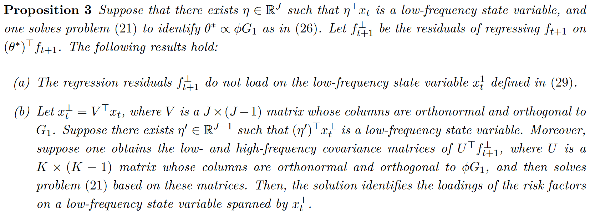

# Derivations in Sicong Li

文章的收益率模型，资产收益率被因子解释，因子收益率由 state variable 预测，

$$
\begin{align}
\underbrace{r_{t+1}}_{N\times1}&=\underbrace{\beta_t}_{N\times K}\underbrace{f_{t+1}}_{K\times1}+\underbrace{\varepsilon_{t+1}}_{N\times1}, \\
\underbrace{f_{t+1}}_{K\times1}&=\underbrace{\mu_f}_{K\times1}+\underbrace{\phi}_{K\times J}\underbrace{x_t}_{J\times1}+\underbrace{\xi_{t+1}}_{K\times1},
\end{align}
$$

因此，因子和股票的风险溢价都是时变的.

为了得到 state variable 的信息，假设只有一个 state variable 有时变的 risk premium。将因子的协方差标准化为单位矩阵，且 loading 长度为一，即 $\Sigma_f=\mathbf{I}_K$ 且 $\phi^\top\phi=1$，并且 $\Lambda$ 是一个 $K \times (K-1)$ 维正交矩阵，且与 $\phi$ 正交，那么 $\Lambda^\top\Lambda=\mathbf{I}_{K-1}$ 且 $\Lambda^\top\phi=\mathbf{0}$，则有

$$
\begin{align}
\phi^\top f_{t+1}=\phi^\top\mu_f+x_t+\phi^\top\xi_{t+1},\\ 
\Lambda^\top f_{t+1}=\Lambda^\top\mu_f+\mathbf{0}+\Lambda^\top\xi_{t+1}.
\end{align}
$$

$\phi^\top f_{t+1}$ 则是唯一一个由 state variable 驱动，有着时变风险溢价的风险因子，$\Lambda^\top f_{t+1}$ 则是其余 $K-1$ 个有着 constant 风险溢价的因子。

因为 $\phi^\top f_{t+1}$ 的风险溢价是时变的，所以也就是说他和频率有关，而时不变的因子则与频率无关，那么计算与频率有关的因子的夏普比率占总夏普比率的比，就可以衡量时变因子的贡献。

夏普比率为

$$
\begin{align}
\mathrm{SR}_f&=\left(\mu_f^\top\Sigma_\xi^{-1}\mu_f\right)^{1/2} \\
\mathrm{SR}_{\phi^\top f}&=\left[\left(\phi^\top\mu_f\right)^\top\left(\phi^\top\Sigma_\xi\phi\right)^{-1}\left(\phi^\top\mu_f\right)\right]^{1/2}
\end{align}
$$

因为 $\mathbf{I}_K=\Sigma_f=\phi\Sigma_x\phi^\top+\Sigma_\xi$，代入得

$$
\begin{aligned}
\mu_{f}^{\top}\Sigma_{\xi}^{-1}\mu_{f}& =\mu_f^\top\left(\mathbf{I}_K-\phi\Sigma_x\phi^\top\right)^{-1}\mu_f  \\
&=\mu_f^\top\left[\mathbf{I}_K-\phi\left(\mathbf{I}_J-\Sigma_x^{-1}\right)^{-1}\phi^\top\right]\mu_f \\
&=\mu_f^\top\mu_f-\mu_f^\top\phi\left(\mathbf{I}_J-\Sigma_x^{-1}\right)^{-1}\phi^\top\mu_f,
\end{aligned}
$$

其中，第二行的推导使用了 Woodbury 恒等式。

> [!NOTE|label:Woodbury Identity]
> Woodbury 恒等式，也称为矩阵求逆引理（Matrix Inversion Lemma），是线性代数中的一个非常有用的公式，特别在涉及大规模矩阵运算的应用中，这个恒等式提供了一种计算大矩阵的逆的简化方法，尤其是当矩阵可以表示为一个低秩更新的形式时。
$$
(A+UCV)^{-1}=A^{-1}-A^{-1}U(C^{-1}+VA^{-1}U)^{-1}VA^{-1}
$$
> 其中 $A$ 是一个 $n \times n$ 可逆矩阵，$U$ 是一个 $n \times k$ 矩阵，$C$ 是一个 $k \times k$ 可逆矩阵，$V$ 是一个 $k \times n$ 矩阵。

类似地，

$$
\begin{aligned}
\mu_f^\top\phi\left[\phi^\top\Sigma_\xi\phi\right]^{-1}\phi^\top\mu_f& \begin{aligned}&=\mu_{f}^{\top}\phi\left(\mathbf{I}_{J}-\Sigma_{x}\right)^{-1}\phi^{\top}\mu_{f}\end{aligned}  \\
&=\mu_f^\top\phi\left[\mathbf{I}_J-\left(\mathbf{I}_J-\Sigma_x^{-1}\right)^{-1}\right]\phi^\top\mu_f \\
&=\mu_f^\top\phi\phi^\top\mu_f-\mu_f^\top\phi\left(\mathbf{I}_J-\Sigma_x^{-1}\right)^{-1}\phi^\top\mu_f.
\end{aligned}
$$

此时，注意到因为 $\mathbf{I}_J-\Sigma_x^{-1}$ 是负定矩阵，因此 $c=-\mu_f^\top\phi\left(\mathbf{I}_J-\Sigma_x^{-1}\right)^{-1}\phi^\top\mu_f>0$，所以

$$
\frac{\mu_f^\top\phi\left[\phi^\top\Sigma_\xi\phi\right]^{-1}\phi^\top\mu_f}{\mu_f^\top\Sigma_\xi^{-1}\mu_f}=\frac{\mu_f^\top\phi\phi^\top\mu_f+c}{\mu_f^\top\mu_f+c}\geq\frac{\mu_f^\top\phi\phi^\top\mu_f}{\mu_f^\top\mu_f},
$$

但是即使识别出了因子在 state variable 上的 loading，也不能得到关于频率的信息，所以需要对原本的 state variable 再进行组合，得到 frequency state variable

$$
\begin{equation}
    f_{t+1}=\mu_f+\phi GG^\top x_t+\xi_{t+1},
\end{equation}
$$

其中 $G$ 就携带了关于频率的信息，是 $J \times J$ 维的旋转矩阵，满足 $GG^\top=G^\top G=\mathbf{I}_J$，则同理得到

$$
\begin{equation}
    G^\top\phi^\top f_{t+1}=G^\top\phi^\top\mu_f+G^\top x_t+G^\top\phi^\top\xi_{t+1}.
\end{equation}
$$

按照协方差的频率分解，将 state variable 的低频和高频表示出来后，如果 state variable 在不同频率上没有差异，那么高低频比值等于频率长度比值

$$
\begin{equation}
    \frac{\theta^\top\Sigma_f^{\mathrm{LF}}\theta}{\theta^\top\Sigma_f^{\mathrm{HF}}\theta}=\frac{\theta^\top\phi\left(\frac1{2\pi}\int_{[-\omega,\omega]}\mathbf{g}_x\left(\lambda\right)d\lambda\right)\phi^\top\theta+\frac\omega\pi\theta^\top\Sigma_\xi\theta}{\theta^\top\phi\left(\frac1{2\pi}\int_{[-\pi,-\omega)\cup(\omega,\pi]}\mathbf{g}_x\left(\lambda\right)d\lambda\right)\phi^\top\theta+\frac{\pi-\omega}\pi\theta^\top\Sigma_\xi\theta}=\frac\omega{\pi-\omega},
\end{equation}
$$

但是现有的文献结果所说的，是低频的能量远比高频更加集中，

$$
\begin{equation}
    \frac{\left(\sigma_{x}^{2}\right)^{{\mathrm{LF}}}}{\left(\sigma_{x}^{2}\right)^{{\mathrm{HF}}}}>\frac\omega{\pi-\omega}.
\end{equation}
$$

所以 $\frac{\theta^\top\Sigma_f^{\mathrm{LF}}\theta}{\theta^\top\Sigma_f^{\mathrm{HF}}\theta}$ 会大于区间长度比例。那么这个比例能有多大呢？不知道，但是可以通过优化，让他越大越好，得到一个数值上的极限。

那最后得到的 $\theta$ 该怎么理解呢？

因为对于 state variable 来说，低频方差比上高频方差，这一个比例是固定的，所以最大化的就是组合因子（state variable）的低频高频比，也就是说，最后得到的，是通过 $\theta$ 对原有因子进行组合后得到的一个频率因子，因子的性质由最大化的内容决定。

该优化问题可以写为：

$$
\begin{align}
\begin{aligned}&\max_{c,\theta}\quad c,\\&\mathrm{s.t.}\quad\theta^\top\left(\Sigma_f^{\mathrm{LF}}-c\Sigma_f^{\mathrm{HF}}\right)\theta\geq0.\end{aligned}
\end{align}
$$

进一步，**low frequency state variable 的存在**可以转化为以下这个问题，

**Lemma 1** 

矩阵

$$
\begin{equation}
    W=\left(\mathbf{I}_J-\Sigma_x+\frac{\pi}{\pi-\omega}\Sigma_x^{HF}\right)^{-1/2}\left(\mathbf{I}_J-\Sigma_x+\frac{\pi}{\omega}\Sigma_x^{LF}\right)\left(\mathbf{I}_J-\Sigma_x+\frac{\pi}{\pi-\omega}\Sigma_x^{HF}\right)^{-1/2}
\end{equation}
$$

的最大特征值大于一 **当且仅当** 存在 $\eta\in\mathbb{R}^J$ 满足

$$
\begin{equation}
    \frac{\eta^\top\Sigma_x^{LF}\eta}{\eta^\top\Sigma_x^{HF}\eta}>\frac\omega{\pi-\omega}.
\end{equation}
$$

这一形式代表通过 $\eta$ 对 state variable 进行组合后的 low frequency state variable，在低频上的方差大于在高频上的方差。

> [!TIP|label:Derivation]
$$
\frac{\eta^\top\Sigma_x^{\mathrm{LF}}\eta}{\eta^\top\Sigma_x^{\mathrm{HF}}\eta}>\frac\omega{\pi-\omega}\Leftrightarrow\frac{\eta^\top\frac\pi\omega\Sigma_x^{\mathrm{LF}}\eta}{\eta^\top\frac\pi{\pi-\omega}\Sigma_x^{\mathrm{HF}}\eta}>1
$$ 
> 因为 $\mathbf{I}_J-\Sigma_x=\mathbb{V}ar(\phi^\top f_{t+1})-\Sigma_x=\phi^\top\Sigma_\xi\phi $，所以 $\mathbf{I}_J-\Sigma_x$ 是正定的，上述不等式可以转化为
$$
\frac{\eta^\top\left(\frac{\pi}{\omega}\Sigma_x^{\mathrm{LF}}+\mathbf{I}_J-\Sigma_x\right)\eta}{\eta^\top\left(\frac{\pi}{\pi-\omega}\Sigma_x^{\mathrm{HF}}+\mathbf{I}_J-\Sigma_x\right)\eta}>1
$$
> 然后关键的来了，定义了两个新变量，
$$
\begin{aligned}
v&=\left(\frac\pi{\pi-\omega}\Sigma_x^\text{HF}+\mathbf{I}_J-\Sigma_x\right)^{1/2}\eta \\
W&=\left(\frac{\pi}{\pi-\omega}\Sigma_x^{\mathrm{HF}}+\mathbf{I}_J-\Sigma_x\right)^{-1/2}\left(\frac{\pi}{\omega}\Sigma_x^{\mathrm{LF}}+\mathbf{I}_J-\Sigma_x\right)\left(\frac{\pi}{\pi-\omega}\Sigma_x^{\mathrm{HF}}+\mathbf{I}_J-\Sigma_x\right)^{-1/2}
\end{aligned}
$$
> 问题最终转化为
$$
\frac{\eta^\top\Sigma_x^\text{LF}\eta}{\eta^\top\Sigma_x^\text{HF}\eta}>\frac\omega{\pi-\omega}\Leftrightarrow\frac{v^\top Wv}{v^\top v}>1,
$$
> 之所以要写成这种形式，是因为要借助瑞利商的形式进行分析。瑞利商的定义是一个标量函数，它讲任意非零向量 $v$ 映射到一个实数，对于一个给定的实对称矩阵 $W$，瑞利商 $R(v)$ 定义为
$$
R(v)=\frac{v^TWv}{v^Tv}
$$
> 这里 $v^T W v$ 是一个标量，表示向量 $v$ 在矩阵 $W$ 变换下的二次型；$v^Tv$ 也是一个标量，它是向量 $v$ 的欧几里得范数的平方。因此，瑞利商本身是一个标量比率，反映了 $v$ 相对于 $W$ 的平均拉伸。
>
> 当 $v$ 是 $W$ 的特征向量时，$R(v,W)$ 就等于对应的特征值，并且，瑞利商 $R(v)$ 的取值范围就是矩阵 $W$ 的最小特征值到最大特征值。最大值是 $W$ 的最大特征值 $\lambda_{\max}$，即 $\max_{v \neq 0} R(v) = \lambda_{\max} $，当 $v$ 是对应于 $W$ 的最大特征值的特征向量时，瑞利商取得这个最大值。
>
> 所以这个矩阵内部的形式并没有太多意义，只是为了凑出来瑞利商的形式。
> 

如果通过 lemma 1 证明了 low-frequency state variable 的存在，那么下一步就可以开始求解了。

因为最优化问题在约束条件的边界处取得最优值 (binding at the optimum)，所以令约束条件等于零得

$$
\quad\theta^\top\Sigma_f^{\mathrm{LF}}\theta-c\theta^T\Sigma_f^{\mathrm{HF}}\theta = 0
$$

又因为

$$
\begin{aligned}
    \Sigma_f^{\mathrm{LF}}&=\phi\Sigma_x^{\mathrm{LF}}\phi^\top+\frac\omega\pi\Sigma_\xi,\\
    \Sigma_f^{\mathrm{HF}}&=\phi\Sigma_x^{\mathrm{HF}}\phi^\top+\frac{\pi-\omega}\pi\Sigma_\xi 
\end{aligned}
$$

代入得

$$
\begin{aligned}
    &\theta^\top\left[\frac\omega\pi\Sigma_\xi+\phi\Sigma_x^\mathrm{LF}\phi^\top\right]\theta-c\theta^\top\left[\frac{\pi-\omega}\pi\Sigma_\xi+\phi\Sigma_x^\mathrm{HF}\phi^\top\right]\theta=0 \\
    \Rightarrow\quad &c=\frac\omega{\pi-\omega}\frac{\theta^\top\left(\mathbf{I}_K-\phi\Sigma_x\phi^\top+\frac\pi\omega\phi\Sigma_x^\mathrm{LF}\phi^\top\right)\theta}{\theta^\top\left(\mathbf{I}_K-\phi\Sigma_x\phi^\top+\frac\pi{\pi-\omega}\phi\Sigma_x^\mathrm{HF}\phi^\top\right)\theta}
\end{aligned}
$$

因为 $\phi$ 和 $\Lambda$ 是正交的，所以有

$$
\mathbf{I}_K=\Lambda\Lambda^\top+\phi\phi^\top 
$$

因此原式就可以进一步拆分为

$$
c=\frac\omega{\pi-\omega}\frac{\theta^\top\begin{bmatrix}\phi,&\Lambda\end{bmatrix}\begin{bmatrix}\mathbf{I}_J-\Sigma_x+\frac\pi\omega\Sigma_x^\mathrm{LF}&\mathbf{0}\\\mathbf{0}&\mathbf{I}_{K-J}\end{bmatrix}\begin{bmatrix}\phi^\top\\\Lambda^\top\end{bmatrix}\theta}{\theta^\top\begin{bmatrix}\phi,&\Lambda\end{bmatrix}\begin{bmatrix}\mathbf{I}_J-\Sigma_x+\frac\pi{\pi-\omega}\Sigma_x^\mathrm{HF}&\mathbf{0}\\\mathbf{0}&\mathbf{I}_{K-J}\end{bmatrix}\begin{bmatrix}\phi^\top\\\Lambda^\top\end{bmatrix}\theta}
$$

看着形式十分之复杂，但是不要慌，我们仍然使用瑞利商，将其和 lemma 1 中的形式对应起来，令

$$
z=\begin{bmatrix}\phi,&\Lambda\end{bmatrix}\begin{bmatrix}\left(\mathbf{I}_J-\Sigma_x+\frac{\pi}{\pi-\omega}\Sigma_x^{\mathrm{HF}}\right)^{1/2}&\mathbf{0}\\\mathbf{0}&\mathbf{I}_{K-J}\end{bmatrix}\begin{bmatrix}\phi^\top\\\Lambda^\top\end{bmatrix}\theta 
$$

因此

$$
\theta=\begin{bmatrix}\phi,&\Lambda\end{bmatrix}\begin{bmatrix}\left(\mathbf{I}_J-\Sigma_x+\frac{\pi}{\pi-\omega}\Sigma_x^{\mathrm{HF}}\right)^{-1/2}&\mathbf{0}\\\mathbf{0}&\mathbf{I}_{K-J}\end{bmatrix}\begin{bmatrix}\phi^\top\\\Lambda^\top\end{bmatrix}z.
$$

因此原式转化为

$$
\begin{gathered}c=\frac\omega{\pi-\omega}\frac{z^\top\begin{bmatrix}\phi,&\Lambda\end{bmatrix}\begin{bmatrix}W&\mathbf{0}\\\mathbf{0}&\mathbf{I}_{K-J}\end{bmatrix}\begin{bmatrix}\phi^\top\\\Lambda^\top\end{bmatrix}z}{z^\top z},\end{gathered}
$$

这个 $W$ 就是上文 Lemma 1 中的形式。

对 $W$ 进行特征值分解，

$$
\begin{aligned}
    W&=HD_WH^\top, \\
    \phi W \phi^T&= (\phi H) D_W (\phi H)^T
\end{aligned}
$$

如果把特征值分解的结果带入，$c$ 可以进一步写为

$$
\begin{gathered}c=\frac{\omega}{\pi-\omega}\frac{z^\top\begin{bmatrix}\phi H,&\Lambda\end{bmatrix}\begin{bmatrix}D_W&\mathbf{0}\\\mathbf{0}&\mathbf{I}_{K-J}\end{bmatrix}\begin{bmatrix}H^\top\phi^\top\\\Lambda^\top\end{bmatrix}z}{z^\top z}.\end{gathered}
$$

如果要最大化 $c$，也就是最大化瑞利商，根据瑞利商的性质，最大值就是 $W$ 的最大特征值，根据 Lemma 1，如果该特征值大于 1，那么就说明存在 low-frequency state variable，因此，如果最大特征值 $\lambda_1^W$ 大于 1，最优解为

$$
c^*=\frac\omega{\pi-\omega}\lambda_1^W,
$$

那么 $z$ 就是对应的特征向量 $H_1$，因此 $\theta$ 为

$$
\begin{aligned}&\theta^*\propto\begin{bmatrix}\phi,&\Lambda\end{bmatrix}\begin{bmatrix}\left(\mathbf{I}_J-\Sigma_x+\frac\pi{\pi-\omega}\Sigma_x^{\mathrm{HF}}\right)^{-1/2}&\mathbf{0}\\\mathbf{0}&\mathbf{I}_{K-J}\end{bmatrix}\begin{bmatrix}\phi^\top\\\Lambda^\top\end{bmatrix}\phi H_1\\&=\phi\left(\mathbf{I}_J-\Sigma_x+\frac\pi{\pi-\omega}\Sigma_x^{\mathrm{HF}}\right)^{-1/2}H_1.\end{aligned}
$$

> [!NOTE|label:Propotion]
> 因为对于原优化问题来说，$\theta$ 并不唯一，任意与 $\theta^*$ 成比例缩放的向量均可以。

但如果 $\lambda_1^W$ 小于 1，那么 $c$ 的最大值就为

$$
c^*=\frac\omega{\pi-\omega},
$$

而 $\theta$ 只需要是与 $W$ 无关的任意向量就可以了

$$
\theta^*\propto\begin{bmatrix}\phi,&\Lambda\end{bmatrix}\begin{bmatrix}\left(\mathbf{I}_J-\Sigma_x+\frac{\pi}{\pi-\omega}\Sigma_x^{\mathrm{HF}}\right)^{-1/2}&\mathbf{0}\\\mathbf{0}&\mathbf{I}_{K-J}\end{bmatrix}\begin{bmatrix}\phi^\top\\\Lambda^\top\end{bmatrix}\Lambda x=\Lambda x.
$$

既然求解出了 $G$，那么通过**标准化**，最终得到的 low-frequency state variable 就是

$$
\begin{equation}
    x_t^1=\frac1{\|G_1\|_2}G_1^\top x_t.
\end{equation}
$$

受 low-frequency state variable 驱动的 low-frequency factor 就是，

$$
\begin{equation}
    \left(\theta^*\right)^\top f_{t+1}=x_t^1+\frac{G_1^\top\phi^\top\xi_{t+1}}{\|G_1\|_2},
\end{equation}
$$

> 这块应该是还有个 $\mu_f$ 项，但是没写出来。

对于上面的结果，总结来说就是

**Part (a)** 用来说明 $(\theta^*)^T f_{t+1} $ 完全携带了 low-frequency state variable 携带的定价信息。

用 $f_{t+1}^\perp$ 表示将 $f_{t+1}$ 回归到 $(\theta^*)^T f_{t+1} $ 上的残差，即

$$
f_{t+1}^\perp=\left(\mathbf{I}_K-\frac{\phi G_1G_1^\top\phi^\top}{G_1^\top G_1}\right)f_{t+1}.
$$

其中 $\frac{\phi G_1G_1^\top\phi^\top}{G_1^\top G_1}$ 是一个投影矩阵，投到由 $\phi G_1$ 张成的空间，$\left(\mathbf{I}_K-\frac{\phi G_1G_1^\top\phi^\top}{G_1^\top G_1}\right)$ 表示该空间的正交补空间。

> $P = X(X^TX)^{-1}X^T$

那么 state variable 在上面的投影就是

$$
\begin{aligned}
\begin{aligned}\left(\mathbf{I}_{K}-\frac{\phi G_{1}G_{1}^{\top}\phi^{\top}}{G_{1}^{\top}G_{1}}\right)\phi x_{t}\end{aligned}& =\phi\left(\mathbf{I}_{J}-\frac{G_{1}G_{1}^{\top}}{G_{1}^{\top}G_{1}}\right)x_{t}  \\
&=\phi VV^\top x_t\equiv\phi^\perp x_t^\perp,
\end{aligned}
$$

其中 $V$ 是 $J \times (J-1)$ 维的正交矩阵，并且与 $G_1$ 正交，$x_t^\perp=V^\top x_t, \phi^\perp=\phi V$，因为与 $G_1$ 正交，所以肯定在 $x_1$ 上不存在 loading，他还给了一个证明

$$
\begin{aligned}
    &\phi VV^\top\begin{bmatrix}\frac{G_1}{\|G_1\|}&V\end{bmatrix}\begin{bmatrix}\frac{G_1^\top}{\|G_1^\top\|}\\V^\top\end{bmatrix}x_t \\
    =&\frac1{\|G_1\|^2}\phi V\underbrace{V^\top G_1}_{=0_{J-1}}G_1^\top x_t+\phi VV^\top x_t,
\end{aligned}
$$

**Part (b)** 是用来说明，最优化问题可以 **recursively** identify risk factors on other low frequency state variables。

直接将残差表示为

$$
f_{t+1}^\perp=UU^\top f_{t+1}.
$$

> $UU^T$ 代表的是 $\phi G_1$ 的正交补空间，也就是说，想要使得两个频率因子正交，除了本身垂直，还可以使其系数垂直。

也就是说 $U$ 和 $\phi G_1$ 正交，并且 $U$ 自身正交。

$U^T f_{t+1}^\perp $ 在 $x_t^\perp$ 上的 loading 为 $U^\top\phi^\perp=U^\top\phi V$，并且有

$$
\mathbb{Var}(U^\top f_{t+1}^\perp)=\mathbf{I}_{K-1}\quad\mathrm{and}\quad\left(U^\top\phi^\perp\right)^\top U^\top\phi^\perp=\mathbf{I}_{J-1}
$$

> 之前的条件要求是 $ \Sigma_f = I_K, \phi^T \phi = I_J $，现在在求出来第一个因子的基础上改变了一些条件。

具体来说求解过程如下，

$$
\begin{aligned}
\left(U^{\top}\phi^{\perp}\right)^{\top}U^{\top}\phi^{\perp}& =V^{\top}\phi^{\top}UU^{\top}\phi V  \\
&=V^\top\phi^\top\left(\mathbf{I}_K-\frac{\phi G_1G_1^\top\phi^\top}{G_1^\top G_1}\right)\phi V \\
&\begin{aligned}=V^\top V+\frac{V^\top G_1G_1^\top V}{G_1^\top G_1}\end{aligned} \\
&=V^\top V=\mathbf{I}_{J-1},
\end{aligned}
$$

所以此时最优的 $\theta$ 就是 $U^T \phi^\perp G_2 = U^T \phi V G_2 $

最终有

$$
UU^\top\phi VG_2=\phi\left(\mathbf{I}_J-\frac{G_1G_1^\top}{G_1^\top G_1}\right)VG_2=\phi VG_2
$$

