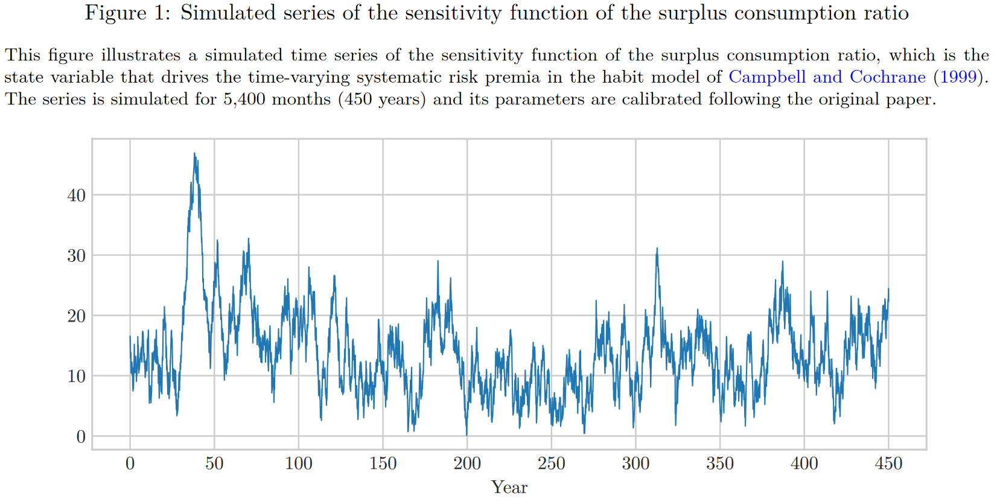

# Economic theories about frequency

## Pricing Low Frequency

> [!NOTE|label:Business cycle]
> 频率和周期是紧密相连的两个概念。在当前的经济模式中，一般认为经济周期分为扩张，顶峰，衰退，谷底，一个经济周期持续有说 3-6 年，也有说 3-8 年，这也是最近读的这两篇文章划分频率范围的依据。
>
> 老师问为什么只有低频得到定价，而高频、中频定价效果不甚理想，这与经济周期也是分不开的。用**时变风险溢价**来说，经济周期决定了系统性风险溢价的变化，幅度要比高频更加 considerable，并且在一定程度上反映了金融与经济的联系。这个时间长度直接对应的就是低频。
>
> 从文献上来看，许多 consumption-based 资产定价模型，选用或提出的 state variable 都是与经济周期深刻相关的。

许多资产定价模型都会定义出 state variable，而这些 state variable 都集中于低频，例如 the habit model of Campbell and Cochrane (1999), they suggests that the only state variable that drives the systematic risk premia is the sensitivity function of the surplus consumption ratio, which, as illustrated in Figure 1, is highly persistent, which means the variation of the state variable **concentrates on extremely low frequencies**.

Figure 1 反映了 surplus consumption ratio 对于 risk premium 的影响 (stimulated)，可以看出很强的周期性，因此使得资产的回报率为 time-varying。

> Campbell, John Y., and John H. Cochrane, 1999, By force of habit: A consumption-based explanation of aggregate stock market behavior, ***Journal of Political Economy*** 107, 205–251.

Dew-Becker et al.(2016) study frequency-dependent risk prices in structural consumption-based models and show that only the long-run consumption shocks with cycles **longer than the business cycle** (8 years) can explain asset returns.

> Dew-Becker, Ian, and Stefano Giglio, 2016, Asset pricing in the frequency domain: Theory and empirics, ***Review of Financial Studies*** 29, 2029–2068.

## Permanent-transitory descomposition

另一种文献则是对 SDF 进行 permanent 和 transitory 角度的分解，主要包括以下几篇文章 Fama and French (1988), Lamoureux and Zhou (1996), Alvarez and Jermann (2005), Hansen et al. (2008), Hansen and Scheinkman (2009), and Borovicka et al. (2011). 

They study the pricing of cash flows at different time horizons, with particular emphasis on the long run, implicitly learning about both the permanent and transitory components of the SDF, which affect holding period returns at different horizons.

> Fama E F, French K R. Permanent and temporary components of stock prices[J]. ***Journal of political Economy***, 1988, 96(2): 246-273.

Fama 这篇文章从均值回归的角度去理解。股票价格中包含一个缓慢的均值回归过程，使得收益率产生负的自相关性，而这一自相关性在日频和周频中不显著，但是对于更长期的收益率则比较显著。

用 1926-85 年的数据来看，由均值回归导致的价格波动占了 3-5 年收益率波动的很大一部分。对小公司来说，这一比值有 40%，对于大公司来说则只有 25%。

这也就是说，在低频的部分中才能捕捉到均值回归的过程，这一部分才是股票收益率中 predictable 的部分。

> Lamoureux, C.G., Zhou, G., 1996. Temporary components of stock returns: What do the data tell us? Rev. Financ. Stud. 9 (4), 1033–1059.

但是随后许多文章指出 Fama and French (1988) 这篇文章有问题，统计方法有误。接着，Lamoureux and Zhou (1996) 通过贝叶斯的方法指出股价不具有 mean-reverting，是一个随机过程。

> Alvarez, F., and U. J. Jermann (2005): “Using asset prices to measure the persistence of the marginal utility of wealth,” Econometrica, 73(6), 1977–2016.

文章将 SDF 分成了 permanent 和 transitory 两部分，并给出了关于 permanent 部分波动性的 lower bound。文章发现 permanent's volatility is about at least as large as the volatility of SDF，transitory 相对来说则没那么重要。

那么这两部分在频率中是一个怎样的对应关系呢？

Permanent ：从 SDF 的角度，Pricing kernel 的 permanent component 需要足够大，才能与长期债券的低收益率契合。这一点非常重要，因为 SDF 的低频部分是股票价格的**决定性因素**。

Transitory ：这一部分指的是那些只在短期内影响资产价格的因素。这些因素的影响虽然可能显著，但通常是临时的，不会长期影响资产的基本价值。例如，市场的短期波动、临时的经济新闻或事件。

> [!TIP|label:原文]
> We find that, to be consistent with the low returns on long-term bonds relative to equity, the permanent component of pricing kernels has to be very large. This property is important, because the low frequency components of pricing kernels are important determinants of the prices of long-lived securities such as stocks

这篇文章稍后可以仔细读一下。

## Conclusion

关于为什么低频得到定价，高频得不到定价，可以从两个角度来回答

1. Business cycle。经济周期是资本市场中非常重要的定价因素，而经济周期这一概念对应的就是低频。相比之下，经济周期带来的风险溢价的变化更持续，更显著，而高频尽管可能一时间对市场有一定影响，但是长期来看就像扰动项一样均值为零。

2. permanent part of SDF。从 SDF 理论出发，permanent part 对应 low frequency，transitory part 对应 high frequency，而 permanent component of SDF 是决定资产价格的关键因素，transitory part 则没那么重要。

