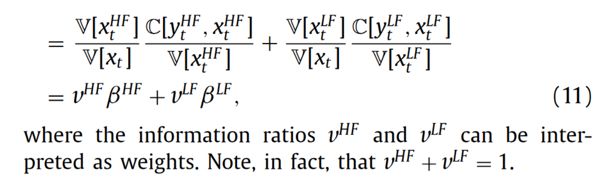

# 20240515

## Dissecting the beta

上次写的报告有问题，将 $\beta$ 拆分到不同频率上，并不能对应到转移函数，这是因为，对 $\beta$ 的分子分母同时拆分，并不能写成

$$
\begin{equation}
    \beta = \sum \frac{\text{Cov}(\omega)}{\text{Var}(\omega)}
\end{equation}
$$

而**只能**写成

$$
\begin{equation}
    \beta =  \frac{\sum \text{Cov}(\omega)}{\sum \text{Var}(\omega)}
\end{equation}
$$

因此，对于单独某一个频率来说，想要得到频率内的系数，可以写成如下形式

$$
\begin{equation}
    \beta(\omega) = \frac{ \text{Cov}(\omega)}{\text{Var}(\omega)} \frac{\text{Var}(\omega)}{\sum \text{Var}(\omega)}
\end{equation}
$$

或者

$$
\begin{equation}
    \beta(\omega) = \frac{ \text{Cov}(\omega)}{\sum \text{Cov}(\omega)} \frac{\sum \text{Cov}(\omega)}{\sum \text{Var}(\omega)}
\end{equation}
$$

前一种形式跟 Spectral model 那篇的分解形式就一样了

第二种就对应了协方差的占比，跟 frequency dependent risk 那篇一样了。

这意味着，从 $\beta$ 拆分的角度来看，**这两篇文章的思路统一了起来**。

合理的分解方法被这两篇文章做完了，那么我觉得，接下来思考的方向就在于虚部，或者说，就在于相位差，还要继续深入一下。

## Momentum

动量策略，体现的是截面上强者恒强的可持续性，如果反映在净值曲线上，那么理想的曲线应该是过去收益率最高的股票一直涨，收益率最低的股票一直跌，看不到什么周期性的存在。

那么为什么动量策略对于频率因子的解释力度这么高呢？是相位差的影响吗？

