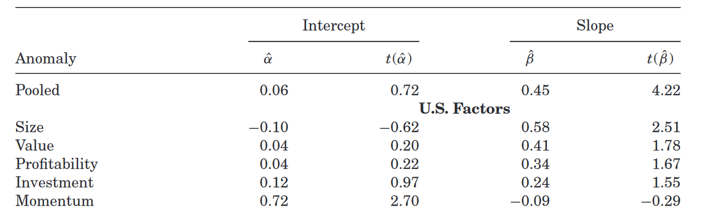
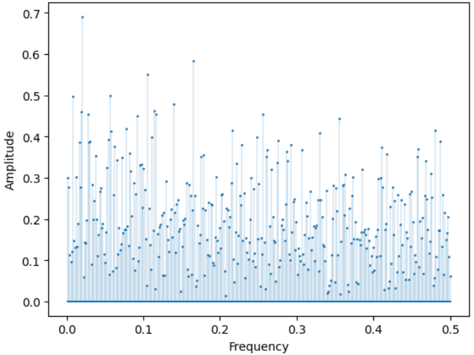
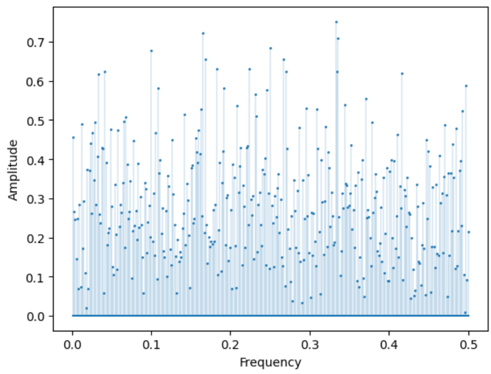
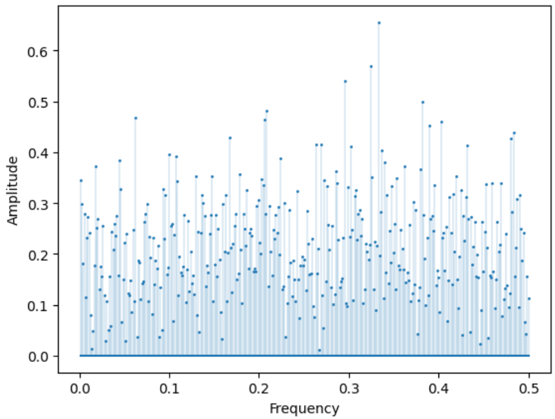
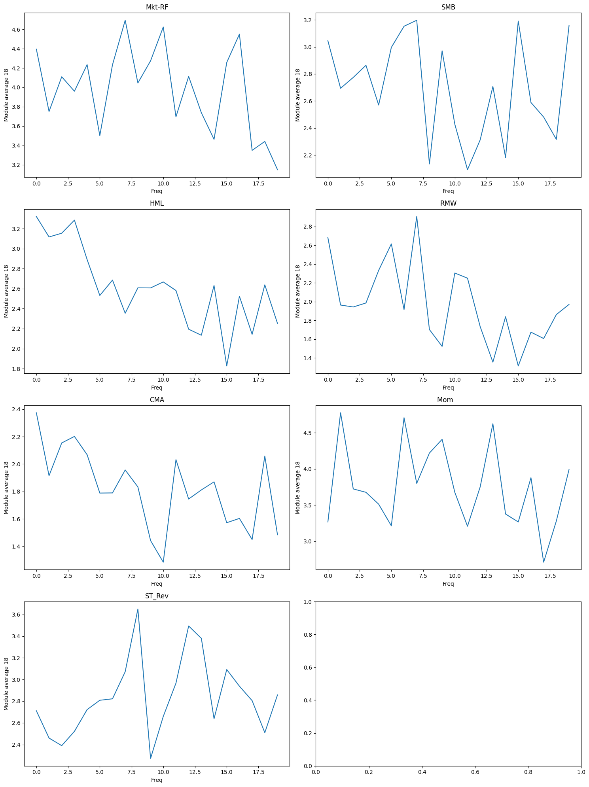
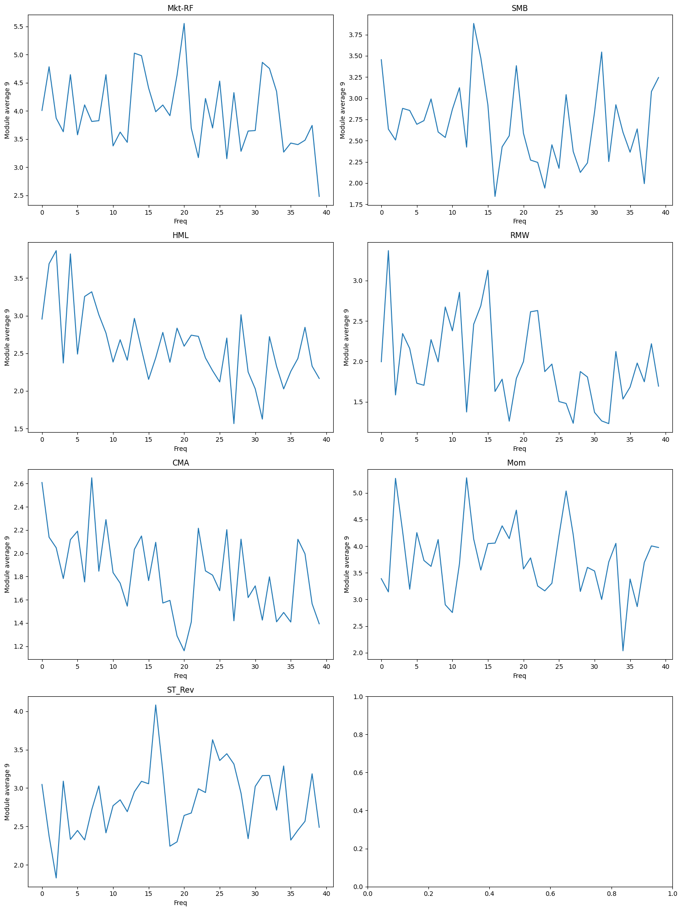
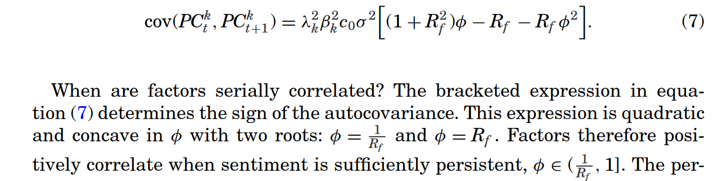
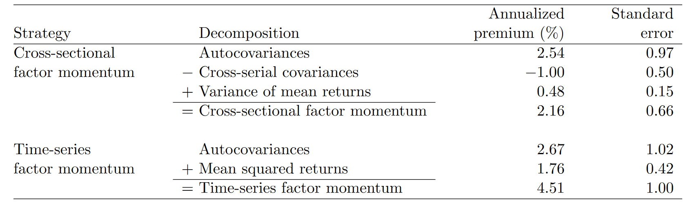

# 20240520

## Empircs

Factor momentum and momentum factor，自变量为 $t-12$ 到 $t-1$ 收益率平均值的proxy，当收益率平均值为正则取1，反之为0，结果如下。只有 Momentum 的回归系数为负，其他均为正，代表过去收益率能够预测未来收益率。

复现实证结果

|    布尔值    |   alpha |   alpha_t |   coef |   coef_t |
|:-------|--------:|----------:|-------:|---------:|
| Mkt-RF |   0.252 |     0.764 |  0.38  |    0.985 |
| SMB    |   0.062 |     0.342 |  0.305 |    1.282 |
| HML    |   0.054 |     0.307 |  0.384 |    1.715 |
| RMW    |   0.027 |     0.184 |  0.342 |    1.885 |
| CMA    |   0.091 |     0.73  |  0.297 |    1.888 |
| Mom    |   0.757 |     2.234 | -0.149 |   -0.385 |
| ST_Rev |   0.512 |     2.061 | -0.02  |   -0.069 |

|    平均值    |   alpha |   alpha_t |   coef |   coef_t |
|:-------|--------:|----------:|-------:|---------:|
| Mkt-RF |   0.51  |     2.786 |  0.039 |    0.314 |
| SMB    |   0.202 |     1.678 |  0.164 |    1.39  |
| HML    |   0.218 |     1.928 |  0.239 |    2.281 |
| RMW    |   0.19  |     2.141 |  0.275 |    2.535 |
| CMA    |   0.199 |     2.43  |  0.27  |    2.506 |
| Mom    |   0.692 |     3.782 | -0.075 |   -0.597 |
| ST_Rev |   0.499 |     3.62  | -0.004 |   -0.03  |

可以看到，无论哪种方式，结果都是大致相同的，FF5 的系数均为正，mom, rev 的系数为负。

但是这并不完全对应到自回归模型上，我们对收益率进行AR(3)回归

|        |   alpha |   alpha_t |   lag1 |   lag1_t |   lag2 |   lag2_t |   lag3 |   lag3_t |
|:-------|--------:|----------:|-------:|---------:|-------:|---------:|-------:|---------:|
| Mkt-RF |   0.505 |     2.895 |  0.065 |    1.679 | -0.038 |   -0.971 |  0.021 |    0.534 |
| SMB    |   0.231 |     1.955 |  0.057 |    1.484 |  0.046 |    1.177 | -0.061 |   -1.575 |
| HML    |   0.232 |     2.12  |  0.159 |    4.088 |  0.031 |    0.787 |  0.014 |    0.355 |
| RMW    |   0.234 |     2.743 |  0.154 |    3.978 | -0.004 |   -0.1   | -0.046 |   -1.194 |
| CMA    |   0.217 |     2.792 |  0.131 |    3.379 |  0.016 |    0.421 |  0.055 |    1.428 |
| Mom    |   0.639 |     3.78  |  0.053 |    1.353 | -0.062 |   -1.605 |  0.021 |    0.54  |
| ST_Rev |   0.534 |     4.285 | -0.027 |   -0.685 | -0.069 |   -1.79  |  0.022 |    0.563 |

这里我们选取几个典型例子，lag1 AR 最显著的 **HML** 和 lag1 lag2 一正一负的 **MoM**，以及 lag1 lag2 都为负的 **Rev**，看一下他们的频谱图。

HML

MoM

Rev

全频率频谱图有些不太清晰，我对于相邻的 20 个频率振幅取平均值，就会清晰一些，存在显著正自回归的项，低频成分会很显著，对于显著负回归的项，高频会多一些，不正不负的，就差不多。

根据 18 个频率一组进行划分，将全频率分为 20 组，每一组对应的频率范围分别为

- 3 - 60 years
- 1.5 - 3 years
- 1 - 1.5 years
- 后面的就都不到一年

如果按照 9 个频率一组分为 40 组，则每一组对应的频率范围为

- 6.6 - 60 years
- 3 - 6.6 years
- 2.2 - 3 years
- 1.5 - 2.2 years
- 后续同理

太过精细的分组，会强化频率内的极端值，此时的趋势性反而没那么好，因此下文的实证选用20组。

## Factor momentum & Momentum factor

文章首先发现了因子收益率具有自相关性 (Time series Momentum)，接着通过 Kozak et al. (2018) 的 sentiment driven demand 回答了**因子收益率为什么会具有自相关性**。

接着用动量因子和因子动量相互解释，**发现因子动量具有更多的信息**。

在最后，控制了个股动量之后，发现因子动量仍然很显著。

### Decompose momentum

对于截面动量策略，权重和其他因子的相对表现有关

$$
\begin{equation}
    w_t^f=r_{-t}^f-\bar{r}_{-t},
\end{equation}
$$

因此 $t$ 期收益率为

$$
\begin{equation}
    \pi_t^f=\left(r_{-t}^f-\bar{r}_{-t}\right)r_t^f,
\end{equation}
$$

所以 cross-sectional momentum strategy 预期收益率为

$$
\begin{equation}
    \mathrm{E}[\pi_t^{\mathrm{xS}}]=\mathrm{E}\big[\sum_{f=1}^F\frac{1}{F}(r_{-t}^f-\bar{r}_{-t})r_t^f\big]=\frac{1}{F}\sum_{f=1}^F\mathrm{cov}(r_{-t}^f,r_t^f)-\mathrm{cov}(\bar{r}_{-t},\bar{r}_t)+\frac{1}{F}\sum_{f=1}^F(\mu^f-\bar{\mu})^2,
\end{equation}
$$

其中 $\mu_f$ 是因子 $f$ 的 unconditional expected return。

这意味着 cross-sectional momentum 的收益率可以被分解为三个部分，

1. Positive autocovariances in factor returns: a past high factor return signals future high return.
2. Negative cross-serial covariances: a past high factor return signals low returns on other factors.
3. Cross-sectional variance of mean returns: some factors earn persistently high or low returns.

The last term is independent of the autocovariance matrix, that is, factor “momentum” can emerge even in the absence of any time-series predictability. A cross-sectional strategy is long the factors with the highest past returns and short the factors with the lowest past returns; therefore, if past returns are good estimates of factors’ unconditional means, a cross-sectional momentum strategy earns positive returns even in the absence of auto- and cross-serial covariance patterns

但是对于 time series momentum，其权重

$$
\begin{equation}
    w_t^f=r_{-t}^f.
\end{equation}
$$

最终收益率为

$$
\mathrm{E}[\pi_t^\mathrm{TS}]=\frac{1}{F}\mathrm{E}\big[\sum_{f=1}^Fr_{-t}^fr_t^f\big]=\frac{1}{F}\sum_{f=1}^F\big[\mathrm{cov}(r_{-t}^f,r_t^f)+(\mu^f)^2\big]=\frac{1}{F}\mathrm{Tr}(\Omega)+\frac{1}{F}\sum_{f=1}^F(\mu^f)^2.
$$

the time-series momentum profits stem from autocorrelation in factor returns or mean returns that are either very positive or negative

The time-series strategy outperforms the cross-sectional strategy because it does not bet on factors displaying negative cross-serial covariances—it is a pure bet on factor autocorrelations.

## 动量思考

动量代表收益率的自相关性，自相关就代表过去收益率能够预测未来收益率，那么自相关性也不代表有效，同时，自相关性就代表频率，也就是说，**频率的存在就意味着市场的不有效**。这是可以理解的，因为频率就代表着周期，即，过去的会再次重复发生，就像圣经说的，太阳底下无新事。

> ***There is no new thing under the sun.***

根据 Ehsani and Linnainmaa (2022)，我们知道，动量因子的存在可以被因子动量所解释，而因子动量策略的收益率可以表达为

$$
\begin{equation}
\mathrm{E}[\pi_t^\mathrm{TS}]=\frac{1}{F}\mathrm{E}\big[\sum_{f=1}^Fr_{-t}^fr_t^f\big]=\frac{1}{F}\sum_{f=1}^F\big[\mathrm{cov}(r_{-t}^f,r_t^f)+(\mu^f)^2\big]=\frac{1}{F}\mathrm{Tr}(\Omega)+\frac{1}{F}\sum_{f=1}^F(\mu^f)^2.
\end{equation}
$$

> Ehsani S, Linnainmaa J T. Factor momentum and the momentum factor[J]. The Journal of Finance, 2022, 77(3): 1877-1919.

根据上文，因子动量策略的收益率来自于因子的自协方差和 unconditional mean return，虽然自协方差的annulized premium占比是很大一部分，但是从夏普比率来看，反而不如因子本身的无风险收益率带来的效果高。

因为这两项都是 addictive，所以我们可以拆开来看每一个因子的表现，并且拆分到不同频率上

- 超低频：8 - 60 years (8)
- 低频：3 - 8 years (12)
- 高频：1 - 3 years (40)
- 超高频: 0 - 1 years (359)

不过按照 Sicong Li 的说法，因子的 risk premium 也是时变的，所以这块也有频率的内容在里面。如果能考虑到这一点，**那么整个动量策略就和频率联系起来了**。

下表展示了每个因子的动量 contribution、自回归的系数、显著性，以及不同频率的占比。

|        |   AutoCovRet |   UncondMeanRet |   lagCoef |   lagCoef_t |
|:-------:|:-------------:|:----------------:|:----------:|:------------:|
| CMA    |        0.158 |           0.072 |     0.291 |       **2.77**  |
| RMW    |        0.164 |           0.083 |     0.272 |       **2.543** |
| HML    |        0.316 |           0.077 |     0.249 |       **2.504** |
| SMB    |        0.14  |           0.046 |     0.138 |       1.219 |
| Mkt-RF |        0.063 |           0.322 |     0.032 |       0.266 |
| ST_Rev |       -0.047 |           0.209 |    -0.062 |      -0.457 |
| Mom    |       -0.152 |           0.368 |    -0.091 |      -0.741 |

|        |   LowFreqRatio |   SupLowFreqRatio |   HighFreqRatio |   SupHighFreqRatio |   BothLow |   BothHigh |
|:-------:|:---------------:|:------------------:|:----------------:|:-------------------:|:----------:|:-----------:|
| **CMA**    |          0.042 |             0.027 |           0.123 |              0.808 |     **0.069** |      0.931 |
| **RMW**    |          0.054 |             0.017 |           0.107 |              0.822 |     **0.071** |      0.929 |
| **HML**    |          0.044 |             0.022 |           0.136 |              0.797 |     **0.066** |      0.933 |
| SMB    |          0.03  |             0.03  |           0.112 |              0.828 |     0.06  |      0.94  |
| Mkt-RF |          0.04  |             0.017 |           0.112 |              0.83  |     0.057 |      0.942 |
| ST_Rev |          0.029 |             0.023 |           0.093 |              0.855 |     0.052 |      0.948 |
| Mom    |          0.031 |             0.017 |           0.122 |              0.829 |     0.048 |      0.951 |

还是有一定规律的，

- lag 回归比较显著的三个因子，CMA, RMW, HML，都是低频占比较多【综合两种低频来看】
- 对于 CMA, RMW, SMB,HML，产生因子动量主要是因为因子收益率的自相关性，而对于其他三个因子，则是因为本身因子的无条件收益率

所以综合来看，自相关性，低频占比之间还是有一定的联系。

