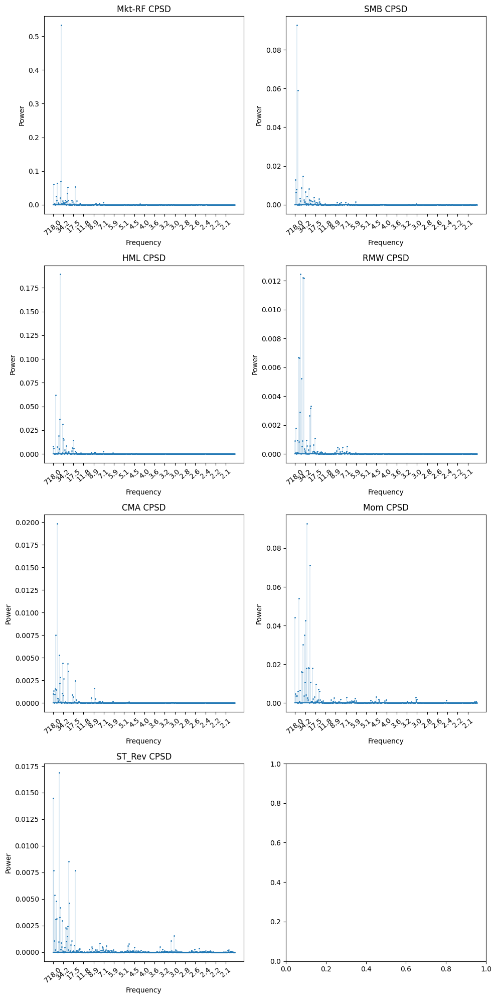

# 20240522

我用过去 $t-1$ 至 $t-12$ 的收益率均值与 $t$ 期收益率均值做回归，并且计算动量分解，相关系数，以及对因子收益率序列进行频率分解，计算不同频率的振幅（能量）占比，如果是在频域上均匀分布，那么占比应该等于 benchmark。

|        |   AutoCovRet |   UncondMeanRet |   lagCoef |   lagCoef_t |   Corr |
|:-------:|:-------------:|:----------------:|:----------:|:------------:|:-------:|
| CMA    |        **0.158** |           0.072 |     0.291 |       **2.77**  |  **0.103** |
| RMW    |        **0.164** |           0.083 |     0.272 |       **2.543** |  **0.095** |
| HML    |        **0.316** |           0.077 |     0.249 |       **2.504** |  **0.093** |
| SMB    |        0.14  |           0.046 |     0.138 |       1.219 |  0.045 |
| Mkt-RF |        0.063 |           0.322 |     0.032 |       0.266 |  0.01  |
| ST_Rev |       -0.047 |           0.209 |    -0.062 |      -0.457 | -0.017 |
| Mom    |       -0.152 |           0.368 |    -0.091 |      -0.741 | -0.028 |

|           | BothLow | BothHigh | SupLowFreqRatio | LowFreqRatio | HighFreqRatio | SupHighFreqRatio |
| :-------: | :-----: | :------: | :-------------: | :----------: | :-----------: | :--------------: |
|    CMA    |  **0.069**  |  0.931   |      0.027      |    0.042     |     0.123     |      0.808       |
|    RMW    |  **0.071**  |  0.929   |      0.017      |    0.054     |     0.107     |      0.822       |
|    HML    |  **0.067**  |  0.933   |      0.022      |    0.044     |     0.136     |      0.797       |
|    SMB    |  0.06   |   0.94   |      0.03       |     0.03     |     0.112     |      0.828       |
|  Mkt-RF   |  0.057  |  0.943   |      0.017      |     0.04     |     0.112     |       0.83       |
|  ST_Rev   |  0.051  |  0.949   |      0.023      |    0.029     |     0.093     |      0.855       |
|    Mom    |  0.048  |  0.952   |      0.017      |    0.031     |     0.122     |      0.829       |
| Benchmark |  0.053  |  0.947   |      0.019      |    0.033     |     0.111     | 0.836 |

我们可以先看过去收益率均值和当期收益率的相关系数，CMA RMW HML 三个因子明显高出其他因子，代表这三个因子的趋势性关系更强，相应的，这三个因子的自回归系数 $\text{cov}(r_{-t},r_t)$ 也就更大。此外，这三个因子的低频占比也显著高于其他因子。

这里有几个问题需要思考。

1. 出现这个现象的原因是什么？

这点可以借鉴 Lettau and Ludvigson (2001b)，像 CMA（投资）, RMW（盈利）, HML（价值），这类与经济周期（基本面）十分相关的因子，低频成分会比较大，就像经济周期一样，有比较明显的周期性。

> For example, Lettau and Ludvigson (2001b) point out that value stocks are more highly correlated with consumption growth in bad economic states than growth stocks, so they earn higher average returns

但是像是 Mom 这类因子，与经济周期的关联度就很少，因此体现出的低频成分是很少的。

2. 为什么自相关性低的股票，unconditional mean 都这么高。

与第一个问题十分相像，对于持续上涨的因子，体现不出太多的周期性，感觉像是经济周期是一种束缚，限制了收益率的持续上升，而脱离这种限制的量价因子长期来看会获得更好的收益率。

3. 关于动量

根据文章的结论，截面动量可以被因子动量所解释，因子动量又可以拆分为自相关性和收益率均值，根据实证结果，这说明**因子可以分为两类**，有的因子**长期来看**就是一直涨，所以长期来看，体现出动量的性质，而有的因子长期来看不怎么涨，但却根据经济规律遵循一种周期性，其动量性质反映为自相关性。

根据 intuition，这两种的确都是动量的性质，但是跟频率最为相关的部分还是自相关性，分解其自协方差：

这里的高频成分是很少的，因为 $t-1$ 至 $t-12$ 的收益率均值已经 smooth 了很大一部分高频了。但是可以看到，此时动量和反转两个因子，高频成分仍然比较明显。

那么也就是说，量价因素中，高频占比还是会比经济周期类多一些。

$$
\begin{aligned}
    \mathrm{E}[\pi_t^\mathrm{TS}]&=\frac1F\mathrm{E}\Big[\sum_{f=1}^Fr_{-t}^fr_t^f\Big] = \frac1F\sum_{f=1}^F\mathrm{E}\Big[r_{-t}^fr_t^f\Big] \\
    &= \frac1F\sum_{f=1}^F \Big[ \text{cov}(r^f_{-t},r_t^f )+E[r_{-t}^f]E[r_{t}^f] \Big] \\
    &= \frac1F\sum_{f=1}^F \text{cov}(r^f_{-t},r_t^f ) + \frac1F\sum_{f=1}^F (\mu^f)^2
\end{aligned}
$$

关于这个结构框架，我认为有两个地方值得商榷

1. 根据这种分解，不同因子之间体现出来是完全独立可加的，而这些因子的背后该有一些 common 的驱动因素。

2. 如果收益率体现出自相关性，那么如果是 conditional 的收益率均值，也该体现出一定的自相关性，

