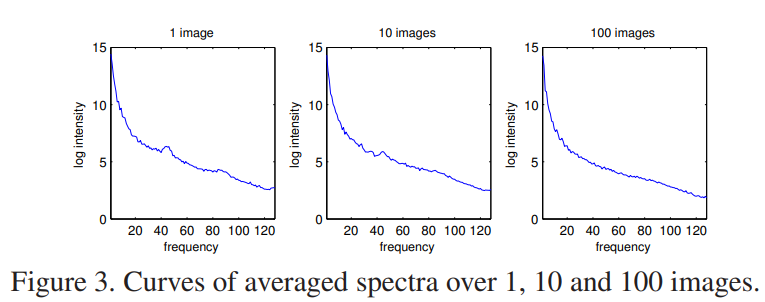
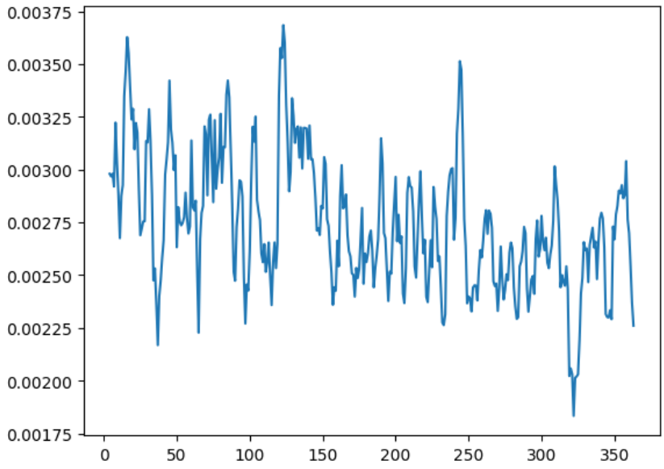

# 20240529

**周期性高的因子波动性小，有什么说法吗？**

在图像领域中，有一个定律叫做 scale invariance，指的是振幅正比于频率的倒数，即频率越高，振幅越低

$$
\begin{equation}
    E\{ A(f) \} \propto \frac{1}{f}
\end{equation}
$$

但是在时间序列中，**并不存在这一性质**，下图是我将七个因子的傅里叶分解振幅取均值后的结果

所以并不存在说哪个频率容易被 detect 出来。

## Periodogram and Autocorrelation Function

对于 Periodgram，也就是每个频率上的能量分布，与自相关函数有着十分密切的关系，对于时间序列 $x_t$ Periodgram 如下

$$
\begin{equation}
    P(f)=\frac1N\left|\sum_{t=0}^{N-1}x_te^{-i2\pi ft}\right|^2
\end{equation}
$$

Periodgram 一般是对时间序列进行 DFT 并取平方得到，但是，由于是对有限数据的直接估计，周期图受数据长度和噪声的影响很大

自相关函数定义如下【已处理均值】

$$
\begin{equation}
    R(\tau)=\frac1N\sum_{t=0}^{N-\tau-1}x_tx_{t+\tau}
\end{equation}
$$

自相关谱是自相关函数的傅里叶变换，描述了信号在频域中的能量分布

$$
\begin{equation}
     S(f) = \sum_{\tau=-\infty}^{\infty} R(\tau) e^{-i2\pi f \tau}
\end{equation}
$$

当数据长度 $N$ 趋于无穷大时，周期图的期望值就会收敛于自相关谱

$$
\begin{equation}
    \lim_{N\to\infty}E[P(f)]=S(f)
\end{equation}
$$

也就是说在大样本情况下，周期图可以作为自相关谱的一个近似估计。

> [!NOTE|label:Welchs method]
> 一般来说自相关谱的估计更加准确一些，因为在估计过程中有很多的减噪方法
> - 将数据分段
> - 去均值处理
> - 计算自相关函数
> - 加窗
> - DFT
> - 平均各频率段频谱
>
> 自相关谱的常用估计方法叫做 welch 方法。
>
> 对样本 $N$ 傅里叶分解的结果为
$$
\begin{equation}
    X(f) = \sum_{n=0}^{N-1} x(n) e^{-2\pi i f \frac{n}{N}}
\end{equation}
$$
> 但是在 welch 方法中，信号 $x_t$ 首先会被分为 $K$ 个长度为 $L$ 的段，$W$ 为 window，
$$
\begin{equation}
     A_k(f) = \frac{1}{L} \sum_{j=0}^{L-1} x_k(j) W(j) e^{-2\pi i f \frac{j}{L}}
\end{equation}
$$
> 然后再计算每个分段的 PSD，并进行平均。
> 
> 我试了一下这种方法，分段之后会降低频率的分辨率，结果也会清晰一些，但是提升没有特别大。

不过想了想也没太多想法，只是感觉单纯通过 AR 模型并不能很好的对应到频率信息上。其他就是又找了几篇跟频率有关的统计论文来看。

1. Cadonna A, Kottas A, Prado R. Bayesian spectral modeling for multiple time series[J]. Journal of the American Statistical Association, 2019.

2. Bruce S A, Tang C Y, Hall M H, et al. Empirical frequency band analysis of nonstationary time series[J]. Journal of the American Statistical Association, 2020, 115(532): 1933-1945.

3. Li T H. Laplace periodogram for time series analysis[J]. Journal of the American Statistical Association, 2008, 103(482): 757-768.

4. Aït-Sahalia Y, Xiu D. Principal component analysis of high-frequency data[J]. Journal of the American Statistical Association, 2019, 114(525): 287-303.

