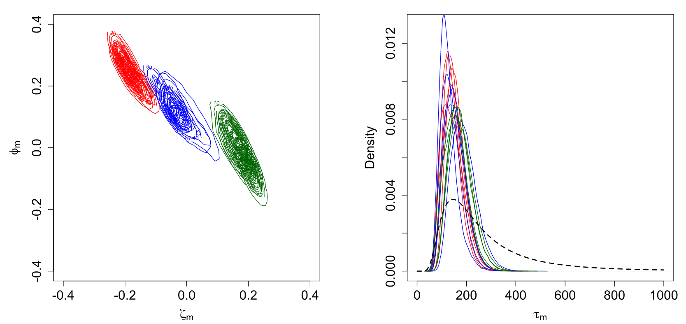
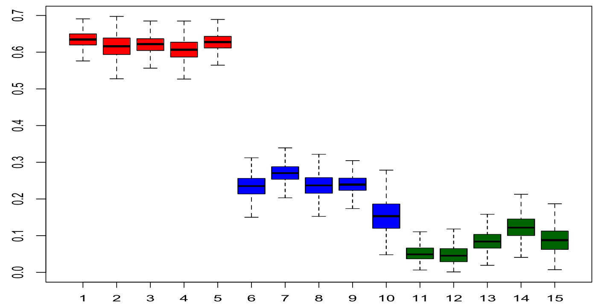
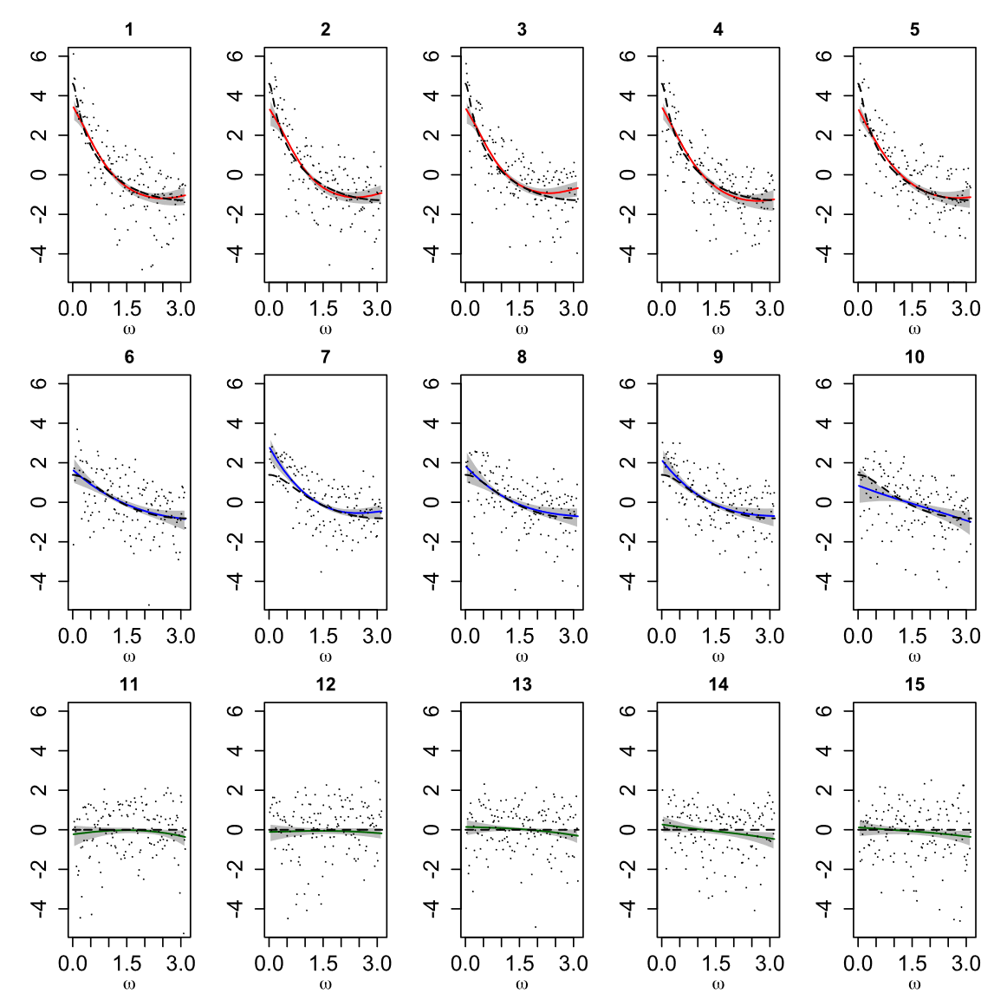
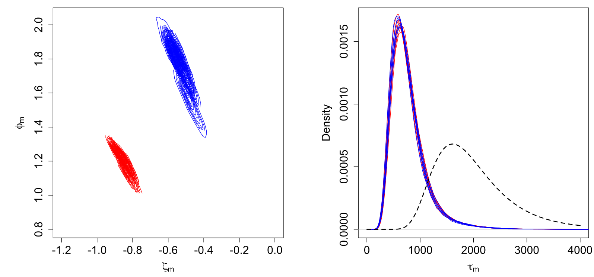
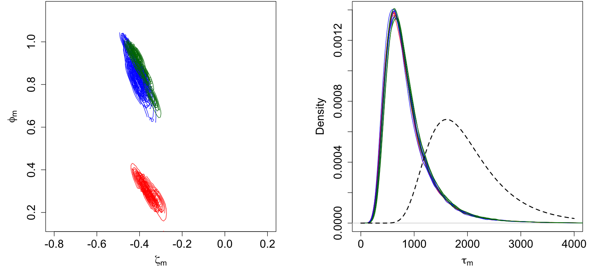
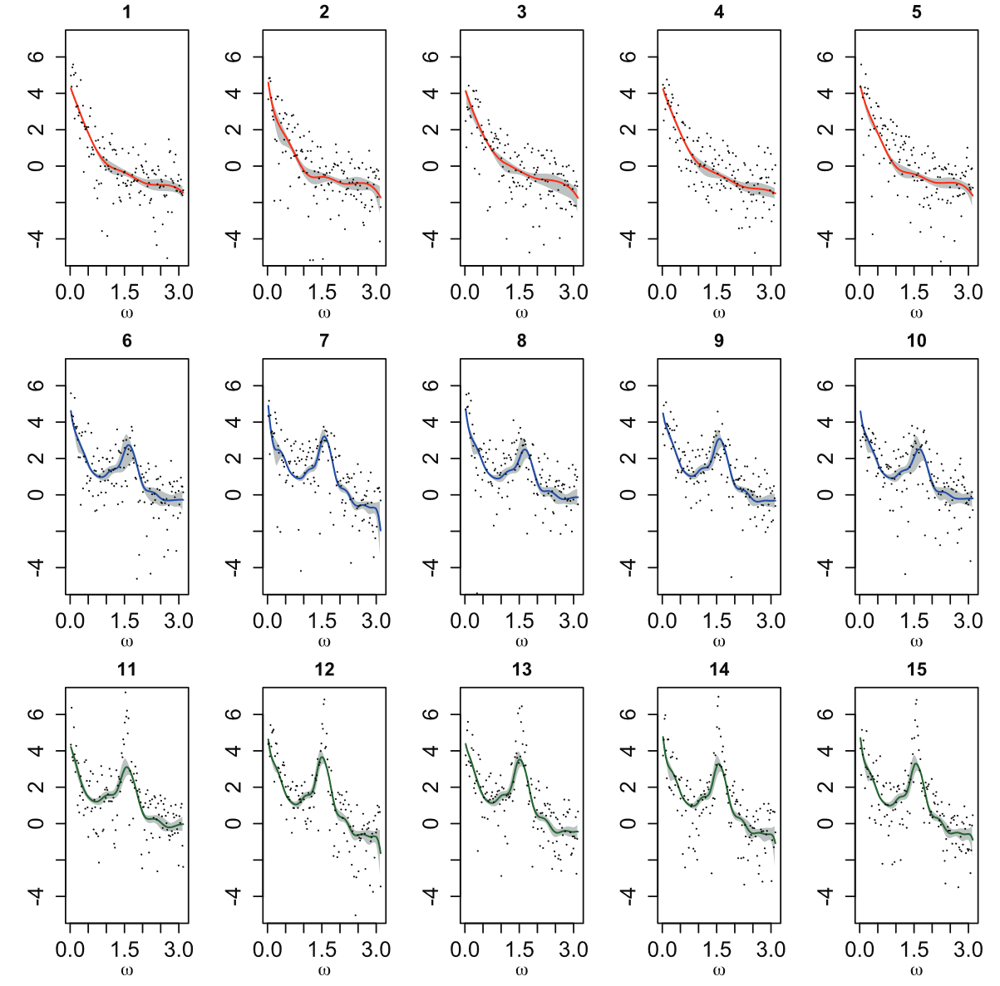

# Bayesian spectral modeling for multiple time series

Cadonna A, Kottas A, Prado R. ***Journal of the American Statistical Association***, 2019.

## 从 Whittle Likelihood 谈起

对于一个时间序列 $\boldsymbol{X}_t$ 来说，当我们假设其服从多元正态分布 $\mathcal{N}(0,\Sigma)$ ，那么其概率密度函数为

$$
\begin{equation}
    f(\mathbf{X})=\frac1{(2\pi)^{T/2}|\Sigma|^{1/2}}\exp\left(-\frac12\mathbf{X}^{\prime}\Sigma^{-1}\mathbf{X}\right)
\end{equation}
$$

其对数似然函数为

$$
L(\mathbf{X};\theta)=-\frac{T}{2}\log(2\pi)-\frac{1}{2}\log|\Sigma_{\theta}|-\frac{1}{2}\mathbf{X}^{\prime}\Sigma_{\theta}^{-1}\mathbf{X}
$$

整理一下为

$$
\begin{equation}
-2L(\mathbf{X};\theta)=T\log(2\pi) + \log|\Sigma_{\theta}|+\mathbf{X}^{\prime}\Sigma_{\theta}^{-1}\mathbf{X}
\end{equation}
$$

但是，传统的极大似然估计在处理长时间序列时计算复杂度很高 $O(T^3)$，在进行似然估计时使用 Whittle Likelihood 可以降低复杂度至 $O(T\log T)$。

对于单个序列，自协方差矩阵是 **Toeplitz矩阵**，依赖于时间滞后的自协方差函数。之所以说这个协方差矩阵是 Toeplitz，是因为对于平稳序列来说，其协方差**只和滞后阶数有关**，跟具体的 $t$ 无关。

$$
\mathbf{C}=\begin{pmatrix}\gamma_0&\gamma_1&\gamma_2&\cdots&\gamma_{N-1}\\\gamma_1&\gamma_0&\gamma_1&\cdots&\gamma_{N-2}\\\gamma_2&\gamma_1&\gamma_0&\cdots&\gamma_{N-3}\\\vdots&\vdots&\vdots&\ddots&\vdots\\\gamma_{N-1}&\gamma_{N-2}&\gamma_{N-3}&\cdots&\gamma_0\end{pmatrix}
$$

> [!NOTE|label:Toeplitz matrix]
> Toeplitz矩阵是一个各对角线元素相同的矩阵，即矩阵中的元素 $T_{ij}$ 满足
$$
T_{ij}=T_{i+k,j+k}
$$
> 例如，
$$
T=\begin{pmatrix}a&b&c&d\\b&a&b&c\\c&b&a&b\\d&c&b&a\end{pmatrix}
$$

对于 Toeplitz 矩阵，可以通过 DFT 进行对角化近似

$$
\begin{equation}
    \Sigma \approx  F\Lambda F^*
\end{equation}
$$

其中 $\Lambda$ 是一个对角矩阵，对角元素为频谱密度函数 $f(\omega_k)$，$F$ 是傅里叶变换基向量

$$
\begin{equation}
    F_k=\frac1{\sqrt{N}}\begin{pmatrix}1\\e^{-i2\pi k/N}\\e^{-i4\pi k/N}\\\varvdots\\e^{-i2\pi(N-1)k/N}\end{pmatrix},\quad k=0,1,\ldots,N-1
\end{equation}
$$

> 加入 $\sqrt{N}$ 是为了标准化，使得向量长度为1。

因为 $F$ 是一个酉矩阵，即 $FF^*=I$，其行列式 $|F| = 1$，因此有

$$
\begin{equation}
\begin{aligned}
    \log|\Sigma_{\theta}|&\approx\log|F\Lambda F^*| \\
    &=\log|F|+\log|\Lambda|+\log|F^*|\\
    &=\log|\Lambda|
\end{aligned}
\end{equation}
$$

> [!NOTE|label:酉矩阵]
> 一个复矩阵 $U$ 是酉矩阵，如果它满足以下条件
$$
UU^*=U^*U=I
$$
> $*$ 代表共轭转置，DFT 矩阵是最常见的酉矩阵之一。

而对角矩阵的行列式就是对角元素的乘积，因此

$$
\begin{equation}
    \log|\Lambda|=\log\left(\prod_{k=1}^{T/2}f(\omega_k)\right)=\sum_{k}\log f(\omega_k)
\end{equation}
$$

所以最终得到了

$$
\begin{equation}
    \log|\Sigma_{\theta}|\approx\log|F\Lambda F^*|=\log|\Lambda|=\sum_{k}\log f_{\theta}(\omega_k)
\end{equation}
$$

对 $\Sigma$ 取逆有

$$
\begin{equation}
    \Sigma^{-1}=(F\Lambda F^{*})^{-1}=(F^{*})^{-1}\Lambda^{-1}(F)^{-1}=F(\Lambda^{-1})F^{*}
\end{equation}
$$

因此

$$
\begin{equation}
\begin{aligned}
\mathbf{X}^{\prime}\Sigma^{-1}\mathbf{X}&=\mathbf{X}^{\prime}F(\Lambda^{-1})F^{*}\mathbf{X} \\
&= (\mathbf{X}' F \Lambda^{-\frac{1}{2}})(\mathbf{X}' F \Lambda^{-\frac{1}{2}})^*
\end{aligned}
\end{equation}
$$

而

$$
\begin{equation}
    \mathbf{X}'F_j = \frac1{\sqrt{N}}\sum_{t=0}^{n-1}x_t\exp(-i\omega_kt)=\frac1{\sqrt{N}} S(f_k)
\end{equation}
$$

所以

$$
\begin{equation}
    \mathbf{X}'F_j\Lambda^{-\frac{1}{2}} = \frac{S(f_k)}{\sqrt{N}\sqrt{ f_{\theta}(\omega_k)}}
\end{equation}
$$

所以最终

$$
\begin{equation}
\mathbf{X}^{\prime}\Sigma^{-1}\mathbf{X} = \sum_{k} \frac{S^2(f_k)}{N f_{\theta}(\omega_k)} = \sum_{k} \frac{I(\omega_k)}{f_{\theta}(\omega_k)}
\end{equation}
$$

所以最终的似然函数形式为

$$
\begin{equation}
    \log|\Sigma_{\theta}|+\mathbf{X}^{\prime}\Sigma_{\theta}^{-1}\mathbf{X} = \sum_{k} \left(\log f(\omega_k) + \frac{I(\omega_k)}{f_{\theta}(\omega_k)} \right)
\end{equation}
$$

这就是 Whittle Approximation，将时域上的拟合转化为了频域上的拟合。Whittle approximation 最主要的优点就是，将频谱密度直接**显式**地表达了出来，而不是像原本的似然函数，要通过自协方差来隐含地表达。

## Intro

首先是一些基础的定义，频谱密度

$$
\begin{equation}
    f(\omega)=\sum_{k=-\infty}^{+\infty}\gamma(k)\exp\left(-ik\omega\right),\quad\mathrm{for}-\pi\leq\omega\leq\pi,
\end{equation}
$$

其中 $\gamma(k)=\mathbb{E}(X_{t+k}X_t)$ 就是 auto-covariance，其周期图为

$$
\begin{equation}
    I_n(\omega)=\left|\sum_{t=1}^nx_t\exp{(-it\omega)}\right|^2/n
\end{equation}
$$

当样本规模足够大时，可以认为周期图 $I_n(\omega)$ 是独立的。此外，对于零均值高斯时间序列（Zero-mean Gaussian time series），周期图服从均值为 $f(\omega)$ 的指数分布。

> [!NOTE|label: Exponential Distribution]
> 周期图 （periodogram） 通过DFT计算得到的频谱密度估计，用于从有限样本数据中估计频谱密度 $f(\omega)$，这也就是说当样本足够大时，周期图的期望就是频谱密度，即样本估计等于真实值，接下来我们看看为什么会服从指数分布。
> 
> 对于一个长度为 $N$ 的零均值平稳高斯时间序列 $x_t$，其 DFT 为
$$
\tilde{X}_j=\sum_{t=0}^{N-1}x_te^{-i2\pi jt/N},\quad j=0,1,\ldots,N-1
$$
> 
> 周期图定义为
$$
I_n(\omega_j)=\frac1N|\tilde{X}_j|^2=\frac1N(\mathrm{Re}(\tilde{X}_j)^2+\mathrm{Im}(\tilde{X}_j)^2)
$$
> 由于 $x(t)$ 是零均值平稳高斯时间序列，$\tilde{X}_j$ 的实部和虚部也是零均值高斯分布
$$
\begin{aligned}\operatorname{Re}(\tilde{X}_j)\sim\mathcal{N}(0,\sigma^2)\\\operatorname{Im}(\tilde{X}_j)\sim\mathcal{N}(0,\sigma^2)\end{aligned}
$$
> 并且和功率谱密度之间的关系为
$$
\mathrm{Var}(\mathrm{Re}(\tilde{X_j}))=\mathrm{Var}(\mathrm{Im}(\tilde{X_j}))=\frac{S(f_j)}2
$$
> 也就是说，$\tilde{X}_j$ 的总方差为 $S(f_j)$，并且有 $\sigma^2 = S(f_j)/2$。
> 
> 由于其实部和虚部是独立的零均值高斯分布，那么他们的平方和服从 $\chi^2$ 分布，自由度为 2，因此 $|\tilde{X}_j|^2$ 的概率密度函数为
$$
f_{\chi^2}(x;2\sigma^2)=\frac1{2\sigma^2}e^{-x/(2\sigma^2)},\quad x\geq0
$$ 
>
> 所以 $I_n(\omega_j)=\frac1N|\tilde{X}_j|^2$ 服从
$$
I_n(\omega_j)\sim\text{Exponential}\left(\frac{2\sigma^2}N\right)
$$
>
> 尺度参数为 $\beta$ 的指数分布的概率密度函数为
$$
f_{\text{Exp}}(x;\beta)= \frac{1}{\beta} e^{-  x / \beta},\quad x\geq0
$$
>

基于周期图和频谱密度之间的关系，可以提出各种各样的模型进行估计，例如对数周期图的回归函数

$$
\begin{equation}
    \log(I_n(\omega_j))=\log(f(\omega_j))+\epsilon_j,\mathrm{~for~}j=1,\ldots,N,
\end{equation}
$$

其中，$\epsilon_j$ 服从对数-指数分布，尺度参数为 1，频率学派估计方法包括

- Wahba (1980) 将 $\epsilon_j$ 定义为一个正态分布，并用 Smoothing Spline 将其拟合到对数周期图上
- Pawitan and O’Sullivan (1994) 通过加上惩罚项的 Whittle 似然函数估计 $\epsilon_j$

贝叶斯学派的估计方法包括

- CarterandKohn (1997) 通过 mixture of normal distributions 估计 $\epsilon_j$ 的分布，并给 $\log(\omega)$ 分配了一个 smoothing prior。
- Choudhuri, Ghosal, and Roy (2004) 使用 Bernstein polynomial priors 来估计频谱密度
- Rosen and Stoffer (2007) 将对数频谱表达为 $\log(f(\omega))=\alpha_0+\alpha_1\omega+h(\omega)$，并给 $h(\omega)$ 分配了 Gaussian process prior
- Pensky,Vidakovic,and DeCanditiis (2007) 提出了 Bayesian wavelet-based smoothing of the log-periodogram.

Here,we propose a flexible Bayesian modeling approach for multiple time series that leads to full inference of the **multiple spectral densities** and also allows us to **identify groups of time series with similar spectral characteristics**.

## Mixture Model Approximation to the Whittle Log-Likelihood

在 Whittle Approximation 下，可以定义一个转换后的对数频谱密度 (log-spectral density)

$$
\begin{equation}
    y_j=\log(I_n(\omega_j))+\gamma,
\end{equation}
$$

其中 $\gamma\approx0.57722$ 是 Euler–Mascheroni constant。

log-spectral density 的分布定义如下

$$
\begin{equation}
\begin{aligned}
f_Y(y)&=\exp\{y-\gamma-\log(f(\omega))-\exp(y-\gamma-\log(f(\omega)))\},\\ y&\in\mathbb{R}.
\end{aligned}
\end{equation}
$$

根据这个分布，有 $\mathbb{E}[y_j]=\log(f(\omega_j)),\mathrm{var}[y_j]=\pi^2/6.$

但是这个分布有一些问题

> Although it is a standard distribution, the spectral density enters the likelihood in a nonstandard fashion through the mean parameter. Nevertheless, the Whittle approximation has been widely used in the literature because the spectral density appears explicitly in the approximate likelihood rather than through the covariance function.

> [!TIP|label:Derivation]
> 对这个分布进行重参数化，令 $z=y-\gamma-\log(f(\omega))$，那么 $y$ 可以表示为
$$
y=z+\gamma+\log(f(\omega))
$$
> 接着把 $z$ 带入原分布，有
$$
f_Z(z)=\exp\left(z-\exp(z)\right)
$$
> 这是一个标准的 Gumbel 分布 $\text{Gumbel(0,1)}$，其均值和方差为
$$
\mathbb{E}[Z] = - \gamma, \quad \text{Var}(Z) = \frac{\pi^2}{6}
$$
> 所以 $y$ 的均值为
$$
\begin{aligned}
\mathbb{E}[Y] &=\mathbb{E}[Z+\gamma+\log(f(\omega))]  \\
& =\mathbb{E}[Z]+\gamma+\log(f(\omega))  \\
& =-\gamma+\gamma+\log(f(\omega))  \\
& =\log(f(\omega)) 
\end{aligned}
$$
> 方差为
$$
\begin{aligned}
    \text{Var}(Y) = \text{Var}(Z)= \frac{\pi^2}{6} 
\end{aligned}
$$
> 

因此作者提出了一个新的分布，用 $k$ 个高斯分布拟合这一模型，也就是 mixture of Gasussian distributions

$$
\begin{equation}
\begin{aligned}y_{j}\mid\boldsymbol{\theta}&\overset{{\mathrm{ind.}}}{\operatorname*{\operatorname*{\operatorname*{\sim}}}}\sum_{k=1}^{K}g_{k}(\omega_{j};\boldsymbol{\xi})\operatorname{N}(y_{j}\mid\alpha_{k}+\beta_{k}\omega_{j}/\pi,\sigma^{2}),\\j&=1,\ldots,N,\end{aligned}
\end{equation}
$$

- $g_k(\omega_j;\boldsymbol{\xi})$ 是第 $k$ 个高斯分布的权重

> The weight parameters vary depending on the specific form of the weights and will be fully specified in each case.

- $\boldsymbol{\xi}$ 是权重参数向量 and will be fully specified in each case
- 向量 $\boldsymbol{\theta}$ 包括了所有模型参数

这里将 $\omega$ 除 $\pi$ 是为了标准化频率到 $(0,1)$ 的范围内（common practice），在 weight function $\boldsymbol{\xi}$ 中也做了该处理。

因为根据 Whittle Approximation $E[y_i] = \log(f(\omega))$，在 Gaussian mixture distribution 下，

$$
\begin{equation}
    \log(f(\omega))=\sum_{k=1}^Kg_k(\omega;\xi)\left\{\alpha_k+\beta_k\omega/\pi\right\},\quad\omega\in(0,1),
\end{equation}
$$

其中，权重是关于频率的函数，consecutive difference，通过连续差分能保证权重和为1。

$$
\begin{equation}
    g_k(\omega;\boldsymbol{\xi})\equiv g_k(\mu(\omega),\tau)=\int_{(k-1)/K}^{k/K}f_Y(y\mid\mu(\omega),\tau)\mathrm{~d}y,
\end{equation}
$$

其中，$f_Y(y\mid\mu(\omega),\tau)$ 是定义在 $(0,1)$ logit-normal 的概率密度函数，这个正态分布均值为 $\mu(\omega)$，precision parameter 为 $\tau$。因此对于每一个频率来说，权重的分布都不同。

$\mu(\omega)$ 被定义为频率的单调函数

$$
\begin{equation}
    \mu(\omega)=\zeta+\phi\omega/\pi 
\end{equation}
$$

> 定义这种形式的权重和 logit-normal distribution，是为了应用 MCMC 算法进行估计。

并且，文章在原有模型的基础上，加入了一个 auxiliary variables，对于每一个频率密度 $y_j$ ，都有 auxiliary variable $r_j$，因此这个增广模型可写为

$$
\begin{equation}
    \begin{aligned}y_{j}\mid r_{j},\boldsymbol{\alpha},\boldsymbol{\beta},\sigma^{2}&\overset{{\mathrm{ind.}}}{\operatorname*{\operatorname*{\operatorname*{\sim}}}}\sum_{k=1}^{K}\mathcal{N}(y_{j}\mid\alpha_{k}+\beta_{k}\omega_{j}/\pi,\sigma^{2})\\&\times\mathbb{I}\left\{(k-1)/K<\frac{\exp(r_{j})}{1+\exp(r_{j})}\leq k/K\right\}\\r_{j}\mid\boldsymbol{\xi}&\overset{{\mathrm{ind.}}}{\operatorname*{\operatorname*{\operatorname*{\sim}}}}\mathcal{N}(r_{j}\mid\boldsymbol{\zeta}+\phi\omega_{j}/\pi,1/\tau),\end{aligned}
\end{equation}
$$

Auxiliary variable 通过 Indicator function 决定了最终频谱密度分布的形状。

> [!NOTE|label:Auxiliary variable]
> 令 
$$
r_j = \log \frac{y_j}{1-y_j}
$$
> 因为 $f_Y(y\mid\mu(\omega),\tau)$ 是定义在 $(0,1)$ logit-normal 分布，所以 $r_j$ 为正态分布，均值为 $\mu(\omega)$，方差为 $1/ \tau$。变换得
$$
y = \frac{e^r}{1+e^r}
$$
> 因此 Indicator function 中的不等式 bound 就是 $y_j$ 的积分上下限。

辅助变量 $r_j$ 服从正态分布，均值为 $\mu(\omega)=\zeta+\phi\omega/\pi $，precision parameter 为 $\tau$，指示函数的作用是给模型增加了稀疏性。

### Hierarchical Model for Multiple Spectral Densities

对于 $M$ 个时间序列，假设基础分布 $(\alpha_k,\beta_m)$ 是一样的，只是权重 $\xi_m\quad=\quad(\zeta_m,\phi_m,\tau_m)$ 不同。

$$
\begin{equation}
\begin{aligned}y_{mj}\mid r_{mj},\boldsymbol{\alpha},\boldsymbol{\beta},\sigma^{2} \ &\overset{{\mathrm{ind}}}{\operatorname*{\operatorname*{\operatorname*{\sim}}}}\sum_{k=1}^{K}\mathbb{N}(y_{mj}\mid\alpha_{k}+\beta_{k}\omega_{j}/\pi,\sigma^{2})\\&\times\mathbb{I}\left\{(k-1)/K<\frac{\exp(r_{mj})}{1+\exp(r_{mj})}\leq k/K\right\}\\r_{mj}\mid\boldsymbol{\xi}_{m}&\overset{{\mathrm{ind.}}}{\operatorname*{\operatorname*{\operatorname*{\sim}}}}\mathbb{N}(r_{mj}\mid\zeta_{m}+\phi_{m}\omega_{j}/\pi,1/\tau_{m}).\end{aligned}
\end{equation}
$$

## MCMC details

接下来只需要知道先验就可以进行 Gibbs 采样估计了。

$\alpha,\beta$ 的先验为

$$
\begin{equation}
    \alpha_k \sim \mathrm{N}(\mu_{0\alpha},\sigma_\alpha^2), \quad \beta \sim \mathrm{N}(\mu_{0\beta},\sigma_{\beta}^2),
\end{equation}
$$

$\sigma^2$ 的先验为

$$
\begin{equation}
    \sigma^2~\sim~\text{inv-gamma}(n_{\sigma^2},d_{\sigma^2})
\end{equation}
$$

对于每个时间序列权重部分采用 hierarchical prior

$$
\begin{equation}
    \begin{aligned}(\zeta_{m},\phi_{m})\mid\boldsymbol{\mu}_{w},\Sigma_{w}&\overset{{\mathrm{ind.}}}{\operatorname*{\operatorname*{\operatorname*{\sim}}}}\mathcal{N}(\boldsymbol{\mu}_{w},\Sigma_{w}),\quad m=1,\ldots,M,\\\tau_{m}\mid d_{\tau}&\overset{{\mathrm{ind.}}}{\operatorname*{\operatorname*{\operatorname*{\sim}}}}\mathrm{gamma}(n_{\tau},d_{\tau}),\quad m=1,\ldots,M,\end{aligned}
\end{equation}
$$

其中 $\boldsymbol{\mu}_w$ 是 bivariate normal distribution，$\Sigma_w$ 是 inverse Wishart prior。对于 $\tau_m$，固定 $n_{\tau}$，$d_{\tau}$ 为 gamma 分布。 $\zeta_{m},\phi_{m}$ 是和聚类有关的参数。

具体的估计流程为，共有 $M$ 个时间序列，每个时间序列有 $K$ 个 Gaussian distribution，需要估计的分布经过标准化为，标准化使得估计出的概率密度函数和为1。

$$
\begin{equation}
w_k=\frac{g_k(\mu_m(\omega_j),\tau_m)\mathcal{N}(y_{mj}\mid\alpha_k+\beta_k\omega_j,\sigma^2)}{\sum_{i=1}^Kg_i(\mu_m(\omega_j),\tau_m)\mathcal{N}(y_{mj}\mid\alpha_i+\beta_i\omega_j,\sigma^2)},
\end{equation}
$$

接下来更新参数 $\alpha,\beta$， 同时对 $\alpha_k,\beta_k$ 进行采样，$\mu = (\mu_{\alpha},\mu_{\beta})$，$\Sigma_0$ 是对角矩阵，对角线元素为 $\sigma^2_{\alpha},\sigma^2_{\beta}$，全条件分布如下

$$
\begin{equation}
\begin{aligned}
\Sigma^*&=\sigma^2\left(\sum_{m,j:\frac{k-1}K<\frac{\exp(r_{mj})}{1+\exp(r_{mj})}\leq\frac kK}z_jz_j^{\prime}+\Sigma_0^{-1}\right)^{-1} \\
\mu^{*}&=\Sigma^{*}\biggl(\Sigma_{0}^{-1}\mu_{0}~+~\sum_{{m,j:\frac{k-1}{K}<\frac{\exp(r_{mj})}{1+\exp(r_{mj})}\leq\frac{k}{K}}}y_{mj}z_{j}\biggr)
\end{aligned}
\end{equation}
$$

其中 $z_j = (1,\omega_j)'$。

> 这里是对每一个 $k$ 分别更新。

接下来采样 $\zeta_m,\phi_m$，全条件分布为

$$
\begin{equation}
\begin{aligned}\Sigma_w^*&=\left(\sigma^{-2}\sum_{j=1}^Nq_jq_j^{\prime}+\Sigma_w^{-1}\right)^{-1}\\\mu_w^*&=\Sigma_w^*\left(\sigma^{-2}\sum_{j=1}^Nr_{mj}q_j+\Sigma_w^{-1}\mu_w\right)\end{aligned}
\end{equation}
$$

其中 $q_j = (1,\omega_j)'$。

接着更新 $\sigma^2$，$\sigma^2$ 服从 inverse-gamma 分布，包括参数 $n^*,d^*$，

$$
\begin{equation}
\begin{aligned}
n^*&=n_\sigma2+0.5NM \\
d^*&= d_{\sigma^2}+0.5\sum_{m=1}^M\sum_{j=1}^N\sum_{k=1}^K(y_{mj}-(\alpha_k+\beta_k\omega_j))^2\mathbb{I}\left(\frac{k-1}K<\frac{\exp(r_{mj})}{(1+\exp(r_{mj}))}\leq\frac kK\right)
\end{aligned}
\end{equation}
$$

对于 $\tau_m$，服从 gamma 分布，参数为 

$$
\begin{equation}
\begin{aligned}
    n_{\tau}+0.5N,\quad d_\tau+0.5\sum_{j=1}^N(r_{mj}-(\zeta_m+\phi_m\omega_j))^2
\end{aligned}
\end{equation}
$$

$d_{\tau}$

$$
\begin{equation}
\begin{aligned}
    a_{d_\tau}+Mn_\tau  ,\quad b_{d_\tau}+M\sum_{m=1}^M\tau_m
\end{aligned}
\end{equation}
$$

$\mu_w$

$$
\begin{equation}
\begin{aligned}
    \Sigma_0^*=(\Sigma_{00}+M\Sigma_w)^{-1}, \quad \mu_0^*=\Sigma_0^*[\Sigma_{00}^{-1}\mu_{00}+ \Sigma_w^{-1}\sum_{m=1}^{M}(\zeta_m,\phi_m)^{\prime}]
\end{aligned}
\end{equation}
$$

$\Sigma_w$ inverse wishart

$$
\begin{equation}
    \Psi~+~\sum_{m=1}^M[(\zeta_m,\phi_m)^{\prime}~-\mu_w][(\zeta_m,\phi_m)^{\prime}-\mu_w]^{\prime}
\end{equation}
$$

## Empirical

Total Variation Distance (TVD)，用以衡量两个**标准化**分布之间的相似度。对标准化分布 $f^{*}=f/\int_{\Omega}f(\omega)\mathrm{d}\omega,\ g^*=g/\int_\Omega g(\omega)\mathrm{d}\omega $，其中 $\Omega=(0,\pi)$，直觉上来理解，TVD 衡量的就是两个分布之间重合的部分，并且等于二者 L1 距离的二分之一。

作者模拟测试了三种情况，用以说明方法的有效性，每种情况均为 $M = 15$，5个一组，因此共有 3 组。

### Scenario 1

全部时间序列都来自于 AR1，系数分别为 0.9，0.5，0，分别对应红蓝绿。估计结果如下

左边是 $\zeta_m,\phi_m$ 的分布，右边是 $\tau_m$ 的分布，dashed line 是marginal prior density。

> [!NOTE|label:marginal prior density]
> 假设我们有两个参数 $\theta_1,\theta_2$，他们的联合先验分布是 $p(\theta_1,\theta_2)$，那么 $\theta_1$ 的边际先验密度指的是
$$
p(\theta_1) = \int p(\theta_1,\theta_2) d \theta_2
$$
> 

可以看到，$\zeta_m,\phi_m$ 能够帮助我们很好的区分开不同的 group，但是 $\tau_m$ 就不太行。

下图计算了和 white noise 之间的 TVD，也可以看出明显的区分。

这是分组上的差异，那么对于频谱的拟合怎么样呢？

dashed line 是真实分布，solid line 是后验估计，阴影部分是置信区间。

### Scenario 2

Scenario 2 比 Scenario 1 要复杂一些，体现在 Scenario 1 的频谱是单调的，而Scenario 2 则不是。

Scenario 2 基于 AR2 同样 simulate 了 15 个时间序列，前八个 AR2 modulus 为 0.95，frequency 为 2.07，后七个 AR2 modulus 为 0.95，frequency 为 1.08。可以理解为 AR2 的模衡量了周期性衰减的速度，而频率携带了关于周期的信息。

此时也是比较顺利的分开了。

### Scenario 3

Scenario 3 中，所有的时间序列都包含一个 AR1 with parameter 0.9 的成分，中间五个在 AR1 基础上加上了 AR2 with modulus 0.83 frequency 1.54，最后五个在 AR1 基础上加上了 AR2 with modulus 0.97 frequency 1.54。

相似的频率成分不太好区分，但是 AR1 和 AR2 的区别是能够分开的。

 

