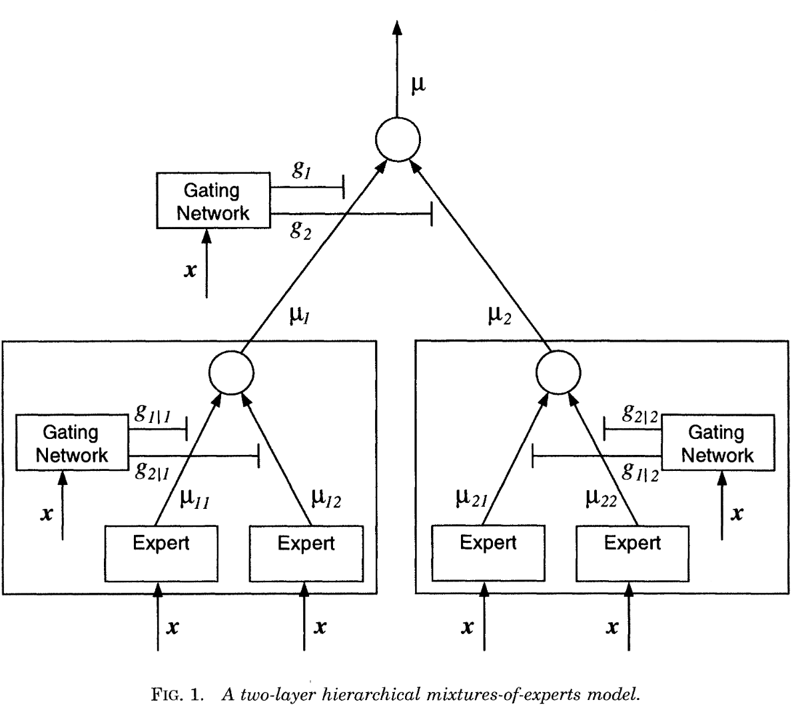

# 20240619

在上一篇文章中，对频谱进行了建模，采用的是如下形式

$$
\begin{equation}
\begin{aligned}y_{mj}\mid r_{mj},\boldsymbol{\alpha},\boldsymbol{\beta},\sigma^{2} \ &\overset{{\mathrm{ind}}}{\operatorname*{\operatorname*{\operatorname*{\sim}}}}\sum_{k=1}^{K}\mathbb{N}(y_{mj}\mid\alpha_{k}+\beta_{k}\omega_{j}/\pi,\sigma^{2})\\&\times\mathbb{I}\left\{(k-1)/K<\frac{\exp(r_{mj})}{1+\exp(r_{mj})}\leq k/K\right\}\\r_{mj}\mid\boldsymbol{\xi}_{m}&\overset{{\mathrm{ind.}}}{\operatorname*{\operatorname*{\operatorname*{\sim}}}}\mathbb{N}(r_{mj}\mid\zeta_{m}+\phi_{m}\omega_{j}/\pi,1/\tau_{m}).\end{aligned}
\end{equation}
$$

其中，$N$ 代表正态分布，乘上代表每个分布的权重。

首先要理解，原文是如何实现分类的。需要厘清的参数有三个，$k,m,j$

- $m$ 代表共有 $m$ 个时间序列
- $j$ 代表共有 $j$ 个频率
- $k$ 代表有 $k$ 个正态分布（base function），对于每一个频率来说，这些 $k$ 个正态分布的均值都不一样 $\alpha + \beta w_j / \pi$，但是对于 $m$ 来说，这些 base function 都是一样的

总的来说，每个频率下面都有 $k$ 个正态分布，对于每一个 $m$ 的每一个 $j$，都会从对应的 $k$ 个分布中取出来**一个**，用以表征当前频率下的特征，**如果 $m_1,m_2$ 所的系数 $\xi_m,\phi_m$ 很接近，那么他们在每一个频率下就倾向于选择同样的分布**。

在这种假设下，$y$ 均值就可以表示为

$$
\begin{equation}
    \log(f(\omega))=\sum_{k=1}^Kg_k(\omega;\boldsymbol{\xi})\{\alpha_k+\beta_k\omega/\pi\},\quad\omega\in(0,1),
\end{equation}
$$

这也就是我们最终的估计目标。

这一形式属于 Mixture of Experts 中的特殊形式，Mixture of experts 足够拟合大多数的条件分布，而 smooth mixtures of normal regressions 是 ME model 的一种特殊情况，用正态分布去拟合复杂的条件分布。ME 跟普通的 mixture 区别在于 mixing weight 和 input 有关。

关于 ME 的形式，还有另一种理解，就是 **probabilistic decision tree**，这是因为 Indicator function 充当了 gating 的作用，使得每一个 $y_{mj}$ 只能属于一种分布，自然也就有了分类的效果。

之所以称之为 smooth，是因为一个模型，如果 mixing weight 是与 $x$ 有关的并且光滑变化的，那么就称之为 smooth mixture。

> Models, in which the mixing weights depend on x, are referred in this paper as smooth mixtures.

关于权重的形式，乍一看十分之复杂，但是背后是有一定的理论基础，从这篇文章中可以看出一些端倪，接下来我简略介绍一下其中的内容。

> Norets A. Approximation of conditional densities by smooth mixtures of regressions, ***Annals of Statistics***. 2010.

对于在内积空间 $Y\times X,Y\subset\mathbb{R}^d,X \subset \mathbb{R}^{d_x}$ 上的联合概率分布 $F$ 。假设条件概率分布 $F(y|x)$ 的密度函数为 $f(y|x)$，定义为 **勒贝格测度**，变量 $x$ 的概率密度函数 $f(x)$ 定义为 **泛测度**。用一个模型来拟合条件密度 $f(y|x)$ 描述为 $p(y|x,M)$，那么 $f(y,x)$ 和 $f(y,x,\mathcal{M})$ 之间的 **KL 散度** 为

> 勒贝格测度用于定义连续随机变量的概率密度函数

$$
\begin{equation}
    d_{\mathrm{KL}}(F,\mathcal{M})=\int\log\frac{f(y|x)}{p(y|x,\mathcal{M})}F(dy,dx).
\end{equation}
$$

当我们使用 smooth mixtures of normal regressions，可以证明**随着 $m$ 的数量逐渐增加，最终模型和真实分布之间的 KL 散度会趋于0，也就是说得到了一致估计**。

$$
\begin{equation}
    p(y|x,\mathcal{M})=\sum_{j=1}^m\alpha_j^m(x)\phi(y,\mu_j^m(x),\sigma_j^m(x)),
\end{equation}
$$

其中 $\alpha_j^m(x)\in[0,1],\sum_j\alpha_j^m(x)=1$，$\phi(y,\mu,\sigma)$ 是正态分布密度函数，均值为 $\mu$，标准差为 $\sigma$。

- $\alpha_j^m(x)$ 通常可以建模为 Multinomial choice model，例如 logit 或 probit model
- $\mu_j^m(x)$ 可以是常数，线性或灵活形式
- $\sigma_j^m(x)$ 可以通过指数多项式或 spline 进行拟合

自然，Bayesian Spectral Modeling for Multiple Time Series 这篇文章也需要证明得到的是一致估计，这也就能解释 mixing coefficient 的形式由来。

> Under this weight, it can be proved that, as the number of components increases, the approximation in (2) tends to (1) in the sense of the Kullback–Leibler divergence.

这里的（2）就是作者提出的模型，（1）则是原本的 whittle likelihood，这句话的意思就是，作者通过 mixture of experts 通过一种更灵活、更直接的方法实现了原本频率上的估计，并且这种方法可以扩展到多个时间序列上去。

在 ME 的基础上，还有一个 Hierarchical Mixture of Experts，不过这个就比较复杂了，暂时没想到使用这个的必要性。

