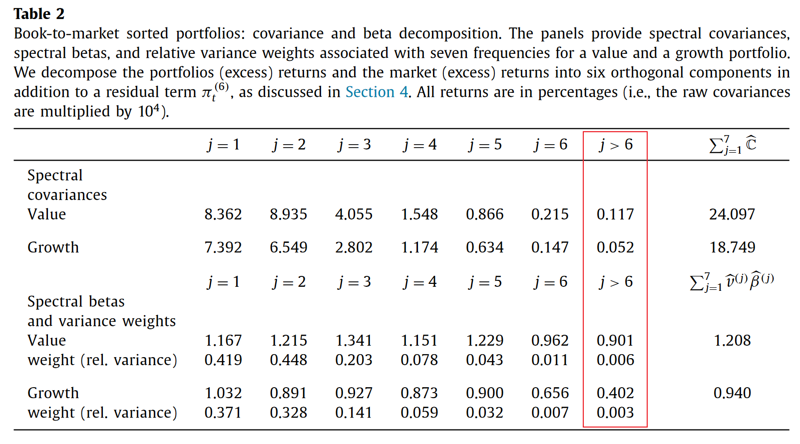
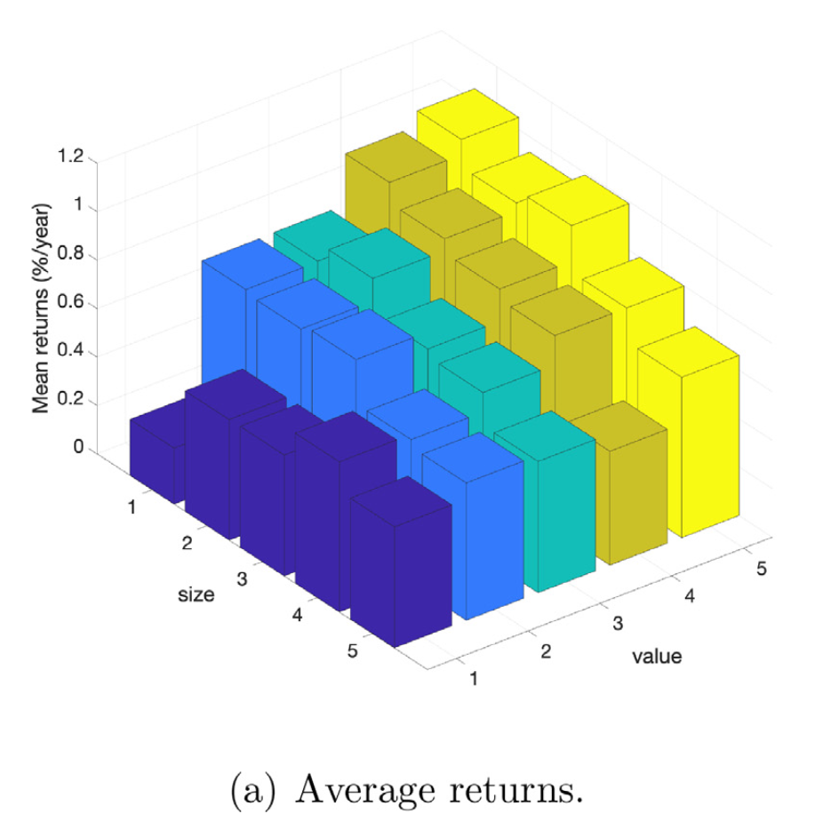
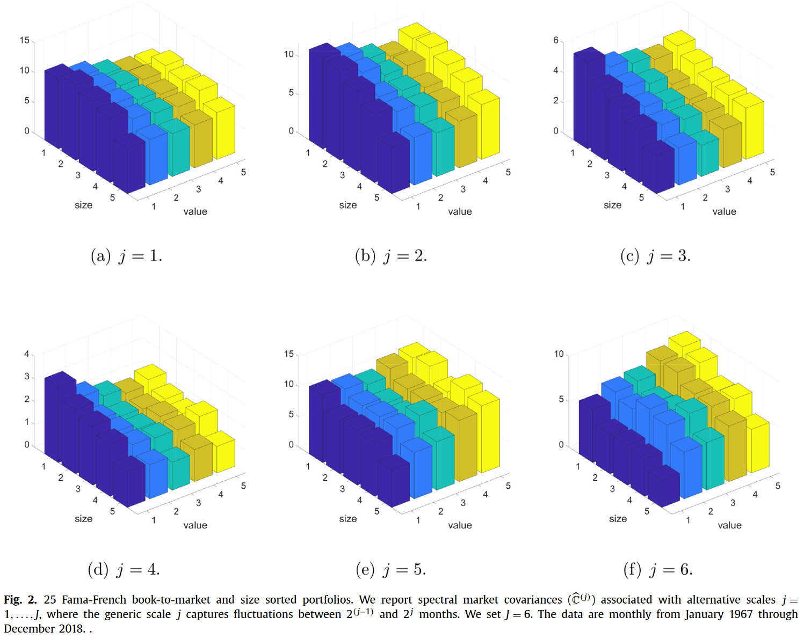
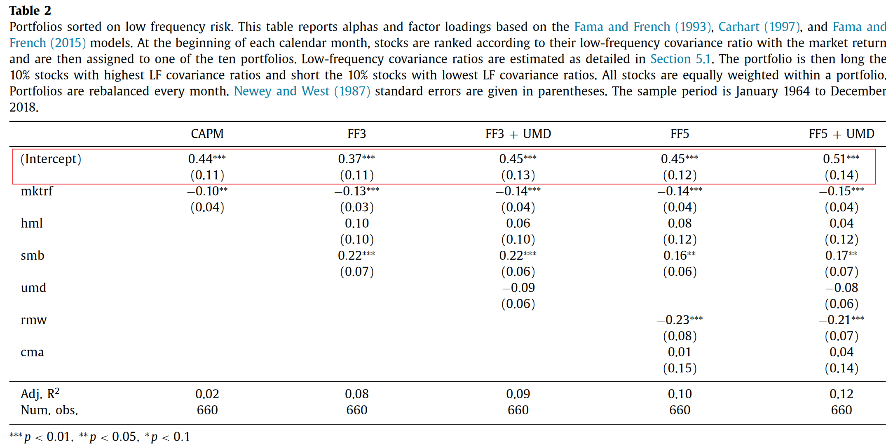
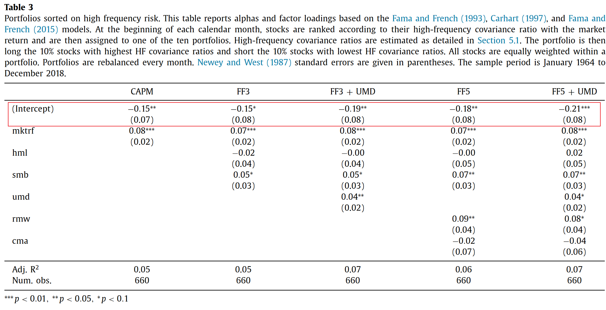
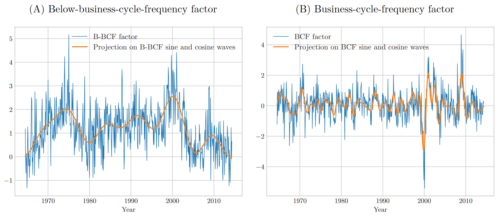

# 20240626

## Covariance in Frequency

Bandi F M, Chaudhuri S E, Lo A W, et al. **Spectral factor models**[J]. ***Journal of Financial Economics***, 2021, 142(1): 214-238.

令 $\mathbf{x}=\left\{(y_t,x_t)\mathbb{T}\right\}_{t\in\mathbb{Z}}$，通过 extended Wold Representation，有

$$
\begin{equation}
    \begin{pmatrix}y_t\\x_t\end{pmatrix}=\sum_{j=1}^\infty\sum_{k=0}^\infty\Psi_k^{(j)}\boldsymbol{\varepsilon}_{t-k2^j}^{(j)}=\sum_{j=1}^\infty\mathbf{x}_t^{(j)}
\end{equation}
$$

其中 $j$ 代表不同的频率，此时，相当于得到了原有 $(y_t,x_t)$ 在不同频率上的两两组合，回归得到

$$
\begin{equation}
    \beta_j = \frac{\text{Cov}(y^j_t,x_t^{j})}{\text{Var}(x_t^{j})}
\end{equation}
$$

因此得到了不同频率上的 $\beta$，回归式可写为

$$
\begin{equation}
    y_{t}=\alpha+\beta^{HF}x_{t}^{HF}+\beta^{LF}x_{t}^{LF}+u_{t}.
\end{equation}
$$

其中，由于频率之间的正交性 $\text{Cov}(y_t,x_t^{\text{HF}}) = \text{Cov}(y^{\text{HF}}_t,x_t^{\text{HF}}) $。

不同频率的 $\beta$ 和原 $\beta$ 之间有很好的性质，

$$
\begin{equation}
\begin{aligned}
\beta & =\frac{\mathbb{C}[y_t,x_t]}{\mathbb{V}[x_t]}  \\
&=\frac{\mathbb{C}[y_t^{HF}+y_t^{LF},x_t^{HF}+x_t^{LF}]}{\mathbb{V}[x_t]} \\
&=\frac{\mathbb{C}[y_t^{HF},x_t^{HF}]}{\mathbb{V}[x_t]}+\frac{\mathbb{C}[y_t^{LF},x_t^{LF}]}{\mathbb{V}[x_t]} \\
&=\frac{\mathbb{V}[x_t^{HF}]}{\mathbb{V}[x_t]}\frac{\mathbb{C}[y_t^{HF},x_t^{HF}]}{\mathbb{V}[x_t^{HF}]}+\frac{\mathbb{V}[x_t^{LF}]}{\mathbb{V}[x_t]}\frac{\mathbb{C}[y_t^{LF},x_t^{LF}]}{\mathbb{V}[x_t^{LF}]}\\&=v^{HF}\beta^{HF}+v^{LF}\beta^{LF}
\end{aligned}
\end{equation}
$$

其中， $v^{HF}+v^{LF}=1$。这就可以理解为，每个频率的 $\beta$ 前，信息比率充当权重，数据结果显示，低频成分权重低，并且 $\beta$ 也低，这就说明，在原来不考虑不同频率的情况下，**低频内的信息会被高频信息所 dominate**。

尽管低频内的信息从维度上看并不显著，但是，**从定价效果上来看却十分重要**。图中是 Size Value $5 \times 5$ double sort 后 25 个组合的平均回报

将这些组合与分离得到的 $x^j$ 计算 $\beta^j$，从下图中可以看到，低频的定价效果最好，与这两个经济周期有关的因子最相关，因此也被作者称为 **Business Cycle Component**。

Neuhierl A, Varneskov R T. **Frequency dependent risk**[J]. ***Journal of Financial Economics***, 2021, 140(2): 644-675.

我们知道，可以将协方差分解到不同频率上去

$$
\begin{equation}
    E[R^e_i] = \underbrace{\frac{Cov(R^e_i,f)}{Var(f)}}_{\text{Beta}} E[f]
\end{equation}
$$

在此基础上，加上 Frequency risk 项有

$$
\begin{equation}
    E[R^e_i] = \underbrace{\frac{E[f]}{Var(f)} Cov(R^e_i,f) }_{\text{Beta risk}}  \times \underbrace{\sum_{j=1}^q\frac{\mathbf{Cov}_{R^e,f}(\vartheta_j,\vartheta_{j+1})}{\mathbf{Cov}(R^e_i,f)}}_{\text{frequency risk}}
\end{equation}
$$

其中：
- $\mathbf{Cov}_{R^e,f}(\vartheta_j,\vartheta_{j+1})$ 代表协方差分解后 $\vartheta_j \sim \vartheta_{j+1}$ 频率的部分。
- **Frequency risk 项等于1**。

这相当于将原有的风险溢价分解到不同频率上，因此得到了**不同频率上的风险溢价**。后续的使用也非常直接，将这个 ratio 作为一个 signal，对 test assets 进行 sort，并构建 long-short portfolio。

> 对于每一个 stock $i$，跟 market 计算协方差并进行频率分解后，都可以得到不同频率的协方差占比，例如低频占比 $\text{low freq cov ratio}_i$，接着对所有股票，根据 $\text{low freq cov ratio}_i$ 分为十组，做多低频占比最高的，做空低频占比最低的。

目前两篇文章所得到的，都是与低频相关的因子具有更多的定价信息，Lo et al. (2021) 提及高频内的成分与波动性有关，**这两点隐隐与金融理论所相合**。

### Insights

The unification of two methods

通过回归得到的 $\beta$ 可以写为以下形式

$$
\begin{equation}
    \beta = \frac{\text{Cov} (x,y) }{\text{Var}(x)}
\end{equation}
$$

通过频率分解，也就是

$$
\begin{equation}
    \beta =  \frac{\sum \text{Cov}(\omega)}{\sum \text{Var}(\omega)}
\end{equation}
$$

因此，对于单独某一个频率来说，想要得到频率内的系数，可以写成如下形式

$$
\begin{equation}
    \beta(\omega) = \frac{ \text{Cov}(\omega)}{\text{Var}(\omega)} \frac{\text{Var}(\omega)}{\sum \text{Var}(\omega)}
\end{equation}
$$

或者

$$
\begin{equation}
    \beta(\omega) = \frac{ \text{Cov}(\omega)}{\sum \text{Cov}(\omega)} \frac{\sum \text{Cov}(\omega)}{\sum \text{Var}(\omega)}
\end{equation}
$$

前一种形式跟 Spectral model 那篇的分解形式一样，第二种就对应了协方差的占比，跟 frequency dependent risk 那篇一样。这意味着，从 $\beta$ 拆分的角度来看，**这两篇文章的思路统一了起来**。

Exploration of Covariance ratio

这一部分涉及具体的频率计算方法，对于傅里叶分解后得到的频率 $k$，

$$
X[k]=\sum_{n=0}^{N-1}x[n]\cdot e^{-i\cdot\frac{2\pi}N\cdot k\cdot n}
$$

由欧拉公式 $e^{-i\cdot\frac{2\pi}N\cdot k\cdot n}=\cos\left(\frac{2\pi}N\cdot k\cdot n\right)-i\sin\left(\frac{2\pi}N\cdot k\cdot n\right)$：

$$
X[k] = \sum_{n=0}^{N-1}x[n] \cos\left(\frac{2\pi}N\cdot k\cdot n\right) -i \sum_{n=0}^{N-1}x[n]\sin\left(\frac{2\pi}N\cdot k\cdot n\right)
$$

将实部和虚部分别表达为 $a = \sum_{n=0}^{N-1}x[n] \cos\left(\frac{2\pi}N\cdot k\cdot n\right), b = - \sum_{n=0}^{N-1}x[n]\sin\left(\frac{2\pi}N\cdot k\cdot n\right)$，则 $a$ 中的每一项代表信号 $x[n]$ 在 **basis function** $\cos (\frac{2\pi}Nk)$ 上的投影，求和后表示对频率 $k$ 全部的实部贡献，$b$ 同理。因此得到如下表达：
$$
X[k]=a+bi
$$

对于虚数表达，可以得到频率 $k$ 的相位信息 $\phi = \arctan (\frac{b}{a})$ 与振幅信息 $A = \sqrt{a^2+b^2}$，根据三角函数关系 $\sin(\phi) = \sin(\arctan(\frac{b}{a}))=\frac b{\sqrt{a^2+b^2}},\cos(\phi) = \cos(\arctan(\frac{b}{a}))=\frac a{\sqrt{a^2+b^2}}$，因此有：

$$
X[k]= A (\cos\phi + i \sin\phi) = A e^{i \phi} = e^{\log (A)+i \phi}
$$

因而，二者之间的协方差可以表示为：

$$
\begin{aligned}
    X_1[k] = A_1 (\cos \theta_1+  i \sin \theta_1) , \quad X_2[k] = A_2 (\cos \theta_2+i \sin \theta_2) \\
    \Longrightarrow X_1[k] \cdot X_2^*[k] = A_1A_2 \left( \cos\theta_1 \cos\theta_2+ \sin \theta_1 \sin \theta_2+(\cdots)i \right) \\
    \Longrightarrow \mathbb{R}(X_1[k] \cdot X_2^*[k])= A_1^k A_2^k \cos^k (\theta_1 - \theta_2)
\end{aligned}
$$

因此协方差占比可转化为以下形式

$$
\begin{equation}
\begin{aligned}
    \frac{\mathbb{C}^{\text{LF}}}{\mathbb{C}} &= \frac{\sum_k^{\text{LF}}A_i^k A_m^k \cos^k \theta}{\rho \sqrt{\sum_k(A_i^k)^2}\sqrt{\sum_k(A_m^k)^2} } \\
    &= \frac{\rho^{\text{LF}} \sqrt{\sum_k^{\text{LF}}(A_i^k)^2}\sqrt{\sum_k^{\text{LF}} (A_m^k)^2}}{\rho \sqrt{\sum_k(A_i^k)^2}\sqrt{\sum_k(A_m^k)^2} } \\
    &= \frac{\rho^{\text{LF}}}{\rho} \cdot  \frac{\sqrt{\sum_k^{\text{LF}}(A_i^k)^2 \sum_k^{\text{LF}} (A_m^k)^2}}{\sqrt{\sum_k(A_i^k)^2 \sum_k (A_m^k)^2}}
\end{aligned}
\end{equation}
$$

其中

$$
\begin{equation}
    \rho^{\text{LF}} = \frac{\sum_k^{\text{LF}} A_k^k A_m^k \cos^k \theta }{\sqrt{\sum_k^{\text{LF}}(A_i^k)^2} \sqrt{\sum_k^{\text{LF}}(A_m^k)^2} }
\end{equation}
$$

其中 $\frac{\rho^{\text{LF}}}{\rho}$ 是频率内相关系数比上总相关系数，衡量了资产和因子（如 mkt）相位方面的关系，$\frac{\sqrt{\sum_k^{\text{LF}}(A_i^k)^2 \sum_k^{\text{LF}} (A_m^k)^2}}{\sqrt{\sum_k(A_i^k)^2 \sum_k (A_m^k)^2}}$ 则是衡量了资产和因子振幅方面的关系。也就是说，在原有的基础上，经过拆分能够使得资产和因子之间的关系更加 clean。

|   amp_1 \ rho_1 | 0               | 1                 | 2                 | 3                 | 4                 |
|----------------:|:----------------|:------------------|:------------------|:------------------|:------------------|
|               0 | 0.23* (0.12) | 0.29*** (0.11) | 0.43*** (0.14) | 0.76*** (0.18) | 0.9*** (0.19)  |
|               1 | 0.14 (0.09)  | 0.23*** (0.08) | 0.25** (0.1)   | 0.38** (0.16)  | 0.79*** (0.18) |
|               2 | 0.01 (0.07)  | 0.16** (0.08)  | 0.21*** (0.08) | 0.56*** (0.16) | 0.66*** (0.18) |
|               3 | 0.0 (0.09)   | 0.21*** (0.08) | 0.34*** (0.1)  | 0.22** (0.1)   | 0.62*** (0.2)  |
|               4 | 0.03 (0.1)   | 0.21** (0.08)  | 0.22** (0.1)   | 0.28** (0.14)  | 0.34* (0.18)   |

Li S. **Low-Frequency Risk Factors and Their Fundamental Drivers**[J]. Available at SSRN 4589389, 2023.

文章的收益率模型是：资产收益率被因子解释，因子收益率由 state variable 预测，

$$
\begin{align}
\underbrace{r_{t+1}}_{N\times1}&=\underbrace{\beta_t}_{N\times K}\underbrace{f_{t+1}}_{K\times1}+\underbrace{\varepsilon_{t+1}}_{N\times1}, \\
\underbrace{f_{t+1}}_{K\times1}&=\underbrace{\mu_f}_{K\times1}+\underbrace{\phi}_{K\times J}\underbrace{x_t}_{J\times1}+\underbrace{\xi_{t+1}}_{K\times1},
\end{align}
$$

此时我们有很多因子 $f_t$，但是观测不到背后的 state variable $x_t$，此时，我们可以通过对现有的因子进行组合，**通过最大化因子组合的低频（或高频）占比来得到一个新因子**。

因此，因子和股票的风险溢价都是时变的。如果对等式两侧计算协方差，有

$$
\begin{equation}
    \Sigma_f=\phi\Sigma_x\phi^\top+\Sigma_\xi 
\end{equation}
$$

由上文，我们知道协方差可以分解到不同频率上，因为误差项 $\xi$ 不具有频率成分，所以在各频率上**均匀分布**，

$$
\begin{equation}
    \begin{aligned}\Sigma_f^{\text{LF}}&=\phi\underbrace{\left(\frac{1}{2\pi}\int_{[-\omega,\omega]}\mathbf{g}_x\left(\lambda\right)d\lambda\right)}_{\Sigma_x^{\text{LF}}}\phi^\top+\frac{\omega}{\pi}\Sigma_\xi, \\
    \Sigma_f^{\text{HF}}&=\phi\underbrace{\left(\frac{1}{2\pi}\int_{[-\pi,-\omega)\cup(\omega,\pi]}\mathbf{g}_x\left(\lambda\right)d\lambda\right)}_{\Sigma_x^{\text{HF}}}\phi^\top+\frac{\pi-\omega}{\pi}\Sigma_\xi,
    \end{aligned}
\end{equation}
$$

我们先假设，如果 state variable 也与频率无关的情况，那么此时对于任何 risk factor 的线性组合 $\theta$，低频方差比上高频方差都会是一个常数

$$
\begin{equation}
    \frac{\theta^\top\Sigma_f^{\mathrm{LF}}\theta}{\theta^\top\Sigma_f^{\mathrm{HF}}\theta}=\frac{\theta^\top\phi\left(\frac1{2\pi}\int_{[-\omega,\omega]}\mathbf{g}_x\left(\lambda\right)d\lambda\right)\phi^\top\theta+\frac\omega\pi\theta^\top\Sigma_\xi\theta}{\theta^\top\phi\left(\frac1{2\pi}\int_{[-\pi,-\omega)\cup(\omega,\pi]}\mathbf{g}_x\left(\lambda\right)d\lambda\right)\phi^\top\theta+\frac{\pi-\omega}\pi\theta^\top\Sigma_\xi\theta}=\frac\omega{\pi-\omega},
\end{equation}
$$

但是根据现有文献的结果，state variable 在不同频率上的表现是不一致的。例如 Campbell and Cochrane (1999) 指出 state variable is highly persistent，这说明其在低频的谱密度要更高。因此 state variable 不同频率方差的比值应该大于这一数值

$$
\begin{equation}
    \frac{\left(\sigma_{x}^{2}\right)^{{\mathrm{LF}}}}{\left(\sigma_{x}^{2}\right)^{{\mathrm{HF}}}}>\frac\omega{\pi-\omega}.
\end{equation}
$$

> Campbell, John Y., and John H. Cochrane, 1999, By force of habit: A consumption-based explanation of aggregate stock market behavior, ***Journal of Political Economy*** 107, 205–251.

可以证明，最大化 $(\theta^\top\Sigma_f^\text{LF}\theta)/(\theta^\top\Sigma_f^\text{HF}\theta)$ 的 $\theta^*$ 满足 $\theta^*\propto\phi$，因此只要最大化该式，就可以确定因子 loading，该优化问题可以写为：

> [!NOTE|label:Energy of Frequency]
> 这一结论看似与上文矛盾，其实并非如此，对于单个频率，低频比其他频率能量高，但是低频的数量太少了，所以低频区间的总能量并不如高频区间内的总能量高。

$$
\begin{align}
\begin{aligned}&\max_{c,\theta}\quad c,\\&\mathrm{s.t.}\quad\theta^\top\left(\Sigma_f^{\mathrm{LF}}-c\Sigma_f^{\mathrm{HF}}\right)\theta\geq0.\end{aligned}
\end{align}
$$

最终，得到的因子如下，**通过最大化某一频率成分得到的因子具有时变的风险溢价**。

## Combine with SDF

在 Frequency dependent risk 中，尽管协方差分解的结果十分不错，但是有一个明显的缺陷，就是仅限于两两之间的协方差分解，我们试图在金融学中找到一种概念，能够与 factor zoo 结合起来，也就是 SDF 的框架

$$
\begin{equation}
    \mu = \Sigma b
\end{equation}
$$

通过这个式子，我们得以将不同的协方差组合起来。

[GLS](/papers/finance_saliency/Log_Book/20240128.md)

[SVD](/papers/finance_saliency/Log_Book/20240223.md)

Huang J. **Frequency Dependent Risks in the Factor Zoo**[J]. Available at SSRN 3948519, 2021.

我们讲过，可以把协方差分解到不同频率上，因而得到不同频率的协方差，

$$
\begin{aligned}
\sum_{\boldsymbol{R}}& =\int_{\omega\in\Omega_{HF}}\mathcal{R}(\boldsymbol{f}_{\boldsymbol{R}}(\omega))d\omega+\int_{\omega\in\Omega_{LF}}\mathcal{R}(\boldsymbol{f}_{\boldsymbol{R}}(\omega))d\omega+\int_{\omega\in\Omega_{S-LF}}\mathcal{R}(\boldsymbol{f}_{\boldsymbol{R}}(\omega))d\omega   \\
&=|\Omega_{HF}|\Sigma_{\boldsymbol{R}}^{HF}+|\Omega_{LF}|\Sigma_{\boldsymbol{R}}^{LF}+|\Omega_{S-LF}|\Sigma_{\boldsymbol{R}}^{S-LF},
\end{aligned}
$$

频率划分如下：

- 0-3 years (High Frequency, HF)
- 3-10 years (Low Frequency, business cycle frequency, LF)
- 10- years (Super Low Frequency, S-LF)

其中 $\Omega_{HF},\Omega_{LF},\Omega_{S-LF}$ 代表 HF，LF，super-LF 的集合，加绝对值代表集合长度，$\left|\Omega_{HF}\right|+\left|\Omega_{LF}\right|+\left|\Omega_{S-LF}\right|=1$。

对于每一个频率区间内的协方差，我们都可以进行 PCA，

$$
\begin{equation}
\boldsymbol{\Sigma}_{{\boldsymbol{R}}}^{{\boldsymbol{Z}}}=\boldsymbol{Q}^{Z}\boldsymbol{\Lambda}^{Z}(\boldsymbol{Q}^{Z})^{\top},\mathrm{~with~}\boldsymbol{\Lambda}^{Z}=diag\{\lambda_{1}^{Z},\ldots,\lambda_{N}^{Z}\},
\end{equation}
$$

其中 $\boldsymbol{\Sigma}_{\boldsymbol{R}}^{\boldsymbol{Z}},Z\in\{HF,LF,S-LF\}$，下一步直接构建频率主成分

$$
\begin{equation}
    F^Z = Q_Z^T R_t
\end{equation}
$$

接着通过 $\mu_F = \Sigma b_F$ 即可构造出策略。

看似合理，但是这种方法实际上并没有得到纯粹的频率成分，原因如下：

收益率矩阵中包含了 $R_L$ 和 $R_H$，并且 $Q_L$ 和 $R_H$ 并不正交，因此最终的低频因子中包含了高频成分，

$$
Q_L R = Q_L (R_H+R_L) \neq Q_L R_L
$$

因此不是真正的低频因子。

下一步，解决这个问题的思路也很简单，就是想办法令 $Q_L R_H = 0$，这意味着需要找到 $R_H$ 的正交补空间，意味着需要找到 $R_H$ 的**正交补空间**，因此需要判断 $R_H$ 中哪些奇异值可以视为零，并找到这些零奇异值对应的基，设这些基为 $U_0$，

则可以构造投影矩阵 

$$
\begin{equation}
    P = U_0 U_0^T
\end{equation}
$$

投影矩阵 $P$ 可以将任何向量投影到 $U_0$ 张成的子空间，即 $R_H$ 的正交补。

接着，对协方差矩阵应用投影矩阵 P，

$$
\begin{equation}
    P_L = P C_L P^T,
\end{equation}
$$
 
并在该子空间内进行 PCA，此时得到的基 $Q_L$ 就满足 $Q_L R_H = 0$，但是问题在于，$R_H$ 没有正交补空间，原因如下

> 按照文章里的设定，因子的数量为 $N=78$，时间月份数量为 $T = 339$，那么有效频率的数量为 169，其中高频（低于一年）的数量大概有 $160$ 个，也就是说，在收益率空间中，我们用 160 个频率表示 78 个收益率，最终一定是满秩的，反之在低频空间，用 9 个频率表示 78个收益率，结果一定是不满秩的，所以低频空间 $R_H$ 存在正交补，而高频不存在。

## Bayesian spectral modeling

[Bayesian](/papers/finance_saliency/Log_Book/20240619.md)

