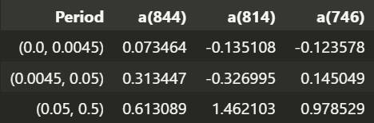

# 20240928 Group Meeting

## Unstability of Fourier

我选择了 market factor 进行分析，选取了从 2016-01-01 至 2019-06-28 所有的交易日数据，进行了如下分析。

- 选取三个不同的数据长度，844，814，746
- 进行傅里叶分解并计算不同区间内的占比情况

为了研究 **当样本点仅有微小变化时，频率计算的结果是否会有很大差异**，也就是频率分解结果的稳定性，结果如下

可以看到，在两种频率 bins 的划分下，**结果均十分之不稳定**。

问题可能来自于以下几个方面：

- **边界效应**

边界点对于频率的结果影响很大，这在现有文献中属于 well-knowned。

- 非平稳性
- 随机噪声

实际上，在进行频率分解前，我已经进行了三天均值处理，所以噪声问题在一定程度上得到了缓解，这个问题的最可能是边界效应导致的估计偏差。

对于边界问题，实际上在之前的研究过程中我已经研究过了，但是并不适用于我们所面临的问题，这是因为，根据 FDR 这篇文章，我们会选取股票收益率数据中非空的数据，与对应时间段内的市场因子计算协方差分解，那么我们并不知道具体缺失了哪一段，因此无法根据具体的情况进行加窗。

是我们希望计算两个收益率协方差的频率分解，流程上是首先计算每个收益率自身的傅里叶分解，然后共轭相乘，所以每个收益率序列估计的结果都十分重要，但是由于傅里叶分解结果的不稳定性，使得这些不同指标之间没有可比性。下图是按照 CSD 计算后得到的频率占比结果，同样十分不稳定。

如果我们想根据频率成分进行组合或者别的操作，前提是得到准确的频率成分，所以这一问题也转化为：**如何在存在缺失值的情况下，尽可能得到准确的频率成分**。

美股的 market 自身频率占比也不准，

但是美股的 Cov 分解结果很准，最终发现是代码出了问题。

## Periodogram

Periodogram 是 PSD 的（无偏但不一致）估计量，

$$
\begin{equation}
S_{xx}(f)=\int_{-\infty}^{\infty}R_{xx}(\tau)e^{-i2\pi f\tau}d\tau, \quad P_{xx}(f) = \frac{1}{N} X(f)X^* (f)
\end{equation}
$$

其中 $R_{xx}(\tau)$ 是自相关函数，$\tau$ 代表滞后期数，$P_{xx}(f)$ 代表 Periodogram。

> [!NOTE|label:Periodogram]
> 在实际应用中，自相关函数的估计可能会不稳定，但是从 Periodogram 直接估计，就可以减少不稳定性的估计。 

同理，Cross Periodogram 是 CPSD 的估计量，正因为是**初步**的估计量，所以有很大的不稳定性，需要改进这一估计

$$
\begin{equation}
S_{xy}(f)=\int_{-\infty}^\infty R_{xy}(\tau)e^{-i2\pi f\tau}d\tau, \quad P_{xy}(f) = \frac{1}{N} X(f)Y^* (f)
\end{equation}
$$

### Exponential

以下推导过程是有关 Periodogram 估计改进的方法，可以为 Cross Periodogram 提供参考。

$$
P_{xx}(f) = \frac{1}{N} (\Re(X(f))^2 + \Im (X(f))^2)
$$

对于一个平稳的高斯时间序列，傅里叶变换后的实部和虚部都是独立同分布的高斯随机变量，均值为零，方差为 $\sigma^2$，因此傅里叶变换的实部和虚部的平方和服从自由度为 2 的卡方分布，

$$
\Re(X(f))^2 + \Im (X(f))^2 \sim \chi_2^2
$$

由于自由度为 2 的卡方分布等价于指数分布，所以周期图 $P_{xx}(f)$ 的每个频率分量服从参数为 $S_{xx}(f) / 2$ 的指数分布：

$$
P_{xx}(f) \sim\text{Exponential}\left(\frac{S_{xx}(f)}2\right)
$$

