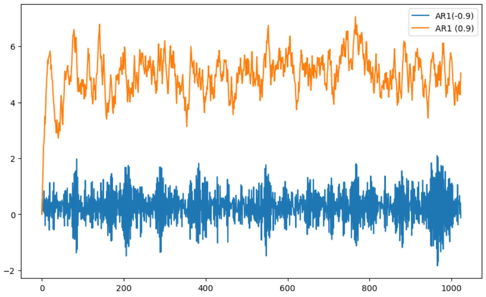
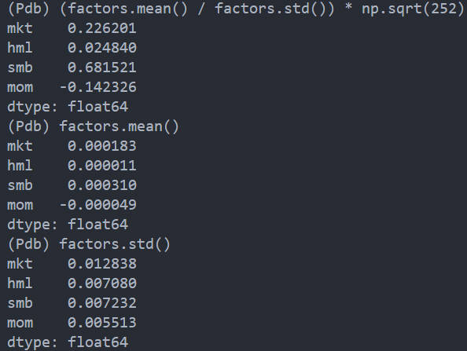
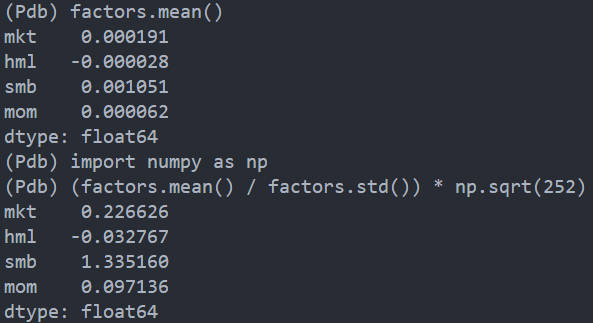
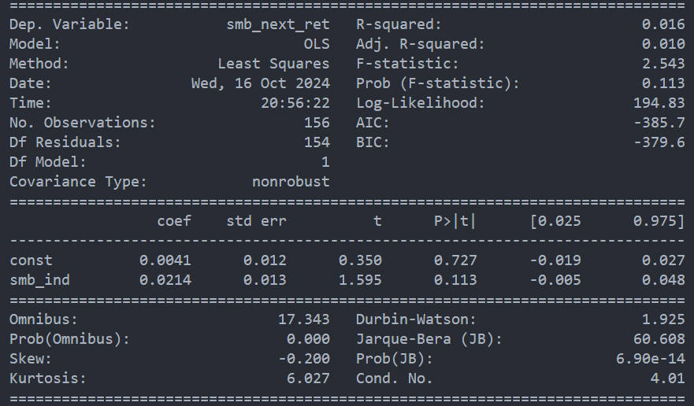

# 20241016 阶段工作总结

## 20241014

- 检查李煌师兄 mean-variance code。

- 因子工作收尾
    1. 李煌师兄更新了新版本的 cache，更加灵活，之前没有接触过，学习了李煌师兄的 cache 写法
    2. cache 在传入 MKT 时，原本写的是传入 self.ret_next : DataFrame，现在改成了 self.cache['ret_next'] : Dict
    3. 此外，还发现了当仅有一个datetime时，进行 groupby(DATETIME).apply(lambda x: self.get_weights(x)) 分组信息不正确，这是由两方面原因导致的：（1）对 DataFrame groupby 但是返回 Seires，（2）仅有一个 datetime，为了与框架保持一致，选择对 Series groupby 并返回 Series，修改了 MKT 的代码
    4. 框架合理性更改：get_weights 不需要进行 cache 
    5. 重新设计了 HXZ4 和 FF5 的框架，特别是 custom_cache_key 的部分
    6. 极简版因子与经典版因子框架有所不同，例如每个因子都要自行设置 custom_cache_key等等，已修改完成

本来今日的工作量是因子收尾和查代码，但是因子工作量超出我的预期，预计五个小时完成，结果花了十几个小时，不过一诺查出来了代码的问题，也算是一天的工作完成了。

## 20241015

- 检查 Mean-variance code，基于一诺检查出的结果，使得收益率序列和权重序列对应相乘，修正问题后跟李煌师兄的结果基本相似，但是 long-only 夏普比率基本一致，但收益率差了一倍，经检查，是 all_in = False 和 True 的区别。

- 解决了 git pull 时候会需要 merge master 的问题，使用 git reset --hard <newest commit id> 就可以了，但是导致这个问题的原因仍然不是很清楚。

- whittle likehood 和 Bayesian 的关系

从实部虚部的推导结果来看，周期图应该服从指数分布，接着，根据指数分布的似然函数，也就是 whittle likelihood，对 $\theta$ 进行估计，此时我们需要基于一个模型，接着估计模型参数 $\theta$。

$$
\begin{equation}
    \ln L_{\mathrm{Whittle}}(\theta)=\boldsymbol{-}\sum_{j=1}^{N}\left[\ln S(f_{j};\theta)+\frac{I(f_{j})}{S(f_{j}; \theta)}\right]
\end{equation}
$$

其中 $I(f_j)$ 是根据样本计算出的周期图，$S(f_j;\theta)$ 是基于参数的 PSD，举例来说，当模型为 AR1 $x_t = \phi x_{t-1} + \epsilon$ 时，其等于

$$
f(\omega;\theta)=\frac{\sigma^2}{|1-\phi e^{-i\omega}|^2}
$$

其中 $\sigma^2$ 和 $\phi$ 就是需要估计的参数。

这种分布的其中一个特点就是周期图是 PSD 的样本估计，因此周期图的均值理论上来说就是 PSD。通过似然函数计算出需要估计的参数，自然得到了 PSD。

所以估计流程是：

1. 给出估计模型
2. 计算出 $S(f_j; \theta)$
3. 从样本中计算 $I(f_j)$
4. 计算似然函数，估计出 $\theta$

但是这种估计方法中需要给出模型，这属于一种限制，并且使用 whittle likelihood 相当于隐含地假设了周期图服从指数分布。

在 Bayesian 那篇文章中，并没有将周期图建模为指数分布（**因而也没有使用 whittle likelihood**），而是直接将一个序列的每个频率上的周期图建模为了多个高斯分布的累加，

$$
\begin{equation}
\begin{aligned}y_{j}\mid\boldsymbol{\theta}&\overset{{\mathrm{ind.}}}{\operatorname*{\operatorname*{\operatorname*{\sim}}}}\sum_{k=1}^{K}g_{k}(\omega_{j};\boldsymbol{\xi})\operatorname{N}(y_{j}\mid\alpha_{k}+\beta_{k}\omega_{j}/\pi,\sigma^{2}),\\j&=1,\ldots,N,\end{aligned}
\end{equation}
$$

- $g_k(\omega_j;\boldsymbol{\xi})$ 是第 $k$ 个高斯分布的权重

周期图背后分布的均值仍然等于 PSD:

$$
\begin{equation}
    \log(f(\omega_j))=\sum_{k=1}^Kg_k(\omega_j;\xi)\left\{\alpha_k+\beta_k\omega/\pi\right\},\quad\omega\in(0,1),
\end{equation}
$$

*所以贝叶斯的角度是无法与 Whittle likelihood 联系起来的。*

文章作者也说明了，仅仅使用了均值的特性：

> *We use the Whittle approximation in the frequency domain, albeit only to the extent that the expectation of $\log(I_n(\omega))$ is, up to a constant, equal to $\log f(\omega)$.*

## 20241016

- Periodogram 和 factor momentum 的关系

尽管无法与 likelihood 联系起来，但是 Bayesian 的方法可以根据多个时间序列的频率成分将其分为不同的组，例如 size 和 hml 可能被因为一组，因为其具有相同的低频成分，诸如此类。

在不同频率上的功率大小，与自相关性有关。例如，当自相关系数 $\phi$ 趋近于 1 时，低频成分功率占比会比较大，反之，当自相关系数 $\phi$ 接近于 -1 时，则高频的成分功率占主导。

Momentum 中 Time Series Momentum strategy 就是完全通过自相关性得出的策略。

> A time-series momentum strategy, which is long factors with positive returns and short those with negative returns. A cross-sectional strategy, which is long factors with above-median returns and short those with below-median returns. 
>
> **The time-series strategy outperforms the cross-sectional strategy because it is a pure bet on autocorrelations in factor returns**. A cross-sectional strategy, by contrast, also bets that a high return on a factor predicts low returns on the other factors.

Frequency 和 TS momentum 的结合能够给 TS momentum 带来什么效果？

- Autocorrelation and PSD

自相关性如何和能量联系起来？

我 generate 了两条长度为 1000 AR1 时间序列，自相关系数分别是 0.9 和 -0.9，图像如下

二者的低频（周期在一年以上）的功率取值和占比如下

|            | PSD in Low | PSD ratio |
| ---------- | ---------- | --------- |
| AR1 (0.9)  | 73.75      | 0.15      |
| AR1 (-0.9) | 0.062      | 0.00015   |

- Momentum empirical

从 2010-01-01 到 2024-01-01 的结果表明，经典版 momentum 确实没什么效果。

在极简版中 SMB 得到了增强，MOM 也实现了由负变正，不过还是没什么效果。

仿照 factor momentum and momentum factor 的做法，test Size 的自相关性，自相关性并不是特别强。

## TODO

- coskewness
- 解决因子代码权重问题，这个等和老师开完会，再想办法解决

