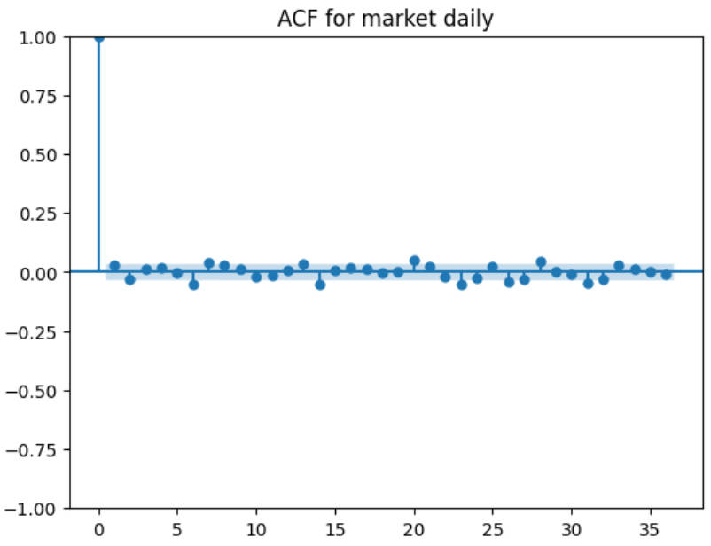
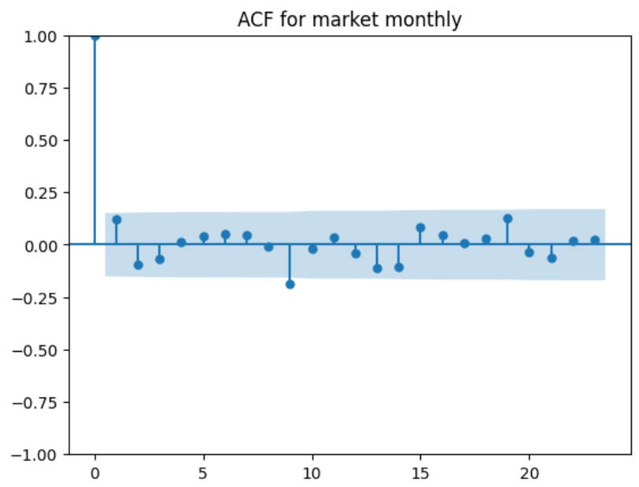
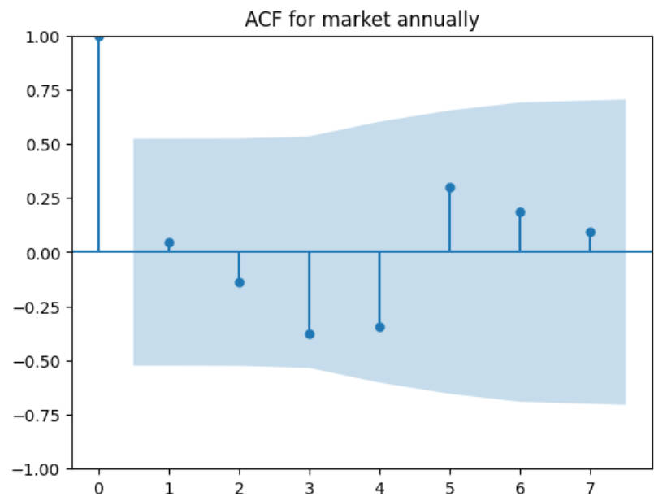
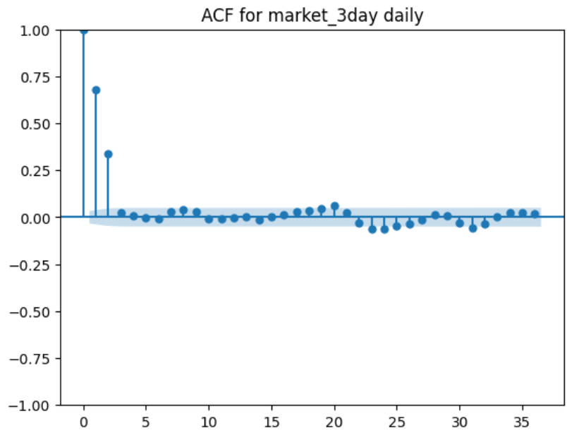
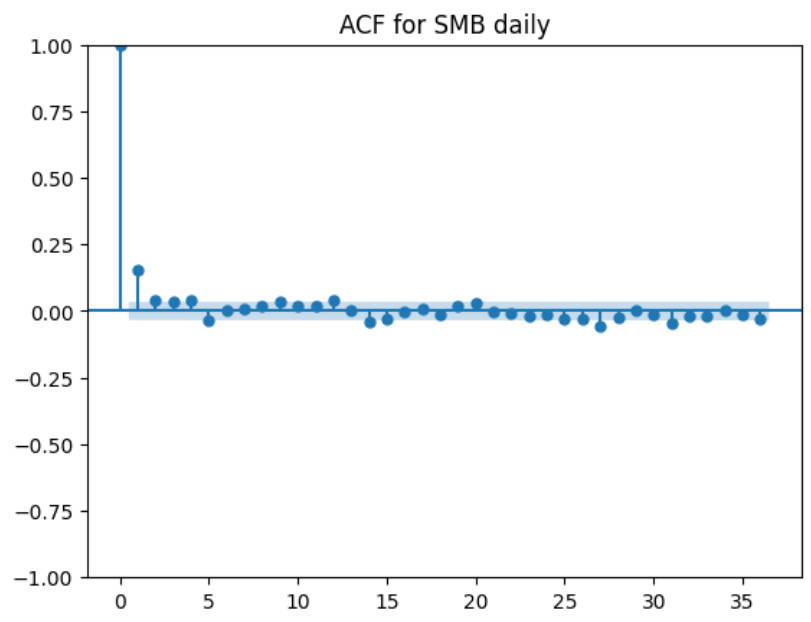
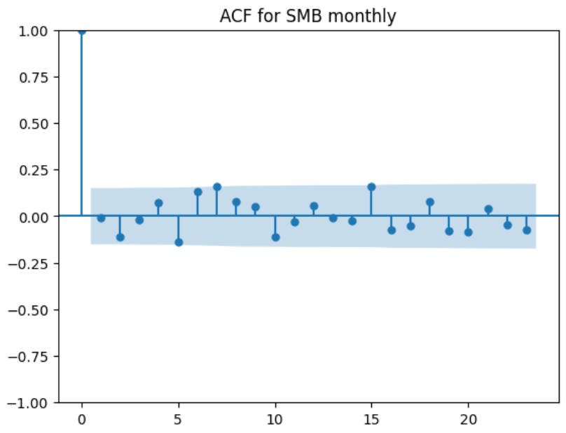
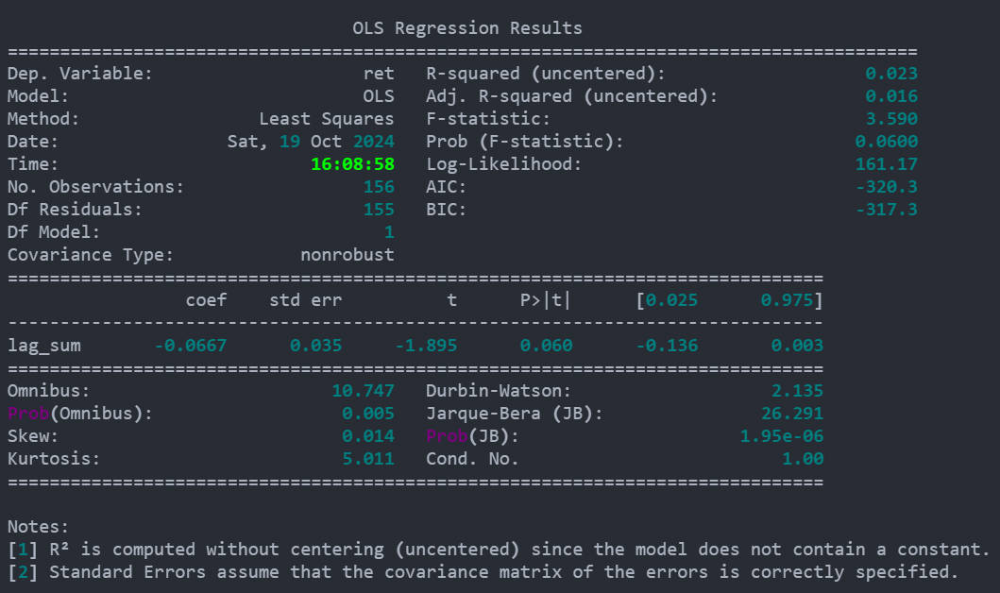
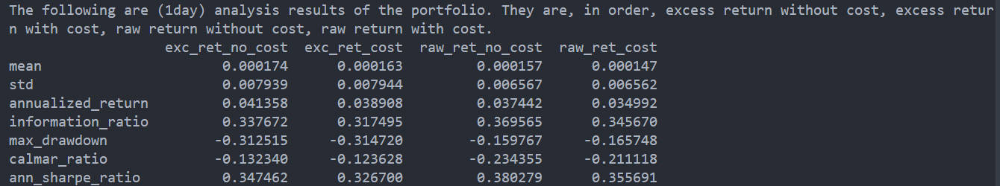
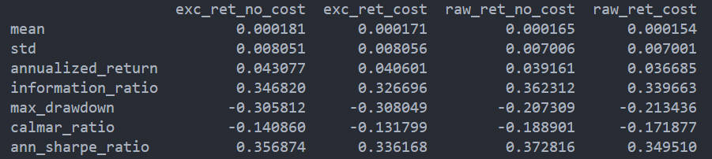

# 20241020 阶段工作总结

## 20241017

### Meeting 

未来的研究任务包括：

1. 测试 market 自相关阶数，日频，月频
2. 对比 whittle likelihood 和动量回归的结果
3. 动量增强，选取动量回归显著的股票再做动量，看是否显著
4. coskewness，阅读，分解

### factor weights

要点如下

1. 因子中并非所有的股票都有权重，没有涉及因子构建的股票，权重为 nan
2. 权重每天变化，但是是以调仓日为节点进行变化，所以在算 portfolio return 的时候获取
3. 极简版因子可能与经典版因子有区别，可能需要特殊处理
4. 在最终保存的时候，与 managed portfolio 格式相仿，index 为 muiti-index (datetime, instruments)，columns 为 factor name
5. 需要实现只给一个因子也要给出对应权重的功能

## 20241018

### factor weights

1. factor return 计算流程是先计算出不同 portfolio 的 return，最后再根据 long group 和 short group 相减，所以很难实现仅仅选出 long group 和 short group 需要的信息，所以只能存取下全部的 group weights 信息，在最后进行 concat
2. 在 get_port_returns_weights_between_rebalance 函数中会先计算出 instrument 净值，其实净值就能代表每天的权重，只需要再标准化一下就好
3. get_port_returns_weights_between_rebalance 现在返回值改为了两个，不能再使用 apply 函数，而是需要 for loop + multiprocessing
4. 还有一个问题在于，因为是对 DATATIME 和 GROUP 双层 groupby，因此返回值中存在两种情况，index 相同，seires.name 不同，以及 series.name 相同，但是 index 不同，因此需要特别处理 concat，写了一个函数 _concat_series
5. 做了运行运行效率的对比，目前使用 _concat_series 效率还算比较高，看看有没有更快的方法。

身体不太舒服，今天应该写不完了。

## 20241019 

### 测试 market 自相关阶数，日频月频分别 test

下图是用 from statsmodels.graphics.tsaplots import plot_acf 画出来的 ACF，蓝色阴影区域代表 95% 置信区间。

不管是日频、月频还是年频，都没什么相关性。

不过在 test 的过程中，我倒是发现了三天均值的影响，以日频为例，当进行三天平滑的时候，就会在原本没有自相关性的情况下，**人为**制造出 lag = 1 & 2 的相关性，并且一定是 positive 的相关性，这样也就增强了低频的作用。

### 对比 whittle likelihood 和动量回归的结果

以 SMB 为例，SMB 的自相关性如下，在日频情况下倒是发现了一定的相关性，但是在月频下则没有。

月频结果如下：

接着就以 SMB daily 为例，看看两种估计方法的差别

在 AR1 的例子下，二者估计出的自回归系数 $\phi$ 是非常接近的，但是 $\sigma^2$ 总是差了二倍，原因有待查明。

|         | phi    | sigma2   |
| ------- | ------ | -------- |
| AR1     | 0.1552 | 0.000069 |
| whittle | 0.1561 | 0.000138 |

这是 daily SMB 的结果，如果要对比动量策略，流程如下，对每一支股票

$$
\dot{R}_{i,t} = \phi(\dot{R}_{i,t-2} + \dot{R}_{i,t-3} \cdots + \dot{R}_{i,t-12}) + \epsilon_{i,t}
$$

其中 $\dot{R}_{i,t} = R_{i,t} - \bar{R}_t$。

1. 动量策略，通过回归实现，将 $t$ 期月频收益率回归到 $t-12 \sim t-2$ 的收益率加和上，得到自回归系数
2. whittle likelihood，进行 whittle 估计时，需要施加限制，所有的滞后项前的自回归一致

以 SH600000 为例，二者对比结果如下

动量策略

回归结果比较显著，不过是负向的。

> [!TIP|label:PSD in AR1 and AR11]
> 在 AR1 中，理论谱密度为
$$
f(\omega;\theta)=\frac{\sigma^2}{|1-\phi e^{-i\omega}|^2}
$$
> 在 AR11 中，当滞后阶数 $\phi$ 一样时，理论谱密度为
$$
f(\omega;\theta)=\frac{\sigma^2}{|1-\phi \sum_{k=2}^{12}e^{-i\omega k}|^2}
$$
> 

而此时 whittle 方法估计出的结果甚至是正的，大约在 0.03，相差很大。

我还对比了在没有进行截面均值处理情况下的估计，也相差很大，并且在此时，时序回归估计不显著。

> 原因可能是，这种相当于强行限制了自相关的效果，会有所偏差。

### 动量增强，选取动量回归显著的股票再做动量

按照上述回归的结果，可能出现两种回归结果，要分开考虑。首先我们选取回归系数显著的股票，$t >= 2$，其次

1. 回归系数为正，则代表过去的收益率加和对未来有预测效应，权重不变
2. 回归系数为负，则代表过去的收益率加和对未来有负向的预测效应，权重 $\times -1$

这种策略的 **long-only** 结果如下，所有股票等权（按照 score 加权的也做了，没什么区别）

但是我又想了想，从动量策略的角度出发，本来也不能保证全部的回归系数都是正的，我只需要挑出其中显著的部分，进行估计就可以了，这样的等权结果为

只能说大差不差了。不过相比于原本动量毫无效果，这已经算是还可以了。

## 20241020

- check frequency covariance code

这次小于 4 个月的周期都为高频，4 个月至一年为中频，一年以上为高频

Yolo all

| Yolo_All | Long_O | Long_S |
| -------- | ------ | ------ |
| Low      | 0.234  | 0.608  |
| Middle   | 0.082  | -0.262 |
| High     | 0.140  | -0.100 |

HS300 

| HS300  | Long_O   | Long_S |
| ------ | -------- | ------ |
| Low    | 0.272    | 0.034  |
| Middle | 0.051    | -0.519 |
| High   | **0.56** | 0.05   |

CSI1000

| Yolo_All | Long_O | Long_S |
| -------- | ------ | ------ |
| Low      | 0.315  | 0.787  |
| Middle   | 0.213  | 0.382  |
| High     | -0.137 | -0.674 |

> 整体来看，效果都不太好。不过老师说 coskewness 还可以，下周试一下。

## TODO

- factor weights

- Coskewnesss

