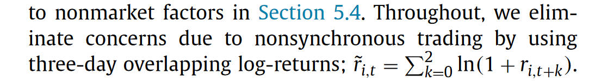
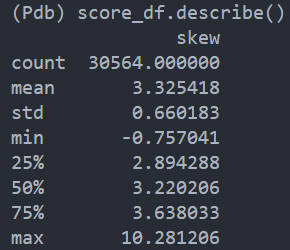
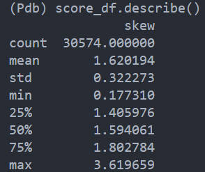

# 20241020 阶段工作总结

## 20241021

###  factor weights

- 框架基本修改完成
- 优化 weights 计算逻辑，大幅提高了运行效率
- 在 FF5 中，计算 weights 时，由于数据不一致，因此会存在同一只股票在 size_hml 中有权重，但是在 size_rmw 中没有权重的情况，这时候需要特殊处理，将权重 sum 后除 3
- MKT 也修改为并行
- 极简版因子修改完成
  
已上传，等待李煌师兄审核。

## 20241022

### Max CPSD

- 最初的想法是：不可能所有频率都是有用的，那么如何选出其中有用的部分呢？

最开始，我从 CPSD 的平均值出发，意思是，频率 1 有功率 $S_{yx}(f_1)$，频率 2 有功率 $S_{yx}(f_2)$，当噪音频率被加入，那么功率的平均值 $\frac{1}{2}(S_{yx}(f_1) + S_{yx}(f_2))$ 就会越来越小。但是在实际操作中不能以最大平均功率为优化目标，这样的话就只会选择最大功率的频率。

所以为了实现这一想法，我尝试了删去平均值以下的频率：首先计算出所有频率的 CPSD，然后计算 CPSD 均值，接着将均值以下的频率 CPSD 取值设为 0，接着再计算不同频率范围内的协方差分解之类的。这样做的效果并不好。

接着思考，噪音频率的 CPSD，一般来说比较小，而信号频率的 CPSD，一般比较大，那么如果画出 CPSD 的分布，应该会呈现出一定程度上的偏度，那么我计算 CPSD 的偏度，偏度越大，则说明资产和 MKT 在某一频率内的成分越强，越可能代表信号，反之则没什么信号。

这样做的效果还行，夏普比率从 0 提升到了 0.4 左右。

### What CPSD means?

不过继续思考下去，又有些不太对，问题在于，之前的研究发现 市场并没有自相关性（日频、月频、年频），也就是没有显著的频率成分，那么资产和市场计算出的 CPSD 代表什么呢？

Frequency dependent risk 那篇文章做了三天的平均处理

之前讲过，这种做法会人造出低频的相关性，数据也显示，这样操作后，会使得低频内的 CPSD 提高，偏度增加

three day

no three day

**核心问题**在于：CPSD 反应的是某一频率内，两个时间序列的相干性，如果二者都具有低频成分，那么低频的 CPSD 就会比较大。但是，如果市场根本就不存在低频成分，那么如果低频的 CPSD $S_{yx}(f_{\text{low}})$ 比较大，这代表什么？

回到最初的公式

$$
\begin{equation}
    R_{yx}(\tau) = \int_{-\pi}^{\pi} S_{yx} (f)e^{i 2\pi f \tau}df
\end{equation}
$$

当 $\tau =0$，有

$$
\begin{equation}
    R_{yx}(0) = \int_{-\pi}^{\pi} S_{yx} (f)df
\end{equation}
$$

$R_{yx}(0)$ 就是协方差，协方差是同期的解释程度，回到因子模型的角度来看，即使 MKT 没有低频成分，但是在同期，MKT 仍然能够解释资产，这个解释的过程包含低频和高频两个方面，该如何理解？

或者这么说，即使两个资产和市场的协方差相同，但是一个主要是由 $S_{yx}(f_{\text{low}})$ 贡献，一个是由 $S_{yx}(f_{\text{High}})$ 贡献，他们的区别应该是什么。

如果从自相关函数的角度思考，就有点想不明白了

$$
\begin{equation}
S_{yx}(f) = \int_{-\infty}^{\infty}R_{yx}(\tau)e^{-i2\pi f\tau}d\tau 
\end{equation}
$$

难道是因为 $R_{yx}(\tau)$ 呈现出了不同的周期性？

## 20241023

### Frequency dependent risk

对于时间序列回归 $y_t = \beta x_t + \epsilon_t$，取均值得 $ E[y_t] = \beta E[x_t]$，如果对 $x$ 和 $y$ 计算 CPSD，因为当 $\tau =0$，有

$$
    R_{yx}(0) = \int_{-\pi}^{\pi} S_{yx} (f)df
$$

这样就可以把 $y$ 的均值分解到不同频率上

$$
E[y_t](f) = \beta E[x_t] \times \frac{S_{yx}(f)}{R_{yx}(0)}
$$

但是均值这一概念跟频率实际上没什么关系，所以将均值分解到不同频率上的意义是什么。

这一概念的意义就是风险乘上风险价格，得到风险溢价。

### Coskewness Empirical

- Positive skewness, compared to normal distribution, will have a greater possibility of small losses and large gains

- 这一部分没来得及做，明天做一下。

