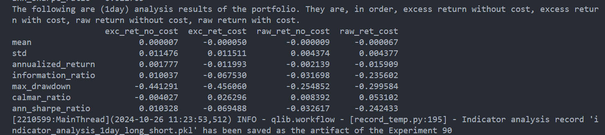
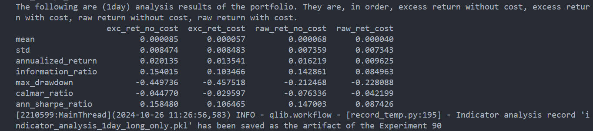
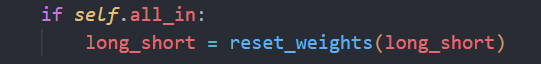

# 20241027 阶段工作总结

## 20241024

在傅里叶分解中，对一段时间序列的分解结果可以分为两类：零频率和其他频率。对于零频率，就是时间序列在时域上的均值信息，而其他频率则反映了序列的波动性。

这背后隐含的假设就是，均值信息在整个样本期内保持不变，在金融领域中的结合，可以表示为如下风险溢价关系（风险溢价不变）。

$$
\quad E[y_t] = \beta E[x_t]
$$

但是在现有的因子模型中，更倾向于使用 conditional asset pricing model，其中 $\beta_{t-1}$ 会是时变的，

$$
E[y_t] = \beta_{t-1} E[x_t]
$$

这也就是说明，在样本期 $T$ 内，资产收益率 $E[y_t]$ 应该是时变的。而如果时间序列的收益率均值是时变的，但是还依照原本的傅里叶方法去估计，就会出现问题。此时时变的均值信息，就会通过某种方式被分散到其他非零频率中。

时变的均值信息实际上十分重要，因为这就是最直接的收益率估计，我们可以通过 $E[x_t]$ 和 $\beta_{t-1}$ 得到 $E[y_t]$ 的序列，并且对其进行傅里叶分解得到频率信息。

此时的频率信息，相比于原来，噪音会更加少，这是因为

1. 原本的日频收益率序列中包含太多因为交易而产生的噪音
2. 而此时的日频收益率均值序列噪音会少很多，这是因为
   - $E[x_t]$ 是均值信息，噪音较少
   - $\beta_{t-1}$ 使用公司特征，噪音也会少，例如市值。

## 20241025

- coskewness

文章中的做法会 calculate coskewness of each frequency

two time series, 

- $ \epsilon_{i,t+1}  $ is the CAPM residual of each stock
- $\epsilon_{M,t+1} = (r_{M,t+1} - r_{f,t}) - \mu_M $, $\mu_M$ is its past 60-month average.

then calculate the skewness

$$
\hat{\beta}_{\text{SKD}_i}^{(j)} = \frac{E\left[ \epsilon_{i,t+1}^{(j)} \cdot \left( \epsilon_{M,t+1}^{(j)} \right)^2 \right]}{\sqrt{E\left[ \left( \epsilon_{i,t+1}^{(j)} \right)^2 \right] }E\left[ \left( \epsilon_{M,t+1}^{(j)} \right)^2 \right]}
$$

$j$ 表示 wold-decomposition 分解得到的频率，但是如果不用 wold-decomposition 的话，只能先计算对应频率的 $\epsilon$，然后计算 $\beta^j_{\text{SKD}}$。

后续使用是用得到的 $\beta_{\text{SKD}}^j$ 进行 Fama-Macbeth 回归，

$$
E[r_t] = \lambda \beta_{\text{SKD}}^j
$$

求 $\lambda$。那这个公式的意思就是 $\beta_{\text{SKD}}^j$ 越高，则期望收益率越高，那我们直接按照这个进行排序就可以了。

需要注意的点在于

1. 分母不再是分子的累加，而是对应频率的结果
2. 关于 market 的计算是先求频率再取平方，并且还有时序上的相乘，所以我觉得匹配的做法就是得到频率结果后，逆傅里叶变换到时序上，然后再进行操作。 

所以计算流程为，在每个月底

- 令每个资产与 market 进行回归，得到 $\epsilon_{i,t+1}$
- 接着计算 $\epsilon_{M,t+1}$
- 然后对二者进行滤波，得到对应频率的时序数据
- 计算 skewness
- 按照 $\beta_{\text{SKD}}^j$ 进行排序，long 前 20%，short 后 20%

结果相当之一般

不过我觉得频率处理的部分相差很大，也许换成 wold 会好一些。

## 20241026

在做 coskewness 的时候，我发现尽管输出的 score 是有值的，但是策略并不交易。

经检查是因为 all_in = False 以及输出的权重过小 $10^{-10}$ 导致的。

如果设置 all_in = False，那么应该保证输出的结果中就是权重，否则没办法标准化。

## TODO

- 尝试不同的天数平滑，A 股和美股都尝试一下
- 尝试复现 wold-decomposition
- 通过 wold-decomposition 计算 Coskewness，两种做法分别尝试
- 阅读 spectral factor models，把高频和低频的作用想清楚
  
频率就代表着周期，我们试图从时间序列中获取周期信息，并且探寻不同周期信息的含义。

周期信息该是存在的，不论是从我们熟知的经济周期，或是牛熊轮回，周期信息一定会有一些用处，并且现有的频率论文也足以说明其中的作用。

周期信息可以与不同的概念相结合，如自相关性，如动量，需要将这些概念有机的结合起来。并且，在实践过程中，会有数据的信噪比问题，这一点也需要特别的处理。

