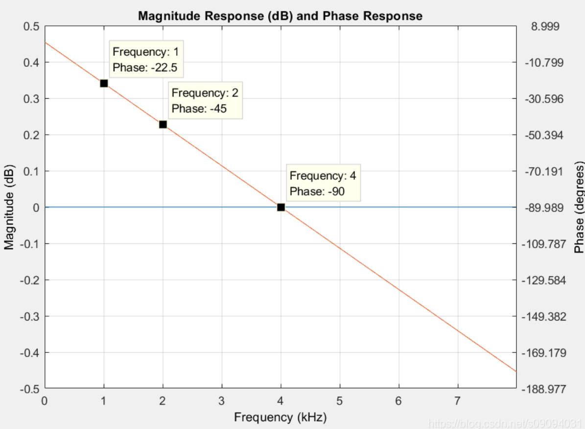
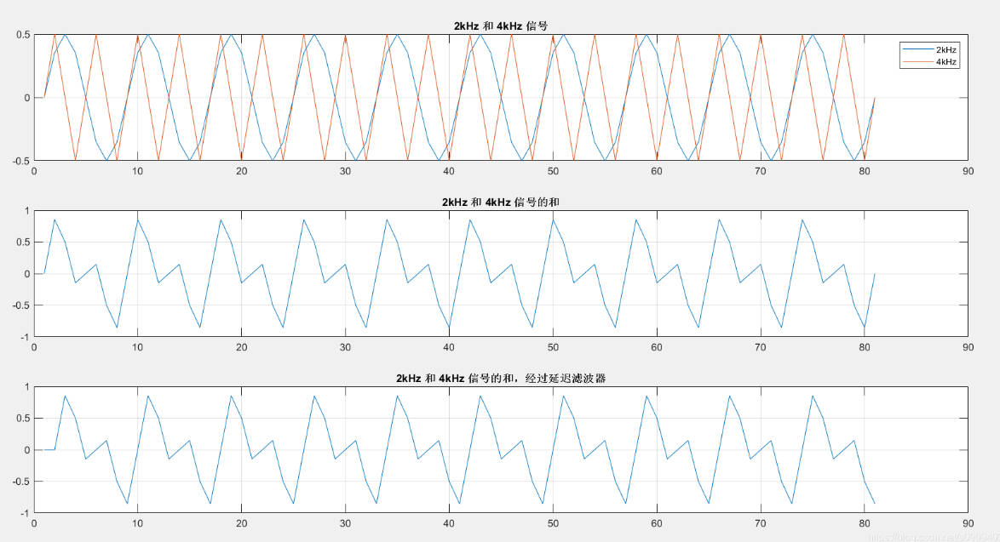
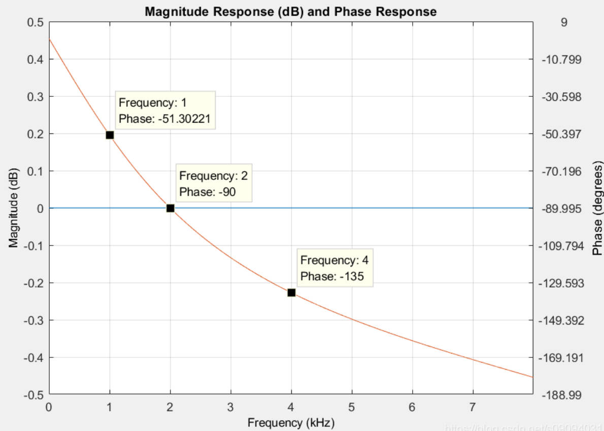
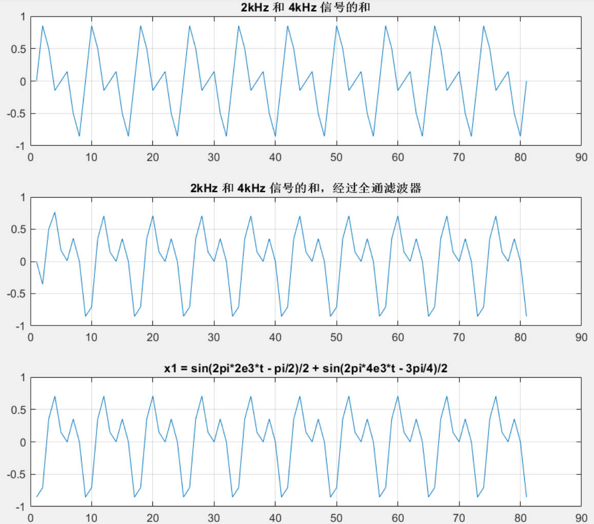
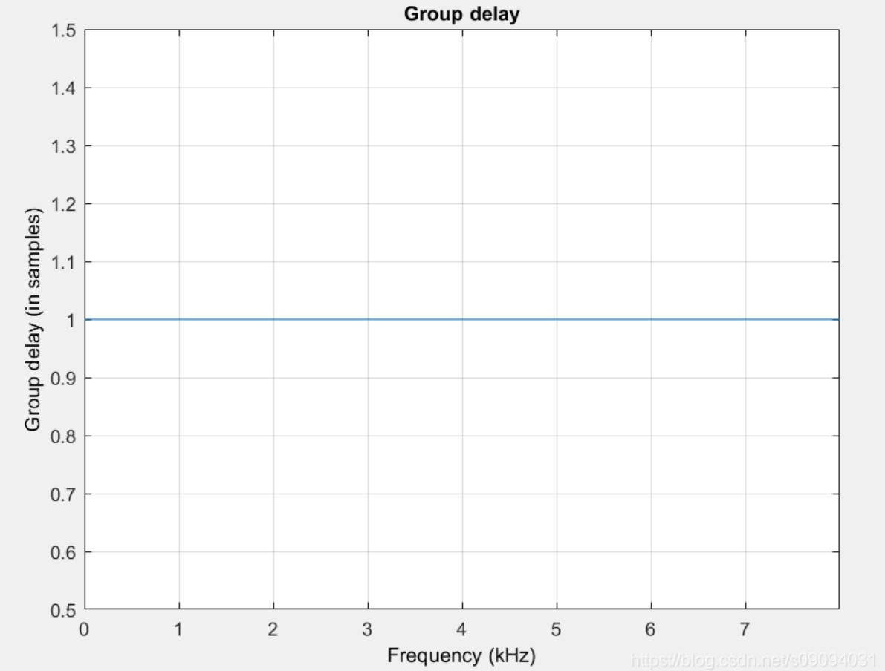
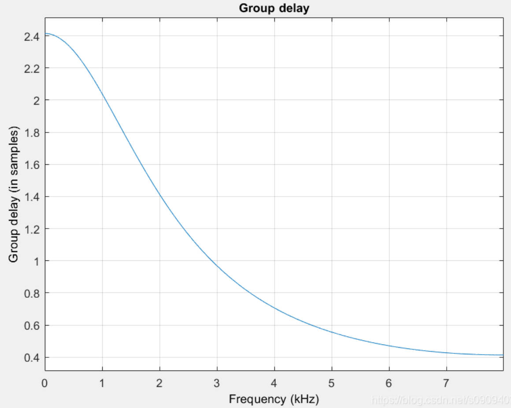

# 20241030 阶段工作总结

## 20241028

### Different Smooth in A shares

|      | Long-short | Long-only |
| ---- | ---------- | --------- |
| S5   | 0.479      | 0.198     |
| S10  | 0.504      | 0.248     |
| S20  | 0.745      | 0.210     |
| S60  | 0.191      | 0.173     |
| S120 | 0.427      | 0.064     |

不过这一部分的分析，还可以进一步加强，下面的分析更加重要。

### The meaning of Smooth

> 这部分的内容是在小车的帮助下所取得的进展。通过数学证明的方式得出了结论：就是当三天平滑时，并不会额外引入低频信息，而是低频振幅信息大概保持不变，高频成分振幅会被衰减。低频成分的相位不受影响，但是高频成分的相位会发生跳变。
> 
> 解决了之前的疑问：平滑会造成自相关性，从而引入低频？

DFT 的公式为

$$
X[k]=\sum_{n=0}^{N-1}x[n]e^{-j\frac{2\pi}Nkn},\quad k=0,1,\ldots,N-1
$$

通过矩阵来表示，有

$$
\mathbf{X}=\mathbf{W}\cdot\mathbf{x}
$$

其中

- $\mathbf{x}$ 是输入向量的信号表示 $\mathbf{x}=[x[0],x[1],\ldots,x[N-1]]^T$
- $\mathbf{X}$ 是傅里叶变换结果的向量表示 $\mathbf{X}=[X[0],X[1],\ldots,X[N-1]]^T$
- $\mathbf{W}$ 是 $N \times N$ 的傅里叶矩阵，其元素定义为 $\mathbf{W}_{k,n}=e^{-j\frac{2\pi}Nkn}$

具体写出来就是

$$
\mathbf{W}=\begin{bmatrix}1&1&1&\cdots&1\\1&e^{{-j\frac{2\pi}{N}1}}&e^{{-j\frac{2\pi}{N}2}}&\cdots&e^{{-j\frac{2\pi}{N}(N-1)}}\\1&e^{{-j\frac{2\pi}{N}2}}&e^{{-j\frac{2\pi}{N}4}}&\cdots&e^{{-j\frac{2\pi}{N}2(N-1)}}\\\varvdots&\varvdots&\varvdots&\ddots&\varvdots\\1&e^{{-j\frac{2\pi}{N}(N-1)}}&e^{{-j\frac{2\pi}{N}2(N-1)}}&\cdots&e^{{-j\frac{2\pi}{N}(N-1)^{2}}}\end{bmatrix}
$$

如果要是对收益率进行均值处理，例如，三天，那么就相当于对收益率向量进行卷积操作，矩阵形式可以表示为

$$
\mathbf{H}=\frac{1}{3}\begin{bmatrix}1&0&0&0&\cdots&0\\1&1&0&0&\cdots&0\\1&1&1&0&\cdots&0\\0&1&1&1&\cdots&0\\\varvdots&\varvdots&\varvdots&\varvdots&\ddots&\varvdots\\0&\cdots&0&1&1&1\end{bmatrix}
$$

平滑后的向量表示为

$$
\mathbf{x}_{\text{smooth}} = \mathbf{H} \cdot \mathbf{x}
$$

此时 $x_{\text{smooth}}$ 为

- $x_{\text{smooth,1}} = \frac{1}{3} x_1 $
- $x_{\text{smooth,2}} = \frac{1}{3} (x_1 + x_2) $
- $x_{\text{smooth,1}} = \frac{1}{3} (x_1 + x_2 + x_3) $
- $x_{\text{smooth,N}} = \frac{1}{3} (x_{N-2}+x_{N-1}+x_{N}) $

因为 $\mathbf{X} = \mathbf{W} \mathbf{x}$，所以可以写为

$$
\mathbf{X}_{\text{smooth}} = \mathbf{W}\mathbf{H}\mathbf{W}^{-1} \mathbf{X}
$$

令 $\mathbf{F} = \mathbf{W}\mathbf{H}\mathbf{W}^{-1} $，因此平滑后的频率成分为

$$
\mathbf{X}_{\text{smooth}} = \mathbf{F} \mathbf{X}
$$

为了计算 $\mathbf{F}$，我们需要求出 $\mathbf{H}$ 在频域的表示。

首先，注意到 $\mathbf{H}$ 可以视为卷积操作的矩阵表示，其对应的卷积核为

$$
\mathbf{h} = \frac{1}{3}[1,1,1,0\cdots,0]^T
$$

在离散信号处理中，卷积操作可以表示为矩阵乘法，其中卷积矩阵是一个 Toeplitz 矩阵。为了简化计算，可以将 $\mathbf{h}$ 扩展为一个**循环卷积矩阵**，用循环矩阵 $\mathbf{C}$ 来近似 $\mathbf{H}$ 的作用，**因为循环卷积矩阵可以被对角化**。

循环矩阵 $\mathbf{C}$ 可以被傅里叶矩阵对角化为

$$
\mathbf{C} = \mathbf{W}^{-1} \mathbf{\Lambda} \mathbf{W}
$$

其中，对于

$$
\mathbf{C} = \begin{bmatrix}
c_0 & c_{N-1} & c_{N-2} & \cdots & c_2 & c_1 \\
c_1 & c_0 & c_{N-1} & \cdots & c_3 & c_2 \\
c_2 & c_1 & c_0 & \cdots & c_4 & c_3 \\
\vdots & \vdots & \vdots & \ddots & \vdots & \vdots \\
c_{N-1} & c_{N-2} & c_{N-3} & \cdots & c_1 & c_0
\end{bmatrix}
$$

其中 $\mathbf{\Lambda}$ 是一个对角矩阵，其对角元素为滤波器的频率响应 $H[k]$。

滤波器的频率响应为

$$
H[k] = \sum_{n=0}^{N-1} h[n] e^{-j \frac{2 \pi}{N} k n}
$$

由于 $h[n]$ 只有前三项非零，计算得到

$$
H[k] = \frac{1}{3} \left( 1 + e^{-j \frac{2 \pi}{N} k} + e^{-j \frac{4 \pi}{N} k} \right)
$$

由于 $\mathbf{C}$ 可以被对角化为 $\mathbf{C} = \mathbf{W}^{-1} \mathbf{\Lambda} \mathbf{W}$，则有

$$
\mathbf{F} \approx \mathbf{W} \mathbf{C} \mathbf{W}^{-1} = \mathbf{\Lambda}
$$

> 这一步用循环矩阵近似 Toeplitz 矩阵 $\mathbf{H}$，在首尾的部分会有很小一部分的未来信息问题，但是首先是只涉及一两天，其次，如果我们认为分析的时间序列是有周期的，那么这样也 make sense。

因此 $\mathbf{F}$ 是一个对角矩阵，其元素为 $H[k]$。

最终，平滑后的频率成分为：

$$
\mathbf{X}_{\text{smooth}} = \mathbf{F} \mathbf{X} = \mathbf{\Lambda}\mathbf{X}
$$

**这表明平滑操作在频域上等价于对每个频率分量乘以对应的 $H[k]$。**

#### 高频和低频成分的区别 <!-- {docsify-ignore} -->

**振幅**

从振幅的角度来说，$H[k]$ 的振幅为

$$
|H[k]| = \frac{1}{3} \left| 1 + 2 \cos \left( \frac{2 \pi}{N} k \right) \right|
$$

从振幅中可以看出，当频率 $k$ 较小时，$|H[k]| \approx 3$，**表示低频近乎不受影响**。 同理，当频率 $k$ 较大时，$|H[k]| \approx \frac{1}{3}$，表明高频的信号衰减。

**相位**

$$
\angle H[k] = -\frac{2\pi}{N} k + \tan^{-1} \left( \frac{\sin\left(\frac{2\pi k}{N}\right)}{1 + \cos\left(\frac{2\pi k}{N}\right)} \right)
$$

从相位的角度，可以看出低频的相位几乎不受影响，但是高频的相位会受影响。

> 这一部分的分析详见 20241030。

> [!TIP|label:Derivation]
> 由于三天平滑，$h[n]$ 在 $n\geq 3$ 时为零，所以对于任何频率，求和仅在 $n=0,1,2$ 处有非零项，
$$
H[k]=\sum_{n=0}^2h[n]e^{-j\omega n}=\frac13\left(e^{-j\omega\cdot0}+e^{-j\omega\cdot1}+e^{-j\omega\cdot2}\right)
$$
> 
> 通过 $|H[k]|^2=H[k]\cdot H^*[k]$ 计算，有
$$
|H[k]|^2=H[k]\cdot H^*[k]=\left(\frac13\right)^2\left(1+e^{-j\omega}+e^{-j2\omega}\right)\left(1+e^{j\omega}+e^{j2\omega}\right)
$$
> 展开计算得到
$$
|H[k]|^2=\left(\frac13\right)^2\left[3+2\left(e^{j\omega}+e^{-j\omega}\right)+\left(e^{j2\omega}+e^{-j2\omega}\right)\right]
$$
> 根据欧拉公式有
$$
|H[k]|^2=\left(\frac13\right)^2[3+4\cos\omega+2\cos2\omega]
$$ 
> 根据余弦二倍角公式 $\cos2\omega=2\cos^2\omega-1$ 简化后，有
$$
|H[k]|^2=\left(\frac13\right)^2\left(2\cos\omega+1\right)^2
$$
> 取平方根后，得到
$$
|H[k]|=\frac13|2\cos\omega+1| = \frac13\left|1+2\cos\left(\frac{2\pi}Nk\right)\right|
$$
> 

## 20241029

### Moving tradedays

bench代表原本的做法，每个月月底交易，数字代表下个月底几号交易，有一个特例是-1，代表这个月用上个月月底的权重交易，反过来说也就是推迟到了下个月月底。

daily

| daily | Long-short | Long-only |
| ----- | ---------- | --------- |
| bench | 2.798      | 0.686     |
| 3     | 2.838      | 0.709     |
| 5     | **2.949**  | **0.77**  |
| 10    | 2.866      | 0.758     |
| 12    | 2.761      | 0.747     |
| 15    | 2.503      | 0.706     |
| 20    | 2.225      | 0.629     |

monthly

| monthly | Long-short | Long-only |
| ------- | ---------- | --------- |
| bench   | **0.228**  | 0.361     |
| 3       | 0.091      | 0.377     |
| 5       | -0.043     | 0.416     |
| 10      | 0.007      | **0.417** |
| 12      | -0.067     | 0.416     |
| 15      | -0.012     | 0.402     |
| 20      | -0.120     | 0.349     |

daily ridge

| daily | Long-short | Long-only |
| ----- | ---------- | --------- |
| bench | 1.636      | 0.764     |
| 3     | 1.670      | 0.789     |
| 5     | 1.685      | 0.850     |
| 10    | **1.720**  | 0.857     |
| 12    | 1.700      | **0.86**  |
| 15    | 1.693      | 0.837     |
| 20    | 1.712      | 0.818     |

monthly ridge

| monthly | Long-short | Long-only |
| ------- | ---------- | --------- |
| bench   | 2.273      | 0.824     |
| 3       | 2.296      | 0.839     |
| 5       | 2.286      | **0.901** |
| 10      | 2.300      | 0.898     |
| 12      | 2.291      | 0.899     |
| 15      | 2.285      | 0.878     |
| 20      | **2.301**  | 0.845     |
| -1      | 2.078      | 0.783     |

## 20241030

### Smooth longer

**沿着 20241028 的分析，能不能说明当平滑天数逐渐增加时，高频成分在不断减小，低频成分大概不变？**

当平滑天数逐渐增加，通过余弦公式进行的推导适用性减弱了，此时，可使用长度为 $M$ 的移动平均滤波器进行分析，其冲激响应为

$$
h[n]=\frac1M,\quad n=0,1,2,\ldots,M-1;\quad h[n]=0,\quad n\geq M
$$

滤波器的频率响应为

$$
H(\omega)=\sum_{n=0}^{M-1}h[n]e^{-j\omega n}=\frac1M\sum_{n=0}^{M-1}e^{-j\omega n}
$$

这是一个首项为 1，公比为 $e^{-j \omega}$ 的等比数列，其和为

$$
H(\omega)=\frac1M\cdot\frac{1-e^{-jM\omega}}{1-e^{-j\omega}}
$$

进一步简化，同样根据欧拉公式和三角函数，得到

$$
H(\omega)=\frac1M\cdot\frac{\sin\left(\frac{M\omega}2\right)}{\sin\left(\frac\omega2\right)}
\cdot e^{-j\omega\frac{M-1}2}$$

所以幅度响应为

$$
|H(\omega)|=\frac1M\cdot\left|\frac{\sin\left(\frac{M\omega}2\right)}{\sin\left(\frac\omega2\right)}\right|
$$

**振幅分析**

$$
\lim_{\omega\to0}|H(\omega)|=\frac1M\cdot\lim_{\omega\to0}\left|\frac{\sin\left(\frac{M\omega}2\right)}{\sin\left(\frac\omega2\right)}\right|=\frac1M\cdot\frac{\frac{M\omega}2}{\frac\omega2}=1
$$

因此低频部分仍然不会有太大影响，但是对于高频部分来说，分子 $\sin(\frac{M \omega}{2})$ 周期变短，零点更加密集，频率响应更频繁地降为零，高频部分被更强地衰减。

> [!NOTE|label:Consistency]
> 这一结果与 20241028 中的结果是否一致？
>
> 当 $M$ 等于 3 时，有
$$
\frac{\sin\left(\frac{3\omega}2\right)}{\sin\left(\frac\omega2\right)}=2\cos\omega+1
$$
> 所以完全一致。

**相位分析**

对于不同频率的波来说，延迟采样一个点，对于相位滞后的影响是不一样的，例如，对于 16 hz 的采样频率，如果信号的频率是 1 hz（即每秒一个完整的周期），那么在 1 hz 的一个周期内，有 16 个采样点，但是如果信号频率增加到 2 hz（即每秒两个完整的周期），那么在每一个 2 hz 信号的周期内，就只有 8 个采样点，因为信号的周期缩短了一半。

那么此时，如果滞后一个采样点，对于 1 hz 信号来说，滞后的角度（相位的变化）为

$$
\Delta\phi=\frac{360^\circ}{16}=22.5^\circ 
$$

但是对于 2 hz 信号来说，滞后一个采样点，相位滞后的角度为

$$
\Delta\phi=\frac{360^\circ}{8}=45^\circ 
$$

在 2 hz 信号的一个周期内，滞后一个采样点占整个周期的 $1/8$

关于相位的分析需要先从延迟滤波器看起，下图是两个不同频率的波 2kHz 和 4khz，如果延迟采样一个点两个信号之和的也会滞后

也就是说，**此时信号的各个频率成分之间的相位关系没有改变**。从这个例子中，可以很清楚的看出，线性相位指的是滤波器对每一个点的相频响应是一个线性关系。

但是对于非线性滤波器来说，不同频率的滞后不再是一个线性关系

此时滞后一个点，频率之间相位的关系就已经发生变化了，

相位延迟和群延迟，就是用来描述这种情况。

对于线性时不变输入系统，输入为

$$
x(t) = e^{iwt}
$$

输出为

$$
y(t) = H(i\omega) e^{i\omega t} = (|H(i\omega)| e^{i\phi(\omega)}) e^{i\omega t} = |H(i\omega)| e^{i(\phi(\omega) + \omega t)}
$$

其中线性系统的相频响应为 （arg 表示相位部分）

$$
\phi(\omega) = \arg\{H(i\omega)\}
$$

群延迟表示为

$$
\tau_g = -\frac{d\phi(\omega)}{d\omega}
$$

相位延迟表示为

$$
\tau_\phi = -\frac{\phi(\omega)}{\omega}
$$

群延迟是相位对频率的微分。如果群延迟不是一个常数，信号的各频率成分的相对相位关系将发生变化，从而产生相位失真。

上面两个例子的群延迟分别如下图所示

滤波器的频率响应 $H(\omega)$ 是一个复数函数，即

$$
H(\omega)=A(\omega)\cdot e^{j\phi(\omega)}
$$

其中 $A(\omega)$ 成为幅度响应，$\phi(\omega)$ 时相位响应，此时幅度响应可以为负数。

在我们的情况中，频率响应为：

$$
H(\omega)=\frac1M\cdot\frac{\sin\left(\frac{M\omega}2\right)}{\sin\left(\frac\omega2\right)}\cdot e^{-j\omega\frac{M-1}2}
$$

这里 $\frac1M\cdot\frac{\sin\left(\frac{M\omega}2\right)}{\sin\left(\frac\omega2\right)}$ 是一个实值函数，可能为正，也可能为负。

尽管实值函数没有虚部，但当它取负值时，它的相位会发生变化，具体来说，对于一个实数 $x$：

- 如果 $x > 0$，则 $\arg(x) =0$
- 如果 $x < 0$，则 $\arg(x) =\pi$

因此，当实值函数跨越零点，从正数变为负数或从负数变为正数时，相位会发生 $\pi$ 的跳变。

因此在计算 $H(\omega)$ 的相位时，必须考虑实值函数的符号变化，这意味着相位应该表示为

$$
\phi(\omega)=-\omega\frac{M-1}2+\arg\left\{\frac{\sin\left(\frac{M\omega}2\right)}{\sin\left(\frac\omega2\right)}\right\}
$$

当频率较小时，实值部分的极限为 $M$，而 $M$ 大于零，因此对于低频的影响较小，但是在高频部分会频繁地出现跳变。

不过，在 COV 的情况下，取实部时，有

$$
A_x A_m \cos(\theta_x - \theta_m)
$$

即使 $x$ 和 $m$ 都发生了跳变，但是因为都通过了相同的滤波器，跳变相减后并不影响，**主要的影响还是在于振幅部分**。

## TODO

- wold-decomposition
- 周频数据

