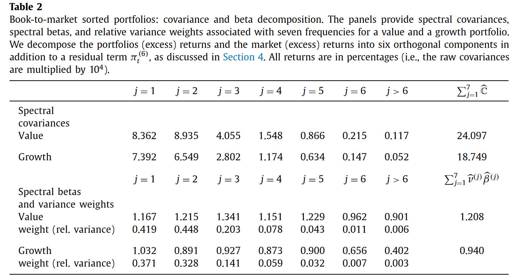
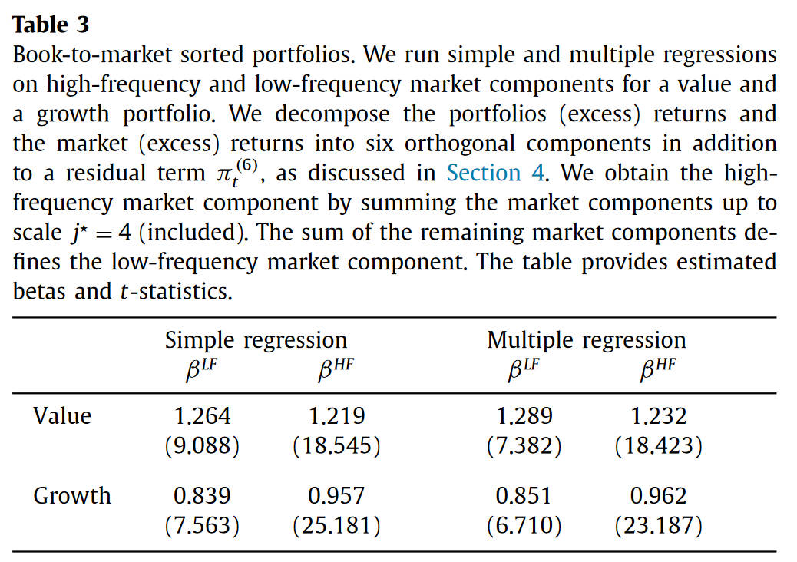
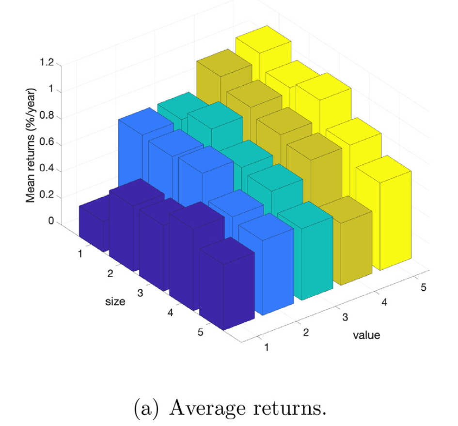
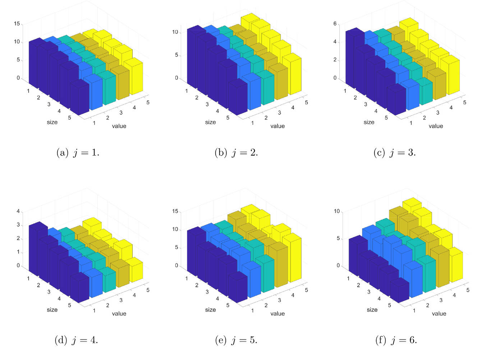
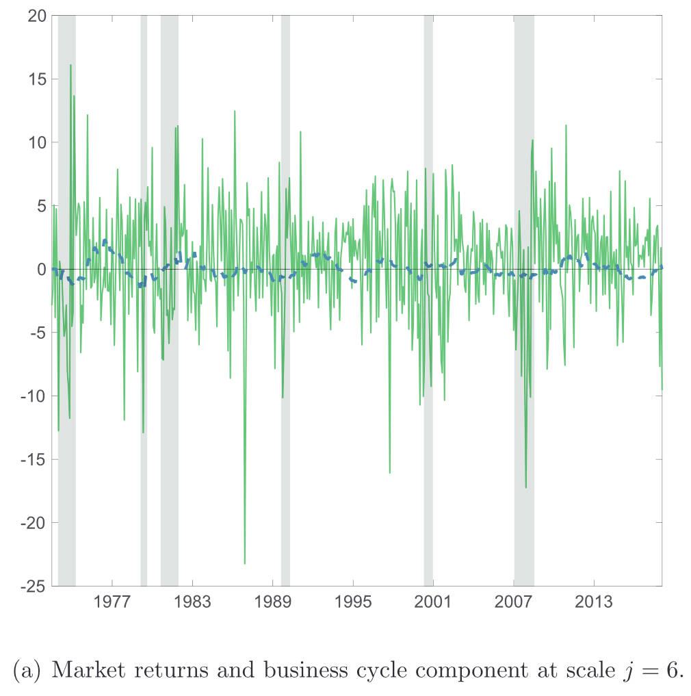
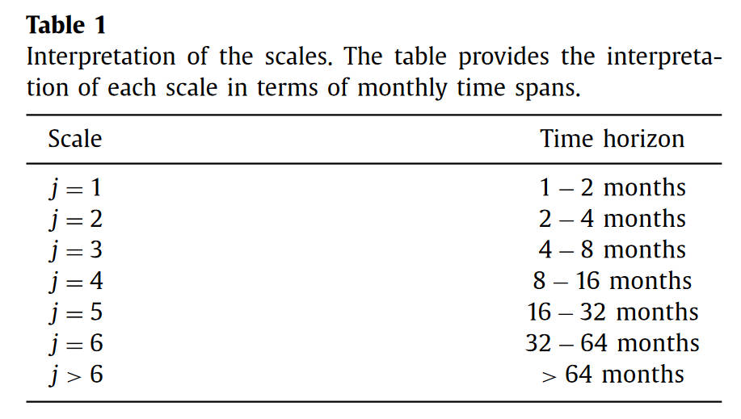
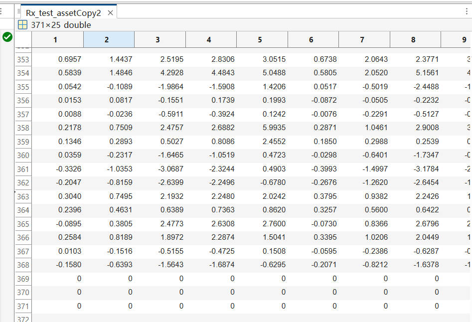
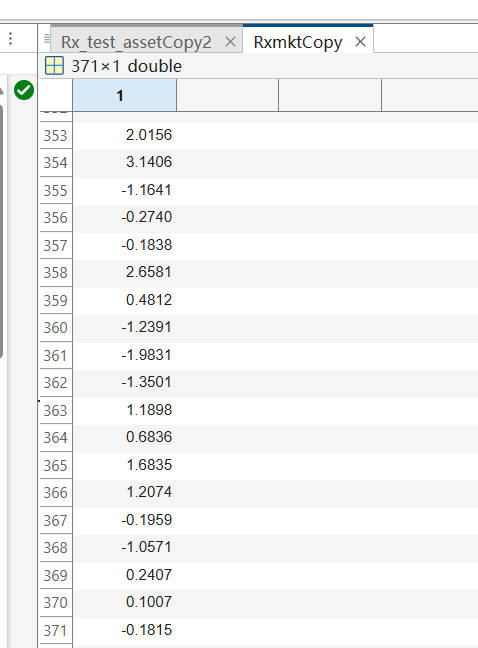
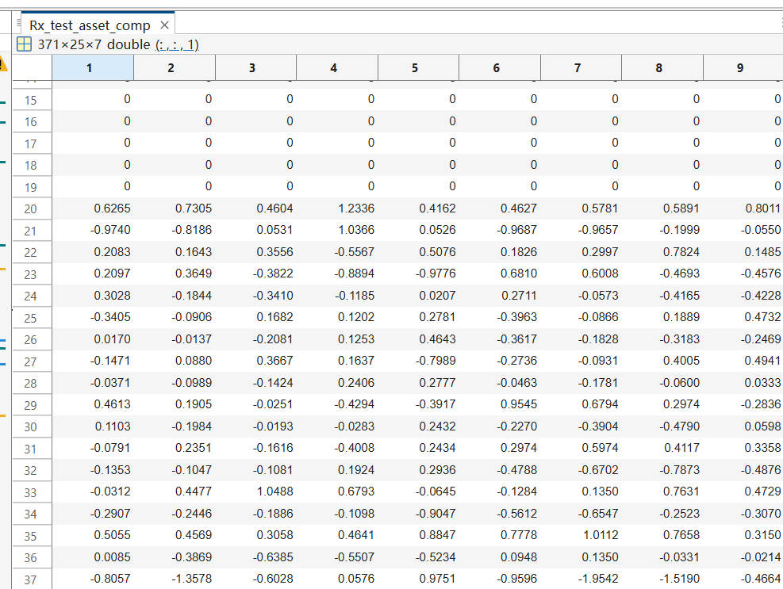

# 20241030 阶段工作总结

## 20241031

### Spectral factor models

> Second, contrary to analogous orthogonal representations using discrete Fourier transforms, the decomposition will be shown to be **a general property of the data generating process (with implications in terms of applicability and interpretability) rather than a property of the transformed data**.

$$
\begin{aligned}
\beta & =\frac{\mathbb{C}[y_t,x_t]}{\mathbb{V}[x_t]} \\
&=\frac{\mathbb{C}[y_t^{HF}+y_t^{LF},x_t^{HF}+x_t^{LF}]}{\mathbb{V}[x_t]} \\
&=\frac{\mathbb{C}[y_t^{HF},x_t^{HF}]}{\mathbb{V}[x_t]}+\frac{\mathbb{C}[y_t^{LF},x_t^{LF}]}{\mathbb{V}[x_t]} \\
&=\frac{\mathbb{V}[x_t^{HF}]}{\mathbb{V}[x_t]}\frac{\mathbb{C}[y_t^{HF},x_t^{HF}]}{\mathbb{V}[x_t^{HF}]}+\frac{\mathbb{V}[x_t^{LF}]}{\mathbb{V}[x_t]}\frac{\mathbb{C}[y_t^{LF},x_t^{LF}]}{\mathbb{V}[x_t^{LF}]} \\
&=\nu^{HF}\beta^{HF}+\nu^{LF}\beta^{LF}
\end{aligned}
$$

从这个公式中可以看出 traditional $\beta$ 的问题，就在于信息比率，对于一个 fast-moving factor 来说 $v^{\text{HF}} \gg v^{\text{LF}}$, 因此高频信息 dominate traditional $\beta$。但是在经济学中，尽管低频信息波动率很小，但是可能非常有用。

- Value portfolio 指的是，按照 book-to-market 排序后，high minus low
- 同理，Growth portfolio 指的是 low minus high

Tabel 2 中，widening of dispersion 指的是，从低频到高频，这两个组合的 spectral beta 相差越来越大，这表明这两个组合在不同频率上呈现出不同的特征。

接着，为了方便起见，将 $\beta$ 分为高频（低于一年）和低频（高于一年），再次进行回归，得到结果如下

$$
\begin{aligned}
R^{HF}_{p,t} &= \alpha + \beta^{HF}_p \times R^{HF}_{m,t} + u_t, \\
R^{LF}_{p,t} &= \alpha + \beta^{LF}_p \times R^{LF}_{m,t} + u_t.
\end{aligned}
$$

这一回归说明了三点，

1. widening dispersion
2. high frequency $\beta$ dominate
3. orthogonality between high frequency and low frequency

但是为什么下文在 *7. Cross-sectional pricing: the role of spectral betas* 中，却只取了低频 $j=6$ 呢？

这是由 25 Fama-French book-to-market and size sorted portfolios 决定的。这是这 25 个组合的 average return

这是不同频率的 market 与这 25 个组合的 spectral market covariance

从上图可以看出，只有 $j=6$ 的 Covariance 完美匹配了 25 portfolios 中的定价信息，

> the $j = 6$ spectral covariances being nicely aligned with average realized returns both in the size and in the value dimension. **In other words, they correspond to business cycle fluctuations**.

接着，作者就将这一成分称之为 "business cycle" component, 然后说下文只用这一 component 是一个自然的选择

> As emphasized, because we are interested in the potential of spectral factor models for both dimensionality reduction and economic interpretability, **focusing on a single, business cycle, component of the market return process is natural**.

这个 component 长这样

我个人的理解是，因为作者一直在说的就是，低频信息很重要，但是被高频 cover 了，第一部分的分析用以说明高频的主导作用，但是通过 pricing error 的分析，说明了作者的论点：尽管低频从 volatility 上不显著，但是非常的重要，所以实际上还是通过这一点说明了低频的重要性，接着过渡到下文的分析。

## 20241101

### Wold-decomposition

将 wold 的 matlab 代码转换为 python 并尝试运行。

Wold-de 原理上对于任意的序列都可以直接分解。

> Wold 比普通 Fourier Transformation 好的地方还在于划定了频率范围，因此可解释性更好一些。

## 20241102

### Wold-decomposition

为什么这个 test asset 里最后三行都是零？

371 就是 $T$ 的维度，因为 market 的维度就是 371 并且最后三行是有值的

最后输出的结果中，也是 371 但是前 19 行都是 0 。

这个 extend 到底 extend 在什么地方

### Identification

Compute wold component from var

在实际的计算过程中还使用到了 VAR ，首先需要理解这部分的理论。

需要使用到的数据包括 $\mathbf{x}_t = \begin{pmatrix} y_t, \tilde{\mathbf{x}}_t^\top \end{pmatrix}^\top \in \mathbb{R}^k$，其中 $y_t \in \mathbb{R}, \tilde{\mathbf{x}}_t \in \mathbb{R}^{k-1}$。 $y_t$ 可以理解为是资产收益率，$\tilde{\mathbf{x}}_t$ 可以是很多因子，或是因子和状态变量的和。

接着，假设 $\mathbf{x}_t$ 服从 $p$ 阶的 VAR 过程，

$$
\mathbf{x}_t = A_1 \mathbf{x}_{t-1} + \cdots + A_p \mathbf{x}_{t-p} + \boldsymbol{\varepsilon}_t,
$$

p 阶的 VAR 可以被写成 $kp$ 维度的 VAR(1)，如 $\mathbf{X}_t = \begin{pmatrix} \mathbf{x}_t^\top, \mathbf{x}_{t-1}^\top, \dots, \mathbf{x}_{t-p+1}^\top \end{pmatrix}^\top$，因此有

$$
\mathbf{X}_t = A \mathbf{X}_{t-1} + U_t,
$$

Under standard assumptions, stable VAR 有时不变的均值和方差协方差矩阵，这其实也就是 Wold representation 的存在条件。The stability of the process 保证了 VAR operator $(I_{kp} - AL)^{-1} = \sum_{k=0}^{\infty} \boldsymbol{\alpha}_k L^k $ 的存在，其中 $\boldsymbol{\alpha}_k = A^{k}$。因此 $\mathbf{X}_t$ 就可以表示成 Wold moving average representation 的形式

$$
\mathbf{x}_t = \sum_{k=0}^{\infty} \boldsymbol{\alpha}_k U_{t-k}.
$$

所以估计流程如下：

- 假设一个 VAR(p) 的 process
- 并通过 unrestricted least squares 估计出转换后的 VAR(1) 模型，因此也就得到了 wold coefficients $\boldsymbol{\alpha} = A^k$
- 接着通过下式估计出 extened Wold representation

$$
\Psi_k^{(j)} = \frac{1}{\sqrt{2^j}} \left( \sum_{i=0}^{2^{j-1}-1} \boldsymbol{\alpha}_{k 2^j + i} - \sum_{i=0}^{2^{j-1}-1} \boldsymbol{\alpha}_{k 2^j + 2^{j-1} + i} \right),
$$

- 接着通过下式就可以得到频率成分

$$
\begin{aligned}
\varepsilon_t^{(j)} &= \frac{1}{\sqrt{2^j}} \left( \sum_{i=0}^{2^{j-1}-1} \varepsilon_{t-i} - \sum_{i=0}^{2^{j-1}-1} \varepsilon_{t-2^{j-1}-i} \right). \\
\begin{pmatrix} y_t \\ x_t \end{pmatrix} &= \sum_{j=1}^{\infty} \sum_{k=0}^{\infty} \Psi_k^{(j)} \varepsilon_{t - k 2^j}^{(j)} = \sum_{j=1}^{\infty} \mathbf{x}_t^{(j)}
\end{aligned}
$$

#### Incorporating economic restrictions: identifications in practice

We account for **predictability in market returns**. We do so by setting the vector $\tilde{\mathbf{x}}_t$ as being **the market excess return** followed by three state variables:

- **the yield spread between long-term and short-term bonds** (measured as the difference between the ten-year constant maturity bond yield and the yield on short-term notes, in annualized percentage points)
- **the market's price-dividend ratio** (measured as the logarithmic ratios of the CRSP price index and a one-year moving average of dividends)
- **the small-stock value spread** (measured as the difference between the logarithmic book-to-market ratio of small value and small growth stocks)

具体来说，就是对每一个测试资产，$y$，都会估计出

$$
\begin{aligned}
y_t &= a_y + A_{1,y} Y_{t-1} + A_{2,y} \circ \tilde{\mathbf{X}}_{t-1} + \varepsilon_t^1, \\
\tilde{\mathbf{x}}_t &= a_x + A_{1,x} Y_{t-1} + A_{2,x} \circ \tilde{\mathbf{X}}_{t-1} + \varepsilon_t^2,
\end{aligned}
$$

其中 $Y_{t-1} = \begin{pmatrix} y_{t-1}, y_{t-2}, \dots, y_{t-p} \end{pmatrix}^\top，  \tilde{\mathbf{X}}_{t-1} = \begin{pmatrix} \tilde{\mathbf{x}}_{t-1},\tilde{\mathbf{x}}_{t-2}, \dots, \tilde{\mathbf{x}}_{t-p} \end{pmatrix}^\top$。

需要注意的是，其中 $A_{1,x}=0$，这意味着 $y$  不会 Granger cause $\tilde{\mathbf{x}}。$

> 不过这样的话，wold-decomposition 得到的就**不只是 market 的低频，相当于是利用了其他三个变量的信息**。

## Todo 

- Smooth in US market
- Coskewness
- 先分解再计算和先计算再分解，有没有数学上的一致性？
